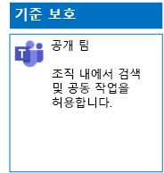
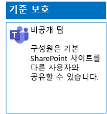
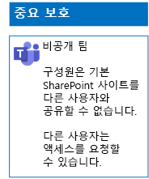

# 파일의 3단계 보호를 위한 Teams 배포

이 문서의 단계를 사용하여 초기, 중요 및 극비 팀을 디자인하고 배포합니다. 이러한 3계층 보호에 대한 자세한 내용은 [Microsoft Teams에서의 파일 보호](secure-files-in-teams.md)를 참조하세요.

## 기준 팀

초기 보호에는 공용 및 비공개 팀이 모두 포함됩니다. 공개 팀은 조직의 모든 사용자가 검색하고 액세스할 수 있습니다. 개인 사이트는 팀과 연결된 Office 365 그룹의 구성원만 검색하고 액세스할 수 있습니다. 이러한 유형의 팀은 모두 구성원이 다른 사용자와 사이트를 공유할 수 있습니다.

### 공개

[이 문서](https://support.office.com/article/174adf5f-846b-4780-b765-de1a0a737e2b)의 지침에 따라 공용 액세스 및 사용 권한이 있는 기준 팀을 만듭니다.

구성 결과는 다음과 같습니다.

### 비공개

[이 문서](https://support.office.com/article/174adf5f-846b-4780-b765-de1a0a737e2b)의 지침에 따라 개인 액세스 및 사용 권한이 있는 기준 팀을 만듭니다.

구성 결과는 다음과 같습니다.

## 중요 팀

중요한 팀의 경우 먼저 [비공개 팀 만들기](https://support.office.com/article/174adf5f-846b-4780-b765-de1a0a737e2b)로 시작합니다.

다음으로, 팀 구성원이 공유하지 못하도록 기본 SharePoint 사이트를 구성합니다.

1. 팀의 도구 막대에서 **파일**을 클릭합니다.

2. 줄임표를 클릭한 다음 **SharePoint에서 열기**를 클릭합니다.

3. 기본 SharePoint 사이트의 도구 막대에서 설정 아이콘을 클릭한 다음 **사이트 사용 권한**을 클릭합니다.

4. **사이트 사용 권한** 창에 있는 **공유 설정**에서 **공유 설정 변경**을 클릭합니다.

5. **사용 권한 공유**에서 **사이트 소유자만 파일, 폴더 및 사이트를 공유할 수 있습니다**를 선택하고 **저장**을 클릭합니다.

구성 결과는 다음과 같습니다.

## 극비 팀

극비 팀의 경우 먼저 [비공개 팀 만들기](https://support.office.com/article/174adf5f-846b-4780-b765-de1a0a737e2b)로 시작합니다.

다음으로, 팀 구성원이 공유하고 팀 구성원이 아닌 사용자가 액세스 요청을 못하도록 기본 SharePoint 사이트를 구성합니다.

1. 팀의 도구 막대에서 **파일**을 클릭합니다.

2. 줄임표를 클릭한 다음 **SharePoint에서 열기**를 클릭합니다.

3. 기본 SharePoint 사이트의 도구 막대에서 설정 아이콘을 클릭한 다음 **사이트 사용 권한**을 클릭합니다.

4. **사이트 사용 권한** 창에 있는 **공유 설정**에서 **공유 설정 변경**을 클릭합니다.

5. **사용 권한 공유**에서 **사이트 소유자만 파일, 폴더 및 사이트를 공유할 수 있습니다**를 선택합니다.

6. **액세스 요청 허용**을 해제한 다음, **저장**을 클릭합니다.

구성 결과는 다음과 같습니다.

## 다음 단계

[보존 레이블 및 DLP를 사용하여 팀에서 파일을 보호](deploy-teams-retention-DLP.md)

## 참고 항목

[Microsoft Teams에서의 파일 보호](secure-files-in-teams.md)

[클라우드 도입 및 하이브리드 솔루션](https://docs.microsoft.com/office365/enterprise/cloud-adoption-and-hybrid-solutions)
