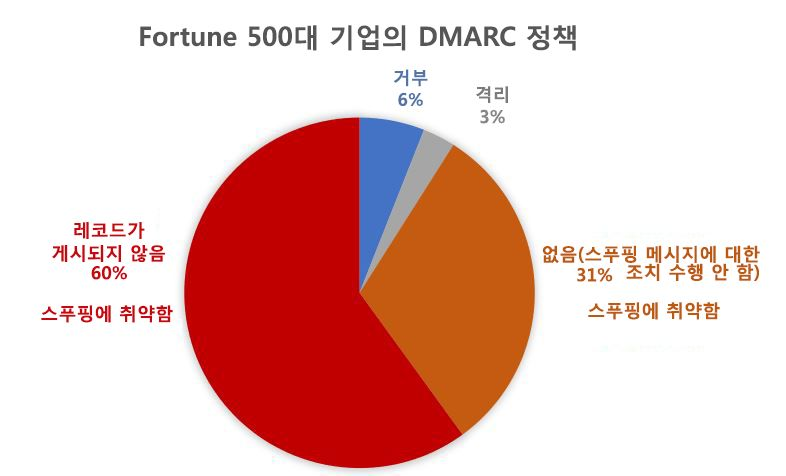
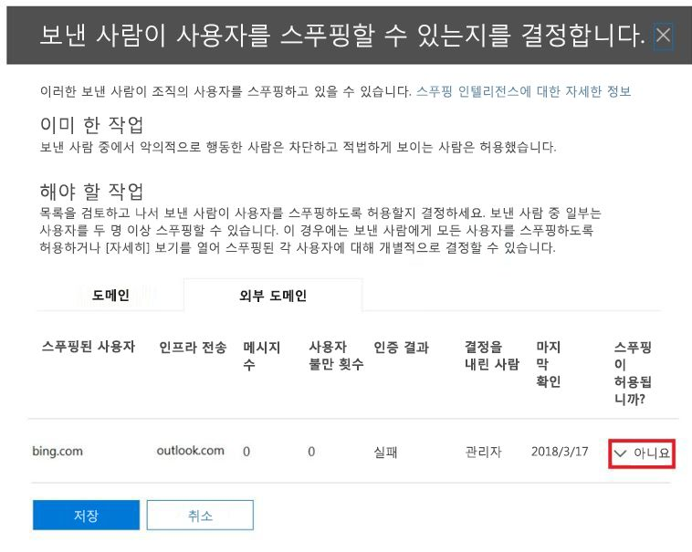

# <a name="email-authentication-in-microsoft-365"></a><span data-ttu-id="fd081-103">Microsoft 365에서 전자 메일 인증</span><span class="sxs-lookup"><span data-stu-id="fd081-103">Email authentication in Microsoft 365</span></span>

<span data-ttu-id="fd081-104">전자 메일 인증(전자 메일 유효성 검사라고도 함)은 스푸핑(위조된 보낸 사람의 전자 메일 메시지)방지를 시도하는 표준 그룹입니다.</span><span class="sxs-lookup"><span data-stu-id="fd081-104">Email authentication (also known as email validation) is a group of standards that tries to stop spoofing (email messages from forged senders).</span></span> <span data-ttu-id="fd081-105">Exchange Online 사서함 및 Exchange Online 사서함이 없는 독립 실행형 EOP(Exchange Online Protection) 조직과 함께 Microsoft 365 조직에서 EOP는 표준을 사용하여 전자 메일을 확인합니다.</span><span class="sxs-lookup"><span data-stu-id="fd081-105">In Microsoft 365 organizations with Exchange Online mailboxes and standalone Exchange Online Protection (EOP) organizations without Exchange Online mailboxes, EOP useses the standards to verify inbound email:</span></span>

- [<span data-ttu-id="fd081-106">SPF</span><span class="sxs-lookup"><span data-stu-id="fd081-106">SPF</span></span>](how-office-365-uses-spf-to-prevent-spoofing.md)

- [<span data-ttu-id="fd081-107">DKIM</span><span class="sxs-lookup"><span data-stu-id="fd081-107">DKIM</span></span>](support-for-validation-of-dkim-signed-messages.md)

- [<span data-ttu-id="fd081-108">DMARC</span><span class="sxs-lookup"><span data-stu-id="fd081-108">DMARC</span></span>](use-dmarc-to-validate-email.md)

<span data-ttu-id="fd081-109">전자 메일 인증은 보낸 사람의 전자 메일 메시지(예: laura@contoso.com)가 합법적이고 해당 전자 메일 도메인(예: contoso.com)에 대한 예상 출처에서 제공되는지 확인합니다.</span><span class="sxs-lookup"><span data-stu-id="fd081-109">Email authentication verifies that email messages from a sender (for example, laura@contoso.com) are legitimate and come from expected sources for that email domain (for example, contoso.com.)</span></span>

<span data-ttu-id="fd081-110">이 항목의 나머지 부분에서는 이러한 기술이 작동하는 방식 및 EOP가 해당 기술을 사용하여 인바운드 전자 메일을 확인하는 방법에 대해 설명합니다.</span><span class="sxs-lookup"><span data-stu-id="fd081-110">The rest of this topic explains how these technologies work, and how EOP uses them to check inbound email.</span></span>

## <a name="use-email-authentication-to-help-prevent-spoofing"></a><span data-ttu-id="fd081-111">스푸핑을 방지하는 데 도움이 되는 전자 메일 인증의 사용</span><span class="sxs-lookup"><span data-stu-id="fd081-111">Use email authentication to help prevent spoofing</span></span>

<span data-ttu-id="fd081-112">DMARC는 메시지에서 **보낸** 주소 (전자 메일 클라이언트에서 사용자에게 표시되는 보낸 사람의 전자 메일 주소)를 검사하여 스푸핑을 방지합니다.</span><span class="sxs-lookup"><span data-stu-id="fd081-112">DMARC prevents spoofing by examining the **From** address in messages (the sender email address that users see in their email client).</span></span> <span data-ttu-id="fd081-113">또한 대상 전자 메일 조직은 전자 메일 도메인이 SPF 또는 DKIM을 통과했음을 확인할 수 있습니다. 즉, 도메인이 인증되었기 때문에 스푸핑되지 않았습니다.</span><span class="sxs-lookup"><span data-stu-id="fd081-113">Destination email organizations can also verify that the email domain has passed SPF or DKIM, which means that the domain has been authenticated and is therefore not spoofed.</span></span> 

<span data-ttu-id="fd081-114">그러나 전자 메일 인증(통칭하여 전자 메일 인증 정책이라고 함)에 대한 DNS의 SPF, DKIM 및 DMARC 레코드가 완전히 선택되는 문제가 발생합니다.</span><span class="sxs-lookup"><span data-stu-id="fd081-114">However, the problem is that SPF, DKIM, and DMARC records in DNS for email authentication (collectively known as email authentication policies) are completely optional.</span></span> <span data-ttu-id="fd081-115">따라서 microsoft.com 및 skype.com과 같은 강력한 전자 메일 인증 정책을 사용하는 도메인은 스푸핑으로부터 보호되지만, 전자 메일 인증 정책을 약하게 게시하거나 전혀 정책을 게시하지 않는 도메인은 스푸핑의 주요 대상이 됩니다.</span><span class="sxs-lookup"><span data-stu-id="fd081-115">Therefore, while domains with strong email authentication policies like microsoft.com and skype.com are protected from spoofing, domains that publish weaker email authentication policies, or no policy at all, are prime targets for being spoofed.</span></span>

<span data-ttu-id="fd081-116">2018년 3월 현재 Fortune지 500대 기업의 도메인 중 9%만이 강력한 전자 메일 인증 정책을 게시했습니다.</span><span class="sxs-lookup"><span data-stu-id="fd081-116">As of March 2018, only 9% of domains of companies in the Fortune 500 publish strong email authentication policies.</span></span> <span data-ttu-id="fd081-117">회사의 나머지 91%는 공격자가 스푸핑하고 있을 수 있습니다.</span><span class="sxs-lookup"><span data-stu-id="fd081-117">The remaining 91% of companies might be spoofed by a attacker.</span></span> <span data-ttu-id="fd081-118">현재 위치에 일부 다른 전자 메일 필터링 메커니즘이 없는 경우 이러한 도메인에 있는 스푸핑된 보낸 사람의 전자 메일이 사용자에게 전달될 수 있습니다.</span><span class="sxs-lookup"><span data-stu-id="fd081-118">Unless some other email filtering mechanism is in-place, email from spoofed senders in these domains might be delivered to users.</span></span>



<span data-ttu-id="fd081-120">Fortune 500대 기업에 속하지 않은 중소 규모의 기업 중 강력한 전자 메일 인증 정책을 게시하는 기업의 비율은 더욱 낮으며 여전히 북미 및 서유럽 이외의 지역의 전자 메일 도메인에서도 낮습니다.</span><span class="sxs-lookup"><span data-stu-id="fd081-120">The proportion of small-to-medium sized companies that are not in the Fortune 500 that publish strong email authentication policies is smaller, and smaller still for email domains that are outside of North America and western Europe.</span></span>

<span data-ttu-id="fd081-121">이는 기업은 전자 메일 인증의 작동 방식을 알지 못하는 반면 공격자는 이를 완벽하게 이해하고 활용하기 때문에 큰 문제입니다.</span><span class="sxs-lookup"><span data-stu-id="fd081-121">This is a big problem because while enterprises may not be aware of how email authentication works, attackers fully understand and take advantage it.</span></span> <span data-ttu-id="fd081-122">피싱이 그 예이며 강력한 전자 메일 인증 정책의 제한된 채택으로 인해 Microsoft는 *암시적 전자 메일 인증*을 사용하여 인바운드 전자 메일을 확인합니다.</span><span class="sxs-lookup"><span data-stu-id="fd081-122">Because phishing is such a problem, and because of the limited adoption of strong email authentication policies, Microsoft uses *implicit email authentication* to check inbound email.</span></span>

<span data-ttu-id="fd081-123">암시적 전자 메일 인증은 정기적인 전자 메일 인증 정책에 대한 다양한 확장으로 빌드됩니다.</span><span class="sxs-lookup"><span data-stu-id="fd081-123">Implicit email authentication is built on numerous extensions to regular email authentication policies.</span></span> <span data-ttu-id="fd081-124">이러한 확장에는 보낸 사람의 평판, 보낸 사람 기록, 받는 사람 기록, 행태 분석 및 기타 고급 기법이 포함됩니다.</span><span class="sxs-lookup"><span data-stu-id="fd081-124">These extensions include sender reputation, sender history, recipient history, behavioral analysis, and other advanced techniques.</span></span> <span data-ttu-id="fd081-125">전자 메일 인증 정책을 사용하지 않는 도메인에서 보낸 메시지는 해당 메시지가 합법적임을 나타내는 다른 신호가 없는 경우 스푸핑으로 표시됩니다.</span><span class="sxs-lookup"><span data-stu-id="fd081-125">A message sent from a domain that doesn't use email authentication policies will be marked as spoof unless it contains other signals to indicate that it's legitimate.</span></span>

<span data-ttu-id="fd081-126">Microsoft의 일반 공지 사항을 확인하려면 [피싱의 세계 2장 - Microsoft 365의 향상된 스푸핑 방지](https://techcommunity.microsoft.com/t5/Security-Privacy-and-Compliance/Schooling-A-Sea-of-Phish-Part-2-Enhanced-Anti-spoofing/ba-p/176209)를 참조하십시오.</span><span class="sxs-lookup"><span data-stu-id="fd081-126">To see Microsoft's general announcement, see [A Sea of Phish Part 2 - Enhanced Anti-spoofing in Microsoft 365](https://techcommunity.microsoft.com/t5/Security-Privacy-and-Compliance/Schooling-A-Sea-of-Phish-Part-2-Enhanced-Anti-spoofing/ba-p/176209).</span></span>

## <a name="composite-authentication"></a><span data-ttu-id="fd081-127">복합 인증</span><span class="sxs-lookup"><span data-stu-id="fd081-127">Composite authentication</span></span>

<span data-ttu-id="fd081-128">SPF, DKIM 및 DMARC는 모두 유용하지만 메시지에 명시적인 인증 레코드가 없는 경우 충분한 인증 상태를 전달하지 못합니다.</span><span class="sxs-lookup"><span data-stu-id="fd081-128">While SPF, DKIM, and DMARC are all useful by themselves, they don't communicate enough authentication status in the event a message has no explicit authentication records.</span></span> <span data-ttu-id="fd081-129">따라서 Microsoft는 여러 개의 신호를 단일 값(_복합 인증_) 또는 간단하게 compauth로 결합하는 암시적 전자 메일 인증 알고리즘을 개발했습니다.</span><span class="sxs-lookup"><span data-stu-id="fd081-129">Therefore, Microsoft has developed an algorithm for implicit email authentication that combines multiple signals into a single value called _composite authentication_, or compauth for short.</span></span> <span data-ttu-id="fd081-130">Compauth 값은 메시지 머리글에서 **Authentication-Results** 헤더로 스탬프됩니다.</span><span class="sxs-lookup"><span data-stu-id="fd081-130">The compauth value is stamped into the **Authentication-Results** header in the message headers.</span></span>

> <span data-ttu-id="fd081-131">Authentication-Results:</span><span class="sxs-lookup"><span data-stu-id="fd081-131">Authentication-Results:</span></span><br/><span data-ttu-id="fd081-132">&nbsp;&nbsp;&nbsp;compauth=\<fail | pass | softpass | none\> reason=\<yyy\></span><span class="sxs-lookup"><span data-stu-id="fd081-132">&nbsp;&nbsp;&nbsp;compauth=\<fail | pass | softpass | none\> reason=\<yyy\></span></span>

<span data-ttu-id="fd081-133">이러한 값은 [Authentication-results 메시지 헤더](anti-spam-message-headers.md#authentication-results-message-header)에서 설명됩니다.</span><span class="sxs-lookup"><span data-stu-id="fd081-133">These values are explained at [Authentication-results message header](anti-spam-message-headers.md#authentication-results-message-header).</span></span>

<span data-ttu-id="fd081-134">메시지 머리글을 검사하여 관리자 또는 심지어 최종 사용자는 Microsoft 365가 보낸 사람이 스푸핑된 것으로 결정하는 방법을 확인할 수 있습니다.</span><span class="sxs-lookup"><span data-stu-id="fd081-134">By examining the message headers, admins or even end users can determine how Microsoft 365 determined that the sender is spoofed.</span></span>

## <a name="why-email-authentication-is-not-always-enough-to-stop-spoofing"></a><span data-ttu-id="fd081-135">전자 메일 인증만으로 스푸핑을 막지 못하는 이유</span><span class="sxs-lookup"><span data-stu-id="fd081-135">Why email authentication is not always enough to stop spoofing</span></span>

<span data-ttu-id="fd081-136">들어오는 메시지의 스푸핑 여부를 확인하는 전자 메일 인증 레코드에만 신뢰를 설정하려면 다음과 같은 제한 사항이 있습니다.</span><span class="sxs-lookup"><span data-stu-id="fd081-136">Relying only on email authentication records to determine if an incoming message is spoofed has the following limitations:</span></span>

- <span data-ttu-id="fd081-137">보내는 도메인에 필수 DNS 레코드가 없거나 레코드가 잘못 구성되었을 수 있습니다.</span><span class="sxs-lookup"><span data-stu-id="fd081-137">The sending domain might lack the required DNS records, or the records are incorrectly configured.</span></span>

- <span data-ttu-id="fd081-138">원본 도메인에 DNS 레코드가 올바르게 구성되어 있지만 해당 도메인이 보낸 사람 주소의 도메인과 일치하지 않습니다.</span><span class="sxs-lookup"><span data-stu-id="fd081-138">The source domain has correctly configured DNS records, but that domain doesn't match the domain in the From address.</span></span> <span data-ttu-id="fd081-139">SPF 및 DKIM은 보낸 사람 주소에서 사용된 도메인을 필요하지 않습니다.</span><span class="sxs-lookup"><span data-stu-id="fd081-139">SPF and DKIM don't require the domain to be used in the From address.</span></span> <span data-ttu-id="fd081-140">공격자 또는 합법적 서비스는 도메인을 등록하고 도메인에 대한 SPF 및 DKIM을 구성하고 보낸 사람 주소에서 완전히 다른 도메인을 사용하고 해당 메시지는 SPF 및 DKIM을 통과합니다.</span><span class="sxs-lookup"><span data-stu-id="fd081-140">Attackers or legitimate services can register a domain, configure SPF and DKIM for the domain, use a completely different domain in the From address, and that message will pass SPF and DKIM.</span></span>

<span data-ttu-id="fd081-141">복합 인증은 전자 메일 인증 확인을 실패할 수 있는 메시지를 통과하여 이러한 제한을 해결할 수 있습니다.</span><span class="sxs-lookup"><span data-stu-id="fd081-141">Composite authentication can address these limitations by passing messages that would otherwise fail email authentication checks.</span></span>

> [!NOTE]
> <span data-ttu-id="fd081-142">앞서 설명한 대로 암시적 전자 메일 인증은 여러 신호를 사용하여 메시지의 합법 여부를 확인합니다.</span><span class="sxs-lookup"><span data-stu-id="fd081-142">As described earlier, implicit email authentication uses multiple signals to determine if a message is legitimate.</span></span> <span data-ttu-id="fd081-143">간단히 하기 위해 다음 예시는 전자 메일 인증 결과에 중점을 두고 있습니다.</span><span class="sxs-lookup"><span data-stu-id="fd081-143">For simplicity, the following examples concentrate on email authentication results.</span></span> <span data-ttu-id="fd081-144">다른 백 엔드 인텔리전스 요소는 스푸핑된 것으로 전자 메일 인증을 통과하는 메시지나 합법적인 것으로 전자 메일 인증을 실패한 메시지를 식별할 수 있습니다.</span><span class="sxs-lookup"><span data-stu-id="fd081-144">Other back-end intelligence factors could identify messages that pass email authentication as spoofed, or messages that fail email email authentication as legitimate.</span></span>

<span data-ttu-id="fd081-145">예를 들어 fabrikam.com 도메인에는 SPF, DKIM 또는 DMARC 레코드가 없습니다.</span><span class="sxs-lookup"><span data-stu-id="fd081-145">For example, the fabrikam.com domain has no SPF, DKIM, or DMARC records.</span></span> <span data-ttu-id="fd081-146">fabrikam.com 도메인에서 보낸 사람의 메시지가 복합 인증에 실패할 수 있습니다. (`compauth` 값과 이유를 참고하세요.)</span><span class="sxs-lookup"><span data-stu-id="fd081-146">Messages from senders in the fabrikam.com domain can fail composite authentication (note the `compauth` value and reason):</span></span>

```text
Authentication-Results: spf=none (sender IP is 10.2.3.4)
  smtp.mailfrom=fabrikam.com; contoso.com; dkim=none
  (message not signed) header.d=none; contoso.com; dmarc=none
  action=none header.from=fabrikam.com; compauth=fail reason=001
From: chris@fabrikam.com
To: michelle@contoso.com
```

<span data-ttu-id="fd081-147">fabrikam.com이 DKIM레코드 없이 SPF를 구성하는 경우 해당 메시지는 복합 인증을 통과할 수 있습니다. SPF를 통과한 도메인이 보낸 사람 주소의 도메인과 일치하기 때문입니다.</span><span class="sxs-lookup"><span data-stu-id="fd081-147">If fabrikam.com configures an SPF without a DKIM record, the message can pass composite authentication, because the domain that passed SPF is aligned with the domain in the From address:</span></span>

```text
Authentication-Results: spf=pass (sender IP is 10.2.3.4)
  smtp.mailfrom=fabrikam.com; contoso.com; dkim=none
  (message not signed) header.d=none; contoso.com; dmarc=bestguesspass
  action=none header.from=fabrikam.com; compauth=pass reason=109
From: chris@fabrikam.com
To: michelle@contoso.com
```

<span data-ttu-id="fd081-148">fabrikam.com이 SPF레코드 없이 DKIM 레코드를 구성하는 경우 해당 메시지는 복합 인증을 통과할 수 있습니다. DKIM 서명을 통과한 도메인이 보낸 사람 주소의 도메인과 일치하기 때문입니다.</span><span class="sxs-lookup"><span data-stu-id="fd081-148">If fabrikam.com configures a DKIM record without an SPF record, the message can pass composite authentication, because the domain in the passed DKIM signature is aligned with the domain in the From address:</span></span>

```text
Authentication-Results: spf=none (sender IP is 10.2.3.4)
  smtp.mailfrom=fabrikam.com; contoso.com; dkim=pass
  (signature was verified) header.d=outbound.fabrikam.com;
  contoso.com; dmarc=bestguesspass action=none
  header.from=fabrikam.com; compauth=pass reason=109
From: chris@fabrikam.com
To: michelle@contoso.com
```

<span data-ttu-id="fd081-149">SPF의 도메인 또는 DKIM 서명이 보낸 사람 주소의 도메인과 일치하지 않으면 메시지는 복합 인증을 실패할 수 있습니다.</span><span class="sxs-lookup"><span data-stu-id="fd081-149">If the domain in SPF or the DKIM signature don't align with the domain in the From address, the message can fail composite authentication:</span></span>

```text
Authentication-Results: spf=none (sender IP is 192.168.1.8)
  smtp.mailfrom=maliciousdomain.com; contoso.com; dkim=pass
  (signature was verified) header.d=maliciousdomain.com;
  contoso.com; dmarc=none action=none header.from=contoso.com;
  compauth=fail reason=001
From: chris@contoso.com
To: michelle@fabrikam.com
```

## <a name="solutions-for-legitimate-senders-who-are-sending-unauthenticated-email"></a><span data-ttu-id="fd081-150">인증되지 않은 전자 메일을 보내는 합법적인 보낸 사람을 위한 솔루션</span><span class="sxs-lookup"><span data-stu-id="fd081-150">Solutions for legitimate senders who are sending unauthenticated email</span></span>

<span data-ttu-id="fd081-151">Microsoft 365는 조직에 인증되지 않은 전자 메일을 보내는 사람을 추적합니다.</span><span class="sxs-lookup"><span data-stu-id="fd081-151">Microsoft 365 keeps track of who is sending unauthenticated email to your organization.</span></span> <span data-ttu-id="fd081-152">서비스가 보낸 사람이 합법적이지 않다고 여기는 경우 이를 복합 인증 실패로 표시합니다.</span><span class="sxs-lookup"><span data-stu-id="fd081-152">If the service thinks the sender is not legitimate, it will mark it as a composite authentication failure.</span></span> <span data-ttu-id="fd081-153">이를 방지하기 위해 해당 섹션의 권장 사항을 사용할 수 있습니다.</span><span class="sxs-lookup"><span data-stu-id="fd081-153">To avoid this, you can use the recommendations in this section.</span></span>

### <a name="configure-email-authentication-for-domains-you-own"></a><span data-ttu-id="fd081-154">사용자가 소유하는 도메인에 대한 전자 메일 인증 구성</span><span class="sxs-lookup"><span data-stu-id="fd081-154">Configure email authentication for domains you own</span></span>

<span data-ttu-id="fd081-155">해당 방법은 여러 테넌트를 소유하거나 이들과 상호 작용하는 경우 조직 내 스푸핑 및 도메인 간 스푸핑 문제를 해결하는 데 사용할 수 있습니다.</span><span class="sxs-lookup"><span data-stu-id="fd081-155">You can use this method to resolve intra-org spoofing and cross-domain spoofing in cases where you own or interact with multiple tenants.</span></span> <span data-ttu-id="fd081-156">또한 사용자가 Microsoft 365 내의 다른 고객과 다른 공급업체에서 호스팅하는 타사에게 보내는 도메인 간 스푸핑 문제를 해결하는 데 도움이 될 수 있습니다.</span><span class="sxs-lookup"><span data-stu-id="fd081-156">It also helps resolve cross-domain spoofing where you send to other customers within Microsoft 365 or third parties that are hosted by other providers.</span></span>

- <span data-ttu-id="fd081-157">사용자의 도메인에 대한 [SPF 레코드 구성](set-up-spf-in-office-365-to-help-prevent-spoofing.md)</span><span class="sxs-lookup"><span data-stu-id="fd081-157">[Configure SPF records](set-up-spf-in-office-365-to-help-prevent-spoofing.md) for your domains.</span></span>

- <span data-ttu-id="fd081-158">사용자의 주 도메인에 대한 [DKIM 레코드 구성](use-dkim-to-validate-outbound-email.md)</span><span class="sxs-lookup"><span data-stu-id="fd081-158">[Configure DKIM records](use-dkim-to-validate-outbound-email.md) for your primary domains.</span></span>

- <span data-ttu-id="fd081-159">합법적인 보낸 사람을 확인하기 위한 도메인에서 [DMARC 레코드 설정 고려](use-dmarc-to-validate-email.md)</span><span class="sxs-lookup"><span data-stu-id="fd081-159">[Consider setting up DMARC records](use-dmarc-to-validate-email.md) for your domain to determine your legitimate senders.</span></span>

<span data-ttu-id="fd081-160">Microsoft는 SPF, DKIM 및 DMARC 레코드에 대한 세부 구현 지침을 제공하지 않습니다.</span><span class="sxs-lookup"><span data-stu-id="fd081-160">Microsoft doesn't provide detailed implementation guidelines for SPF, DKIM, and DMARC records.</span></span> <span data-ttu-id="fd081-161">그러나 사용할 수 있는 온라인 정보가 많습니다.</span><span class="sxs-lookup"><span data-stu-id="fd081-161">However, there's a lot of information available online.</span></span> <span data-ttu-id="fd081-162">조직에서 전자 메일 인증 레코드를 설정할 수 있도록 지원하는 타사도 있습니다.</span><span class="sxs-lookup"><span data-stu-id="fd081-162">There are also 3rd party companies dedicated to helping your organization set up email authentication records.</span></span>

#### <a name="you-dont-know-all-sources-for-your-email"></a><span data-ttu-id="fd081-163">전자 메일에 대해 모든 출처를 알 수 없습니다.</span><span class="sxs-lookup"><span data-stu-id="fd081-163">You don't know all sources for your email</span></span>

<span data-ttu-id="fd081-164">많은 도메인이 SPF 레코드를 게시하지 않습니다. 이는 도메인에서 메시지에 대한 모든 전자 메일 출처를 알 수 없기 때문입니다.</span><span class="sxs-lookup"><span data-stu-id="fd081-164">Many domains don't publish SPF records because they don't know all of the email sources for messages in their domain.</span></span> <span data-ttu-id="fd081-165">알 수 있는 모든 전자 메일 출처(특히 회사 트래픽의 위치)를 포함한 SPF 레코드를 게시하여 시작하고 중립 SPF 정책 `?all`을 게시합니다.</span><span class="sxs-lookup"><span data-stu-id="fd081-165">Start by publishing an SPF record that contains all of the email sources you know about (especially where your corporate traffic is located), and publish the neutral SPF policy `?all`.</span></span> <span data-ttu-id="fd081-166">예시:</span><span class="sxs-lookup"><span data-stu-id="fd081-166">For example:</span></span>

```text
fabrikam.com IN TXT "v=spf1 include:spf.fabrikam.com ?all"
```

<span data-ttu-id="fd081-167">이 예시는 회사 인프라에서 받은 전자 메일은 전자 메일 인증을 통과하지만 알 수 없는 출처의 전자 메일은 다시 중립적으로 돌아간다는 것을 의미합니다.</span><span class="sxs-lookup"><span data-stu-id="fd081-167">This example means that email from your corporate infrastructure will pass email authentication, but email from unknown sources will fall back to neutral.</span></span>

<span data-ttu-id="fd081-168">Microsoft 365는 회사 인프라에서 인바운드 전자 메일을 인증된 것으로 취급하지만 알 수 없는 출처에서 보낸 전자 메일은 계속 스푸핑된 것으로 표시될 수 있습니다(Microsoft 365의 암시적 인증 가능 여부에 따라).</span><span class="sxs-lookup"><span data-stu-id="fd081-168">Microsoft 365 will treat inbound email from your corporate infrastructure as authenticated, but email from unidentified sources might still be marked as spoof (depending upon whether Microsoft 365 can implicitly authenticate it).</span></span> <span data-ttu-id="fd081-169">그러나 이는 여전히 Microsoft 365가 스푸핑된 것으로 표시한 모든 전자 메일에서 개선해야 할 사항입니다.</span><span class="sxs-lookup"><span data-stu-id="fd081-169">However, this is still an improvement from all email being marked as spoof by Microsoft 365.</span></span>

<span data-ttu-id="fd081-170">`?all`의 SPF 대체 정책을 시작하면 메시지에 대한 전자 메일 원본을 단계적으로 검색하고 더 많은 전자 메일 원본을 포함한 후 보다 엄격한 정책으로 SPF 레코드를 업데이트할 수 있습니다.</span><span class="sxs-lookup"><span data-stu-id="fd081-170">Once you've gotten started with an SPF fallback policy of `?all`, you can gradually discover and include more email sources for your messages, and then update your SPF record with a stricter policy.</span></span>

### <a name="use-spoof-intelligence-to-configure-permitted-senders-of-unauthenticated-email"></a><span data-ttu-id="fd081-171">스푸핑 인텔리전스를 사용하여 인증되지 않은 전자 메일의 허용된 보낸 사람 구성</span><span class="sxs-lookup"><span data-stu-id="fd081-171">Use spoof intelligence to configure permitted senders of unauthenticated email</span></span>

<span data-ttu-id="fd081-172">또한 [스푸핑 인텔리전스](learn-about-spoof-intelligence.md)를 사용하여 보낸 사람이 인증되지 않은 메시지를 조직에 전송하도록 허용할 수 있습니다.</span><span class="sxs-lookup"><span data-stu-id="fd081-172">You can also use [spoof intelligence](learn-about-spoof-intelligence.md) to permit senders to transmit unauthenticated messages to your organization.</span></span>

<span data-ttu-id="fd081-173">외부 도메인의 경우 스푸핑된 사용자는 보낸 사람 주소의 도메인이며 보내는 인프라는 원본 IP 주소(/24 CIDR 범위로 분리) 또는 역방한 DNS(PTR) 레코드의 조직 도메인입니다.</span><span class="sxs-lookup"><span data-stu-id="fd081-173">For external domains, the spoofed user is the domain in the From address, while the sending infrastructure is either the source IP address (divided up into /24 CIDR ranges), or the organizational domain of the reverse DNS (PTR) record.</span></span>

<span data-ttu-id="fd081-174">아래의 스크린 샷에서 원본 IP는 PTR 레코드 outbound.mail.protection.outlook.com과 함께 131.107.18.4일 수 있습니다.</span><span class="sxs-lookup"><span data-stu-id="fd081-174">In the screenshot below, the source IP might be 131.107.18.4 with the PTR record outbound.mail.protection.outlook.com.</span></span> <span data-ttu-id="fd081-175">이는 보내는 인프라에 대한 outlook.com으로 표시됩니다.</span><span class="sxs-lookup"><span data-stu-id="fd081-175">This would show up as outlook.com for the sending infrastructure.</span></span>

<span data-ttu-id="fd081-176">이 보낸 사람이 인증되지 않은 전자 메일을 보낼 수 있도록 허용하려면 **아니요**를 **예**로 변경하십시오.</span><span class="sxs-lookup"><span data-stu-id="fd081-176">To permit this sender to send unauthenticated email, change the **No** to a **Yes**.</span></span>



### <a name="create-an-allow-entry-for-the-senderrecipient-pair"></a><span data-ttu-id="fd081-178">보낸 사람/받는 사람 쌍에 대한 허용 항목 만들기</span><span class="sxs-lookup"><span data-stu-id="fd081-178">Create an allow entry for the sender/recipient pair</span></span>

<span data-ttu-id="fd081-179">피싱 필터링의 일부이지만 특정 보낸 사람에 대해 맬웨어 필터링이 아닌 스팸 필터링을 무시하려면 [Microsoft 365에서 안전한 보낸 사람 목록 생성](create-safe-sender-lists-in-office-365.md)을 참조하세요.</span><span class="sxs-lookup"><span data-stu-id="fd081-179">To bypass spam filtering, some parts of phish filtering, but not malware filtering for specific senders, see [Create safe sender lists in Microsoft 365](create-safe-sender-lists-in-office-365.md).</span></span>

### <a name="ask-the-sender-to-configure-email-authentication-for-domains-you-dont-own"></a><span data-ttu-id="fd081-180">보낸 사람이 사용자가 소유하지 않는 도메인에 대해 전자 메일 인증을 구성하도록 요청합니다.</span><span class="sxs-lookup"><span data-stu-id="fd081-180">Ask the sender to configure email authentication for domains you don't own</span></span>

<span data-ttu-id="fd081-181">스팸 및 피싱 문제로 인해 Microsoft는 모든 전자 메일 조직에 대해 전자 메일 인증을 권장합니다.</span><span class="sxs-lookup"><span data-stu-id="fd081-181">Because of the problem of spam and phishing, Microsoft recommends email authentication for all email organizations.</span></span> <span data-ttu-id="fd081-182">조직에서 수동 재정의를 구성하는 대신 보내는 도메인의 관리자에게 전자 메일 인증 레코드를 구성하도록 요청할 수 있습니다.</span><span class="sxs-lookup"><span data-stu-id="fd081-182">Instead of configuring manual overrides in your organization, you can ask an admin in the sending domain to configure their email authentication records.</span></span>

- <span data-ttu-id="fd081-183">과거에 전자 메일 인증 레코드를 게시하지 않아도 되는 경우에도 전자 메일을 Microsoft에 보내는 경우 이를 수행해야 했습니다.</span><span class="sxs-lookup"><span data-stu-id="fd081-183">Even if they didn't need to publish email authentication records in the past, they should do so if they send email to Microsoft.</span></span>

- <span data-ttu-id="fd081-184">도메인의 보내는 IP 주소를 게시하려면 SPF를 설정하고 DKIM(사용 가능한 경우)도 설정하여 메시지에 디지털 서명을 합니다.</span><span class="sxs-lookup"><span data-stu-id="fd081-184">Set up SPF to publish the domain's sending IP addresses, and set up DKIM (if available) to digitally sign messages.</span></span> <span data-ttu-id="fd081-185">DMARC 레코드 설정도 고려할 수 있습니다.</span><span class="sxs-lookup"><span data-stu-id="fd081-185">They should also consider setting up DMARC records.</span></span>

- <span data-ttu-id="fd081-186">대규모의 보낸 사람을 사용하여 전자 메일을 대신 보내는 경우 보낸 사람 주소의 도메인 (속해 있는 경우)이 SPF 또는 DMARC를 통과하는 도메인과 일치하는지 확인합니다.</span><span class="sxs-lookup"><span data-stu-id="fd081-186">If they use bulk senders to send email on their behalf, verify that the domain in the From address (if it belongs to them) aligns with the domain that passes SPF or DMARC.</span></span>

- <span data-ttu-id="fd081-187">다음 위치(사용하는 경우)가 SPF 레코드에 포함되는지 확인합니다.</span><span class="sxs-lookup"><span data-stu-id="fd081-187">Verify the following locations (if they use them) are included in the SPF record:</span></span>
  
  - <span data-ttu-id="fd081-188">온-프레미스 전자 메일 서버</span><span class="sxs-lookup"><span data-stu-id="fd081-188">On-premises email servers.</span></span>
  - <span data-ttu-id="fd081-189">SaaS (서비스로서의 소프트웨어) 공급자에서 보낸 전자 메일입니다.</span><span class="sxs-lookup"><span data-stu-id="fd081-189">Email sent from a software-as-a-service (SaaS) provider.</span></span>
  - <span data-ttu-id="fd081-190">클라우드 호스팅 서비스(Microsoft Azure, GoDaddy, Rackspace, Amazon 웹 서비스 등)에서 보낸 전자 메일입니다.</span><span class="sxs-lookup"><span data-stu-id="fd081-190">Email sent from a cloud-hosting service (Microsoft Azure, GoDaddy, Rackspace, Amazon Web Services, etc.).</span></span>

- <span data-ttu-id="fd081-191">ISP에서 호스트하는 소규모 도메인의 경우에는 ISP의 지침에 따라 SPF 레코드를 구성합니다.</span><span class="sxs-lookup"><span data-stu-id="fd081-191">For small domains that are hosted by an ISP, configure the SPF record according to the instructions from the ISP.</span></span>

<span data-ttu-id="fd081-192">처음에는 도메인을 인증 받기가 어려울 수 있지만 시간이 지남에 따라 더 많은 이메일 필터가 정킹 또는 전자 메일 거부를 시작하면 더 나은 전달을 보장하기 위해 적절한 레코드를 설정하게 됩니다.</span><span class="sxs-lookup"><span data-stu-id="fd081-192">While it may be difficult at first to get sending domains to authenticate, over time, as more and more email filters start junking or even rejecting their email, it will cause them to set up the proper records to ensure better delivery.</span></span> <span data-ttu-id="fd081-193">또한 해당 참여는 피싱과의 싸움에 도움을 줄 수 있으며 해당 조직이나 전자 메일을 보낸 조직에서 피싱 가능성을 줄일 수 있습니다.</span><span class="sxs-lookup"><span data-stu-id="fd081-193">Also, their participation can help in the fight against phishing, and can reduce the possibility of phishing in their organization or organizations that they send email to.</span></span>

#### <a name="information-for-infrastructure-providers-isps-esps-or-cloud-hosting-services"></a><span data-ttu-id="fd081-194">인프라 공급자(ISP, ESP 또는 클라우드 호스팅 서비스)에 대한 정보</span><span class="sxs-lookup"><span data-stu-id="fd081-194">Information for infrastructure providers (ISPs, ESPs, or cloud hosting services)</span></span>

<span data-ttu-id="fd081-195">도메인 전자 메일을 호스팅하거나 전자 메일을 보낼 수있는 호스팅 인프라를 제공하는 경우 다음의 단계를 수행해야 합니다.</span><span class="sxs-lookup"><span data-stu-id="fd081-195">If you host a domain's email or provide hosting infrastructure that can send email, you should do the following steps:</span></span>

- <span data-ttu-id="fd081-196">고객에게 SPF 레코드를 구성하는 방법을 설명하는 문서를 제공하도록 보장합니다.</span><span class="sxs-lookup"><span data-stu-id="fd081-196">Ensure your customers have documentation that explains how your customers should configure their SPF records</span></span>

- <span data-ttu-id="fd081-197">고객이 명시적으로 설정하지 않은 경우(기본 도메인으로 서명)에도 아웃바운드 전자 메일에서 DKIM 서명에 서명하는 것을 고려합니다.</span><span class="sxs-lookup"><span data-stu-id="fd081-197">Consider signing DKIM-signatures on outbound email, even if the customer doesn't explicitly set it up (sign with a default domain).</span></span> <span data-ttu-id="fd081-198">DKIM 서명을 사용하여 이메일을 이중 서명 할 수도 있습니다(고객 도메인을 설정한 경우 한 번, 회사의 DKIM 서명을 사용하는 경우 두 번째 서명).</span><span class="sxs-lookup"><span data-stu-id="fd081-198">You can even double-sign the email with DKIM signatures (once with the customer's domain if they have set it up, and a second time with your company's DKIM signature)</span></span>

<span data-ttu-id="fd081-199">플랫폼에서 발생하는 전자 메일을 인증하더라도 Microsoft에 대한 제공 가능성은 보장되지 않지만 적어도 인증되지 않은 이유로 Microsoft가 전자 메일을 스팸으로 처리하지 않도록 합니다.</span><span class="sxs-lookup"><span data-stu-id="fd081-199">Deliverability to Microsoft is not guaranteed even if you authenticate email originating from your platform, but at least it ensures that Microsoft does not junk your email because it isn't authenticated.</span></span>

<span data-ttu-id="fd081-200">서비스 공급자의 모범 사례에 대한 자세한 내용은 [M3AAWG 모바일 메시징 서비스 제공자의 모범 사례](https://www.m3aawg.org/sites/default/files/M3AAWG-Mobile-Messaging-Best-Practices-Service-Providers-2015-08.pdf)를 참조하세요.</span><span class="sxs-lookup"><span data-stu-id="fd081-200">For more details on service providers best practices, see [M3AAWG Mobile Messaging Best Practices for Service Providers](https://www.m3aawg.org/sites/default/files/M3AAWG-Mobile-Messaging-Best-Practices-Service-Providers-2015-08.pdf).</span></span>
