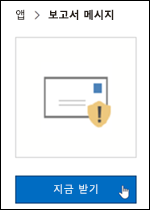
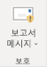
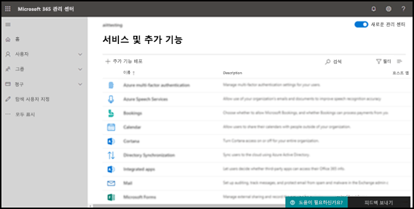
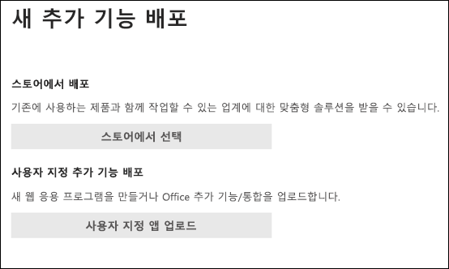
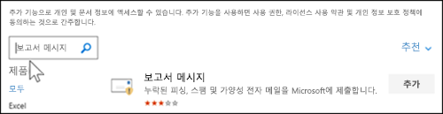
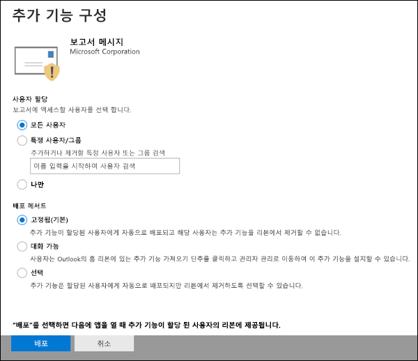
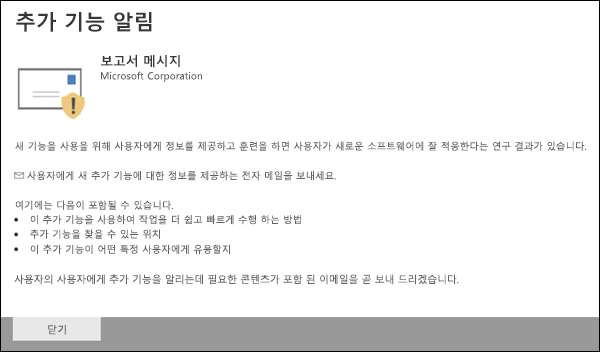
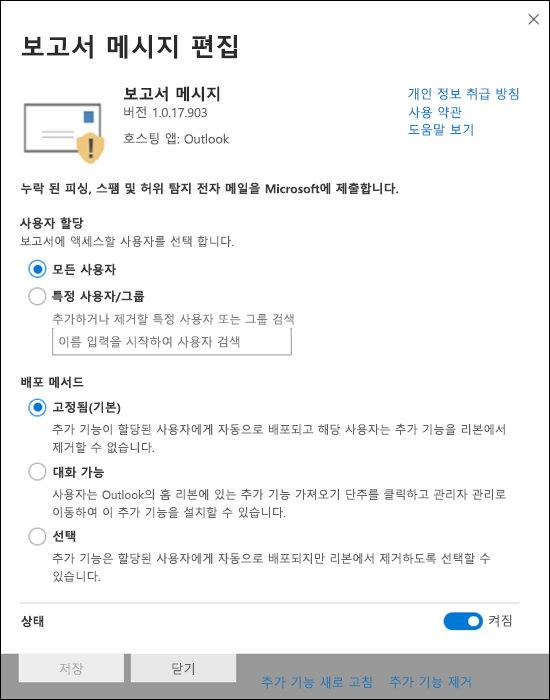
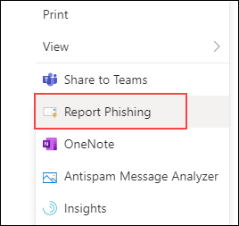

# 보고서 메시지 또는 보고서 피싱 추가 기능 사용

[!INCLUDE [Microsoft 365 Defender rebranding](../includes/microsoft-defender-for-office.md)]

**적용 대상**
- [Exchange Online Protection](exchange-online-protection-overview.md)
- [Office 365용 Microsoft Defender 플랜 1 및 플랜 2](defender-for-office-365.md)
- [Microsoft 365 Defender](../defender/microsoft-365-defender.md)

> [!NOTE]
> 사서함이 있는 Microsoft 365 조직의 관리자는 Exchange Online 포털의 제출 페이지를 사용하는 Microsoft 365 Defender 좋습니다.  자세한 내용은 관리 제출을 사용하여 의심되는 스팸, 피싱, URL 및 파일을 Microsoft에 제출을 [참조하세요.](admin-submission.md)

Outlook 및 웹용 Outlook(이전의 Outlook Web App)에 대한 피싱 보고 추가 기능을 사용하면 사용자가 분석을 위해 Microsoft 및 계열사에 가음성(나쁜 것으로 표시된 좋은 전자 메일) 또는 거짓 부정(잘못된 전자 메일 허용)을 쉽게 보고할 수 있습니다.

Microsoft는 이러한 제출을 사용하여 전자 메일 보호 기술의 효율성을 향상합니다. 예를 들어 피싱 보고 추가 기능을 사용하여 많은 메시지를 보고하는 사람이 많은 경우를 가정해 보겠습니다. 이 정보는 보안 대시보드 및 기타 보고서에 표시됩니다. 조직의 보안 팀은 이 정보를 피싱 방지 정책을 업데이트해야 할 수 있습니다.

보고서 메시지 또는 피싱 보고 추가 기능을 설치할 수 있습니다. 사용자가 스팸 및 피싱 메시지를 모두 보고하게 하려는 경우 조직에 보고서 메시지 추가 기능을 배포합니다. 자세한 내용은 Enable the Report Message add-in을 참조하십시오.

보고서 메시지 추가 기능은 스팸 및 피싱 메시지를 모두 보고하는 옵션을 제공합니다. 관리자는 조직에 대해 보고서 메시지 추가 기능을 사용하도록 설정할 수 있으며 개별 사용자는 이를 직접 설치할 수 있습니다.

피싱 보고 추가 기능은 피싱 메시지만 보고하는 옵션을 제공합니다. 관리자는 조직에 대해 피싱 보고 추가 기능을 사용하도록 설정할 수 있으며 개별 사용자는 이를 직접 설치할 수 있습니다.

개별 사용자인 경우 추가 기능을 모두 사용하도록 설정할 수 있습니다.

전역 관리자 또는 Exchange Online 관리자로서 Exchange OAuth 인증을 사용하도록 구성된 경우 조직에 대해 보고서 메시지 추가 기능 및 피싱 보고 추가 기능을 사용하도록 설정할 수 있습니다. 이제 중앙 집중식 배포를 통해 두 추가 [기능을 모두 사용할 수 있습니다.](../../admin/manage/centralized-deployment-of-add-ins.md)

## 시작하기 전에 알아야 할 사항은 무엇인가요?

- 보고서 메시지 추가 기능 및 피싱 보고 추가 기능 모두 대부분의 Microsoft 365 및 다음 제품과 함께 작동합니다.
  - 웹용 Outlook
  - Outlook 2013 SP1 이상
  - Mac용 Outlook 2016
  - Outlook 앱용 Microsoft 365 포함된 Enterprise
  - Outlook iOS 및 Android용 앱

- 두 추가 기능을 모두 공유 사서함 또는 조직에 있는 사서함에 사용할 Exchange 없습니다.

- 기존 웹 브라우저는 보고서 메시지와 피싱 보고 추가 기능 둘 다에서 작동해야 합니다. 그러나 추가 기능을 사용할 수 없는 경우 또는 예상대로 작동하지 않는 경우 다른 브라우저를 사용해 보십시오.

- 조직 설치의 경우 OAuth 인증을 사용하도록 조직을 구성해야 합니다. 자세한 내용은 추가 기능의 중앙 집중식 배포가 조직에 [적합한지 확인을 참조하세요.](../../admin/manage/centralized-deployment-of-add-ins.md)

- 관리자는 전역 관리자 역할 그룹의 구성원이 해야 합니다. 자세한 내용은 [Microsoft 365 Defender 포털 권한](permissions-microsoft-365-security-center.md)을 참조하세요.

- 보고서 메시지 기능을 사용하여 메시지를 보고하는 방법에 대한 자세한 내용은 report [false positives and false negatives in Outlook.](report-false-positives-and-false-negatives.md)

- URL 필터링 또는 보안 솔루션(예: Proxy 및 FireWall)이 있는 조직은 HTTPS 프로토콜에서 ipagave.azurewebsites.net outlook.office.com 끝점에 도달할 수 있도록 허용해야 합니다.

> [!IMPORTANT]
> 사용자 제출 정책을 사용할 수 Outlook 기본 제공 보고 환경은 사용하지 [않는 것이 좋습니다.](./user-submission.md) 대신 보고서 메시지 추가 기능 또는 피싱 보고 추가 기능을 사용하는 것이 좋습니다.

## 보고서 메시지 추가 기능 확인

### 직접 보고서 메시지 추가 기능 확인

1. 에서 Microsoft AppSource로 이동하여 보고서 메시지 추가 기능을 <https://appsource.microsoft.com/marketplace/apps> 검색합니다. 보고서 메시지 추가 기능으로 직접 이동하기 위해 로 <https://appsource.microsoft.com/product/office/wa104381180> 이동하십시오.

2. 지금 **다운로드를 클릭합니다.**

   

3. 나타나는 대화 상자에서 사용 약관 및 개인 정보 취급 방침을 검토한 다음 계속을 **클릭합니다.**

4. 직장 또는 학교 계정(업무용) 또는 Microsoft 계정(개인용)을 사용하여 로그인합니다.

추가 기능을 설치하고 사용하도록 설정하면 다음과 같은 아이콘이 표시됩니다.

- 이 Outlook 아이콘은 다음과 같습니다.

  > [!div class="mx-imgBorder"]
  > 

- 이 웹용 Outlook 아이콘은 다음과 같습니다.

  > [!div class="mx-imgBorder"]
  > 

### 조직에 대한 보고서 메시지 추가 기능 확인

> [!NOTE]
> 추가 기능을 조직에 표시하는 데 최대 12시간이 걸릴 수 있습니다.

1. In the Microsoft 365 관리 센터, go to the **설정** \> **Add-ins** page <https://admin.microsoft.com/AdminPortal/Home#/Settings/AddIns> at. 추가 기능 페이지가  없는 경우 통합 앱 **페이지 설정** 통합 앱 추가 기능 링크로 \>  \>  이동합니다. 

2. 페이지 **맨** 위에 있는 추가 기능 배포를 선택하고 다음 을 **선택합니다.**

   

3. 새 **추가 기능** 배포 플라이아웃이 나타나면 정보를 검토하고 다음을 **클릭합니다.**

4. 다음 페이지에서 **스토어에서 선택을 클릭합니다.**

   

5. 나타나는 **추가 기능** 선택 페이지에서 검색 상자를 **클릭하고** 보고서 **메시지** 를 입력한 다음 검색 검색 **아이콘을**  클릭합니다. 결과 목록에서 보고서 **메시지를 찾은 다음** 추가 를 **클릭합니다.**

   

6. 나타나는 대화 상자에서 라이선스 및 개인 정보 보호 정보를 검토한 다음 계속을 **클릭합니다.**

7. 나타나는 **추가 기능 구성** 페이지에서 다음 설정을 구성합니다.

   - **할당된 사용자:** 다음 값 중 하나를 선택합니다.
     - **모든** 사용자(기본값)
     - **특정 사용자/그룹**
     - **저뿐이에요**

   - **배포 방법:** 다음 값 중 하나를 선택합니다.
     - **고정(기본값)**: 추가 기능은 지정된 사용자에게 자동으로 배포되며 제거할 수 없습니다.
     - **사용** 가능: 사용자는 홈 추가  기능 추가 기능 관리자가 관리하는 에서 추가 기능을 설치할 \>  \> **수 있습니다.**
     - **선택** 사항: 추가 기능을 지정된 사용자에게 자동으로 배포하지만 제거를 선택할 수 있습니다.

   

   완료되면 배포를 **클릭합니다.**

8. 보고서 **메시지** 배포 페이지에 나타나는 진행률 보고서와 추가 기능 배포 확인이 표시됩니다. 정보를 읽은 후 다음 을 **클릭합니다.**

   

9. 추가 기능 발표 **페이지가** 나타나면 정보를 검토하고 닫기 를 **클릭합니다.**

   

## 보고서 메시지 추가 기능의 설정 검토 또는 편집

1. In the Microsoft 365 관리 센터, go to the go to the **설정** \> **Add-ins** page <https://admin.microsoft.com/AdminPortal/Home#/Settings/AddIns> at. 추가 기능 페이지가  없는 경우 통합 앱 **페이지 설정** 통합 앱 추가 기능 링크로 \>  \>  이동합니다. 

   

2. 보고서 메시지 **추가** 기능을 찾아 선택합니다.

3. 보고서 **메시지 편집** 플라이아웃이 나타나면 조직에 적합한 설정을 검토하고 편집합니다. 작업을 마친 후 **저장** 을 클릭합니다.

   

## 피싱 보고서 추가 기능 얻기

### 직접 피싱 보고 추가 기능 사용

1. 에서 Microsoft AppSource로 이동하여 피싱 보고 추가 <https://appsource.microsoft.com/marketplace/apps> 기능을 검색합니다.

2. 지금 **다운로드를 클릭합니다.**

3. 나타나는 대화 상자에서 사용 약관 및 개인 정보 취급 방침을 검토한 다음 계속을 **클릭합니다.**

4. 직장 또는 학교 계정(업무용) 또는 Microsoft 계정(개인용)을 사용하여 로그인합니다.

추가 기능을 설치하고 사용하도록 설정하면 다음과 같은 아이콘이 표시됩니다.

- 이 Outlook 아이콘은 다음과 같습니다.

  

- 이 웹용 Outlook 아이콘은 다음과 같습니다.

  > [!div class="mx-imgBorder"]
  > 

### 조직의 피싱 보고 추가 기능 확인

> [!NOTE]
> 추가 기능을 조직에 표시하는 데 최대 12시간이 걸릴 수 있습니다.

1. In the Microsoft 365 관리 센터, go to the go to the **설정** \> **Add-ins** page <https://admin.microsoft.com/AdminPortal/Home#/Settings/AddIns> at. 추가 기능 페이지가  없는 경우 통합 앱 **페이지 설정** 통합 앱 추가 기능 링크로 \>  \>  이동합니다. 

2. 페이지 **맨** 위에 있는 추가 기능 배포를 선택하고 다음 을 **선택합니다.**

   

3. 새 **추가 기능** 배포 플라이아웃이 나타나면 정보를 검토하고 다음을 **클릭합니다.**

4. 다음 페이지에서 **스토어에서 선택을 클릭합니다.**

   

5. 나타나는 **추가 기능** 선택 페이지에서 검색 상자를 **클릭하고** 피싱 보고를 **입력한** 다음 검색 검색 **아이콘을**  결과 목록에서 피싱 **보고를 찾은** 다음 추가 를 **클릭합니다.**

6. 나타나는 대화 상자에서 라이선스 및 개인 정보 보호 정보를 검토한 다음 계속을 **클릭합니다.**

7. 나타나는 **추가 기능 구성** 페이지에서 다음 설정을 구성합니다.

   - **할당된 사용자:** 다음 값 중 하나를 선택합니다.
     - **모든** 사용자(기본값)
     - **특정 사용자/그룹**
     - **저뿐이에요**

   - **배포 방법:** 다음 값 중 하나를 선택합니다.
     - **고정(기본값)**: 추가 기능은 지정된 사용자에게 자동으로 배포되며 제거할 수 없습니다.
     - **사용** 가능: 사용자는 홈 추가  기능 추가 기능 관리자가 관리하는 에서 추가 기능을 설치할 \>  \> **수 있습니다.**
     - **선택** 사항: 추가 기능을 지정된 사용자에게 자동으로 배포하지만 제거를 선택할 수 있습니다.

   완료되면 배포를 **클릭합니다.**

8. 보고서 **피싱** 배포 페이지에 나타나는 진행률 보고서와 추가 기능 배포 확인이 표시됩니다. 정보를 읽은 후 다음 을 **클릭합니다.**

9. 추가 기능 발표 **페이지가** 나타나면 정보를 검토하고 닫기 를 **클릭합니다.**

## 피싱 보고 추가 기능 설정 검토 또는 편집

1. In the Microsoft 365 관리 센터, go to the go to the **설정** \> **Add-ins** page <https://admin.microsoft.com/AdminPortal/Home#/Settings/AddIns> at. 추가 기능 페이지가  없는 경우 통합 앱 **페이지 설정** 통합 앱 추가 기능 링크로 \>  \>  이동합니다. 

2. 피싱 **보고 추가** 기능을 찾아 선택합니다.

3. 조직에 **적합한** 설정이 나타나는 피싱 보고서 편집 플라이아웃에서 설정을 검토하고 편집합니다. 작업을 마쳤으면 **저장** 을 클릭합니다.
