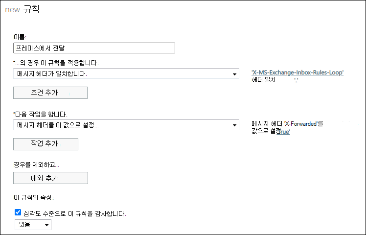

# 전자 메일에서 자동 외부 전자 메일 전달 Microsoft 365

[!INCLUDE [Microsoft 365 Defender rebranding](../includes/microsoft-defender-for-office.md)]

**적용 대상**
- [Exchange Online Protection](exchange-online-protection-overview.md)
- [Office 365용 Microsoft Defender 플랜 1 및 플랜 2](defender-for-office-365.md)
- [Microsoft 365 Defender](../defender/microsoft-365-defender.md)

관리자는 외부 받는 사람(조직 외부의 받는 사람)에게 자동으로 전달되는 메시지를 제한하거나 제어해야 하는 회사 요구 사항이 있을 수 있습니다. 전자 메일 전달은 유용할 수 있지만 잠재적인 정보 공개로 인해 보안 위험이 발생할 수도 있습니다. 공격자는 이 정보를 사용하여 조직 또는 파트너를 공격할 수 있습니다.

다음 유형의 자동 전달을 사용할 수 Microsoft 365.

- 사용자는 받은  편지함 규칙을 구성하여 메시지를 외부 보낸 사람(고의적으로 또는 계정이 손상된 결과)에게 자동으로 전달할 수 있습니다.
- 관리자는 외부  받는 사람에게 메시지를 자동으로 전달하도록 사서함 _전달(SMTP_ 전달)을 구성할 수 있습니다. 관리자는 단순히 메시지를 전달할지 또는 사서함에 전달된 메시지의 복사본을 보관할지 선택할 수 있습니다.

> [!NOTE]
> 전자 메일 시스템을 통해 Microsoft 365 자동 전달을 하는 사용자에게는 예정된 업데이트의 클라우드 사서함과 동일한 정책 제어가 적용됩니다. 이 업데이트는 메시지 센터 게시물을 통해 전달됩니다.

아웃바운드 스팸 필터 정책을 사용하여 외부 받는 사람에게 자동 전달을 제어할 수 있습니다. 세 가지 설정을 사용할 수 있습니다.

- **자동 - 시스템 제어:** 자동 외부 전달이 차단됩니다. 메시지의 내부 자동 전달은 계속 작동됩니다. 기본 설정입니다.
- **On:** 자동 외부 전달이 허용되고 제한되지 않습니다.
- **Off:** 자동 외부 전달이 사용하지 않도록 설정되어 있으며 보낸 사람에 대한 배달되지 않는 보고서(NDR 또는 반송 메시지라고도 알려지음)가 표시됩니다.

이러한 설정을 구성하는 방법에 대한 지침은 [EOP에서 아웃바운드 스팸 필터링 구성을 참조하세요.](configure-the-outbound-spam-policy.md)

> [!NOTE]
>
> - 자동 전달을 사용하지 않도록 설정하면 메시지를 외부 주소로 리디렉션하는 받은 편지함 규칙(사용자) 또는 사서함 전달(관리자)을 사용할 수 없습니다.
>
> - 내부 사용자 간의 메시지 자동 전달은 아웃바운드 스팸 필터 정책의 설정에 의해 영향을 받지 않습니다.

## 아웃바운드 스팸 필터 정책 설정이 다른 자동 전자 메일 전달 컨트롤에서 작동되는 방식

관리자는 자동 전자 메일 전달을 허용하거나 차단하도록 다른 컨트롤을 이미 구성한 것일 수 있습니다. 예제:

- [일부 또는](/exchange/mail-flow-best-practices/remote-domains/remote-domains) 모든 외부 도메인으로 자동 전자 메일 전달을 허용하거나 차단하는 원격 도메인
- 외부 받는 사람에게 자동으로  전달되는 Exchange 검색하고 차단하기 위한 메일 흐름 규칙(전송 규칙)의 조건 및 작업

원격 도메인 설정 및 메일 흐름 규칙은 아웃바운드 스팸 필터 정책의 설정과 독립적입니다. 예제:

- 원격 도메인에 대해 자동 전달을 허용하지만 아웃바운드 스팸 필터 정책에서 자동 전달을 차단합니다. 이 예에서는 자동으로 전달된 메시지가 차단됩니다.
- 아웃바운드 스팸 필터 정책에서 자동 전달을 허용하지만 메일 흐름 규칙 또는 원격 도메인 설정을 사용하여 자동으로 전달되는 전자 메일을 차단합니다. 이 예에서는 메일 흐름 규칙 또는 원격 도메인 설정이 자동으로 전달되는 메시지를 차단합니다.

이 기능을 독립적으로 사용하면 아웃바운드 스팸 필터 정책에서 자동 전달을 허용하지만 원격 도메인을 사용하여 사용자가 메시지를 전달할 수 있는 외부 도메인을 제어할 수 있습니다.

## 자동으로 전달되는 사용자를 찾는 방법

클라우드 기반 계정에 대한 자동 전달 메시지 보고서에서 외부  받는 사람에게 메시지를 자동으로 전달하는 사용자에 대한 정보를 볼 수 있습니다. 전자 메일 시스템을 통해 해당 전자 메일 시스템에서 자동으로 전달하는 Microsoft 365 이러한 사용자를 추적하는 메일 흐름 규칙을 만들어야 합니다. 메일 흐름 규칙을 만드는 방법에 대한 지침은 EAC를 사용하여 메일 흐름 [규칙 만들기를 참조하세요.](/exchange/security-and-compliance/mail-flow-rules/manage-mail-flow-rules#use-the-eac-to-create-a-mail-flow-rule)

EAC(Exchange 관리 센터)에서 메일 흐름 규칙을 만드는 데 필요한 정보는 다음과 같습니다.

- **다음 경우 이 규칙을 적용합니다(조건):** **메시지** 헤더가 \> **다음 텍스트 패턴과 일치합니다.** 참고 이 옵션을 보려면 추가 **옵션을** 클릭해야 할 수 있습니다.
  - **헤더 이름**: `X-MS-Exchange-Inbox-Rules-Loop`
  - **헤더 값**: `.`

  **'X-MS-Exchange-Inbox-Rules-Loop'** 헤더는 **'.'**

  이 조건은 헤더의 모든 값과 일치합니다.

- (선택 사항) **다음을** 수행(작업): 선택적 작업을 구성할 수 있습니다. 예를 들어 메시지 속성  수정 작업을 사용하여 메시지 헤더를 설정하고 헤더 이름 \>  **X-Forwarded** 및 값 True 를 사용할 **수 있습니다.** 그러나 작업을 구성할 필요는 없습니다.
- 심각도 **수준이 있는** 감사를 **낮음,** 중간 또는 높음 값으로 **설정** 이 설정을 사용하면 전송  규칙 Exchange 전달하는 사용자의 세부 정보를 얻을 수 있습니다.

## 차단된 전자 메일 전달 메시지

메시지가 자동으로 전달된 것으로 감지되고 아웃바운드 스팸  필터 정책이 해당 활동을 차단하면 다음 정보가 포함된 NDR의 보낸 사람에 메시지가 반환됩니다. 

`5.7.520 Access denied, Your organization does not allow external forwarding. Please contact your administrator for further assistance. AS(7555)`
