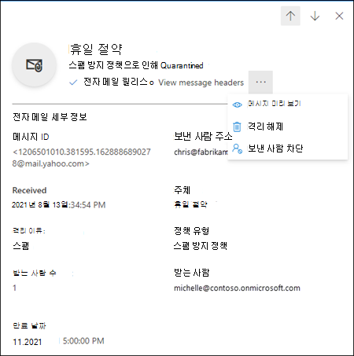
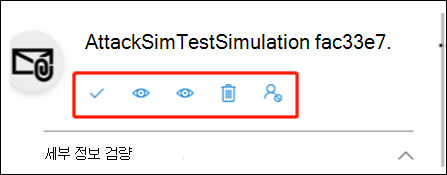
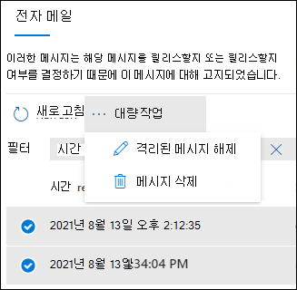

# EOP에서 사용자 권한으로 격리된 메시지 찾기 및 해제하기

[!INCLUDE [Microsoft 365 Defender rebranding](../includes/microsoft-defender-for-office.md)]

**적용 대상**
- [Exchange Online Protection](exchange-online-protection-overview.md)
- [Office 365용 Microsoft Defender 플랜 1 및 플랜 2](defender-for-office-365.md)
- [Microsoft 365 Defender](../defender/microsoft-365-defender.md)

Exchange Online 사서함이 있는 Microsoft 365 조직 또는 Exchange Online 사서함이 없는 독립 실행형 EOP(Exchange online Protection) 조직에서 격리는 위험할 가능성이 있거나 원치 않는 메시지를 보유합니다. 자세한 내용은 [EOP 격리](quarantine-email-messages.md)를 참조하세요.

다음 표에는 일반 사용자(관리자가 아님)가 스팸으로 분류된 메일의 수신자로서 사용할 수 있는 **기본** 기능이 설명되어 있습니다.

 

****

|격리 이유:|보기|릴리스|삭제|
|---|:---:|:---:|:---:|
|**스팸 방지 정책.**||||
|대량||||
|스팸||||
|높은 정확도 스팸||||
|피싱||||
|높은 정확도 피싱||||
|**피싱 방지 정책**||||
|EOP의 스푸핑 인텔리전스 보호||||
|Defender for Office 365의 가장된 사용자 보호||||
|Office 365용 Defender의 가장된 도메인 보호||||
|Defender for Office 365의 사서함 인텔리전스 보호||||
|**맬웨어 방지 정책**||||
|맬웨어로 격리된 첨부 파일이 있는 이메일 메시지입니다.||||
|**Defender for Office 365의 안전한 첨부 파일**||||
|악성 첨부 파일이 있는 전자 메일 메시지를 맬웨어로 격리하는 안전한 첨부 파일 정책입니다.||||
|악성 파일을 맬웨어로 격리하는 SharePoint, OneDrive 및 Microsoft Teams용 안전한 첨부 파일입니다.||||
|**메일 흐름 규칙(전송 규칙)**||||
|전자 메일 메시지를 격리하는 메일 흐름 규칙입니다.||||
|

_격리 정책_ 은 [지원되는 기능](quarantine-policies.md#step-2-assign-a-quarantine-policy-to-supported-features)에서 메일이 스팸으로 분류된 이유에 따라 사용자가 스팸으로 분류된 메일에 대해 수행할 수 있는 작업을 정의합니다. 기본 격리 정책은 이전 표에 설명된 대로 기록 기능을 적용합니다. 관리자는 지원되는 기능에서 사용자에 대해 덜 제한적이거나 더 제한적인 기능을 정의하는 사용자 지정 격리 정책을 만들고 적용할 수 있습니다. 자세한 내용은 [격리 정책](quarantine-policies.md)을 참조하세요.

Microsoft 365 Defender 포털 또는 (관리자가 설정한 경우) 격리 정책의 격리 알림에서 격리된 메시지를 보고 관리합니다.

## 시작하기 전에 알아야 할 내용

- Microsoft 365 Defender 포털을 열려면 <https://security.microsoft.com>(으)로 이동합니다. **격리** 페이지를 직접 열려면 <https://security.microsoft.com/quarantine>을(를) 사용합니다.

- 관리자는 스팸 방지 정책에서 메시지를 영구적으로 삭제하기 전에 얼마 동안 메시지를 격리 상태로 유지할지 구성할 수 있습니다. 격리에서 만료되는 메시지는 복구할 수 없습니다. 자세한 내용은 [EOP에서 스팸 방지 정책 구성하기](configure-your-spam-filter-policies.md)를 참조하세요.

- 기본적으로 신뢰도 높은 피싱, 맬웨어 또는 메일 흐름 규칙에 따라 격리된 메시지는 관리자만 사용할 수 있으며 사용자에게는 표시되지 않습니다. 자세한 내용은 [EOP에서 관리자로 격리된 메시지 관리하기](manage-quarantined-messages-and-files.md)를 참조하세요.

## 격리된 메시지 보기

> [!NOTE]
> 격리된 메시지를 볼 수 있는 기능은 격리된 메시지 유형([격리 이유에 대한 기본 격리 정책](quarantine-policies.md#step-2-assign-a-quarantine-policy-to-supported-features)일 수 있음)에 적용되는 [격리 정책](quarantine-policies.md)에 의해 제어됩니다.

1. Microsoft 365 Defender 포털에서 **전자 메일 및 공동 작업** \> **검토** \> **격리** 로 이동합니다.
2. **격리** 페이지에서 사용 가능한 열 헤더를 클릭하여 결과를 정렬할 수 있습니다. **열 사용자 지정** 을 클릭하여 표시되는 열을 변경합니다. 기본값은 별표(\*)로 표시됩니다.

   - **받은 시간**\*
   - **제목**\*
   - **보낸 사람**\*
   - **격리 이유**\*
   - **릴리스 상태**\*
   - **정책 유형**\*
   - **만료**\*
   - **받는 사람**
   - **메시지 ID**
   - **정책 이름**
   - **메시지 크기**
   - **메일 방향**

   완료되면 **적용** 을 클릭합니다.

3. 결과를 필터링하려면 **필터** 를 클릭합니다. 다음 필터는 표시되는 **필터** 플라이아웃에서 사용할 수 있습니다.
   - **메시지 ID**: 메시지의 GUID(Globally Unique Identifier)입니다.
   - **보낸 사람 주소**
   - **받는 사람 주소**
   - **제목**
   - **받은 시간**: **시작 시간** 및 **종료 시간**(날짜)을 입력합니다.
   - **만료**: 메시지가 격리에서 만료되는 때를 기준으로 필터링합니다.
     - **오늘**
     - **다음 2일**
     - **다음 7일**
     - **사용자 지정**: **시작 시간** 및 **종료 시간**(날짜)을 입력합니다.
   - **격리 이유**:
     - **대량 전자 메일**
     - **스팸**
     - **피싱**: 스팸 필터 평가 결과는 **피싱** 또는 피싱 방지 보호가 메시지를 격리하는 것 입니다.([스푸핑 설정](set-up-anti-phishing-policies.md#spoof-settings) 또는 [가장 보호](set-up-anti-phishing-policies.md#impersonation-settings-in-anti-phishing-policies-in-microsoft-defender-for-office-365)).
     - **높은 정확도 피싱**
   - **릴리스 상태**: 다음 값을 사용할 수 있습니다.
     - **검토 필요**
     - **승인됨**
     - **승인 거부됨**
     - **릴리스 요청됨**
     - **릴리스됨**
   - **정책 유형**: 정책 유형별로 메시지를 필터링합니다.
     - **맬웨어 방지 정책**
     - **안전한 첨부 파일 정책**
     - **피싱 방지 정책**
     - **스팸 방지 정책**

   완료되면 **적용** 을 클릭합니다. 필터를 지우려면 을 클릭합니다. **필터 지우기**

4. **검색** 상자와 해당 값을 사용하여 특정 메시지를 찾습니다. 와일드카드는 지원되지 않습니다. 다음 값을 기준으로 검색할 수 있습니다.
   - 메시지 ID
   - 보낸 사람 전자 메일 주소
   - 받는 사람 전자 메일 주소
   - 제목. 메시지의 전체 제목을 사용합니다. 검색은 대/소문자를 구분하지 않습니다.
   - 정책 이름 메시지의 전체 정책 이름을 사용합니다. 검색은 대/소문자를 구분하지 않습니다.

   검색 조건을 입력한 후 Enter 키를 눌러 결과를 필터링합니다.

격리된 특정 메시지를 찾은 후 해당 메시지를 선택하여 세부 정보를 확인하고 메시지에 대한 작업을 수행합니다(예를 들어 메시지를 보거나, 해제하거나, 다운로드하거나, 삭제하기).

### 격리된 메시지 세부 정보 보기

목록에서 격리된 메시지를 선택하면 표시되는 세부 정보 플라이아웃에서 다음 정보를 확인할 수 있습니다.

목록에서 전자 메일 메시지를 선택하면 **세부 정보** 플라이아웃 창에 다음 메시지 세부 정보가 표시됩니다.

- **메시지 ID**: 메시지의 GUID(Globally Unique Identifier)입니다.
- **보낸 사람 주소**
- **수신됨**: 메시지를 수신한 날짜/시간입니다.
- **제목**
- **격리 이유**:
- **정책 유형**: 정책 유형입니다. 예를 들어 **스팸 방지 정책**.
- **받는 사람 수**
- **받는 사람**: 메시지에 받는 사람이 여러 명 있는 경우 **미리 보기 메시지** 또는 **메시지 헤더 보기** 를 클릭하여 전체 받는 사람의 목록을 확인해야 합니다.
- **만료**: 격리에서 메시지가 자동으로 영구적으로 삭제되는 날짜/시간입니다.

메시지에 대한 작업을 수행하려면 다음 섹션을 참조하세요.

> [!NOTE]
> 세부 정보 플라이아웃에서 나가지 않고 보고 있는 격리된 메시지를 변경하려면 플라이아웃 맨 위에 있는 위쪽 및 아래쪽 화살표를 사용합니다.
>
> 

### 격리된 전자 메일에 대한 작업 수행하기

> [!NOTE]
> 격리된 메시지에 대한 조치를 취할 수 있는 기능은 격리된 메시지 유형([격리 이유에 대한 기본 격리 정책](quarantine-policies.md#step-2-assign-a-quarantine-policy-to-supported-features)일 수 있음)에 적용되는 [격리 정책](quarantine-policies.md)에 의해 제어됩니다. 이 섹션에서는 사용 가능한 모든 작업에 대해 설명합니다.

목록에서 격리된 메시지를 선택하면 세부 정보 플라이아웃에서 다음 작업을 수행할 수 있습니다.

-  **전자 메일 릴리스**\*: 받은 편지함으로 메시지를 전달합니다.

- . **메시지 헤더 보기** 메시지 헤더 텍스트를 보려면 이 링크를 선택합니다. 다음 링크와 함께 **메시지 헤더** 플라이아웃이 나타납니다.
- **메시지 헤더 복사**: 이 링크를 클릭하여 메시지 헤더(모든 헤더 필드)를 클립보드에 복사합니다.
- **Microsoft 메시지 헤더 분석기**: 헤더 필드 및 값을 자세히 분석하려면 이 링크를 클릭하여 메시지 헤더 분석기로 이동합니다. **분석할 메시지 헤더를 삽입** 섹션에 메시지 헤더를 삽입합니다(Ctrl+V 또는 마우스 오른쪽 단추를 클릭하고 **붙여넣기** 선택). 그런 다음 **헤더 분석** 을 클릭합니다.

 **기타 작업** 을 클릭하면 다음 작업을 수행할 수 있습니다.

- . **메시지 미리 보기**: 표시되는 플라이아웃에서 다음 탭 중 하나를 선택합니다.
  - **원본**: 모든 링크가 비활성화된 메시지 본문의 HTML 버전을 표시합니다.
  - **일반 텍스트**: 메시지 본문을 일반 텍스트로 표시합니다.

- . **격리에서 제거**: 표시되는 경고에서 **예** 를 클릭하면 메시지가 원래 받는 사람에게 전송되지 않고 즉시 삭제됩니다.

-  **전자 메일 다운로드**: 표시되는 플라이아웃에서 **이 메시지를 다운로드할 때의 위험을 이해합니다** 를 선택한 다음 **다운로드** 를 클릭하여 메시지의 로컬 복사본을 .eml 형식으로 저장합니다.

-  **보낸 사람 차단**: **귀하** 의 사서함의 수신 거부 목록에 보낸 사람을 추가합니다. 자세한 내용은 [메일 보낸 사람 차단](https://support.microsoft.com/office/b29fd867-cac9-40d8-aed1-659e06a706e4)을 참조하세요.

\*이미 릴리스된 메시지에 대해 이 옵션을 사용할 수 없습니다(**릴리스 상태** 값은 **릴리스됨**).

메시지를 해제하거나 제거하지 않으면 기본 격리 보존 기간이 만료된 후 삭제됩니다(**만료** 열에 표시됨).

> [!NOTE]
> 모바일에서는 작업 아이콘의 설명 텍스트를 볼 수 없습니다.
>
> 
>
> 아이콘 순서 및 해당 설명은 다음 표에 요약되어 있습니다.
>
> |아이콘|설명|
> |---:|---|
> ||**전자 메일 해제**|
> ||**메시지 헤더 보기**|
> ||**메시지 미리 보기**|
> ||**격리 해제**|
> ||**보낸 사람 차단**|

#### 여러 개의 격리된 전자 메일 메시지에 대한 작업 수행하기

첫 번째 열의 왼쪽에 있는 빈 영역을 클릭하여 목록에서 격리된 메시지를 여러 개(최대 100개) 선택하면 다음 작업을 수행할 수 있는 **대량 작업** 드롭다운 목록이 나타납니다.

-  **메시지 릴리스**: 받은 편지함으로 메시지를 전달합니다.
-  **메시지 삭제**: 표시되는 경고에서 **예** 를 클릭하면 메시지가 원래 받는 사람에게 전송되지 않고 격리에서 즉시 제거됩니다.
