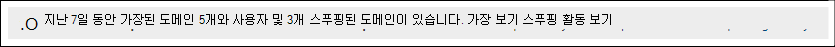

# Defender for Office 365

[!INCLUDE [Microsoft 365 Defender rebranding](../includes/microsoft-defender-for-office.md)]

**적용 대상**
- [Office 365용 Microsoft Defender 플랜 1 및 플랜 2](defender-for-office-365.md)
- [Microsoft 365 Defender](../defender/microsoft-365-defender.md)

> [!NOTE]
> 이 문서에 설명된 기능은 미리 보기에 있으며 변경될 수 있으며 일부 조직에서는 사용할 수 없습니다.

가장은 전자 메일 메시지를 보낸 사람이 실제 또는 예상된 보낸 사람 전자 메일 주소와 매우 유사하게 보이는 위치입니다. 공격자는 받는 사람의 신뢰를 얻기 위해 피싱 또는 기타 유형의 공격에서 보낸 사람 전자 메일 주소를 가장하는 경우가 종종 있습니다. 기본적으로 두 가지 유형의 가장이 있습니다.

- **도메인 가장:** lila@contoso.com 대신 가장된 보낸 사람 전자 메일 주소가 lila@ćóntoso.com.
- **사용자 가장:** michelle@contoso.com 대신 가장된 보낸 사람 전자 메일 주소가 rnichell@contoso.com.

도메인 가장은 일반적으로 등록된 실제 도메인이기 때문에 도메인 스푸핑과 다릅니다.  가장된 도메인의 보낸 사람이 보낸 메시지는 스푸핑 시도(SPF, DKIM 및 DMARC)를 식별하는 정기적인 전자 메일 인증 검사를 통과할 수 있으며, 이러한 검사를 통과할 수도 있습니다.

가장 보호는 Microsoft Defender에서만 사용할 수 있는 피싱 방지 정책 설정의 Office 365. 이러한 설정에 대한 자세한 내용은 Microsoft Defender for Office 365 피싱 방지 정책의 가장 [설정을 Office 365.](set-up-anti-phishing-policies.md#impersonation-settings-in-anti-phishing-policies-in-microsoft-defender-for-office-365)

Microsoft 365 Defender 포털에서 가장 정보를 사용하여 가장 보호를 위해 구성한 가장된 보낸 사람 또는 보낸 사람 도메인의 메시지를 빠르게 식별할 수 있습니다.

## 시작하기 전에 알아야 할 내용은 무엇인가요?

- <https://security.microsoft.com>에서 Microsoft 365 Defender 포털을 엽니다. 피싱 방지 페이지에서 가장 인사이트로 직접 이동하기 위해 를  사용하세요. <https://security.microsoft.com/antiphishing> 가장 인사이트 페이지로 직접 이동하기 위해 **를** <https://security.microsoft.com/impersonationinsight> 사용하세요.

- 이 문서의 절차를 수행하려면 Microsoft 365 Defender 포털에서 사용 권한을 할당해야 합니다.
  - **조직 관리**
  - **보안 관리자**
  - **보안 읽기 권한자**
  - **전역 읽기 권한자**

  자세한 내용은 [Microsoft 365 Defender 포털 권한](permissions-microsoft-365-security-center.md)을 참조하세요.

  **참고:** Azure Active Directory 역할에 사용자를 추가하면 Microsoft 365 관리 센터 포털에서 필요한 사용 권한과 Microsoft 365 Defender 포털의 다른  기능에 대한 사용 권한이 Microsoft 365. 자세한 내용은 [관리자 역할 정보](../../admin/add-users/about-admin-roles.md)를 참조하세요.

- Microsoft Defender에서 피싱 방지 정책에서 가장 보호를 사용하도록 설정하고 구성할 수 Office 365. 가장 보호는 기본적으로 사용하도록 설정되어 있지 않습니다. 자세한 내용은 [Microsoft Defender에서](configure-mdo-anti-phishing-policies.md)피싱 방지 정책 구성을 Office 365.

## 사이트 포털에서 가장 Microsoft 365 Defender 열기

1. Microsoft 365 Defender 포털의 정책 섹션에서  전자 메일 & 공동 작업 정책 & 규칙 위협 방지 정책으로 \>  \>  \>  이동하세요. 

2. 피싱 **방지** 페이지에서 가장 인사이트는 다음과 같이 표시됩니다.

   

   인사이트에는 다음 두 가지 모드가 있습니다.

    - **인사이트** 모드: 피싱 방지 정책에서 가장 보호를 사용하도록 설정하고 구성하는 경우 인사이트는 지난 7일 동안 가장된 도메인 및 가장된 사용자(보낸 사람)로부터 검색된 메시지 수를 보여 주며, 이는 모든 피싱 방지 정책에서 검색된 모든 가장된 보낸 사람의 합계입니다.
    - **모드인 경우:** 활성 피싱 방지 정책에서 가장 보호를 사용하도록 설정하고 구성하지 않은 경우 인사이트는 지난 7일 동안 가장 보호 기능에서 검색된 메시지의 수를 보여줍니다. 

가장 검색에 대한 정보를 보려면 가장  정보에서 가장 보기를 클릭합니다.

   > [!NOTE]
   > 스푸핑 인텔리전스 인사이트에 대한 자세한 내용은 [EOP의 스푸핑 인텔리전스 인사이트를 참조하세요.](learn-about-spoof-intelligence.md)

## 가장된 도메인의 보낸 사람이 보낸 메시지에 대한 정보 보기

가장  인사이트에서 가장 보기를 클릭한  후 나타나는 가장 정보 페이지에서 도메인 탭이 선택되어 있는지 확인하십시오.  도메인 **탭에는** 다음 정보가 포함되어 있습니다.

- **보낸 사람 도메인**: 전자 메일 메시지를 보내는 데 사용된 도메인인 가장 도메인입니다.
- **메시지 수:** 지난 7일 동안 보낸 사람 도메인을 가장한 메시지 수입니다.
- **가장 유형:** 이 값은 검색된 가장 위치(예: **주소의 도메인)를 보여 주며,**
- **가장된** 도메인: 피싱 방지 정책에서 가장 보호를 위해 구성된 도메인과 매우 아야 하는 가장된 도메인입니다.
- **도메인 유형:** 이 값은 내부 도메인의 **회사** 도메인 또는 사용자 지정 도메인의 **사용자** 지정 도메인입니다.
- **정책:** 가장된 도메인을 검색한 피싱 방지 정책입니다.
- **가장 허용:** 다음 값 중 하나를 사용합니다.
  - **예:** 도메인이 피싱 방지 정책에서 신뢰할 수 있는 도메인(가장 보호에 대한 예외)으로 구성됩니다. 가장된 도메인의 보낸 사람이 보낸 메시지가 검색되지만 허용되었습니다.
  - **No:** 도메인이 피싱 방지 정책에서 가장 보호를 위해 구성했습니다. 가장된 도메인의 보낸 사람이 보낸 메시지는 피싱 방지 정책에서 가장된 도메인에 대한 작업을 기반으로 검색되고 처리되었습니다.

선택한 열 제목을 클릭하여 결과를 정렬할 수 있습니다.

결과를 필터링하기 위해 검색  **결과를** 필터링할 콤보로 구분된 값 목록을 입력하는 검색 상자입니다.

### 가장된 도메인의 보낸 사람이 보낸 메시지에 대한 세부 정보 보기

가장 **인사이트** 페이지의  도메인 탭에서 사용 가능한 가장 검색 중 하나를 선택합니다. 나타나는 세부 정보 플라이아웃에는 다음 정보와 기능이 포함되어 있습니다.

- **수정할 선택** 가장 정책: 수정할 영향을 받는 피싱 방지 정책을 선택합니다. 가장된 도메인이 정책에 정의된 정책만 사용할 수 있습니다. 이전 페이지를 참조하여 가장된 도메인(받는 사람 및 정책의 우선 순위에 따라)을 검색하는 데 실제로 책임이 있는 정책을 확인하십시오.
- 허용된 가장 목록에 **추가:** 이 토글을 사용하여 선택한 피싱 방지 정책에 대한 신뢰할 수 있는 보낸 사람 및 도메인(가장 예외)에서 보낸 사람 추가 또는 제거: 
  - 이 **항목의 가장** 허용 값이 **아니요이면** 토글이 꺼집니다. 가장 보호를 통해 이 도메인의 모든 보낸 사람이 평가에서 제외하려면 토글을 on:  도메인은 피싱  방지 정책의 가장 보호 설정에서 신뢰할 수 있는 도메인 목록에 추가됩니다.
  - 이 **항목의 가장** 허용 값이 **예이면** 토글이 설정됩니다. 가장 보호를 통해 이 도메인의 모든 보낸 사람이 평가판으로 돌아가기 위해 토글을 해제:  피싱 방지 정책의 가장 보호 설정에 있는 신뢰할 수 있는 도메인 목록에서 도메인이 제거됩니다. 
- 이 경우 이유가 있습니다.
- 해야 할 일.
- 가장된 도메인을 나열하는 도메인 요약입니다.
- 보낸 사람에 대한 데이터입니다.
- 보낸 사람에 대한 추가 세부 정보를 볼 수 있는 [위협](threat-explorer.md) 탐색기를 여는 링크입니다.
- 조직에 배달된 동일한 보낸 사람이 보낸 유사한 메시지입니다.

## 가장된 보낸 사람이 보낸 메시지에 대한 정보 보기

가장 **인사이트에서** 가장 보기를 클릭한  후 나타나는 가장 정보 페이지에서 사용자 **탭을** 클릭합니다. 사용자 **탭에는** 다음 정보가 포함되어 있습니다.

- **보낸 사람:** 전자 메일 메시지를 보낸 가장 보낸 사람 전자 메일 주소입니다.
- **메시지 수:** 지난 7일 동안 보낸 사람으로 가장한 메시지 수입니다.
- **가장 유형:** 이 값은 **표시 이름의 사용자입니다.**
- **가장된** 사용자: 가장된 보낸 사람 전자 메일 주소로, 피싱 방지 정책에서 가장 보호를 위해 구성된 사용자와 매우 아야 합니다.
- **사용자 유형**: 이 값은 적용된 보호 유형(예: **보호된** 사용자 또는 사서함 인텔리전스)을 **보여줍니다.**
- **정책:** 가장된 보낸 사람이 검색된 피싱 방지 정책입니다.
- **가장 허용:** 다음 값 중 하나를 사용합니다.
  - **예:** 보낸 사람이 피싱 방지 정책에서 신뢰할 수 있는 사용자(가장 보호에 대한 예외)로 구성됩니다. 가장된 보낸 사람이 보낸 메시지가 검색되지만 허용되었습니다.
  - **No:** 보낸 사람이 피싱 방지 정책에서 가장 보호를 위해 구성했습니다. 가장된 보낸 사람이 보낸 메시지는 피싱 방지 정책에서 가장된 사용자에 대한 작업을 기반으로 검색되고 작업을 수행했습니다.

선택한 열 제목을 클릭하여 결과를 정렬할 수 있습니다.

결과를 필터링하기 위해 필터  보낸 사람 상자에 콤보로 구분된 값 목록을 입력하여 결과를 필터링할 수 있습니다.

### 가장된 보낸 사람이 보낸 메시지에 대한 세부 정보 보기

가장  인사이트  페이지의 사용자 탭에서 사용 가능한 가장 검색 중 하나를 선택합니다. 나타나는 세부 정보 플라이아웃에는 다음 정보와 기능이 포함되어 있습니다.

- **수정할 선택** 가장 정책: 수정할 영향을 받는 피싱 방지 정책을 선택합니다. 가장된 보낸 사람이 정책에 정의된 정책만 사용할 수 있습니다. 이전 페이지를 참조하여 실제로 가장된 보낸 사람(받는 사람 및 정책의 우선 순위에 따라)을 검색하는 데 책임이 있는 정책을 확인하십시오.
- 허용된 가장 목록에 **추가:** 이 토글을 사용하여 선택한 피싱 방지 정책에 대한 신뢰할 수 있는 보낸 사람 및 도메인(가장 예외)에서 보낸 사람 추가 또는 제거: 
  - 이 **항목의 가장** 허용 값이 **아니요이면** 토글이 꺼집니다. 가장 보호를 통해 보낸 사람이 평가에서 제외되는 경우 토글을 on:  보낸 사람이 피싱  방지 정책의 가장 보호 설정에서 신뢰할 수 있는 사용자 목록에 추가됩니다.
  - 이 **항목의 가장** 허용 값이 **예이면** 토글이 설정됩니다. 가장 보호를 통해 보낸 사람이 평가로 돌아가기 위해 토글을 해제:  보낸 사람이 피싱  방지 정책의 가장 보호 설정에서 신뢰할 수 있는 사용자 목록에서 제거됩니다.
- 이 경우 이유가 있습니다.
- 해야 할 일.
- 가장된 보낸 사람이 나열된 보낸 사람 요약입니다.
- 보낸 사람에 대한 데이터입니다.
- 보낸 사람에 대한 추가 세부 정보를 볼 수 있는 [위협](threat-explorer.md) 탐색기를 여는 링크입니다.
- 조직에 배달된 동일한 보낸 사람이 보낸 유사한 메시지입니다.
