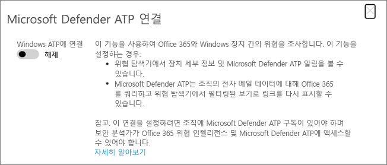

# Microsoft defender Advanced Threat Protection과 함께 Microsoft Defender for Office 365 사용Use Microsoft Defender for Office 365 together with Microsoft Defender Advanced Threat Protection

[!INCLUDE [Microsoft 365 Defender rebranding](../includes/microsoft-defender-for-office.md)]

[Microsoft defender For Office 365 For](https://docs.microsoft.com/microsoft-365/security/office-365-security/office-365-atp?view=o365-worldwide) [Endpoint에 대](https://docs.microsoft.com/windows/security/threat-protection)[Microsoft Defender for Office 365](https://docs.microsoft.com/microsoft-365/security/office-365-security/office-365-atp?view=o365-worldwide) can be configured to work with [Microsoft Defender for Endpoint](https://docs.microsoft.com/windows/security/threat-protection).

Microsoft defender for Office 365을 끝점에 통합 하면 사용자의 장치가 위험에 처 한 경우 보안 운영 팀이 보다 신속 하 게 작업을 수행 하는 데 도움이 될 수 있습니다.Integrating Microsoft Defender for Office 365 with Microsoft Defender for Endpoint can help your security operations team monitor and take action quickly if users' devices are at risk. 예를 들어 통합을 사용 하도록 설정 하면 보안 운영 팀이 검색 된 전자 메일 메시지의 영향을 받을 가능성이 있는 장치를 볼 수 있을 뿐만 아니라 끝점에 대 한 Microsoft Defender에서 해당 장치에 대 한 최근 경고가 발생 한 횟수를 확인할 수도 있습니다.For example, once integration is enabled, your security operations team will be able to see the devices that are potentially affected by a detected email message, as well as how many recent alerts were generated for those devices in Microsoft Defender for Endpoint. 

다음 이미지에서는 **장치** 탭에 사용 되는 끝점 통합에 대 한 Microsoft Defender가 있는 것 처럼 보이는 결과를 보여 줍니다.The following image depicts what the **Devices** tab looks like have Microsoft Defender for Endpoint integration enabled:
  

  
이 예에서는 검색 된 전자 메일 메시지의 받는 사람에 게 4 개의 장치가 있고 하나에 경고가 있음을 확인할 수 있습니다.In this example, you can see that the recipients of the detected email message have four devices and one has an alert. 장치에 대 한 링크를 클릭 하면 Microsoft Defender 보안 센터 ()에서 해당 페이지가 열립니다 [https://securitycenter.windows.com](https://securitycenter.windows.com) .Clicking the link for a device opens its page in the Microsoft Defender Security Center ([https://securitycenter.windows.com](https://securitycenter.windows.com)).

> [!TIP]
> **[Microsoft Defender Security Center](https://docs.microsoft.com/windows/security/threat-protection/microsoft-defender-atp/use)** (MICROSOFT defender ATP 포털이 라고도 함)에 대해 자세히 알아보세요.**[Learn more about the Microsoft Defender Security Center](https://docs.microsoft.com/windows/security/threat-protection/microsoft-defender-atp/use)** (also referred to as the Microsoft Defender ATP portal.)
  
## 요구 사항Requirements

- 조직에 Office 365 (또는 Office 365 E5) 용 Microsoft Defender가 있고 끝점에 대 한 Microsoft Defender가 있어야 합니다.Your organization must have Microsoft Defender for Office 365 (or Office 365 E5) and Microsoft Defender for Endpoint.
    
- 전역 관리자 이거나 보안 및 [ &amp; 준수 센터](https://protection.office.com)에서 보안 관리자 역할 (예: 보안 관리자)을 할당 해야 합니다.You must be a global administrator or have a security administrator role (such as Security Administrator) assigned in the [Security &amp; Compliance Center](https://protection.office.com). ( [보안 및 &amp; 준수 센터의 사용 권한](permissions-in-the-security-and-compliance-center.md)참조)(See [Permissions in the Security &amp; Compliance Center](permissions-in-the-security-and-compliance-center.md))
    
- 보안 & 준수 센터 및 Microsoft Defender 보안 센터에서 두 [탐색기 (또는 실시간 검색)](threat-explorer.md) 에 액세스할 수 있어야 합니다.You must have access to both [Explorer (or real-time detections)](threat-explorer.md) in the Security & Compliance Center and the Microsoft Defender Security Center.
    
## Microsoft defender for Office 365을 사용 하 여 끝점을 Microsoft에 통합 하려면To integrate Microsoft Defender for Office 365 with Microsoft Defender for Endpoint

보안 & 준수 센터와 Microsoft Defender 보안 센터를 모두 사용 하 여 Office 365 용 microsoft defender (Microsoft Defender for Endpoint)를 통합 합니다.Integrating Microsoft Defender for Office 365 with Microsoft Defender for Endpoint is set up by using both the Security & Compliance Center AND the Microsoft Defender Security Center.
  
1. 전역 관리자 또는 보안 관리자로 이동 하 여 [https://protection.office.com](https://protection.office.com) 로그인 합니다.As a global administrator or a security administrator, go to [https://protection.office.com](https://protection.office.com) and sign in. (이 경우 Office 365 보안 & 준수 센터가로 이동 합니다.)(This takes you to the Office 365 Security & Compliance Center.)
    
2. 탐색 창에서 **위협 관리**  >  **탐색기**를 선택 합니다.In the navigation pane, choose **Threat management** > **Explorer**.  
    
3. 화면의 오른쪽 위 모서리에서 **Wdatp 설정을**선택 합니다.In the upper right corner of the screen, choose **WDATP Settings**.
    
4. Microsoft Defender for 끝점 연결 대화 상자에서 **WINDOWS ATP에 연결**을 설정 합니다.In the Microsoft Defender for Endpoint connection dialog box, turn on **Connect to Windows ATP**.  
    
5. Microsoft Defender 보안 센터 ()로 이동 [https://securitycenter.windows.com](https://securitycenter.windows.com) 합니다.Go to the Microsoft Defender Security Center ([https://securitycenter.windows.com](https://securitycenter.windows.com)).

6. 탐색 모음에서 **설정을**선택 합니다.In the navigation bar, choose **Settings**. 그런 다음 **일반**에서 **고급 기능**을 선택 합니다.Then, under **General**, choose **Advanced features**.

7. 아래로 스크롤하여 **Office 365 위협 인텔리전스 연결**을 설정 하 고 연결을 켭니다.Scroll down to **Office 365 Threat Intelligence connection**, and turn the connection on.  

## 관련 문서Related articles

[Office 365의 위협 조사 및 응답 기능Threat investigation and response capabilities in Office 365](office-365-ti.md)
  
[Microsoft Defender for Office 365Microsoft Defender for Office 365](office-365-atp.md)
  
[끝점에 대 한 Microsoft DefenderMicrosoft Defender for Endpoint](https://docs.microsoft.com/windows/security/threat-protection)
