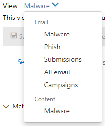
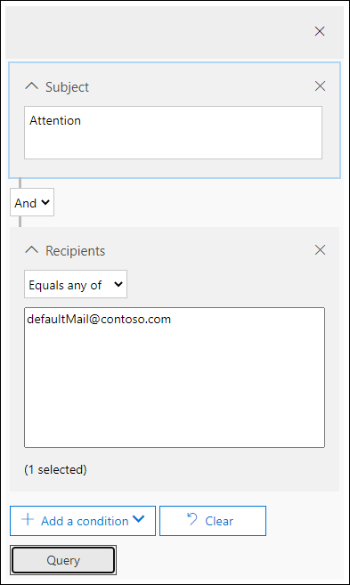

# 전자 메일에서 배달된 악성 전자 메일 Microsoft 365

[!INCLUDE [Microsoft 365 Defender rebranding](../includes/microsoft-defender-for-office.md)]

**적용 대상:**

- [Office 365용 Microsoft Defender 플랜 1 및 플랜 2](defender-for-office-365.md)
- [Microsoft 365 Defender](../defender/microsoft-365-defender.md)

[Microsoft Defender for Office 365](defender-for-office-365.md) 조직의 사용자가 위험에 노출된 활동을 조사하고 조직을 보호하기 위한 조치를 취할 수 있습니다. 예를 들어 조직의 보안 팀에 소원이면 배달된 의심스러운 전자 메일 메시지를 찾아 조사할 수 있습니다. 위협 탐색기(또는 실시간 검색)를 사용하여 이 [작업을 할 수 있습니다.](threat-explorer.md)

> [!NOTE]
> 여기에서 수정 문서로 [이동하세요.](remediate-malicious-email-delivered-office-365.md)

## 시작하기 전에

다음 조건이 충족되었는지 확인하세요.

- 조직에 사용자용 [Microsoft Defender가 Office 365](defender-for-office-365.md) [라이선스가 사용자에게 할당됩니다.](../../admin/manage/assign-licenses-to-users.md)

- [조직에 대해 감사](../../compliance/turn-audit-log-search-on-or-off.md) 로깅이 설정되어 있습니다.

- 조직에는 스팸 방지, 맬웨어 방지, 피싱 방지 등 정책이 정의되어 있습니다. 에서 [위협으로부터 보호를 Office 365.](protect-against-threats.md)

- 전역 관리자 또는 보안 관리자 또는 검색 및 제거 역할이 Microsoft 365 Defender 있습니다. 자세한 내용은 [Microsoft 365 Defender 포털 권한](permissions-microsoft-365-security-center.md)을 참조하세요. 일부 작업의 경우 미리 보기 역할도 할당해야 합니다.

### 역할 권한 미리 보기

메시지 헤더 보기 또는 전자 메일 메시지 콘텐츠 다운로드와 같은 특정 작업을 수행하려면 다른 적절한 역할 그룹에 *미리* 보기 역할을 추가해야 합니다. 다음 표에서는 필요한 역할 및 사용 권한을 명확히 합니다.

 

****

|활동|역할 그룹|미리 보기 역할이 필요하세요?|
|---|---|---|
|위협 탐색기(및 실시간 검색)를 사용하여 위협 분석 |전역 관리자 
 보안 관리자 
 보안 읽기 권한자|아니요|
|위협 탐색기(및 실시간 검색)를 사용하여 전자 메일 메시지에 대한 헤더를 보고, 분리된 전자 메일 메시지 미리 보기 및 다운로드|전역 관리자 
 보안 관리자 
 보안 읽기 권한자|아니요|
|위협 탐색기를 사용하여 헤더 보기, 전자 메일 미리 보기(전자 메일 엔터티 페이지만) 및 사서함에 배달된 전자 메일 메시지 다운로드|전역 관리자 
 보안 관리자 
 보안 읽기 권한자 
 Preview|예|
|

> [!NOTE]
> *미리* 보기는 역할 그룹이 아닌 역할입니다. 미리 보기 역할은 Microsoft 365 Defender()의 기존 역할 그룹에 추가해야 <https://security.microsoft.com> 합니다. 사용 **권한으로 이동한** 다음 기존 역할 그룹을 편집하거나 미리 보기 역할이 할당된 **새** 역할 그룹을 추가합니다.
>
> 전역 관리자 역할에는 Microsoft 365 관리 센터 ( )가 할당되고 보안 관리자 및 보안 읽기 권한자 역할은 <https://admin.microsoft.com> Microsoft 365 Defender( <https://security.microsoft.com> ) 역할 및 사용 권한에 대한 자세한 내용은 [Microsoft 365 Defender 포털의 사용 권한](permissions-microsoft-365-security-center.md)을 참조하세요.

전자 메일 미리 보기 및 다운로드는 중요한 활동이기 때문에 감사가 사용하도록 설정되어 있습니다. 관리자가 전자 메일에 대해 이러한 작업을 수행하면 동일한 감사 로그가 생성되어 Microsoft 365 Defender 포털()에서 볼 수 <https://security.microsoft.com> 있습니다. 검색 **감사** \> **탭으로** 이동하여 사용자 상자의 관리자 이름을 **필터링합니다.** 필터링된 결과에는 **AdminMailAccess 활동이 표시됩니다.** 미리 보거나 다운로드한 전자 메일에 대한 **추가** 정보 섹션에서 세부 정보를 확인하려면 행을 선택합니다.

## 배달된 의심스러운 전자 메일 찾기

위협 탐색기는 메시지 찾기 및 삭제, 악의적인 전자 메일 보낸 사람 IP 주소 식별 또는 추가 조사를 위해 인시던트 시작과 같은 여러 용도로 사용할 수 있는 강력한 보고서입니다. 다음 절차에서는 Explorer를 사용하여 받는 사람의 사서함에서 악성 전자 메일을 찾아서 삭제하는 데 중점을 니다.

> [!NOTE]
> Explorer의 기본 검색에는 현재 ZAP(제로 아워 자동 제거)를 통해 클라우드 사서함에서 제거된 배달된 항목이 포함되어 있습니다. 이 제한 사항은 모든 보기(예: **\>** 전자 메일 맬웨어 또는 전자 메일 피싱 **\> 보기)에** 적용됩니다. ZAP에서 제거된 항목을 포함하려면 ZAP에서 제거됨을 포함하기 위해 배달 작업  **집합을 추가해야 합니다.** 모든 옵션을 포함하면 ZAP에서 제거한 항목을 포함하여 모든 배달 작업 결과가 표시됩니다.

1. Microsoft 365 Defender 포털을 열고 직장 또는 학교 계정을 사용하여 <https://security.microsoft.com> 로그인하여 Office 365.

2. 왼쪽 **탐색기에서 전자** **메일** & 공동 \> **작업 탐색기를 선택하여 위협** 탐색기로 이동하세요. 위협 **탐색기로** 직접 이동하려면 를 <https://security.microsoft.com/threatexplorer> 사용합니다.

   탐색기  페이지에서 추가  작업 열에는 관리자에게 전자 메일 처리 결과가 표시됩니다. 배달 **작업 및** 배달 위치와 같은  위치에서 추가 작업 열에 액세스할 **수 있습니다.** 관리자가 헌팅 환경을 개선하기 위한 새로운 기능인 위협 탐색기 전자 메일 타임라인이 끝나면 특수 작업이 업데이트될 수 있습니다.

3. 보기 **메뉴의** 드롭다운 목록에서 **모든** \>  전자 메일 전자 메일을 선택합니다.

    

    *맬웨어* 보기는 현재 기본 보기로, 맬웨어 위협이 감지된 전자 메일을 캡처합니다. 피싱 *보기는* 피싱과 같은 방식으로 작동됩니다.

    그러나 *모든 전자* 메일 보기에는 위협이 감지 여부에 따라 조직에서 받은 모든 메일이 나열됩니다. 이 보기에는 필터를 적용해 묻는 자리 표시자에 데이터가 많이 표시됩니다. 이 보기는 P2 고객용 Defender에서만 Office 365 있습니다.

    *제출 보기에는* Microsoft에 보고된 관리자 또는 사용자가 전송한 모든 메일이 표시됩니다.

4. **위협 탐색기에서** 검색 및 필터링: 필터는 검색 표시줄의 페이지 맨 위에 표시되어 관리자가 조사에 도움을 줄 수 있도록 합니다. 여러 필터를 동시에 적용할 수 있으며, 필터에 여러 개의 콤보로 구분된 값을 추가하여 검색 범위를 좁힐 수 있습니다. 중요:

    - 필터는 대부분의 필터 조건에서 정확히 일치합니다.
    - 제목 필터는 CONTAINS 쿼리를 사용합니다.
    - URL 필터는 프로토콜(예: )과 함께 작동하거나 사용할 수 없습니다. https).
    - URL 도메인, URL 경로 및 URL 도메인 및 경로 필터에는 필터링할 프로토콜이 필요하지 않습니다.
    - 관련 결과를 얻기 위해 필터 값을 변경할 때마다 새로 고침 아이콘을 클릭해야 합니다.

5. **고급 필터:** 이러한 필터를 사용하여 복잡한 쿼리를 작성하고 데이터 집합을 필터링할 수 있습니다. 고급 *필터를 클릭하면* 옵션이 있는 플라이아웃이 열립니다.

   고급 필터링은 검색 기능에 큰 추가 기능입니다. 받는 **사람,** 보낸 사람  및 보낸  사람 도메인 필터에 부울 NOT을 사용하면 관리자가 값을 제외하여 조사할 수 있습니다. 이 옵션은 같음 **선택 영역 없음입니다.** 이 옵션을 사용하면 관리자가 조사에서 원치 않는 사서함(예: 경고 사서함 및 기본 회신 사서함)을 제외할 수 있으며, 받는 사람을 다음 중 같음으로 설정할 수 있는 특정 주제(예: 주의)를 검색하는 경우에 *유용합니다.* defaultMail@contoso.com. 이는 정확한 값 검색입니다.

   

   시작 날짜 및 종료 날짜에 시간 필터를 추가하면 보안 팀이 빠르게 드릴다운할 수 있습니다. 가장 짧은 허용 시간 기간은 30분입니다. 시간 프레임에 따라 의심스러운 작업 범위를 좁힐 수 있는 경우(예: 3시간 전에 발생) 컨텍스트를 제한하고 문제를 쉽게 규명하는 데 도움이 됩니다.

   

6. **위협 탐색기** 필드: 위협 탐색기는 배달 작업, 배달  *위치,* 특수 작업, 방향성,  *Overrides* 및 URL 위협과 같은 훨씬 더 많은 보안 관련 메일 정보를 *노출합니다.*  또한 조직의 보안 팀이 보다 확실하게 조사할 수 있습니다.

    *배달 작업은* 기존 정책 또는 검색으로 인해 전자 메일에서 수행된 작업입니다. 전자 메일이 수행할 수 있는 가능한 작업은 다음과 같습니다.

    - **배달** – 전자 메일이 사용자의 받은 편지함 또는 폴더로 배달된 경우 사용자가 직접 액세스할 수 있습니다.
    - **정크** 메일(정크 메일로 배달) - 전자 메일이 사용자의 정크 폴더 또는 삭제된 폴더로 전송되고 사용자는 정크 또는 삭제된 폴더의 전자 메일 메시지에 액세스할 수 있습니다.
    - **차단 -** 차단되거나 실패했거나 삭제된 모든 전자 메일 메시지입니다.
    - **대체 -** 악의적인 첨부 파일이 첨부 파일이 악성 상태인 .txt 파일로 대체되는 모든 전자 메일

    **배달 위치:** 배달 위치 필터를 사용하여 관리자가 악성 메일로 의심되는 위치와 해당 메일에 대해 수행된 작업을 이해할 수 있습니다. 결과 데이터를 스프레드시트로 내보낼 수 있습니다. 가능한 배달 위치는:

    - **받은 편지함 또는 폴더** - 전자 메일 규칙에 따라 전자 메일이 받은 편지함 또는 특정 폴더에 있습니다.
    - **On-prem or external** – The mailbox doesn't exist in the Cloud but is on-premises.
    - **정크 폴더** - 전자 메일이 사용자의 정크 메일 폴더에 있습니다.
    - **삭제된 항목 폴더** - 전자 메일이 사용자의 지우기 항목 폴더에 있습니다.
    - **Quarantine** – 사용자의 사서함이 아닌, 전자 메일을 검지로 전송합니다.
    - **실패** - 전자 메일이 사서함에 도달하지 못했습니다.
    - **삭제 -** 메일 흐름에서 전자 메일이 손실된 경우

    **방향:** 이 옵션을 사용하면 보안 운영 팀이 메일이 들어오거나 진행되는 '방향'을 사용하여 필터링할 수 있습니다. 방향 값은 *인바운드,* *아웃바운드* 및 반올라(외부에서 들어오거나, 해당 org에서 내부로 전송되는 메일에 해당)입니다.  이 정보는 방향성 값(예: ) 간의 불일치로 인하여 보안 운영 팀이 스푸핑 및 가장을 쉽게 하게 할 수 있습니다. *인바운드*) 및 보낸 사람(내부 도메인으로 표시)의 도메인이 나타납니다.  Directionality 값은 메시지 추적과는 별개입니다. 결과를 스프레드시트로 내보낼 수 있습니다.

    **Overrides:** 이 필터는 메일의 세부 정보 탭에 나타나는 정보를 사용하여 메일을 허용하고 차단하는 데 필요한 조직 또는 사용자 정책이 을(를) 에 노출합니다. 이 필터의 가장 중요한 점은 조직의 보안 팀이 구성으로 인해 배달된 의심스러운 전자 메일의 수를 볼 수 있도록 돕는 것입니다. 이를 통해 필요한 경우 허용 및 차단을 수정할 수 있습니다. 이 필터의 결과 집합을 스프레드시트로 내보낼 수 있습니다.

     

    ****

    |위협 탐색기 오버라이드|의미|
    |---|---|
    |Org 정책에서 허용|조직 정책의 지시에 따라 사서함으로 메일이 허용됩니다.|
    |Org 정책에 의해 차단됩니다.|조직 정책에 따라 사서함으로의 메일 배달이 차단됩니다.|
    |Org 정책에 의해 차단된 파일 확장명|조직 정책에 따라 파일이 사서함으로 배달되지 않습니다.|
    |사용자 정책에서 허용|사용자 정책에 따라 사서함에 메일이 허용됩니다.|
    |사용자 정책에 의해 차단됩니다.|사용자 정책에 따라 사서함으로의 메일 배달이 차단됩니다.|
    |

    **URL 위협:** URL 위협 필드가  URL로 제공된 위협을 나타내기 위해 전자 메일의 세부 정보 탭에 포함되어 있습니다. URL이 제시하는 위협에는 맬웨어, *피싱* 또는  스팸이 포함될 수 있으며 *위협이* 없는 URL은 위협 *섹션에서 없음을* 표시합니다. 

7. **전자 메일 타임라인 보기:** 보안 운영 팀에서 추가 조사를 위해 전자 메일 세부 정보를 자세히 조사해야 할 수 있습니다. 관리자는 전자 메일 타임라인을 통해 배달에서 배달 후까지 전자 메일에 대해 수행된 작업을 볼 수 있습니다. 전자 메일 타임라인을 보려면 전자 메일 메시지의 제목을 클릭한 다음 전자 메일 타임라인을 클릭합니다. (요약 또는 세부 정보와 같은 패널의 다른 제목 중 표시됩니다.) 이러한 결과는 스프레드시트로 내보낼 수 있습니다.

    전자 메일 타임라인이 전자 메일의 모든 배달 및 배달 후 이벤트를 표시하는 테이블로 열립니다. 전자 메일에 대한 추가 작업이 없는 경우 원래 배달에 대해 피싱과 같은 결과를 표시하는 단일 이벤트(예: *차단)가* *표시될 수 있습니다.* 관리자는 탭 및 전자 메일의 모든 세부 정보(예: 제목, 보낸 사람, 받는 사람, 네트워크 및 메시지 ID)를 포함하여 전체 전자 메일 타임라인을 내보낼 수 있습니다. 전자 메일이 도착한 후 발생된 이벤트를 이해하기 위해 여러 위치를 검사하는 데 소요되는 시간이 적기 때문에 전자 메일 타임라인이 임의로 잘리게 됩니다. 전자 메일에서 동시에 여러 이벤트가 발생하거나 그에 가까운 경우 해당 이벤트는 시간 표시 막대 보기에 표시됩니다.

8. **미리 보기/다운로드:** 위협 탐색기는 보안 운영 팀에 의심스러운 전자 메일을 조사하는 데 필요한 세부 정보를 제공합니다. 보안 운영 팀은 다음 중 하나를 사용할 수 있습니다.

    - [배달 작업 및 위치를 검사합니다.](#check-the-delivery-action-and-location)

    - [전자 메일의 시간 표시 막대를 볼 수 있습니다.](#view-the-timeline-of-your-email)

### 배달 작업 및 위치 확인

위협 [탐색기(및](threat-explorer.md)실시간 검색)에서 이제  이전  배달 상태 열 대신 배달 작업 및 배달 위치 **열이** 있습니다. 그러면 전자 메일 메시지가 전송되는 위치를 보다 완전한 그림으로 볼 수 있습니다. 이러한 변경의 목표는 보안 운영 팀에서 조사를 보다 쉽게 수행하기 위한 것이지만 결과적으로 문제 전자 메일 메시지의 위치를 한 눈에 알 수 있습니다.

이제 배달 상태가 두 개의 열로 나어집니다.

- **배달 작업** - 이 전자 메일의 상태는 무엇입니까?
- **배달 위치** - 이 전자 메일이 결과로 라우팅된 위치는 어디인가요?

배달 작업은 기존 정책 또는 검색으로 인해 전자 메일에서 수행된 작업입니다. 전자 메일이 수행할 수 있는 가능한 작업은 다음과 같습니다.

- **배달** – 전자 메일이 사용자의 받은 편지함 또는 폴더로 배달된 경우 사용자가 직접 액세스할 수 있습니다.
- **정크** 메일 - 전자 메일이 사용자의 정크 폴더 또는 삭제된 폴더로 전송되고 사용자는 정크 또는 삭제된 폴더의 전자 메일 메시지에 액세스할 수 있습니다.
- **차단 -** 차단되거나 실패했거나 삭제된 모든 전자 메일 메시지입니다.
- **Replaced** – 악의적인 첨부 파일이 첨부 파일이 악성 상태인 .txt 파일로 대체되는 모든 전자 메일입니다.

배달 위치는 배달 후 실행된 정책 및 검색의 결과를 보여줍니다. 배달 동작에 연결됩니다. 이 필드는 문제 메일이 발견될 때 수행된 조치에 대한 정보를 제공하기 위해 추가되었습니다. 배달 위치의 가능한 값은 다음과 같습니다.

- **받은 편지함 또는 폴더** – 전자 메일이 받은 편지함 또는 폴더에 있습니다(전자 메일 규칙에 따라).
- **On-prem or external** – The mailbox doesn't exist on cloud but is on-premises.
- **정크 폴더** - 전자 메일이 사용자의 정크 폴더에 있습니다.
- **삭제된 항목 폴더** - 전자 메일이 사용자의 지우기 항목 폴더에 있습니다.
- **Quarantine** – 사용자의 사서함이 아닌, 전자 메일을 검지로 전송합니다.
- **실패** - 전자 메일이 사서함에 도달하지 못했습니다.
- **삭제 -** 메일 흐름에서 전자 메일이 손실됩니다.

### 전자 메일의 타임라인 보기

**전자 메일 타임라인은** 보안 운영 팀을 위해 더 쉽게 헌팅할 수 있는 위협 탐색기 필드입니다. 전자 메일에서 여러 이벤트가 동시에 발생하거나 그에 가까운 경우 해당 이벤트는 시간 표시 막대 보기에 표시됩니다. 전자 메일로의 배달 후 발생 하는 일부 이벤트는 특수 작업 **열에 캡처** 됩니다. 전자 메일 메시지 타임라인의 정보를 배달 후 수행된 특수 작업과 결합하면 관리자가 정책 및 위협 처리(예: 메일이 라우팅된 위치 및 최종 평가의 최종 평가)에 대한 정보를 얻을 수 있습니다.

> [!IMPORTANT]
> 여기에서 수정 항목으로 [이동하세요.](remediate-malicious-email-delivered-office-365.md)

## 관련 항목

[전자 메일로 배달된 악성 전자 메일 Office 365](remediate-malicious-email-delivered-office-365.md)

[Office 365용 Microsoft Defender](office-365-ti.md)

[보안 위협으로부터 Office 365](protect-against-threats.md)

[Defender for Office 365](view-reports-for-mdo.md)
