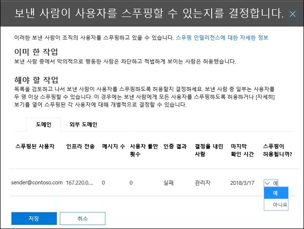

# <a name="configure-spoof-intelligence-in-eop"></a><span data-ttu-id="d3a82-103">EOP에서 스푸핑 인텔리전스 구성</span><span class="sxs-lookup"><span data-stu-id="d3a82-103">Configure spoof intelligence in EOP</span></span>

<span data-ttu-id="d3a82-104">Exchange online 사서함이 없는 Microsoft 365 조직에서 사서함이 있는 EOP (exchange online Protection) 조직에서 인바운드 전자 메일 메시지는 EOP의 2018에서 자동으로 스푸핑 으로부터 보호 됩니다.</span><span class="sxs-lookup"><span data-stu-id="d3a82-104">In Microsoft 365 organizations with mailboxes in Exchange Online or standalone Exchange Online Protection (EOP) organizations without Exchange Online mailboxes, inbound email messages are automatically protected against spoofing by EOP as of October 2018.</span></span> <span data-ttu-id="d3a82-105">EOP에서는 피싱에 대 한 조직의 전반적인 방어 과정에서 스푸핑 인텔리전스를 사용 합니다.</span><span class="sxs-lookup"><span data-stu-id="d3a82-105">EOP uses spoof intelligence as part of your organization's overall defense against phishing.</span></span> <span data-ttu-id="d3a82-106">자세한 내용은 [EOP의 스푸핑 방지 보호](anti-spoofing-protection.md)를 참조 하세요.</span><span class="sxs-lookup"><span data-stu-id="d3a82-106">For more information, see [Anti-spoofing protection in EOP](anti-spoofing-protection.md).</span></span>

<span data-ttu-id="d3a82-107">보낸 사람이 전자 메일 주소를 위장 하면 조직의 도메인 중 하나의 사용자 또는 조직에 전자 메일을 보내는 외부 도메인의 사용자로 표시 됩니다.</span><span class="sxs-lookup"><span data-stu-id="d3a82-107">When a sender spoofs an email address, they appear to be a user in one of your organization's domains, or a user in an external domain that sends email to your organization.</span></span> <span data-ttu-id="d3a82-108">스팸 또는 피싱 전자 메일을 보내도록 보낸 사람을 위장 하는 공격자는 차단 해야 합니다.</span><span class="sxs-lookup"><span data-stu-id="d3a82-108">Attackers who spoof senders to send spam or phishing email need to be blocked.</span></span> <span data-ttu-id="d3a82-109">그러나 합법적인 보낸 사람이 스푸핑 되는 시나리오가 있습니다.</span><span class="sxs-lookup"><span data-stu-id="d3a82-109">But there are scenarios where legitimate senders are spoofing.</span></span> <span data-ttu-id="d3a82-110">예시:</span><span class="sxs-lookup"><span data-stu-id="d3a82-110">For example:</span></span>

- <span data-ttu-id="d3a82-111">내부 도메인 스푸핑에 대 한 합법적인 시나리오:</span><span class="sxs-lookup"><span data-stu-id="d3a82-111">Legitimate scenarios for spoofing internal domains:</span></span>

  - <span data-ttu-id="d3a82-112">타사 보낸 사람 도메인을 사용 하 여 회사 설문을 위해 자신의 직원에 게 대량 메일을 보냅니다.</span><span class="sxs-lookup"><span data-stu-id="d3a82-112">Third-party senders use your domain to send bulk mail to your own employees for company polls.</span></span>

  - <span data-ttu-id="d3a82-113">외부 회사에서는 사용자를 대신 하 여 광고 또는 제품 업데이트를 생성 하 고 보냅니다.</span><span class="sxs-lookup"><span data-stu-id="d3a82-113">An external company generates and sends advertising or product updates on your behalf.</span></span>

  - <span data-ttu-id="d3a82-114">도우미는 정기적으로 조직 내의 다른 사용자에 게 전자 메일을 보내야 합니다.</span><span class="sxs-lookup"><span data-stu-id="d3a82-114">An assistant regularly needs to send email for another person within your organization.</span></span>

  - <span data-ttu-id="d3a82-115">내부 응용 프로그램은 전자 메일 알림을 보냅니다.</span><span class="sxs-lookup"><span data-stu-id="d3a82-115">An internal application sends email notifications.</span></span>

- <span data-ttu-id="d3a82-116">외부 도메인 스푸핑에 대 한 합법적인 시나리오:</span><span class="sxs-lookup"><span data-stu-id="d3a82-116">Legitimate scenarios for spoofing external domains:</span></span>

  - <span data-ttu-id="d3a82-117">보낸 사람이 메일링 리스트 라고도 하는 메일 그룹에 있고, 메일링 리스트에서 원본 보낸 사람 으로부터 메일 그룹의 모든 참가자에 게 전자 메일이 릴레이 됩니다.</span><span class="sxs-lookup"><span data-stu-id="d3a82-117">The sender is on a mailing list (also known as a discussion list), and the mailing list relays email from the original sender to all the participants on the mailing list.</span></span>

  - <span data-ttu-id="d3a82-118">외부 회사는 다른 회사를 대신 하 여 전자 메일을 전송 합니다 (예: 자동화 된 보고서 또는 a-a-서비스 회사).</span><span class="sxs-lookup"><span data-stu-id="d3a82-118">An external company sends email on behalf of another company (for example, an automated report or a software-as-a-service company).</span></span>

<span data-ttu-id="d3a82-119">스푸핑 인텔리전스 및 특히 기본 (및 전용) 스푸핑 인텔리전스 정책을 사용 하면 합법적인 보낸 사람이 보낸 스푸핑된 전자 메일이 EOP 스팸 필터 또는 외부 전자 메일 시스템에서 발견 되지 않도록 하 여 스팸 또는 피싱 공격 으로부터 사용자를 보호할 수 있습니다.</span><span class="sxs-lookup"><span data-stu-id="d3a82-119">Spoof intelligence, and specifically the default (and only) spoof intelligence policy, helps ensure that the spoofed email sent by legitimate senders doesn't get caught up in EOP spam filters or external email systems, while protecting your users from spam or phishing attacks.</span></span>

<span data-ttu-id="d3a82-120">보안 & 준수 센터에서 또는 PowerShell (exchange online 사서함이 없는 조직에 대 한 사서함이 있는 Microsoft 365 조 직의 경우에는 exchange online의 사용 EOP powershell)에서 스푸핑 인텔리전스를 관리할 수 있습니다.</span><span class="sxs-lookup"><span data-stu-id="d3a82-120">You can manage spoof intelligence in the Security & Compliance Center, or in PowerShell (Exchange Online PowerShell for Microsoft 365 organizations with mailboxes in Exchange Online; standalone EOP PowerShell for organizations without Exchange Online mailboxes).</span></span>

## <a name="what-do-you-need-to-know-before-you-begin"></a><span data-ttu-id="d3a82-121">시작하기 전에 알아야 할 내용은 무엇인가요?</span><span class="sxs-lookup"><span data-stu-id="d3a82-121">What do you need to know before you begin?</span></span>

- <span data-ttu-id="d3a82-122"><https://protection.office.com/>에서 보안 및 준수 센터를 엽니다.</span><span class="sxs-lookup"><span data-stu-id="d3a82-122">You open the Security & Compliance Center at <https://protection.office.com/>.</span></span> <span data-ttu-id="d3a82-123">**스팸 방지 설정** 페이지로 바로 이동하려면 <https://protection.office.com/antispam>을 사용하세요.</span><span class="sxs-lookup"><span data-stu-id="d3a82-123">To go directly to the **Anti-spam settings** page, use <https://protection.office.com/antispam>.</span></span> <span data-ttu-id="d3a82-124">**피싱 방지** 페이지로 바로 이동 하려면을 사용 <https://protection.office.com/antiphishing> 합니다.</span><span class="sxs-lookup"><span data-stu-id="d3a82-124">To go directly to the **Anti-phishing** page, use <https://protection.office.com/antiphishing>.</span></span>

- <span data-ttu-id="d3a82-125">Exchange Online PowerShell에 연결하려면 [Exchange Online PowerShell에 연결](https://docs.microsoft.com/powershell/exchange/exchange-online/connect-to-exchange-online-powershell/connect-to-exchange-online-powershell)을 참조하세요.</span><span class="sxs-lookup"><span data-stu-id="d3a82-125">To connect to Exchange Online PowerShell, see [Connect to Exchange Online PowerShell](https://docs.microsoft.com/powershell/exchange/exchange-online/connect-to-exchange-online-powershell/connect-to-exchange-online-powershell).</span></span> <span data-ttu-id="d3a82-126">독립 실행형 EOP PowerShell에 연결하려면 [Exchange Online Protection PowerShell에 연결](https://docs.microsoft.com/powershell/exchange/exchange-eop/connect-to-exchange-online-protection-powershell)을 참조하세요.</span><span class="sxs-lookup"><span data-stu-id="d3a82-126">To connect to standalone EOP PowerShell, see [Connect to Exchange Online Protection PowerShell](https://docs.microsoft.com/powershell/exchange/exchange-eop/connect-to-exchange-online-protection-powershell).</span></span>

- <span data-ttu-id="d3a82-127">이 절차를 수행하려면 먼저 사용 권한을 할당받아야 합니다.</span><span class="sxs-lookup"><span data-stu-id="d3a82-127">You need to be assigned permissions before you can perform these procedures.</span></span> <span data-ttu-id="d3a82-128">스푸핑 인텔리전스 정책을 수정 하거나 스푸핑 인텔리전스를 사용 하거나 사용 하지 않도록 설정 하려면 **조직 관리** 또는 **보안 관리자** 역할 그룹의 구성원 이어야 합니다.</span><span class="sxs-lookup"><span data-stu-id="d3a82-128">To modify the spoof intelligence policy or enable or disable spoof intelligence, you need to be a member of the **Organization Management** or **Security Administrator** role groups.</span></span> <span data-ttu-id="d3a82-129">스푸핑 인텔리전스 정책에 대 한 읽기 전용 액세스를 위해서는 **보안 독자** 역할 그룹의 구성원 이어야 합니다.</span><span class="sxs-lookup"><span data-stu-id="d3a82-129">For read-only access to the spoof intelligence policy, you need to be a member of the **Security Reader** role group.</span></span> <span data-ttu-id="d3a82-130">보안 및 규정 준수 센터의 역할 그룹에 대한 자세한 내용은 [보안 및 규정 준수 센터의 사용 권한](permissions-in-the-security-and-compliance-center.md)을 참조하세요.</span><span class="sxs-lookup"><span data-stu-id="d3a82-130">For more information about role groups in the Security & Compliance Center, see [Permissions in the Security & Compliance Center](permissions-in-the-security-and-compliance-center.md).</span></span>

- <span data-ttu-id="d3a82-131">스푸핑 인텔리전스에 대 한 권장 설정은 [EOP 기본 피싱 방지 정책 설정을](recommended-settings-for-eop-and-office365-atp.md#eop-default-anti-phishing-policy-settings)참조 하십시오.</span><span class="sxs-lookup"><span data-stu-id="d3a82-131">For our recommended settings for spoof intelligence, see [EOP default anti-phishing policy settings](recommended-settings-for-eop-and-office365-atp.md#eop-default-anti-phishing-policy-settings).</span></span>

## <a name="use-the-security--compliance-center-to-manage-spoofed-senders"></a><span data-ttu-id="d3a82-132">보안 & 준수 센터를 사용 하 여 스푸핑된 보낸 사람 관리</span><span class="sxs-lookup"><span data-stu-id="d3a82-132">Use the Security & Compliance Center to manage spoofed senders</span></span>

> [!NOTE]
> <span data-ttu-id="d3a82-133">Microsoft 365 Enterprise E5 구독이 있거나 Office 365 Advanced Threat Protection (Office 365 ATP) 추가 기능을 별도로 구매한 경우 [스푸핑 인텔리전스](walkthrough-spoof-intelligence-insight.md)정보를 통해 도메인을 위장 하는 보낸 사람을 관리할 수도 있습니다.</span><span class="sxs-lookup"><span data-stu-id="d3a82-133">If you have an Microsoft 365 Enterprise E5 subscription or have separately purchased an Office 365 Advanced Threat Protection (Office 365 ATP) add-on, you can also manage senders who are spoofing your domain through the [Spoof Intelligence insight](walkthrough-spoof-intelligence-insight.md).</span></span>

1. <span data-ttu-id="d3a82-134">보안 및 준수 센터에서 **위협 관리** \> **정책** \> **스팸 방지**로 이동합니다.</span><span class="sxs-lookup"><span data-stu-id="d3a82-134">In the Security & Compliance Center, go to **Threat management** \> **Policy** \> **Anti-spam**.</span></span>

2. <span data-ttu-id="d3a82-135">**스팸 방지 설정** 페이지에서  을 클릭 하 여 **스푸핑 인텔리전스 정책을**확장 합니다.</span><span class="sxs-lookup"><span data-stu-id="d3a82-135">On the **Anti-spam settings** page, click  to expand **Spoof intelligence policy**.</span></span>

   

3. <span data-ttu-id="d3a82-137">다음 중 하나를 선택 합니다.</span><span class="sxs-lookup"><span data-stu-id="d3a82-137">Make one of the following selections:</span></span>

   - <span data-ttu-id="d3a82-138">**새 보낸 사람 검토**</span><span class="sxs-lookup"><span data-stu-id="d3a82-138">**Review new senders**</span></span>
   - <span data-ttu-id="d3a82-139">**이미 검토 한 보낸 사람 표시**</span><span class="sxs-lookup"><span data-stu-id="d3a82-139">**Show me senders I already reviewed**</span></span>

4. <span data-ttu-id="d3a82-140">이러한 보낸 사람이 사용자에 게 표시 되는 플라이 아웃 **을 스푸핑할 수 있는지 결정** 에서 다음 탭 중 하나를 선택 합니다.</span><span class="sxs-lookup"><span data-stu-id="d3a82-140">In the **Decide if these senders are allowed to spoof your users** flyout that appears, select one of the following tabs:</span></span>

   - <span data-ttu-id="d3a82-141">**도메인**: 내부 도메인의 사용자를 보낸 사람에 게 위장 합니다.</span><span class="sxs-lookup"><span data-stu-id="d3a82-141">**Your Domains**: Senders spoofing users in your internal domains.</span></span>
   - <span data-ttu-id="d3a82-142">**외부 도메인**: 외부 도메인의 사용자를 보낸 사람에 게 위장 합니다.</span><span class="sxs-lookup"><span data-stu-id="d3a82-142">**External Domains**: Senders spoofing users in external domains.</span></span>

5. <span data-ttu-id="d3a82-143"> **스푸핑 허용?** 열에서 확장 아이콘을 클릭 합니다.</span><span class="sxs-lookup"><span data-stu-id="d3a82-143">Click  in the **Allowed to spoof?** column.</span></span> <span data-ttu-id="d3a82-144">스푸핑된 보낸 사람을 허용 하려면 **예** 를 선택 하 고, 메시지를 스푸핑된로 표시 하려면 **아니요** 를 선택 합니다.</span><span class="sxs-lookup"><span data-stu-id="d3a82-144">Choose **Yes** to allow the spoofed sender, or choose **No** to mark the message as spoofed.</span></span> <span data-ttu-id="d3a82-145">이 작업은 기본 피싱 방지 정책 또는 사용자 지정 ATP 피싱 방지 정책 (기본값은 **정크 메일 폴더로 메시지 이동**)에 의해 제어 됩니다.</span><span class="sxs-lookup"><span data-stu-id="d3a82-145">The action is controlled by the default anti-phishing policy or custom ATP anti-phishing policies (the default value is **Move message to Junk Email folder**).</span></span> <span data-ttu-id="d3a82-146">자세한 내용은 [피싱 방지 정책에서 스푸핑 설정을](set-up-anti-phishing-policies.md#spoof-settings)참조 하십시오.</span><span class="sxs-lookup"><span data-stu-id="d3a82-146">For more information, see [Spoof settings in anti-phishing policies](set-up-anti-phishing-policies.md#spoof-settings).</span></span>

   

   <span data-ttu-id="d3a82-148">표시 되는 열 및 값은 다음 목록에 설명 되어 있습니다.</span><span class="sxs-lookup"><span data-stu-id="d3a82-148">The columns and values that you see are explained in the following list:</span></span>

   - <span data-ttu-id="d3a82-149">**스푸핑된 사용자**: 스푸핑 중인 사용자 계정입니다.</span><span class="sxs-lookup"><span data-stu-id="d3a82-149">**Spoofed user**: The user account that's being spoofed.</span></span> <span data-ttu-id="d3a82-150">`5322.From`전자 메일 클라이언트에 표시 되는 보낸 사람 주소 (주소 라고도 함)의 메시지 발신자입니다.</span><span class="sxs-lookup"><span data-stu-id="d3a82-150">This is the message sender in the From address (also known as the `5322.From` address) that's shown in email clients.</span></span> <span data-ttu-id="d3a82-151">이 주소의 유효성은 SPF에서 검사 하지 않습니다.</span><span class="sxs-lookup"><span data-stu-id="d3a82-151">The validity of this address is not checked by SPF.</span></span>

     - <span data-ttu-id="d3a82-152">**도메인** 탭에는 단일 전자 메일 주소가 포함 되어 있거나 원본 전자 메일 서버가 여러 사용자 계정을 위장 하는 경우 둘 **이상의**계정이 포함 됩니다.</span><span class="sxs-lookup"><span data-stu-id="d3a82-152">On the **Your Domains** tab, the value contains a single email address, or if the source email server is spoofing multiple user accounts, it contains **More than one**.</span></span>

     - <span data-ttu-id="d3a82-153">**외부 도메인** 탭의 값에는 전체 전자 메일 주소가 아니라 스푸핑된 사용자의 도메인이 포함 됩니다.</span><span class="sxs-lookup"><span data-stu-id="d3a82-153">On the **External Domains** tab, the value contains the domain of the spoofed user, not the full email address.</span></span>

   - <span data-ttu-id="d3a82-154">**보내는 인프라**: 원본 전자 메일 서버의 IP 주소에 대 한 역방향 DNS 조회 (ptr 레코드) 또는 원본에 PTR 레코드가 없는 경우 ip 주소에서 찾은 도메인입니다.</span><span class="sxs-lookup"><span data-stu-id="d3a82-154">**Sending Infrastructure**: The domain found in a reverse DNS lookup (PTR record) of the source email server's IP address, or the IP address if the source has no PTR record.</span></span>

     <span data-ttu-id="d3a82-155">메시지 원본 및 메시지 보낸 사람에 대 한 자세한 내용은 [전자 메일 메시지 표준 개요](how-office-365-validates-the-from-address.md#an-overview-of-email-message-standards)를 참조 하세요.</span><span class="sxs-lookup"><span data-stu-id="d3a82-155">For more information about message sources and message senders, see [An overview of email message standards](how-office-365-validates-the-from-address.md#an-overview-of-email-message-standards).</span></span>

   - <span data-ttu-id="d3a82-156">**메시지**수: 보낸 인프라에서 이전 30 일 이내에 지정 된 스푸핑된 보낸 사람 또는 보낸 사람을 포함 하는 조직에 대 한 메시지의 개수입니다.</span><span class="sxs-lookup"><span data-stu-id="d3a82-156">**# of messages**: The number of messages from the sending infrastructure to your organization that contain the specified spoofed sender or senders within the last 30 days.</span></span>

   - <span data-ttu-id="d3a82-157">**사용자 불만**수: 지난 30 일 이내에이 보낸 사람에 대 한 사용자의 불만 사항입니다.</span><span class="sxs-lookup"><span data-stu-id="d3a82-157">**# of user complaints**: Complaints filed by your users against this sender within the last 30 days.</span></span> <span data-ttu-id="d3a82-158">불만은 일반적으로 Microsoft에 대 한 정크 제출 형태입니다.</span><span class="sxs-lookup"><span data-stu-id="d3a82-158">Complaints are usually in the form of junk submissions to Microsoft.</span></span>

   - <span data-ttu-id="d3a82-159">**인증 결과**: 다음 값 중 하나입니다.</span><span class="sxs-lookup"><span data-stu-id="d3a82-159">**Authentication result**: One of the following values:</span></span>

      - <span data-ttu-id="d3a82-160">**통과**: 보낸 사람이 SPF 또는 dkim (보낸 사람 전자 메일 인증 검사)를 통과 했습니다.</span><span class="sxs-lookup"><span data-stu-id="d3a82-160">**Passed**: The sender passed sender email authentication checks (SPF or DKIM).</span></span>
      - <span data-ttu-id="d3a82-161">**실패**: 보낸 사람이 보낸 사람 인증 검사를 EOP 못했습니다.</span><span class="sxs-lookup"><span data-stu-id="d3a82-161">**Failed**: The sender failed EOP sender authentication checks.</span></span>
      - <span data-ttu-id="d3a82-162">**Unknown**: 이러한 검사의 결과를 알 수 없습니다.</span><span class="sxs-lookup"><span data-stu-id="d3a82-162">**Unknown**: The result of these checks isn't known.</span></span>

   - <span data-ttu-id="d3a82-163">**결정 설정 기준**: 보내는 인프라가 사용자를 스푸핑할 수 있는지 확인 한 사람을 표시 합니다.</span><span class="sxs-lookup"><span data-stu-id="d3a82-163">**Decision set by**: Shows who determined if the sending infrastructure is allowed to spoof the user:</span></span>

       - <span data-ttu-id="d3a82-164">**스푸핑 인텔리전스 정책** (자동)</span><span class="sxs-lookup"><span data-stu-id="d3a82-164">**Spoof intelligence policy** (automatic)</span></span>
       - <span data-ttu-id="d3a82-165">**관리** (수동)</span><span class="sxs-lookup"><span data-stu-id="d3a82-165">**Admin** (manual)</span></span>

   - <span data-ttu-id="d3a82-166">**마지막**확인: 스푸핑된 사용자를 포함 하는 보내는 인프라에서 메시지를 받은 마지막 날짜입니다.</span><span class="sxs-lookup"><span data-stu-id="d3a82-166">**Last seen**: The last date when a message was received from the sending infrastructure that contains the spoofed user.</span></span>

   - <span data-ttu-id="d3a82-167">**스푸핑할 수 있습니까?**: 여기에 표시 되는 값은 다음과 같습니다.</span><span class="sxs-lookup"><span data-stu-id="d3a82-167">**Allowed to spoof?**: The values that you see here are:</span></span>

     - <span data-ttu-id="d3a82-168">**Yes**: 스푸핑된 사용자 및 전송 인프라 조합의 메시지가 허용 되며 스푸핑된 전자 메일로 처리 되지 않습니다.</span><span class="sxs-lookup"><span data-stu-id="d3a82-168">**Yes**: Messages from the combination of spoofed user and sending infrastructure are allowed and not treated as spoofed email.</span></span>

     - <span data-ttu-id="d3a82-169">**No**: 스푸핑된 사용자 및 보내는 인프라의 조합에서 보낸 메시지가 스푸핑된로 표시 됩니다.</span><span class="sxs-lookup"><span data-stu-id="d3a82-169">**No**: Messages from the combination of spoofed user and sending infrastructure are marked as spoofed.</span></span> <span data-ttu-id="d3a82-170">이 작업은 기본 피싱 방지 정책 또는 사용자 지정 ATP 피싱 방지 정책 (기본값은 **정크 메일 폴더로 메시지 이동**)에 의해 제어 됩니다.</span><span class="sxs-lookup"><span data-stu-id="d3a82-170">The action is controlled by the default anti-phishing policy or custom ATP anti-phishing policies (the default value is **Move message to Junk Email folder**).</span></span> <span data-ttu-id="d3a82-171">자세한 내용은 다음 섹션을 참조 하십시오.</span><span class="sxs-lookup"><span data-stu-id="d3a82-171">See the next section for more information.</span></span>

     - <span data-ttu-id="d3a82-172">**일부 사용자** (**도메인 탭에만 해당** ): 보내는 인프라는 여러 사용자에 게 스푸핑 (일부 스푸핑된 사용자가 허용 되는 경우)을 위장 하며 나머지는 그렇지 않습니다.</span><span class="sxs-lookup"><span data-stu-id="d3a82-172">**Some users** (**Your Domains** tab only): A sending infrastructure is spoofing multiple users, where some spoofed users are allowed and others are not.</span></span> <span data-ttu-id="d3a82-173">**자세한 정보** 탭을 사용 하 여 특정 주소를 확인 합니다.</span><span class="sxs-lookup"><span data-stu-id="d3a82-173">Use the **Detailed** tab to see the specific addresses.</span></span>

6. <span data-ttu-id="d3a82-174">페이지 맨 아래에서 **저장**을 클릭 합니다.</span><span class="sxs-lookup"><span data-stu-id="d3a82-174">At the bottom of the page, click **Save**.</span></span>

## <a name="use-powershell-to-manage-spoofed-senders"></a><span data-ttu-id="d3a82-175">PowerShell을 사용 하 여 스푸핑된 보낸 사람 관리</span><span class="sxs-lookup"><span data-stu-id="d3a82-175">Use PowerShell to manage spoofed senders</span></span>

<span data-ttu-id="d3a82-176">스푸핑 인텔리전스에서 허용 및 수신 거부를 보려면 다음 구문을 사용 합니다.</span><span class="sxs-lookup"><span data-stu-id="d3a82-176">To view allowed and blocked senders in spoof intelligence, use the following syntax:</span></span>

```powershell
Get-PhishFilterPolicy [-AllowedToSpoof <Yes | No | Partial>] [-ConfidenceLevel <Low | High>] [-DecisionBy <Admin | SpoofProtection>] [-Detailed] [-SpoofType <Internal | External>]
```

<span data-ttu-id="d3a82-177">이 예에서는 도메인의 사용자를 스푸핑할 수 있는 모든 보낸 사람에 대 한 자세한 정보를 반환 합니다.</span><span class="sxs-lookup"><span data-stu-id="d3a82-177">This example returns detailed information about all senders that are allowed to spoof users in your domains.</span></span>

```powershell
Get-PhishFilterPolicy -AllowedToSpoof Yes -Detailed -SpoofType Internal
```

<span data-ttu-id="d3a82-178">구문과 매개 변수에 대 한 자세한 내용은 [get-phishfilterpolicy](https://docs.microsoft.com/powershell/module/exchange/get-phishfilterpolicy)를 참조 하십시오.</span><span class="sxs-lookup"><span data-stu-id="d3a82-178">For detailed syntax and parameter information, see [Get-PhishFilterPolicy](https://docs.microsoft.com/powershell/module/exchange/get-phishfilterpolicy).</span></span>

<span data-ttu-id="d3a82-179">스푸핑 인텔리전스에서 허용 및 수신 거부를 구성 하려면 다음 단계를 수행 합니다.</span><span class="sxs-lookup"><span data-stu-id="d3a82-179">To configure allowed and blocked senders in spoof intelligence, follow these steps:</span></span>

1. <span data-ttu-id="d3a82-180">**Get-phishfilterpolicy** cmdlet의 출력을 CSV 파일에 기록 하 여 검색 된 스푸핑된 보낸 사람의 현재 목록을 캡처합니다.</span><span class="sxs-lookup"><span data-stu-id="d3a82-180">Capture the current list of detected spoofed senders by writing the output of the **Get-PhishFilterPolicy** cmdlet to a CSV file:</span></span>

   ```powershell
   Get-PhishFilterPolicy -Detailed | Export-CSV "C:\My Documents\Spoofed Senders.csv"
   ```

2. <span data-ttu-id="d3a82-181">CSV 파일을 편집 하 여 **SpoofedUser** (전자 메일 주소) 및 **allowedtospoof** (예 또는 아니요) 값을 추가 하거나 수정 합니다.</span><span class="sxs-lookup"><span data-stu-id="d3a82-181">Edit the CSV file to add or modify the **SpoofedUser** (email address) and **AllowedToSpoof** (Yes or No) values.</span></span> <span data-ttu-id="d3a82-182">파일을 저장 하 고 파일을 읽은 다음 이름이 다음과 같은 변수로 저장 합니다 `$UpdateSpoofedSenders` .</span><span class="sxs-lookup"><span data-stu-id="d3a82-182">Save the file, read the file, and store the contents as a variable named `$UpdateSpoofedSenders`:</span></span>

   ```powershell
   $UpdateSpoofedSenders = Get-Content -Raw "C:\My Documents\Spoofed Senders.csv"
   ```

3. <span data-ttu-id="d3a82-183">이 변수를 사용 `$UpdateSpoofedSenders` 하 여 스푸핑 인텔리전스 정책을 구성 합니다.</span><span class="sxs-lookup"><span data-stu-id="d3a82-183">Use the `$UpdateSpoofedSenders` variable to configure the spoof intelligence policy:</span></span>

   ```powershell
   Set-PhishFilterPolicy -Identity Default -SpoofAllowBlockList $UpdateSpoofedSenders
   ```

<span data-ttu-id="d3a82-184">구문 및 매개 변수에 대 한 자세한 내용은 [get-phishfilterpolicy](https://docs.microsoft.com/powershell/module/exchange/set-phishfilterpolicy)를 참조 하십시오.</span><span class="sxs-lookup"><span data-stu-id="d3a82-184">For detailed syntax and parameter information, see [Set-PhishFilterPolicy](https://docs.microsoft.com/powershell/module/exchange/set-phishfilterpolicy).</span></span>

## <a name="use-the-security--compliance-center-to-configure-spoof-intelligence"></a><span data-ttu-id="d3a82-185">보안 & 준수 센터를 사용 하 여 스푸핑 인텔리전스 구성</span><span class="sxs-lookup"><span data-stu-id="d3a82-185">Use the Security & Compliance Center to configure spoof intelligence</span></span>

<span data-ttu-id="d3a82-186">스푸핑 인텔리전스에 대 한 구성 옵션은 [피싱 방지 정책의 스푸핑 설정](set-up-anti-phishing-policies.md#spoof-settings)에 설명 되어 있습니다.</span><span class="sxs-lookup"><span data-stu-id="d3a82-186">The configuration options for spoof intelligence are described in [Spoof settings in anti-phishing policies](set-up-anti-phishing-policies.md#spoof-settings).</span></span>

<span data-ttu-id="d3a82-187">기본 피싱 방지 정책 및 사용자 지정 정책 에서도 스푸핑 인텔리전스 설정을 구성할 수 있습니다.</span><span class="sxs-lookup"><span data-stu-id="d3a82-187">You can configure spoof intelligence settings in the default anti-phishing policy, and also in custom policies.</span></span> <span data-ttu-id="d3a82-188">구독에 따른 지침은 다음 항목 중 하나를 참조 하십시오.</span><span class="sxs-lookup"><span data-stu-id="d3a82-188">For instructions based on your subscription, see one of the following topics:</span></span>

- <span data-ttu-id="d3a82-189">[EOP에서 피싱 방지 정책을 구성](configure-anti-phishing-policies-eop.md)합니다.</span><span class="sxs-lookup"><span data-stu-id="d3a82-189">[Configure anti-phishing policies in EOP](configure-anti-phishing-policies-eop.md).</span></span>

- <span data-ttu-id="d3a82-190">[Microsoft 365에서 ATP 피싱 방지 정책을 구성](configure-atp-anti-phishing-policies.md)합니다.</span><span class="sxs-lookup"><span data-stu-id="d3a82-190">[Configure ATP anti-phishing policies in Microsoft 365](configure-atp-anti-phishing-policies.md).</span></span>

## <a name="how-do-you-know-these-procedures-worked"></a><span data-ttu-id="d3a82-191">이 절차가 제대로 수행되었는지 어떻게 확인하나요?</span><span class="sxs-lookup"><span data-stu-id="d3a82-191">How do you know these procedures worked?</span></span>

<span data-ttu-id="d3a82-192">스푸핑이 허용 되 고 스푸핑이 허용 되지 않는 보낸 사람과 스푸핑 인텔리전스를 구성 했으며 스푸핑 인텔리전스 설정을 구성 했는지 확인 하려면 다음 단계 중 하나를 사용 합니다.</span><span class="sxs-lookup"><span data-stu-id="d3a82-192">To verify that you've configured spoof intelligence with senders who are allowed and not allowed to spoof, and that you've configured the spoof intelligence settings, use any of the following steps:</span></span>

- <span data-ttu-id="d3a82-193">보안 & 준수 센터에서 **위협 관리** \> **정책** \> **스팸 방지** \> 보기 **스푸핑 인텔리전스 정책** 으로 이동 하 여 \> **이미 검토 한 보낸 사람 표시** 선택에서 \> **도메인** 또는 **외부 도메인** 탭을 선택 하 고 보낸 사람에 대해 **스푸핑 허용 여부** 를 확인 합니다.</span><span class="sxs-lookup"><span data-stu-id="d3a82-193">In the Security & Compliance Center, go to **Threat management** \> **Policy** \> **Anti-spam** \> expand **Spoof intelligence policy** \> select **Show me senders I already reviewed** \> select the **Your Domains** or **External Domains** tab, and verify the **Allowed to spoof?** value for the sender.</span></span>

- <span data-ttu-id="d3a82-194">PowerShell에서 다음 명령을 실행 하 여 허용 되 고 스푸핑이 허용 되지 않는 보낸 사람을 확인 합니다.</span><span class="sxs-lookup"><span data-stu-id="d3a82-194">In PowerShell, run the following commands to view the senders who are allowed and not allowed to spoof:</span></span>

  ```powershell
  Get-PhishFilterPolicy -AllowedToSpoof Yes -SpoofType Internal
  Get-PhishFilterPolicy -AllowedToSpoof No -SpoofType Internal
  Get-PhishFilterPolicy -AllowedToSpoof Yes -SpoofType External
  Get-PhishFilterPolicy -AllowedToSpoof No -SpoofType External
  ```

- <span data-ttu-id="d3a82-195">PowerShell에서 다음 명령을 실행 하 여 모든 스푸핑된 보낸 사람 목록을 CSV 파일로 내보냅니다.</span><span class="sxs-lookup"><span data-stu-id="d3a82-195">In PowerShell, run the following command to export the list of all spoofed senders to a CSV file:</span></span>

   ```powershell
   Get-PhishFilterPolicy -Detailed | Export-CSV "C:\My Documents\Spoofed Senders.csv"
   ```

- <span data-ttu-id="d3a82-196">보안 & 준수 센터에서 **위협 관리** \> **정책** \> **피싱 방지** 또는 **ATP 피싱 방지**로 이동한 후 다음 단계 중 하나를 수행 합니다.  </span><span class="sxs-lookup"><span data-stu-id="d3a82-196">In the Security & Compliance Center, go to **Threat management** \> **Policy**  \> **Anti-phishing**  or **ATP anti-phishing**, and do either of the following steps:</span></span>

  - <span data-ttu-id="d3a82-197">목록에서 정책을 선택 합니다.</span><span class="sxs-lookup"><span data-stu-id="d3a82-197">Select a policy from the list.</span></span> <span data-ttu-id="d3a82-198">플라이 아웃이 나타나면 **스푸핑** 섹션에서 값을 확인 합니다.</span><span class="sxs-lookup"><span data-stu-id="d3a82-198">In the flyout that appears, verify the values in the **Spoof** section.</span></span>
  - <span data-ttu-id="d3a82-199">**기본 정책을**클릭 합니다.</span><span class="sxs-lookup"><span data-stu-id="d3a82-199">Click **Default policy**.</span></span> <span data-ttu-id="d3a82-200">플라이 아웃이 나타나면 **스푸핑** 섹션에서 값을 확인 합니다.</span><span class="sxs-lookup"><span data-stu-id="d3a82-200">In the flyout that appears, verify the values in the **Spoof** section.</span></span>

- <span data-ttu-id="d3a82-201">Exchange Online PowerShell에서 \< 이름을 \> Office365 AntiPhish Default 또는 사용자 지정 정책 이름으로 바꾸고 다음 명령을 실행 하 여 설정을 확인 합니다.</span><span class="sxs-lookup"><span data-stu-id="d3a82-201">In Exchange Online PowerShell, replace \<Name\> with Office365 AntiPhish Default or the name of a custom policy, and run the following command to verify the settings:</span></span>

  ```PowerShell
  Get-AntiPhishPolicy -Identity "<Name>" | Format-List EnableAntiSpoofEnforcement,EnableUnauthenticatedSender,AuthenticationFailAction
  ```

## <a name="other-ways-to-manage-spoofing-and-phishing"></a><span data-ttu-id="d3a82-202">스푸핑 및 피싱 관리의 기타 방법</span><span class="sxs-lookup"><span data-stu-id="d3a82-202">Other ways to manage spoofing and phishing</span></span>

<span data-ttu-id="d3a82-203">스푸핑 및 피싱 방지에 유심히</span><span class="sxs-lookup"><span data-stu-id="d3a82-203">Be diligent about spoofing and phishing protection.</span></span> <span data-ttu-id="d3a82-204">다음은 도메인에 대 한 보낸 사람 스푸핑을 확인 하 고 조직이 손상 되는 것을 방지 하는 데 관련 된 방법입니다.</span><span class="sxs-lookup"><span data-stu-id="d3a82-204">Here are related ways to check on senders spoofing your domain and help prevent them from damaging your organization:</span></span>

- <span data-ttu-id="d3a82-205">**스푸핑 메일 보고서**를 확인 합니다.</span><span class="sxs-lookup"><span data-stu-id="d3a82-205">Check the **Spoof Mail Report**.</span></span> <span data-ttu-id="d3a82-206">이 보고서를 자주 사용 하 여 스푸핑된 보낸 사람을 보고 관리 하는 데 도움을 받을 수 있습니다.</span><span class="sxs-lookup"><span data-stu-id="d3a82-206">You can use this report often to view and help manage spoofed senders.</span></span> <span data-ttu-id="d3a82-207">자세한 내용은 [스푸핑 감지 보고서](view-email-security-reports.md#spoof-detections-report)를 참조 하세요.</span><span class="sxs-lookup"><span data-stu-id="d3a82-207">For information, see [Spoof Detections report](view-email-security-reports.md#spoof-detections-report).</span></span>

- <span data-ttu-id="d3a82-208">SPF (Sender Policy Framework) 구성을 검토 합니다.</span><span class="sxs-lookup"><span data-stu-id="d3a82-208">Review your Sender Policy Framework (SPF) configuration.</span></span> <span data-ttu-id="d3a82-209">SPF를 빠르게 도입하여 신속하게 구성하려면 [스푸핑 방지를 위해 Microsoft 365에서 SPF 설정](set-up-spf-in-office-365-to-help-prevent-spoofing.md)을 참조하세요.</span><span class="sxs-lookup"><span data-stu-id="d3a82-209">For a quick introduction to SPF and to get it configured quickly, see [Set up SPF in Microsoft 365 to help prevent spoofing](set-up-spf-in-office-365-to-help-prevent-spoofing.md).</span></span> <span data-ttu-id="d3a82-210">Office 365에서 SPF를 사용하는 방법이나 문제 해결 또는 비표준 배포(예: 하이브리드 배포)에 대한 자세한 내용은 [Office 365에서 SPF(Sender Policy Framework)를 사용하여 스푸핑을 차단하는 방법](how-office-365-uses-spf-to-prevent-spoofing.md)을 참조하세요.</span><span class="sxs-lookup"><span data-stu-id="d3a82-210">For a more in-depth understanding of how Office 365 uses SPF, or for troubleshooting or non-standard deployments such as hybrid deployments, start with [How Office 365 uses Sender Policy Framework (SPF) to prevent spoofing](how-office-365-uses-spf-to-prevent-spoofing.md).</span></span>

- <span data-ttu-id="d3a82-211">DKIM (DomainKeys 식별 된 메일) 구성을 검토 합니다.</span><span class="sxs-lookup"><span data-stu-id="d3a82-211">Review your DomainKeys Identified Mail (DKIM) configuration.</span></span> <span data-ttu-id="d3a82-212">공격자가 도메인에서 오는 것 처럼 표시 되는 메시지를 보내지 못하도록 하기 위해 SPF 및 DMARC 외에 DKIM을 사용 해야 합니다.</span><span class="sxs-lookup"><span data-stu-id="d3a82-212">You should use DKIM in addition to SPF and DMARC to help prevent attackers from sending messages that look like they are coming from your domain.</span></span> <span data-ttu-id="d3a82-213">DKIM을 사용하면 메시지 머리글에 있는 전자 메일 메시지에 디지털 서명을 첨부할 수 있습니다.</span><span class="sxs-lookup"><span data-stu-id="d3a82-213">DKIM lets you add a digital signature to email messages in the message header.</span></span> <span data-ttu-id="d3a82-214">자세한 내용은 [DKIM을 사용 하 여 Office 365에서 사용자 지정 도메인에서 보낸 아웃 바운드 전자 메일의 유효성 검사](use-dkim-to-validate-outbound-email.md)를 참조 하세요.</span><span class="sxs-lookup"><span data-stu-id="d3a82-214">For information, see [Use DKIM to validate outbound email sent from your custom domain in Office 365](use-dkim-to-validate-outbound-email.md).</span></span>

- <span data-ttu-id="d3a82-215">도메인 기반 메시지 인증, 보고 및 적합성 (DMARC) 구성을 검토 합니다.</span><span class="sxs-lookup"><span data-stu-id="d3a82-215">Review your Domain-based Message Authentication, Reporting, and Conformance (DMARC) configuration.</span></span> <span data-ttu-id="d3a82-216">SPF 및 DKIM과 함께 DMARC를 구현하면 스푸핑 및 피싱 전자 메일에 대한 추가 보호 기능이 제공됩니다.</span><span class="sxs-lookup"><span data-stu-id="d3a82-216">Implementing DMARC with SPF and DKIM provides additional protection against spoofing and phishing email.</span></span> <span data-ttu-id="d3a82-217">DMARC는 수신 메일 시스템이 사용자의 도메인에서 보낸 SPF 또는 DKIM 확인에 실패한 메시지에 대해 수행할 작업을 결정하는 데 도움을 줍니다.</span><span class="sxs-lookup"><span data-stu-id="d3a82-217">DMARC helps receiving mail systems determine what to do with messages sent from your domain that fail SPF or DKIM checks.</span></span> <span data-ttu-id="d3a82-218">자세한 내용은 [Office 365에서 DMARC을 사용 하 여 전자 메일의 유효성 검사를](use-dmarc-to-validate-email.md)참조 하세요.</span><span class="sxs-lookup"><span data-stu-id="d3a82-218">For information, see [Use DMARC to validate email in Office 365](use-dmarc-to-validate-email.md).</span></span>
