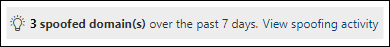

# <a name="spoof-intelligence-insight-in-eop"></a>EOP의 스푸핑 인텔리전스 정보

[!INCLUDE [Microsoft 365 Defender rebranding](../includes/microsoft-defender-for-office.md)]

**적용 대상**
- [Exchange Online Protection](exchange-online-protection-overview.md)
- [Office 365용 Microsoft Defender 플랜 1 및 플랜 2](defender-for-office-365.md)
- [Microsoft 365 Defender](../defender/microsoft-365-defender.md)

> [!NOTE]
> 이 문서에 설명된 기능은 미리 보기에 있으며 변경될 수 있으며 일부 조직에서는 사용할 수 없습니다. 이 문서에 설명된 기능이 조직에 없는 경우 EOP에서 스푸핑 인텔리전스 정책을 사용하여 스푸핑된 보낸 사람 관리에서 이전 스푸핑 관리 환경을 [참조하세요.](walkthrough-spoof-intelligence-insight.md)

Microsoft 365 사서함이 없는 Exchange Online 또는 EOP(독립 실행형 Exchange Online Protection) 조직에서 Exchange Online 전자 메일 메시지가 자동으로 스푸핑으로부터 보호됩니다. EOP는 피싱에 **대한** 조직의 전반적인 방어의 일부로 스푸핑 인텔리전스를 사용 합니다. 자세한 내용은 EOP의 스푸핑 방지 보호 [기능을 참조하세요.](anti-spoofing-protection.md)

보낸 사람이 전자 메일 주소를 스푸핑하면 조직의 도메인 중 하나에 있는 사용자 또는 조직에 전자 메일을 보내는 외부 도메인의 사용자로 표시됩니다. 스팸 또는 피싱 전자 메일을 보내기 위해 보낸 사람 스푸핑하는 공격자는 차단해야 합니다. 그러나 합법적인 보낸 사람이 스푸핑하는 시나리오가 있습니다. 예제:

- 내부 도메인을 스푸핑하기 위한 합법적인 시나리오:
  - 타사 보낸 사람이 도메인을 사용하여 회사 설문 조사를 위해 직원에게 대량 메일을 보낼 수 있습니다.
  - 외부 회사에서 사용자 대신 광고 또는 제품 업데이트를 생성하고 전송합니다.
  - 도우미는 정기적으로 조직 내의 다른 사용자에 대한 전자 메일을 보내야 합니다.
  - 내부 응용 프로그램에서 전자 메일 알림을 전송합니다.

- 외부 도메인을 스푸핑하기 위한 합법적인 시나리오:
  - 보낸 사람이 메일링 목록(토론 목록)에 있으며, 메일링 목록은 원래 보낸 사람으로부터 메일링 목록의 모든 참가자에게 전자 메일을 릴레이합니다.
  - 외부 회사가 다른 회사를 대신하여 전자 메일을 전송합니다(예: 자동화된 보고서 또는 소프트웨어 as-a-service 회사).

Microsoft 365 Defender 포털에서  스푸핑 인텔리전스 인사이트를 사용하여 합법적으로 허용되지 않은 전자 메일을 보내는 스푸핑된 보낸 사람(SPF, DKIM 또는 DMARC 검사를 통과하지 않는 도메인의 메시지)을 빠르게 식별하고 이러한 보낸 사람이 수동으로 허용할 수 있습니다.

알려진 보낸 사람이 알려진 위치에서 스푸핑된 메시지를 보낼 수 있도록 허용하면 가음성(나쁜 것으로 표시된 좋은 전자 메일)을 줄일 수 있습니다. 허용된 스푸핑된 보낸 사람 모니터링을 통해 안전하지 않은 메시지가 조직에 도착하지 않도록 추가 보안 계층을 제공합니다.

마찬가지로 스푸핑 인텔리전스에서 허용된 스푸핑된 보낸 사람도 검토하고 스푸핑 인텔리전스 인사이트에서 해당 보낸 사람은 수동으로 차단할 수 있습니다.

이 문서의 나머지부분에서는 Microsoft 365 Defender 포털 및 PowerShell(Exchange Online에 사서함이 있는 Microsoft 365 조직용 Exchange Online PowerShell, 없는 조직을 위한 독립 실행형 EOP PowerShell)에서 스푸핑 인텔리전스 정보를 사용하는 방법을 설명합니다. Exchange Online)

> [!NOTE]
>
> - 스푸핑 인텔리전스에서 검색된 스푸핑된 보낸 사람만 스푸핑 인텔리전스 인사이트에 표시됩니다. 인사이트에서 허용 또는 차단 판정을 다시 설정하면 스푸핑된 보낸 사람이 테넌트 허용/차단 목록의 스푸핑 탭에만 나타나는 수동 허용 또는 차단 항목이 됩니다.  스푸핑 인텔리전스에서 검색되기 전에 스푸핑된 보낸 사람에 대한 허용 또는 차단 항목을 수동으로 만들 수도 있습니다. 자세한 내용은 [EOP에서 테넌트 허용/차단 목록 관리](tenant-allow-block-list.md)를 참조하세요.
>
> - 테넌트 허용/차단  목록의 스푸핑 인텔리전스 정보 분석 및 스푸핑 탭은 보안 및 준수 센터의 스팸 방지 정책 페이지에서 사용할 수 있는 스푸핑 인텔리전스 정책의 & 대체합니다.
>
>- 스푸핑 인텔리전스 인사이트는 7일 동안의 데이터를 보여줍니다. **Get-SpoofIntelligenceInsight** cmdlet은 30일 동안의 데이터를 보여줍니다.

## <a name="what-do-you-need-to-know-before-you-begin"></a>시작하기 전에 알아야 할 내용은 무엇인가요?

- <https://security.microsoft.com/>에서 Microsoft 365 Defender 포털을 엽니다. 테넌트 **허용/차단** 목록 페이지의 스푸핑 탭으로 직접 이동하기 위해 를  <https://security.microsoft.com/tenantAllowBlockList?viewid=SpoofItem> 사용합니다. 스푸핑 인텔리전스 인사이트 **페이지로** 직접 이동하기 위해 를 <https://security.microsoft.com/spoofintelligence> 사용하세요.

- Exchange Online PowerShell에 연결하려면 [Exchange Online PowerShell에 연결](/powershell/exchange/connect-to-exchange-online-powershell)을 참조하세요. 독립 실행형 EOP PowerShell에 연결하려면 [Exchange Online Protection PowerShell에 연결](/powershell/exchange/connect-to-exchange-online-protection-powershell)을 참조하세요.

- 이 게시물의 절차를 수행하려면 먼저 **Exchange Online** 에서 사용 권한을 할당받아야 합니다.
  - 스푸핑 인텔리전스 정책을 수정하거나 스푸핑 인텔리전스를 사용하거나  사용하지 않도록 설정하려면 조직 관리 또는 보안 관리자 역할 그룹의 **구성원이** 되어야 합니다.
  - 스푸핑 인텔리전스 정책에 대한 읽기 전용 액세스 권한을  사용하려면 전역 읽기 사용자 또는 보안 읽기 권한이 있는 역할 그룹의 **구성원이** 해야 합니다.

  자세한 내용은 [Exchange Online의 사용 권한](/exchange/permissions-exo/permissions-exo)을 참조하세요.

  > [!NOTE]
  >
  > - Microsoft 365 관리 센터의 해당 Azure Active Directory 역할에 사용자를 추가하면 사용자에게 필요한 권한 _및_ Microsoft 365의 다른 기능에 대한 권한이 부여됩니다. 자세한 내용은 [관리자 역할 정보](../../admin/add-users/about-admin-roles.md)를 참조하세요.
  > - [Exchange Online](/Exchange/permissions-exo/permissions-exo#role-groups)의 **보기 전용 조직 관리** 역할 그룹에도 기능에 대한 읽기 전용 권한을 부여합니다.

- EOP 및 Microsoft Defender for Office 365 피싱 방지 정책에서 스푸핑 인텔리전스를 사용하도록 설정하고 사용하지 않도록 Office 365. 스푸핑 인텔리전스가 기본적으로 사용됩니다. 자세한 내용은 [EOP에서](configure-anti-phishing-policies-eop.md) 피싱 방지 정책 구성 또는 Microsoft [Defender에서](configure-mdo-anti-phishing-policies.md)피싱 방지 정책 Office 365.

- 스푸핑 인텔리전스에 대한 권장 설정은 EOP 피싱 방지 정책 [설정을 참조하세요.](recommended-settings-for-eop-and-office365-atp.md#eop-anti-phishing-policy-settings)

## <a name="open-the-spoof-intelligence-insight-in-the-microsoft-365-defender-portal"></a>검색 포털에서 스푸핑 인텔리전스 정보 Microsoft 365 Defender 열기

1. Microsoft 365 Defender 포털의 규칙 섹션에서 전자 메일 **&** 공동 작업 정책 & 규칙 위협 정책 \>  \>  \> **테넌트 허용/차단 목록으로** 이동하세요. 

2. **테넌트 허용/차단 목록** 페이지에서 스푸핑 인텔리전스 인사이트는 다음과 같습니다.

   

   인사이트에는 다음 두 가지 모드가 있습니다.

   - **인사이트** 모드: 스푸핑 인텔리전스를 사용하도록 설정하면 지난 7일 동안 스푸핑 인텔리전스에서 검색된 메시지 수가 표시됩니다.
   - **모드의 경우:** 스푸핑 인텔리전스를 사용하지 않도록 설정하면  지난 7일 동안 스푸핑 인텔리전스에서 검색된 메시지의 수가 인사이트에 표시됩니다.

스푸핑 인텔리전스 검색에 대한  정보를 보려면 스푸핑 인텔리전스 정보에서 스푸핑 활동 보기를 클릭합니다.

### <a name="view-information-about-spoofed-messages"></a>스푸핑된 메시지에 대한 정보 보기

> [!NOTE]
> 스푸핑 인텔리전스에서 검색된 스푸핑된 보낸 사람만 이 페이지에 표시됩니다. 인사이트에서 허용 또는 차단 판정을 다시 설정하면 스푸핑된 보낸 사람이 테넌트 허용/차단 목록의 스푸핑 탭에만 나타나는 수동 허용 또는 차단 항목이 됩니다. 

**스푸핑** 인텔리전스 인사이트에서  스푸핑 활동 보기를 클릭하면 나타나는 스푸핑 인텔리전스 정보 페이지에는 다음 정보가 포함되어 있습니다.

- **스푸핑된 사용자:** 전자 메일 클라이언트의 시작 상자에 표시되는  스푸핑된 사용자의 도메인입니다.  From 주소를 주소라고도 `5322.From` 합니다.
- **보내는 인프라:** 인프라라고도 _합니다._ 보내는 인프라는 다음 값 중 하나입니다.
  - 원본 전자 메일 서버의 IP 주소에 대한 역방향 DNS 검색(PTR 레코드)에 있는 도메인입니다.
  - 원본 IP 주소에 PTR 레코드가 없는 경우 보내는 인프라는 \<source IP\> /24(예: 192.168.100.100/24)로 식별됩니다.
- **메시지 수:** 지난 7일 이내에 스푸핑된  도메인과 조직에 전송하는 인프라 조합의 메시지 수입니다.
- **마지막으로 확인한** 날짜: 스푸핑된 도메인이 포함된 보내는 인프라에서 메시지를 받은 마지막 날짜입니다.
- **스푸핑 유형:** 다음 값 중 하나
  - **내부:** 스푸핑된 보낸 사람이 조직에 속한 도메인(허용 [도메인)에 있습니다.](/exchange/mail-flow-best-practices/manage-accepted-domains/manage-accepted-domains)
  - **외부:** 스푸핑된 보낸 사람이 외부 도메인에 있습니다.
- **작업:** 이 값은 **허용되거나** **차단됩니다.**
  - **허용 :** 도메인에서 명시적 전자 메일 인증 검사 [SPF,](how-office-365-uses-spf-to-prevent-spoofing.md) [DKIM](use-dkim-to-validate-outbound-email.md)및 [DMARC를](use-dmarc-to-validate-email.md)확인하지 못했습니다. 그러나 도메인이 암시적 전자 메일 인증[확인(복합 인증)을 통과했습니다.](email-validation-and-authentication.md#composite-authentication) 따라서 메시지에 대한 스푸핑 방지 작업이 수행하지 않습니다.
  - **차단:** 스푸핑된 도메인과 보내는 인프라의  조합에서 보낸 메시지는 스푸핑 인텔리전스에 의해 잘못된 것으로 표시됩니다. 스푸핑된 메시지에 대해 수행되는 작업은 기본 피싱 방지 정책 또는 사용자 지정 피싱 방지 정책(기본값은 정크 메일 폴더로 메시지 이동)에 의해 **제어됩니다.** 자세한 내용은 [Microsoft Defender에서](configure-mdo-anti-phishing-policies.md)피싱 방지 정책 구성을 Office 365.

선택한 열 제목을 클릭하여 결과를 정렬할 수 있습니다.

결과를 필터링하기 위해 다음 옵션을 사용할 수 있습니다.

- 필터 **단추를** 클릭합니다. 필터 **플라이아웃이** 나타나면 다음을 사용하여 결과를 필터링할 수 있습니다.
  - **스푸핑 유형**
  - **작업**
- 검색 **상자를** 사용하여 스푸핑된 도메인 값의 COMMA로 구분된 목록을 입력하거나 인프라 값을 보내 결과를 필터링합니다.

### <a name="view-details-about-spoofed-messages"></a>스푸핑된 메시지에 대한 세부 정보 보기

목록에서 항목을 선택하면 다음과 같은 정보와 기능이 포함된 세부 정보 플라이아웃이 나타납니다.

-  스푸핑 또는 스푸핑 차단 **허용:** 이러한 값 중 하나를 선택하여 원래 스푸핑 인텔리전스 판정을 재지정하고 스푸핑에 대한 허용 또는 차단 항목으로 스푸핑 인텔리전스 정보 분석에서 테넌트 허용/차단 목록으로 항목을 이동합니다.
- 이 경우 이유가 있습니다.
- 해야 할 일.
- 주 스푸핑 인텔리전스 페이지의 대부분의 동일한 정보를 포함하는 도메인 요약입니다.
- 보낸 사람에 대한 데이터입니다.
- 위협 [탐색기를](threat-explorer.md) 열어 Microsoft Defender에서 피싱  보기에서 보낸 사람에 대한 추가 세부 정보를 볼 \>  수 Office 365.
- 동일한 보낸 사람으로부터 테넌트에 비슷한 메시지가 표시됩니다.

### <a name="about-allowed-spoofed-senders"></a>허용된 스푸핑된 보낸 사람에 대한

스푸핑 인텔리전스 인사이트에서 허용된 스푸핑된 보낸 사람 또는 수동으로 스푸핑 허용으로 변경한 차단된 스푸핑된 보낸 사람이  스푸핑된 도메인과 보내는 인프라의 조합에서 보낸 메시지만 허용합니다.  모든 원본에서 스푸핑된 도메인의 전자 메일을 허용하지 않으며 도메인에 대한 보내는 인프라의 전자 메일을 허용하지 않습니다.

예를 들어 스푸핑된 보낸 사람에 대해 다음 스푸핑이 허용됩니다.

- **도메인**: gmail.com
- **인프라:** tms.mx.com

해당 도메인/보내는 인프라 쌍의 전자 메일만 스푸핑할 수 있습니다. 스푸핑을 시도하는 gmail.com 자동으로 허용되지 않습니다. 다른 도메인의 보낸 사람이 보낸 tms.mx.com 스푸핑 인텔리전스를 통해 여전히 확인하며 차단될 수 있습니다.

## <a name="use-the-spoof-intelligence-insight-in-exchange-online-powershell-or-standalone-eop-powershell"></a>PowerShell 또는 독립 실행형 EOP PowerShell에서 Exchange Online 인텔리전스 정보 사용

PowerShell에서 **Get-SpoofIntelligenceInsight** cmdlet을 사용하여  스푸핑 인텔리전스에서 검색된 허용 및 차단된 스푸핑된 보낸 사람 보기 스푸핑된 보낸 사람 수를 수동으로 허용하거나 차단하려면 **New-TenantAllowBlockListSpoofItems** cmdlet을 사용해야 합니다. 자세한 내용은 [PowerShell을](tenant-allow-block-list.md)사용하여 테넌트 허용/차단 목록에 대한 스푸핑된 보낸 사람 항목 관리를 참조하세요.

스푸핑 인텔리전스 정보에서 정보를 보시다가 다음 명령을 실행합니다.

```powershell
Get-SpoofIntelligenceInsight
```

구문과 매개 변수에 대한 자세한 내용은 [Get-SpoofIntelligenceInsight를 참조하십시오.](/powershell/module/exchange/get-spoofintelligenceinsight)

## <a name="other-ways-to-manage-spoofing-and-phishing"></a>스푸핑 및 피싱을 관리하는 다른 방법

스푸핑 및 피싱 보호에 대해 신각해야 합니다. 다음은 도메인을 스푸핑하는 보낸 사람에 대해 확인하여 조직에 손상을 줄 수 있는 관련 방법을 제공합니다.

- **스푸핑 메일 보고서를 검사합니다.** 이 보고서를 자주 사용하여 스푸핑된 보낸 사람 관리를 지원할 수 있습니다. 자세한 내용은 [스푸핑 검색 보고서를 참조하세요.](view-email-security-reports.md#spoof-detections-report)

- SPF(Sender Policy Framework) 구성을 검토합니다. SPF를 빠르게 도입하여 신속하게 구성하려면 [스푸핑 방지를 위해 Microsoft 365에서 SPF 설정](set-up-spf-in-office-365-to-help-prevent-spoofing.md)을 참조하세요. Office 365에서 SPF를 사용하는 방법이나 문제 해결 또는 비표준 배포(예: 하이브리드 배포)에 대한 자세한 내용은 [Office 365에서 SPF(Sender Policy Framework)를 사용하여 스푸핑을 차단하는 방법](how-office-365-uses-spf-to-prevent-spoofing.md)을 참조하세요.

- DomainKeys 식별 메일(DKIM) 구성을 검토합니다. SPF 및 DMARC 외에도 DKIM을 사용하여 공격자가 도메인에서 보낸 것 같은 메시지를 보내지 못하도록 해야 합니다. DKIM을 사용하면 메시지 머리글에 있는 전자 메일 메시지에 디지털 서명을 첨부할 수 있습니다. 자세한 내용은 [DKIM을 사용하여](use-dkim-to-validate-outbound-email.md)사용자 지정 도메인에서 보낸 아웃바운드 전자 메일의 유효성을 Office 365.

- 도메인 기반 메시지 인증, 보고 및 적합성(DMARC) 구성을 검토합니다. SPF 및 DKIM과 함께 DMARC를 구현하면 스푸핑 및 피싱 전자 메일에 대한 추가 보호 기능이 제공됩니다. DMARC는 수신 메일 시스템이 사용자의 도메인에서 보낸 SPF 또는 DKIM 확인에 실패한 메시지에 대해 수행할 작업을 결정하는 데 도움을 줍니다. 자세한 내용은 [DMARC를](use-dmarc-to-validate-email.md)사용하여 에서 전자 메일의 유효성을 Office 365.
