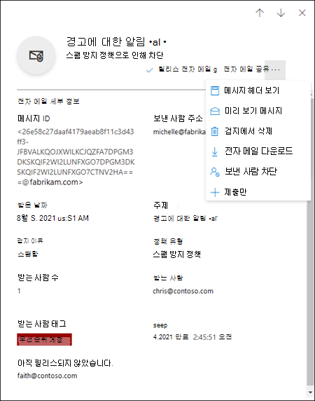
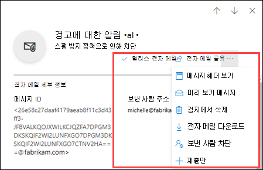

# EOP에서 관리자 권한으로 격리된 메시지 및 파일 관리하기

[!INCLUDE [Microsoft 365 Defender rebranding](../includes/microsoft-defender-for-office.md)]

**적용 대상**
- [Exchange Online Protection](exchange-online-protection-overview.md)
- [Office 365용 Microsoft Defender 플랜 1 및 플랜 2](defender-for-office-365.md)
- [Microsoft 365 Defender](../defender/microsoft-365-defender.md)

Exchange Online 사서함이 있는 Microsoft 365 조직 또는 Exchange Online 사서함이 없는 독립 실행형 EOP(Exchange online Protection) 조직에서 격리는 위험할 가능성이 있거나 원치 않는 메시지를 보유합니다. 자세한 내용은 [EOP에서 Quarantined email messages를 참조하세요.](quarantine-email-messages.md)

관리자는 모든 사용자에 대해 모든 유형의 메시지를 보고, 해제하고, 삭제할 수 있습니다. 관리자만 맬웨어, 높은 신뢰도 피싱 또는 메일 흐름 규칙(전송 규칙)의 결과로 고지된 메시지를 관리할 수 있습니다. 관리자는 Microsoft에 가의성도 보고할 수 있습니다.

Microsoft Defender for Office 365 조직의 관리자는 SharePoint, OneDrive 및 에 대해 금고 첨부 파일로 금고 의해 OneDrive 파일을 관리할 [수도 Microsoft Teams.](mdo-for-spo-odb-and-teams.md)

Microsoft 365 Defender 포털 또는 PowerShell(Exchange Online 사서함이 있는 Microsoft 365 조직, Exchange Online 사서함이 없는 조직의 경우 독립 실행형 EOP PowerShell)에서 Exchange Online 메시지를 보고 관리합니다.

## 시작하기 전에 알아야 할 내용

- Microsoft 365 Defender 포털을 열려면 <https://security.microsoft.com>(으)로 이동합니다. **격리** 페이지를 직접 열려면 <https://security.microsoft.com/quarantine>을(를) 사용합니다.

- Exchange Online PowerShell에 연결하려면 [Exchange Online PowerShell에 연결](/powershell/exchange/connect-to-exchange-online-powershell)을 참조하세요. 독립 실행형 EOP PowerShell에 연결하려면 [Exchange Online Protection PowerShell에 연결](/powershell/exchange/connect-to-exchange-online-protection-powershell)을 참조하세요.

- 이 게시물의 절차를 수행하려면 먼저 **Exchange Online** 에서 사용 권한을 할당받아야 합니다.
  - 모든 사용자에 대해 검역된 메시지에 대해 작업을 수행하려면 조직 **관리,** 보안 관리자 또는 **Quarantine Administrator** 역할 그룹의 \* 구성원일 수 있습니다.
  - 모든 사용자에 대해 정식으로 전송된 메시지에 대한 읽기 전용 액세스의  경우 전역 읽기 사용자 또는 보안 읽기 권한이 있는 역할 그룹의 **구성원이면** 됩니다.

  자세한 내용은 [Exchange Online의 사용 권한](/exchange/permissions-exo/permissions-exo)을 참조하세요.

  **참고**:

  - Microsoft 365 관리 센터의 해당 Azure Active Directory 역할에 사용자를 추가하면 사용자에게 필요한 권한 _및_ Microsoft 365의 다른 기능에 대한 권한이 부여됩니다. 자세한 내용은 [관리자 역할 정보](../../admin/add-users/about-admin-roles.md)를 참조하세요.
  - [Exchange Online](/Exchange/permissions-exo/permissions-exo#role-groups)의 **보기 전용 조직 관리** 역할 그룹도 기능에 대한 읽기 전용 권한을 부여합니다.
  - \*Microsoft 365 Defender 포털의 **전자 메일** & 공동 작업 역할에 있는  **Quarantine** **Administrator** 역할 그룹의 구성원도 Exchange Online PowerShell에서 절차를 수행하려면 Exchange Online 관리 역할 그룹의 구성원이 Exchange Online 합니다. 

- Quarantined messages are retained for a default period of time before they're automatically deleted:
  - 스팸 방지 정책(스팸, 피싱 및 대량 전자 메일)으로 차단된 메시지에 대해 30일 이 값은 기본값 및 최대값입니다. 이 값을 구성(더 낮음)으로 설정하는 내용은 스팸 방지 정책 [구성을 참조합니다.](configure-your-spam-filter-policies.md)
  - 맬웨어가 포함된 메시지의 경우 15일
  - SharePoint, OneDrive 및 Microsoft Teams 대한 금고 첨부 파일로 Microsoft Teams 15일 동안 Office 365.

  메시지가 검지에서 만료되면 복구할 수 없습니다.

## Microsoft 365 Defender 포털을 사용하여 quarantined email messages 관리

### quarantined email 보기

1. Microsoft 365 Defender 포털에서 **전자 메일 및 공동 작업** \> **검토** \> **격리** 로 이동합니다.
2. **Quarantine** 페이지에서 전자 메일 탭이 **선택되어** 있는지 확인하십시오.

3. 사용 가능한 열 헤더를 클릭하여 결과를 정렬할 수 있습니다. **열 사용자 지정** 을 클릭하여 표시되는 열을 변경합니다. 기본값은 별표(\*)로 표시됩니다.

   - **받은 시간**\*
   - **제목**\*
   - **보낸 사람**\*
   - **격리 이유**\*
   - **릴리스 상태**\*
   - **정책 유형**\*
   - **만료**\*
   - **받는 사람**
   - **메시지 ID**
   - **정책 이름**
   - **메시지 크기**
   - **메일 방향**
   - **받는 사람 태그**

   완료되면 **적용** 을 클릭합니다.

4. 결과를 필터링하려면 **필터** 를 클릭합니다. 다음 필터는 표시되는 **필터** 플라이아웃에서 사용할 수 있습니다.
   - **메시지 ID**: 메시지의 GUID(Globally Unique Identifier)입니다.

     예를 들어 메시지  추적을 사용하여 조직의 사용자에게 전송된 메시지를 찾아 메시지가 배달된 것이 아니라 메시지에 대해 중단된 것으로 확인한 경우를 예로 들 수 있습니다. 괄호( )를 포함할 수 있는 전체 메시지 ID 값을 포함해야 \<\> 합니다. 예: `<79239079-d95a-483a-aacf-e954f592a0f6@XYZPR00BM0200.contoso.com>`

   - **보낸 사람 주소**
   - **받는 사람 주소**
   - **제목**
   - **받은 시간**: **시작 시간** 및 **종료 시간**(날짜)을 입력합니다.
   - **만료**: 메시지가 격리에서 만료되는 때를 기준으로 필터링합니다.
     - **오늘**
     - **다음 2일**
     - **다음 7일**
     - **사용자 지정**: **시작 시간** 및 **종료 시간**(날짜)을 입력합니다.
   - **받는 사람 태그**
   - **격리 이유**:
     - **전송 규칙**(메일 흐름 규칙)
     - **대량 전자 메일**
     - **스팸**
     - **맬웨어**
     - **피싱**: 스팸 필터 판정이 피싱 또는 피싱 방지 보호 메시지(스푸핑 설정 또는 [가장 보호](설정-up-phishing-policies)를 통해 확인되었습니다.  
     - **높은 정확도 피싱**
   - **받는** 사람 : **모든 사용자** 또는 **나만 .** 최종 사용자는 해당 사용자에게 전송된 분리된 메시지만 관리할 수 있습니다.
   - **릴리스 상태**: 다음 값을 사용할 수 있습니다.
     - **검토 필요**
     - **승인됨**
     - **승인 거부됨**
     - **릴리스 요청됨**
     - **릴리스됨**
   - **정책 유형**: 정책 유형별로 메시지를 필터링합니다.
     - **맬웨어 방지 정책**
     - **안전한 첨부 파일 정책**
     - **피싱 방지 정책**
     - **스팸 방지 정책**
     - **전송 규칙**(메일 흐름 규칙)

   완료되면 **적용** 을 클릭합니다. 필터를 지우려면 을 클릭합니다. **필터 지우기**

5. **검색** 상자와 해당 값을 사용하여 특정 메시지를 찾습니다. 와일드카드는 지원되지 않습니다. 다음 값을 기준으로 검색할 수 있습니다.
   - 메시지 ID
   - 보낸 사람 전자 메일 주소
   - 받는 사람 전자 메일 주소
   - 제목. 메시지의 전체 제목을 사용합니다. 검색은 대/소문자를 구분하지 않습니다.
   - 정책 이름 메시지의 전체 정책 이름을 사용합니다. 검색은 대/소문자를 구분하지 않습니다.

   검색 조건을 입력한 후 Enter 키를 눌러 결과를 필터링합니다.

격리된 특정 메시지를 찾은 후 해당 메시지를 선택하여 세부 정보를 확인하고 메시지에 대한 작업을 수행합니다(예를 들어 메시지를 보거나, 해제하거나, 다운로드하거나, 삭제하기).

#### 격리된 메시지 세부 정보 보기

목록에서 격리된 메시지를 선택하면 표시되는 세부 정보 플라이아웃에서 다음 정보를 확인할 수 있습니다.

- **메시지 ID**: 메시지의 GUID(Globally Unique Identifier)입니다. 메시지 **헤더의 Message-ID** 헤더 필드에서 사용할 수 있습니다.
- **보낸 사람 주소**
- **수신됨**: 메시지를 수신한 날짜/시간입니다.
- **제목**
- **Quarantine reason:** 메시지가 **스팸,** 대량,  **피싱,** 메일 흐름 **규칙(전송** 규칙)과 일치했거나 맬웨어가 포함된 것으로 확인된 **경우를 보여 주며,**
- **정책 유형**
- **정책 이름**
- **받는 사람 수**
- **받는 사람**: 메시지에 받는 사람이 여러 명 있는 경우 **미리 보기 메시지** 또는 **메시지 헤더 보기** 를 클릭하여 전체 받는 사람의 목록을 확인해야 합니다.
- **받는 사람 태그**: 자세한 내용은 Microsoft [Defender에서](user-tags.md)사용자 태그를 Office 365.
- **만료**: 격리에서 메시지가 자동으로 영구적으로 삭제되는 날짜/시간입니다.
- **해제 대상**: 메시지가 해제된 모든 전자 메일 주소(해당되는 경우)입니다.
- **아직 해제되지 않음**: 메시지가 아직 해제되지 않은 모든 전자 메일 주소(있는 경우)입니다.

메시지에 대한 작업을 수행하려면 다음 섹션을 참조하세요.

> [!NOTE]
> 세부 정보 플라이아웃에서 나가지 않고 보고 있는 격리된 메시지를 변경하려면 플라이아웃 맨 위에 있는 위쪽 및 아래쪽 화살표를 사용합니다.
>
> 

### 격리된 전자 메일에 대한 작업 수행하기

목록에서 격리된 메시지를 선택하면 세부 정보 플라이아웃에서 다음 작업을 수행할 수 있습니다.

-  **릴리스 전자 메일:** 나타나는 플라이아웃 창에서 다음 \* 옵션을 구성합니다.
  - **조직의 허용** 목록에 보낸 사람 추가: 보낸 사람이 보낸 메시지가 검색되지 않도록 방지하려면 이 옵션을 선택합니다.
  - 다음 옵션 중 하나를 선택합니다.
    - **모든 받는 사람에게 릴리스**
    - **특정 받는 사람에게 릴리스:** 나타나는 받는  사람 상자에서 받는 사람을 선택합니다.
  - **이 메시지의 복사본을** 다른 받는 사람에게 보내기: 나타나는 받는  사람 상자에 받는 사람 전자 메일 주소를 입력하려면 이 옵션을 선택합니다.

    > [!NOTE]
    > 메시지 복사본을 다른 받는 사람에게 보내기 위해 원본 받는 사람 중 한명 이상에게 메시지를 릴리스해야 합니다(모든 받는 사람에게 릴리스 또는 특정 받는 사람에게 릴리스 **선택).** 

  - **검색을 향상하기** 위해 Microsoft에 메시지 제출(가음성) : 이 옵션은 기본적으로 선택되어 있으며, 잘못된 메시지를 가음성으로 Microsoft에 보고합니다. 메시지가 스팸, 대량, 피싱 또는 맬웨어를 포함하는 것으로 확인된 경우 메시지도 Microsoft 스팸 분석 팀에 보고됩니다. 분석 결과에 따라 메시지 통과를 허용하도록 서비스 전체 스팸 필터 규칙이 조정될 수 있습니다.

  - **Allow messages like this:** This option is turned off by default (  ). URL, 첨부 파일 및 기타 속성이 비슷한 메시지가 일시적으로 차단되지 않도록 설정(토글)합니다.  이 옵션을 설정하면 다음 옵션을 사용할 수 있습니다.
    - **다음에 제거:** 아래와 같은 메시지를 허용할 기간을 선택합니다. **1일~30일을 선택합니다.**  기본값은 30입니다.
    - **선택 사항:** 허용에 대한 유용한 설명을 입력합니다.

  완료되면 메시지 **릴리스를 클릭합니다.**

  메시지 표시에 대한 참고 사항:

  - 같은 받는 사람에게 메시지를 두 번 이상 릴리스할 수 없습니다.
  - 메시지를 받지 않은 받는 사람만 잠재적인 받는 사람 목록에 표시됩니다.

- . **메시지 헤더 보기** 메시지 헤더 텍스트를 보려면 이 링크를 선택합니다. 다음 링크와 함께 **메시지 헤더** 플라이아웃이 나타납니다.
- **메시지 헤더 복사**: 이 링크를 클릭하여 메시지 헤더(모든 헤더 필드)를 클립보드에 복사합니다.
- **Microsoft 메시지 헤더 분석기**: 헤더 필드 및 값을 자세히 분석하려면 이 링크를 클릭하여 메시지 헤더 분석기로 이동합니다. **분석할 메시지 헤더를 삽입** 섹션에 메시지 헤더를 삽입합니다(Ctrl+V 또는 마우스 오른쪽 단추를 클릭하고 **붙여넣기** 선택). 그런 다음 **헤더 분석** 을 클릭합니다.

 **기타 작업** 을 클릭하면 다음 작업을 수행할 수 있습니다.

- . **메시지 미리 보기**: 표시되는 플라이아웃에서 다음 탭 중 하나를 선택합니다.
  - **원본**: 모든 링크가 비활성화된 메시지 본문의 HTML 버전을 표시합니다.
  - **일반 텍스트**: 메시지 본문을 일반 텍스트로 표시합니다.

- . **격리에서 제거**: 표시되는 경고에서 **예** 를 클릭하면 메시지가 원래 받는 사람에게 전송되지 않고 즉시 삭제됩니다.

-  **전자 메일 다운로드**: 표시되는 플라이아웃에서 **이 메시지를 다운로드할 때의 위험을 이해합니다** 를 선택한 다음 **다운로드** 를 클릭하여 메시지의 로컬 복사본을 .eml 형식으로 저장합니다.

-  **보낸 사람 차단**: **귀하** 의 사서함의 수신 거부 목록에 보낸 사람을 추가합니다. 자세한 내용은 [메일 보낸 사람 차단](https://support.microsoft.com/office/b29fd867-cac9-40d8-aed1-659e06a706e4)을 참조하세요.

-  **전송만:** 분석을 위해 Microsoft에 메시지를 보고합니다. 플라이아웃이 나타나면 다음 옵션을 선택합니다.
  - **제출 유형:** **전자** 메일(기본값), **URL** 또는 파일 을 **선택합니다.**
  - **네트워크 메시지 ID를 추가하거나 전자 메일** 파일을 업로드합니다. 다음 옵션 중 하나를 선택합니다.
    - **전자 메일 네트워크 메시지 ID** 추가(기본값, 상자에 해당 값 사용)
    - **업로드 파일(.msg 또는 eml)**: 파일  찾아보기를 클릭하여 제출할 .msg 또는 .eml 메시지 파일을 찾아 선택합니다.
  - 문제가 있는 받는 사람을 **선택합니다.** 메시지의 원래 받는 사람을 하나 이상 선택하여 해당 받는 사람에게 적용된 정책을 분석합니다.
  - **Microsoft에 제출할 이유 선택:** 다음 옵션 중 하나를 선택합니다.
    - **차단되지 않은 경우(가음성)** (기본값): 다음 옵션을 사용할 수 있습니다.
      - **Allow messages like this:** This option is turned off by default (  ). URL, 첨부 파일 및 기타 속성이 비슷한 메시지가 일시적으로 차단되지 않도록 설정(토글)합니다.  이 옵션을 설정하면 다음 옵션을 사용할 수 있습니다.
        - **다음에 제거:** 아래와 같은 메시지를 허용할 기간을 선택합니다. **1일~30일을 선택합니다.**  기본값은 30입니다.
        - **선택 사항:** 허용에 대한 유용한 설명을 입력합니다.
    - **차단(거짓 부정) 을(를) 차단해야 합니다.**

  작업을 마쳤으면 **제출** 을 클릭합니다.

\*이미 릴리스된 메시지에 대해 이 옵션을 사용할 수 없습니다(**릴리스 상태** 값은 **릴리스됨**).

메시지를 해제하거나 제거하지 않으면 기본 격리 보존 기간이 만료된 후 삭제됩니다(**만료** 열에 표시됨).

> [!NOTE]
> 모바일에서는 작업 아이콘의 설명 텍스트를 볼 수 없습니다.
>
> 
>
> 아이콘 순서 및 해당 설명은 다음 표에 요약되어 있습니다.
>
> |아이콘|설명|
> |---:|---|
> ||**전자 메일 해제**|
> ||**메시지 헤더 보기**|
> ||**메시지 미리 보기**|
> ||**격리 해제**|
> ||**전자 메일 다운로드**|
> ||**보낸 사람 차단**|
> ||**제출만**|

#### 여러 개의 격리된 전자 메일 메시지에 대한 작업 수행하기

첫 번째 열의 왼쪽에 있는 빈 영역을 클릭하여 목록에서 격리된 메시지를 여러 개(최대 100개) 선택하면 다음 작업을 수행할 수 있는 **대량 작업** 드롭다운 목록이 나타납니다.

-  **메시지 릴리스:** 모든 받는 사람에게 메시지를 릴리스합니다. 플라이아웃이 나타나면 단일 메시지를 릴리스할 때와 동일한 다음 옵션을 선택할 수 있습니다.
  - **조직의 허용 목록에 보낸 사람 추가**
  - **이 메시지의 복사본을 다른 받는 사람에게 보내기**
  - **검색을 개선하기 위해 Microsoft에 메시지 제출(가음성)**
  - **Allow messages like this**:
    - **제거 후:** **1일에서** **30일까지**
    - **선택 사항 참고 사항**

  완료되면 메시지 **릴리스를 클릭합니다.**

  > [!NOTE]
  > 다음 시나리오를 고려합니다. john@gmail.com 메시지를 faith@contoso.com john@subsidiary.contoso.com. Gmail은 이 메시지를 Microsoft에서 피싱으로 모두 검역으로 라우팅된 두 개의 복사본으로 쌍으로 처리합니다. 관리자는 이러한 두 메시지를 모두 릴리스하여 admin@contoso.com. 관리자 사서함에 도달하는 첫 번째 릴리스된 메시지가 배달됩니다. 두 번째 릴리스된 메시지는 중복 배달으로 식별되어 건너뜁니다. 메시지는 동일한 메시지 ID와 수신 시간이 있는 경우 중복 항목으로 식별됩니다.

-  **메시지 삭제**: 표시되는 경고에서 **예** 를 클릭하면 메시지가 원래 받는 사람에게 전송되지 않고 격리에서 즉시 제거됩니다.
-  **메시지 다운로드**
-  **제출만**

## Microsoft 365 Defender 포털을 사용하여 Defender for Office 365

> [!NOTE]
> 이 섹션의 quarantined files for this section are available only to Microsoft Defender for Office 365 plan 1 or Plan 2 subscribers.

Defender for Office 365 조직에서 관리자는 SharePoint Online, 비즈니스용 OneDrive 및 파일에서 금고 첨부 파일로 비즈니스용 OneDrive 파일을 관리할 Microsoft Teams. 이러한 파일에 대한 보호를 사용하도록 설정하려면 에 대한 금고 첨부 파일 [켜기, SharePoint,](turn-on-mdo-for-spo-odb-and-teams.md)OneDrive 및 Microsoft Teams.

### quarantined files(Quarantined Files 보기)

1. Microsoft 365 Defender 포털에서 **전자 메일 및 공동 작업** \> **검토** \> **격리** 로 이동합니다.
2. **Quarantine** 페이지에서 **Files(파일)** 탭(전자 **메일이** 기본 탭)을 선택합니다.

3. 사용 가능한 열 헤더를 클릭하여 결과를 정렬할 수 있습니다. 열 **사용자 지정을 클릭하여** 표시되는 열을 변경합니다. 기본 열에는 다음이 표시되어 있습니다. \*
   - **사용자**\*
   - **위치**\*
   - **첨부 파일 이름**\*
   - **파일 URL**\*
   - **파일 크기**
   - **릴리스 상태**\*
   - **만료**\*
   - **검색한 경우**
   - **시간으로 수정**

   작업을 마치면 적용 또는 **취소를** **클릭합니다.**

4. 결과를 필터링하려면 **필터** 를 클릭합니다. 다음 필터는 표시되는 **필터** 플라이아웃에서 사용할 수 있습니다.
   - **받은 시간:** **시작 시간** 및 **종료 시간(날짜)**
   - **만료:** **시작 시간 및** **종료 시간(날짜)**
   - **Quarantine reason**: The only available value is **Malware**.
   - **정책 유형**

   작업을 마치면 적용 또는 **취소를** **클릭합니다.**

특정 고지된 파일을 찾은 후 해당 파일을 선택하여 해당 파일에 대한 세부 정보를 보고 파일에 대한 조치를 취합니다(예: 파일 보기, 릴리스, 다운로드 또는 삭제).

#### quarantined file details 보기

목록에서 고지된 파일을 선택하면 열 수 있는 세부 정보 플라이아웃에서 다음 정보를 사용할 수 있습니다.

- **File Name**
- **파일 URL:** 파일의 위치를 정의하는 URL입니다(예: SharePoint Online).
- **검색된 악성 콘텐츠** 파일이 대리된 날짜/시간입니다.
- **만료 날짜:** 파일이 검지에서 삭제되는 날짜입니다.
- **검색한 경우**
- **릴리스 여부**
- **맬웨어 이름**
- **문서 ID:** 문서의 고유 식별자입니다.
- **파일 크기:** KB(킬로바이트)
- **조직** 조직의 고유 ID입니다.
- **마지막으로 수정한 날짜**
- **수정한 사람:** 파일을 마지막으로 수정한 사용자입니다.
- **Secure Hash Algorithm 256비트(SHA-256) 값:** 이 해시 값을 사용하여 다른 신뢰도 저장소 또는 환경의 다른 위치에서 파일을 식별할 수 있습니다.

파일에 대한 작업을 수행하기 위해 다음 섹션을 참조하세요.

> [!NOTE]
> 세부 정보 플라이아웃에 남아 있지만 보고 있는 분리된 파일을 변경하기 위해 플라이아웃의 위쪽 및 아래쪽 화살표를 사용 합니다.
>
> 

### 고지된 파일에 대한 작업 수행

목록에서 고지된 파일을 선택한 후 세부 정보 플라이아웃에서 다음 작업을 사용할 수 있습니다.

-  **릴리스 파일:** 나타나는 플라이아웃 창에서 분석을 위해 Microsoft에 보고서 파일을 설정하거나 해제한 다음 \* 릴리스를 **클릭합니다.**
-  **파일 다운로드:** 나타나는 플라이아웃에서 이 파일을 다운로드할 경우의 위험을 이해합니다.를 선택한 다음 다운로드를 클릭하여 파일의 로컬 복사본을 저장합니다. 
-  **Quarantine에서** 제거: 나타나는 경고에서 **예를** 클릭하면 파일이 즉시 삭제됩니다.
-  **보낸 사람 차단**: **귀하** 의 사서함의 수신 거부 목록에 보낸 사람을 추가합니다. 자세한 내용은 [메일 보낸 사람 차단](https://support.microsoft.com/office/b29fd867-cac9-40d8-aed1-659e06a706e4)을 참조하세요.

\*이 옵션은 이미 릴리스된 파일에는 사용할  수 없습니다(릴리스된 상태 값은 **릴리스).**

파일을 해제하거나 제거하지 않는 경우 기본 검지 보존 기간이 만료된 후 삭제됩니다(만료 **열에** 표시).

#### 여러 개의 고지된 파일에 대한 작업 수행

제목 열 왼쪽의 빈 영역을 클릭하여 목록에서 여러 개의 분리된 파일(최대 100개)을  선택하면 다음 작업을 수행할 수 있는 대량 작업 드롭다운 목록이 나타납니다. 

-  **릴리스 파일:** 나타나는 플라이아웃 창에서 분석을 위해 **Microsoft에 보고서** 파일을 설정하거나 해제한 다음 릴리스를 **클릭합니다.**
-  **Quarantine에서** 제거: 나타나는 경고에서 **예를** 클릭하면 파일이 즉시 삭제됩니다.
-  **파일 다운로드:** 나타나는 플라이아웃에서 이 파일을 다운로드할 경우의 위험을 이해합니다.를 선택한 다음 다운로드를 클릭하여 파일의 로컬 복사본을 저장합니다. 

## PowerShell Exchange Online 독립 실행형 EOP PowerShell을 사용하여 독립 실행형 메시지 및 파일 보기 및 관리

다음 목록에는 메시지와 파일을 확인 및 관리하는 데 사용하는 cmdlet이 설명되어 있습니다.

- [Delete-QuarantineMessage](/powershell/module/exchange/delete-quarantinemessage)
- [Export-QuarantineMessage](/powershell/module/exchange/export-quarantinemessage)
- [Get-QuarantineMessage](/powershell/module/exchange/get-quarantinemessage)
- [Preview-QuarantineMessage:](/powershell/module/exchange/preview-quarantinemessage)이 cmdlet은 메시지에만 사용하며, 금고, SharePoint, OneDrive 및 파일에 대한 Microsoft Teams.
- [Release-QuarantineMessage](/powershell/module/exchange/release-quarantinemessage)

## 자세한 내용

[Quarantined messages FAQ](quarantine-faq.yml)
