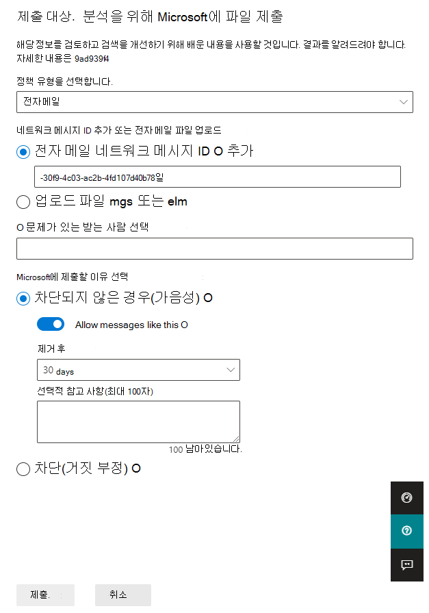

# <a name="add-allows-in-the-tenant-allowblock-list"></a>테넌트 허용/차단 목록에 허용 추가

[!INCLUDE [Microsoft 365 Defender rebranding](../includes/microsoft-defender-for-office.md)]

**적용 대상**
- [Exchange Online Protection](exchange-online-protection-overview.md)
- [Office 365용 Microsoft Defender 플랜 1 및 플랜 2](defender-for-office-365.md)
- [Microsoft 365 Defender](../defender/microsoft-365-defender.md)

허용을 테넌트 허용/차단 목록에 직접 추가할 수 없습니다. 관리자 제출 프로세스를 사용하여 테넌트 허용/차단 목록에 URL, 파일 및/또는 보낸 사람 허용을 추가합니다. Microsoft는 관리자가 직접 허용하도록 허용하지는 않지만 차단된 기능을 결정하고 사용자에게 허용을 제공합니다. 대부분의 경우 허용을 추가하여 시스템에 시간을 주고, 허용되는 경우 자연스럽게 허용합니다. 경우에 따라 Microsoft에서 허용을 관리합니다.

## <a name="add-allows-using-the-submissions-portal"></a>Add를 사용하면 제출 포털을 사용할 수 있습니다. 

파일, URL 및 보낸 사람에 대한 파일, URL 및 보낸 사람 허용은 Microsoft 365 Defender. 

1. Microsoft 365 Defender 포털에서 전자 메일 &  \> **제출로 이동하세요.**

2. 제출 **페이지에서** 분석용 **제출** 탭이 선택되어 있는지 확인한 다음 광고  **분석을 위해 Microsoft에 제출합니다.**

3. 검토 **플라이아웃을 위해 Microsoft에** 제출을 사용하여 보낸 사람, 파일 또는 URL을 가음성으로 표시합니다. 

4. **Microsoft에** 제출할 이유 선택 섹션에서 차단되지 않은 경우(가음성)를 **선택합니다.** 

5. 이 **옵션과 같은 메시지 허용을 으로** 하세요. 

6. 제거 **후 드롭다운** 목록에서 허용 옵션이 작동하도록 할 기간을 지정합니다.

7. 완료되면 제출 **단추를** 클릭합니다.

> [!div class="mx-imgBorder"]
> 

## <a name="create-spoofed-sender-allow-entries-using-microsoft-365-defender"></a>스푸핑된 보낸 사람 허용 항목을 Microsoft 365 Defender

**참고**:

- _스푸핑된_ 사용자와 도메인  쌍에 정의된 전송 인프라의 조합만 스푸핑을 특별히 허용하거나 차단합니다.
- 도메인 쌍에 대해 허용 또는 차단 항목을 구성하면 해당 도메인 쌍의 메시지가 더 이상 스푸핑 인텔리전스 인사이트에 나타나지 않습니다.
- 스푸핑된 보낸 사람에 대한 항목은 만료되지 않습니다.
- 스푸핑은 허용 및 차단을 모두 지원합니다. URL은 허용만 지원됩니다.

1. Microsoft 365 Defender 포털에서 정책 &  규칙 규칙 \>  \>  섹션 \> **테넌트 허용/차단 목록으로 이동하세요.**

2. **테넌트 허용/차단 목록** 페이지에서  스푸핑 탭을 선택한 다음 차단  **추가** 합니다.

3. 나타나는 **새 도메인** 쌍 추가 플라이아웃에서 다음 설정을 구성합니다.
   - **와일드카드를 통해** 새 도메인 쌍 추가: 한 줄에 도메인 쌍을 하나씩 입력하고 최대 20개까지 입력합니다. 스푸핑된 보낸 사람 항목에 대한 구문에 대한 자세한 내용은 [테넌트 허용/차단 목록 관리를 참조하세요.](tenant-allow-block-list.md)
   - **스푸핑 유형:** 다음 값 중 하나를 선택합니다.
     - **내부:** 스푸핑된 보낸 사람이 조직에 속한 도메인(허용 [도메인)에 있습니다.](/exchange/mail-flow-best-practices/manage-accepted-domains/manage-accepted-domains)
     - **외부:** 스푸핑된 보낸 사람이 외부 도메인에 있습니다.
   - **작업:** 허용 **또는 차단을** **선택합니다.**

4. 작업을 마쳤으면 **추가** 를 클릭합니다.

## <a name="add-spoofed-sender-allow-entries-using-powershell"></a>PowerShell을 사용하여 스푸핑된 보낸 사람 허용 항목 추가

테넌트 허용/차단 목록에 스푸핑된 보낸 사람 항목을 추가하기 위해 다음 구문을 사용하세요.

```powershell
New-TenantAllowBlockListSpoofItems -SpoofedUser <Domain | EmailAddress | *> -SendingInfrastructure <Domain | IPAddress/24> -SpoofType <External | Internal> -Action <Allow | Block>
```

구문과 매개 변수에 대한 자세한 내용은 [New-TenantAllowBlockListSpoofItems를 참조하십시오.](/powershell/module/exchange/new-tenantallowblocklistspoofitems)

## <a name="related-articles"></a>관련 문서

- [관리자 제출](admin-submission.md)
- [가짓 긍정 및 거짓 부정 보고](report-false-positives-and-false-negatives.md)