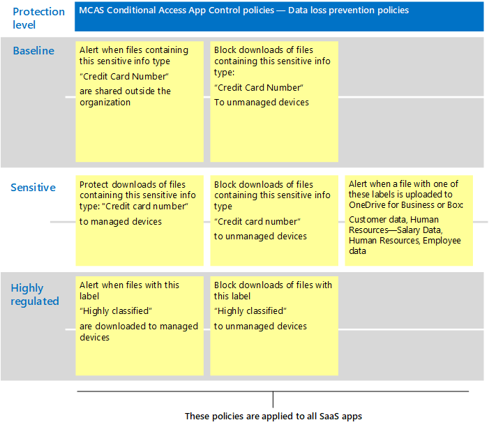

# SaaS Microsoft Cloud App Security 권장 정책
Microsoft Cloud App Security Azure AD 조건부 액세스 정책을 사용하여 다운로드, 업로드, 복사 및 붙여넣기, 인쇄 차단과 같은 SaaS 앱을 사용하여 세부적인 작업을 실시간으로 모니터링하고 제어할 수 있습니다. 이 기능은 관리되지 않는 장치나 게스트 사용자가 회사 리소스에 액세스하는 경우와 같이 내재된 위험을 수반하는 세션에 보안을 추가합니다.

Microsoft Cloud App Security 기본적으로 Microsoft Information Protection 콘텐츠 검사를 제공하여 중요한 정보 유형 및 민감도 레이블을 기반으로 중요한 데이터를 찾고 적절한 조치를 취하도록 합니다.

이 지침에는 다음 시나리오에 대한 권장 사항이 포함되어 있습니다.

- IT 관리에 SaaS 앱 가져오기
- 특정 SaaS 앱에 대한 보호 조정
- 데이터 보호 규정을 준수하도록 DLP(데이터 손실 방지) 구성

## IT 관리에 SaaS 앱 가져오기

Microsoft Cloud App Security 사용하여 SaaS 앱을 관리하는 첫 번째 단계는 이러한 앱을 검색한 다음 Azure AD 테넌트에 추가하는 것입니다. 검색에 도움이 필요한 경우 [네트워크에서 SaaS 앱](/cloud-app-security/tutorial-shadow-it)검색 및 관리를 참조하세요. 앱을 검색한 후 Azure AD 테넌트에 [추가합니다.](/azure/active-directory/manage-apps/add-application-portal)

다음을 수행하여 이러한 관리 작업을 시작할 수 있습니다.

1. 먼저 Azure AD에서 새 조건부 액세스 정책을 만들고 "조건부 액세스 앱 제어 사용"으로 구성합니다. 그러면 요청이 Cloud App Security. 하나의 정책을 만들고 모든 SaaS 앱을 이 정책에 추가할 수 있습니다.
1. 다음으로, Cloud App Security 세션 정책을 생성합니다. 적용할 각 컨트롤에 대해 정책을 하나씩 만들어야 합니다.

SaaS 앱에 대한 사용 권한은 일반적으로 앱에 대한 액세스에 대한 비즈니스 필요성을 기반으로 합니다. 이러한 권한은 매우 동적일 수 있습니다. Cloud App Security 정책을 사용하면 사용자가 기준, 중요 또는 높은 규제 대상 보호와 연결된 Azure AD 그룹에 할당되어 있는지 여부에 관계없이 앱 데이터를 보호할 수 있습니다.

SaaS 앱 컬렉션 전체에서 데이터를 보호하기 위해 다음 다이어그램은 필요한 Azure AD 조건부 액세스 정책과 해당 앱에서 만들 수 있는 제안된 정책을 Cloud App Security. 이 예제에서 만든 정책은 Cloud App Security 모든 SaaS 앱에 적용됩니다. 이러한 컨트롤은 장치에 관리되는지 여부와 파일에 이미 적용된 민감도 레이블에 따라 적절한 컨트롤을 적용하도록 디자인되었습니다.

다음 표에는 Azure AD에서 만들어야 하는 새 조건부 액세스 정책이 나열되어 있습니다.

|보호 수준|정책|추가 정보|
|---|---|---|
|모든 보호 수준|[앱에서 조건부 액세스 앱 컨트롤 Cloud App Security](/cloud-app-security/proxy-deployment-aad#configure-integration-with-azure-ad)|이렇게 하여 IdP(Azure AD)가 사용자와 함께 작동하도록 Cloud App Security.|
||||

다음 표에는 위에 설명된 예제 정책이 나열되어 있습니다. 모든 SaaS 앱을 보호하기 위해 만들 수 있습니다. 자체 비즈니스, 보안 및 규정 준수 목표를 평가한 다음 환경에 가장 적합한 보호를 제공하는 정책을 만들어야 합니다.

|보호 수준|정책|
|---|---|
|기준|관리되지 않는 장치의 트래픽 모니터링 
 관리되지 않는 장치에서 파일 다운로드에 보호 추가|
|중요|중요하거나 관리되지 않는 장치에서 분류된 파일 다운로드 차단(브라우저 전용 액세스 제공)|
|매우 엄격한 규제|모든 장치에서 분류된 레이블이 붙은 파일 다운로드 차단(브라우저 전용 액세스 제공)|
|||

조건부 액세스 앱 컨트롤을 설정하는 전체 지침은 추천 앱에 대한 조건부 [액세스 앱 컨트롤 배포를 참조하세요.](/cloud-app-security/proxy-deployment-aad) 이 문서에서는 Azure AD에서 필요한 조건부 액세스 정책을 만들고 SaaS 앱을 테스트하는 프로세스를 설명합니다.

자세한 내용은 조건부 액세스 앱 제어로 Microsoft Cloud App Security [보호를 참조하세요.](/cloud-app-security/proxy-intro-aad)

## 특정 SaaS 앱에 대한 보호 조정

환경의 특정 SaaS 앱에 추가 모니터링 및 컨트롤을 적용할 수 있습니다. Cloud App Security 사용하면 이 작업을 수행할 수 있습니다. 예를 들어 Box와 같은 앱이 환경에서 많이 사용되는 경우 추가 컨트롤을 적용하는 것이 좋습니다. 또는 법무 또는 재무 부서에서 중요한 비즈니스 데이터에 대해 특정 SaaS 앱을 사용하는 경우 이러한 앱에 대한 추가 보호를 대상으로 할 수 있습니다.

예를 들어 다음과 같은 유형의 기본 제공 이상 검색 정책 템플릿으로 Box 환경을 보호할 수 있습니다.

- 익명 IP 주소에서의 활동
- 의외의 국가에서의 활동
- 의심스러운 IP 주소에서의 활동
- 불가능한 이동
- 종료된 사용자가 수행한 활동(IdP로 AAD 필요)
- 맬웨어 검색
- 여러 번 실패한 로그인 시도
- 랜섬웨어 활동
- 위험한 Oauth 앱
- 비정상적 파일 공유 활동

이러한 예제는 다음과 같습니다. 추가 정책 템플릿은 정기적으로 추가됩니다. 특정 앱에 추가 보호를 적용하는 방법에 대한 예제는 연결된 앱 [보호를 참조하세요.](/cloud-app-security/protect-connected-apps)

[Box Cloud App Security](/cloud-app-security/protect-box) 보호하는 방법 상자 및 기타 앱에서 중요한 데이터를 사용하여 비즈니스 데이터를 보호하는 데 도움이 되는 컨트롤 유형을 보여 줍니다.

## 데이터 보호 규정을 준수하도록 DLP(데이터 손실 방지) 구성

Cloud App Security 규정 준수 규정에 대한 보호를 구성하는 데 유용한 도구가 될 수 있습니다. 이 경우 규정이 적용되는 특정 데이터를 찾아 적절한 조치를 취하도록 각 정책을 구성하는 특정 정책을 만들 수 있습니다.

다음 그림과 표에서는 GDPR(일반 데이터 보호 규정)을 준수하도록 구성할 수 있는 정책의 몇 가지 예를 제공합니다. 이러한 예에서 정책은 특정 데이터를 검색합니다. 데이터의 민감도에 따라 각 정책은 적절한 조치를 취하도록 구성됩니다.

|보호 수준|정책 예|
|---|---|
|기준|이 중요한 정보 유형("신용 카드 번호")이 포함된 파일이 조직 외부에서 공유되는 경우 경고 
 >중요한 정보 유형("신용 카드 번호")이 포함된 파일의 다운로드를 관리되지 않는 장치에 차단|
|중요|관리되는 장치에 이 중요한 정보 유형("신용 카드 번호")이 포함된 파일의 다운로드 보호 
 이 중요한 정보 유형("신용 카드 번호")을 포함하는 파일의 관리되지 않는 장치에 대한 다운로드 차단 
 이러한 레이블이 있는 파일이 비즈니스용 OneDrive 또는 Box에 업로드될 때 경고(고객 데이터, 인사: 급여 데이터, 인사, 직원 데이터)|
|매우 엄격한 규제|이 레이블이 있는 파일("높은 분류")이 관리 장치에 다운로드될 때 경고 
 이 레이블을 통해 관리되지 않는 장치에 대한 파일 다운로드 차단("높은 분류")|
|||

## 다음 단계

이 문서의 사용에 대한 자세한 Cloud App Security [설명서를 Microsoft Cloud App Security 참조하세요.](//cloud-app-security/)
