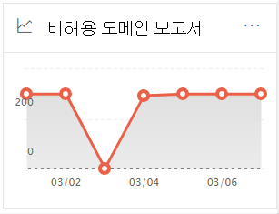

# 보안 및 준수 센터의 & 도메인 보고서

[!INCLUDE [Microsoft 365 Defender rebranding](../includes/microsoft-defender-for-office.md)]

**적용 대상**
- [Exchange Online Protection](exchange-online-protection-overview.md)
- [Office 365용 Microsoft Defender 플랜 1 및 플랜 2](defender-for-office-365.md)
- [Microsoft 365 Defender](../defender/microsoft-365-defender.md)

[보안](https://protection.office.com) & 준수 센터의  메일 흐름 대시보드에 있는 허용되지 않는 도메인 보고서에는 보낸 사람 도메인이 Microsoft 365 조직에서 허용 도메인으로 구성되지 않은 경우의 메시지에 대한 정보가 표시됩니다. 

Microsoft 365 메시지의 의도가 악의적일 수 있는 것으로 증명할 데이터가 있는 경우 이러한 메시지가 스로틀될 수 있습니다. 따라서 어떤 일이 일어나는지 이해하고 문제를 해결하는 것이 중요합니다.

## 허용되지 않는 도메인 보고서에 대한 보고서 보기

허용되지 않은 도메인  위젯에서 차트를 클릭하면 허용되지 않은 도메인 **보고서로 표시됩니다.**

기본적으로 영향을 받는 모든 커넥터에 대한 활동이 표시됩니다. 에 대한 **데이터 표시를** 클릭하면 드롭다운에서 특정 커넥터를 선택할 수 있습니다.

차트에서 데이터 포인트(일)를 마우스로 마우스로 대면 커넥터의 총 메시지 수가 표시됩니다.

## 허용되지 않는 도메인 보고서에 대한 세부 정보 테이블 보기

보고서 보기에서 **세부** 정보 표 보기를 클릭하면 다음 정보가 표시됩니다.

- **날짜**
- **인바운드 커넥터 이름**
- **보낸 사람 도메인**
- **메시지 수**
- **샘플 메시지:** 영향을 받는 메시지 샘플의 메시지 ID입니다.

세부 정보 테이블 보기에서 **필터를** 클릭하면 시작 날짜  및 종료 날짜로 날짜 범위를 **지정할 수 있습니다.**

특정 날짜 범위에 대한 보고서를 한명 이상의 받는 사람에게 전자 메일로 보내려면 다운로드 **요청을 클릭합니다.**

표에서 행을 선택하면 다음과 같은 정보가 있는 플라이아웃이 나타납니다.

- **날짜**
- **인바운드 커넥터 이름**
- **보낸 사람 도메인**
- **메시지 수**
- **샘플 메시지:** 샘플  메시지 보기를 클릭하여  영향을 받는 메시지의 샘플에 대한 메시지 추적 결과를 볼 수 있습니다.

보고서 보기로 돌아가려면 보고서 **보기 를 클릭합니다.**

## 관련 항목

메일 흐름 대시보드의 다른 인사이트에 대한 자세한 내용은 보안 및 준수 센터의 메일 [흐름 & 참조하세요.](mail-flow-insights-v2.md)
