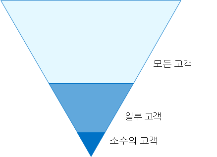

# ID 및 장치 액세스 구성

**적용 대상**
- [Exchange Online Protection](exchange-online-protection-overview.md)
- [Office 365용 Microsoft Defender 플랜 1 및 플랜 2](defender-for-office-365.md)

이제 조직의 최신 보안 경계가 네트워크 너머로 확장되어 다양한 디바이스가 있는 모든 위치에서 클라우드 기반 앱에 액세스하는 사용자를 포함합니다. 보안 인프라는 특정 액세스 요청을 허용할지 여부와 조건에 따라 결정해야 합니다.

이 결정은 로그인의 사용자 계정, 사용되는 장치, 사용자가 액세스에 사용하는 앱, 액세스 요청이 수행된 위치 및 요청의 위험 평가를 기반으로 해야 합니다. 이 기능을 사용하여 승인된 사용자와 장치만 중요한 리소스에 액세스할 수 있도록 할 수 있습니다.

이 문서 시리즈에서는 Azure AD 응용 프로그램 프록시를 사용하여 게시된 엔터프라이즈 클라우드 앱 및 서비스, 기타 SaaS 서비스 및 Microsoft 365 응용 프로그램에 대한 Microsoft 365 액세스를 보호하기 위한 일련의 ID 및 장치 액세스 선행 조건부 구성과 Azure AD(Azure AD) 조건부 액세스, Microsoft Intune 및 기타 정책 집합에 대해 설명합니다. Azure Active Directory

ID 및 장치 액세스 설정 및 정책은 기준 보호, 중요한 보호, 높은 규제 또는 분류 데이터가 있는 환경에 대한 보호의 세 계층으로 권장됩니다. 해당 계층과 관련 구성은 데이터, ID 및 장치에 대해 일관된 수준의 보호를 제공합니다.

이러한 기능 및 권장 사항:

- 지원되는 Microsoft 365 E3 Microsoft 365 E5.
- [Azure AD의](/azure/active-directory/fundamentals/identity-secure-score)ID 점수뿐만 아니라 [Microsoft 보안](../defender/microsoft-secure-score.md) 점수에 맞춰지며 조직의 이러한 점수가 증가합니다.
- ID 인프라를 보호하는 [5단계를 구현하는 데 도움이 됩니다.](/azure/security/azure-ad-secure-steps)

조직에 고유한 환경 요구 사항이나 복잡한 사항이 있는 경우 이러한 권장 사항을 시작점으로 사용하세요. 그러나 대부분의 조직에서는 이러한 권장 사항을 정해진 경우 구현할 수 있습니다.

엔터프라이즈용 앱에 대한 ID 및 장치 액세스 구성에 대한 Microsoft 365 비디오를 시청하세요.

 

> [!VIDEO https://www.microsoft.com/videoplayer/embed/RWxEDQ]

> [!NOTE]
> Microsoft는 또한 ENTERPRISE MOBILITY + SECURITY 구독에 대한 EMS(Office 365) 라이선스를 판매합니다. EMS E3 및 EMS E5 기능은 MICROSOFT 365 E3 및 Microsoft 365 E5. 자세한 [내용은 EMS 계획을](https://www.microsoft.com/microsoft-365/enterprise-mobility-security/compare-plans-and-pricing) 참조합니다.

## 대상

이러한 권장 사항은 Azure AD(ID), Microsoft Intune(장치 관리) 및 데이터 보호(데이터 보호)를 포함하는 Microsoft 365 클라우드 생산성 및 보안 서비스에 익숙한 엔터프라이즈 설계자 및 IT 전문가를 Microsoft Information Protection 위한 것입니다.

### 고객 환경

권장 정책은 전적으로 Microsoft 클라우드 내에서 운영되는 엔터프라이즈 조직과 Azure AD 테넌트와 동기화되는 사내 AD DS(Active Directory 도메인 서비스) 포리스트인 하이브리드 ID 인프라를 운영하는 고객에게 적용됩니다.

제공된 많은 권장 사항은 E5 보안 추가 기능Microsoft 365 E5 EMS E5 또는 Microsoft 365 E3 라이선스에서만 사용할 수 있는 서비스를 Azure AD Premium P2 있습니다.

이러한 라이선스가 없는 조직의 경우 모든 라이선스 계획에 포함된 보안 기본값을 구현하는 Microsoft 365 좋습니다.

### 주의

조직은 이러한 권장 구성과 다른 정책을 적용해야 할 수 있는 특정 권장 사항을 포함하여 규정 또는 기타 규정 준수 요구 사항이 적용될 수 있습니다. 이러한 구성은 지금까지 사용할 수 없었던 사용 제어를 권장합니다. 이러한 컨트롤은 보안과 생산성 간의 균형을 나타내는 것으로 생각하기 때문에 권장됩니다.

다양한 조직 보호 요구 사항을 고려하기 위해 최선을 다했지만 가능한 모든 요구 사항 또는 조직의 모든 고유한 측면을 고려할 수 없습니다.

## 3계층 보호

대부분의 조직은 보안 및 데이터 보호에 관한 구체적 요구 사항을 가지고 있습니다. 이러한 요구 사항은 산업 부문 및 조직 내의 직무 기능에 따라 달라집니다. 예를 들어 법무 부서와 관리자는 다른 사업부에 필요하지 않은 전자 메일 서신과 관련한 추가 보안 및 정보 보호 제어가 필요할 수 있습니다.

또한 각 산업마다 자체의 전문화된 규정을 가지고 있습니다. 가능한 모든 보안 옵션 또는 산업 부문 또는 직무 기능별로 권장 사항 목록을 제공하는 대신, 요구의 세분성에 따라 적용할 수 있는 세 가지 보안 및 보호 계층에 대한 권장 사항이 제공되었습니다.

- **기준 보호:** 데이터에 액세스하는 ID 및 장치뿐만 아니라 데이터를 보호하기 위한 최소 표준을 설정하는 것이 좋습니다. 이러한 기준 권장 사항을 따라 많은 조직의 요구를 충족하는 강력한 기본 보호를 제공할 수 있습니다.
- **중요한 보호:** 일부 고객은 더 높은 수준에서 보호해야 하는 데이터의 하위 집합을 들이거나 모든 데이터를 더 높은 수준에서 보호해야 할 수 있습니다. 사용자 환경의 모든 또는 특정 데이터 집합에 강화된 보호를 적용할 Microsoft 365 있습니다. 중요 데이터에 액세스하는 ID와 장치를 유사한 보안 수준으로 보호하는 것이 좋습니다.
- **높은 규제:** 일부 조직에는 고도로 분류되거나, 거래 비밀을 구성하거나, 규제 대상 데이터인 소량의 데이터가 있을 수 있습니다. Microsoft는 ID와 장치에 대한 추가된 보호를 포함하여 조직이 이러한 요구 사항을 충족하는 데 도움이 되는 기능을 제공합니다.

이 지침은 이러한 각 보호 계층에 대해 ID 및 장치에 대한 보호를 구현하는 방법을 보여 주며, 이 지침을 조직의 시작 지점으로 활용하고 조직의 특정 요구 사항에 맞게 정책을 조정합니다.

데이터, ID 및 장치 전반에 걸쳐 일관된 보호 수준을 사용하는 것이 중요합니다. 예를 들어 이 지침을 구현하는 경우 비슷한 수준에서 데이터를 보호해야 합니다.

Microsoft 365 **아키텍처** 모델에 대한 ID 및 장치 보호는 비교할 수 있는 기능을 보여줍니다.

   [PDF로 보기](../../downloads/MSFT_cloud_architecture_identity&device_protection.pdf) \| [PDF로 다운로드](https://github.com/MicrosoftDocs/microsoft-365-docs/raw/public/microsoft-365/downloads/MSFT_cloud_architecture_identity&device_protection.pdf) \| [앱으로 Visio](https://github.com/MicrosoftDocs/microsoft-365-docs/raw/public/microsoft-365/downloads/MSFT_cloud_architecture_identity&device_protection.vsdx)  

또한 데이터 개인  정보 보호 규정에 대한 정보 보호 배포 솔루션을 참조하여 데이터 보호에 저장된 정보를 Microsoft 365.

## 보안과 생산성의 절충

보안 전략을 구현하려면 보안과 생산성 간의 상이한 관계가 필요합니다. 각 결정이 보안, 기능 및 사용 편의성의 균형에 어떤 영향을 주는지 평가하는 것이 유용합니다.

제공된 권장 사항은 다음과 같은 원칙에 따라 결정됩니다.

- 사용자를 알고 보안 및 기능 요구 사항을 유연하게 충족할 수 있습니다.
- 제시간에 보안 정책을 적용하고 의미가 있도록 합니다.

## ID 및 장치 액세스 보호를 위한 서비스 및 개념

Microsoft 365 엔터프라이즈용 보안은 대규모 조직에서 모든 사람이 창의적이고 안전하게 함께 작업할 수 있도록 합니다.

이 섹션에서는 ID 및 장치 액세스에 Microsoft 365 서비스 및 기능에 대해 간략하게 설명합니다.

### Azure AD

Azure AD는 전체 ID 관리 기능 제품군을 제공합니다. 이러한 기능을 사용하여 액세스를 보호하는 것이 좋습니다.

|기능 또는 특징|설명|라이선싱|
|---|---|---|
|[MFA(다단계 인증)](/azure/active-directory/authentication/concept-mfa-howitworks)|MFA를 사용하려면 사용자가 사용자 암호와 앱 앱 또는 전화 통화의 알림과 같은 두 가지 Microsoft Authenticator 제공해야 합니다. MFA는 도난된 자격 증명을 사용하여 환경에 액세스할 수 있는 위험을 크게 줄입니다. Microsoft 365 MFA 기반 로그인에 Azure AD 다단계 인증 서비스를 사용하게 됩니다.|Microsoft 365 E3 혹은 E5|
|[조건부 액세스](/azure/active-directory/conditional-access/overview)|Azure AD는 사용자 로그인의 조건을 평가하고 조건부 액세스 정책을 사용하여 허용된 액세스를 파악합니다. 예를 들어 이 지침에서는 중요한 데이터에 대한 액세스에 대한 장치 준수를 요구하는 조건부 액세스 정책을 만드는 방법을 보여 주겠습니다. 이렇게 하면 해커가 자신의 장치를 소유하고 자격 증명을 훔친 경우 중요한 데이터에 액세스할 수 있는 위험이 크게 줄어듭니다. 또한 디바이스가 상태 및 보안에 대한 특정 요구 사항을 충족해야 하기 때문에 장치의 중요한 데이터를 보호합니다.|Microsoft 365 E3 혹은 E5|
|[Azure AD 그룹](/azure/active-directory/fundamentals/active-directory-manage-groups)|조건부 액세스 정책, Intune을 사용하여 장치 관리 및 조직의 파일 및 사이트에 대한 사용 권한도 사용자 계정 또는 Azure AD 그룹에 할당해야 합니다. 구현하는 보호 수준에 해당하는 Azure AD 그룹을 만드는 것이 좋습니다. 예를 들어 임원진은 해커의 가치 목표가 더 높을 수 있습니다. 따라서 이러한 직원의 사용자 계정을 Azure AD 그룹에 추가하고 이 그룹을 조건부 액세스 정책 및 액세스에 대한 높은 수준의 보호를 적용하는 기타 정책에 할당하는 것이 타당합니다.|Microsoft 365 E3 혹은 E5|
|[장치 등록](/azure/active-directory/devices/overview)|Azure AD에 장치를 등록하여 디바이스의 ID를 만들 수 있습니다. 이 ID는 사용자가 로그인할 때 장치를 인증하고 도메인에 가입되거나 호환되는 PC가 필요한 조건부 액세스 정책을 적용하는 데 사용됩니다. 이 지침에서는 장치 등록을 사용하여 도메인에 가입된 컴퓨터를 자동으로 Windows 있습니다. 장치 등록은 Intune을 사용하여 장치를 관리하기 위한 선행 과정입니다.|Microsoft 365 E3 혹은 E5|
|[Azure AD ID 보호](/azure/active-directory/identity-protection/overview)|조직의 ID에 영향을 주는 잠재적인 취약점을 감지하고 로그인 위험 및 사용자 위험을 낮음, 중간, 높음으로 자동 수정 정책을 구성할 수 있습니다. 이 지침은 이 위험 평가를 통해 다단계 인증에 대한 조건부 액세스 정책을 적용합니다. 이 지침에는 계정에서 높은 위험 활동이 감지되는 경우 사용자가 암호를 변경해야 하는 조건부 액세스 정책도 포함되어 있습니다.|Microsoft 365 E5 E5 Microsoft 365 E3, EMS E5 또는 Azure AD Premium P2 라이선스가 있는 경우|
|[SSPR(셀프 서비스 암호 재설정)](/azure/active-directory/authentication/concept-sspr-howitworks)|관리자가 제어할 수 있는 여러 인증 방법을 확인하여 지원 센터의 개입 없이도 암호를 안전하게 재설정할 수 있습니다.|Microsoft 365 E3 혹은 E5|
|[Azure AD 암호 보호](/azure/active-directory/authentication/concept-password-ban-bad)|알려진 약한 암호와 해당 변형 및 조직과 관련이 있는 추가 약한 용어를 검색하고 차단합니다. 기본 전역 금지 암호 목록은 Azure AD 테넌트의 모든 사용자에게 자동으로 적용됩니다. 사용자 지정 금지 암호 목록에서 추가 항목을 정의할 수 있습니다. 사용자가 암호를 변경하거나 재설정하면 해당 금지된 암호 목록은 강력한 암호를 사용하도록 확인됩니다.|Microsoft 365 E3 혹은 E5|
|

Intune 및 Azure AD 개체, 설정 및 하위 서비스를 포함하여 ID 및 장치 액세스의 구성 요소는 다음과 같습니다.

### Microsoft Intune

[Intune은](/intune/introduction-intune) Microsoft의 클라우드 기반 모바일 장치 관리 서비스입니다. 이 지침은 Intune을 사용하여 Windows PC의 장치 관리를 권장하고 장치 준수 정책 구성을 권장합니다. Intune은 장치가 규격인지 여부를 결정하고 조건부 액세스 정책을 적용할 때 사용할 Azure AD에 이 데이터를 전송합니다.

#### Intune 앱 보호

[Intune 앱 보호 정책은](/intune/app-protection-policy) 장치를 관리에 등록하거나 등록하지 않고도 모바일 앱에서 조직의 데이터를 보호하는 데 사용할 수 있습니다. Intune은 정보를 보호하여 직원의 생산성을 계속 향상하고 데이터 손실을 방지하는 데 도움이 됩니다. 앱 수준 정책을 구현하면 회사 리소스에 대한 액세스를 제한하고 IT 부서의 제어 내에 데이터를 유지할 수 있습니다.

이 지침은 승인된 앱의 사용을 적용하고 이러한 앱을 비즈니스 데이터와 함께 사용하는 방법을 결정하는 권장 정책을 만드는 방법을 보여줍니다.

### Microsoft 365

이 지침에서는 Microsoft Teams, Exchange Online, SharePoint Online을 비롯한 Microsoft 365 클라우드 서비스에 대한 액세스를 보호하기 위한 정책 집합을 구현하는 비즈니스용 OneDrive. 이러한 정책을 구현하는 것 외에도 다음 리소스를 사용하여 테넌트에 대한 보호 수준을 높이는 것이 좋습니다.

- [보안 강화를 위해 테넌트 구성](tenant-wide-setup-for-increased-security.md)

  권장 사항 기준 보안에 적용되는 기준을 제공합니다.

- [보안 로드맵: 처음 30일, 90일 및 그 이상에 대한 최상위 우선 순위](security-roadmap.md)

  권장 사항, 데이터 거버넌스, 관리자 액세스 및 위협 방지를 포함합니다.

### Windows 10 및 엔터프라이즈용 Microsoft 365 앱

Windows 10 엔터프라이즈용 Microsoft 365 앱 PC에 권장되는 클라이언트 환경입니다. Azure는 Windows 10 및 Azure AD 둘 다에서 가능한 원활한 환경을 제공하도록 설계되어 있기 때문에 권장되는 것이 좋습니다. Windows 10 Intune을 통해 관리할 수 있는 고급 보안 기능도 포함되어 있습니다. 엔터프라이즈용 Microsoft 365 앱 응용 프로그램의 최신 Office 포함되어 있습니다. 이러한 인증은 최신 인증을 사용하며, 이는 더 안전하며 조건부 액세스에 대한 요구 사항입니다. 이러한 앱에는 향상된 규정 준수 및 보안 도구도 포함되어 있습니다.

## 3계층 보호에 이러한 기능 적용

다음 표에는 세 가지 보호 계층에서 이러한 기능을 사용하는 데 대한 권장 사항이 요약되어 있습니다.

|보호 메커니즘|기준|중요|매우 엄격한 규제|
|---|---|---|---|
|**MFA 강제 적용**|중간 이상 로그인 위험에 대해|낮음 이상 로그인 위험에 대해|모든 새 세션에 대해|
|**암호 변경 적용**|고위험 사용자의 경우|고위험 사용자의 경우|고위험 사용자의 경우|
|**Intune 응용 프로그램 보호 적용**|예|예|예|
|**조직 소유 장치에 Intune 등록 적용**|호환되거나 도메인에 가입된 PC가 필요하지만 BYOD(Bring Your Own Devices) 휴대폰 및 태블릿 허용|호환 또는 도메인에 가입된 장치 필요|호환 또는 도메인에 가입된 장치 필요|
|

## 장치 소유권

위 표에는 많은 조직에서 조직 소유 장치와 개인 또는 BYOD를 혼합하여 인력 전체의 모바일 생산성을 지원하는 추세가 반영되어 있습니다. Intune 앱 보호 정책은 조직 소유 장치와 BYOD 모두에서 Outlook 모바일 앱 및 기타 Office 모바일 앱으로 유출되지 않도록 전자 메일을 보호합니다.

추가 보호 및 제어를 적용하려면 Intune 또는 도메인에 가입된 조직 소유 장치를 관리하는 것이 좋습니다. 데이터 민감도에 따라 조직에서 특정 사용자 인구 또는 특정 앱에 대해 BYOD를 허용하지 않을 수 있습니다.

## 배포 및 앱

Azure AD 통합 앱에 대한 ID 및 장치 액세스 구성을 구성하고 롤아웃하기 전에 다음을 해야 합니다.

- 조직에서 어떤 앱을 보호할지 결정하십시오.
- 이 앱 목록을 분석하여 적절한 수준의 보호를 제공하는 정책 집합을 파악합니다.

  관리가 번거로워질 수 있기 때문에 앱에 대해 각각 별도의 정책 집합을 만들면 안 됩니다. 동일한 사용자에 대해 동일한 보호 요구 사항이 있는 앱을 그룹화하는 것이 좋습니다.

  예를 들어 기준 보호를 위해 모든 사용자를 위한 모든 Microsoft 365 앱을 포함하고, 인사부 또는 재무 부서에서 사용하는 정책과 같은 모든 중요한 앱에 대한 두 번째 정책 집합을 포함하며 이러한 그룹에 적용할 수 있습니다.

보안하려는 앱에 대한 정책 집합을 결정한 후 정책을 사용자에게 증분 방식으로 롤아웃하여 문제를 해결합니다.

예를 들어 모든 Microsoft 365 앱에 대해 사용할 정책을 구성하고 Exchange Online 추가 변경 사항을 Exchange. 이러한 정책을 사용자에게 롤아웃하고 문제를 해결합니다. 그런 다음 Teams 변경 내용을 추가하고 사용자에게 롤아웃합니다. 그런 다음 추가 SharePoint 추가하여 추가 정보를 추가합니다. 모든 기본 정책을 포함하도록 이러한 기준 정책을 구성할 수 있을 때까지 나머지 앱을 계속 Microsoft 365 합니다.

마찬가지로, 중요한 앱의 경우 정책 집합을 만들고 한 번씩 앱을 추가하고 모두 중요한 앱 정책 집합에 포함될 때까지 문제를 해결합니다.

일부 의도하지 않은 구성이 생성될 수 있기 때문에 모든 앱에 적용되는 정책 집합을 만들지 않는 것이 좋습니다. 예를 들어 모든 앱을 차단하는 정책은 관리자를 Azure Portal에서 잠글 수 있으며, Microsoft 365와 같은 중요한 끝점에 대해 제외를 구성할 Graph.

## ID 및 장치 액세스를 구성하는 단계

1. 선행 구성 ID 기능 및 설정을 구성합니다.
2. 공용 ID를 구성하고 조건부 액세스 정책에 액세스합니다.
3. 게스트 및 외부 사용자에 대한 조건부 액세스 정책을 구성합니다.
4. Microsoft Teams, Exchange Online 및 SharePoint 정책과 같은 Microsoft 365 앱에 대한 조건부 액세스 정책을 Microsoft Cloud App Security 구성합니다.

ID 및 장치 액세스를 구성한 후 [Azure AD](/azure/active-directory/fundamentals/active-directory-deployment-checklist-p2) 기능 배포 가이드에서 고려할 추가 기능의 단계적 검사 목록과 액세스 보호, 모니터링 및 감사를 위한 Azure AD [ID](/azure/active-directory/governance/) 거버넌스를 참조하세요.

## 다음 단계

[ID 및 장치 액세스 정책 구현을 위한 선행 작업](identity-access-prerequisites.md)