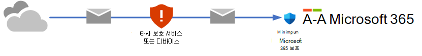
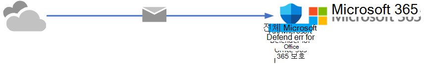
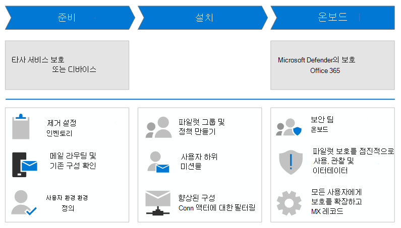

# 타사 보호 서비스 또는 장치에서 Microsoft Defender로 Office 365

**적용 대상**
- [Office 365용 Microsoft Defender 플랜 1 및 플랜 2](defender-for-office-365.md)

이 가이드에서는 타사 보호 서비스 또는 장치에서 Microsoft Defender for Office 365. 이 가이드에서는 다음과 같은 사실이 가정됩니다.

- 이미 사서함이 Microsoft 365 있지만 현재 전자 메일 보호를 위해 타사 서비스 또는 장치를 사용하고 있습니다. 인터넷에서 전송되는 메일은 Microsoft 365 조직으로 배달되기 전에 보호 서비스를 통과하며 Microsoft 365 보호는 최대한 낮습니다(예: 맬웨어 보호는 항상 적용).

  

- You're beyond the investigation and consideration phase for protection by Defender for Office 365. 조직에 적합한지 여부를 결정하기 위해 Office 365 Defender를 평가해야 하는 경우 평가 모드 를 [고려하는 것이 좋습니다.](office-365-evaluation.md)

- You've already purchased Defender for Office 365.

- 기존 타사 보호 서비스를 사용 중지해야 합니다. 즉, 궁극적으로 전자 메일 도메인의 MX 레코드를 해당 서비스로 설정해야 Microsoft 365. 완료되면 인터넷의 메일이 Microsoft 365 EOP(Exchange Online Protection) 및 Defender를 통해 단독으로 Office 365.

  

기존 보호 서비스를 제거하여 기존 보호 서비스를 Office 365 밝게 하여 변경하지 말아야 할 큰 단계입니다. 이 마이그레이션 가이드의 지침은 사용자에게 중단을 최소화하면서 순서대로 보호를 전환하는 데 도움이 됩니다.

다음 다이어그램에는 매우 높은 수준의 마이그레이션 단계가 설명되어 있습니다. 실제 단계는 이 문서의  부분에 있는 마이그레이션 프로세스 섹션에 나와 있습니다.

## 이 가이드의 단계를 사용하는 이유는 무엇입니까?

IT 업계에서 놀라움은 일반적으로 좋지 않습니다. MX 레코드를 대칭 이동하여 사전 및 Microsoft 365 테스트하지 않으면 많은 놀라움을 줄 수 있습니다. 예제:

- 사용자 또는 선행 작업에서 최적의 메일 배달을 위해 기존 보호 서비스를 사용자 지정하는 데 많은 시간과 노력을 소비한 것일 수 있습니다(즉, 차단해야 하는 사항을 차단하고 허용해야 하는 사항을 허용). 현재 보호 서비스의 일부 사용자 지정이 Defender에서 필수가 아니라는 사실은 거의 Office 365. 또한 Defender for Office 365 발생하지 않았거나 현재 보호 서비스에 필요하지 않은 새로운 문제(허용 또는 차단)를 도입할 수도 있습니다.
- 지원 센터 및 보안 담당자는 지원 센터를 위해 Defender에서 할 작업을 알아야 Office 365. 예를 들어 사용자가 누락된 메시지에 대해 불만을 표시하는 경우 지원 센터에서 메시지를 찾아야 하는 위치 또는 방법을 알고 있나요? 기존 보호 서비스의 도구에 익숙한 것으로 확인될 수 있지만 Defender for Office 365?

반대로 이 마이그레이션 가이드의 단계를 따르는 경우 마이그레이션에 대해 다음과 같은 가시적인 이점을 얻을 수 있습니다.

- 사용자 중단을 최소화합니다.
- 관리로의 마이그레이션 Office 365 보고할 때 사용할 수 있는 사용자에 대한 Defender의 목표 데이터입니다.
- 지원 센터 및 보안 담당자를 위한 조기 참여 및 지침

Defender for Office 365 조직에 어떤 영향을 주는지 더 잘 알수록 사용자, 지원 센터 직원, 보안 담당자 및 관리가 전환하는 것이 더 좋습니다.

이 마이그레이션 가이드에서는 단계적으로 "전화 걸기"에 대한 계획을 제공합니다. 따라서 사용자 및 전자 메일에 대한 defender의 Office 365 영향을 모니터링하고 테스트하여 발생하는 모든 문제에 신속하게 대응할 수 있습니다.

## 마이그레이션 프로세스

타사 보호 서비스에서 Office 365 Defender로 마이그레이션하는 프로세스는 다음 표에 설명된 세 단계로 나눌 수 있습니다.

****

|단계|설명|
|---|---|
|[마이그레이션 준비](migrate-to-defender-for-office-365-prepare.md)|<ol><li>[기존 보호 서비스의 설정 인벤토리](migrate-to-defender-for-office-365-prepare.md#inventory-the-settings-at-your-existing-protection-service)</li><li>[다음에서 기존 보호 구성을 Microsoft 365](migrate-to-defender-for-office-365-prepare.md#check-your-existing-protection-configuration-in-microsoft-365)</li><li>[메일 라우팅 구성 확인](migrate-to-defender-for-office-365-prepare.md#check-your-mail-routing-configuration)</li><li>[메시지를 수정하는 기능을 Microsoft 365](migrate-to-defender-for-office-365-prepare.md#move-features-that-modify-messages-into-microsoft-365)</li><li>[스팸 및 대량 사용자 환경 정의](migrate-to-defender-for-office-365-prepare.md#define-spam-and-bulk-user-experiences)</li><li>[우선 순위 계정 식별 및 지정](migrate-to-defender-for-office-365-prepare.md#identify-and-designate-priority-accounts)</li></ol>|
|[2016에 대한 Defender Office 365](migrate-to-defender-for-office-365-setup.md)|<ol><li>[파일럿 사용자를 위한 메일 그룹 만들기](migrate-to-defender-for-office-365-setup.md#step-1-create-distribution-groups-for-pilot-users)</li><li>[사용자 메시지 보고를 위한 사용자 제출 구성](migrate-to-defender-for-office-365-setup.md#step-2-configure-user-submission-for-user-message-reporting)</li><li>[SCL=-1 메일 흐름 규칙 유지 관리 또는 만들기](migrate-to-defender-for-office-365-setup.md#step-3-maintain-or-create-the-scl-1-mail-flow-rule)</li><li>[커넥터에 대한 향상된 필터링 구성](migrate-to-defender-for-office-365-setup.md#step-4-configure-enhanced-filtering-for-connectors)</li><li>[파일럿 보호 정책 만들기](migrate-to-defender-for-office-365-setup.md#step-5-create-pilot-protection-policies)</li></ol>|
|[에 대 한 Defender에 온보딩 Office 365](migrate-to-defender-for-office-365-onboard.md)|<ol><li>[보안 및 보안 Teams](migrate-to-defender-for-office-365-onboard.md#step-1-begin-onboarding-security-teams)</li><li>[(선택 사항) 기존 보호 서비스의 파일럿 사용자 필터링 제외](migrate-to-defender-for-office-365-onboard.md#step-2-optional-exempt-pilot-users-from-filtering-by-your-existing-protection-service)</li><li>[스푸핑 인텔리전스 조정](migrate-to-defender-for-office-365-onboard.md#step-3-tune-spoof-intelligence)</li><li>[가장 보호 및 사서함 인텔리전스 조정](migrate-to-defender-for-office-365-onboard.md#step-4-tune-impersonation-protection-and-mailbox-intelligence)</li><li>[사용자 제출의 데이터를 사용하여 측정 및 조정](migrate-to-defender-for-office-365-onboard.md#step-5-use-data-from-user-submissions-to-measure-and-adjust)</li><li>[(선택 사항) 파일럿에 사용자 추가 및 추가](migrate-to-defender-for-office-365-onboard.md#step-6-optional-add-more-users-to-your-pilot-and-iterate)</li><li>[모든 Microsoft 365 보호를 확장하고 SCL=-1 메일 흐름 규칙을 해제합니다.](migrate-to-defender-for-office-365-onboard.md#step-7-extend-microsoft-365-protection-to-all-users-and-turn-off-the-scl-1-mail-flow-rule)</li><li>[MX 레코드 전환](migrate-to-defender-for-office-365-onboard.md#step-8-switch-your-mx-records)</li></ol>|
|

## 다음 단계

- [1단계: 설치로 진행합니다.](migrate-to-defender-for-office-365-prepare.md)
