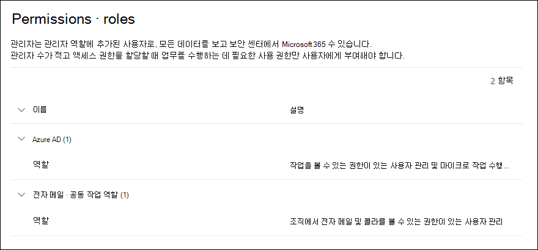
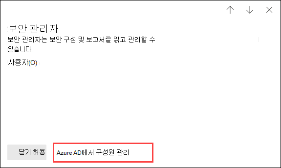

# Microsoft 365 Defender 포털 사용 권한

[!INCLUDE [Microsoft 365 Defender rebranding](../includes/microsoft-defender-for-office.md)]

**적용 대상**
- [Exchange Online Protection](exchange-online-protection-overview.md)
- [Office 365용 Microsoft Defender 플랜 1 및 플랜 2](defender-for-office-365.md)
- [Microsoft 365 Defender](../defender/microsoft-365-defender.md)

모든 Microsoft 365 서비스를 포괄하는 보안 시나리오를 관리해야 합니다. 또한 조직의 적절한 사람에게 적절한 관리자 권한을 부여할 수 있는 유연성이 필요합니다.

<https://security.microsoft.com>의 Microsoft 365 Defender 포털은 Microsoft 365에서 보안 작업을 수행하는 사용자의 사용 권한을 직접 관리할 수 ​​있도록 지원합니다. Microsoft 365 Defender 포털을 사용하여 사용 권한을 관리하면 보안과 관련된 모든 작업에 대한 사용 권한을 중앙에서 관리할 수 ​​있습니다.

Microsoft 365 Defender 포털에서 사용 권한을 관리하려면 **권한 및 역할** 또는 <https://security.microsoft.com/securitypermissions>(으)로 이동합니다. 이 작업을 수행하려면 Microsoft 365 Defender 포털의 **전역 관리자** 이거나 **조직 관리** 역할 그룹의 구성원이어야 합니다. 특히 **역할 관리** 역할을 통해 사용자는 Microsoft 365 Defender 포털에서 역할 그룹을 보고, 만들고, 수정할 수 있으며, 기본적으로 이 역할은 **조직 관리** 역할 그룹에만 할당됩니다.

> [!NOTE]
> Microsoft 365 규정 준수 센터 사용 권한에 관한 자세한 내용은 [Microsoft 365 규정 준수 센터 사용 권한](../../compliance/microsoft-365-compliance-center-permissions.md)을 참조하세요.

## 구성원, 역할 및 역할 그룹의 관계

Microsoft 365 Defender 포털의 사용 권한은 RBAC(역할 기반 액세스 제어) 사용 권한 모델을 기반으로 합니다. RBAC는 대부분 Microsoft 365 서비스에서 사용하는 것과 동일한 사용 권한 모델이므로 이러한 서비스의 사용 권한 구조에 익숙하다면 Microsoft 365 Defender 포털에서 사용 권한을 부여하는 작업이 매우 익숙하게 느껴질 것입니다.

**역할** 은 일련의 작업을 수행할 수 있는 권한을 부여합니다.

**역할 그룹** 은 사람들이 Microsoft 365 Defender 포털에서 작업을 수행할 수 있도록 하는 역할 집합입니다.

Microsoft 365 Defender 포털에는 사용자가 할당해야 할 가장 일반적인 작업과 기능에 대한 기본 역할 그룹이 포함되어 있습니다. 일반적으로 개별 사용자를 기본 역할 그룹에 **구성원** 으로 추가하는 것이 좋습니다.

## Microsoft 365 Defender 포털의 역할 및 역할 그룹

Microsoft 365 Defender 포털의 **권한 및 역할** 에서는 다음과 같은 역할 및 역할 그룹 유형을 사용할 수 있습니다.

- **Azure AD 역할**: 역할과 할당된 사용자는 볼 수 있지만 Microsoft 365 Defender 포털에서 직접 관리할 수는 없습니다. Azure AD 역할은 **모든** Microsoft 365 서비스에 대한 사용 권한을 할당하는 중앙 역할입니다.

- **이메일 및 공동 작업 역할**: 보안 및 준수 센터에서 제공되는 역할과 동일한 역할 그룹이지만 이 역할은 Microsoft 365 Defender 포털에서 직접 관리할 수 ​​있습니다. 여기에서 할당하는 사용 권한은 Microsoft 365 Defender 포털과 Microsoft 365 규정 준수 센터, 보안 및 준수 센터에 고유하며, 다른 Microsoft 365 워크로드에 필요한 모든 사용 권한에는 적용되지 않습니다.

### Microsoft 365 Defender 포털의 Azure Active Directory 역할

**이메일 및 공동 작업 역할** \> **권한 및 역할** \> **Azure AD 역할** \> **역할**(또는 직접 <https://security.microsoft.com/aadpermissions>)(으)로 이동하면 이 섹션에서 설명하는 Azure AD 역할이 표시됩니다.

역할을 선택하면 역할 및 사용자 할당에 대한 설명이 포함된 세부 정보 플라이아웃이 나타납니다. 그러나 이러한 할당을 관리하려면 세부 정보 플라이아웃에서 **Azure AD에서 구성원 관리** 를 클릭해야 합니다.

자세한 내용은 [Azure Active Directory에서 관리자 역할 보기 및 할당](/azure/active-directory/users-groups-roles/directory-manage-roles-portal)을 참조하세요.

 

****

|역할|설명|
|---|---|
|**전역 관리자**|모든 Microsoft 365 서비스의 모든 관리 기능에 액세스할 수 있습니다. 전역 관리자만 다른 관리자 역할을 할당할 수 있습니다. 자세한 내용은 [전역 관리자 / 회사 관리자](/azure/active-directory/roles/permissions-reference#global-administrator--company-administrator)를 참조하세요.|
|**규정 준수 데이터 관리자**|Microsoft 365에서 조직의 데이터를 추적하고, 보호가 설정되었는지 확인하고, 위험을 완화하는 데 도움이 되는 모든 문제에 대한 인사이트를 얻으세요. 자세한 내용은 [규정 준수 데이터 관리자](/azure/active-directory/roles/permissions-reference#compliance-data-administrator)를 참조하세요.|
|**규정 준수 관리자**|조직이 모든 규정 요구 사항을 준수하고, eDiscovery 사례를 관리하며, Microsoft 365 위치, ID 및 앱 전반에서 데이터 관리 정책을 유지하도록 돕습니다. 자세한 내용은 [규정 준수 관리자](/azure/active-directory/roles/permissions-reference#compliance-administrator)를 참조하세요.|
|**보안 운영자**|Microsoft 365 사용자, 디바이스 및 콘텐츠에 대한 활성 위협을 보고, 조사하고, 대응합니다. 자세한 내용은 [보안 운영자](/azure/active-directory/roles/permissions-reference#security-operator)를 참조하세요.|
|**보안 읽기 권한자**|Microsoft 365 사용자, 디바이스 및 콘텐츠에 대한 활성 위협을 보고 조사하나 (보안 운영자와는 달리) 조치를 취하여 대응할 권한은 없습니다. 자세한 내용은 [보안 읽기 권한자](/azure/active-directory/roles/permissions-reference#security-reader)를 참조하세요.|
|**보안 관리자**|보안 정책을 관리하고, Microsoft 365 제품 전반에서 보안 분석 및 보고서를 검토하고, 위협 상황에 대한 최신 정보를 파악하여 조직의 전반적인 보안을 제어합니다. 자세한 내용은 [보안 관리자](/azure/active-directory/roles/permissions-reference#security-administrator)를 참조하세요.|
|**전역 읽기 권한자**|**전역 관리자** 역할의 읽기 전용 버전입니다. Microsoft 365 전반의 모든 설정 및 관리 정보를 봅니다. 자세한 내용은 [전역 읽기 권한자](/azure/active-directory/roles/permissions-reference#global-reader)를 참조하세요.|
|**공격 시뮬레이션 관리자**|[공격 시뮬레이션](attack-simulation-training.md) 생성, 시뮬레이션 실행/예약, 시뮬레이션 결과 검토의 모든 측면을 만들고 관리합니다. 자세한 내용은 [공격 시뮬레이션 관리자](/azure/active-directory/roles/permissions-reference#attack-simulation-administrator)를 참조하세요.|
|**공격 페이로드 작성자**|공격 페이로드를 생성하지만 실제로 시작하거나 예약하지는 않습니다. 자세한 내용은 [공격 페이로드 작성자](/azure/active-directory/roles/permissions-reference#attack-payload-author)를 참조하세요.|
|

### Microsoft 365 Defender 포털의 이메일 및 공동 작업 역할

**이메일 및 공동 작업 역할** \> **권한 및 역할** \> **이메일 및 공동 작업 역할** \> **역할**(또는 <https://security.microsoft.com/emailandcollabpermissions>로 직접) 보안 및 준수 센터에서 사용할 수 있는 동일한 역할 그룹을 볼 수 있습니다.

해당 역할 그룹에 대한 자세한 내용은 [보안 및 규정 준수 센터의 사용 권한](permissions-in-the-security-and-compliance-center.md)을 참조하세요.

#### Microsoft 365 Defender 포털의 이메일 및 공동 작업 역할 멤버십 수정

1. Microsoft 365 Defender 포털에서 **이메일 및 공동 작업 역할** \> **사용 권한 및 역할** \> **이메일 및 공동 작업 역할** \> **역할** 로 이동합니다.

2. 열리는 **권한** 페이지의 목록에서 수정할 역할 그룹을 선택합니다. **이름** 열 머리글을 클릭하여 이름별로 목록을 정렬하거나 **검색** 을 클릭해도 됩니다. 역할 그룹을 찾는 방법

3. 표시되는 역할 그룹 세부 정보 플라이아웃의 **구성원** 섹션에서 **수정** 을 클릭합니다.

4. 표시되는 **구성원 선택 편집** 페이지에서 다음 단계 중 하나를 수행합니다.
   - 역할 그룹 구성원이 없으면 **구성원 선택** 을 클릭합니다.
   - 기존 역할 그룹 구성원이있는 경우 **수정** 을 클릭합니다.

5. 표시되는 **구성원 선택** 플라이아웃에서 다음 단계 중 하나를 수행합니다.

   - **추가** 를 클릭합니다. 표시되는 사용자 목록에서 한 명 이상의 사용자를 선택합니다. 또는 **검색** 을 클릭해도 됩니다. 사용자를 찾아서 선택하는 방법

     추가 할 사용자를 선택한 후 **추가** 를 클릭합니다.

   - **제거** 를 클릭합니다. 기존 구성원 중 하나 이상을 선택합니다. 또는 **검색** 을 클릭해도 됩니다. 구성원을 찾아서 선택하는 방법

     제거할 사용자를 선택했으면 **제거** 를 클릭합니다.

6. **구성원 선택** 플라이아웃으로 돌아가서 **완료** 를 클릭합니다.

7. **구성원 선택 편집** 페이지로 돌아가서 **저장** 을 클릭합니다.

8. 역할 그룹 세부 정보 플라이아웃으로 돌아가서 **완료** 를 클릭합니다.
