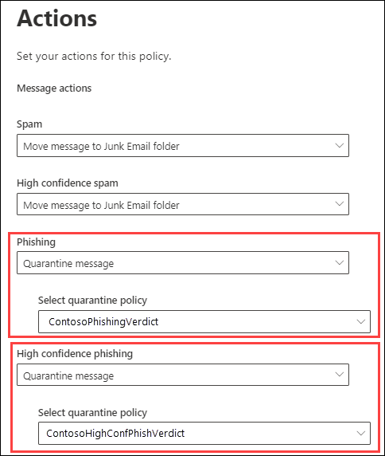
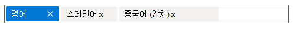
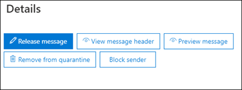
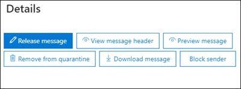

# <a name="quarantine-policies"></a>격리 정책

> [!NOTE]
> 이 문서에서 설명하는 기능은 롤아웃 중이기 때문에 아직 사용할 수 없습니다. 전 세계 출시의 대상 날짜는 2021년 10월 31일입니다.

EOP(Exchange Online Protection(Exchange Online Protection) 및 Microsoft Defender for Office 365 정책은 관리자가 메시지가 검사된 이유에 따라 사용자가 메시지를 검사할 수 있는 작업을 제어할 수 있도록 합니다.

일반적으로 사용자는 메시지를 검사한 이유에 따라 메시지에 대한 대화형 작업 수준을 허용하거나 거부했습니다. 예를 들어 사용자는 스팸 방지 필터링에 의해 스팸 또는 대량으로 탐지된 메시지를 보고 해제할 수 있지만 높은 신뢰도 피싱 또는 맬웨어로 탐지된 메시지를 보거나 해제할 수 없습니다.

[지원되는](#step-2-assign-a-quarantine-policy-to-supported-features)보호 기능의 경우, 검역 정책은 사용자가 자신의 메시지(받는 사람인 메시지)를 검역 및 검역 알림에서 할 수 있는 작업을 _지정합니다._ 스팸 알림은 최종 사용자 스팸 알림을 대체하는 알림입니다. 이러한 알림은 이제 검역 정책에 의해 제어하며 지원되는 모든 보호 기능(스팸 방지 정책 및 피싱 방지 정책 판정 뿐만 아니라)에 대해 검역된 메시지에 대한 정보를 포함했습니다.

기록 사용자 기능을 적용하는 기본 검역 정책은 메시지를 검역하는 지원되는 보호 기능의 작업에 자동으로 할당됩니다. 또는 사용자 지정 검역 정책을 만들어 지원되는 보호 기능에 할당하여 사용자가 이러한 유형의 검역된 메시지에 대해 특정 작업을 수행하지 못하도록 허용하거나 차단할 수 있습니다.

개별 개별 정책 사용 권한은 미리 설정한 다음 사용 권한 그룹에 결합됩니다.

- 액세스 권한 없음
- 제한된 액세스
- 모든 액세스

다음 표에서는 미리 설정한 사용 권한 그룹에 포함된 개별 개별 정책 사용 권한을 설명하고 있습니다.

<br>

****

|사용 권한|액세스 권한 없음|제한된 액세스|모든 액세스|
|---|:---:|:---:|:---:|
|**보낸 사람 차단(** _PermissionToBlockSender_)||||
|**Delete(** _PermissionToDelete_)||||
|**미리 보기(** _PermissionToPreview_)||||
|받는 사람이 메시지를 **검지에서** 해제할 수 있도록 허용(_PermissionToRelease_)||||
|받는 사람이 메시지를 검지에서 릴리스하도록 **요청하도록 허용(** _PermissionToRequestRelease_)||||
|

다음 표에서는 기본 검지 정책, 관련 사용 권한 그룹 및 알림을 사용하도록 설정하는지 여부에 대해 설명되어 있습니다.

<br>

|기본 검지 정책|사용된 사용 권한 그룹|알림을 검사할 수 있나요?|
|---|---|---|
|AdminOnlyAccessPolicy|액세스 권한 없음|아니오|
|DefaultFullAccessPolicy|모든 액세스|아니오|
|NotificationEnabledPolicy<sup>\*</sup>|모든 액세스|예|

미리 설정한 사용 권한 그룹에서 기본 사용 권한을 원하지 않는 경우 또는 알림을 사용하도록 설정하려면 사용자 지정 검지 정책을 만들고 사용 합니다. 각 사용 권한의 작동에 대한 자세한 내용은 이 문서 의 부분에 있는 정책 사용 권한 세부 정보 [섹션을](#quarantine-policy-permission-details) 참조하십시오.

Microsoft 365 Defender 포털 또는 PowerShell(Exchange Online 사서함이 있는 Microsoft 365 조직, Exchange Online 사서함이 없는 EOP 조직의 독립 실행형 EOP PowerShell)에서 Exchange Online 정책을 만들고 할당합니다.

> [!NOTE]
> 이 기간 동안 스팸 방지 정책에서 스팸 보존(QuarantineRetentionPeriod)에 의해 만료되기전까지의 메시지 보존 기간은 스팸 방지 정책의 스팸 보존에 의해 제어됩니다.  자세한 내용은 [EOP에서 스팸 방지 정책 구성하기](configure-your-spam-filter-policies.md)를 참조하세요.

## <a name="full-access-permissions-and-quarantine-notifications"></a>모든 액세스 권한 및 알림 검지

<sup>\*</sup> NotificationEnabledPolicy라는 Quarantine policy is not present in all environments. 조직이 다음 요구 사항을 모두 충족하는 경우 NotificationEnabledPolicy 검지 정책이 있습니다.

- 조직은 조직에 대한 정책 기능(2021년 7월 말/8월 초)이 켜지기 전에 존재했습니다.
- 최종 사용자 스팸 [](configure-your-spam-filter-policies.md) 알림 사용 설정이 켜져 있는 하나 이상의 스팸 방지 정책(기본 스팸 방지 정책 또는 사용자 지정 스팸 방지 **정책)이** 있습니다.

앞에서 설명한 대로, 스팸 방지 정책에서 켜거나 끄는 데 사용한 최종 사용자 스팸 알림은 정책에 있는 검지 알림을 대체합니다. DefaultFullAccessPolicy라는 기본 제공 검역 정책은 검역된 메시지에 대한 기록 권한을 복제하지만, 검역 알림은 검역 정책에서 설정되지 않습니다.   또한 기본 제공 정책을 수정할 수 없습니다. DefaultFullAccessPolicy에서 알림을 끄면 안 됩니다.

DefaultFullAccessPolicy의 사용 권한을 제공하지만, 검역 알림이 켜져 있는 경우 필요한 조직(최종 사용자 스팸 알림이 켜진 조직)에 대해 DefaultFullAccessPolicy 대신 사용할 NotificationEnabledPolicy라는 정책을 만들 수 있습니다.

스팸 방지 정책에서 최종 사용자 스팸 알림을 사용하도록 설정한 적이 없는 신규 조직 또는 이전 조직의 경우 NotificationEnabledPolicy라는 검역 정책이 없습니다. 알림을 설정하는 방법은 알림이 설정되어 있는 사용자 지정 검사 정책을 만들고 사용하는 것입니다.

## <a name="what-do-you-need-to-know-before-you-begin"></a>시작하기 전에 알아야 할 내용은 무엇인가요?

- <https://security.microsoft.com>에서 Microsoft 365 Defender 포털을 엽니다. 또는 **Quarantine policies(정책)** 페이지로 직접 이동하여 를 를 를 니다. <https://security.microsoft.com/quarantinePolicies>

- Exchange Online PowerShell에 연결하려면 [Exchange Online PowerShell에 연결](/powershell/exchange/connect-to-exchange-online-powershell)을 참조하세요. 독립 실행형 EOP PowerShell에 연결하려면 [Exchange Online Protection PowerShell에 연결](/powershell/exchange/connect-to-exchange-online-protection-powershell)을 참조하세요.

- 검역 정책을 보거나 만들거나 수정하거나 제거하려면 조직 포털에서 **조직** 관리, 보안 관리자 또는 **Quarantine Administrator** 역할의 구성원 Microsoft 365 Defender 합니다. 자세한 내용은 [Microsoft 365 Defender 포털 권한](permissions-microsoft-365-security-center.md)을 참조하세요.

## <a name="step-1-create-quarantine-policies-in-the-microsoft-365-defender-portal"></a>1단계: 사이트 포털에서 Microsoft 365 Defender 만들기

1. Microsoft 365 Defender 포털에서 전자 메일 &  위협 정책 규칙 섹션으로 이동한 다음 정책 검지 \>  \>  \>  **를 선택합니다.**

2. **Quarantine policy 페이지에서** Add custom policy icon(사용자 지정 정책  **사용자 지정 정책 추가**.

3. 새 **정책 마법사가** 열립니다. 정책 **이름 페이지의** 정책 이름 상자에 간략하지만 고유한 **이름을 입력합니다.** 다음 단계에서 이름으로 정책을 식별하고 선택해야 합니다. 작업을 마친 후 **다음** 을 클릭합니다.

4. 받는 **사람 메시지 액세스 페이지에서** 다음 값 중 하나를 선택합니다.
   - **제한된 액세스:** 이 사용 권한 그룹에 포함된 개별 사용 권한에 대한 설명은 이 문서 앞부분에 설명되어 있습니다.
   - **특정 액세스 설정(고급)**: 이 값을 사용하여 사용자 지정 권한을 지정합니다. 나타나는 다음 설정을 구성합니다.
     - **릴리스 작업 기본 설정** 선택 : 다음 값 중 하나를 선택합니다.
       - 공백: 이 값은 기본값입니다.
       - **받는 사람이 메시지를 검지에서 해제할 수 있도록 허용**
       - **받는 사람이 메시지를 검지에서 릴리스하도록 요청하도록 허용**
     - **받는 사람이** 다음의 값 중 일부 또는 전체를 선택하거나, 모두 또는 전혀 선택하지 않습니다.
       - **삭제**
       - **Preview**
       - **보낸 사람 차단**

   이러한 사용 권한 및 해당 권한은 이 문서 부분의 정책 사용 [](#quarantine-policy-permission-details) 권한 세부 정보 섹션에 설명되어 있습니다.

   작업을 마친 후 **다음** 을 클릭합니다.

5. 최종 **사용자 스팸** 알림 페이지에서 Enable **to** enable quarantine notifications(이전의 최종 사용자 스팸 알림)를 사용하도록 설정을 선택합니다. 작업을 마친 후 **다음** 을 클릭합니다.

   > [!NOTE]
   > 앞에서 설명한 대로 기본 제공 정책(AdminOnlyAccessPolicy 또는 DefaultFullAccessPolicy)에는 검리된 알림이 설정되어 있지 않고 정책을 수정할 수 없습니다.

6. 정책 **검토 페이지에서** 설정을 검토합니다. 각 섹션에서 **편집** 선택하여 섹션 내의 설정을 수정할 수 있습니다. 또는 **뒤로** 를 클릭하거나 마법사에서 특정 페이지를 선택할 수 있습니다.

   작업을 마쳤으면 **제출** 을 클릭합니다.

7. 표시되는 확인 페이지에서 **완료** 를 클릭합니다.

이제 [2단계](#step-2-assign-a-quarantine-policy-to-supported-features) 섹션에 설명된 바와 같이 검지 기능에 검지 정책을 할당할 준비가 완료되었습니다.

### <a name="create-quarantine-policies-in-powershell"></a>PowerShell에서 검사 정책 만들기

PowerShell을 사용하여 정책을 만드는 대신 PowerShell을 사용하여 Exchange Online PowerShell 또는 Exchange Online Protection PowerShell에 연결하고 **New-QuarantinePolicy** cmdlet을 사용 합니다. 다음 두 가지 방법으로 선택할 수 있습니다.

- [ _EndUserQuarantinePermissionsValue_ 매개 변수를 사용합니다.](#use-the-enduserquarantinepermissionsvalue-parameter)
- [ _EndUserQuarantinePermissions_ 매개 변수를 사용합니다.](#use-the-enduserquarantinepermissions-parameter)

이러한 메서드에 대한 설명은 다음 섹션에 설명되어 있습니다.

> [!NOTE]
> _정책에서 ESNEnabled_ 매개 변수와 값의 사용은 두 방법 모두에서 `$true` 동일합니다. 이 매개 변수를 사용하지 않는 경우 알림은 해제됩니다.

#### <a name="use-the-enduserquarantinepermissionsvalue-parameter"></a>EndUserQuarantinePermissionsValue 매개 변수 사용

_EndUserQuarantinePermissionsValue_ 매개 변수를 사용하여 검지 정책을 만들 경우 다음 구문을 사용합니다.

```powershell
New-QuarantinePolicy -Name "<UniqueName>" -EndUserQuarantinePermissionsValue <0 to 236> [-EsnEnabled $true]
```

_EndUserQuarantinePermissionsValue_ 매개 변수는 이진 값에서 변환된 소수 값을 사용합니다. 이진 값은 특정 순서로 사용 가능한 최종 사용자 검지 권한에 해당합니다. 각 사용 권한에 대해 값 1은 True, 값 0은 False입니다.

다음 표에서는 미리 설정한 사용 권한 그룹의 각 개별 권한에 필요한 순서와 값을 설명하고 있습니다.

<br>

****

|사용 권한|제한된 액세스|
|---|:---:|
|PermissionToBlockSender|1|
|PermissionToDelete|1|
|PermissionToDownload<sup>\*</sup>|0|
|PermissionToPreview|1|
|PermissionToRelease<sup>\*\*</sup>|0|
|PermissionToRequestRelease<sup>\*\*</sup>|1|
|PermissionToViewHeader<sup>\*</sup>|0|
|이진 값|01101010|
|사용할 10진수 값|106|
|

<sup>\*</sup> 현재 이 값은 항상 0입니다. PermissionToViewHeader의 경우 값 0은 분리된 메시지의 세부 정보에서 메시지 헤더 보기 단추를 숨기지 않습니다(단추는 항상 사용 가능). 

<sup>\*\*</sup> 이 두 값을 모두 1로 설정하지 않습니다. 1을 1로 설정하고 다른 하나는 0으로 설정하거나 둘 다 0으로 설정합니다.

이 예에서는 이전 표에 설명된 바와 같이 제한된 액세스 권한을 할당하는 검지 알림이 켜져 있는 LimitedAccess라는 새 검열 정책을 만듭니다.

```powershell
New-QuarantinePolicy -Name LimitedAccess -EndUserQuarantinePermissionsValue 106 -EsnEnabled $true
```

사용자 지정 권한의 경우 앞의 표를 사용하여 원하는 사용 권한에 해당하는 이진 값을 얻습니다. 이진 값을 10진수 값으로 변환하고 _EndUserQuarantinePermissionsValue_ 매개 변수에 소수 값을 사용합니다.

구문과 매개 변수에 대한 자세한 내용은 [New-QuarantinePolicy 를 참조하십시오.](/powershell/module/exchange/new-quarantinepolicy)

#### <a name="use-the-enduserquarantinepermissions-parameter"></a>EndUserQuarantinePermissions 매개 변수 사용

_EndUserQuarantinePermissionsValue_ 매개 변수를 사용하여 검지 정책을 만들 경우 다음 단계를 수행합니다.

대답. **New-QuarantinePermissions** cmdlet을 사용하여 변수에 quarantine permissions 개체를 저장합니다.

<p>

B. **변수를 New-QuarantinePolicy** 명령에서 _EndUserQuarantinePermissions_ 값으로 사용 합니다.

##### <a name="step-a-store-a-quarantine-permissions-object-in-a-variable"></a>A단계: 변수에 검지 권한 개체 저장

다음 구문을 사용합니다.

```powershell
$<VariableName> = New-QuarantinePermissions [-PermissionToBlockSender <$true | $False>] [-PermissionToDelete <$true | $False>] [-PermissionToPreview <$true | $False>] [-PermissionToRelease <$true | $False>] [-PermissionToRequestRelease <$true | $False>]
```

사용하지 않는 매개 변수의 기본값은 입니다. 따라서 값을 로 설정하려는 매개 변수만 `$false` 사용하면 `$true` 됩니다.

다음 예에서는 제한된 액세스 미리 설정  권한 그룹에 해당하는 사용 권한 개체를 만드는 방법을 보여 주며,

```powershell
$LimitedAccess = New-QuarantinePermissions -PermissionToBlockSender $true -PermissionToDelete $true -PermissionToPreview $true -PermissionToRequestRelease $true
```

설정한 값을 표시하기 위해 변수 이름을 명령으로 실행합니다(예: 명령을 `$LimitedAccess` 실행).

사용자 지정 권한의 경우 _PermissionToRelease_ 및 _PermissionToRequestRelease_ 매개 변수를 로 설정하지 `$true` 않습니다. 를 로 설정하고 다른 를 로 설정하거나 두 가지 모두 로 `$true` `$false` 를 그대로 . `$false`

**Set-QuarantinePermissions** cmdlet을 사용하여 기존 사용 권한 개체 변수를 만든 후 사용하기 전에 수정할 수도 있습니다.

구문과 매개 변수에 대한 자세한 내용은 [New-QuarantinePermissions](/powershell/module/exchange/new-quarantinepermissions) 및 [Set-QuarantinePermissions를 참조하십시오.](/powershell/module/exchange/set-quarantinepermissions)

##### <a name="step-b-use-the-variable-in-the-new-quarantinepolicy-command"></a>B단계: 다음 명령에서 변수 New-QuarantinePolicy 사용

permissions 개체를 만들어 변수에 저장한 후 다음 **New-QuarantinePolicy** 명령에서 _EndUserQuarantinePermission_ 매개 변수 값에 변수를 사용합니다.

```powershell
New-QuarantinePolicy -Name "<UniqueName>" -EndUserQuarantinePermissions $<VariableName> [-EsnEnabled $true]
```

이 예에서는 이전 단계에서 설명하고 만든 permissions 개체를 사용하여 이름이 LimitedAccess인 제한된Access에 대한 알림을 설정하여 새 검지 정책을 `$LimitedAccess` 만듭니다.

```powershell
New-QuarantinePolicy -Name LimitedAccess -EndUserQuarantinePermissions $LimitedAccess -EsnEnabled $true
```

구문과 매개 변수에 대한 자세한 내용은 [New-QuarantinePolicy 를 참조하십시오.](/powershell/module/exchange/new-quarantinepolicy)

## <a name="step-2-assign-a-quarantine-policy-to-supported-features"></a>2단계: 지원되는 기능에 검지 정책 할당

전자 _메일 메시지를_ 검역하는 지원되는 보호 기능에서 사용 가능한 검역 작업에 검역 정책을 할당할 수 있습니다. 다음 표에는 메시지를 검사하는 기능과 검지 정책의 가용성이 설명되어 있습니다.

<br>

****

|기능|지원되는 정책은 무엇입니까?|사용되는 기본 검지 정책|
|---|:---:|---|
|[스팸 방지 정책](configure-your-spam-filter-policies.md): <ul><li>**Spam(** _SpamAction_)</li><li>**높은 지수 스팸(** _HighConfidenceSpamAction_)</li><li>**피싱(** _PhishSpamAction_)</li><li>**높은 신뢰도 피싱(** _HighConfidencePhishAction_)</li><li>**Bulk(** _BulkSpamAction_)</li></ul>|예|<ul><li>DefaultFullAccessPolicy(모든 <sup>\*</sup> 액세스)</li><li>DefaultFullAccessPolicy(모든 <sup>\*</sup> 액세스)</li><li>DefaultFullAccessPolicy(모든 <sup>\*</sup> 액세스)</li><li>AdminOnlyAccessPolicy(액세스 없음)</li><li>DefaultFullAccessPolicy(모든 <sup>\*</sup> 액세스)</li></ul>|
|피싱 방지 정책: <ul><li>[스푸핑 인텔리전스 보호(](set-up-anti-phishing-policies.md#spoof-settings) _AuthenticationFailAction_)</li><li>[에 대한 Defender의](set-up-anti-phishing-policies.md#impersonation-settings-in-anti-phishing-policies-in-microsoft-defender-for-office-365)가장 Office 365:<ul><li>**가장된** 사용자로 메시지가 검색된 경우(_TargetedUserProtectionAction_)</li><li>**가장된** 도메인으로 메시지가 검색된 경우(_TargetedDomainProtectionAction_)</li><li>**사서함 인텔리전스가** 사용자를 검색하고 가장하는 경우(_MailboxIntelligenceProtectionAction_)</li></ul></li></ul>|예|<ul><li>DefaultFullAccessPolicy(모든 <sup>\*</sup> 액세스)</li><li>가장 보호:<ul><li>DefaultFullAccessPolicy(모든 <sup>\*</sup> 액세스)</li><li>DefaultFullAccessPolicy(모든 <sup>\*</sup> 액세스)</li><li>DefaultFullAccessPolicy(모든 <sup>\*</sup> 액세스)</li></ul></li></ul>|
|[맬웨어 방지 정책:](configure-anti-malware-policies.md)검색된 모든 메시지는 항상 차단됩니다.|예|AdminOnlyAccessPolicy(액세스 없음)|
|[금고 보호](safe-attachments.md): <ul><li>첨부 파일 정책에 의해 맬웨어로 금고 전자 메일 _메시지(사용_ 및 _작업)_</li><li>맬웨어로 금고, 파일 및 SharePoint, OneDrive 첨부 [파일로 Microsoft Teams](mdo-for-spo-odb-and-teams.md)</li></ul>|<ul><li>예</li><li>아니요</li></ul>|<ul><li>AdminOnlyAccessPolicy(액세스 없음)</li><li>해당 없음</li></ul>|
|[메일 흐름 규칙(전송](/exchange/security-and-compliance/mail-flow-rules/mail-flow-rules) 규칙)에 다음  작업을 수행하여 메시지를 호스팅된 검사(_Quarantine)로 배달합니다._|아니오|해당 없음|
|

<sup>\*</sup> 이 [문서에서 설명한 바와](#full-access-permissions-and-quarantine-notifications)같이 조직에서는 DefaultFullAccessPolicy 대신 NotificationEnabledPolicy를 사용할 수 있습니다. 이러한 두 개의 검사 정책 간의 유일한 차이점은 NotificationEnabledPolicy에서 알림을 설정하고 DefaultFullAccessPolicy에서 해제했다는 것입니다.

기본 검문 정책, 미리 설정 권한 그룹 및 사용 [](#quarantine-policies) 권한에 대한 설명은 이 문서의 시작과 이 문서 나중에 [설명되어 있습니다.](#preset-permissions-groups)

> [!NOTE]
> 기본 최종 사용자 권한 및 기본 검사 정책에 의해 제공(또는 제공되지 않은) 알림이 만족스러우면 아무 것도 할 필요가 없습니다. 사용자로 분리된 메시지에 대해 최종 사용자 기능(사용 가능한 단추)을 추가하거나 제거하거나, 검지 알림을 사용하도록 설정하고, 검사 알림에 동일한 기능을 추가하거나 제거하려는 경우 다른 검지 정책을 검지 작업에 할당할 수 있습니다.

## <a name="assign-quarantine-policies-in-supported-policies-in-the-microsoft-365-defender-portal"></a>사이트 포털에서 지원되는 정책에 Microsoft 365 Defender 할당

### <a name="anti-spam-policies"></a>스팸 방지 정책.

1. Microsoft 365 Defender 포털의 규칙 섹션에서 전자 메일 **&** 공동 작업 정책 & 규칙 위협 정책 스팸 \>  \>  \>  방지 **섹션으로** 이동하세요.

   또는 **Ant-spam 정책 페이지로 직접 이동하기 위해 를** <https://security.microsoft.com/antispam> 사용하세요.

2. 스팸 **방지 정책 페이지에서** 다음 단계 중 하나를 수행합니다.
   - 기존 인바운드 스팸 **방지** 정책을 찾아 선택합니다.
   - 새 **인바운드 스팸** 방지 정책을 생성합니다.

3. 다음 단계 중 하나를 실행합니다.
   - **기존 편집:** 정책 이름을 클릭하여 정책을 선택합니다. 정책 세부 정보 플라이아웃에서 작업 섹션으로 **이동한** 다음 작업 **편집을 클릭합니다.**
   - **새 만들기:** 새 정책 마법사에서 작업 **페이지로** 이동합니다.

4. 작업 **페이지에서** 메시지 검지 작업이  있는 모든 판정에는 해당하는  검지 정책을 선택할 수 있는 선택 정책 상자도 있습니다.

   **참고:** 새 정책을 만들 때 비어 있는 Select **quarantine policy value는** 해당 결과에 대한 기본 Quarantine 정책이 사용됩니다. 나중에 정책을 편집하면 빈 값이 이전 표에 설명된 실제 기본 검지 정책 이름으로 대체됩니다.

   

스팸 방지 정책을 만들고 수정하기 위한 전체 지침은 [EOP에서 스팸 방지 정책 구성에 설명되어 있습니다.](configure-your-spam-filter-policies.md)

#### <a name="anti-spam-policies-in-powershell"></a>PowerShell의 스팸 방지 정책

대신 PowerShell을 사용하여 스팸 방지 정책에서 스팸 방지 정책을 할당하는 경우 powerShell 또는 Exchange Online PowerShell에 Exchange Online Protection 다음 구문을 사용하십시오.

```powershell
<New-HostedContentFilterPolicy -Name "<Unique name>" | Set-HostedContentFilterPolicy -Identity "<Policy name>"> [-SpamAction Quarantine] [-SpamQuarantineTag <QuarantineTagName>] [-HighConfidenceSpamAction Quarantine] [-HighConfidenceSpamQuarantineTag <QuarantineTagName>] [-PhishSpamAction Quarantine] [-PhishQuarantineTag <QuarantineTagName>] [-HighConfidencePhishQuarantineTag <QuarantineTagName>] [-BulkSpamAction Quarantine] [-BulkQuarantineTag <QuarantineTagName>] ...
```

**참고:**

- _PhishSpamAction_ 및 _HighConfidencePhishAction_ 매개 변수의 기본값은 Quarantine이기 때문에 PowerShell에서 새 스팸 필터 정책을 만들 때 이러한 매개 변수를 사용할 필요가 없습니다. 새 스팸 방지 정책 또는 기존 스팸 방지 정책의 _SpamAction,_ _HighConfidenceSpamAction_ 및 _BulkSpamAction_ 매개 변수의 경우, 해당 값이 Quarantine인 경우만 해당 정책이 적용됩니다.

  기존 스팸 방지 정책에서 중요한 매개 변수 값을 표시하기 위해 다음 명령을 실행합니다.

  ```powershell
  Get-HostedContentFilterPolicy | Format-List Name,*SpamAction,HighConfidencePhishAction,*QuarantineTag
  ```

  Standard 및 Strict의 기본 작업 값 및 권장 작업 값에 대한 자세한 내용은 EOP 스팸 방지 정책 [설정 을 참조하세요.](recommended-settings-for-eop-and-office365.md#eop-anti-spam-policy-settings)

- 새 스팸 방지 정책을 만들 때 해당하는 스팸 필터링 정책 매개 변수가 없는 [](#step-2-assign-a-quarantine-policy-to-supported-features) 스팸 필터링 판정은 해당 판정에 대한 기본 검지 정책을 사용함을 의미합니다.

  특정 스팸 필터링 판정에 대해 검지된 메시지에 대한 기본 최종 사용자 기능을 변경하려는 경우만 기본 검지 정책을 사용자 지정 검지 정책으로 바꿔야 합니다.

- PowerShell의 새 스팸 방지 정책에는 **New-HostedContentFilterPolicy** cmdlet을 사용하는 스팸 필터 정책(설정)과 **New-HostedContentFilterRule** cmdlet을 사용하는 단독 스팸 필터 규칙(받는 사람 필터)이 필요합니다. 자세한 내용은 [PowerShell을 사용하여 스팸 방지 정책 만들기를 참조하세요.](configure-your-spam-filter-policies.md#use-powershell-to-create-anti-spam-policies)

이 예에서는 다음 설정을 사용하여 Research Department라는 새 스팸 필터 정책을 만듭니다.

- 모든 스팸 필터링 판정에 대한 작업은 Quarantine으로 설정됩니다.
- 액세스 권한을 할당하지 않는 NoAccess라는  사용자 지정 검열 정책은 기본적으로 액세스 권한 없음을  할당하지 않은 모든 기본 검열 정책을 대체합니다.

```powershell
New-HostedContentFilterPolicy -Name "Research Department" -SpamAction Quarantine -SpamQuarantineTag NoAccess -HighConfidenceSpamAction Quarantine -HighConfidenceSpamQuarantineTag NoAction -PhishSpamAction Quarantine -PhishQuarantineTag NoAction -BulkSpamAction Quarantine -BulkQuarantineTag NoAccess
```

자세한 구문 및 매개 변수 정보는 [New-HostedContentFilterPolicy](/powershell/module/exchange/new-hostedcontentfilterpolicy)를 참조하세요.

이 예에서는 Human Resources라는 기존 스팸 필터 정책을 수정합니다. 스팸 차단 판정에 대한 작업은 Quarantine으로 설정되어 있으며 NoAccess라는 사용자 지정 검열 정책이 할당됩니다.

```powershell
Set-HostedContentFilterPolicy -Identity "Human Resources" -SpamAction Quarantine -SpamQuarantineTag NoAccess
```

자세한 구문 및 매개 변수 정보는 [Set-HostedContentFilterPolicy](/powershell/module/exchange/set-hostedcontentfilterpolicy)를 참조하세요.

### <a name="anti-phishing-policies"></a>피싱 방지 정책

스푸핑 인텔리전스는 EOP 및 Defender에서 사용할 수 Office 365. 사용자 가장 보호, 도메인 가장 보호 및 사서함 인텔리전스는 사용자 가장을 위해 Defender에서만 사용할 수 Office 365. 자세한 내용은 [Microsoft 365의 피싱 방지 정책](set-up-anti-phishing-policies.md)을 참조하세요.

1. Microsoft 365 Defender 포털의 규칙 섹션에서 전자 메일 **&** 공동 작업 정책 & 규칙 위협 정책 피싱 \>  \>  \>  **방지 섹션으로** 이동하세요.

   또는 **Ant-spam 정책 페이지로 직접 이동하기 위해 를** <https://security.microsoft.com/antiphishing> 사용하세요.

2. 피싱 **방지 페이지에서** 다음 단계 중 하나를 수행합니다.
   - 기존 피싱 방지 정책을 찾아 선택합니다.
   - 새 피싱 방지 정책을 만들 수 있습니다.

3. 다음 단계 중 하나를 실행합니다.
   - **기존 편집:** 정책 이름을 클릭하여 정책을 선택합니다. 정책 세부 정보 플라이아웃에서 보호 설정 **섹션으로 이동한** 다음 보호 설정 **편집을 클릭합니다.**
   - **새 만들기:** 새 정책 마법사에서 작업 **페이지로** 이동합니다.

4. 보호 **설정 페이지에서** 다음 설정이 켜져 있으며 필요한 경우 구성되어 있는지 확인합니다.
   - **사용자가 보호할 수 있도록 설정:** 사용자 지정
   - **보호할** 도메인 사용:  소유하고 있는 도메인 포함 및/또는  사용자 지정 도메인 포함을 선택하고 도메인을 지정합니다.
   - **사서함 인텔리전스 사용**
   - **가장 보호를 위한 인텔리전스 사용**
   - **스푸핑 인텔리전스 사용**

5. 다음 단계 중 하나를 실행합니다.
   - **기존 편집**: 정책 세부 정보 플라이아웃에서 작업 섹션으로 **이동한** 다음 작업 **편집을 클릭합니다.**
   - **새 만들기:** 새 정책 마법사에서 작업 **페이지로** 이동합니다.

6. 작업 **페이지에서** 메시지에 대한 **Quarantine이** 있는 모든 판정에는  해당하는 검지 정책을 선택할 수 있는 검지 적용 정책 상자도 있습니다.

   **참고:** 새 정책을 만들 때 비어 있는 Apply **quarantine policy value는** 해당 작업의 기본 검지 정책이 사용됩니다. 나중에 정책을 편집하면 빈 값이 이전 표에 설명된 실제 기본 검지 정책 이름으로 대체됩니다.

   

다음 항목에서는 피싱 방지 정책을 만들고 수정하기 위한 전체 지침을 사용할 수 있습니다.

- [EOP에서 스팸 방지 정책 구성](configure-anti-phishing-policies-eop.md)
- [Microsoft Defender에서 피싱 방지 정책 Office 365](configure-mdo-anti-phishing-policies.md)

#### <a name="anti-phishing-policies-in-powershell"></a>PowerShell의 피싱 방지 정책

PowerShell을 사용하여 피싱 방지 정책에서 검지 정책을 할당할 경우 powerShell 또는 Exchange Online PowerShell에 Exchange Online Protection 다음 구문을 사용하십시오.

```powershell
<New-AntiPhishPolicy -Name "<Unique name>" | Set-AntiPhishPolicy -Identity "<Policy name>"> [-EnableSpoofIntelligence $true] [-AuthenticationFailAction Quarantine] [-SpoofQuarantineTag <QuarantineTagName>] [-EnableMailboxIntelligence $true] [-EnableMailboxIntelligenceProtection $true] [-MailboxIntelligenceProtectionAction Quarantine] [-MailboxIntelligenceQuarantineTag <QuarantineTagName>] [-EnableOrganizationDomainsProtection $true] [-EnableTargetedDomainsProtection $true] [-TargetedDomainProtectionAction Quarantine] [-TargetedDomainQuarantineTag <QuarantineTagName>] [-EnableTargetedUserProtection $true] [-TargetedUserProtectionAction Quarantine] [-TargetedUserQuarantineTag <QuarantineTagName>] ...
```

**참고:**

- Enable _\* 매개_ 변수는 특정 보호 기능을 켜는 데 필요합니다. _EnableMailboxIntelligence_ 및 _EnableSpoofIntelligence_ 매개 변수의 기본값은 $true 설정되어 있으므로 PowerShell에서 새 피싱 방지 정책을 만들 때 이러한 매개 변수를 사용할 필요가 없습니다. 다른 _모든 \* Enable_ 매개 변수에는 값이 $true 설정해야 해당 _\* Action_ 매개 변수에서 Quarantine 값을 설정하여 검지 정책을 할당할 수 있습니다. _*\Action 매개_ 변수에는 기본값 Quarantine이 없습니다.

  기존 피싱 방지 정책에서 중요한 매개 변수 값을 표시하기 위해 다음 명령을 실행합니다.

  ```powershell
  Get-AntiPhishPolicy | Format-List Name,Enable*Intelligence,Enable*Protection,*Action,*QuarantineTag
  ```

  Standard 및 Strict의 기본 작업 값 및 권장 작업 [](recommended-settings-for-eop-and-office365.md#eop-anti-phishing-policy-settings) 값에 대한 자세한 내용은 [Microsoft Defender for Office 365.](recommended-settings-for-eop-and-office365.md#impersonation-settings-in-anti-phishing-policies-in-microsoft-defender-for-office-365)

- 피싱 방지 정책을 만들 때 해당하는 검지 정책 매개 변수를 지정하지 않은 [](#step-2-assign-a-quarantine-policy-to-supported-features) 피싱 방지 작업은 해당 판정에 대한 기본 검지 정책이 사용됩니다.

  해당 특정 판결에 대해 고지된 메시지에 대한 기본 최종 사용자 기능을 변경하려는 경우만 기본 검지 정책을 사용자 지정 검지 정책으로 바꿔야 합니다.

- PowerShell의 새로운 피싱 방지 정책에는 **New-AntiPhishPolicy** cmdlet을 사용하는 피싱 방지 정책(설정)과 **New-AntiPhishRule** cmdlet을 사용하는 피싱 방지 규칙(받는 사람 필터)이 필요합니다. 자세한 내용은 다음 항목을 참조하세요.
  - [PowerShell을 사용하여 EOP에서 피싱 방지 정책 구성](configure-anti-phishing-policies-eop.md#use-exchange-online-powershell-to-configure-anti-phishing-policies)
  - [PowerShell Exchange Online 사용하여 피싱 방지 정책 구성](configure-mdo-anti-phishing-policies.md#use-exchange-online-powershell-to-configure-anti-phishing-policies)

이 예에서는 다음 설정을 사용하여 Research Department라는 새 피싱 방지 정책을 만듭니다.

- 모든 스팸 필터링 판정에 대한 작업은 Quarantine으로 설정됩니다.
- 액세스 권한을 할당하지 않는 NoAccess라는  사용자 지정 검열 정책은 기본적으로 액세스 권한 없음을  할당하지 않은 모든 기본 검열 정책을 대체합니다.

```powershell
New-AntiPhishPolicy -Name "Research Department" -AuthenticationFailAction Quarantine -SpoofQuarantineTag NoAccess -EnableMailboxIntelligenceProtection $true -MailboxIntelligenceProtectionAction Quarantine -MailboxIntelligenceQuarantineTag NoAccess -EnableOrganizationDomainsProtection $true -EnableTargetedDomainsProtection $true -TargetedDomainProtectionAction Quarantine -TargetedDomainQuarantineTag NoAccess -EnableTargetedUserProtection $true -TargetedUserProtectionAction Quarantine -TargetedUserQuarantineTag NoAccess
```

구문과 매개 변수에 대한 자세한 내용은 [New-AntiPhishPolicy 를 참조하십시오.](/powershell/module/exchange/new-antiphishpolicy)

이 예에서는 Human Resources라는 기존 피싱 방지 정책을 수정합니다. 사용자 가장 및 도메인 가장에서 검색된 메시지에 대한 작업은 Quarantine으로 설정되고 NoAccess라는 사용자 지정 검역 정책이 할당됩니다.

```powershell
Set-AntiPhishPolicy -Identity "Human Resources" -EnableTargetedDomainsProtection $true -TargetedDomainProtectionAction Quarantine -TargetedDomainQuarantineTag NoAccess -EnableTargetedUserProtection $true -TargetedUserProtectionAction Quarantine -TargetedUserQuarantineTag NoAccess
```

구문과 매개 변수에 대한 자세한 내용은 [Set-AntiPhishPolicy를 참조하십시오.](/powershell/module/exchange/set-antiphishpolicy)

### <a name="anti-malware-policies"></a>맬웨어 방지 정책

1. Microsoft 365 Defender 포털의 규칙 섹션에서 전자 메일 **&** 공동 작업 정책 & 규칙 위협 정책 맬웨어 \>  \>  \>  **방지 섹션으로** 이동하세요.

   또는 맬웨어 방지 페이지로 직접 **이동하기** 위해 를 <https://security.microsoft.com/antimalwarev2> 사용하세요.

2. **맬웨어 방지 페이지에서** 다음 단계 중 하나를 수행합니다.
   - 기존 맬웨어 방지 정책을 찾아 선택합니다.
   - 새 맬웨어 방지 정책을 만들 수 있습니다.

3. 다음 단계 중 하나를 실행합니다.
   - **기존 편집:** 정책 이름을 클릭하여 정책을 선택합니다. 정책 세부 정보 플라이아웃에서 보호 설정 **섹션으로 이동한** 다음 보호 설정 **편집을 클릭합니다.**
   - **새 만들기:** 새 정책 마법사에서 작업 **페이지로** 이동합니다.

4. 보호 **설정 페이지의** 검역 정책 상자에서 검역 **정책을** 선택합니다.

   **참고:** 새 정책을 만들 때 빈 **Quarantine 정책 값은** 해당 정책에 대한 기본 검지 정책을 나타냅니다. 나중에 정책을 편집하면 빈 값이 이전 표에 설명된 실제 기본 검지 정책 이름으로 대체됩니다.

#### <a name="anti-malware-policies-in-powershell"></a>PowerShell의 맬웨어 방지 정책

PowerShell을 사용하여 맬웨어 방지 정책에서 검지 정책을 할당하는 것이 좋습니다. Exchange Online PowerShell 또는 Exchange Online Protection PowerShell에 연결하고 다음 구문을 사용하십시오.

```powershell
<New-AntiMalwarePolicy -Name "<Unique name>" | Set-AntiMalwarePolicy -Identity "<Policy name>"> [-QuarantineTag <QuarantineTagName>]
```

**참고:**

- 새 맬웨어 방지 정책을 만들 때 QuarantineTag 매개 변수를 사용하지 않고 새 맬웨어 방지 정책을 만들면 맬웨어 검색에 대한 기본 검지 정책(AdminOnlyAccessPolicy)이 사용됩니다.

  맬웨어로 차단된 메시지에 대한 기본 최종 사용자 기능을 변경하려는 경우만 기본 검지 정책을 사용자 지정 검지 정책으로 바꿔야 합니다.

  기존 피싱 방지 정책에서 중요한 매개 변수 값을 표시하기 위해 다음 명령을 실행합니다.

  ```powershell
  Get-MalwareFilterPolicy | Format-Table Name,QuarantineTag
  ```

- PowerShell의 새로운 맬웨어 방지 정책에는 **New-MalwareFilterPolicy** cmdlet을 사용하는 맬웨어 필터 정책(설정)과 **New-MalwareFilterRule** cmdlet을 사용하는 단독 맬웨어 필터 규칙(받는 사람 필터)이 필요합니다. 자세한 내용은 [PowerShell 또는 Exchange Online EOP PowerShell을](configure-anti-malware-policies.md#use-exchange-online-powershell-or-standalone-eop-powershell-to-configure-anti-malware-policies)사용하여 맬웨어 방지 정책 구성을 참조하세요.

이 예에서는 NoAccess라는 사용자 지정 검열 정책을 사용하는 Research Department라는  맬웨어 필터 정책을 만듭니다. 이 정책은 확인된 메시지에 액세스 권한 없음을 할당합니다.

```powershell
New-MalwareFilterPolicy -Name "Research Department" -QuarantineTag NoAccess
```

구문과 매개 변수에 대한 자세한 내용은 [New-MalwareFilterPolicy를 참조하십시오.](/powershell/module/exchange/new-malwarefilterpolicy)

이 예에서는 NoAccess라는 사용자 지정 맬웨어 필터 정책을 할당하여 휴먼이라는  기존 맬웨어 필터 정책을 수정합니다.

```powershell
New-MalwareFilterPolicy -Identity "Human Resources" -QuarantineTag NoAccess
```

구문과 매개 변수에 대한 자세한 내용은 [Set-MalwareFilterPolicy를 참조하십시오.](/powershell/module/exchange/set-malwarefilterpolicy)

### <a name="safe-attachments-policies-in-defender-for-office-365"></a>금고 Defender for Office 365

1. Microsoft 365 Defender 포털에서 정책 섹션의 **전자** 메일 & 공동 작업 정책 & 규칙 위협 금고 정책으로 \>  \>  \>  이동하세요. 

   또는 첨부 파일 페이지로 직접 금고 **를** <https://security.microsoft.com/safeattachmentv2> 사용하세요.

2. 첨부 **금고** 페이지에서 다음 단계 중 하나를 수행합니다.
   - 기존 첨부 파일 정책을 찾아 금고 선택합니다.
   - 첨부 파일 금고 새 정책을 만들 수 있습니다.

3. 다음 단계 중 하나를 실행합니다.
   - **기존 편집:** 정책 이름을 클릭하여 정책을 선택합니다. 정책 세부 정보 플라이아웃에서 설정 섹션으로 이동한 다음 설정 **편집을** **클릭합니다.**
   - **새 만들기:** 새 정책 마법사에서 새 정책 설정 **이동합니다.**

4. 설정 **페이지에서** 다음 단계를 수행합니다.
   1. 금고 알 수 없는 **맬웨어 응답**: **차단,** 바꾸기 **또는** 동적 **배달을 선택합니다.**
   2. Quarantine policy(Quarantine policy) 상자에서 **Quarantine policy(정책)** 상자를 선택합니다.

   **참고:** 새 정책을 만들 때 빈 **Quarantine 정책 값은 기본 Quarantine** 정책이 사용 중임이 나타냅니다. 나중에 정책을 편집하면 빈 값이 이전 표에 설명된 실제 기본 검지 정책 이름으로 대체됩니다.

첨부 파일 정책을 만들고 수정하기 위한 금고 자세한 내용은 [Set up 금고 Attachments policies in Microsoft Defender for Office 365.](set-up-safe-attachments-policies.md)

#### <a name="safe-attachments-policies-in-powershell"></a>금고 PowerShell의 첨부 파일 정책

PowerShell을 사용하여 금고 첨부 파일 정책에서 Exchange Online PowerShell 또는 Exchange Online Protection PowerShell에 연결하고 다음 구문을 사용하십시오.

```powershell
<New-SafeAttachmentPolicy -Name "<Unique name>" | Set-SafeAttachmentPolicy -Identity "<Policy name>"> -Enable $true -Action <Block | Replace | DynamicDelivery> [-QuarantineTag <QuarantineTagName>]
```

**참고:**

- _Action 매개_ 변수 값 Block, Replace 또는 DynamicDelivery는 메시지를 검역할 수 있습니다(Allow not quarantine messages). _Action_ 매개 변수의 값은 Enable 매개 변수의 값이 인 경우만 _의미가_ `$true` 있습니다.

- QuarantineTag 매개 변수를 사용하지 않고 금고 첨부 파일 정책을 새로 만들면 전자 메일에서 금고 첨부 파일 검색에 대한 기본 검지 정책이 사용됩니다(AdminOnlyAccessPolicy).

  첨부 파일 정책에 의해 확인된 전자 메일 메시지에 대한 기본 최종 사용자 기능을 변경하려는 경우만 기본 금고 정책을 사용자 지정 금고 합니다.

  중요한 매개 변수 값을 표시하기 위해 다음 명령을 실행합니다.

  ```powershell
  Get-SafeAttachmentPolicy | Format-List Name,Enable,Action,QuarantineTag
  ```

- PowerShell의 새 금고 첨부 파일 정책을 사용하려면 **New-SafeAttachmentPolicy** cmdlet을 사용하는 안전한 첨부 파일 정책(설정)과 **New-SafeAttachmentRule** cmdlet을 사용하는 단독 안전한 첨부 파일 규칙(받는 사람 필터)이 필요합니다. 자세한 내용은 [Use Exchange Online PowerShell or standalone EOP PowerShell to configure 금고 Attachments policies을 참조하십시오.](set-up-safe-attachments-policies.md#use-exchange-online-powershell-or-standalone-eop-powershell-to-configure-safe-attachments-policies)

이 예에서는 검색된 메시지를 차단하고 NoAccess라는 사용자 지정 검지 정책을 사용하여 검색된  메시지에 액세스 권한 없음을 할당하는 Research Department라는 안전한 첨부 파일 정책을 만듭니다.

```powershell
New-SafeAttachmentPolicy -Name "Research Department" -Enable $true -Action Block -QuarantineTag NoAccess
```

구문과 매개 변수에 대한 자세한 내용은 [New-MalwareFilterPolicy를 참조하십시오.](/powershell/module/exchange/new-malwarefilterpolicy)

이 예에서는 액세스 권한 없음을 할당하는 NoAccess라는 사용자 지정 검열 정책을  할당하여 Human Resources라는 기존 안전 첨부 파일 정책을 수정합니다.

```powershell
Set-SafeAttachmentPolicy -Identity "Human Resources" -QuarantineTag NoAccess
```

구문과 매개 변수에 대한 자세한 내용은 [Set-MalwareFilterPolicy를 참조하십시오.](/powershell/module/exchange/set-malwarefilterpolicy)

## <a name="configure-global-quarantine-notification-settings-in-the-microsoft-365-defender-portal"></a>사이트 포털에서 전역 Microsoft 365 Defender 설정 구성

정책에 대한 전역 설정을 통해, 검사 정책에서 알림을 설정한 경우, 검사된 메시지의 받는 사람에게 전송되는 알림을 사용자 지정할 수 있습니다. 이러한 알림에 대한 자세한 내용은 [알림을 Quarantine notifications (을)를 참조하세요.](use-spam-notifications-to-release-and-report-quarantined-messages.md)

1. Microsoft 365 Defender 포털에서 전자 메일 &  위협 정책 규칙 섹션으로 이동한 다음 정책 검지 \>  \>  \>  **를 선택합니다.**

2. **Quarantine policy 페이지에서** 전역 설정을 **선택합니다.**

3. 열 수 있는 **Quarantine notification settings** flyout에서 다음 설정의 일부 또는 전체를 구성합니다.

   - **표시 이름:** 알림에 사용되는 보낸 사람 표시 이름을 사용자 지정합니다.

     추가한 각 언어에 대해 두 번째 언어 상자에서 언어를 선택하고(X를 클릭하지 말고) 표시 이름 상자에 원하는 텍스트 값을 **입력합니다.**

     다음 스크린샷은 검지 알림의 사용자 지정된 표시 이름을 보여줍니다.

     

   - **고지 사항:** 사용자 지정 고지 사항 추가 지역화된 텍스트인 조직의 고지 **사항:** 은 항상 먼저 포함되는 다음에 지정한 텍스트가 포함됩니다.

     추가한 각 언어에 대해 두 번째 언어 상자에서 언어를 선택하고(X를 클릭하지 말고) 고지지 상자에 원하는 텍스트 값을 **입력합니다.**

     다음 스크린샷은 검지 알림의 사용자 지정된 고지 사항입니다.

     

   - **언어 선택:** 알림이 받는 사람의 언어 설정에 따라 이미 지역화되어 있습니다. 표시 이름 및 고지지 값에 대해 사용자 지정된 텍스트를 다른 언어로 지정할 **수** 있습니다. 

     첫 번째 언어 상자에서 언어를 하나 이상 선택하고 추가를 **클릭합니다.** 각 언어 다음에 추가를 클릭하여 여러 **언어를** 선택할 수 있습니다. 섹션 언어 상자에는 선택한 모든 언어가 표시됩니다.

     

   - **회사 로고 사용:** 이 옵션을 선택하여 알림의 맨 위에 있는 기본 Microsoft 로고를 교체합니다. 이 작업을 수행하기 전에 조직에서 [](../../admin/setup/customize-your-organization-theme.md) 사용자 지정 로고를 업로드할 Microsoft 365 테마 사용자 지정의 지침을 따라야 합니다.

     다음 스크린샷은 검지 알림에 사용자 지정 로고를 보여줍니다.

     

   - 최종 사용자 스팸 알림 **보내기(일)**: 검역 알림 빈도를 선택합니다.

## <a name="view-quarantine-policies-in-the-microsoft-365-defender-portal"></a>사이트 포털에서 Microsoft 365 Defender 보기

1. Microsoft 365 Defender 포털에서 전자 메일 &  위협 정책 규칙 섹션으로 이동한 다음 정책 검지 \>  \>  \>  **를 선택합니다.**

2. **Quarantine policy** page shows the list of policies by **Name** and **Last updated** date.

3. 기본 제공 정책 또는 사용자 지정 검지 정책의 설정을 보려면 이름을 클릭하여 목록에서 검지 정책을 선택합니다.

4. 전역 설정을 보려면 전역 **설정을 클릭합니다.**

### <a name="view-quarantine-policies-in-powershell"></a>PowerShell에서 Quarantine policies 보기

PowerShell을 사용하여 정책을 보시고자 하는 경우 다음 단계를 수행합니다.

- 모든 기본 제공 정책 또는 사용자 지정 정책의 요약 목록을 표시하기 위해 다음 명령을 실행합니다.

  ```powershell
  Get-QuarantinePolicy | Format-Table Name
  ```

- 기본 제공 또는 사용자 지정 검지 정책의 설정을 보시고, 정책의 이름으로 바꾸고 다음 명령을 \<QuarantinePolicyName\> 실행합니다.

  ```powershell
  Get-QuarantinePolicy -Identity "<QuarantinePolicyName>"
  ```

- 알림에 대한 전역 설정을 표시하려면 다음 명령을 실행합니다.

  ```powershell
  Get-QuarantinePolicy -QuarantinePolicyType GlobalQuarantinePolicy
  ```

자세한 구문 및 매개 변수 정보는 [Get-HostedContentFilterPolicy](/powershell/module/exchange/get-hostedcontentfilterpolicy)를 참조하세요.

## <a name="modify-quarantine-policies-in-the-microsoft-365-defender-portal"></a>사이트 포털에서 Microsoft 365 Defender 수정

AdminOnlyAccessPolicy 또는 DefaultFullAccessPolicy라는 기본 제공 검지 정책을 수정할 수 없습니다. NotificationEnabledPolicy(있는 경우) 및 사용자[](#full-access-permissions-and-quarantine-notifications)지정 검지 정책이라는 기본 제공 정책을 수정할 수 있습니다.

1. Microsoft 365 Defender 포털에서 전자 메일 &  위협 정책 규칙 섹션으로 이동한 다음 정책 검지 \>  \>  \>  **를 선택합니다.**

2. **Quarantine policies 페이지에서** 이름을 클릭하여 정책을 선택합니다.

3. 정책을 선택한 후 정책 편집  **나타나는 정책** 아이콘을 편집합니다.

4. 열리게 하는 정책 편집 마법사는  이 문서 앞부분의 Microsoft 365 Defender 포털에서 정책 만들기 섹션에 설명된 대로 새 정책 마법사와 거의 동일합니다.  [](#step-1-create-quarantine-policies-in-the-microsoft-365-defender-portal)

   주요 차이점은 기존 정책의 이름을 변경하지 못하다는 것입니다.

5. 정책 수정을 마치면 요약 페이지로 **이동하여** 제출을 **클릭합니다.**

### <a name="modify-quarantine-policies-in-powershell"></a>PowerShell에서 검지 정책 수정

PowerShell을 사용하여 사용자 지정 검단 정책을 수정하려면 을(를) 사용하여 검지 정책의 이름으로 바꾸고 다음 구문을 \<QuarantinePolicyName\> 사용하십시오.

```powershell
Set-QuarantinePolicy -Identity "<QuarantinePolicyName>" [Settings]
```

사용 가능한 설정은 이 문서 앞부분에 있는 검지 정책을 만들기 위해 설명한 설정과 같습니다.

구문과 매개 변수에 대한 자세한 내용은 [Set-QuarantinePolicy를 참조하십시오.](/powershell/module/exchange/set-quarantinepolicy)

## <a name="remove-quarantine-policies-in-the-microsoft-365-defender-portal"></a>사이트 포털에서 Microsoft 365 Defender 제거

**참고:**

- AdminOnlyAccessPolicy 또는 DefaultFullAccessPolicy라는 기본 제공 분리 정책은 제거할 수 없습니다. NotificationEnabledPolicy(있는 경우) 및 사용자[](#full-access-permissions-and-quarantine-notifications)지정 분리 정책이라는 기본 제공 정책을 제거할 수 있습니다.
- 정책을 제거하기 전에 정책이 사용되지 않는지 확인해야 합니다. 예를 들어 PowerShell에서 다음 명령을 실행합니다.

  ```powershell
  Write-Output -InputObject "Anti-spam policies","----------------------";Get-HostedContentFilterPolicy | Format-List Name,*QuarantineTag; Write-Output -InputObject "Anti-phishing policies","----------------------";Get-AntiPhishPolicy | Format-List Name,*QuarantineTag; Write-Output -InputObject "Anti-malware policies","----------------------";Get-MalwareFilterPolicy | Format-List Name,QuarantineTag; Write-Output -InputObject "Safe Attachments policies","---------------------------";Get-SafeAttachmentPolicy | Format-List Name,QuarantineTag
  ```

  정책을 사용 중이면 할당된 [](#step-2-assign-a-quarantine-policy-to-supported-features) 분리 정책을 제거하기 전에 바꾸어야 합니다.

1. Microsoft 365 Defender 포털에서 전자 메일 &  위협 정책 규칙 섹션으로 이동한 다음 정책 검지 \>  \>  \>  **를 선택합니다.**

2. **Quarantine policy 페이지에서** 이름을 클릭하여 제거할 사용자 지정 분리 정책을 선택합니다.

3. 정책을 선택한 후 정책 삭제  **나타나는 정책** 아이콘을 삭제합니다.

4. 나타나는 **확인 대화** 상자에서 정책 제거를 클릭합니다.

### <a name="remove-quarantine-policies-in-powershell"></a>PowerShell에서 분리 정책 제거

PowerShell을 사용하여 사용자 지정 검지 정책을 제거하려면, 을(를) Quarantine policy의 이름으로 바꾸고 다음 명령을 \<QuarantinePolicyName\> 실행합니다.

```powershell
Remove-QuarantinePolicy -Identity "<QuarantinePolicyName>"
```

구문과 매개 변수에 대한 자세한 내용은 [Remove-QuarantinePolicy 를 참조하십시오.](/powershell/module/exchange/remove-quarantinepolicy)

## <a name="system-alerts-for-quarantine-release-requests"></a>릴리스 요청에 대한 시스템 알림

기본적으로 사용자라는 기본 경고 정책은 사용자가 **quarantined** message 릴리스를 요청할 때마다 중간 심각도 경고를 자동으로 생성하고 다음 역할 그룹의 구성원에게 알림 메시지를 전송합니다.

- Quarantine Administrator
- 보안 관리자
- 조직 관리(전역 관리자)

관리자는 전자 메일 알림 받는 사람을 사용자 지정하거나 추가 옵션을 위한 사용자 지정 경고 정책을 만들 수 있습니다.

경고 정책에 대한 자세한 내용은 [Microsoft 365의 경고 정책](../../compliance/alert-policies.md)을 참조하세요.

## <a name="quarantine-policy-permission-details"></a>정책 사용 권한 세부 정보 검량

다음 섹션에서는 미리 설정한 사용 권한 그룹 및 개별 사용 권한의 영향에 대해 설명합니다.

### <a name="preset-permissions-groups"></a>미리 설정 권한 그룹

미리 설정한 사용 권한 그룹에 포함된 개별 사용 권한은 이 문서의 시작부에 있는 표에 나와 있습니다.

#### <a name="no-access"></a>액세스 권한 없음

검지 정책에 액세스 권한  없음(관리자만 액세스)을 할당하면 사용자는 다음으로 확인된 메시지를 볼 수 없습니다.

- **Quarantined message details**: No messages will show in the end-user view.
- **알림 검량:** 해당 메시지에 대한 알림이 전송되지 않습니다.

#### <a name="limited-access"></a>제한된 액세스

정책을 통해 제한된 액세스 권한을  할당할 경우 사용자는 다음과 같은 기능을 사용할 수 있습니다.

- **Quarantined message details:** 다음 단추를 사용할 수 있습니다.
  - **릴리스 요청**
  - **메시지 헤더 보기**
  - **메시지 미리 보기**
  - **격리 해제**
  - **보낸 사람 차단**

  

- **Quarantine notifications:** 다음 단추를 사용할 수 있습니다.
  - **보낸 사람 차단**
  - **릴리스 요청**
  - **검토**

  

#### <a name="full-access"></a>모든 액세스

정책을 통해 모든 액세스 권한(사용 가능한 모든 사용 권한)이 할당된 경우 사용자는 다음 기능을 사용할 수 있습니다. 

- **Quarantined message details:** 다음 단추를 사용할 수 있습니다.
  - **릴리스 메시지**
  - **메시지 헤더 보기**
  - **메시지 미리 보기**
  - **격리 해제**
  - **보낸 사람 차단**

  

- **Quarantine notifications:** 다음 단추를 사용할 수 있습니다.
  - **보낸 사람 차단**
  - **릴리스**
  - **검토**

  

### <a name="individual-permissions"></a>개별 사용 권한

#### <a name="block-sender-permission"></a>보낸 사람 권한 차단

보낸 **사람 차단** 권한(_PermissionToBlockSender)은_ 사용자가 차단된 메시지 보낸 사람 목록에 편리하게 메시지 보낸 사람 목록을 추가할 수 있도록 단추에 대한 액세스를 제어합니다.

- **Quarantined message details**:
  - **보낸 사람 권한 차단** 사용: 보낸 **사람 차단** 단추를 사용할 수 있습니다.
  - **보낸 사람 사용** 권한 차단 사용 안 하세요: 보낸 **사람** 차단 단추를 사용할 수 없습니다.

- **알림 을 검사합니다.**
  - **보낸 사람 권한 차단** 사용: 보낸 **사람 차단** 단추를 사용할 수 있습니다.
  - **보낸 사람 사용** 권한 차단 사용 안 하세요: 보낸 **사람** 차단 단추를 사용할 수 없습니다.

수신 차단된 보낸 사람 목록에 대한 자세한 내용은 [누군가의](https://support.microsoft.com/office/274ae301-5db2-4aad-be21-25413cede077#__toc304379667) 메시지 차단 및 Exchange Online [PowerShell을](configure-junk-email-settings-on-exo-mailboxes.md#use-exchange-online-powershell-to-configure-the-safelist-collection-on-a-mailbox)사용하여 사서함에 수신 목록 모음 구성을 참조하세요.

#### <a name="delete-permission"></a>삭제 권한

**Delete 권한(** _PermissionToDelete)은_ 사용자가 메시지(사용자가 받는 사람인 메시지)를 검사에서 삭제할 수 있는 기능을 제어합니다.

- **Quarantined message details**:
  - **사용** 권한 삭제 사용: **분리에서** 제거 단추를 사용할 수 있습니다.
  - **사용** 권한 삭제 사용 안함: **분리에서** 제거 단추를 사용할 수 없습니다.

- **알림 검지:** 효과가 없습니다.

#### <a name="preview-permission"></a>미리 보기 권한

미리 **보기** 권한(_PermissionToPreview)은_ 사용자가 메시지를 미리 볼 수 있는 기능을 제어합니다.

- **Quarantined message details**:
  - **미리** 보기 권한 사용: **미리 보기 메시지** 단추를 사용할 수 있습니다.
  - **미리** 보기 권한이 사용되지 않도록 설정: **미리 보기 메시지** 단추를 사용할 수 없습니다.

- **알림 검지:** 효과가 없습니다.

#### <a name="allow-recipients-to-release-a-message-from-quarantine-permission"></a>받는 사람이 메시지를 검지 권한에서 해제하도록 허용

받는 **사람이** 메시지를 검지 권한에서 해제할 수 있도록 허용(_PermissionToRelease)는_ 사용자가 관리자의 승인 없이 직접 또는 직접 메시지를 릴리스할 수 있는 기능을 제어합니다.

- **Quarantined message details**:
  - 사용 권한 사용: **메시지 해제** 단추를 사용할 수 있습니다.
  - 사용 권한 사용 안 하세요: **메시지 릴리스** 단추를 사용할 수 없습니다.

- **알림 을 검사합니다.**
  - 사용 권한 사용: **릴리스 단추를** 사용할 수 있습니다.
  - 사용 권한 사용 안 하세요: **해제** 단추를 사용할 수 없습니다.

#### <a name="allow-recipients-to-request-a-message-to-be-released-from-quarantine-permission"></a>받는 사람이 메시지를 검사 권한에서 릴리스하도록 요청하도록 허용

받는 **사람이** 메시지를 검지 권한(PermissionToRequestRelease)에서 해제하도록 요청하도록 허용은 사용자가 자신의  검지된 메시지 릴리스를 요청할 수 있는 기능을 제어합니다. 메시지는 관리자가 요청을 승인한 후에만 릴리스됩니다.

- **Quarantined message details**:
  - 사용 권한 사용: **릴리스 요청 단추를** 사용할 수 있습니다.
  - 사용 권한 사용 안 하게: 릴리스 **요청** 단추를 사용할 수 없습니다.

- **알림 을 검사합니다.**
  - 사용 권한 사용: **릴리스 요청 단추를** 사용할 수 있습니다.
  - 사용 권한 사용 안 하게: 릴리스 **요청** 단추를 사용할 수 없습니다.
