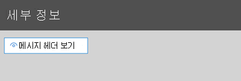

# <a name="quarantine-tags"></a>격리 태그

> [!NOTE]
> 이 문서에서 설명 하는 기능은 현재 미리 보기 상태 이며 모든 사용자가 사용할 수 없으며 변경 될 수 있습니다.

EOP (Exchange Online Protection)의 격리 태그를 사용 하면 관리자가 메시지 격리에 도착 한 방법에 따라 사용자가 격리 된 메시지에 대해 수행할 수 있는 작업을 제어할 수 있습니다.

EOP에서는 [격리](find-and-release-quarantined-messages-as-a-user.md) 및 [최종 사용자 스팸 알림의](use-spam-notifications-to-release-and-report-quarantined-messages.md)메시지에 대 한 특정 수준의 대화형 작업을 일반적으로 허용 하거나 차단 합니다. 예를 들어 최종 사용자는 스팸 방지 필터링을 통해 격리 된 메시지를 보고 릴리스할 수 있지만, 높은 신뢰도의 피싱 메일로 격리 된 메시지를 보거나 릴리스할 수도 없습니다.

[지원 되는 보호 기능](#step-2-assign-a-quarantine-tag-to-supported-features)에서 격리 태그는 최종 사용자 스팸 알림 메시지 및 격리 된 메시지 (사용자가 받는 사람)에 게 허용 되는 사용자를 지정 합니다. 격리 된 메시지에 최종 사용자에 대 한 기록 기능을 적용 하기 위해 기본 격리 태그가 자동으로 할당 됩니다. 또는 최종 사용자가 격리 된 메시지에 대 한 특정 작업을 수행 하는 것을 허용 하거나 차단 하도록 사용자 지정 격리 태그를 만들어 할당할 수 있습니다.

개별 사용 권한은 다음과 같은 미리 설정 된 사용 권한 그룹으로 결합 됩니다.

- 권한 없음
- 제한 된 액세스
- 모든 권한

다음 표에서는 미리 설정 된 권한 그룹에 포함 되거나 포함 되지 않은 개별 사용 권한

|사용 권한|권한 없음|제한 된 액세스|모든 권한|
|---|:---:|:---:|:---:|
|**보낸 사람 허용** (권한 권한 _보낸 사람_ )||||
|**차단 보낸 사람** _(권한 권한)_||||
|**삭제** ( _권한 삭제)_||||
|**미리 보기** (한/이상 _검토_ )||||
|**받는 사람이 격리에서 메시지를 해제할 수 있도록 허용** ( _PermissionToRelease_ )||||
|**받는 사람이 격리에서** _PermissionToRequestRelease_ 메시지를 요청 하도록 허용||||
|

미리 설정 된 사용 권한 그룹에서 기본 사용 권한이 마음에 들지 않는 경우에는 사용자 지정 격리 태그를 만들거나 수정할 때 사용자 지정 권한을 사용할 수 있습니다. 각 사용 권한에 대 한 자세한 내용은이 문서 뒷부분의 [Quarantine tag permission details](#quarantine-tag-permission-details) 섹션을 참조 하십시오.

격리 태그는 보안 & 준수 센터 또는 PowerShell (exchange online 사서함이 있는 Microsoft 365 조 직 용 Exchange online PowerShell, exchange online 사서함이 없는 EOP 조직의 독립 실행형 EOP PowerShell)에서 만들고 할당 합니다.

## <a name="what-do-you-need-to-know-before-you-begin"></a>시작하기 전에 알아야 할 내용은 무엇인가요?

- <https://protection.office.com/>에서 보안 및 준수 센터를 엽니다. **태그 격리** 페이지로 바로 이동 하려면를 엽니다 <https://protection.office.com/quarantineTags> .

- Exchange Online PowerShell에 연결하려면 [Exchange Online PowerShell에 연결](https://docs.microsoft.com/powershell/exchange/connect-to-exchange-online-powershell)을 참조하세요. 독립 실행형 EOP PowerShell에 연결하려면 [Exchange Online Protection PowerShell에 연결](https://docs.microsoft.com/powershell/exchange/connect-to-exchange-online-protection-powershell)을 참조하세요.

- 격리 태그를 보거나, 만들거나, 수정 하거나, 제거 하려면 다음 역할 그룹 중 하나의 구성원 이어야 합니다.
  - [보안 및 준수 센터](permissions-in-the-security-and-compliance-center.md)의 **조직 관리** 또는 **보안 관리자**
  - [Exchange Online](https://docs.microsoft.com/Exchange/permissions-exo/permissions-exo#role-groups)의 **조직 관리** 및 **예방 조치 관리**

## <a name="step-1-create-quarantine-tags-in-the-security--compliance-center"></a>1 단계: 보안 & 준수 센터에서 격리 태그 만들기

1. 보안 & 준수 센터에서 **위협 관리** \> **정책** 으로 이동한 후 **태그 격리** 를 선택 합니다.

2. **태그 격리** 페이지에서 **사용자 지정 태그 추가** 를 선택 합니다.

3. **새 태그** 마법사가 열립니다. **태그 이름** 페이지에서 **태그 이름** 필드에 간단 하지만 고유한 이름을 입력 합니다. 다음 단계에서 이름으로 태그를 식별 하 고 선택 해야 합니다. 작업을 마친 후 **다음** 을 클릭합니다.

4. **받는 사람 메시지 액세스** 페이지에서 다음 값 중 하나를 선택 합니다.
   - **액세스 금지**
   - **제한 된 액세스**
   - **모든 권한**

   이러한 사용 권한 그룹에 포함 된 개별 사용 권한은이 문서의 앞부분에서 설명 합니다.

   사용자 지정 사용 권한을 지정 하려면 **특정 액세스 설정 (고급)** 을 선택 하 고 다음 설정을 구성 합니다.

     - **Release action 기본 설정** : 다음 값 중 하나를 선택 합니다.
       - **릴리스 작업 없음** :이 값은 기본값입니다.
       - **받는 사람이 격리에서 메시지를 해제할 수 있도록 허용**
       - **받는 사람이 격리에서 해제 되도록 메시지를 요청 하도록 허용**

     - **받는 사람이 격리 된 메시지에 대해 수행할 수 있는 추가 작업 선택** : 다음 값 중 일부 또는 모두를 선택 합니다.
       - **삭제**
       - **미리 보기**
       - **보낸 사람 허용**
       - **보낸 사람 차단**

   이러한 사용 권한 및 격리 된 메시지에 대 한 영향 및 최종 사용자 스팸 알림에는이 문서 뒷부분의 [Quarantine 태그 사용 권한 세부 정보](#quarantine-tag-permission-details) 섹션에 설명 되어 있습니다.

   작업을 마친 후 **다음** 을 클릭합니다.

5. 표시 된 **요약** 페이지에서 설정을 검토 합니다. 각 설정에 대해 **편집** 을 클릭 하 여 수정할 수 있습니다.

   작업이 완료 되 면 **제출을** 클릭 합니다.

6. 확인 페이지가 나타나면 **완료** 를 클릭 합니다.

이제 [2 단계](#step-2-assign-a-quarantine-tag-to-supported-features) 섹션에 설명 된 대로 격리 기능에 격리 태그를 할당할 수 있습니다.

### <a name="create-quarantine-tags-in-powershell"></a>PowerShell에서 격리 태그 만들기

PowerShell을 사용 하 여 격리 태그를 만들려면 Exchange Online PowerShell 또는 Exchange Online Protection PowerShell에 연결 하 고 **QuarantineTag** cmdlet을 사용 합니다. 선택할 수 있는 두 가지 방법은 다음과 같습니다.

- _EndUserQuarantinePermissionsValue_ 매개 변수를 사용 합니다.
- _EndUserQuarantinePermissions_ 매개 변수를 사용 합니다.

다음 섹션에서는 이러한 방법을 설명 합니다.

#### <a name="use-the-enduserquarantinepermissionsvalue-parameter"></a>EndUserQuarantinePermissionsValue 매개 변수를 사용 합니다.

_EndUserQuarantinePermissionsValue_ 매개 변수를 사용 하 여 quarantine 태그를 만들려면 다음 구문을 사용 합니다.

```powershell
New-QuarantineTag -Name "<UniqueName>" -EndUserQuarantinePermissionsValue <0 to 236>
```

_EndUserQuarantinePermissionsValue_ 매개 변수는 이진 값에서 변환 되는 10 진수 값을 사용 합니다. 이진 값은 사용 가능한 최종 사용자 격리 권한에 따라 특정 순서에 해당 합니다. 각 사용 권한에 대해 값 1은 True이 고 값 0은 False와 같습니다.

미리 설정 된 권한 그룹의 각 개별 권한에 필요한 순서 및 값은 다음 표에 설명 되어 있습니다.

****

|사용 권한|권한 없음|제한 된 액세스|모든 권한|
|---|:---:|:---:|:---:|
|권한 권한 보낸 사람|개|개|1 |
|권한 \ 보낸 사람|개|1 |1 |
|권한 삭제|개|1 |1 |
|권한 다운로드<sup>\*</sup>|개|개|개|
|에이 Topreview|개|1 |1 |
|PermissionToRelease<sup>\*\*</sup>|개|개|1 |
|PermissionToRequestRelease<sup>\*\*</sup>|개|1 |개|
|PermissionToViewHeader<sup>\*</sup>|개|개|개|
|이진 값|00000000|01101010|11101100|
|사용할 10 진수 값|개|106|236|

<sup>\*</sup> 현재이 값은 항상 0입니다. PermissionToViewHeader의 경우에는 값 0이 격리 된 메시지의 세부 정보에서 **메시지 머리글 보기** 단추를 숨기지 않습니다 (단추를 항상 사용할 수 있음).

<sup>\*\*</sup> 두 값을 모두 1로 설정 하지는 않습니다. 1로, 다른 한는 0으로 설정 하거나 둘 다 0으로 설정 합니다.

이 예에서는 위의 표에 설명 된 대로 액세스 권한 없음 권한을 할당 하는 새 quarantine 태그 이름 NoAccess를 만듭니다.

```powershell
New-QuarantineTag -Name NoAccess -EndUserQuarantinePermissionsValue 0
```

제한 된 액세스 권한의 경우 값 106을 사용 합니다. 모든 액세스 권한에 대해서는 236 값을 사용 합니다.

사용자 지정 권한에 대해 위의 표를 사용 하 여 원하는 권한에 해당 하는 이진 값을 가져옵니다. 이진 값을 10 진수 값으로 변환 하 고 _EndUserQuarantinePermissionsValue_ 매개 변수에 10 진수 값을 사용 합니다.

구문과 매개 변수에 대 한 자세한 내용은 [QuarantineTag](https://docs.microsoft.com/powershell/module/exchange/new-quarantinetag)를 참조 하십시오.

#### <a name="use-the-enduserquarantinepermissions-parameter"></a>EndUserQuarantinePermissions 매개 변수를 사용 합니다.

_EndUserQuarantinePermissionsValue_ 매개 변수를 사용 하 여 quarantine 태그를 만들려면 다음 단계를 수행 합니다.

대답. **QuarantinePermissions** cmdlet을 사용 하 여 변수에 격리 사용 권한 개체를 저장 합니다.
<br/>
B. **QuarantineTag** 명령에서 _EndUserQuarantinePermissions_ 값으로 변수를 사용 합니다.

##### <a name="step-a-store-a-quarantine-permissions-object-in-a-variable"></a>단계 A: a 변수에 격리 사용 권한 개체 저장

다음 구문을 사용합니다.

```powershell
$<VariableName> = New-QuarantinePermissions [-PermissionToAllowSender <$true | $False>] [-PermissionToBlockSender <$true | $False>] [-PermissionToDelete <$true | $False>] [-PermissionToPreview <$true | $False>] [-PermissionToRelease <$true | $False>] [-PermissionToRequestRelease <$true | $False>]
```

사용 되지 않는 모든 매개 변수의 기본값은 `$false` 값을 설정 하려는 매개 변수만 사용 해야 하므로 `$true`

다음 예에서는 미리 설정 된 사용 권한 그룹에 해당 하는 permission 개체를 만드는 방법을 보여 줍니다.

- **액세스 권한 없음** :

  ```powershell
  $NoAccess = New-QuarantinePermissions
  ```

- **제한 된 액세스** :

  ```powershell
  $LimitedAccess = New-QuarantinePermissions -PermissionToBlockSender $true -PermissionToDelete $true -PermissionToPreview $true -PermissionToRequestRelease $true
  ```

- **모든 권한** :

  ```powershell
  $FullAccess = New-QuarantinePermissions -PermissionToAllowSender $true -PermissionToBlockSender $true -PermissionToDelete $true -PermissionToPreview $true -PermissionToRelease $true
  ```

설정한 값을 보려면 명령 실행과 같이 변수 이름을 명령으로 실행 `$NoAccess` 합니다.

사용자 지정 권한으로는 _PermissionToRelease_ 및 _PermissionToRequestRelease_ 매개 변수를 모두로 설정 하지 마세요 `$true` . 하나는로 설정 하 `$true` 고 나머지는 그대로 두거나 그대로 둘 `$false` 다로 유지 `$false` 합니다.

또한 만든 후에 **QuarantinePermissions** cmdlet을 사용 하 여 기존 permissions 개체 변수를 수정할 수도 있습니다.

구문과 매개 변수에 대 한 자세한 내용은 [QuarantinePermissions](https://docs.microsoft.com/powershell/module/exchange/new-quarantinepermissions) 및 [QuarantinePermissions](https://docs.microsoft.com/powershell/module/exchange/set-quarantinepermissions)를 참조 하십시오.

##### <a name="step-b-use-the-variable-in-the-new-quarantinetag-command"></a>B 단계: New-QuarantineTag 명령에 변수 사용

사용 권한 개체를 만들어 변수에 저장 한 후에는 다음 **QuarantineTag** 명령에 _EndUserQuarantinePermission_ 매개 변수 값에 대 한 변수를 사용 합니다.

```powershell
New-QuarantineTag -Name "<UniqueName>" -EndUserQuarantinePermissions $<VariableName>
```

이 예에서는 `$LimitedAccess` 이전 단계에서 설명 하 고 만든 permissions 개체를 사용 하 여 LimitedAccess 라는 새 quarantine 태그를 만듭니다.

```powershell
New-QuarantineTag -Name LimitedAccess -EndUserQuarantinePermissions $LimitedAccess
```

구문과 매개 변수에 대 한 자세한 내용은 [QuarantineTag](https://docs.microsoft.com/powershell/module/exchange/new-quarantinetag)를 참조 하십시오.

## <a name="step-2-assign-a-quarantine-tag-to-supported-features"></a>2 단계: 지원 되는 기능에 격리 태그 할당

메시지 또는 파일을 격리 하는 _지원 되_ 는 보호 기능 (자동 또는 구성 가능한 작업)에서 사용 가능한 격리 작업에 격리 태그를 할당할 수 있습니다. 메시지를 격리 하는 기능과 격리 태그의 가용성에 대해서는 다음 표에 설명 되어 있습니다.

****

|기능|격리 태그가 지원 됩니까?|기본 격리 태그 사용|
|---|:---:|---|
|[스팸 방지 정책](configure-your-spam-filter-policies.md): <ul><li>**스팸** ( _spamaction_ )</li><li>_HighConfidenceSpamAction_ ( **High 신임 스팸** )</li><li>**피싱 전자 메일** ( _PhishSpamAction_ )</li><li>**높은 신뢰도 피싱 전자 메일** ( _HighConfidencePhishAction_ )</li><li>**대량 전자 메일 (다량** _spamaction_ )</li></ul>|예|<ul><li>DefaultSpamTag (모든 권한)</li><li>DefaultHighConfSpamTag (모든 권한)</li><li>DefaultPhishTag (모든 권한)</li><li>DefaultHighConfPhishTag (액세스 권한 없음)</li><li>Default대량 태그 (모든 권한)</li></ul>
|피싱 방지 정책: <ul><li>[스푸핑 인텔리전스 보호](set-up-anti-phishing-policies.md#spoof-settings) ( _authenticationfailaction_ )</li><li>[가장 보호](set-up-anti-phishing-policies.md#impersonation-settings-in-atp-anti-phishing-policies):<sup>\*</sup> <ul><li>**가장 된 사용자가 전자 메일을 보낸 경우** ( _TargetedUserProtectionAction_ )</li><li>**가장 된 도메인에서 전자 메일을 보낸 경우** ( _TargetedDomainProtectionAction_ )</li><li>**사서함 인텔리전스** \> **가장 된 사용자가 전자 메일을 보낸 경우** ( _MailboxIntelligenceProtectionAction_ )</li></ul></li></ul></ul>|아니요|해당 없음|
|[맬웨어 방지 정책](configure-anti-malware-policies.md): 검색 된 모든 메시지는 항상 격리 됩니다.|아니요|해당 없음|
|[SharePoint, OneDrive 및 Microsoft Teams에 대한 ATP](atp-for-spo-odb-and-teams.md)|아니요|해당 없음|
|[메일 흐름 규칙](https://docs.microsoft.com/exchange/security-and-compliance/mail-flow-rules/mail-flow-rules) (전송 규칙이 라고도 함)은 **메시지를 호스팅된 격리** ( _격리_ )로 배달 합니다.|아니요|해당 없음|
|

<sup>\*</sup> 가장을 보호 하는 설정은 Microsoft Defender for Office 365의 피싱 방지 정책 에서만 사용할 수 있습니다.

기본 격리 태그에서 제공 하는 최종 사용자 권한이 만족 되 면 별도의 작업을 수행할 필요가 없습니다. 최종 사용자 스팸 알림이나 격리 된 메시지 세부 정보에서 최종 사용자 기능 (사용 가능한 단추)을 사용자 지정 하려는 경우 사용자 지정 quarantine 태그를 할당할 수 있습니다.

### <a name="assign-quarantine-tags-in-anti-spam-policies-in-the-security--compliance-center"></a>보안 & 준수 센터의 스팸 방지 정책에서 격리 태그 할당

스팸 방지 정책 만들기 및 수정에 대 한 전체 지침은 [EOP의 스팸 방지 정책 구성](configure-your-spam-filter-policies.md)에 설명 되어 있습니다.

1. 보안 & 준수 센터에서 **위협 관리** \> **정책** 으로 이동한 \> 다음 **스팸 방지** 를 선택 합니다. 또는를 엽니다 <https://protection.office.com/antispam> .

2. 편집할 기존 스팸 방지 정책을 찾아서 선택 하거나 새 스팸 방지 정책을 만듭니다.

3. 정책 세부 정보 플라이 아웃에서 **스팸 및 대량 작업** 섹션을 확장 합니다.
  
4. 사용 가능한 스팸 필터링 결과의 동작에 대 한 **메시지 격리** 를 선택한 경우 해당 결과에 대 **한 quarantine 태그** 를 선택할 수 있습니다.

   **참고** : 새 정책을 만들 때 스팸 필터링 결과에 대 한 빈 quarantine 태그 값은 해당 결과에 대 한 기본 quarantine 태그가 사용 됨을 나타냅니다. 나중에 정책을 편집할 때 빈 값은 위의 표에 설명 된 것 처럼 실제 기본 quarantine 태그 이름으로 대체 됩니다.
  
   

5. 작업을 마쳤으면 **저장** 을 클릭합니다.

#### <a name="assign-quarantine-tags-in-anti-spam-policies-in-powershell"></a>PowerShell의 스팸 방지 정책에서 격리 태그 할당

PowerShell을 사용 하 여 스팸 방지 정책에서 격리 태그를 할당 하는 경우 Exchange Online PowerShell 또는 Exchange Online Protection PowerShell에 연결 하 고 다음 구문을 사용 합니다.

```powershell
<New-HostedContentFilterPolicy -Name "<Unique name>" | Set-HostedContentFilterPolicy -Identity "<Policy name>">  [-SpamAction Quarantine] [-SpamQuarantineTag <QuarantineTagName>] [-HighConfidenceSpamAction Quarantine] [-HighConfidenceSpamQuarantineTag <QuarantineTagName>] [-PhishSpamAction Quarantine] [-PhishQuarantineTag <QuarantineTagName>] [-HighConfidencePhishQuarantineTag <QuarantineTagName>] [-BulkSpamAction Quarantine] [-BulkQuarantineTag <QuarantineTagName>] ...
```

**참고** :

- _HighConfidencePhishAction_ 매개 변수의 기본값은 격리 이므로 새 스팸 방지 정책에서 높은 신뢰도의 피싱 감지에 대 한 격리 작업을 설정할 필요가 없습니다. 신규 또는 기존 스팸 방지 정책에 있는 다른 모든 스팸 필터링 verdicts에 대해 quarantine 태그는 action 값이 격리 인 경우에만 유효 합니다. 기존 스팸 방지 정책에서 작업 값을 확인 하려면 다음 명령을 실행 합니다.

  ```powershell
  Get-HostedContentFilterPolicy | Format-Table Name,*SpamAction,HighConfidencePhishAction
  ```

  기본 작업 값과 표준 및 Strict에 대 한 권장 작업 값에 대 한 자세한 내용은 [EOP 스팸 방지 정책 설정](recommended-settings-for-eop-and-office365-atp.md#eop-anti-spam-policy-settings)를 참조 하십시오.

- 해당 하는 quarantine 태그 매개 변수를 사용 하지 않고 스팸 필터링 결과 해당 결과에 대 한 [기본 quarantine 태그가](#step-2-assign-a-quarantine-tag-to-supported-features) 필요 함을 의미 합니다.

  격리 된 메시지의 기본 최종 사용자 기능을 변경 하려는 경우에는 기본 quarantine 태그를 사용자 지정 quarantine 태그로 바꿔야 합니다.

- PowerShell의 새로운 스팸 방지 정책에는 **get-hostedcontentfilterpolicy** Cmdlet 및 **disable-hostedcontentfilterrule** cmdlet을 사용 하 여 새 스팸 필터 규칙 (받는 사람 필터)을 사용 하는 스팸 필터 정책 (설정)이 필요 합니다. 자세한 내용은 [PowerShell을 사용 하 여 스팸 방지 정책 만들기](configure-your-spam-filter-policies.md#use-powershell-to-create-anti-spam-policies)를 참조 하세요.

이 예에서는 다음 설정을 사용 하 여 Research 부서별 이라는 새 스팸 필터 정책을 만듭니다.

- 모든 스팸 필터링 verdicts에 대 한 작업은 Quarantine로 설정 됩니다.
- 액세스 권한을 할당 **하지** 않는 NoAccess 이라는 사용자 지정 격리 태그는 기본적으로 아직 **액세스** 권한을 할당 하지 않은 기본 격리 태그를 대체 합니다.

```powershell
New-HostedContentFilterPolicy -Name Research Department -SpamAction Quarantine -SpamQuarantineTag NoAccess -HighConfidenceSpamAction Quarantine -HighConfidenceSpamQuarantineTag NoAction -PhishSpamAction Quarantine -PhishQuarantineTag NoAction -BulkSpamAction Quarantine -BulkQuarantineTag NoAccess
```

자세한 구문 및 매개 변수 정보는 [New-HostedContentFilterPolicy](https://docs.microsoft.com/powershell/module/exchange/new-hostedcontentfilterpolicy)를 참조하세요.

이 예에서는 인적 자원 이라는 기존 스팸 필터 정책을 수정 합니다. 스팸 격리 결과에 대 한 작업은 Quarantine로 설정 되 고 NoAccess 이라는 사용자 지정 quarantine 태그는 할당 됩니다.

```powershell
Set-HostedContentFilterPolicy -Identity "Human Resources" -SpamAction Quarantine -SpamQuarantineTag NoAccess
```

자세한 구문 및 매개 변수 정보는 [Set-HostedContentFilterPolicy](https://docs.microsoft.com/powershell/module/exchange/set-hostedcontentfilterpolicy)를 참조하세요.

## <a name="configure-global-quarantine-notification-settings-in-the-security--compliance-center"></a>보안 & 준수 센터에서 전역 격리 알림 설정 구성

격리 태그에 대 한 전역 설정을 사용 하면 격리 된 메시지의 받는 사람에 게 전송 되는 최종 사용자 스팸 알림을 사용자 지정할 수 있습니다. 이러한 알림에 대 한 자세한 내용은 [최종 사용자 스팸 알림을](use-spam-notifications-to-release-and-report-quarantined-messages.md)참조 하십시오.

1. 보안 & 준수 센터에서 **위협 관리** \> **정책** 으로 이동한 후 **태그 격리** 를 선택 합니다.

2. **태그 격리** 페이지에서 **전역 설정을** 선택 합니다.

3. **격리 알림 설정** 플라이 인이 열리면 다음 설정 중 일부 또는 전체를 구성 합니다.

   - **회사 로고 사용** : 최종 사용자 스팸 알림의 맨 위에서 사용 되는 기본 Microsoft 로고를 교체 하려면이 옵션을 선택 합니다. 이 작업을 수행 하기 전에 [조직의 Microsoft 365 테마 사용자 지정](https://docs.microsoft.com/microsoft-365/admin/setup/customize-your-organization-theme) 의 지침을 따라 사용자 지정 로고를 업로드 해야 합니다.

     다음 스크린샷은 최종 사용자 스팸 알림에 사용자 지정 로고를 보여 줍니다.

     

   - **언어 선택** : 최종 사용자 스팸 알림은 받는 사람의 언어 설정에 따라 이미 지역화 되어 있습니다. **표시 이름** 및 고 **지** 사항 값에 대해 다양 한 언어로 사용자 지정 된 텍스트를 지정할 수 있습니다.

     첫 번째 언어 상자에서 하나 이상의 언어를 선택 하 고 **추가** 를 클릭 합니다. **추가** 를 클릭 하 여 여러 언어를 선택할 수 있습니다. 섹션 언어 상자에는 선택한 모든 언어가 표시 됩니다.

     

   - **표시 이름** : 최종 사용자 스팸 알림에 사용 되는 보낸 사람의 표시 이름을 사용자 지정 합니다.

     추가한 각 언어에 대해 두 번째 언어 상자의 언어 (X를 클릭 하지 않음)를 선택 하 고 **표시 이름** 상자에 원하는 텍스트 값을 입력 합니다.

     다음 스크린샷에서는 최종 사용자 스팸 알림에 사용자 지정 된 표시 이름을 보여 줍니다.

     

   - 고 **지** 사항: 최종 사용자 스팸 알림의 아래쪽에 사용자 지정 고 지 사항을 추가 합니다. 지역화 된 텍스트 ( **조직에서의 고 지 사항** )는 항상 먼저 포함 되며, 지정한 텍스트가 뒤에 나옵니다.

     추가한 각 언어에 대해 두 번째 언어 상자 (X를 클릭 하지 않음)에서 언어를 선택 하 고 고 **지** 사항 상자에 원하는 텍스트 값을 입력 합니다.

     다음 스크린샷에서는 최종 사용자 스팸 알림에 대해 사용자 지정 된 고 지 사항을 보여 줍니다.

     

## <a name="view-quarantine-tags-in-the-security--compliance-center"></a>보안 & 준수 센터에서 격리 태그 보기

1. 보안 & 준수 센터에서 **위협 관리** \> **정책** 으로 이동한 후 **태그 격리** 를 선택 합니다.

- 기본 제공 또는 사용자 지정 격리 태그의 설정을 보려면 목록에서 quarantine 태그를 선택 합니다 (확인란을 선택 하지 않음).

- 전역 설정을 보려면 **전역 설정을** 선택 합니다.

### <a name="view-quarantine-tags-in-powershell"></a>PowerShell에서 격리 태그 보기

PowerShell을 사용 하 여 격리 태그를 보려면 다음 단계 중 하나를 수행 합니다.

- 모든 기본 제공 또는 사용자 지정 태그의 요약 목록을 보려면 다음 명령을 실행 합니다.

  ```powershell
  Get-QuarantineTag | Format-Table Name
  ```

- 기본 제공 또는 사용자 지정 격리 태그의 설정을 보려면 \<TagName\> quarantine 태그의 이름으로 바꾸고 다음 명령을 실행 합니다.

  ```powershell
  Get-QuarantineTag -Identity "<TagName>"
  ```

- 전역 설정을 보려면 다음 명령을 실행 합니다.

  ```powershell
  Get-QuarantineTag -QuarantineTagType GlobalQuarantineTag
  ```

자세한 구문 및 매개 변수 정보는 [Get-HostedContentFilterPolicy](https://docs.microsoft.com/powershell/module/exchange/get-hostedcontentfilterpolicy)를 참조하세요.

## <a name="remove-quarantine-tags-in-the-security--compliance-center"></a>보안 & 준수 센터에서 격리 태그 제거

**참고** :

- 기본 제공 격리 태그는 제거할 수 없습니다.

- 사용자 지정 quarantine 태그를 제거 하기 전에 해당 태그가 사용 되지 않는지 확인 합니다. 예를 들어 PowerShell에서 다음 명령을 실행 합니다.

  ```powershell
  Get-HostedContentFilterPolicy | Format-List Name,*QuarantineTag
  ```

  검역 태그를 사용 하는 경우 제거 하기 전에 [할당 된 quarantine 태그를 교체](#step-2-assign-a-quarantine-tag-to-supported-features) 합니다.

1. 보안 & 준수 센터에서 **위협 관리** \> **정책** 으로 이동한 후 **태그 격리** 를 선택 합니다.

2. **태그 격리** 페이지에서 제거 하려는 사용자 지정 격리 태그를 선택 하 고 **삭제 태그** 를 클릭 합니다.

3. 나타나는 확인 대화 상자에서 **태그 제거** 를 클릭 합니다.

### <a name="remove-quarantine-tags-in-powershell"></a>PowerShell에서 격리 태그 제거

PowerShell을 사용 하 여 사용자 지정 격리 태그를 제거 하려면 \<TagName\> quarantine 태그의 이름으로 바꾸고 다음 명령을 실행 합니다.

```powershell
Remove-QuarantineTag -Identity "<TagName>"
```

구문과 매개 변수에 대 한 자세한 내용은 [QuarantineTag](https://docs.microsoft.com/powershell/module/exchange/remove-quarantinetag)를 참조 하십시오.

## <a name="quarantine-tag-permission-details"></a>검역 태그 사용 권한 세부 정보

다음 섹션에서는 미리 설정 된 권한 그룹과 개별 사용 권한이 격리 된 메시지의 세부 내용과 최종 사용자 스팸 알림에 미치는 영향에 대해 설명 합니다.

### <a name="preset-permissions-groups"></a>미리 설정 된 사용 권한 그룹

미리 설정 된 사용 권한 그룹에 포함 되어 있는 개별 사용 권한은이 문서의 시작 부분에 있는 표에 나와 있습니다.

#### <a name="no-access"></a>권한 없음

격리 태그가 액세스 권한 없이 사용 권한을 할당 하는 경우에도 사용자는 다음과 같은 기본 기능을 얻게 **됩니다** .

- **격리 된 메시지 정보** : **메시지 머리글 보기** 단추를 항상 사용할 수 있습니다.

  

- **최종 사용자 스팸 알림** : 격리에서 메시지를 사용자에 게 가져오는 **검토** 단추를 항상 사용할 수 있습니다.

  

#### <a name="limited-access"></a>제한 된 액세스

격리 태그가 **제한 된 액세스** 권한을 할당 하는 경우 사용자는 다음과 같은 기능을 얻게 됩니다.

- **격리 된 메시지 정보** : 다음 단추를 사용할 수 있습니다.
  - **요청 릴리스**
  - **메시지 헤더 보기**
  - **메시지 미리 보기**
  - **보낸 사람 차단**
  - **격리에서 제거**

  

- **최종 사용자 스팸 알림** : 다음 단추를 사용할 수 있습니다.
  - **보낸 사람 차단**
  - **검토**

  

#### <a name="full-access"></a>모든 권한

격리 태그가 모든 사용 권한을 할당 하는 경우 (모든 사용 가능한 권한) 사용자는 다음과 같은 기능을 얻게 **됩니다** .

- **격리 된 메시지 정보** : 다음 단추를 사용할 수 있습니다.
  - **메시지 릴리스**
  - **메시지 헤더 보기**
  - **메시지 미리 보기**
  - **보낸 사람 차단**
  - **보낸 사람 허용**
  - **격리에서 제거**

  

- **최종 사용자 스팸 알림** : 다음 단추를 사용할 수 있습니다.
  - **보낸 사람 차단**
  - **릴리스**
  - **검토**

  

### <a name="individual-permissions"></a>개별 사용 권한

> [!NOTE]
> 사용자는 항상 [액세스 권한 없음](#no-access) 섹션에 설명 된 단추를 받게 된다는 점을 유의 하세요. 이러한 단추는 개별 사용 권한 설명에 포함 되어 있지 않습니다.

#### <a name="allow-sender-permission"></a>보낸 사람 사용 권한 허용

사용자가 편리 하 게 수신 허용- _보낸 사람 목록_ 에 격리 된 메시지 보낸 사람을 추가 하는 데 사용할 수 있는 단추에 대 한 액세스를 **제어 합니다.**

- **격리 된 메시지 정보** :
  - **보낸 사람** 권한 허용 사용: **보낸 사람 허용** 단추를 사용할 수 있습니다.
  - **보낸 사람** 허용 사용 안 함: **보낸 사람 허용** 단추를 사용할 수 없습니다.

- **최종 사용자 스팸 알림** : 효과 없음

수신 허용-보낸 사람 목록에 대 한 자세한 내용은 [신뢰할 수 있는 보낸 사람이 차단 되지 않도록 설정](https://support.microsoft.com/office/274ae301-5db2-4aad-be21-25413cede077#__toc304379666) 및 [Exchange Online PowerShell을 사용 하 여 사서함에서 수신 허용 목록 컬렉션을 구성](https://docs.microsoft.com/microsoft-365/security/office-365-security/configure-junk-email-settings-on-exo-mailboxes#use-exchange-online-powershell-to-configure-the-safelist-collection-on-a-mailbox)합니다 .을 참조 하십시오.

#### <a name="block-sender-permission"></a>보낸 사람 차단 권한

**차단** _된 보낸 사람_ 메시지를 사용자가 편리 하 게 수신 허용 목록에 추가 하는 데 사용할 수 있는 단추에 대 한 액세스를 제어 합니다.

- **격리 된 메시지 정보** :
  - **보낸 사람** 차단 사용 권한을 사용 하도록 설정 됨: **보낸 사람 차단** 단추를 사용할 수 있습니다.
  - **보낸 사람** 차단 권한 사용 안 함: **보낸 사람 차단** 단추를 사용할 수 없습니다.

- **최종 사용자 스팸 알림** :
  - **보낸 사람** 차단 권한 사용 안 함: **보낸 사람 차단** 단추를 사용할 수 없습니다.
  - **보낸 사람** 차단 사용 권한을 사용 하도록 설정 됨: **보낸 사람 차단** 단추를 사용할 수 있습니다.

수신 거부 목록에 대 한 자세한 내용은 [특정인이 보낸 메시지 차단](https://support.microsoft.com/office/274ae301-5db2-4aad-be21-25413cede077#__toc304379667) 및 [Exchange Online PowerShell을 사용 하 여 사서함에서 수신 허용 목록 컬렉션을 구성](https://docs.microsoft.com/microsoft-365/security/office-365-security/configure-junk-email-settings-on-exo-mailboxes#use-exchange-online-powershell-to-configure-the-safelist-collection-on-a-mailbox)합니다 .을 참조 하십시오.

#### <a name="delete-permission"></a>삭제 권한

**삭제** 권한 (고 대 _삭제_ )은 사용자가 격리에서 메시지 (사용자가 받는 메시지)를 삭제 하는 기능을 제어 합니다.

- **격리 된 메시지 정보** :
  - **삭제** 권한 사용: **격리에서 제거** 단추를 사용할 수 있습니다.
  - **삭제** 권한 사용 안 함: **격리에서 제거** 단추를 사용할 수 없습니다.

- **최종 사용자 스팸 알림** : 효과 없음

#### <a name="preview-permission"></a>미리 보기 권한

**미리 보기** 권한 (고가을 _검토_ )을 통해 사용자가 격리에서 메시지를 미리 보는 기능을 제어할 수 있습니다.

- **격리 된 메시지 정보** :
  - 사용 권한 **미리 보기** 사용: **메시지 미리 보기** 단추를 사용할 수 있습니다.
  - **미리 보기** 사용 안 함: **메시지 미리 보기** 단추를 사용할 수 없습니다.

- **최종 사용자 스팸 알림** : 효과 없음

#### <a name="allow-recipients-to-release-a-message-from-quarantine-permission"></a>받는 사람이 격리 사용 권한에서 메시지를 해제할 수 있도록 허용

**받는 사람이 격리 사용 권한에서 메시지를 릴리스할 수 있도록 허용** ( _PermissionToRelease_ )은 관리자의 승인 없이 사용자가 격리 된 메시지를 릴리스할 수 있는지 여부를 제어 합니다.

- **격리 된 메시지 정보** :
  - 사용 권한 사용: **릴리즈 메시지** 단추를 사용할 수 있습니다.
  - 사용 안 함: **메시지 릴리스** 단추를 사용할 수 없습니다.
  
- **최종 사용자 스팸 알림** :
  - 사용 권한 사용: **릴리스** 단추를 사용할 수 있습니다.
  - 사용 안 함: **릴리스** 단추를 사용할 수 없습니다.

#### <a name="allow-recipients-to-request-a-message-to-be-released-from-quarantine-permission"></a>받는 사람이 격리 사용 권한에서 해제 되도록 메시지를 요청 하도록 허용

**받는 사람이 격리 사용 권한에서 해제할 메시지를 요청할 수 있도록 허용** ( _PermissionToRequestRelease_ )은 사용자가 격리 된 메시지의 릴리스를 _요청할_ 수 있는 기능을 제어 합니다. 이 메시지는 관리자가 요청을 승인한 후에만 릴리스됩니다.

- **격리 된 메시지 정보** :
  - 사용 권한 사용: **요청 릴리스** 단추를 사용할 수 있습니다.
  - 사용 안 함: **요청 릴리스** 단추를 사용할 수 없습니다.

- **최종 사용자 스팸 알림** : **릴리스** 단추를 사용할 수 없습니다.
