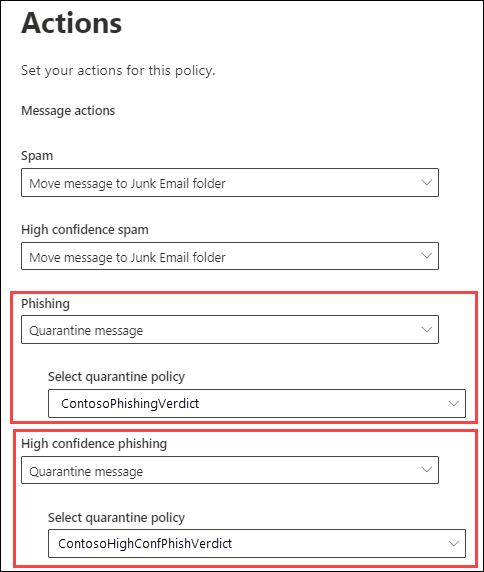

# <a name="quarantine-tags"></a><span data-ttu-id="942d0-103">격리 태그</span><span class="sxs-lookup"><span data-stu-id="942d0-103">Quarantine tags</span></span>

> [!NOTE]
> <span data-ttu-id="942d0-104">이 문서에서 설명 하는 기능은 현재 미리 보기 상태 이며 모든 사용자가 사용할 수 없으며 변경 될 수 있습니다.</span><span class="sxs-lookup"><span data-stu-id="942d0-104">The features that are described in this article are currently in Preview, aren't available to everyone, and are subject to change.</span></span>

<span data-ttu-id="942d0-105">EOP (Exchange Online Protection)의 격리 태그를 사용 하면 관리자가 메시지 격리에 도착 한 방법에 따라 사용자가 격리 된 메시지에 대해 수행할 수 있는 작업을 제어할 수 있습니다.</span><span class="sxs-lookup"><span data-stu-id="942d0-105">Quarantine tags in Exchange Online Protection (EOP) allow admins to control what users are able to do to their quarantined messages based on how the message arrived in quarantine.</span></span>

<span data-ttu-id="942d0-106">EOP에서는 [격리](find-and-release-quarantined-messages-as-a-user.md) 및 [최종 사용자 스팸 알림의](use-spam-notifications-to-release-and-report-quarantined-messages.md)메시지에 대 한 특정 수준의 대화형 작업을 일반적으로 허용 하거나 차단 합니다.</span><span class="sxs-lookup"><span data-stu-id="942d0-106">EOP has traditionally allowed or prevented certain levels of interactivity for messages in [quarantine](find-and-release-quarantined-messages-as-a-user.md) and in [end-user spam notifications](use-spam-notifications-to-release-and-report-quarantined-messages.md).</span></span> <span data-ttu-id="942d0-107">예를 들어 최종 사용자는 스팸 방지 필터링을 통해 격리 된 메시지를 보고 릴리스할 수 있지만, 높은 신뢰도의 피싱 메일로 격리 된 메시지를 보거나 릴리스할 수도 없습니다.</span><span class="sxs-lookup"><span data-stu-id="942d0-107">For example, end-users can view and release messages that were quarantined by anti-spam filtering as spam or bulk, but they can't view or release messages that were quarantined as high confidence phishing.</span></span>

<span data-ttu-id="942d0-108">[지원 되는 보호 기능](#step-2-assign-a-quarantine-tag-to-supported-features)에서 격리 태그는 최종 사용자 스팸 알림 메시지 및 격리 된 메시지 (사용자가 받는 사람)에 게 허용 되는 사용자를 지정 합니다.</span><span class="sxs-lookup"><span data-stu-id="942d0-108">For [supported protection features](#step-2-assign-a-quarantine-tag-to-supported-features), quarantine tags specify what users are allowed to do in end-user spam notification messages and in their quarantined messages in quarantine (messages where the user is a recipient).</span></span> <span data-ttu-id="942d0-109">격리 된 메시지에 최종 사용자에 대 한 기록 기능을 적용 하기 위해 기본 격리 태그가 자동으로 할당 됩니다.</span><span class="sxs-lookup"><span data-stu-id="942d0-109">Default quarantine tags are automatically assigned to enforce the historical capabilities for end-users on quarantined messages.</span></span> <span data-ttu-id="942d0-110">또는 최종 사용자가 격리 된 메시지에 대 한 특정 작업을 수행 하는 것을 허용 하거나 차단 하도록 사용자 지정 격리 태그를 만들어 할당할 수 있습니다.</span><span class="sxs-lookup"><span data-stu-id="942d0-110">Or, you can create and assign custom quarantine tags to allow or prevent end-users from performing specific actions on quarantined messages.</span></span>

<span data-ttu-id="942d0-111">개별 사용 권한은 다음과 같은 미리 설정 된 사용 권한 그룹으로 결합 됩니다.</span><span class="sxs-lookup"><span data-stu-id="942d0-111">The individual permissions are combined into the following preset permission groups:</span></span>

- <span data-ttu-id="942d0-112">권한 없음</span><span class="sxs-lookup"><span data-stu-id="942d0-112">No access</span></span>
- <span data-ttu-id="942d0-113">제한 된 액세스</span><span class="sxs-lookup"><span data-stu-id="942d0-113">Limited access</span></span>
- <span data-ttu-id="942d0-114">모든 권한</span><span class="sxs-lookup"><span data-stu-id="942d0-114">Full access</span></span>

<span data-ttu-id="942d0-115">다음 표에서는 미리 설정 된 권한 그룹에 포함 되거나 포함 되지 않은 개별 사용 권한</span><span class="sxs-lookup"><span data-stu-id="942d0-115">The available individual permissions and what's included or not included in the preset permission groups are described in the following table:</span></span>

|<span data-ttu-id="942d0-116">사용 권한</span><span class="sxs-lookup"><span data-stu-id="942d0-116">Permission</span></span>|<span data-ttu-id="942d0-117">권한 없음</span><span class="sxs-lookup"><span data-stu-id="942d0-117">No access</span></span>|<span data-ttu-id="942d0-118">제한 된 액세스</span><span class="sxs-lookup"><span data-stu-id="942d0-118">Limited access</span></span>|<span data-ttu-id="942d0-119">모든 권한</span><span class="sxs-lookup"><span data-stu-id="942d0-119">Full access</span></span>|
|---|:---:|:---:|:---:|
|<span data-ttu-id="942d0-120">**보낸 사람 허용** (권한 권한 _보낸 사람_ )</span><span class="sxs-lookup"><span data-stu-id="942d0-120">**Allow sender** ( _PermissionToAllowSender_ )</span></span>||||
|<span data-ttu-id="942d0-122">**차단 보낸 사람** _(권한 권한)_</span><span class="sxs-lookup"><span data-stu-id="942d0-122">**Block sender** ( _PermissionToBlockSender_ )</span></span>||||
|<span data-ttu-id="942d0-125">**삭제** ( _권한 삭제)_</span><span class="sxs-lookup"><span data-stu-id="942d0-125">**Delete** ( _PermissionToDelete_ )</span></span>||||
|<span data-ttu-id="942d0-128">**미리 보기** (한/이상 _검토_ )</span><span class="sxs-lookup"><span data-stu-id="942d0-128">**Preview** ( _PermissionToPreview_ )</span></span>||||
|<span data-ttu-id="942d0-131">**받는 사람이 격리에서 메시지를 해제할 수 있도록 허용** ( _PermissionToRelease_ )</span><span class="sxs-lookup"><span data-stu-id="942d0-131">**Allow recipients to release a message from quarantine** ( _PermissionToRelease_ )</span></span>||||
|<span data-ttu-id="942d0-133">**받는 사람이 격리에서** _PermissionToRequestRelease_ 메시지를 요청 하도록 허용</span><span class="sxs-lookup"><span data-stu-id="942d0-133">**Allow recipients to request a message to be released from quarantine** ( _PermissionToRequestRelease_ )</span></span>||||
|

<span data-ttu-id="942d0-135">미리 설정 된 사용 권한 그룹에서 기본 사용 권한이 마음에 들지 않는 경우에는 사용자 지정 격리 태그를 만들거나 수정할 때 사용자 지정 권한을 사용할 수 있습니다.</span><span class="sxs-lookup"><span data-stu-id="942d0-135">If you don't like the default permissions in the preset permission groups, you can use custom permissions when you create or modify custom quarantine tags.</span></span> <span data-ttu-id="942d0-136">각 사용 권한에 대 한 자세한 내용은이 문서 뒷부분의 [Quarantine tag permission details](#quarantine-tag-permission-details) 섹션을 참조 하십시오.</span><span class="sxs-lookup"><span data-stu-id="942d0-136">For more information about what each permission does, see the [Quarantine tag permission details](#quarantine-tag-permission-details) section later in this article.</span></span>

<span data-ttu-id="942d0-137">격리 태그는 보안 & 준수 센터 또는 PowerShell (exchange online 사서함이 있는 Microsoft 365 조 직 용 Exchange online PowerShell, exchange online 사서함이 없는 EOP 조직의 독립 실행형 EOP PowerShell)에서 만들고 할당 합니다.</span><span class="sxs-lookup"><span data-stu-id="942d0-137">You create and assign quarantine tags in the Security & Compliance Center or in PowerShell (Exchange Online PowerShell for Microsoft 365 organizations with Exchange Online Mailboxes; standalone EOP PowerShell in EOP organizations without Exchange Online mailboxes).</span></span>

## <a name="what-do-you-need-to-know-before-you-begin"></a><span data-ttu-id="942d0-138">시작하기 전에 알아야 할 내용은 무엇인가요?</span><span class="sxs-lookup"><span data-stu-id="942d0-138">What do you need to know before you begin?</span></span>

- <span data-ttu-id="942d0-139"><https://protection.office.com/>에서 보안 및 준수 센터를 엽니다.</span><span class="sxs-lookup"><span data-stu-id="942d0-139">You open the Security & Compliance Center at <https://protection.office.com/>.</span></span> <span data-ttu-id="942d0-140">**태그 격리** 페이지로 바로 이동 하려면를 엽니다 <https://protection.office.com/quarantineTags> .</span><span class="sxs-lookup"><span data-stu-id="942d0-140">To go directly to the **Quarantine tags** page, open <https://protection.office.com/quarantineTags>.</span></span>

- <span data-ttu-id="942d0-141">Exchange Online PowerShell에 연결하려면 [Exchange Online PowerShell에 연결](https://docs.microsoft.com/powershell/exchange/connect-to-exchange-online-powershell)을 참조하세요.</span><span class="sxs-lookup"><span data-stu-id="942d0-141">To connect to Exchange Online PowerShell, see [Connect to Exchange Online PowerShell](https://docs.microsoft.com/powershell/exchange/connect-to-exchange-online-powershell).</span></span> <span data-ttu-id="942d0-142">독립 실행형 EOP PowerShell에 연결하려면 [Exchange Online Protection PowerShell에 연결](https://docs.microsoft.com/powershell/exchange/connect-to-exchange-online-protection-powershell)을 참조하세요.</span><span class="sxs-lookup"><span data-stu-id="942d0-142">To connect to standalone EOP PowerShell, see [Connect to Exchange Online Protection PowerShell](https://docs.microsoft.com/powershell/exchange/connect-to-exchange-online-protection-powershell).</span></span>

- <span data-ttu-id="942d0-143">격리 태그를 보거나, 만들거나, 수정 하거나, 제거 하려면 다음 역할 그룹 중 하나의 구성원 이어야 합니다.</span><span class="sxs-lookup"><span data-stu-id="942d0-143">To view, create, modify, or remove quarantine tags, you need to be a member of one of the following role groups:</span></span>
  - <span data-ttu-id="942d0-144">[보안 및 준수 센터](permissions-in-the-security-and-compliance-center.md)의 **조직 관리** 또는 **보안 관리자**</span><span class="sxs-lookup"><span data-stu-id="942d0-144">**Organization Management** or **Security Administrator** in the [Security & Compliance Center](permissions-in-the-security-and-compliance-center.md).</span></span>
  - <span data-ttu-id="942d0-145">[Exchange Online](https://docs.microsoft.com/Exchange/permissions-exo/permissions-exo#role-groups)의 **조직 관리** 및 **예방 조치 관리**</span><span class="sxs-lookup"><span data-stu-id="942d0-145">**Organization Management** or **Hygiene Management** in [Exchange Online](https://docs.microsoft.com/Exchange/permissions-exo/permissions-exo#role-groups).</span></span>

## <a name="step-1-create-quarantine-tags-in-the-security--compliance-center"></a><span data-ttu-id="942d0-146">1 단계: 보안 & 준수 센터에서 격리 태그 만들기</span><span class="sxs-lookup"><span data-stu-id="942d0-146">Step 1: Create quarantine tags in the Security & Compliance Center</span></span>

1. <span data-ttu-id="942d0-147">보안 & 준수 센터에서 **위협 관리** \> **정책** 으로 이동한 후 **태그 격리** 를 선택 합니다.</span><span class="sxs-lookup"><span data-stu-id="942d0-147">In the Security & Compliance Center, go to **Threat management** \> **Policy** and then select **Quarantine tags** .</span></span>

2. <span data-ttu-id="942d0-148">**태그 격리** 페이지에서 **사용자 지정 태그 추가** 를 선택 합니다.</span><span class="sxs-lookup"><span data-stu-id="942d0-148">On the **Quarantine tags** page, select **Add custom tag** .</span></span>

3. <span data-ttu-id="942d0-149">**새 태그** 마법사가 열립니다.</span><span class="sxs-lookup"><span data-stu-id="942d0-149">The **New tag** wizard opens.</span></span> <span data-ttu-id="942d0-150">**태그 이름** 페이지에서 **태그 이름** 필드에 간단 하지만 고유한 이름을 입력 합니다.</span><span class="sxs-lookup"><span data-stu-id="942d0-150">On the **Tag name** page, enter a brief but unique name in the **Tag name** field.</span></span> <span data-ttu-id="942d0-151">다음 단계에서 이름으로 태그를 식별 하 고 선택 해야 합니다.</span><span class="sxs-lookup"><span data-stu-id="942d0-151">You'll need to identify and select the tag by name in upcoming steps.</span></span> <span data-ttu-id="942d0-152">작업을 마친 후 **다음** 을 클릭합니다.</span><span class="sxs-lookup"><span data-stu-id="942d0-152">When you're finished, click **Next** .</span></span>

4. <span data-ttu-id="942d0-153">**받는 사람 메시지 액세스** 페이지에서 다음 값 중 하나를 선택 합니다.</span><span class="sxs-lookup"><span data-stu-id="942d0-153">On the **Recipient message access** page, select one of the following values:</span></span>
   - <span data-ttu-id="942d0-154">**액세스 금지**</span><span class="sxs-lookup"><span data-stu-id="942d0-154">**No access**</span></span>
   - <span data-ttu-id="942d0-155">**제한 된 액세스**</span><span class="sxs-lookup"><span data-stu-id="942d0-155">**Limited access**</span></span>
   - <span data-ttu-id="942d0-156">**모든 권한**</span><span class="sxs-lookup"><span data-stu-id="942d0-156">**Full access**</span></span>

   <span data-ttu-id="942d0-157">이러한 사용 권한 그룹에 포함 된 개별 사용 권한은이 문서의 앞부분에서 설명 합니다.</span><span class="sxs-lookup"><span data-stu-id="942d0-157">The individual permissions that are included in these permission groups are described earlier in this article.</span></span>

   <span data-ttu-id="942d0-158">사용자 지정 사용 권한을 지정 하려면 **특정 액세스 설정 (고급)** 을 선택 하 고 다음 설정을 구성 합니다.</span><span class="sxs-lookup"><span data-stu-id="942d0-158">To specify custom permissions, select **Set specific access (Advanced)** and configure the following settings:</span></span>

     - <span data-ttu-id="942d0-159">**Release action 기본 설정** : 다음 값 중 하나를 선택 합니다.</span><span class="sxs-lookup"><span data-stu-id="942d0-159">**Select release action preference** : Select one of the following values:</span></span>
       - <span data-ttu-id="942d0-160">**릴리스 작업 없음** :이 값은 기본값입니다.</span><span class="sxs-lookup"><span data-stu-id="942d0-160">**No release action** : This is the default value.</span></span>
       - <span data-ttu-id="942d0-161">**받는 사람이 격리에서 메시지를 해제할 수 있도록 허용**</span><span class="sxs-lookup"><span data-stu-id="942d0-161">**Allow recipients to release a message from quarantine**</span></span>
       - <span data-ttu-id="942d0-162">**받는 사람이 격리에서 해제 되도록 메시지를 요청 하도록 허용**</span><span class="sxs-lookup"><span data-stu-id="942d0-162">**Allow recipients to request a message to be released from quarantine**</span></span>

     - <span data-ttu-id="942d0-163">**받는 사람이 격리 된 메시지에 대해 수행할 수 있는 추가 작업 선택** : 다음 값 중 일부 또는 모두를 선택 합니다.</span><span class="sxs-lookup"><span data-stu-id="942d0-163">**Select additional actions recipients can take on quarantined messages** : Select some, all, or none of the following values:</span></span>
       - <span data-ttu-id="942d0-164">**삭제**</span><span class="sxs-lookup"><span data-stu-id="942d0-164">**Delete**</span></span>
       - <span data-ttu-id="942d0-165">**미리 보기**</span><span class="sxs-lookup"><span data-stu-id="942d0-165">**Preview**</span></span>
       - <span data-ttu-id="942d0-166">**보낸 사람 허용**</span><span class="sxs-lookup"><span data-stu-id="942d0-166">**Allow sender**</span></span>
       - <span data-ttu-id="942d0-167">**보낸 사람 차단**</span><span class="sxs-lookup"><span data-stu-id="942d0-167">**Block sender**</span></span>

   <span data-ttu-id="942d0-168">이러한 사용 권한 및 격리 된 메시지에 대 한 영향 및 최종 사용자 스팸 알림에는이 문서 뒷부분의 [Quarantine 태그 사용 권한 세부 정보](#quarantine-tag-permission-details) 섹션에 설명 되어 있습니다.</span><span class="sxs-lookup"><span data-stu-id="942d0-168">These permissions and their effect on quarantined messages and in end-user spam notifications are described in the [Quarantine tag permission details](#quarantine-tag-permission-details) section later in this article.</span></span>

   <span data-ttu-id="942d0-169">작업을 마친 후 **다음** 을 클릭합니다.</span><span class="sxs-lookup"><span data-stu-id="942d0-169">When you're finished, click **Next** .</span></span>

5. <span data-ttu-id="942d0-170">표시 된 **요약** 페이지에서 설정을 검토 합니다.</span><span class="sxs-lookup"><span data-stu-id="942d0-170">On the **Summary** page that appears, review your settings.</span></span> <span data-ttu-id="942d0-171">각 설정에 대해 **편집** 을 클릭 하 여 수정할 수 있습니다.</span><span class="sxs-lookup"><span data-stu-id="942d0-171">You can click **Edit** on each setting to modify it.</span></span>

   <span data-ttu-id="942d0-172">작업이 완료 되 면 **제출을** 클릭 합니다.</span><span class="sxs-lookup"><span data-stu-id="942d0-172">When you're finished, click **Submit** .</span></span>

6. <span data-ttu-id="942d0-173">확인 페이지가 나타나면 **완료** 를 클릭 합니다.</span><span class="sxs-lookup"><span data-stu-id="942d0-173">Click **Done** on the confirmation page that appears.</span></span>

<span data-ttu-id="942d0-174">이제 [2 단계](#step-2-assign-a-quarantine-tag-to-supported-features) 섹션에 설명 된 대로 격리 기능에 격리 태그를 할당할 수 있습니다.</span><span class="sxs-lookup"><span data-stu-id="942d0-174">Now you are ready to assign the quarantine tag to a quarantine feature as described in the [Step 2](#step-2-assign-a-quarantine-tag-to-supported-features) section.</span></span>

### <a name="create-quarantine-tags-in-powershell"></a><span data-ttu-id="942d0-175">PowerShell에서 격리 태그 만들기</span><span class="sxs-lookup"><span data-stu-id="942d0-175">Create quarantine tags in PowerShell</span></span>

<span data-ttu-id="942d0-176">PowerShell을 사용 하 여 격리 태그를 만들려면 Exchange Online PowerShell 또는 Exchange Online Protection PowerShell에 연결 하 고 **QuarantineTag** cmdlet을 사용 합니다.</span><span class="sxs-lookup"><span data-stu-id="942d0-176">If you'd rather use PowerShell to create quarantine tags, connect to Exchange Online PowerShell or Exchange Online Protection PowerShell and use the **New-QuarantineTag** cmdlet.</span></span> <span data-ttu-id="942d0-177">선택할 수 있는 두 가지 방법은 다음과 같습니다.</span><span class="sxs-lookup"><span data-stu-id="942d0-177">You have two different methods to choose from:</span></span>

- <span data-ttu-id="942d0-178">_EndUserQuarantinePermissionsValue_ 매개 변수를 사용 합니다.</span><span class="sxs-lookup"><span data-stu-id="942d0-178">Use the _EndUserQuarantinePermissionsValue_ parameter.</span></span>
- <span data-ttu-id="942d0-179">_EndUserQuarantinePermissions_ 매개 변수를 사용 합니다.</span><span class="sxs-lookup"><span data-stu-id="942d0-179">Use the _EndUserQuarantinePermissions_ parameter.</span></span>

<span data-ttu-id="942d0-180">다음 섹션에서는 이러한 방법을 설명 합니다.</span><span class="sxs-lookup"><span data-stu-id="942d0-180">These methods are described in the following sections.</span></span>

#### <a name="use-the-enduserquarantinepermissionsvalue-parameter"></a><span data-ttu-id="942d0-181">EndUserQuarantinePermissionsValue 매개 변수를 사용 합니다.</span><span class="sxs-lookup"><span data-stu-id="942d0-181">Use the EndUserQuarantinePermissionsValue parameter</span></span>

<span data-ttu-id="942d0-182">_EndUserQuarantinePermissionsValue_ 매개 변수를 사용 하 여 quarantine 태그를 만들려면 다음 구문을 사용 합니다.</span><span class="sxs-lookup"><span data-stu-id="942d0-182">To create a quarantine tag using the _EndUserQuarantinePermissionsValue_ parameter, use the following syntax:</span></span>

```powershell
New-QuarantineTag -Name "<UniqueName>" -EndUserQuarantinePermissionsValue <0 to 236>
```

<span data-ttu-id="942d0-183">_EndUserQuarantinePermissionsValue_ 매개 변수는 이진 값에서 변환 되는 10 진수 값을 사용 합니다.</span><span class="sxs-lookup"><span data-stu-id="942d0-183">The _EndUserQuarantinePermissionsValue_ parameter uses a decimal value that's converted from a binary value.</span></span> <span data-ttu-id="942d0-184">이진 값은 사용 가능한 최종 사용자 격리 권한에 따라 특정 순서에 해당 합니다.</span><span class="sxs-lookup"><span data-stu-id="942d0-184">The binary value corresponds to the available end-user quarantine permissions in a specific order.</span></span> <span data-ttu-id="942d0-185">각 사용 권한에 대해 값 1은 True이 고 값 0은 False와 같습니다.</span><span class="sxs-lookup"><span data-stu-id="942d0-185">For each permission, the value 1 equals True and the value 0 equals False.</span></span>

<span data-ttu-id="942d0-186">미리 설정 된 권한 그룹의 각 개별 권한에 필요한 순서 및 값은 다음 표에 설명 되어 있습니다.</span><span class="sxs-lookup"><span data-stu-id="942d0-186">The required order and values for each individual permission in preset permission groups are described in the following table:</span></span>

****

|<span data-ttu-id="942d0-187">사용 권한</span><span class="sxs-lookup"><span data-stu-id="942d0-187">Permission</span></span>|<span data-ttu-id="942d0-188">권한 없음</span><span class="sxs-lookup"><span data-stu-id="942d0-188">No access</span></span>|<span data-ttu-id="942d0-189">제한 된 액세스</span><span class="sxs-lookup"><span data-stu-id="942d0-189">Limited access</span></span>|<span data-ttu-id="942d0-190">모든 권한</span><span class="sxs-lookup"><span data-stu-id="942d0-190">Full access</span></span>|
|---|:---:|:---:|:---:|
|<span data-ttu-id="942d0-191">권한 권한 보낸 사람</span><span class="sxs-lookup"><span data-stu-id="942d0-191">PermissionToAllowSender</span></span>|<span data-ttu-id="942d0-192">개</span><span class="sxs-lookup"><span data-stu-id="942d0-192">0</span></span>|<span data-ttu-id="942d0-193">개</span><span class="sxs-lookup"><span data-stu-id="942d0-193">0</span></span>|<span data-ttu-id="942d0-194">1 </span><span class="sxs-lookup"><span data-stu-id="942d0-194">1</span></span>|
|<span data-ttu-id="942d0-195">권한 \ 보낸 사람</span><span class="sxs-lookup"><span data-stu-id="942d0-195">PermissionToBlockSender</span></span>|<span data-ttu-id="942d0-196">개</span><span class="sxs-lookup"><span data-stu-id="942d0-196">0</span></span>|<span data-ttu-id="942d0-197">1 </span><span class="sxs-lookup"><span data-stu-id="942d0-197">1</span></span>|<span data-ttu-id="942d0-198">1 </span><span class="sxs-lookup"><span data-stu-id="942d0-198">1</span></span>|
|<span data-ttu-id="942d0-199">권한 삭제</span><span class="sxs-lookup"><span data-stu-id="942d0-199">PermissionToDelete</span></span>|<span data-ttu-id="942d0-200">개</span><span class="sxs-lookup"><span data-stu-id="942d0-200">0</span></span>|<span data-ttu-id="942d0-201">1 </span><span class="sxs-lookup"><span data-stu-id="942d0-201">1</span></span>|<span data-ttu-id="942d0-202">1 </span><span class="sxs-lookup"><span data-stu-id="942d0-202">1</span></span>|
|<span data-ttu-id="942d0-203">권한 다운로드<sup>\*</sup></span><span class="sxs-lookup"><span data-stu-id="942d0-203">PermissionToDownload<sup>\*</sup></span></span>|<span data-ttu-id="942d0-204">개</span><span class="sxs-lookup"><span data-stu-id="942d0-204">0</span></span>|<span data-ttu-id="942d0-205">개</span><span class="sxs-lookup"><span data-stu-id="942d0-205">0</span></span>|<span data-ttu-id="942d0-206">개</span><span class="sxs-lookup"><span data-stu-id="942d0-206">0</span></span>|
|<span data-ttu-id="942d0-207">에이 Topreview</span><span class="sxs-lookup"><span data-stu-id="942d0-207">PermissionToPreview</span></span>|<span data-ttu-id="942d0-208">개</span><span class="sxs-lookup"><span data-stu-id="942d0-208">0</span></span>|<span data-ttu-id="942d0-209">1 </span><span class="sxs-lookup"><span data-stu-id="942d0-209">1</span></span>|<span data-ttu-id="942d0-210">1 </span><span class="sxs-lookup"><span data-stu-id="942d0-210">1</span></span>|
|<span data-ttu-id="942d0-211">PermissionToRelease<sup>\*\*</sup></span><span class="sxs-lookup"><span data-stu-id="942d0-211">PermissionToRelease<sup>\*\*</sup></span></span>|<span data-ttu-id="942d0-212">개</span><span class="sxs-lookup"><span data-stu-id="942d0-212">0</span></span>|<span data-ttu-id="942d0-213">개</span><span class="sxs-lookup"><span data-stu-id="942d0-213">0</span></span>|<span data-ttu-id="942d0-214">1 </span><span class="sxs-lookup"><span data-stu-id="942d0-214">1</span></span>|
|<span data-ttu-id="942d0-215">PermissionToRequestRelease<sup>\*\*</sup></span><span class="sxs-lookup"><span data-stu-id="942d0-215">PermissionToRequestRelease<sup>\*\*</sup></span></span>|<span data-ttu-id="942d0-216">개</span><span class="sxs-lookup"><span data-stu-id="942d0-216">0</span></span>|<span data-ttu-id="942d0-217">1 </span><span class="sxs-lookup"><span data-stu-id="942d0-217">1</span></span>|<span data-ttu-id="942d0-218">개</span><span class="sxs-lookup"><span data-stu-id="942d0-218">0</span></span>|
|<span data-ttu-id="942d0-219">PermissionToViewHeader<sup>\*</sup></span><span class="sxs-lookup"><span data-stu-id="942d0-219">PermissionToViewHeader<sup>\*</sup></span></span>|<span data-ttu-id="942d0-220">개</span><span class="sxs-lookup"><span data-stu-id="942d0-220">0</span></span>|<span data-ttu-id="942d0-221">개</span><span class="sxs-lookup"><span data-stu-id="942d0-221">0</span></span>|<span data-ttu-id="942d0-222">개</span><span class="sxs-lookup"><span data-stu-id="942d0-222">0</span></span>|
|<span data-ttu-id="942d0-223">이진 값</span><span class="sxs-lookup"><span data-stu-id="942d0-223">Binary value</span></span>|<span data-ttu-id="942d0-224">00000000</span><span class="sxs-lookup"><span data-stu-id="942d0-224">00000000</span></span>|<span data-ttu-id="942d0-225">01101010</span><span class="sxs-lookup"><span data-stu-id="942d0-225">01101010</span></span>|<span data-ttu-id="942d0-226">11101100</span><span class="sxs-lookup"><span data-stu-id="942d0-226">11101100</span></span>|
|<span data-ttu-id="942d0-227">사용할 10 진수 값</span><span class="sxs-lookup"><span data-stu-id="942d0-227">Decimal value to use</span></span>|<span data-ttu-id="942d0-228">개</span><span class="sxs-lookup"><span data-stu-id="942d0-228">0</span></span>|<span data-ttu-id="942d0-229">106</span><span class="sxs-lookup"><span data-stu-id="942d0-229">106</span></span>|<span data-ttu-id="942d0-230">236</span><span class="sxs-lookup"><span data-stu-id="942d0-230">236</span></span>|

<span data-ttu-id="942d0-231"><sup>\*</sup> 현재이 값은 항상 0입니다.</span><span class="sxs-lookup"><span data-stu-id="942d0-231"><sup>\*</sup> Currently, this value is always 0.</span></span> <span data-ttu-id="942d0-232">PermissionToViewHeader의 경우에는 값 0이 격리 된 메시지의 세부 정보에서 **메시지 머리글 보기** 단추를 숨기지 않습니다 (단추를 항상 사용할 수 있음).</span><span class="sxs-lookup"><span data-stu-id="942d0-232">For PermissionToViewHeader, the value 0 doesn't hide the **View message header** button in the details of the quarantined message (the button is always available).</span></span>

<span data-ttu-id="942d0-233"><sup>\*\*</sup> 두 값을 모두 1로 설정 하지는 않습니다.</span><span class="sxs-lookup"><span data-stu-id="942d0-233"><sup>\*\*</sup> Don't set both of these values to 1.</span></span> <span data-ttu-id="942d0-234">1로, 다른 한는 0으로 설정 하거나 둘 다 0으로 설정 합니다.</span><span class="sxs-lookup"><span data-stu-id="942d0-234">Set one to 1 and the other to 0, or set both to 0.</span></span>

<span data-ttu-id="942d0-235">이 예에서는 위의 표에 설명 된 대로 액세스 권한 없음 권한을 할당 하는 새 quarantine 태그 이름 NoAccess를 만듭니다.</span><span class="sxs-lookup"><span data-stu-id="942d0-235">This example creates a new quarantine tag name NoAccess that assigns the No access permissions as described in the previous table.</span></span>

```powershell
New-QuarantineTag -Name NoAccess -EndUserQuarantinePermissionsValue 0
```

<span data-ttu-id="942d0-236">제한 된 액세스 권한의 경우 값 106을 사용 합니다.</span><span class="sxs-lookup"><span data-stu-id="942d0-236">For Limited access permissions, use the value 106.</span></span> <span data-ttu-id="942d0-237">모든 액세스 권한에 대해서는 236 값을 사용 합니다.</span><span class="sxs-lookup"><span data-stu-id="942d0-237">For Full access permissions, use the value 236.</span></span>

<span data-ttu-id="942d0-238">사용자 지정 권한에 대해 위의 표를 사용 하 여 원하는 권한에 해당 하는 이진 값을 가져옵니다.</span><span class="sxs-lookup"><span data-stu-id="942d0-238">For custom permissions, use the previous table to get the binary value that corresponds to the permissions you want.</span></span> <span data-ttu-id="942d0-239">이진 값을 10 진수 값으로 변환 하 고 _EndUserQuarantinePermissionsValue_ 매개 변수에 10 진수 값을 사용 합니다.</span><span class="sxs-lookup"><span data-stu-id="942d0-239">Convert the binary value to a decimal value and use the decimal value for the _EndUserQuarantinePermissionsValue_ parameter.</span></span>

<span data-ttu-id="942d0-240">구문과 매개 변수에 대 한 자세한 내용은 [QuarantineTag](https://docs.microsoft.com/powershell/module/exchange/new-quarantinetag)를 참조 하십시오.</span><span class="sxs-lookup"><span data-stu-id="942d0-240">For detailed syntax and parameter information, see [New-QuarantineTag](https://docs.microsoft.com/powershell/module/exchange/new-quarantinetag).</span></span>

#### <a name="use-the-enduserquarantinepermissions-parameter"></a><span data-ttu-id="942d0-241">EndUserQuarantinePermissions 매개 변수를 사용 합니다.</span><span class="sxs-lookup"><span data-stu-id="942d0-241">Use the EndUserQuarantinePermissions parameter</span></span>

<span data-ttu-id="942d0-242">_EndUserQuarantinePermissionsValue_ 매개 변수를 사용 하 여 quarantine 태그를 만들려면 다음 단계를 수행 합니다.</span><span class="sxs-lookup"><span data-stu-id="942d0-242">To create a quarantine tag using the _EndUserQuarantinePermissionsValue_ parameter, do the following steps:</span></span>

<span data-ttu-id="942d0-243">대답.</span><span class="sxs-lookup"><span data-stu-id="942d0-243">A.</span></span> <span data-ttu-id="942d0-244">**QuarantinePermissions** cmdlet을 사용 하 여 변수에 격리 사용 권한 개체를 저장 합니다.</span><span class="sxs-lookup"><span data-stu-id="942d0-244">Store a quarantine permissions object in a variable using the **New-QuarantinePermissions** cmdlet.</span></span>
<br/>
<span data-ttu-id="942d0-245">B.</span><span class="sxs-lookup"><span data-stu-id="942d0-245">B.</span></span> <span data-ttu-id="942d0-246">**QuarantineTag** 명령에서 _EndUserQuarantinePermissions_ 값으로 변수를 사용 합니다.</span><span class="sxs-lookup"><span data-stu-id="942d0-246">Use the variable as the _EndUserQuarantinePermissions_ value in the **New-QuarantineTag** command.</span></span>

##### <a name="step-a-store-a-quarantine-permissions-object-in-a-variable"></a><span data-ttu-id="942d0-247">단계 A: a 변수에 격리 사용 권한 개체 저장</span><span class="sxs-lookup"><span data-stu-id="942d0-247">Step A: Store a quarantine permissions object in a variable</span></span>

<span data-ttu-id="942d0-248">다음 구문을 사용합니다.</span><span class="sxs-lookup"><span data-stu-id="942d0-248">Use the following syntax:</span></span>

```powershell
$<VariableName> = New-QuarantinePermissions [-PermissionToAllowSender <$true | $False>] [-PermissionToBlockSender <$true | $False>] [-PermissionToDelete <$true | $False>] [-PermissionToPreview <$true | $False>] [-PermissionToRelease <$true | $False>] [-PermissionToRequestRelease <$true | $False>]
```

<span data-ttu-id="942d0-249">사용 되지 않는 모든 매개 변수의 기본값은 `$false` 값을 설정 하려는 매개 변수만 사용 해야 하므로 `$true`</span><span class="sxs-lookup"><span data-stu-id="942d0-249">The default value for any unused parameters is `$false`, so you only need to use the parameters where you want to set value to `$true`.</span></span>

<span data-ttu-id="942d0-250">다음 예에서는 미리 설정 된 사용 권한 그룹에 해당 하는 permission 개체를 만드는 방법을 보여 줍니다.</span><span class="sxs-lookup"><span data-stu-id="942d0-250">The following examples show how to create permission objects that correspond to the preset permissions groups:</span></span>

- <span data-ttu-id="942d0-251">**액세스 권한 없음** :</span><span class="sxs-lookup"><span data-stu-id="942d0-251">**No access** :</span></span>

  ```powershell
  $NoAccess = New-QuarantinePermissions
  ```

- <span data-ttu-id="942d0-252">**제한 된 액세스** :</span><span class="sxs-lookup"><span data-stu-id="942d0-252">**Limited access** :</span></span>

  ```powershell
  $LimitedAccess = New-QuarantinePermissions -PermissionToBlockSender $true -PermissionToDelete $true -PermissionToPreview $true -PermissionToRequestRelease $true
  ```

- <span data-ttu-id="942d0-253">**모든 권한** :</span><span class="sxs-lookup"><span data-stu-id="942d0-253">**Full access** :</span></span>

  ```powershell
  $FullAccess = New-QuarantinePermissions -PermissionToAllowSender $true -PermissionToBlockSender $true -PermissionToDelete $true -PermissionToPreview $true -PermissionToRelease $true
  ```

<span data-ttu-id="942d0-254">설정한 값을 보려면 명령 실행과 같이 변수 이름을 명령으로 실행 `$NoAccess` 합니다.</span><span class="sxs-lookup"><span data-stu-id="942d0-254">To see the values that you've set, run the variable name as a command (for example, run the command `$NoAccess`).</span></span>

<span data-ttu-id="942d0-255">사용자 지정 권한으로는 _PermissionToRelease_ 및 _PermissionToRequestRelease_ 매개 변수를 모두로 설정 하지 마세요 `$true` .</span><span class="sxs-lookup"><span data-stu-id="942d0-255">For custom permissions, don't set both the _PermissionToRelease_ and _PermissionToRequestRelease_ parameters to `$true`.</span></span> <span data-ttu-id="942d0-256">하나는로 설정 하 `$true` 고 나머지는 그대로 두거나 그대로 둘 `$false` 다로 유지 `$false` 합니다.</span><span class="sxs-lookup"><span data-stu-id="942d0-256">Set one to `$true` and leave the other as `$false`, or leave both as `$false`.</span></span>

<span data-ttu-id="942d0-257">또한 만든 후에 **QuarantinePermissions** cmdlet을 사용 하 여 기존 permissions 개체 변수를 수정할 수도 있습니다.</span><span class="sxs-lookup"><span data-stu-id="942d0-257">You can also modify an existing permissions object variable after you create but before you use it by using the **Set-QuarantinePermissions** cmdlet.</span></span>

<span data-ttu-id="942d0-258">구문과 매개 변수에 대 한 자세한 내용은 [QuarantinePermissions](https://docs.microsoft.com/powershell/module/exchange/new-quarantinepermissions) 및 [QuarantinePermissions](https://docs.microsoft.com/powershell/module/exchange/set-quarantinepermissions)를 참조 하십시오.</span><span class="sxs-lookup"><span data-stu-id="942d0-258">For detailed syntax and parameter information, see [New-QuarantinePermissions](https://docs.microsoft.com/powershell/module/exchange/new-quarantinepermissions) and [Set-QuarantinePermissions](https://docs.microsoft.com/powershell/module/exchange/set-quarantinepermissions).</span></span>

##### <a name="step-b-use-the-variable-in-the-new-quarantinetag-command"></a><span data-ttu-id="942d0-259">B 단계: New-QuarantineTag 명령에 변수 사용</span><span class="sxs-lookup"><span data-stu-id="942d0-259">Step B: Use the variable in the New-QuarantineTag command</span></span>

<span data-ttu-id="942d0-260">사용 권한 개체를 만들어 변수에 저장 한 후에는 다음 **QuarantineTag** 명령에 _EndUserQuarantinePermission_ 매개 변수 값에 대 한 변수를 사용 합니다.</span><span class="sxs-lookup"><span data-stu-id="942d0-260">After you've created and stored the permissions object in a variable, use the variable for the _EndUserQuarantinePermission_ parameter value in the following **New-QuarantineTag** command:</span></span>

```powershell
New-QuarantineTag -Name "<UniqueName>" -EndUserQuarantinePermissions $<VariableName>
```

<span data-ttu-id="942d0-261">이 예에서는 `$LimitedAccess` 이전 단계에서 설명 하 고 만든 permissions 개체를 사용 하 여 LimitedAccess 라는 새 quarantine 태그를 만듭니다.</span><span class="sxs-lookup"><span data-stu-id="942d0-261">This example creates a new quarantine tag named LimitedAccess using the `$LimitedAccess` permissions object that was described and created in the previous step.</span></span>

```powershell
New-QuarantineTag -Name LimitedAccess -EndUserQuarantinePermissions $LimitedAccess
```

<span data-ttu-id="942d0-262">구문과 매개 변수에 대 한 자세한 내용은 [QuarantineTag](https://docs.microsoft.com/powershell/module/exchange/new-quarantinetag)를 참조 하십시오.</span><span class="sxs-lookup"><span data-stu-id="942d0-262">For detailed syntax and parameter information, see [New-QuarantineTag](https://docs.microsoft.com/powershell/module/exchange/new-quarantinetag).</span></span>

## <a name="step-2-assign-a-quarantine-tag-to-supported-features"></a><span data-ttu-id="942d0-263">2 단계: 지원 되는 기능에 격리 태그 할당</span><span class="sxs-lookup"><span data-stu-id="942d0-263">Step 2: Assign a quarantine tag to supported features</span></span>

<span data-ttu-id="942d0-264">메시지 또는 파일을 격리 하는 _지원 되_ 는 보호 기능 (자동 또는 구성 가능한 작업)에서 사용 가능한 격리 작업에 격리 태그를 할당할 수 있습니다.</span><span class="sxs-lookup"><span data-stu-id="942d0-264">In _supported_ protection features that quarantine messages or files (automatically or as a configurable action), you can assign a quarantine tag to the available quarantine actions.</span></span> <span data-ttu-id="942d0-265">메시지를 격리 하는 기능과 격리 태그의 가용성에 대해서는 다음 표에 설명 되어 있습니다.</span><span class="sxs-lookup"><span data-stu-id="942d0-265">Features that quarantine messages and the availability of quarantine tags are described in the following table:</span></span>

****

|<span data-ttu-id="942d0-266">기능</span><span class="sxs-lookup"><span data-stu-id="942d0-266">Feature</span></span>|<span data-ttu-id="942d0-267">격리 태그가 지원 됩니까?</span><span class="sxs-lookup"><span data-stu-id="942d0-267">Quarantine tags supported?</span></span>|<span data-ttu-id="942d0-268">기본 격리 태그 사용</span><span class="sxs-lookup"><span data-stu-id="942d0-268">Default quarantine tags used</span></span>|
|---|:---:|---|
|<span data-ttu-id="942d0-269">[스팸 방지 정책](configure-your-spam-filter-policies.md):</span><span class="sxs-lookup"><span data-stu-id="942d0-269">[Anti-spam policies](configure-your-spam-filter-policies.md):</span></span> <ul><li><span data-ttu-id="942d0-270">**스팸** ( _spamaction_ )</span><span class="sxs-lookup"><span data-stu-id="942d0-270">**Spam** ( _SpamAction_ )</span></span></li><li><span data-ttu-id="942d0-271">_HighConfidenceSpamAction_ ( **High 신임 스팸** )</span><span class="sxs-lookup"><span data-stu-id="942d0-271">**High confidence spam** ( _HighConfidenceSpamAction_ )</span></span></li><li><span data-ttu-id="942d0-272">**피싱 전자 메일** ( _PhishSpamAction_ )</span><span class="sxs-lookup"><span data-stu-id="942d0-272">**Phishing email** ( _PhishSpamAction_ )</span></span></li><li><span data-ttu-id="942d0-273">**높은 신뢰도 피싱 전자 메일** ( _HighConfidencePhishAction_ )</span><span class="sxs-lookup"><span data-stu-id="942d0-273">**High confidence phishing email** ( _HighConfidencePhishAction_ )</span></span></li><li><span data-ttu-id="942d0-274">**대량 전자 메일 (다량** _spamaction_ )</span><span class="sxs-lookup"><span data-stu-id="942d0-274">**Bulk email** ( _BulkSpamAction_ )</span></span></li></ul>|<span data-ttu-id="942d0-275">예</span><span class="sxs-lookup"><span data-stu-id="942d0-275">Yes</span></span>|<ul><li><span data-ttu-id="942d0-276">DefaultSpamTag (모든 권한)</span><span class="sxs-lookup"><span data-stu-id="942d0-276">DefaultSpamTag (Full access)</span></span></li><li><span data-ttu-id="942d0-277">DefaultHighConfSpamTag (모든 권한)</span><span class="sxs-lookup"><span data-stu-id="942d0-277">DefaultHighConfSpamTag (Full access)</span></span></li><li><span data-ttu-id="942d0-278">DefaultPhishTag (모든 권한)</span><span class="sxs-lookup"><span data-stu-id="942d0-278">DefaultPhishTag (Full access)</span></span></li><li><span data-ttu-id="942d0-279">DefaultHighConfPhishTag (액세스 권한 없음)</span><span class="sxs-lookup"><span data-stu-id="942d0-279">DefaultHighConfPhishTag (No access)</span></span></li><li><span data-ttu-id="942d0-280">Default대량 태그 (모든 권한)</span><span class="sxs-lookup"><span data-stu-id="942d0-280">DefaultBulkTag (Full access)</span></span></li></ul>
|<span data-ttu-id="942d0-281">피싱 방지 정책:</span><span class="sxs-lookup"><span data-stu-id="942d0-281">Anti-phishing policies:</span></span> <ul><li><span data-ttu-id="942d0-282">[스푸핑 인텔리전스 보호](set-up-anti-phishing-policies.md#spoof-settings) ( _authenticationfailaction_ )</span><span class="sxs-lookup"><span data-stu-id="942d0-282">[Spoof intelligence protection](set-up-anti-phishing-policies.md#spoof-settings) ( _AuthenticationFailAction_ )</span></span></li><li><span data-ttu-id="942d0-283">[가장 보호](set-up-anti-phishing-policies.md#impersonation-settings-in-atp-anti-phishing-policies):<sup>\*</sup></span><span class="sxs-lookup"><span data-stu-id="942d0-283">[Impersonation protection](set-up-anti-phishing-policies.md#impersonation-settings-in-atp-anti-phishing-policies):<sup>\*</sup></span></span> <ul><li><span data-ttu-id="942d0-284">**가장 된 사용자가 전자 메일을 보낸 경우** ( _TargetedUserProtectionAction_ )</span><span class="sxs-lookup"><span data-stu-id="942d0-284">**If email is sent by an impersonated user** ( _TargetedUserProtectionAction_ )</span></span></li><li><span data-ttu-id="942d0-285">**가장 된 도메인에서 전자 메일을 보낸 경우** ( _TargetedDomainProtectionAction_ )</span><span class="sxs-lookup"><span data-stu-id="942d0-285">**If email is sent by an impersonated domain** ( _TargetedDomainProtectionAction_ )</span></span></li><li><span data-ttu-id="942d0-286">**사서함 인텔리전스** \> **가장 된 사용자가 전자 메일을 보낸 경우** ( _MailboxIntelligenceProtectionAction_ )</span><span class="sxs-lookup"><span data-stu-id="942d0-286">**Mailbox intelligence** \> **If email is sent by an impersonated user** ( _MailboxIntelligenceProtectionAction_ )</span></span></li></ul></li></ul></ul>|<span data-ttu-id="942d0-287">아니요</span><span class="sxs-lookup"><span data-stu-id="942d0-287">No</span></span>|<span data-ttu-id="942d0-288">해당 없음</span><span class="sxs-lookup"><span data-stu-id="942d0-288">n/a</span></span>|
|<span data-ttu-id="942d0-289">[맬웨어 방지 정책](configure-anti-malware-policies.md): 검색 된 모든 메시지는 항상 격리 됩니다.</span><span class="sxs-lookup"><span data-stu-id="942d0-289">[Anti-malware policies](configure-anti-malware-policies.md): All detected messages are always quarantined.</span></span>|<span data-ttu-id="942d0-290">아니요</span><span class="sxs-lookup"><span data-stu-id="942d0-290">No</span></span>|<span data-ttu-id="942d0-291">해당 없음</span><span class="sxs-lookup"><span data-stu-id="942d0-291">n/a</span></span>|
|[<span data-ttu-id="942d0-292">SharePoint, OneDrive 및 Microsoft Teams에 대한 ATP</span><span class="sxs-lookup"><span data-stu-id="942d0-292">ATP for SharePoint, OneDrive, and Microsoft Teams</span></span>](atp-for-spo-odb-and-teams.md)|<span data-ttu-id="942d0-293">아니요</span><span class="sxs-lookup"><span data-stu-id="942d0-293">No</span></span>|<span data-ttu-id="942d0-294">해당 없음</span><span class="sxs-lookup"><span data-stu-id="942d0-294">n/a</span></span>|
|<span data-ttu-id="942d0-295">[메일 흐름 규칙](https://docs.microsoft.com/exchange/security-and-compliance/mail-flow-rules/mail-flow-rules) (전송 규칙이 라고도 함)은 **메시지를 호스팅된 격리** ( _격리_ )로 배달 합니다.</span><span class="sxs-lookup"><span data-stu-id="942d0-295">[Mail flow rules](https://docs.microsoft.com/exchange/security-and-compliance/mail-flow-rules/mail-flow-rules) (also known as transport rules) with the action: **Deliver the message to the hosted quarantine** ( _Quarantine_ ).</span></span>|<span data-ttu-id="942d0-296">아니요</span><span class="sxs-lookup"><span data-stu-id="942d0-296">No</span></span>|<span data-ttu-id="942d0-297">해당 없음</span><span class="sxs-lookup"><span data-stu-id="942d0-297">n/a</span></span>|
|

<span data-ttu-id="942d0-298"><sup>\*</sup> 가장을 보호 하는 설정은 Microsoft Defender for Office 365의 피싱 방지 정책 에서만 사용할 수 있습니다.</span><span class="sxs-lookup"><span data-stu-id="942d0-298"><sup>\*</sup> Impersonation protection settings are available only in anti-phishing policies in Microsoft Defender for Office 365.</span></span>

<span data-ttu-id="942d0-299">기본 격리 태그에서 제공 하는 최종 사용자 권한이 만족 되 면 별도의 작업을 수행할 필요가 없습니다.</span><span class="sxs-lookup"><span data-stu-id="942d0-299">If you're happy with the end-user permissions that are provided by the default quarantine tags, you don't need to do anything.</span></span> <span data-ttu-id="942d0-300">최종 사용자 스팸 알림이나 격리 된 메시지 세부 정보에서 최종 사용자 기능 (사용 가능한 단추)을 사용자 지정 하려는 경우 사용자 지정 quarantine 태그를 할당할 수 있습니다.</span><span class="sxs-lookup"><span data-stu-id="942d0-300">If you want to customize the end-user capabilities (available buttons) in end-user spam notifications or in quarantined message details, you can assign a custom quarantine tag.</span></span>

### <a name="assign-quarantine-tags-in-anti-spam-policies-in-the-security--compliance-center"></a><span data-ttu-id="942d0-301">보안 & 준수 센터의 스팸 방지 정책에서 격리 태그 할당</span><span class="sxs-lookup"><span data-stu-id="942d0-301">Assign quarantine tags in anti-spam policies in the Security & Compliance Center</span></span>

<span data-ttu-id="942d0-302">스팸 방지 정책 만들기 및 수정에 대 한 전체 지침은 [EOP의 스팸 방지 정책 구성](configure-your-spam-filter-policies.md)에 설명 되어 있습니다.</span><span class="sxs-lookup"><span data-stu-id="942d0-302">Full instructions for creating and modifying anti-spam policies are described in [Configure anti-spam policies in EOP](configure-your-spam-filter-policies.md).</span></span>

1. <span data-ttu-id="942d0-303">보안 & 준수 센터에서 **위협 관리** \> **정책** 으로 이동한 \> 다음 **스팸 방지** 를 선택 합니다.</span><span class="sxs-lookup"><span data-stu-id="942d0-303">In the Security & Compliance Center, go to **Threat management** \> **Policy** \> and then select **Anti-spam** .</span></span> <span data-ttu-id="942d0-304">또는를 엽니다 <https://protection.office.com/antispam> .</span><span class="sxs-lookup"><span data-stu-id="942d0-304">Or, open <https://protection.office.com/antispam>.</span></span>

2. <span data-ttu-id="942d0-305">편집할 기존 스팸 방지 정책을 찾아서 선택 하거나 새 스팸 방지 정책을 만듭니다.</span><span class="sxs-lookup"><span data-stu-id="942d0-305">Find and select an existing anti-spam policy to edit, or create a new anti-spam policy.</span></span>

3. <span data-ttu-id="942d0-306">정책 세부 정보 플라이 아웃에서 **스팸 및 대량 작업** 섹션을 확장 합니다.</span><span class="sxs-lookup"><span data-stu-id="942d0-306">In the policy details flyout, expand the **Spam and bulk actions** section.</span></span>
  
4. <span data-ttu-id="942d0-307">사용 가능한 스팸 필터링 결과의 동작에 대 한 **메시지 격리** 를 선택한 경우 해당 결과에 대 **한 quarantine 태그** 를 선택할 수 있습니다.</span><span class="sxs-lookup"><span data-stu-id="942d0-307">If you've selected **Quarantine message** for the action of an available spam filtering verdict, the **Apply quarantine policy tag** box is available for you to select the quarantine tag for that verdict.</span></span>

   <span data-ttu-id="942d0-308">**참고** : 새 정책을 만들 때 스팸 필터링 결과에 대 한 빈 quarantine 태그 값은 해당 결과에 대 한 기본 quarantine 태그가 사용 됨을 나타냅니다.</span><span class="sxs-lookup"><span data-stu-id="942d0-308">**Note** : When you create a new policy, a blank quarantine tag value for a spam filtering verdict indicates the default quarantine tag for that verdict is used.</span></span> <span data-ttu-id="942d0-309">나중에 정책을 편집할 때 빈 값은 위의 표에 설명 된 것 처럼 실제 기본 quarantine 태그 이름으로 대체 됩니다.</span><span class="sxs-lookup"><span data-stu-id="942d0-309">When you later edit the policy, the blank values are replaced by the actual default quarantine tag names as described in the previous table.</span></span>
  
   

5. <span data-ttu-id="942d0-311">작업을 마쳤으면 **저장** 을 클릭합니다.</span><span class="sxs-lookup"><span data-stu-id="942d0-311">When you're finished, click **Save** .</span></span>

#### <a name="assign-quarantine-tags-in-anti-spam-policies-in-powershell"></a><span data-ttu-id="942d0-312">PowerShell의 스팸 방지 정책에서 격리 태그 할당</span><span class="sxs-lookup"><span data-stu-id="942d0-312">Assign quarantine tags in anti-spam policies in PowerShell</span></span>

<span data-ttu-id="942d0-313">PowerShell을 사용 하 여 스팸 방지 정책에서 격리 태그를 할당 하는 경우 Exchange Online PowerShell 또는 Exchange Online Protection PowerShell에 연결 하 고 다음 구문을 사용 합니다.</span><span class="sxs-lookup"><span data-stu-id="942d0-313">If you'd rather use PowerShell to assign quarantine tags in anti-spam policies, connect to Exchange Online PowerShell or Exchange Online Protection PowerShell and use the following syntax:</span></span>

```powershell
<New-HostedContentFilterPolicy -Name "<Unique name>" | Set-HostedContentFilterPolicy -Identity "<Policy name>">  [-SpamAction Quarantine] [-SpamQuarantineTag <QuarantineTagName>] [-HighConfidenceSpamAction Quarantine] [-HighConfidenceSpamQuarantineTag <QuarantineTagName>] [-PhishSpamAction Quarantine] [-PhishQuarantineTag <QuarantineTagName>] [-HighConfidencePhishQuarantineTag <QuarantineTagName>] [-BulkSpamAction Quarantine] [-BulkQuarantineTag <QuarantineTagName>] ...
```

<span data-ttu-id="942d0-314">**참고** :</span><span class="sxs-lookup"><span data-stu-id="942d0-314">**Notes** :</span></span>

- <span data-ttu-id="942d0-315">_HighConfidencePhishAction_ 매개 변수의 기본값은 격리 이므로 새 스팸 방지 정책에서 높은 신뢰도의 피싱 감지에 대 한 격리 작업을 설정할 필요가 없습니다.</span><span class="sxs-lookup"><span data-stu-id="942d0-315">The default value for the _HighConfidencePhishAction_ parameter is Quarantine, so you don't need to set the Quarantine action for high confidence phishing detections in new anti-spam policies.</span></span> <span data-ttu-id="942d0-316">신규 또는 기존 스팸 방지 정책에 있는 다른 모든 스팸 필터링 verdicts에 대해 quarantine 태그는 action 값이 격리 인 경우에만 유효 합니다.</span><span class="sxs-lookup"><span data-stu-id="942d0-316">For all other spam filtering verdicts in new or existing anti-spam policies, the quarantine tag is only effective if the action value is Quarantine.</span></span> <span data-ttu-id="942d0-317">기존 스팸 방지 정책에서 작업 값을 확인 하려면 다음 명령을 실행 합니다.</span><span class="sxs-lookup"><span data-stu-id="942d0-317">To see the action values in existing anti-spam policies, run the following command:</span></span>

  ```powershell
  Get-HostedContentFilterPolicy | Format-Table Name,*SpamAction,HighConfidencePhishAction
  ```

  <span data-ttu-id="942d0-318">기본 작업 값과 표준 및 Strict에 대 한 권장 작업 값에 대 한 자세한 내용은 [EOP 스팸 방지 정책 설정](recommended-settings-for-eop-and-office365-atp.md#eop-anti-spam-policy-settings)를 참조 하십시오.</span><span class="sxs-lookup"><span data-stu-id="942d0-318">For information about the default action values and the recommended action values for Standard and Strict, see [EOP anti-spam policy settings](recommended-settings-for-eop-and-office365-atp.md#eop-anti-spam-policy-settings).</span></span>

- <span data-ttu-id="942d0-319">해당 하는 quarantine 태그 매개 변수를 사용 하지 않고 스팸 필터링 결과 해당 결과에 대 한 [기본 quarantine 태그가](#step-2-assign-a-quarantine-tag-to-supported-features) 필요 함을 의미 합니다.</span><span class="sxs-lookup"><span data-stu-id="942d0-319">A spam filtering verdict without a corresponding quarantine tag parameter means the [default quarantine tag](#step-2-assign-a-quarantine-tag-to-supported-features) for that verdict is used.</span></span>

  <span data-ttu-id="942d0-320">격리 된 메시지의 기본 최종 사용자 기능을 변경 하려는 경우에는 기본 quarantine 태그를 사용자 지정 quarantine 태그로 바꿔야 합니다.</span><span class="sxs-lookup"><span data-stu-id="942d0-320">You only need to replace a default quarantine tag with a custom quarantine tag if you want to change the default end-user capabilities on quarantined messages.</span></span>

- <span data-ttu-id="942d0-321">PowerShell의 새로운 스팸 방지 정책에는 **get-hostedcontentfilterpolicy** Cmdlet 및 **disable-hostedcontentfilterrule** cmdlet을 사용 하 여 새 스팸 필터 규칙 (받는 사람 필터)을 사용 하는 스팸 필터 정책 (설정)이 필요 합니다.</span><span class="sxs-lookup"><span data-stu-id="942d0-321">A new anti-spam policy in PowerShell requires a spam filter policy (settings) using the **New-HostedContentFilterPolicy** cmdlet and a new spam filter rule (recipient filters) using the **New-HostedContentFilterRule** cmdlet.</span></span> <span data-ttu-id="942d0-322">자세한 내용은 [PowerShell을 사용 하 여 스팸 방지 정책 만들기](configure-your-spam-filter-policies.md#use-powershell-to-create-anti-spam-policies)를 참조 하세요.</span><span class="sxs-lookup"><span data-stu-id="942d0-322">For instructions, see [Use PowerShell to create anti-spam policies](configure-your-spam-filter-policies.md#use-powershell-to-create-anti-spam-policies).</span></span>

<span data-ttu-id="942d0-323">이 예에서는 다음 설정을 사용 하 여 Research 부서별 이라는 새 스팸 필터 정책을 만듭니다.</span><span class="sxs-lookup"><span data-stu-id="942d0-323">This example creates a new spam filter policy named Research Department with the following settings:</span></span>

- <span data-ttu-id="942d0-324">모든 스팸 필터링 verdicts에 대 한 작업은 Quarantine로 설정 됩니다.</span><span class="sxs-lookup"><span data-stu-id="942d0-324">The action for all spam filtering verdicts is set to Quarantine.</span></span>
- <span data-ttu-id="942d0-325">액세스 권한을 할당 **하지** 않는 NoAccess 이라는 사용자 지정 격리 태그는 기본적으로 아직 **액세스** 권한을 할당 하지 않은 기본 격리 태그를 대체 합니다.</span><span class="sxs-lookup"><span data-stu-id="942d0-325">The custom quarantine tag named NoAccess that assigns **No access** permissions replaces any default quarantine tags that don't already assign **No access** permissions by default.</span></span>

```powershell
New-HostedContentFilterPolicy -Name Research Department -SpamAction Quarantine -SpamQuarantineTag NoAccess -HighConfidenceSpamAction Quarantine -HighConfidenceSpamQuarantineTag NoAction -PhishSpamAction Quarantine -PhishQuarantineTag NoAction -BulkSpamAction Quarantine -BulkQuarantineTag NoAccess
```

<span data-ttu-id="942d0-326">자세한 구문 및 매개 변수 정보는 [New-HostedContentFilterPolicy](https://docs.microsoft.com/powershell/module/exchange/new-hostedcontentfilterpolicy)를 참조하세요.</span><span class="sxs-lookup"><span data-stu-id="942d0-326">For detailed syntax and parameter information, see [New-HostedContentFilterPolicy](https://docs.microsoft.com/powershell/module/exchange/new-hostedcontentfilterpolicy).</span></span>

<span data-ttu-id="942d0-327">이 예에서는 인적 자원 이라는 기존 스팸 필터 정책을 수정 합니다.</span><span class="sxs-lookup"><span data-stu-id="942d0-327">This example modifies the existing spam filter policy named Human Resources.</span></span> <span data-ttu-id="942d0-328">스팸 격리 결과에 대 한 작업은 Quarantine로 설정 되 고 NoAccess 이라는 사용자 지정 quarantine 태그는 할당 됩니다.</span><span class="sxs-lookup"><span data-stu-id="942d0-328">The action for the spam quarantine verdict is set to Quarantine, and the custom quarantine tag named NoAccess is assigned.</span></span>

```powershell
Set-HostedContentFilterPolicy -Identity "Human Resources" -SpamAction Quarantine -SpamQuarantineTag NoAccess
```

<span data-ttu-id="942d0-329">자세한 구문 및 매개 변수 정보는 [Set-HostedContentFilterPolicy](https://docs.microsoft.com/powershell/module/exchange/set-hostedcontentfilterpolicy)를 참조하세요.</span><span class="sxs-lookup"><span data-stu-id="942d0-329">For detailed syntax and parameter information, see [Set-HostedContentFilterPolicy](https://docs.microsoft.com/powershell/module/exchange/set-hostedcontentfilterpolicy).</span></span>

## <a name="configure-global-quarantine-notification-settings-in-the-security--compliance-center"></a><span data-ttu-id="942d0-330">보안 & 준수 센터에서 전역 격리 알림 설정 구성</span><span class="sxs-lookup"><span data-stu-id="942d0-330">Configure global quarantine notification settings in the Security & Compliance Center</span></span>

<span data-ttu-id="942d0-331">격리 태그에 대 한 전역 설정을 사용 하면 격리 된 메시지의 받는 사람에 게 전송 되는 최종 사용자 스팸 알림을 사용자 지정할 수 있습니다.</span><span class="sxs-lookup"><span data-stu-id="942d0-331">The global settings for quarantine tags allow you to customize the end-user spam notifications that are sent to recipients of messages that were quarantined.</span></span> <span data-ttu-id="942d0-332">이러한 알림에 대 한 자세한 내용은 [최종 사용자 스팸 알림을](use-spam-notifications-to-release-and-report-quarantined-messages.md)참조 하십시오.</span><span class="sxs-lookup"><span data-stu-id="942d0-332">For more information about these notifications, see [End-user spam notifications](use-spam-notifications-to-release-and-report-quarantined-messages.md).</span></span>

1. <span data-ttu-id="942d0-333">보안 & 준수 센터에서 **위협 관리** \> **정책** 으로 이동한 후 **태그 격리** 를 선택 합니다.</span><span class="sxs-lookup"><span data-stu-id="942d0-333">In the Security & Compliance Center, go to **Threat management** \> **Policy** and then select **Quarantine tags** .</span></span>

2. <span data-ttu-id="942d0-334">**태그 격리** 페이지에서 **전역 설정을** 선택 합니다.</span><span class="sxs-lookup"><span data-stu-id="942d0-334">On the **Quarantine tags** page, select **Global settings** .</span></span>

3. <span data-ttu-id="942d0-335">**격리 알림 설정** 플라이 인이 열리면 다음 설정 중 일부 또는 전체를 구성 합니다.</span><span class="sxs-lookup"><span data-stu-id="942d0-335">In the **Quarantine notification settings** flyout that opens, configure some or all of the following settings:</span></span>

   - <span data-ttu-id="942d0-336">**회사 로고 사용** : 최종 사용자 스팸 알림의 맨 위에서 사용 되는 기본 Microsoft 로고를 교체 하려면이 옵션을 선택 합니다.</span><span class="sxs-lookup"><span data-stu-id="942d0-336">**Use my company logo** : Select this option to replace the default Microsoft logo that's use at the top of end-user spam notifications.</span></span> <span data-ttu-id="942d0-337">이 작업을 수행 하기 전에 [조직의 Microsoft 365 테마 사용자 지정](https://docs.microsoft.com/microsoft-365/admin/setup/customize-your-organization-theme) 의 지침을 따라 사용자 지정 로고를 업로드 해야 합니다.</span><span class="sxs-lookup"><span data-stu-id="942d0-337">Before you do this, you need to follow the instructions in [Customize the Microsoft 365 theme for your organization](https://docs.microsoft.com/microsoft-365/admin/setup/customize-your-organization-theme) to upload your custom logo.</span></span>

     <span data-ttu-id="942d0-338">다음 스크린샷은 최종 사용자 스팸 알림에 사용자 지정 로고를 보여 줍니다.</span><span class="sxs-lookup"><span data-stu-id="942d0-338">The following screenshot shows a custom logo in an end-user spam notification:</span></span>

     

   - <span data-ttu-id="942d0-340">**언어 선택** : 최종 사용자 스팸 알림은 받는 사람의 언어 설정에 따라 이미 지역화 되어 있습니다.</span><span class="sxs-lookup"><span data-stu-id="942d0-340">**Choose language** : End-user spam notifications are already localized based on the recipient's language settings.</span></span> <span data-ttu-id="942d0-341">**표시 이름** 및 고 **지** 사항 값에 대해 다양 한 언어로 사용자 지정 된 텍스트를 지정할 수 있습니다.</span><span class="sxs-lookup"><span data-stu-id="942d0-341">You can specify customized text in different languages for the **Display name** and **Disclaimer** values.</span></span>

     <span data-ttu-id="942d0-342">첫 번째 언어 상자에서 하나 이상의 언어를 선택 하 고 **추가** 를 클릭 합니다.</span><span class="sxs-lookup"><span data-stu-id="942d0-342">Select at least one language from the first language box and then click **Add** .</span></span> <span data-ttu-id="942d0-343">**추가** 를 클릭 하 여 여러 언어를 선택할 수 있습니다.</span><span class="sxs-lookup"><span data-stu-id="942d0-343">You can select multiple languages by clicking **Add** after each one.</span></span> <span data-ttu-id="942d0-344">섹션 언어 상자에는 선택한 모든 언어가 표시 됩니다.</span><span class="sxs-lookup"><span data-stu-id="942d0-344">A section language box shows all of the languages that you've selected:</span></span>

     

   - <span data-ttu-id="942d0-346">**표시 이름** : 최종 사용자 스팸 알림에 사용 되는 보낸 사람의 표시 이름을 사용자 지정 합니다.</span><span class="sxs-lookup"><span data-stu-id="942d0-346">**Display name** : Customize the sender's display name that's used in end-user spam notifications.</span></span>

     <span data-ttu-id="942d0-347">추가한 각 언어에 대해 두 번째 언어 상자의 언어 (X를 클릭 하지 않음)를 선택 하 고 **표시 이름** 상자에 원하는 텍스트 값을 입력 합니다.</span><span class="sxs-lookup"><span data-stu-id="942d0-347">For each language that you've added, select the language in the second language box (don't click on the X) and enter the text value you want in the **Display name** box.</span></span>

     <span data-ttu-id="942d0-348">다음 스크린샷에서는 최종 사용자 스팸 알림에 사용자 지정 된 표시 이름을 보여 줍니다.</span><span class="sxs-lookup"><span data-stu-id="942d0-348">The following screenshot shows the customized display name in an end-user spam notification:</span></span>

     

   - <span data-ttu-id="942d0-350">고 **지** 사항: 최종 사용자 스팸 알림의 아래쪽에 사용자 지정 고 지 사항을 추가 합니다.</span><span class="sxs-lookup"><span data-stu-id="942d0-350">**Disclaimer** : Add a custom disclaimer to the bottom of end-user spam notifications.</span></span> <span data-ttu-id="942d0-351">지역화 된 텍스트 ( **조직에서의 고 지 사항** )는 항상 먼저 포함 되며, 지정한 텍스트가 뒤에 나옵니다.</span><span class="sxs-lookup"><span data-stu-id="942d0-351">The localized text, **A disclaimer from your organization:** is always included first, followed by the text you specify.</span></span>

     <span data-ttu-id="942d0-352">추가한 각 언어에 대해 두 번째 언어 상자 (X를 클릭 하지 않음)에서 언어를 선택 하 고 고 **지** 사항 상자에 원하는 텍스트 값을 입력 합니다.</span><span class="sxs-lookup"><span data-stu-id="942d0-352">For each language that you've added, select the language in the second language box  (don't click the X) and enter the text value you want in the **Disclaimer** box.</span></span>

     <span data-ttu-id="942d0-353">다음 스크린샷에서는 최종 사용자 스팸 알림에 대해 사용자 지정 된 고 지 사항을 보여 줍니다.</span><span class="sxs-lookup"><span data-stu-id="942d0-353">The following screenshot shows the customized disclaimer in an end-user spam notification:</span></span>

     

## <a name="view-quarantine-tags-in-the-security--compliance-center"></a><span data-ttu-id="942d0-355">보안 & 준수 센터에서 격리 태그 보기</span><span class="sxs-lookup"><span data-stu-id="942d0-355">View quarantine tags in the Security & Compliance Center</span></span>

1. <span data-ttu-id="942d0-356">보안 & 준수 센터에서 **위협 관리** \> **정책** 으로 이동한 후 **태그 격리** 를 선택 합니다.</span><span class="sxs-lookup"><span data-stu-id="942d0-356">In the Security & Compliance Center, go to **Threat management** \> **Policy** and then select **Quarantine tags** .</span></span>

- <span data-ttu-id="942d0-357">기본 제공 또는 사용자 지정 격리 태그의 설정을 보려면 목록에서 quarantine 태그를 선택 합니다 (확인란을 선택 하지 않음).</span><span class="sxs-lookup"><span data-stu-id="942d0-357">To view the settings of built-in or custom quarantine tags, select the quarantine tag from the list (don't select the check box).</span></span>

- <span data-ttu-id="942d0-358">전역 설정을 보려면 **전역 설정을** 선택 합니다.</span><span class="sxs-lookup"><span data-stu-id="942d0-358">To view the global settings, select **Global settings**</span></span>

### <a name="view-quarantine-tags-in-powershell"></a><span data-ttu-id="942d0-359">PowerShell에서 격리 태그 보기</span><span class="sxs-lookup"><span data-stu-id="942d0-359">View quarantine tags in PowerShell</span></span>

<span data-ttu-id="942d0-360">PowerShell을 사용 하 여 격리 태그를 보려면 다음 단계 중 하나를 수행 합니다.</span><span class="sxs-lookup"><span data-stu-id="942d0-360">If you'd rather use PowerShell to view quarantine tags, do any of the following steps:</span></span>

- <span data-ttu-id="942d0-361">모든 기본 제공 또는 사용자 지정 태그의 요약 목록을 보려면 다음 명령을 실행 합니다.</span><span class="sxs-lookup"><span data-stu-id="942d0-361">To view a summary list of all built-in or custom tags, run the following command:</span></span>

  ```powershell
  Get-QuarantineTag | Format-Table Name
  ```

- <span data-ttu-id="942d0-362">기본 제공 또는 사용자 지정 격리 태그의 설정을 보려면 \<TagName\> quarantine 태그의 이름으로 바꾸고 다음 명령을 실행 합니다.</span><span class="sxs-lookup"><span data-stu-id="942d0-362">To view the settings of built-in or custom quarantine tags, replace \<TagName\> with the name of the quarantine tag, and run the following command:</span></span>

  ```powershell
  Get-QuarantineTag -Identity "<TagName>"
  ```

- <span data-ttu-id="942d0-363">전역 설정을 보려면 다음 명령을 실행 합니다.</span><span class="sxs-lookup"><span data-stu-id="942d0-363">To view the global settings, run the following command:</span></span>

  ```powershell
  Get-QuarantineTag -QuarantineTagType GlobalQuarantineTag
  ```

<span data-ttu-id="942d0-364">자세한 구문 및 매개 변수 정보는 [Get-HostedContentFilterPolicy](https://docs.microsoft.com/powershell/module/exchange/get-hostedcontentfilterpolicy)를 참조하세요.</span><span class="sxs-lookup"><span data-stu-id="942d0-364">For detailed syntax and parameter information, see [Get-HostedContentFilterPolicy](https://docs.microsoft.com/powershell/module/exchange/get-hostedcontentfilterpolicy).</span></span>

## <a name="remove-quarantine-tags-in-the-security--compliance-center"></a><span data-ttu-id="942d0-365">보안 & 준수 센터에서 격리 태그 제거</span><span class="sxs-lookup"><span data-stu-id="942d0-365">Remove quarantine tags in the Security & Compliance Center</span></span>

<span data-ttu-id="942d0-366">**참고** :</span><span class="sxs-lookup"><span data-stu-id="942d0-366">**Notes** :</span></span>

- <span data-ttu-id="942d0-367">기본 제공 격리 태그는 제거할 수 없습니다.</span><span class="sxs-lookup"><span data-stu-id="942d0-367">You can't remove built-in quarantine tags.</span></span>

- <span data-ttu-id="942d0-368">사용자 지정 quarantine 태그를 제거 하기 전에 해당 태그가 사용 되지 않는지 확인 합니다.</span><span class="sxs-lookup"><span data-stu-id="942d0-368">Before you remove a custom quarantine tag, verify that it's not being used.</span></span> <span data-ttu-id="942d0-369">예를 들어 PowerShell에서 다음 명령을 실행 합니다.</span><span class="sxs-lookup"><span data-stu-id="942d0-369">For example, run the following command in PowerShell:</span></span>

  ```powershell
  Get-HostedContentFilterPolicy | Format-List Name,*QuarantineTag
  ```

  <span data-ttu-id="942d0-370">검역 태그를 사용 하는 경우 제거 하기 전에 [할당 된 quarantine 태그를 교체](#step-2-assign-a-quarantine-tag-to-supported-features) 합니다.</span><span class="sxs-lookup"><span data-stu-id="942d0-370">If the quarantine tag is being used, [replace the assigned quarantine tag](#step-2-assign-a-quarantine-tag-to-supported-features) before you remove it.</span></span>

1. <span data-ttu-id="942d0-371">보안 & 준수 센터에서 **위협 관리** \> **정책** 으로 이동한 후 **태그 격리** 를 선택 합니다.</span><span class="sxs-lookup"><span data-stu-id="942d0-371">In the Security & Compliance Center, go to **Threat management** \> **Policy** and then select **Quarantine tags** .</span></span>

2. <span data-ttu-id="942d0-372">**태그 격리** 페이지에서 제거 하려는 사용자 지정 격리 태그를 선택 하 고 **삭제 태그** 를 클릭 합니다.</span><span class="sxs-lookup"><span data-stu-id="942d0-372">On the **Quarantine tags** page, select the custom quarantine tag that you want to remove, and the click **Delete tag** .</span></span>

3. <span data-ttu-id="942d0-373">나타나는 확인 대화 상자에서 **태그 제거** 를 클릭 합니다.</span><span class="sxs-lookup"><span data-stu-id="942d0-373">Click **Remove tag** in the confirmation dialog that appears.</span></span>

### <a name="remove-quarantine-tags-in-powershell"></a><span data-ttu-id="942d0-374">PowerShell에서 격리 태그 제거</span><span class="sxs-lookup"><span data-stu-id="942d0-374">Remove quarantine tags in PowerShell</span></span>

<span data-ttu-id="942d0-375">PowerShell을 사용 하 여 사용자 지정 격리 태그를 제거 하려면 \<TagName\> quarantine 태그의 이름으로 바꾸고 다음 명령을 실행 합니다.</span><span class="sxs-lookup"><span data-stu-id="942d0-375">If you'd rather use PowerShell to remove a custom quarantine tag, replace \<TagName\> with the name of the quarantine tag, and run the following command:</span></span>

```powershell
Remove-QuarantineTag -Identity "<TagName>"
```

<span data-ttu-id="942d0-376">구문과 매개 변수에 대 한 자세한 내용은 [QuarantineTag](https://docs.microsoft.com/powershell/module/exchange/remove-quarantinetag)를 참조 하십시오.</span><span class="sxs-lookup"><span data-stu-id="942d0-376">For detailed syntax and parameter information, see [Remove-QuarantineTag](https://docs.microsoft.com/powershell/module/exchange/remove-quarantinetag).</span></span>

## <a name="quarantine-tag-permission-details"></a><span data-ttu-id="942d0-377">검역 태그 사용 권한 세부 정보</span><span class="sxs-lookup"><span data-stu-id="942d0-377">Quarantine tag permission details</span></span>

<span data-ttu-id="942d0-378">다음 섹션에서는 미리 설정 된 권한 그룹과 개별 사용 권한이 격리 된 메시지의 세부 내용과 최종 사용자 스팸 알림에 미치는 영향에 대해 설명 합니다.</span><span class="sxs-lookup"><span data-stu-id="942d0-378">The following sections describe the effects of preset permission groups and individual permissions in the details of quarantined messages and in end-user spam notifications.</span></span>

### <a name="preset-permissions-groups"></a><span data-ttu-id="942d0-379">미리 설정 된 사용 권한 그룹</span><span class="sxs-lookup"><span data-stu-id="942d0-379">Preset permissions groups</span></span>

<span data-ttu-id="942d0-380">미리 설정 된 사용 권한 그룹에 포함 되어 있는 개별 사용 권한은이 문서의 시작 부분에 있는 표에 나와 있습니다.</span><span class="sxs-lookup"><span data-stu-id="942d0-380">The individual permissions that are included in preset permission groups are listed in the table at the beginning of this article.</span></span>

#### <a name="no-access"></a><span data-ttu-id="942d0-381">권한 없음</span><span class="sxs-lookup"><span data-stu-id="942d0-381">No access</span></span>

<span data-ttu-id="942d0-382">격리 태그가 액세스 권한 없이 사용 권한을 할당 하는 경우에도 사용자는 다음과 같은 기본 기능을 얻게 **됩니다** .</span><span class="sxs-lookup"><span data-stu-id="942d0-382">If the quarantine tag assigns the **No access** permissions (no permissions), users still get some baseline capabilities:</span></span>

- <span data-ttu-id="942d0-383">**격리 된 메시지 정보** : **메시지 머리글 보기** 단추를 항상 사용할 수 있습니다.</span><span class="sxs-lookup"><span data-stu-id="942d0-383">**Quarantined message details** : The **View message header** button is always available.</span></span>

  

- <span data-ttu-id="942d0-385">**최종 사용자 스팸 알림** : 격리에서 메시지를 사용자에 게 가져오는 **검토** 단추를 항상 사용할 수 있습니다.</span><span class="sxs-lookup"><span data-stu-id="942d0-385">**End-user spam notifications** : The **Review** button that takes the user to the message in quarantine is always available.</span></span>

  

#### <a name="limited-access"></a><span data-ttu-id="942d0-387">제한 된 액세스</span><span class="sxs-lookup"><span data-stu-id="942d0-387">Limited access</span></span>

<span data-ttu-id="942d0-388">격리 태그가 **제한 된 액세스** 권한을 할당 하는 경우 사용자는 다음과 같은 기능을 얻게 됩니다.</span><span class="sxs-lookup"><span data-stu-id="942d0-388">If the quarantine tag assigns the **Limited access** permissions, users get the following capabilities:</span></span>

- <span data-ttu-id="942d0-389">**격리 된 메시지 정보** : 다음 단추를 사용할 수 있습니다.</span><span class="sxs-lookup"><span data-stu-id="942d0-389">**Quarantined message details** : The following buttons are available:</span></span>
  - <span data-ttu-id="942d0-390">**요청 릴리스**</span><span class="sxs-lookup"><span data-stu-id="942d0-390">**Request release**</span></span>
  - <span data-ttu-id="942d0-391">**메시지 헤더 보기**</span><span class="sxs-lookup"><span data-stu-id="942d0-391">**View message header**</span></span>
  - <span data-ttu-id="942d0-392">**메시지 미리 보기**</span><span class="sxs-lookup"><span data-stu-id="942d0-392">**Preview message**</span></span>
  - <span data-ttu-id="942d0-393">**보낸 사람 차단**</span><span class="sxs-lookup"><span data-stu-id="942d0-393">**Block sender**</span></span>
  - <span data-ttu-id="942d0-394">**격리에서 제거**</span><span class="sxs-lookup"><span data-stu-id="942d0-394">**Remove from quarantine**</span></span>

  

- <span data-ttu-id="942d0-396">**최종 사용자 스팸 알림** : 다음 단추를 사용할 수 있습니다.</span><span class="sxs-lookup"><span data-stu-id="942d0-396">**End-user spam notifications** : The following buttons are available:</span></span>
  - <span data-ttu-id="942d0-397">**보낸 사람 차단**</span><span class="sxs-lookup"><span data-stu-id="942d0-397">**Block sender**</span></span>
  - <span data-ttu-id="942d0-398">**검토**</span><span class="sxs-lookup"><span data-stu-id="942d0-398">**Review**</span></span>

  

#### <a name="full-access"></a><span data-ttu-id="942d0-400">모든 권한</span><span class="sxs-lookup"><span data-stu-id="942d0-400">Full access</span></span>

<span data-ttu-id="942d0-401">격리 태그가 모든 사용 권한을 할당 하는 경우 (모든 사용 가능한 권한) 사용자는 다음과 같은 기능을 얻게 **됩니다** .</span><span class="sxs-lookup"><span data-stu-id="942d0-401">If the quarantine tag assigns the **Full access** permissions (all available permissions), users get the following capabilities:</span></span>

- <span data-ttu-id="942d0-402">**격리 된 메시지 정보** : 다음 단추를 사용할 수 있습니다.</span><span class="sxs-lookup"><span data-stu-id="942d0-402">**Quarantined message details** : The following buttons are available:</span></span>
  - <span data-ttu-id="942d0-403">**메시지 릴리스**</span><span class="sxs-lookup"><span data-stu-id="942d0-403">**Release message**</span></span>
  - <span data-ttu-id="942d0-404">**메시지 헤더 보기**</span><span class="sxs-lookup"><span data-stu-id="942d0-404">**View message header**</span></span>
  - <span data-ttu-id="942d0-405">**메시지 미리 보기**</span><span class="sxs-lookup"><span data-stu-id="942d0-405">**Preview message**</span></span>
  - <span data-ttu-id="942d0-406">**보낸 사람 차단**</span><span class="sxs-lookup"><span data-stu-id="942d0-406">**Block sender**</span></span>
  - <span data-ttu-id="942d0-407">**보낸 사람 허용**</span><span class="sxs-lookup"><span data-stu-id="942d0-407">**Allow sender**</span></span>
  - <span data-ttu-id="942d0-408">**격리에서 제거**</span><span class="sxs-lookup"><span data-stu-id="942d0-408">**Remove from quarantine**</span></span>

  

- <span data-ttu-id="942d0-410">**최종 사용자 스팸 알림** : 다음 단추를 사용할 수 있습니다.</span><span class="sxs-lookup"><span data-stu-id="942d0-410">**End-user spam notifications** : The following buttons are available:</span></span>
  - <span data-ttu-id="942d0-411">**보낸 사람 차단**</span><span class="sxs-lookup"><span data-stu-id="942d0-411">**Block sender**</span></span>
  - <span data-ttu-id="942d0-412">**릴리스**</span><span class="sxs-lookup"><span data-stu-id="942d0-412">**Release**</span></span>
  - <span data-ttu-id="942d0-413">**검토**</span><span class="sxs-lookup"><span data-stu-id="942d0-413">**Review**</span></span>

  

### <a name="individual-permissions"></a><span data-ttu-id="942d0-415">개별 사용 권한</span><span class="sxs-lookup"><span data-stu-id="942d0-415">Individual permissions</span></span>

> [!NOTE]
> <span data-ttu-id="942d0-416">사용자는 항상 [액세스 권한 없음](#no-access) 섹션에 설명 된 단추를 받게 된다는 점을 유의 하세요.</span><span class="sxs-lookup"><span data-stu-id="942d0-416">Remember, users always get the buttons described in the [No access](#no-access) section.</span></span> <span data-ttu-id="942d0-417">이러한 단추는 개별 사용 권한 설명에 포함 되어 있지 않습니다.</span><span class="sxs-lookup"><span data-stu-id="942d0-417">These buttons are not included in the individual permission descriptions.</span></span>

#### <a name="allow-sender-permission"></a><span data-ttu-id="942d0-418">보낸 사람 사용 권한 허용</span><span class="sxs-lookup"><span data-stu-id="942d0-418">Allow sender permission</span></span>

<span data-ttu-id="942d0-419">사용자가 편리 하 게 수신 허용- _보낸 사람 목록_ 에 격리 된 메시지 보낸 사람을 추가 하는 데 사용할 수 있는 단추에 대 한 액세스를 **제어 합니다.**</span><span class="sxs-lookup"><span data-stu-id="942d0-419">The **Allow sender** permission ( _PermissionToAllowSender_ ) controls access to the button that allows users to conveniently add the quarantined message sender to their Safe Senders list.</span></span>

- <span data-ttu-id="942d0-420">**격리 된 메시지 정보** :</span><span class="sxs-lookup"><span data-stu-id="942d0-420">**Quarantined message details** :</span></span>
  - <span data-ttu-id="942d0-421">**보낸 사람** 권한 허용 사용: **보낸 사람 허용** 단추를 사용할 수 있습니다.</span><span class="sxs-lookup"><span data-stu-id="942d0-421">**Allow sender** permission enabled: The **Allow sender** button is available.</span></span>
  - <span data-ttu-id="942d0-422">**보낸 사람** 허용 사용 안 함: **보낸 사람 허용** 단추를 사용할 수 없습니다.</span><span class="sxs-lookup"><span data-stu-id="942d0-422">**Allow sender** permission disabled: The **Allow sender** button is not available.</span></span>

- <span data-ttu-id="942d0-423">**최종 사용자 스팸 알림** : 효과 없음</span><span class="sxs-lookup"><span data-stu-id="942d0-423">**End-user spam notifications** : No effect.</span></span>

<span data-ttu-id="942d0-424">수신 허용-보낸 사람 목록에 대 한 자세한 내용은 [신뢰할 수 있는 보낸 사람이 차단 되지 않도록 설정](https://support.microsoft.com/office/274ae301-5db2-4aad-be21-25413cede077#__toc304379666) 및 [Exchange Online PowerShell을 사용 하 여 사서함에서 수신 허용 목록 컬렉션을 구성](https://docs.microsoft.com/microsoft-365/security/office-365-security/configure-junk-email-settings-on-exo-mailboxes#use-exchange-online-powershell-to-configure-the-safelist-collection-on-a-mailbox)합니다 .을 참조 하십시오.</span><span class="sxs-lookup"><span data-stu-id="942d0-424">For more information about the Safe Senders list, see [Prevent trusted senders from being blocked](https://support.microsoft.com/office/274ae301-5db2-4aad-be21-25413cede077#__toc304379666) and [Use Exchange Online PowerShell to configure the safelist collection on a mailbox](https://docs.microsoft.com/microsoft-365/security/office-365-security/configure-junk-email-settings-on-exo-mailboxes#use-exchange-online-powershell-to-configure-the-safelist-collection-on-a-mailbox).</span></span>

### <a name="block-sender-permission"></a><span data-ttu-id="942d0-425">보낸 사람 차단 권한</span><span class="sxs-lookup"><span data-stu-id="942d0-425">Block sender permission</span></span>

<span data-ttu-id="942d0-426">**차단** _된 보낸 사람_ 메시지를 사용자가 편리 하 게 수신 허용 목록에 추가 하는 데 사용할 수 있는 단추에 대 한 액세스를 제어 합니다.</span><span class="sxs-lookup"><span data-stu-id="942d0-426">The **Block sender** permission ( _PermissionToBlockSender_ ) controls access to the button that allows users to conveniently add the quarantined message sender to their Blocked Senders list.</span></span>

- <span data-ttu-id="942d0-427">**격리 된 메시지 정보** :</span><span class="sxs-lookup"><span data-stu-id="942d0-427">**Quarantined message details** :</span></span>
  - <span data-ttu-id="942d0-428">**보낸 사람** 차단 사용 권한을 사용 하도록 설정 됨: **보낸 사람 차단** 단추를 사용할 수 있습니다.</span><span class="sxs-lookup"><span data-stu-id="942d0-428">**Block sender** permission enabled: The **Block sender** button is available.</span></span>
  - <span data-ttu-id="942d0-429">**보낸 사람** 차단 권한 사용 안 함: **보낸 사람 차단** 단추를 사용할 수 없습니다.</span><span class="sxs-lookup"><span data-stu-id="942d0-429">**Block sender** permission disabled: The **Block sender** button is not available.</span></span>

- <span data-ttu-id="942d0-430">**최종 사용자 스팸 알림** :</span><span class="sxs-lookup"><span data-stu-id="942d0-430">**End-user spam notifications** :</span></span>
  - <span data-ttu-id="942d0-431">**보낸 사람** 차단 권한 사용 안 함: **보낸 사람 차단** 단추를 사용할 수 없습니다.</span><span class="sxs-lookup"><span data-stu-id="942d0-431">**Block sender** permission disabled: The **Block sender** button is not available.</span></span>
  - <span data-ttu-id="942d0-432">**보낸 사람** 차단 사용 권한을 사용 하도록 설정 됨: **보낸 사람 차단** 단추를 사용할 수 있습니다.</span><span class="sxs-lookup"><span data-stu-id="942d0-432">**Block sender** permission enabled: The **Block sender** button is available.</span></span>

<span data-ttu-id="942d0-433">수신 거부 목록에 대 한 자세한 내용은 [특정인이 보낸 메시지 차단](https://support.microsoft.com/office/274ae301-5db2-4aad-be21-25413cede077#__toc304379667) 및 [Exchange Online PowerShell을 사용 하 여 사서함에서 수신 허용 목록 컬렉션을 구성](https://docs.microsoft.com/microsoft-365/security/office-365-security/configure-junk-email-settings-on-exo-mailboxes#use-exchange-online-powershell-to-configure-the-safelist-collection-on-a-mailbox)합니다 .을 참조 하십시오.</span><span class="sxs-lookup"><span data-stu-id="942d0-433">For more information about the Blocked Senders list, see [Block messages from someone](https://support.microsoft.com/office/274ae301-5db2-4aad-be21-25413cede077#__toc304379667) and [Use Exchange Online PowerShell to configure the safelist collection on a mailbox](https://docs.microsoft.com/microsoft-365/security/office-365-security/configure-junk-email-settings-on-exo-mailboxes#use-exchange-online-powershell-to-configure-the-safelist-collection-on-a-mailbox).</span></span>

### <a name="delete-permission"></a><span data-ttu-id="942d0-434">삭제 권한</span><span class="sxs-lookup"><span data-stu-id="942d0-434">Delete permission</span></span>

<span data-ttu-id="942d0-435">**삭제** 권한 (고 대 _삭제_ )은 사용자가 격리에서 메시지 (사용자가 받는 메시지)를 삭제 하는 기능을 제어 합니다.</span><span class="sxs-lookup"><span data-stu-id="942d0-435">The **Delete** permission ( _PermissionToDelete_ ) controls the ability to of users to delete their messages (messages where the user is a recipient) from quarantine.</span></span>

- <span data-ttu-id="942d0-436">**격리 된 메시지 정보** :</span><span class="sxs-lookup"><span data-stu-id="942d0-436">**Quarantined message details** :</span></span>
  - <span data-ttu-id="942d0-437">**삭제** 권한 사용: **격리에서 제거** 단추를 사용할 수 있습니다.</span><span class="sxs-lookup"><span data-stu-id="942d0-437">**Delete** permission enabled: The **Remove from quarantine** button is available.</span></span>
  - <span data-ttu-id="942d0-438">**삭제** 권한 사용 안 함: **격리에서 제거** 단추를 사용할 수 없습니다.</span><span class="sxs-lookup"><span data-stu-id="942d0-438">**Delete** permission disabled: The **Remove from quarantine** button is not available.</span></span>

- <span data-ttu-id="942d0-439">**최종 사용자 스팸 알림** : 효과 없음</span><span class="sxs-lookup"><span data-stu-id="942d0-439">**End-user spam notifications** : No effect.</span></span>

### <a name="preview-permission"></a><span data-ttu-id="942d0-440">미리 보기 권한</span><span class="sxs-lookup"><span data-stu-id="942d0-440">Preview permission</span></span>

<span data-ttu-id="942d0-441">**미리 보기** 권한 (고가을 _검토_ )을 통해 사용자가 격리에서 메시지를 미리 보는 기능을 제어할 수 있습니다.</span><span class="sxs-lookup"><span data-stu-id="942d0-441">The **Preview** permission ( _PermissionToPreview_ ) controls the ability to of users to preview their messages in quarantine.</span></span>

- <span data-ttu-id="942d0-442">**격리 된 메시지 정보** :</span><span class="sxs-lookup"><span data-stu-id="942d0-442">**Quarantined message details** :</span></span>
  - <span data-ttu-id="942d0-443">사용 권한 **미리 보기** 사용: **메시지 미리 보기** 단추를 사용할 수 있습니다.</span><span class="sxs-lookup"><span data-stu-id="942d0-443">**Preview** permission enabled: The **Preview message** button is available.</span></span>
  - <span data-ttu-id="942d0-444">**미리 보기** 사용 안 함: **메시지 미리 보기** 단추를 사용할 수 없습니다.</span><span class="sxs-lookup"><span data-stu-id="942d0-444">**Preview** permission disabled: The **Preview message** button is not available.</span></span>

- <span data-ttu-id="942d0-445">**최종 사용자 스팸 알림** : 효과 없음</span><span class="sxs-lookup"><span data-stu-id="942d0-445">**End-user spam notifications** : No effect.</span></span>

#### <a name="allow-recipients-to-release-a-message-from-quarantine-permission"></a><span data-ttu-id="942d0-446">받는 사람이 격리 사용 권한에서 메시지를 해제할 수 있도록 허용</span><span class="sxs-lookup"><span data-stu-id="942d0-446">Allow recipients to release a message from quarantine permission</span></span>

<span data-ttu-id="942d0-447">**받는 사람이 격리 사용 권한에서 메시지를 릴리스할 수 있도록 허용** ( _PermissionToRelease_ )은 관리자의 승인 없이 사용자가 격리 된 메시지를 릴리스할 수 있는지 여부를 제어 합니다.</span><span class="sxs-lookup"><span data-stu-id="942d0-447">The **Allow recipients to release a message from quarantine** permission ( _PermissionToRelease_ ) controls the ability of users to release their quarantined messages directly and without the approval of an admin.</span></span>

- <span data-ttu-id="942d0-448">**격리 된 메시지 정보** :</span><span class="sxs-lookup"><span data-stu-id="942d0-448">**Quarantined message details** :</span></span>
  - <span data-ttu-id="942d0-449">사용 권한 사용: **릴리즈 메시지** 단추를 사용할 수 있습니다.</span><span class="sxs-lookup"><span data-stu-id="942d0-449">Permission enabled: The **Release message** button is available.</span></span>
  - <span data-ttu-id="942d0-450">사용 안 함: **메시지 릴리스** 단추를 사용할 수 없습니다.</span><span class="sxs-lookup"><span data-stu-id="942d0-450">Permission disabled: The **Release message** button is not available.</span></span>
  
- <span data-ttu-id="942d0-451">**최종 사용자 스팸 알림** :</span><span class="sxs-lookup"><span data-stu-id="942d0-451">**End-user spam notifications** :</span></span>
  - <span data-ttu-id="942d0-452">사용 권한 사용: **릴리스** 단추를 사용할 수 있습니다.</span><span class="sxs-lookup"><span data-stu-id="942d0-452">Permission enabled: The **Release** button is available.</span></span>
  - <span data-ttu-id="942d0-453">사용 안 함: **릴리스** 단추를 사용할 수 없습니다.</span><span class="sxs-lookup"><span data-stu-id="942d0-453">Permission disabled: The **Release** button is not available.</span></span>

#### <a name="allow-recipients-to-request-a-message-to-be-released-from-quarantine-permission"></a><span data-ttu-id="942d0-454">받는 사람이 격리 사용 권한에서 해제 되도록 메시지를 요청 하도록 허용</span><span class="sxs-lookup"><span data-stu-id="942d0-454">Allow recipients to request a message to be released from quarantine permission</span></span>

<span data-ttu-id="942d0-455">**받는 사람이 격리 사용 권한에서 해제할 메시지를 요청할 수 있도록 허용** ( _PermissionToRequestRelease_ )은 사용자가 격리 된 메시지의 릴리스를 _요청할_ 수 있는 기능을 제어 합니다.</span><span class="sxs-lookup"><span data-stu-id="942d0-455">The **Allow recipients to request a message to be released from quarantine** permission ( _PermissionToRequestRelease_ ) controls the ability of users to _request_ the release of their quarantined messages.</span></span> <span data-ttu-id="942d0-456">이 메시지는 관리자가 요청을 승인한 후에만 릴리스됩니다.</span><span class="sxs-lookup"><span data-stu-id="942d0-456">The message is only released after an admin approves the request.</span></span>

- <span data-ttu-id="942d0-457">**격리 된 메시지 정보** :</span><span class="sxs-lookup"><span data-stu-id="942d0-457">**Quarantined message details** :</span></span>
  - <span data-ttu-id="942d0-458">사용 권한 사용: **요청 릴리스** 단추를 사용할 수 있습니다.</span><span class="sxs-lookup"><span data-stu-id="942d0-458">Permission enabled: The **Request release** button is available.</span></span>
  - <span data-ttu-id="942d0-459">사용 안 함: **요청 릴리스** 단추를 사용할 수 없습니다.</span><span class="sxs-lookup"><span data-stu-id="942d0-459">Permission disabled: The **Request release** button is not available.</span></span>

- <span data-ttu-id="942d0-460">**최종 사용자 스팸 알림** : **릴리스** 단추를 사용할 수 없습니다.</span><span class="sxs-lookup"><span data-stu-id="942d0-460">**End-user spam notifications** : The **Release** button is not available.</span></span>
