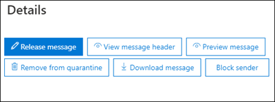

# <a name="quarantine-tags"></a>태그를 Quarantine tags

> [!NOTE]
> 이 문서에서 설명하는 기능은 현재 미리 보기로 제공되어 있으며 모든 사람이 사용할 수 있으며 변경될 수 있습니다.

EOP(Exchange Online Protection)에서 태그를 차단하면 관리자가 메시지가 메시지에 도착한 방법에 따라 사용자가 해당 메시지에 대해 할 수 있는 작업을 제어할 수 있습니다.

EOP는 일반적으로 메시지에 대한 특정 수준의 대화형 [작업(Quarantine](find-and-release-quarantined-messages-as-a-user.md) 및 최종 사용자 스팸 알림)을 허용하거나 [차단했습니다.](use-spam-notifications-to-release-and-report-quarantined-messages.md) 예를 들어 최종 사용자는 스팸 방지 필터링에 의해 스팸 또는 대량으로 검색된 메시지를 보고 해제할 수 있지만 높은 신뢰도 피싱으로 분류된 메시지를 보거나 해제할 수 없습니다.

[지원되는](#step-2-assign-a-quarantine-tag-to-supported-features)보호 기능의 경우, 태그는 최종 사용자 스팸 알림 메시지 및 사용자가 받는 사람인 메시지에 있는 자신의 스팸 알림 메시지에 대해 허용되는 작업을 지정합니다. 최종 사용자에게 전송된 메시지의 기록 기능을 적용하기 위해 기본 검역 태그가 자동으로 할당됩니다. 또는 최종 사용자가 메일로 전송된 메시지에 대해 특정 작업을 수행할 수 있도록 허용하거나 금지하는 사용자 지정 차단 태그를 만들고 할당할 수 있습니다.

개별 사용 권한은 미리 설정한 다음 사용 권한 그룹에 결합됩니다.

- 권한 없음
- 제한된 액세스
- 모든 액세스

사용 가능한 개별 사용 권한 및 미리 설정한 권한 그룹에 포함되거나 포함되지 않은 사용 권한에 대한 설명은 다음 표에 설명되어 있습니다.

|사용 권한|권한 없음|제한된 액세스|모든 액세스|
|---|:---:|:---:|:---:|
|**보낸 사람** _허용(PermissionToAllowSender)_||||
|**보낸 사람** _차단(PermissionToBlockSender)_||||
|**Delete(** _PermissionToDelete)_||||
|**Preview(** _PermissionToPreview)_||||
|받는 사람이 메시지를 **해제할** 수 있도록 _허용(PermissionToRelease)_||||
|**받는 사람이** 메시지를 검지에서 릴리스하도록 요청하도록 _허용(PermissionToRequestRelease)_||||
|

미리 설정한 사용 권한 그룹의 기본 사용 권한이 원하지 않는 경우 사용자 지정 검지 태그를 만들거나 수정할 때 사용자 지정 권한을 사용할 수 있습니다. 각 사용 권한의 작동에 대한 [](#quarantine-tag-permission-details) 자세한 내용은 이 문서 의 부분에 있는 태그 사용 권한 세부 정보 섹션을 참조하십시오.

보안 & 준수 센터 또는 PowerShell(Exchange Online 사서함이 있는 Microsoft 365 조직용 Exchange Online PowerShell, Exchange Online 사서함이 없는 EOP 조직의 독립 실행형 EOP PowerShell)에서 검역 태그를 만들고 할당합니다.

## <a name="what-do-you-need-to-know-before-you-begin"></a>시작하기 전에 알아야 할 내용은 무엇인가요?

- <https://protection.office.com/>에서 보안 및 준수 센터를 엽니다. **Quarantine 태그** 페이지로 직접 이동하기 위해 를 열고 <https://protection.office.com/quarantineTags> .

- Exchange Online PowerShell에 연결하려면 [Exchange Online PowerShell에 연결](https://docs.microsoft.com/powershell/exchange/connect-to-exchange-online-powershell)을 참조하세요. 독립 실행형 EOP PowerShell에 연결하려면 [Exchange Online Protection PowerShell에 연결](https://docs.microsoft.com/powershell/exchange/connect-to-exchange-online-protection-powershell)을 참조하세요.

- 분리 태그를 보거나 만들거나 수정하거나 제거하려면 보안 및 준수 센터에서 조직  관리 [또는 보안 관리자 역할의 & 합니다.](permissions-in-the-security-and-compliance-center.md) 

## <a name="step-1-create-quarantine-tags-in-the-security--compliance-center"></a>1단계: 보안 및 준수 센터에서 & 태그 만들기

1. 보안 & 준수 센터에서 **위협** 관리 정책으로 이동한 다음 태그를 \>  **선택합니다.**

2. **Quarantine tags(태그)** 페이지에서 사용자 지정 태그 **추가를 선택합니다.**

3. 새 **태그 마법사가** 열립니다. 태그 이름 **페이지에서** 태그 이름 필드에 간략하지만 고유한 **이름을 입력합니다.** 예정된 단계에서 이름으로 태그를 식별하고 선택해야 합니다. 작업을 마친 후 **다음** 을 클릭합니다.

4. 받는 사람 **메시지 액세스 페이지에서** 다음 값 중 하나를 선택합니다.
   - **액세스 금지**
   - **제한된 액세스**
   - **모든 액세스**

   이러한 사용 권한 그룹에 포함된 개별 사용 권한에 대한 설명은 이 문서 앞부분에 설명되어 있습니다.

   사용자 지정 권한을 지정하려면 특정 액세스 **설정(고급)을** 선택하고 다음 설정을 구성합니다.

     - **릴리스 작업 기본 설정 선택:** 다음 값 중 하나를 선택합니다.
       - **릴리스 작업 없음**: 이 값이 기본값입니다.
       - **받는 사람이 메시지를 해제할 수 있도록 허용**
       - **받는 사람이 메시지를 검지에서 릴리스하도록 요청하도록 허용**

     - **받는 사람이** 각기 다른 메시지에 대해 수행할 수 있는 추가 작업 선택: 다음 값을 일부 또는 모두 선택하거나 모두 선택하지 않습니다.
       - **삭제**
       - **미리 보기**
       - **보낸 사람 허용**
       - **보낸 사람 차단**

   이러한 사용 권한 및 이러한 사용 권한 및 최종 사용자 스팸 알림에 대한 [](#quarantine-tag-permission-details) 영향은 이 문서의 부분에 있는 태그 사용 권한 세부 정보 섹션에 설명되어 있습니다.

   작업을 마친 후 **다음** 을 클릭합니다.

5. 요약 **페이지가 나타나면** 설정을 검토합니다. 각 **설정에서** 편집을 클릭하여 수정할 수 있습니다.

   완료되면 제출을 **클릭합니다.**

6. 나타나는  확인 페이지에서 완료를 클릭합니다.

이제 [2단계](#step-2-assign-a-quarantine-tag-to-supported-features) 섹션에 설명된 바와 같이, Quarantine 태그를 Quarantine 기능에 할당할 준비가 완료되었습니다.

### <a name="create-quarantine-tags-in-powershell"></a>PowerShell에서 Quarantine 태그 만들기

PowerShell을 사용하여 검역 태그를 만드는 대신 Exchange Online PowerShell 또는 Exchange Online Protection PowerShell에 연결하고 **New-QuarantineTag** cmdlet을 사용하세요. 다음 두 가지 방법으로 선택할 수 있습니다.

- _EndUserQuarantinePermissionsValue_ 매개 변수를 사용합니다.
- _EndUserQuarantinePermissions 매개 변수를_ 사용합니다.

이러한 메서드에 대한 설명은 다음 섹션에 설명되어 있습니다.

#### <a name="use-the-enduserquarantinepermissionsvalue-parameter"></a>EndUserQuarantinePermissionsValue 매개 변수 사용

_EndUserQuarantinePermissionsValue_ 매개 변수를 사용하여 Quarantine 태그를 만들 경우 다음 구문을 사용합니다.

```powershell
New-QuarantineTag -Name "<UniqueName>" -EndUserQuarantinePermissionsValue <0 to 236>
```

_EndUserQuarantinePermissionsValue_ 매개 변수는 이진 값에서 변환된 10진수 값을 사용합니다. 이진 값은 특정 순서로 사용 가능한 최종 사용자별 사용 권한에 해당합니다. 각 사용 권한에 대해 값 1은 True와 값 0은 False입니다.

다음 표에서는 미리 설정한 사용 권한 그룹의 각 개별 권한에 대해 필요한 순서와 값을 제공합니다.

****

|사용 권한|권한 없음|제한된 액세스|모든 액세스|
|---|:---:|:---:|:---:|
|PermissionToAllowSender|0|0|1 |
|PermissionToBlockSender|0|1 |1 |
|PermissionToDelete|0|1 |1 |
|PermissionToDownload<sup>\*</sup>|0|0|0|
|PermissionToPreview|0|1 |1 |
|PermissionToRelease<sup>\*\*</sup>|0|0|1 |
|PermissionToRequestRelease<sup>\*\*</sup>|0|1 |0|
|PermissionToViewHeader<sup>\*</sup>|0|0|0|
|이진 값|00000000|01101010|11101100|
|사용할 10진수 값|0|106|236|

<sup>\*</sup> 현재 이 값은 항상 0입니다. PermissionToViewHeader의 경우 값 0은 해당  메시지의 세부 정보에서 메시지 헤더 보기 단추를 숨기지 않습니다(단추는 항상 사용 가능).

<sup>\*\*</sup> 이 두 값을 모두 1로 설정하지 않습니다. 1을 1로 설정하고 다른 하나는 0으로 설정하거나 둘 다 0으로 설정해야 합니다.

이 예제에서는 이전 표에 설명된 액세스 권한 없음 권한을 할당하는 새 Quarantine tag name NoAccess를 만듭니다.

```powershell
New-QuarantineTag -Name NoAccess -EndUserQuarantinePermissionsValue 0
```

제한된 액세스 권한의 경우 값 106을 사용 합니다. 모든 액세스 권한의 경우 값 236을 사용 합니다.

사용자 지정 권한의 경우 앞의 표를 사용하여 원하는 사용 권한에 해당하는 이진 값을 얻습니다. 이진 값을 10진수 값으로 변환하고 _EndUserQuarantinePermissionsValue_ 매개 변수에 10진수 값을 사용합니다.

구문과 매개 변수에 대한 자세한 내용은 [New-QuarantineTag를 참조하십시오.](https://docs.microsoft.com/powershell/module/exchange/new-quarantinetag)

#### <a name="use-the-enduserquarantinepermissions-parameter"></a>EndUserQuarantinePermissions 매개 변수 사용

_EndUserQuarantinePermissionsValue_ 매개 변수를 사용하여 Quarantine 태그를 만들 경우 다음 단계를 수행합니다.

대답. **New-QuarantinePermissions** cmdlet을 사용하여 변수에 Quarantine permissions 개체를 저장합니다.

<p>

B. **변수를 New-QuarantineTag** 명령에서 _EndUserQuarantinePermissions_ 값으로 사용 합니다.

##### <a name="step-a-store-a-quarantine-permissions-object-in-a-variable"></a>단계 A: 변수에 Quarantine permissions 개체 저장

다음 구문을 사용합니다.

```powershell
$<VariableName> = New-QuarantinePermissions [-PermissionToAllowSender <$true | $False>] [-PermissionToBlockSender <$true | $False>] [-PermissionToDelete <$true | $False>] [-PermissionToPreview <$true | $False>] [-PermissionToRelease <$true | $False>] [-PermissionToRequestRelease <$true | $False>]
```

사용되지 않는 매개 변수의 기본값은 을(를) 설정하려는 매개 변수만 사용할 수 있도록 하는 `$false` `$true` 것입니다.

다음 예에서는 미리 설정한 사용 권한 그룹에 해당하는 사용 권한 개체를 만드는 방법을 보여 주며,

- **액세스 권한이 없습니다.**

  ```powershell
  $NoAccess = New-QuarantinePermissions
  ```

- **제한된 액세스:**

  ```powershell
  $LimitedAccess = New-QuarantinePermissions -PermissionToBlockSender $true -PermissionToDelete $true -PermissionToPreview $true -PermissionToRequestRelease $true
  ```

- **모든 액세스:**

  ```powershell
  $FullAccess = New-QuarantinePermissions -PermissionToAllowSender $true -PermissionToBlockSender $true -PermissionToDelete $true -PermissionToPreview $true -PermissionToRelease $true
  ```

설정한 값을 표시하기 위해 변수 이름을 명령으로 실행합니다(예: 명령을 실행). `$NoAccess`

사용자 지정 권한의 경우 _PermissionToRelease_ 매개 변수와 _PermissionToRequestRelease_ 매개 변수를 모두 으로 설정하지 `$true` 않습니다. 하나를 다른 설정으로 설정하고 그대로 두거나 `$true` `$false` 둘 다 으로 떠날 수 `$false` 있습니다.

또한 만든 후 **Set-QuarantinePermissions** cmdlet을 사용하여 기존 사용 권한 개체 변수를 사용하기 전에 수정할 수도 있습니다.

구문과 매개 변수에 대한 자세한 내용은 [New-QuarantinePermissions](https://docs.microsoft.com/powershell/module/exchange/new-quarantinepermissions) 및 [Set-QuarantinePermissions를 참조하십시오.](https://docs.microsoft.com/powershell/module/exchange/set-quarantinepermissions)

##### <a name="step-b-use-the-variable-in-the-new-quarantinetag-command"></a>B단계: 명령줄에서 변수 New-QuarantineTag 사용

사용 권한 개체를 만들어 변수에 저장한 후 다음 **New-QuarantineTag** 명령에서 _EndUserQuarantinePermission_ 매개 변수 값에 대한 변수를 사용합니다.

```powershell
New-QuarantineTag -Name "<UniqueName>" -EndUserQuarantinePermissions $<VariableName>
```

이 예제에서는 이전 단계에서 설명하고 만든 사용 권한 개체를 사용하여 LimitedAccess라는 새 Quarantine `$LimitedAccess` 태그를 만듭니다.

```powershell
New-QuarantineTag -Name LimitedAccess -EndUserQuarantinePermissions $LimitedAccess
```

구문과 매개 변수에 대한 자세한 내용은 [New-QuarantineTag를 참조하십시오.](https://docs.microsoft.com/powershell/module/exchange/new-quarantinetag)

## <a name="step-2-assign-a-quarantine-tag-to-supported-features"></a>2단계: 지원되는 기능에 대해 Quarantine 태그 할당

메시지 _또는_ 파일을 자동으로 또는 구성 가능한 작업으로 차단하는 지원되는 보호 기능에서 사용 가능한 검역 작업에 검역 태그를 할당할 수 있습니다. 다음 표에서는 메시지를 검색하고 태그를 사용할 수 있는 기능에 대한 설명을 제공합니다.

****

|기능|태그를 Quarantine tags supported?|사용되는 기본 Quarantine 태그|
|---|:---:|---|
|[스팸 방지 정책:](configure-your-spam-filter-policies.md) <ul><li>**스팸(** _SpamAction)_</li><li>**높은 지수 스팸(** _HighConfidenceSpamAction)_</li><li>**피싱 전자** _메일(PhishSpamAction)_</li><li>**높은 신뢰도 피싱 전자** _메일(HighConfidencePhishAction)_</li><li>**대량 전자 메일(** _BulkSpamAction)_</li></ul>|예|<ul><li>DefaultSpamTag(모든 액세스)</li><li>DefaultHighConfSpamTag(모든 액세스)</li><li>DefaultPhishTag(모든 액세스)</li><li>DefaultHighConfPhishTag(액세스 없음)</li><li>DefaultBulkTag(모든 액세스)</li></ul>
|피싱 방지 정책: <ul><li>[스푸핑 인텔리전스](set-up-anti-phishing-policies.md#spoof-settings) _보호(AuthenticationFailAction)_</li><li>[가장 보호:](set-up-anti-phishing-policies.md#impersonation-settings-in-anti-phishing-policies-in-microsoft-defender-for-office-365)<sup>\*</sup> <ul><li>**가장된** 사용자가 전자 메일을 보낸 _경우(TargetedUserProtectionAction)_</li><li>**가장된** 도메인에서 전자 메일을 보낸 _경우(TargetedDomainProtectionAction)_</li><li>**사서함 인텔리전스** \> **가장된** 사용자가 전자 메일을 보낸 _경우(MailboxIntelligenceProtectionAction)_</li></ul></li></ul></ul>|아니요|해당 없음|
|[맬웨어 방지 정책:](configure-anti-malware-policies.md)검색된 모든 메시지는 항상 차단됩니다.|아니요|해당 없음|
|[SharePoint, OneDrive 및 Microsoft Teams에 대한 ATP](atp-for-spo-odb-and-teams.md)|아니요|해당 없음|
|[다음 작업을 사용하여](https://docs.microsoft.com/exchange/security-and-compliance/mail-flow-rules/mail-flow-rules) 메일 흐름 규칙(전송 규칙라고도 합니다.)  호스트된 검단(Quarantine)으로 메시지를 _배달합니다._|아니요|해당 없음|
|

<sup>\*</sup> 가장 보호 설정은 Office 365용 Microsoft Defender의 피싱 방지 정책에서만 사용할 수 있습니다.

기본 Quarantine 태그에서 제공하는 최종 사용자 권한이 만족스러우면 아무 것도 할 필요가 없습니다. 최종 사용자 스팸 알림 또는 메시지 세부 정보에서 최종 사용자 기능(사용 가능한 단추)을 사용자 지정하려는 경우 사용자 지정 차단 태그를 할당할 수 있습니다.

### <a name="assign-quarantine-tags-in-anti-spam-policies-in-the-security--compliance-center"></a>보안 및 준수 센터에서 스팸 방지 정책에 & 태그 할당

스팸 방지 정책을 만들고 수정하기 위한 전체 지침은 EOP에서 스팸 방지 정책 [구성에 설명되어 있습니다.](configure-your-spam-filter-policies.md)

1. 보안 & 준수 센터에서 **위협** 관리 정책으로 이동한 다음 스팸 \>  \> **방지를 선택합니다.** 또는 를 열 수 <https://protection.office.com/antispam> 있습니다.

2. 편집할 기존 스팸 방지 정책을 찾아 선택하거나 새 스팸 방지 정책을 만들 수 있습니다.

3. 정책 세부 정보 플라이아웃에서 스팸 및 대량 **작업 섹션을 확장합니다.**

4. 사용 가능한 스팸 필터링 판정의 동작에 대해 **Quarantine** 메시지를 선택한 경우 해당 판정에 대한 **Quarantine** 태그를 선택할 수 있도록 차단 정책 태그 적용 상자를 사용할 수 있습니다.

   **참고:** 새 정책을 만들 때 스팸 필터링 결과에 대한 빈 Quarantine 태그 값은 해당 결과에 대한 기본 Quarantine 태그가 사용됩니다. 나중에 정책을 편집하면 공백 값이 이전 표에 설명된 실제 기본 Quarantine 태그 이름으로 대체됩니다.

   

5. 작업을 마쳤으면 **저장** 을 클릭합니다.

#### <a name="assign-quarantine-tags-in-anti-spam-policies-in-powershell"></a>PowerShell에서 스팸 방지 정책에서 스팸 방지 태그 할당

PowerShell을 사용하여 스팸 방지 정책에서 스팸 방지 태그를 할당하는 대신 Exchange Online PowerShell 또는 Exchange Online Protection PowerShell에 연결하고 다음 구문을 사용하세요.

```powershell
<New-HostedContentFilterPolicy -Name "<Unique name>" | Set-HostedContentFilterPolicy -Identity "<Policy name>">  [-SpamAction Quarantine] [-SpamQuarantineTag <QuarantineTagName>] [-HighConfidenceSpamAction Quarantine] [-HighConfidenceSpamQuarantineTag <QuarantineTagName>] [-PhishSpamAction Quarantine] [-PhishQuarantineTag <QuarantineTagName>] [-HighConfidencePhishQuarantineTag <QuarantineTagName>] [-BulkSpamAction Quarantine] [-BulkQuarantineTag <QuarantineTagName>] ...
```

**참고**:

- _HighConfidencePhishAction_ 매개 변수의 기본값은 Quarantine이기 때문에 새로운 스팸 방지 정책에서 높은 신뢰도의 피싱 검색에 대해 Quarantine 작업을 설정할 필요가 없습니다. 새 스팸 방지 정책 또는 기존 스팸 방지 정책의 다른 모든 스팸 필터링 판정에 대해, 작업 값이 Quarantine인 경우만 스팸 필터링 태그가 적용됩니다. 기존 스팸 방지 정책의 작업 값을 표시하기 위해 다음 명령을 실행합니다.

  ```powershell
  Get-HostedContentFilterPolicy | Format-Table Name,*SpamAction,HighConfidencePhishAction
  ```

  Standard 및 Strict의 기본 작업 값 및 권장 작업 값에 대한 자세한 내용은 EOP 스팸 방지 정책 설정을 [참조하십시오.](recommended-settings-for-eop-and-office365-atp.md#eop-anti-spam-policy-settings)

- 해당하는 Quarantine 태그 매개 변수가 없는 스팸 필터링 판정은 해당 판정에 대한 기본 [Quarantine 태그가](#step-2-assign-a-quarantine-tag-to-supported-features) 사용됩니다.

  메일로 전송된 메시지에 대한 기본 최종 사용자 기능을 변경하려는 경우 기본 Quarantine 태그를 사용자 지정 Quarantine 태그로 바꾸기만하면 됩니다.

- PowerShell의 새 스팸 방지 정책에는 **New-HostedContentFilterPolicy** cmdlet을 사용하는 스팸 필터 정책(설정)과 **New-HostedContentFilterRule** cmdlet을 사용하는 새 스팸 필터 규칙(받는 사람 필터)이 필요합니다. 자세한 내용은 [PowerShell을](configure-your-spam-filter-policies.md#use-powershell-to-create-anti-spam-policies)사용하여 스팸 방지 정책 만들기를 참조하세요.

이 예에서는 다음 설정을 사용하여 Research Department라는 새 스팸 필터 정책을 만듭니다.

- 모든 스팸 필터링 판정에 대한 작업은 Quarantine으로 설정됩니다.
- 액세스 권한 없음을 할당하는 NoAccess라는  사용자 지정 Quarantine 태그는 기본적으로 액세스 권한 없음을 할당하지 않은 모든 기본 Quarantine 태그를 대체합니다. 

```powershell
New-HostedContentFilterPolicy -Name Research Department -SpamAction Quarantine -SpamQuarantineTag NoAccess -HighConfidenceSpamAction Quarantine -HighConfidenceSpamQuarantineTag NoAction -PhishSpamAction Quarantine -PhishQuarantineTag NoAction -BulkSpamAction Quarantine -BulkQuarantineTag NoAccess
```

자세한 구문 및 매개 변수 정보는 [New-HostedContentFilterPolicy](https://docs.microsoft.com/powershell/module/exchange/new-hostedcontentfilterpolicy)를 참조하세요.

이 예에서는 Human Resources라는 기존 스팸 필터 정책을 수정합니다. 스팸 차단 판정에 대한 작업은 Quarantine으로 설정되어 있으며 NoAccess라는 사용자 지정 Quarantine 태그가 할당됩니다.

```powershell
Set-HostedContentFilterPolicy -Identity "Human Resources" -SpamAction Quarantine -SpamQuarantineTag NoAccess
```

자세한 구문 및 매개 변수 정보는 [Set-HostedContentFilterPolicy](https://docs.microsoft.com/powershell/module/exchange/set-hostedcontentfilterpolicy)를 참조하세요.

## <a name="configure-global-quarantine-notification-settings-in-the-security--compliance-center"></a>보안 및 준수 센터에서 전역 & 설정 구성

각 태그에 대한 전역 설정을 사용하면 메시지를 받는 사람에게 전송되는 최종 사용자 스팸 알림을 사용자 지정할 수 있습니다. 이러한 알림에 대한 자세한 내용은 최종 사용자 스팸 [알림을 참조하세요.](use-spam-notifications-to-release-and-report-quarantined-messages.md)

1. 보안 & 준수 센터에서 **위협** 관리 정책으로 이동한 다음 태그를 \>  **선택합니다.**

2. **Quarantine tags(태그) 페이지에서** 전역 **설정을 선택합니다.**

3. 열 **수 있는 Quarantine notification settings** flyout, configure some or all of the following settings:

   - **회사 로고 사용:** 최종 사용자 스팸 알림의 맨 위에 있는 기본 Microsoft 로고를 대체하려면 이 옵션을 선택합니다. 이렇게 하기 전에 조직에서 사용자 지정 로고를 업로드할 수 있도록 [Microsoft 365](https://docs.microsoft.com/microsoft-365/admin/setup/customize-your-organization-theme) 테마 사용자 지정의 지침을 따라야 합니다.

     다음 스크린샷은 최종 사용자 스팸 알림의 사용자 지정 로고를 보여줍니다.

     

   - **언어 선택:** 최종 사용자 스팸 알림이 받는 사람의 언어 설정에 따라 이미 지역화되어 있습니다. 표시 이름 및 고지지 값에 대해 사용자 지정된 텍스트를 다른 언어로 **지정할 수** 있습니다. 

     첫 번째 언어 상자에서 언어를 하나 이상 선택하고 추가를 **클릭합니다.** 각 언어 다음에 추가를 클릭하여 여러 **언어를** 선택할 수 있습니다. 섹션 언어 상자에는 선택한 모든 언어가 표시됩니다.

     

   - **표시 이름:** 최종 사용자 스팸 알림에 사용되는 보낸 사람 표시 이름을 사용자 지정합니다.

     추가한 각 언어에 대해 두 번째 언어 상자에서 언어를 선택하고(X를 클릭하지 않습니다) 표시 이름 상자에 원하는 텍스트 값을 **입력합니다.**

     다음 스크린샷은 최종 사용자 스팸 알림의 사용자 지정된 표시 이름을 보여줍니다.

     

   - **고지 사항:** 최종 사용자 스팸 알림의 맨 아래에 사용자 지정 고지 사항 추가 지역화된 텍스트인 조직에서 고지 **사항:은** 항상 먼저 포함되는 다음에 지정한 텍스트가 포함됩니다.

     추가한 각 언어에 대해 두 번째 언어 상자에서 언어를 선택하고(X를 클릭하지 않습니다) 고지침 상자에 원하는 텍스트 값을 **입력합니다.**

     다음 스크린샷은 최종 사용자 스팸 알림의 사용자 지정 고지 사항입니다.

     

## <a name="view-quarantine-tags-in-the-security--compliance-center"></a>보안 및 준수 센터에서 & 태그 보기

1. 보안 & 준수 센터에서 **위협** 관리 정책으로 이동한 다음 태그를 \>  **선택합니다.**

- 기본 제공 또는 사용자 지정 Quarantine 태그의 설정을 확인하려면 목록에서 검사를 선택합니다(확인란을 선택하지는 않습니다).

- 전역 설정을 보시고 전역 설정을 **선택합니다.**

### <a name="view-quarantine-tags-in-powershell"></a>PowerShell에서 Quarantine 태그 보기

PowerShell을 사용하여 태그를 보지 않고 다음 단계를 수행합니다.

- 모든 기본 제공 태그 또는 사용자 지정 태그의 요약 목록을 표시하기 위해 다음 명령을 실행합니다.

  ```powershell
  Get-QuarantineTag | Format-Table Name
  ```

- 기본 제공 태그 또는 사용자 지정 Quarantine 태그의 설정을 보고, 해당 태그의 이름으로 바꾸고 다음 명령을 \<TagName\> 실행합니다.

  ```powershell
  Get-QuarantineTag -Identity "<TagName>"
  ```

- 전역 설정을 보시고 다음 명령을 실행합니다.

  ```powershell
  Get-QuarantineTag -QuarantineTagType GlobalQuarantineTag
  ```

자세한 구문 및 매개 변수 정보는 [Get-HostedContentFilterPolicy](https://docs.microsoft.com/powershell/module/exchange/get-hostedcontentfilterpolicy)를 참조하세요.

## <a name="remove-quarantine-tags-in-the-security--compliance-center"></a>보안 및 준수 센터에서 & 태그 제거

**참고**:

- 기본 제공 분리 태그는 제거할 수 없습니다.

- 사용자 지정 분리 태그를 제거하기 전에 해당 태그가 사용되지 않는지 확인해야 합니다. 예를 들어 PowerShell에서 다음 명령을 실행합니다.

  ```powershell
  Get-HostedContentFilterPolicy | Format-List Name,*QuarantineTag
  ```

  Quarantine 태그를 사용 중이면 해당 태그를 제거하기 전에 할당된 [분리](#step-2-assign-a-quarantine-tag-to-supported-features) 태그를 교체합니다.

1. 보안 & 준수 센터에서 **위협** 관리 정책으로 이동한 다음 태그를 \>  **선택합니다.**

2. **Quarantine tags(태그)** 페이지에서 제거할 사용자 지정 Quarantine 태그를 선택하고 삭제 태그를 **클릭합니다.**

3. 나타나는 **확인 대화** 상자에서 태그 제거를 클릭합니다.

### <a name="remove-quarantine-tags-in-powershell"></a>PowerShell에서 분리 태그 제거

PowerShell을 사용하여 사용자 지정 분리 태그를 제거하려면 해당 태그의 이름으로 바꾸고 다음 명령을 \<TagName\> 실행합니다.

```powershell
Remove-QuarantineTag -Identity "<TagName>"
```

구문과 매개 변수에 대한 자세한 내용은 [Remove-QuarantineTag 를 참조하십시오.](https://docs.microsoft.com/powershell/module/exchange/remove-quarantinetag)

## <a name="quarantine-tag-permission-details"></a>태그 사용 권한 세부 정보 확인

다음 섹션에서는 미리 설정한 사용 권한 그룹 및 개별 사용 권한의 영향에 대해 자세히 설명하고 최종 사용자 스팸 알림에 대해 설명합니다.

### <a name="preset-permissions-groups"></a>미리 설정한 사용 권한 그룹

미리 설정한 사용 권한 그룹에 포함된 개별 사용 권한은 이 문서의 시작부에 있는 표에 나와 있습니다.

#### <a name="no-access"></a>권한 없음

Quarantine 태그에 액세스 **권한** 없음(사용 권한 없음)을 할당하는 경우 사용자는 여전히 몇 가지 기준 기능을 사용할 수 있습니다.

- **Quarantined message details:** The **View message header** button is always available.

  

- **최종 사용자 스팸 알림:** 사용자를 메시지로 보내기 위한 검토 단추는 항상 사용할 수 있습니다. 

  

#### <a name="limited-access"></a>제한된 액세스

Quarantine 태그에 제한된  액세스 권한이 할당된 경우 사용자는 다음 기능을 사용할 수 있습니다.

- **Quarantined message details:** The following buttons are available:
  - **릴리스 요청**
  - **메시지 헤더 보기**
  - **메시지 미리 보기**
  - **보낸 사람 차단**
  - **Quarantine에서 제거**

  

- **최종 사용자 스팸 알림:** 다음 단추를 사용할 수 있습니다.
  - **보낸 사람 차단**
  - **검토**

  

#### <a name="full-access"></a>모든 액세스

Quarantine 태그에 모든  액세스 권한(사용 가능한 모든 사용 권한)이 할당된 경우 사용자는 다음 기능을 사용할 수 있습니다.

- **Quarantined message details:** The following buttons are available:
  - **릴리스 메시지**
  - **메시지 헤더 보기**
  - **메시지 미리 보기**
  - **보낸 사람 차단**
  - **보낸 사람 허용**
  - **Quarantine에서 제거**

  

- **최종 사용자 스팸 알림:** 다음 단추를 사용할 수 있습니다.
  - **보낸 사람 차단**
  - **릴리스**
  - **검토**

  

### <a name="individual-permissions"></a>개별 사용 권한

> [!NOTE]
> 사용자는 항상 액세스 금지 섹션에 설명된 [단추를 얻게](#no-access) 됩니다. 이러한 단추는 개별 사용 권한 설명에 포함되지 않습니다.

#### <a name="allow-sender-permission"></a>보낸 사람 권한 허용

보낸 **사람 허용** 권한(PermissionToAllowSender)은 사용자가 수신 허용 - 보낸 사람 목록에 메일로 보낸 메시지를 편리하게 추가할 수 있도록 단추에 대한 액세스를 제어합니다.

- **Quarantined message details**:
  - **보낸 사람 권한 허용** 사용: 보낸 **사람 허용** 단추를 사용할 수 있습니다.
  - **보낸 사람 권한을 허용하지** 않도록 설정: 보낸 사람 **허용** 단추를 사용할 수 없습니다.

- **최종 사용자 스팸 알림:** 효과가 없습니다.

수신 - 보낸 사람 목록에 대한 [](https://support.microsoft.com/office/274ae301-5db2-4aad-be21-25413cede077#__toc304379666) 자세한 내용은 신뢰할 수 있는 보낸 사람이 차단되지 않도록 방지 및 [Exchange Online PowerShell을](configure-junk-email-settings-on-exo-mailboxes.md#use-exchange-online-powershell-to-configure-the-safelist-collection-on-a-mailbox)사용하여 사서함에 수신 수신 목록 모음을 구성합니다.

#### <a name="block-sender-permission"></a>보낸 사람 권한 차단

차단 **보낸** 사람 _권한(PermissionToBlockSender)은_ 사용자가 차단된 메시지 보낸 사람 목록에 메일로 전송된 메시지를 편리하게 추가할 수 있도록 단추에 대한 액세스를 제어합니다.

- **Quarantined message details**:
  - **보낸 사람 권한 차단** 사용: 보낸 **사람 차단** 단추를 사용할 수 있습니다.
  - **보낸 사람 권한을** 차단할 수 없습니다. 보낸 **사람** 차단 단추를 사용할 수 없습니다.

- **최종 사용자 스팸 알림:**
  - **보낸 사람 권한을** 차단하지 않도록 설정: 보낸 **사람** 차단 단추를 사용할 수 없습니다.
  - **보낸 사람 권한 차단** 사용: 보낸 **사람 차단** 단추를 사용할 수 있습니다.

수신 차단된 보낸 사람 목록에 대한 [](https://support.microsoft.com/office/274ae301-5db2-4aad-be21-25413cede077#__toc304379667) 자세한 내용은 다른 사람의 메시지 차단 및 [Exchange Online PowerShell을](configure-junk-email-settings-on-exo-mailboxes.md#use-exchange-online-powershell-to-configure-the-safelist-collection-on-a-mailbox)사용하여 사서함에 수신 수신 목록 모음을 구성합니다.

#### <a name="delete-permission"></a>삭제 권한

삭제  _권한(PermissionToDelete)은_ 사용자가 자신의 메시지(사용자가 받는 사람인 메시지)를 Quarantine에서 삭제할 수 있는 기능을 제어합니다.

- **Quarantined message details**:
  - **삭제** 권한 사용: **분리에서** 제거 단추를 사용할 수 있습니다.
  - **삭제** 권한 사용 안함: **분리에서** 제거 단추를 사용할 수 없습니다.

- **최종 사용자 스팸 알림:** 효과가 없습니다.

#### <a name="preview-permission"></a>미리 보기 권한

미리 **보기** _권한(PermissionToPreview)은_ 사용자가 자신의 메시지를 미리 볼 수 있는 기능을 제어합니다.

- **Quarantined message details**:
  - **미리** 보기 사용 권한: **미리 보기 메시지** 단추를 사용할 수 있습니다.
  - **미리** 보기 권한이 사용되지 않도록 설정: 미리 보기 **메시지** 단추를 사용할 수 없습니다.

- **최종 사용자 스팸 알림:** 효과가 없습니다.

#### <a name="allow-recipients-to-release-a-message-from-quarantine-permission"></a>받는 사람이 메시지를 검지 권한에서 해제할 수 있도록 허용

받는 **사람이** 메시지를 검지 _권한(PermissionToRelease)에서_ 릴리스하도록 허용하면 사용자가 관리자의 승인 없이 직접 또는 해당 메시지를 해제할 수 있습니다.

- **Quarantined message details**:
  - 사용 권한 사용: **릴리스 메시지** 단추를 사용할 수 있습니다.
  - 사용 권한을 사용하지 않도록 설정: **메시지 해제** 단추를 사용할 수 없습니다.

- **최종 사용자 스팸 알림:**
  - 사용 권한 사용: **릴리스 단추를** 사용할 수 있습니다.
  - 사용 권한을 사용하지 않도록 설정: **해제** 단추를 사용할 수 없습니다.

#### <a name="allow-recipients-to-request-a-message-to-be-released-from-quarantine-permission"></a>받는 사람이 메시지를 메시지에 대한 확인 권한에서 릴리스하도록 허용

받는 **사람이** 메시지의 해제를 요청하도록 허용(PermissionToRequestRelease)는 사용자가 자신의 에지된  메시지 릴리스를 요청할 수 있는 기능을 제어합니다. 메시지는 관리자가 요청을 승인한 후에만 릴리스됩니다.

- **Quarantined message details**:
  - 사용 권한 사용: **릴리스 요청 단추를** 사용할 수 있습니다.
  - 사용 권한을 사용하지 않도록 설정: 릴리스 **요청** 단추를 사용할 수 없습니다.

- **최종 사용자 스팸 알림:** 릴리스 단추를 사용할 수 없습니다. 
