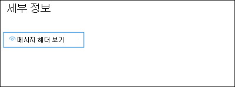

# <a name="quarantine-tags"></a><span data-ttu-id="87a04-103">태그를 Quarantine tags</span><span class="sxs-lookup"><span data-stu-id="87a04-103">Quarantine tags</span></span>

> [!NOTE]
> <span data-ttu-id="87a04-104">이 문서에서 설명하는 기능은 현재 미리 보기로 제공되어 있으며 모든 사람이 사용할 수 있으며 변경될 수 있습니다.</span><span class="sxs-lookup"><span data-stu-id="87a04-104">The features that are described in this article are currently in Preview, aren't available to everyone, and are subject to change.</span></span>

<span data-ttu-id="87a04-105">EOP(Exchange Online Protection)에서 태그를 검역하면 관리자가 메시지가 검역에 도착한 방법에 따라 사용자가 자신의 검역된 메시지에 대해 할 수 있는 작업을 제어할 수 있습니다.</span><span class="sxs-lookup"><span data-stu-id="87a04-105">Quarantine tags in Exchange Online Protection (EOP) allow admins to control what users are able to do to their quarantined messages based on how the message arrived in quarantine.</span></span>

<span data-ttu-id="87a04-106">EOP는 일반적으로 메시지에 대해 특정 수준의 대화형 작업 [](find-and-release-quarantined-messages-as-a-user.md) 수준을 허용하거나 차단하고 있으며, 이러한 대화형 작업 수준은 최종 사용자 스팸 [알림에서 허용되거나 차단되었습니다.](use-spam-notifications-to-release-and-report-quarantined-messages.md)</span><span class="sxs-lookup"><span data-stu-id="87a04-106">EOP has traditionally allowed or prevented certain levels of interactivity for messages in [quarantine](find-and-release-quarantined-messages-as-a-user.md) and in [end-user spam notifications](use-spam-notifications-to-release-and-report-quarantined-messages.md).</span></span> <span data-ttu-id="87a04-107">예를 들어 최종 사용자는 스팸 방지 필터링에 의해 스팸 또는 대량으로 검색된 메시지를 보고 해제할 수 있지만 높은 신뢰도 피싱으로 분류된 메시지를 보거나 해제할 수 없습니다.</span><span class="sxs-lookup"><span data-stu-id="87a04-107">For example, end-users can view and release messages that were quarantined by anti-spam filtering as spam or bulk, but they can't view or release messages that were quarantined as high confidence phishing.</span></span>

<span data-ttu-id="87a04-108">[지원되는](#step-2-assign-a-quarantine-tag-to-supported-features)보호 기능의 경우, 태그를 사용하여 최종 사용자 스팸 알림 메시지 및 사용자가 받는 사람인 메시지의 검역소에서 사용자가 할 수 있는 작업을 지정합니다.</span><span class="sxs-lookup"><span data-stu-id="87a04-108">For [supported protection features](#step-2-assign-a-quarantine-tag-to-supported-features), quarantine tags specify what users are allowed to do in end-user spam notification messages and in their quarantined messages in quarantine (messages where the user is a recipient).</span></span> <span data-ttu-id="87a04-109">기본 검역 태그는 최종 사용자에 대한 기록 기능을 검역된 메시지에 적용하기 위해 자동으로 할당됩니다.</span><span class="sxs-lookup"><span data-stu-id="87a04-109">Default quarantine tags are automatically assigned to enforce the historical capabilities for end-users on quarantined messages.</span></span> <span data-ttu-id="87a04-110">또는 최종 사용자가 분리된 메시지에 대해 특정 작업을 수행하도록 허용하거나 차단하기 위해 사용자 지정 검지 태그를 만들고 할당할 수 있습니다.</span><span class="sxs-lookup"><span data-stu-id="87a04-110">Or, you can create and assign custom quarantine tags to allow or prevent end-users from performing specific actions on quarantined messages.</span></span>

<span data-ttu-id="87a04-111">개별 사용 권한은 미리 설정한 다음 사용 권한 그룹에 결합됩니다.</span><span class="sxs-lookup"><span data-stu-id="87a04-111">The individual permissions are combined into the following preset permission groups:</span></span>

- <span data-ttu-id="87a04-112">권한 없음</span><span class="sxs-lookup"><span data-stu-id="87a04-112">No access</span></span>
- <span data-ttu-id="87a04-113">제한된 액세스</span><span class="sxs-lookup"><span data-stu-id="87a04-113">Limited access</span></span>
- <span data-ttu-id="87a04-114">모든 액세스</span><span class="sxs-lookup"><span data-stu-id="87a04-114">Full access</span></span>

<span data-ttu-id="87a04-115">사용 가능한 개별 사용 권한 및 미리 설정한 권한 그룹에 포함되거나 포함되지 않은 사용 권한에 대한 설명은 다음 표에 설명되어 있습니다.</span><span class="sxs-lookup"><span data-stu-id="87a04-115">The available individual permissions and what's included or not included in the preset permission groups are described in the following table:</span></span>

|<span data-ttu-id="87a04-116">사용 권한</span><span class="sxs-lookup"><span data-stu-id="87a04-116">Permission</span></span>|<span data-ttu-id="87a04-117">권한 없음</span><span class="sxs-lookup"><span data-stu-id="87a04-117">No access</span></span>|<span data-ttu-id="87a04-118">제한된 액세스</span><span class="sxs-lookup"><span data-stu-id="87a04-118">Limited access</span></span>|<span data-ttu-id="87a04-119">모든 액세스</span><span class="sxs-lookup"><span data-stu-id="87a04-119">Full access</span></span>|
|---|:---:|:---:|:---:|
|<span data-ttu-id="87a04-120">**보낸 사람 허용(** _PermissionToAllowSender_)</span><span class="sxs-lookup"><span data-stu-id="87a04-120">**Allow sender** (_PermissionToAllowSender_)</span></span>||||
|<span data-ttu-id="87a04-122">**보낸 사람 차단(** _PermissionToBlockSender_)</span><span class="sxs-lookup"><span data-stu-id="87a04-122">**Block sender** (_PermissionToBlockSender_)</span></span>||||
|<span data-ttu-id="87a04-125">**Delete(** _PermissionToDelete_)</span><span class="sxs-lookup"><span data-stu-id="87a04-125">**Delete** (_PermissionToDelete_)</span></span>||||
|<span data-ttu-id="87a04-128">**미리 보기(** _PermissionToPreview_)</span><span class="sxs-lookup"><span data-stu-id="87a04-128">**Preview** (_PermissionToPreview_)</span></span>||||
|<span data-ttu-id="87a04-131">받는 사람이 메시지를 **검지에서** 해제할 수 있도록 허용(_PermissionToRelease_)</span><span class="sxs-lookup"><span data-stu-id="87a04-131">**Allow recipients to release a message from quarantine** (_PermissionToRelease_)</span></span>||||
|<span data-ttu-id="87a04-133">받는 사람이 메시지를 검지에서 릴리스하도록 **요청하도록 허용(** _PermissionToRequestRelease_)</span><span class="sxs-lookup"><span data-stu-id="87a04-133">**Allow recipients to request a message to be released from quarantine** (_PermissionToRequestRelease_)</span></span>||||
|

<span data-ttu-id="87a04-135">미리 설정한 사용 권한 그룹의 기본 사용 권한이 원하지 않는 경우 사용자 지정 검지 태그를 만들거나 수정할 때 사용자 지정 권한을 사용할 수 있습니다.</span><span class="sxs-lookup"><span data-stu-id="87a04-135">If you don't like the default permissions in the preset permission groups, you can use custom permissions when you create or modify custom quarantine tags.</span></span> <span data-ttu-id="87a04-136">각 사용 권한의 작동에 대한 자세한 내용은 이 문서 의 부분에 있는 태그 사용 권한 세부 정보 [Quarantine tag permission details](#quarantine-tag-permission-details) 섹션을 참조하십시오.</span><span class="sxs-lookup"><span data-stu-id="87a04-136">For more information about what each permission does, see the [Quarantine tag permission details](#quarantine-tag-permission-details) section later in this article.</span></span>

<span data-ttu-id="87a04-137">보안 & 준수 센터 또는 PowerShell(Exchange Online 사서함이 있는 Microsoft 365 조직용 Exchange Online PowerShell, Exchange Online 사서함이 없는 EOP 조직의 독립 실행형 EOP PowerShell)에서 검역 태그를 만들고 할당합니다.</span><span class="sxs-lookup"><span data-stu-id="87a04-137">You create and assign quarantine tags in the Security & Compliance Center or in PowerShell (Exchange Online PowerShell for Microsoft 365 organizations with Exchange Online Mailboxes; standalone EOP PowerShell in EOP organizations without Exchange Online mailboxes).</span></span>

## <a name="what-do-you-need-to-know-before-you-begin"></a><span data-ttu-id="87a04-138">시작하기 전에 알아야 할 내용은 무엇인가요?</span><span class="sxs-lookup"><span data-stu-id="87a04-138">What do you need to know before you begin?</span></span>

- <span data-ttu-id="87a04-139"><https://protection.office.com/>에서 보안 및 준수 센터를 엽니다.</span><span class="sxs-lookup"><span data-stu-id="87a04-139">You open the Security & Compliance Center at <https://protection.office.com/>.</span></span> <span data-ttu-id="87a04-140">**Quarantine tags(태그)** 페이지로 직접 이동하기 위해 를 를 열 수 <https://protection.office.com/quarantineTags> 있습니다.</span><span class="sxs-lookup"><span data-stu-id="87a04-140">To go directly to the **Quarantine tags** page, open <https://protection.office.com/quarantineTags>.</span></span>

- <span data-ttu-id="87a04-141">Exchange Online PowerShell에 연결하려면 [Exchange Online PowerShell에 연결](/powershell/exchange/connect-to-exchange-online-powershell)을 참조하세요.</span><span class="sxs-lookup"><span data-stu-id="87a04-141">To connect to Exchange Online PowerShell, see [Connect to Exchange Online PowerShell](/powershell/exchange/connect-to-exchange-online-powershell).</span></span> <span data-ttu-id="87a04-142">독립 실행형 EOP PowerShell에 연결하려면 [Exchange Online Protection PowerShell에 연결](/powershell/exchange/connect-to-exchange-online-protection-powershell)을 참조하세요.</span><span class="sxs-lookup"><span data-stu-id="87a04-142">To connect to standalone EOP PowerShell, see [Connect to Exchange Online Protection PowerShell](/powershell/exchange/connect-to-exchange-online-protection-powershell).</span></span>

- <span data-ttu-id="87a04-143">검역 태그를 보거나 만들거나 수정하거나 제거하려면 보안 및 준수  센터에서  조직 관리 또는 [보안 관리자 역할의 구성원 & 합니다.](permissions-in-the-security-and-compliance-center.md)</span><span class="sxs-lookup"><span data-stu-id="87a04-143">To view, create, modify, or remove quarantine tags, you need to be a member of the **Organization Management** or **Security Administrator** roles in the [Security & Compliance Center](permissions-in-the-security-and-compliance-center.md).</span></span>

## <a name="step-1-create-quarantine-tags-in-the-security--compliance-center"></a><span data-ttu-id="87a04-144">1단계: 보안 및 준수 센터에서 & 태그 만들기</span><span class="sxs-lookup"><span data-stu-id="87a04-144">Step 1: Create quarantine tags in the Security & Compliance Center</span></span>

1. <span data-ttu-id="87a04-145">보안 및 & 센터에서 위협 관리  정책으로 이동한 다음 태그를 \>  **Quarantine(태그) 을 선택합니다.**</span><span class="sxs-lookup"><span data-stu-id="87a04-145">In the Security & Compliance Center, go to **Threat management** \> **Policy** and then select **Quarantine tags**.</span></span>

2. <span data-ttu-id="87a04-146">**Quarantine tags(태그) 페이지에서** Add custom tag(사용자 지정 태그 **추가)를 선택합니다.**</span><span class="sxs-lookup"><span data-stu-id="87a04-146">On the **Quarantine tags** page, select **Add custom tag**.</span></span>

3. <span data-ttu-id="87a04-147">새 **태그 마법사가** 열립니다.</span><span class="sxs-lookup"><span data-stu-id="87a04-147">The **New tag** wizard opens.</span></span> <span data-ttu-id="87a04-148">태그 **이름 페이지에서** 태그 이름 필드에 간략하지만 고유한 **이름을 입력합니다.**</span><span class="sxs-lookup"><span data-stu-id="87a04-148">On the **Tag name** page, enter a brief but unique name in the **Tag name** field.</span></span> <span data-ttu-id="87a04-149">다음 단계에서 이름으로 태그를 식별하고 선택해야 합니다.</span><span class="sxs-lookup"><span data-stu-id="87a04-149">You'll need to identify and select the tag by name in upcoming steps.</span></span> <span data-ttu-id="87a04-150">작업을 마친 후 **다음** 을 클릭합니다.</span><span class="sxs-lookup"><span data-stu-id="87a04-150">When you're finished, click **Next**.</span></span>

4. <span data-ttu-id="87a04-151">받는 **사람 메시지 액세스 페이지에서** 다음 값 중 하나를 선택합니다.</span><span class="sxs-lookup"><span data-stu-id="87a04-151">On the **Recipient message access** page, select one of the following values:</span></span>
   - <span data-ttu-id="87a04-152">**액세스 금지**</span><span class="sxs-lookup"><span data-stu-id="87a04-152">**No access**</span></span>
   - <span data-ttu-id="87a04-153">**제한된 액세스**</span><span class="sxs-lookup"><span data-stu-id="87a04-153">**Limited access**</span></span>
   - <span data-ttu-id="87a04-154">**모든 액세스**</span><span class="sxs-lookup"><span data-stu-id="87a04-154">**Full access**</span></span>

   <span data-ttu-id="87a04-155">이러한 사용 권한 그룹에 포함된 개별 사용 권한에 대한 설명은 이 문서 앞부분에 설명되어 있습니다.</span><span class="sxs-lookup"><span data-stu-id="87a04-155">The individual permissions that are included in these permission groups are described earlier in this article.</span></span>

   <span data-ttu-id="87a04-156">사용자 지정 권한을 지정하려면 특정 액세스 **설정(고급)을** 선택하고 다음 설정을 구성합니다.</span><span class="sxs-lookup"><span data-stu-id="87a04-156">To specify custom permissions, select **Set specific access (Advanced)** and configure the following settings:</span></span>

     - <span data-ttu-id="87a04-157">**릴리스 작업 기본 설정** 선택 : 다음 값 중 하나를 선택합니다.</span><span class="sxs-lookup"><span data-stu-id="87a04-157">**Select release action preference**: Select one of the following values:</span></span>
       - <span data-ttu-id="87a04-158">**릴리스 작업 없음:** 이 값은 기본값입니다.</span><span class="sxs-lookup"><span data-stu-id="87a04-158">**No release action**: This is the default value.</span></span>
       - <span data-ttu-id="87a04-159">**받는 사람이 메시지를 검지에서 해제할 수 있도록 허용**</span><span class="sxs-lookup"><span data-stu-id="87a04-159">**Allow recipients to release a message from quarantine**</span></span>
       - <span data-ttu-id="87a04-160">**받는 사람이 메시지를 검지에서 릴리스하도록 요청하도록 허용**</span><span class="sxs-lookup"><span data-stu-id="87a04-160">**Allow recipients to request a message to be released from quarantine**</span></span>

     - <span data-ttu-id="87a04-161">**받는 사람이** 다음의 값 중 일부 또는 전체를 선택하거나, 모두 또는 전혀 선택하지 않습니다.</span><span class="sxs-lookup"><span data-stu-id="87a04-161">**Select additional actions recipients can take on quarantined messages**: Select some, all, or none of the following values:</span></span>
       - <span data-ttu-id="87a04-162">**삭제**</span><span class="sxs-lookup"><span data-stu-id="87a04-162">**Delete**</span></span>
       - <span data-ttu-id="87a04-163">**Preview**</span><span class="sxs-lookup"><span data-stu-id="87a04-163">**Preview**</span></span>
       - <span data-ttu-id="87a04-164">**보낸 사람 허용**</span><span class="sxs-lookup"><span data-stu-id="87a04-164">**Allow sender**</span></span>
       - <span data-ttu-id="87a04-165">**보낸 사람 차단**</span><span class="sxs-lookup"><span data-stu-id="87a04-165">**Block sender**</span></span>

   <span data-ttu-id="87a04-166">이러한 사용 권한 및 이러한 사용 권한 및 최종 사용자 스팸 알림에 대한 [](#quarantine-tag-permission-details) 영향은 이 문서 부분의 태그 사용 권한 세부 정보 섹션에 설명되어 있습니다.</span><span class="sxs-lookup"><span data-stu-id="87a04-166">These permissions and their effect on quarantined messages and in end-user spam notifications are described in the [Quarantine tag permission details](#quarantine-tag-permission-details) section later in this article.</span></span>

   <span data-ttu-id="87a04-167">작업을 마친 후 **다음** 을 클릭합니다.</span><span class="sxs-lookup"><span data-stu-id="87a04-167">When you're finished, click **Next**.</span></span>

5. <span data-ttu-id="87a04-168">요약 **페이지가** 나타나면 설정을 검토합니다.</span><span class="sxs-lookup"><span data-stu-id="87a04-168">On the **Summary** page that appears, review your settings.</span></span> <span data-ttu-id="87a04-169">각 설정에서 **편집을** 클릭하여 수정할 수 있습니다.</span><span class="sxs-lookup"><span data-stu-id="87a04-169">You can click **Edit** on each setting to modify it.</span></span>

   <span data-ttu-id="87a04-170">완료되면 제출을 **클릭합니다.**</span><span class="sxs-lookup"><span data-stu-id="87a04-170">When you're finished, click **Submit**.</span></span>

6. <span data-ttu-id="87a04-171">나타나는  확인 페이지에서 완료를 클릭합니다.</span><span class="sxs-lookup"><span data-stu-id="87a04-171">Click **Done** on the confirmation page that appears.</span></span>

<span data-ttu-id="87a04-172">이제 [2단계](#step-2-assign-a-quarantine-tag-to-supported-features) 섹션에 설명된 바와 같이 검사 기능에 검지 태그를 할당할 준비가 완료되었습니다.</span><span class="sxs-lookup"><span data-stu-id="87a04-172">Now you are ready to assign the quarantine tag to a quarantine feature as described in the [Step 2](#step-2-assign-a-quarantine-tag-to-supported-features) section.</span></span>

### <a name="create-quarantine-tags-in-powershell"></a><span data-ttu-id="87a04-173">PowerShell에서 Quarantine 태그 만들기</span><span class="sxs-lookup"><span data-stu-id="87a04-173">Create quarantine tags in PowerShell</span></span>

<span data-ttu-id="87a04-174">PowerShell을 사용하여 검역 태그를 만들 경우 Exchange Online PowerShell 또는 Exchange Online Protection PowerShell에 연결하고 **New-QuarantineTag** cmdlet을 사용하세요.</span><span class="sxs-lookup"><span data-stu-id="87a04-174">If you'd rather use PowerShell to create quarantine tags, connect to Exchange Online PowerShell or Exchange Online Protection PowerShell and use the **New-QuarantineTag** cmdlet.</span></span> <span data-ttu-id="87a04-175">다음 두 가지 방법으로 선택할 수 있습니다.</span><span class="sxs-lookup"><span data-stu-id="87a04-175">You have two different methods to choose from:</span></span>

- <span data-ttu-id="87a04-176">_EndUserQuarantinePermissionsValue 매개 변수를_ 사용합니다.</span><span class="sxs-lookup"><span data-stu-id="87a04-176">Use the _EndUserQuarantinePermissionsValue_ parameter.</span></span>
- <span data-ttu-id="87a04-177">_EndUserQuarantinePermissions 매개 변수를_ 사용합니다.</span><span class="sxs-lookup"><span data-stu-id="87a04-177">Use the _EndUserQuarantinePermissions_ parameter.</span></span>

<span data-ttu-id="87a04-178">이러한 메서드에 대한 설명은 다음 섹션에 설명되어 있습니다.</span><span class="sxs-lookup"><span data-stu-id="87a04-178">These methods are described in the following sections.</span></span>

#### <a name="use-the-enduserquarantinepermissionsvalue-parameter"></a><span data-ttu-id="87a04-179">EndUserQuarantinePermissionsValue 매개 변수 사용</span><span class="sxs-lookup"><span data-stu-id="87a04-179">Use the EndUserQuarantinePermissionsValue parameter</span></span>

<span data-ttu-id="87a04-180">_EndUserQuarantinePermissionsValue_ 매개 변수를 사용하여 검지 태그를 만들 경우 다음 구문을 사용합니다.</span><span class="sxs-lookup"><span data-stu-id="87a04-180">To create a quarantine tag using the _EndUserQuarantinePermissionsValue_ parameter, use the following syntax:</span></span>

```powershell
New-QuarantineTag -Name "<UniqueName>" -EndUserQuarantinePermissionsValue <0 to 236>
```

<span data-ttu-id="87a04-181">_EndUserQuarantinePermissionsValue_ 매개 변수는 이진 값에서 변환된 소수 값을 사용합니다.</span><span class="sxs-lookup"><span data-stu-id="87a04-181">The _EndUserQuarantinePermissionsValue_ parameter uses a decimal value that's converted from a binary value.</span></span> <span data-ttu-id="87a04-182">이진 값은 특정 순서로 사용 가능한 최종 사용자 검지 권한에 해당합니다.</span><span class="sxs-lookup"><span data-stu-id="87a04-182">The binary value corresponds to the available end-user quarantine permissions in a specific order.</span></span> <span data-ttu-id="87a04-183">각 사용 권한에 대해 값 1은 True, 값 0은 False입니다.</span><span class="sxs-lookup"><span data-stu-id="87a04-183">For each permission, the value 1 equals True and the value 0 equals False.</span></span>

<span data-ttu-id="87a04-184">다음 표에서는 미리 설정한 사용 권한 그룹의 각 개별 권한에 필요한 순서와 값을 설명하고 있습니다.</span><span class="sxs-lookup"><span data-stu-id="87a04-184">The required order and values for each individual permission in preset permission groups are described in the following table:</span></span>

****

|<span data-ttu-id="87a04-185">사용 권한</span><span class="sxs-lookup"><span data-stu-id="87a04-185">Permission</span></span>|<span data-ttu-id="87a04-186">권한 없음</span><span class="sxs-lookup"><span data-stu-id="87a04-186">No access</span></span>|<span data-ttu-id="87a04-187">제한된 액세스</span><span class="sxs-lookup"><span data-stu-id="87a04-187">Limited access</span></span>|<span data-ttu-id="87a04-188">모든 액세스</span><span class="sxs-lookup"><span data-stu-id="87a04-188">Full access</span></span>|
|---|:---:|:---:|:---:|
|<span data-ttu-id="87a04-189">PermissionToAllowSender</span><span class="sxs-lookup"><span data-stu-id="87a04-189">PermissionToAllowSender</span></span>|<span data-ttu-id="87a04-190">0</span><span class="sxs-lookup"><span data-stu-id="87a04-190">0</span></span>|<span data-ttu-id="87a04-191">0</span><span class="sxs-lookup"><span data-stu-id="87a04-191">0</span></span>|<span data-ttu-id="87a04-192">1</span><span class="sxs-lookup"><span data-stu-id="87a04-192">1</span></span>|
|<span data-ttu-id="87a04-193">PermissionToBlockSender</span><span class="sxs-lookup"><span data-stu-id="87a04-193">PermissionToBlockSender</span></span>|<span data-ttu-id="87a04-194">0</span><span class="sxs-lookup"><span data-stu-id="87a04-194">0</span></span>|<span data-ttu-id="87a04-195">1</span><span class="sxs-lookup"><span data-stu-id="87a04-195">1</span></span>|<span data-ttu-id="87a04-196">1</span><span class="sxs-lookup"><span data-stu-id="87a04-196">1</span></span>|
|<span data-ttu-id="87a04-197">PermissionToDelete</span><span class="sxs-lookup"><span data-stu-id="87a04-197">PermissionToDelete</span></span>|<span data-ttu-id="87a04-198">0</span><span class="sxs-lookup"><span data-stu-id="87a04-198">0</span></span>|<span data-ttu-id="87a04-199">1</span><span class="sxs-lookup"><span data-stu-id="87a04-199">1</span></span>|<span data-ttu-id="87a04-200">1</span><span class="sxs-lookup"><span data-stu-id="87a04-200">1</span></span>|
|<span data-ttu-id="87a04-201">PermissionToDownload<sup>\*</sup></span><span class="sxs-lookup"><span data-stu-id="87a04-201">PermissionToDownload<sup>\*</sup></span></span>|<span data-ttu-id="87a04-202">0</span><span class="sxs-lookup"><span data-stu-id="87a04-202">0</span></span>|<span data-ttu-id="87a04-203">0</span><span class="sxs-lookup"><span data-stu-id="87a04-203">0</span></span>|<span data-ttu-id="87a04-204">0</span><span class="sxs-lookup"><span data-stu-id="87a04-204">0</span></span>|
|<span data-ttu-id="87a04-205">PermissionToPreview</span><span class="sxs-lookup"><span data-stu-id="87a04-205">PermissionToPreview</span></span>|<span data-ttu-id="87a04-206">0</span><span class="sxs-lookup"><span data-stu-id="87a04-206">0</span></span>|<span data-ttu-id="87a04-207">1</span><span class="sxs-lookup"><span data-stu-id="87a04-207">1</span></span>|<span data-ttu-id="87a04-208">1</span><span class="sxs-lookup"><span data-stu-id="87a04-208">1</span></span>|
|<span data-ttu-id="87a04-209">PermissionToRelease<sup>\*\*</sup></span><span class="sxs-lookup"><span data-stu-id="87a04-209">PermissionToRelease<sup>\*\*</sup></span></span>|<span data-ttu-id="87a04-210">0</span><span class="sxs-lookup"><span data-stu-id="87a04-210">0</span></span>|<span data-ttu-id="87a04-211">0</span><span class="sxs-lookup"><span data-stu-id="87a04-211">0</span></span>|<span data-ttu-id="87a04-212">1</span><span class="sxs-lookup"><span data-stu-id="87a04-212">1</span></span>|
|<span data-ttu-id="87a04-213">PermissionToRequestRelease<sup>\*\*</sup></span><span class="sxs-lookup"><span data-stu-id="87a04-213">PermissionToRequestRelease<sup>\*\*</sup></span></span>|<span data-ttu-id="87a04-214">0</span><span class="sxs-lookup"><span data-stu-id="87a04-214">0</span></span>|<span data-ttu-id="87a04-215">1</span><span class="sxs-lookup"><span data-stu-id="87a04-215">1</span></span>|<span data-ttu-id="87a04-216">0</span><span class="sxs-lookup"><span data-stu-id="87a04-216">0</span></span>|
|<span data-ttu-id="87a04-217">PermissionToViewHeader<sup>\*</sup></span><span class="sxs-lookup"><span data-stu-id="87a04-217">PermissionToViewHeader<sup>\*</sup></span></span>|<span data-ttu-id="87a04-218">0</span><span class="sxs-lookup"><span data-stu-id="87a04-218">0</span></span>|<span data-ttu-id="87a04-219">0</span><span class="sxs-lookup"><span data-stu-id="87a04-219">0</span></span>|<span data-ttu-id="87a04-220">0</span><span class="sxs-lookup"><span data-stu-id="87a04-220">0</span></span>|
|<span data-ttu-id="87a04-221">이진 값</span><span class="sxs-lookup"><span data-stu-id="87a04-221">Binary value</span></span>|<span data-ttu-id="87a04-222">00000000</span><span class="sxs-lookup"><span data-stu-id="87a04-222">00000000</span></span>|<span data-ttu-id="87a04-223">01101010</span><span class="sxs-lookup"><span data-stu-id="87a04-223">01101010</span></span>|<span data-ttu-id="87a04-224">11101100</span><span class="sxs-lookup"><span data-stu-id="87a04-224">11101100</span></span>|
|<span data-ttu-id="87a04-225">사용할 10진수 값</span><span class="sxs-lookup"><span data-stu-id="87a04-225">Decimal value to use</span></span>|<span data-ttu-id="87a04-226">0</span><span class="sxs-lookup"><span data-stu-id="87a04-226">0</span></span>|<span data-ttu-id="87a04-227">106</span><span class="sxs-lookup"><span data-stu-id="87a04-227">106</span></span>|<span data-ttu-id="87a04-228">236</span><span class="sxs-lookup"><span data-stu-id="87a04-228">236</span></span>|

<span data-ttu-id="87a04-229"><sup>\*</sup> 현재 이 값은 항상 0입니다.</span><span class="sxs-lookup"><span data-stu-id="87a04-229"><sup>\*</sup> Currently, this value is always 0.</span></span> <span data-ttu-id="87a04-230">PermissionToViewHeader의 경우 값 0은 분리된 메시지의 세부 정보에서 메시지 헤더 보기 단추를 숨기지 않습니다(단추는 항상 사용 가능). </span><span class="sxs-lookup"><span data-stu-id="87a04-230">For PermissionToViewHeader, the value 0 doesn't hide the **View message header** button in the details of the quarantined message (the button is always available).</span></span>

<span data-ttu-id="87a04-231"><sup>\*\*</sup> 이 두 값을 모두 1로 설정하지 않습니다.</span><span class="sxs-lookup"><span data-stu-id="87a04-231"><sup>\*\*</sup> Don't set both of these values to 1.</span></span> <span data-ttu-id="87a04-232">1을 1로 설정하고 다른 하나는 0으로 설정하거나 둘 다 0으로 설정합니다.</span><span class="sxs-lookup"><span data-stu-id="87a04-232">Set one to 1 and the other to 0, or set both to 0.</span></span>

<span data-ttu-id="87a04-233">이 예제에서는 이전 표에 설명된 바와 같이 액세스 권한 없음 권한을 할당하는 새 검지 태그 이름 NoAccess를 만듭니다.</span><span class="sxs-lookup"><span data-stu-id="87a04-233">This example creates a new quarantine tag name NoAccess that assigns the No access permissions as described in the previous table.</span></span>

```powershell
New-QuarantineTag -Name NoAccess -EndUserQuarantinePermissionsValue 0
```

<span data-ttu-id="87a04-234">제한된 액세스 권한의 경우 값 106을 사용 합니다.</span><span class="sxs-lookup"><span data-stu-id="87a04-234">For Limited access permissions, use the value 106.</span></span> <span data-ttu-id="87a04-235">모든 액세스 권한의 경우 값 236을 사용 합니다.</span><span class="sxs-lookup"><span data-stu-id="87a04-235">For Full access permissions, use the value 236.</span></span>

<span data-ttu-id="87a04-236">사용자 지정 권한의 경우 앞의 표를 사용하여 원하는 사용 권한에 해당하는 이진 값을 얻습니다.</span><span class="sxs-lookup"><span data-stu-id="87a04-236">For custom permissions, use the previous table to get the binary value that corresponds to the permissions you want.</span></span> <span data-ttu-id="87a04-237">이진 값을 10진수 값으로 변환하고 _EndUserQuarantinePermissionsValue_ 매개 변수에 소수 값을 사용합니다.</span><span class="sxs-lookup"><span data-stu-id="87a04-237">Convert the binary value to a decimal value and use the decimal value for the _EndUserQuarantinePermissionsValue_ parameter.</span></span>

<span data-ttu-id="87a04-238">구문과 매개 변수에 대한 자세한 내용은 [New-QuarantineTag 를 참조하십시오.](/powershell/module/exchange/new-quarantinetag)</span><span class="sxs-lookup"><span data-stu-id="87a04-238">For detailed syntax and parameter information, see [New-QuarantineTag](/powershell/module/exchange/new-quarantinetag).</span></span>

#### <a name="use-the-enduserquarantinepermissions-parameter"></a><span data-ttu-id="87a04-239">EndUserQuarantinePermissions 매개 변수 사용</span><span class="sxs-lookup"><span data-stu-id="87a04-239">Use the EndUserQuarantinePermissions parameter</span></span>

<span data-ttu-id="87a04-240">_EndUserQuarantinePermissionsValue_ 매개 변수를 사용하여 검지 태그를 만들 경우 다음 단계를 수행합니다.</span><span class="sxs-lookup"><span data-stu-id="87a04-240">To create a quarantine tag using the _EndUserQuarantinePermissionsValue_ parameter, do the following steps:</span></span>

<span data-ttu-id="87a04-241">대답.</span><span class="sxs-lookup"><span data-stu-id="87a04-241">A.</span></span> <span data-ttu-id="87a04-242">**New-QuarantinePermissions** cmdlet을 사용하여 변수에 quarantine permissions 개체를 저장합니다.</span><span class="sxs-lookup"><span data-stu-id="87a04-242">Store a quarantine permissions object in a variable using the **New-QuarantinePermissions** cmdlet.</span></span>

<p>

<span data-ttu-id="87a04-243">B.</span><span class="sxs-lookup"><span data-stu-id="87a04-243">B.</span></span> <span data-ttu-id="87a04-244">**변수를 New-QuarantineTag** 명령에서 _EndUserQuarantinePermissions_ 값으로 사용 합니다.</span><span class="sxs-lookup"><span data-stu-id="87a04-244">Use the variable as the _EndUserQuarantinePermissions_ value in the **New-QuarantineTag** command.</span></span>

##### <a name="step-a-store-a-quarantine-permissions-object-in-a-variable"></a><span data-ttu-id="87a04-245">A단계: 변수에 검지 권한 개체 저장</span><span class="sxs-lookup"><span data-stu-id="87a04-245">Step A: Store a quarantine permissions object in a variable</span></span>

<span data-ttu-id="87a04-246">다음 구문을 사용합니다.</span><span class="sxs-lookup"><span data-stu-id="87a04-246">Use the following syntax:</span></span>

```powershell
$<VariableName> = New-QuarantinePermissions [-PermissionToAllowSender <$true | $False>] [-PermissionToBlockSender <$true | $False>] [-PermissionToDelete <$true | $False>] [-PermissionToPreview <$true | $False>] [-PermissionToRelease <$true | $False>] [-PermissionToRequestRelease <$true | $False>]
```

<span data-ttu-id="87a04-247">사용되지 않는 매개 변수의 기본값은 입니다. 따라서 값을 설정하려는 매개 변수만 `$false` 사용하면 `$true` 됩니다.</span><span class="sxs-lookup"><span data-stu-id="87a04-247">The default value for any unused parameters is `$false`, so you only need to use the parameters where you want to set value to `$true`.</span></span>

<span data-ttu-id="87a04-248">다음 예에서는 미리 설정한 사용 권한 그룹에 해당하는 사용 권한 개체를 만드는 방법을 보여 주며,</span><span class="sxs-lookup"><span data-stu-id="87a04-248">The following examples show how to create permission objects that correspond to the preset permissions groups:</span></span>

- <span data-ttu-id="87a04-249">**액세스 권한이 없습니다.**</span><span class="sxs-lookup"><span data-stu-id="87a04-249">**No access**:</span></span>

  ```powershell
  $NoAccess = New-QuarantinePermissions
  ```

- <span data-ttu-id="87a04-250">**제한된 액세스**:</span><span class="sxs-lookup"><span data-stu-id="87a04-250">**Limited access**:</span></span>

  ```powershell
  $LimitedAccess = New-QuarantinePermissions -PermissionToBlockSender $true -PermissionToDelete $true -PermissionToPreview $true -PermissionToRequestRelease $true
  ```

- <span data-ttu-id="87a04-251">**모든 액세스**:</span><span class="sxs-lookup"><span data-stu-id="87a04-251">**Full access**:</span></span>

  ```powershell
  $FullAccess = New-QuarantinePermissions -PermissionToAllowSender $true -PermissionToBlockSender $true -PermissionToDelete $true -PermissionToPreview $true -PermissionToRelease $true
  ```

<span data-ttu-id="87a04-252">설정한 값을 표시하기 위해 변수 이름을 명령으로 실행합니다(예: 명령을 `$NoAccess` 실행).</span><span class="sxs-lookup"><span data-stu-id="87a04-252">To see the values that you've set, run the variable name as a command (for example, run the command `$NoAccess`).</span></span>

<span data-ttu-id="87a04-253">사용자 지정 권한의 경우 _PermissionToRelease_ 및 _PermissionToRequestRelease_ 매개 변수를 로 설정하지 `$true` 않습니다.</span><span class="sxs-lookup"><span data-stu-id="87a04-253">For custom permissions, don't set both the _PermissionToRelease_ and _PermissionToRequestRelease_ parameters to `$true`.</span></span> <span data-ttu-id="87a04-254">를 로 설정하고 다른 를 로 설정하거나 두 가지 모두 로 `$true` `$false` 를 그대로 . `$false`</span><span class="sxs-lookup"><span data-stu-id="87a04-254">Set one to `$true` and leave the other as `$false`, or leave both as `$false`.</span></span>

<span data-ttu-id="87a04-255">**Set-QuarantinePermissions** cmdlet을 사용하여 기존 사용 권한 개체 변수를 만든 후 사용하기 전에 수정할 수도 있습니다.</span><span class="sxs-lookup"><span data-stu-id="87a04-255">You can also modify an existing permissions object variable after you create but before you use it by using the **Set-QuarantinePermissions** cmdlet.</span></span>

<span data-ttu-id="87a04-256">구문과 매개 변수에 대한 자세한 내용은 [New-QuarantinePermissions](/powershell/module/exchange/new-quarantinepermissions) 및 [Set-QuarantinePermissions를 참조하십시오.](/powershell/module/exchange/set-quarantinepermissions)</span><span class="sxs-lookup"><span data-stu-id="87a04-256">For detailed syntax and parameter information, see [New-QuarantinePermissions](/powershell/module/exchange/new-quarantinepermissions) and [Set-QuarantinePermissions](/powershell/module/exchange/set-quarantinepermissions).</span></span>

##### <a name="step-b-use-the-variable-in-the-new-quarantinetag-command"></a><span data-ttu-id="87a04-257">B단계: 다음 명령에서 변수 New-QuarantineTag 사용</span><span class="sxs-lookup"><span data-stu-id="87a04-257">Step B: Use the variable in the New-QuarantineTag command</span></span>

<span data-ttu-id="87a04-258">사용 권한 개체를 만들어 변수에 저장한 후 다음 **New-QuarantineTag** 명령에서 _EndUserQuarantinePermission_ 매개 변수 값에 변수를 사용합니다.</span><span class="sxs-lookup"><span data-stu-id="87a04-258">After you've created and stored the permissions object in a variable, use the variable for the _EndUserQuarantinePermission_ parameter value in the following **New-QuarantineTag** command:</span></span>

```powershell
New-QuarantineTag -Name "<UniqueName>" -EndUserQuarantinePermissions $<VariableName>
```

<span data-ttu-id="87a04-259">이 예제에서는 이전 단계에서 설명하고 만든 permissions 개체를 사용하여 LimitedAccess라는 새 검지 `$LimitedAccess` 태그를 만듭니다.</span><span class="sxs-lookup"><span data-stu-id="87a04-259">This example creates a new quarantine tag named LimitedAccess using the `$LimitedAccess` permissions object that was described and created in the previous step.</span></span>

```powershell
New-QuarantineTag -Name LimitedAccess -EndUserQuarantinePermissions $LimitedAccess
```

<span data-ttu-id="87a04-260">구문과 매개 변수에 대한 자세한 내용은 [New-QuarantineTag 를 참조하십시오.](/powershell/module/exchange/new-quarantinetag)</span><span class="sxs-lookup"><span data-stu-id="87a04-260">For detailed syntax and parameter information, see [New-QuarantineTag](/powershell/module/exchange/new-quarantinetag).</span></span>

## <a name="step-2-assign-a-quarantine-tag-to-supported-features"></a><span data-ttu-id="87a04-261">2단계: 지원되는 기능에 검지 태그 할당</span><span class="sxs-lookup"><span data-stu-id="87a04-261">Step 2: Assign a quarantine tag to supported features</span></span>

<span data-ttu-id="87a04-262">메시지 _또는_ 파일을 자동으로 또는 구성 가능한 작업으로 검역하는 지원되는 보호 기능에서 사용 가능한 검역 작업에 검역 태그를 할당할 수 있습니다.</span><span class="sxs-lookup"><span data-stu-id="87a04-262">In _supported_ protection features that quarantine messages or files (automatically or as a configurable action), you can assign a quarantine tag to the available quarantine actions.</span></span> <span data-ttu-id="87a04-263">다음 표에는 메시지를 검사하는 기능과 검사 태그의 가용성이 설명되어 있습니다.</span><span class="sxs-lookup"><span data-stu-id="87a04-263">Features that quarantine messages and the availability of quarantine tags are described in the following table:</span></span>

****

|<span data-ttu-id="87a04-264">기능</span><span class="sxs-lookup"><span data-stu-id="87a04-264">Feature</span></span>|<span data-ttu-id="87a04-265">태그를 검사 지원하나요?</span><span class="sxs-lookup"><span data-stu-id="87a04-265">Quarantine tags supported?</span></span>|<span data-ttu-id="87a04-266">사용되는 기본 검지 태그</span><span class="sxs-lookup"><span data-stu-id="87a04-266">Default quarantine tags used</span></span>|
|---|:---:|---|
|<span data-ttu-id="87a04-267">[스팸 방지 정책](configure-your-spam-filter-policies.md):</span><span class="sxs-lookup"><span data-stu-id="87a04-267">[Anti-spam policies](configure-your-spam-filter-policies.md):</span></span> <ul><li><span data-ttu-id="87a04-268">**Spam(** _SpamAction_)</span><span class="sxs-lookup"><span data-stu-id="87a04-268">**Spam** (_SpamAction_)</span></span></li><li><span data-ttu-id="87a04-269">**높은 지수 스팸(** _HighConfidenceSpamAction_)</span><span class="sxs-lookup"><span data-stu-id="87a04-269">**High confidence spam** (_HighConfidenceSpamAction_)</span></span></li><li><span data-ttu-id="87a04-270">**피싱 전자 메일(** _PhishSpamAction_)</span><span class="sxs-lookup"><span data-stu-id="87a04-270">**Phishing email** (_PhishSpamAction_)</span></span></li><li><span data-ttu-id="87a04-271">**높은 신뢰도 피싱 전자 메일(** _HighConfidencePhishAction_)</span><span class="sxs-lookup"><span data-stu-id="87a04-271">**High confidence phishing email** (_HighConfidencePhishAction_)</span></span></li><li><span data-ttu-id="87a04-272">**대량 전자 메일(** _BulkSpamAction_)</span><span class="sxs-lookup"><span data-stu-id="87a04-272">**Bulk email** (_BulkSpamAction_)</span></span></li></ul>|<span data-ttu-id="87a04-273">예</span><span class="sxs-lookup"><span data-stu-id="87a04-273">Yes</span></span>|<ul><li><span data-ttu-id="87a04-274">DefaultSpamTag(모든 액세스)</span><span class="sxs-lookup"><span data-stu-id="87a04-274">DefaultSpamTag (Full access)</span></span></li><li><span data-ttu-id="87a04-275">DefaultHighConfSpamTag(모든 액세스)</span><span class="sxs-lookup"><span data-stu-id="87a04-275">DefaultHighConfSpamTag (Full access)</span></span></li><li><span data-ttu-id="87a04-276">DefaultPhishTag(모든 액세스)</span><span class="sxs-lookup"><span data-stu-id="87a04-276">DefaultPhishTag (Full access)</span></span></li><li><span data-ttu-id="87a04-277">DefaultHighConfPhishTag(액세스 없음)</span><span class="sxs-lookup"><span data-stu-id="87a04-277">DefaultHighConfPhishTag (No access)</span></span></li><li><span data-ttu-id="87a04-278">DefaultBulkTag(모든 액세스)</span><span class="sxs-lookup"><span data-stu-id="87a04-278">DefaultBulkTag (Full access)</span></span></li></ul>
|<span data-ttu-id="87a04-279">피싱 방지 정책:</span><span class="sxs-lookup"><span data-stu-id="87a04-279">Anti-phishing policies:</span></span> <ul><li><span data-ttu-id="87a04-280">[스푸핑 인텔리전스 보호(](set-up-anti-phishing-policies.md#spoof-settings) _AuthenticationFailAction_)</span><span class="sxs-lookup"><span data-stu-id="87a04-280">[Spoof intelligence protection](set-up-anti-phishing-policies.md#spoof-settings) (_AuthenticationFailAction_)</span></span></li><li><span data-ttu-id="87a04-281">[가장 보호](set-up-anti-phishing-policies.md#impersonation-settings-in-anti-phishing-policies-in-microsoft-defender-for-office-365):<sup>\*</sup></span><span class="sxs-lookup"><span data-stu-id="87a04-281">[Impersonation protection](set-up-anti-phishing-policies.md#impersonation-settings-in-anti-phishing-policies-in-microsoft-defender-for-office-365):<sup>\*</sup></span></span> <ul><li><span data-ttu-id="87a04-282">**가장된 사용자가** 전자 메일을 보낸 경우(_TargetedUserProtectionAction_)</span><span class="sxs-lookup"><span data-stu-id="87a04-282">**If email is sent by an impersonated user** (_TargetedUserProtectionAction_)</span></span></li><li><span data-ttu-id="87a04-283">**가장된** 도메인에서 전자 메일을 보낸 경우(_TargetedDomainProtectionAction_)</span><span class="sxs-lookup"><span data-stu-id="87a04-283">**If email is sent by an impersonated domain** (_TargetedDomainProtectionAction_)</span></span></li><li><span data-ttu-id="87a04-284">**사서함 인텔리전스** \> **가장된 사용자가** 전자 메일을 보낸 경우(_MailboxIntelligenceProtectionAction_)</span><span class="sxs-lookup"><span data-stu-id="87a04-284">**Mailbox intelligence** \> **If email is sent by an impersonated user** (_MailboxIntelligenceProtectionAction_)</span></span></li></ul></li></ul></ul>|<span data-ttu-id="87a04-285">아니요</span><span class="sxs-lookup"><span data-stu-id="87a04-285">No</span></span>|<span data-ttu-id="87a04-286">해당 없음</span><span class="sxs-lookup"><span data-stu-id="87a04-286">n/a</span></span>|
|<span data-ttu-id="87a04-287">[맬웨어 방지 정책:](configure-anti-malware-policies.md)검색된 모든 메시지는 항상 차단됩니다.</span><span class="sxs-lookup"><span data-stu-id="87a04-287">[Anti-malware policies](configure-anti-malware-policies.md): All detected messages are always quarantined.</span></span>|<span data-ttu-id="87a04-288">아니요</span><span class="sxs-lookup"><span data-stu-id="87a04-288">No</span></span>|<span data-ttu-id="87a04-289">해당 없음</span><span class="sxs-lookup"><span data-stu-id="87a04-289">n/a</span></span>|
|[<span data-ttu-id="87a04-290">SharePoint, OneDrive 및 Microsoft Teams용 안전한 첨부 파일</span><span class="sxs-lookup"><span data-stu-id="87a04-290">Safe Attachments for SharePoint, OneDrive, and Microsoft Teams</span></span>](mdo-for-spo-odb-and-teams.md)|<span data-ttu-id="87a04-291">아니요</span><span class="sxs-lookup"><span data-stu-id="87a04-291">No</span></span>|<span data-ttu-id="87a04-292">해당 없음</span><span class="sxs-lookup"><span data-stu-id="87a04-292">n/a</span></span>|
|<span data-ttu-id="87a04-293">[메일 흐름 규칙(전송](/exchange/security-and-compliance/mail-flow-rules/mail-flow-rules) 규칙)에 다음  작업을 수행하여 메시지를 호스팅된 검사(_Quarantine)로 배달합니다._</span><span class="sxs-lookup"><span data-stu-id="87a04-293">[Mail flow rules](/exchange/security-and-compliance/mail-flow-rules/mail-flow-rules) (also known as transport rules) with the action: **Deliver the message to the hosted quarantine** (_Quarantine_).</span></span>|<span data-ttu-id="87a04-294">아니요</span><span class="sxs-lookup"><span data-stu-id="87a04-294">No</span></span>|<span data-ttu-id="87a04-295">해당 없음</span><span class="sxs-lookup"><span data-stu-id="87a04-295">n/a</span></span>|
|

<span data-ttu-id="87a04-296"><sup>\*</sup> 가장 보호 설정은 Microsoft Defender for Office 365의 피싱 방지 정책에서만 사용할 수 있습니다.</span><span class="sxs-lookup"><span data-stu-id="87a04-296"><sup>\*</sup> Impersonation protection settings are available only in anti-phishing policies in Microsoft Defender for Office 365.</span></span>

<span data-ttu-id="87a04-297">기본 Quarantine 태그에서 제공하는 최종 사용자 권한이 만족스러우면 아무 것도 할 필요가 없습니다.</span><span class="sxs-lookup"><span data-stu-id="87a04-297">If you're happy with the end-user permissions that are provided by the default quarantine tags, you don't need to do anything.</span></span> <span data-ttu-id="87a04-298">최종 사용자 스팸 알림 또는 검지된 메시지 세부 정보에서 최종 사용자 기능(사용 가능한 단추)을 사용자 지정하려는 경우 사용자 지정 검지 태그를 할당할 수 있습니다.</span><span class="sxs-lookup"><span data-stu-id="87a04-298">If you want to customize the end-user capabilities (available buttons) in end-user spam notifications or in quarantined message details, you can assign a custom quarantine tag.</span></span>

### <a name="assign-quarantine-tags-in-anti-spam-policies-in-the-security--compliance-center"></a><span data-ttu-id="87a04-299">보안 및 준수 센터의 스팸 방지 정책에서 & 태그 할당</span><span class="sxs-lookup"><span data-stu-id="87a04-299">Assign quarantine tags in anti-spam policies in the Security & Compliance Center</span></span>

<span data-ttu-id="87a04-300">스팸 방지 정책을 만들고 수정하기 위한 전체 지침은 [EOP에서 스팸 방지 정책 구성에 설명되어 있습니다.](configure-your-spam-filter-policies.md)</span><span class="sxs-lookup"><span data-stu-id="87a04-300">Full instructions for creating and modifying anti-spam policies are described in [Configure anti-spam policies in EOP](configure-your-spam-filter-policies.md).</span></span>

1. <span data-ttu-id="87a04-301">보안 및 & 센터에서 위협 관리  정책으로 이동한 다음 \>  \> 스팸 방지 **를 선택합니다.**</span><span class="sxs-lookup"><span data-stu-id="87a04-301">In the Security & Compliance Center, go to **Threat management** \> **Policy** \> and then select **Anti-spam**.</span></span> <span data-ttu-id="87a04-302">또는 를 열 <https://protection.office.com/antispam> 수 있습니다.</span><span class="sxs-lookup"><span data-stu-id="87a04-302">Or, open <https://protection.office.com/antispam>.</span></span>

2. <span data-ttu-id="87a04-303">편집하거나 새 스팸 방지 정책을 만들 기존 스팸 방지 정책을 찾아 선택합니다.</span><span class="sxs-lookup"><span data-stu-id="87a04-303">Find and select an existing anti-spam policy to edit, or create a new anti-spam policy.</span></span>

3. <span data-ttu-id="87a04-304">정책 세부 정보 플라이아웃에서 스팸 및 대량 **작업 섹션을 확장합니다.**</span><span class="sxs-lookup"><span data-stu-id="87a04-304">In the policy details flyout, expand the **Spam and bulk actions** section.</span></span>

4. <span data-ttu-id="87a04-305">사용 가능한 스팸 필터링 판정의 동작에 대해 **Quarantine** message를 선택한 경우 해당 판정에 대한 **Quarantine 태그를** 선택할 수 있습니다.</span><span class="sxs-lookup"><span data-stu-id="87a04-305">If you've selected **Quarantine message** for the action of an available spam filtering verdict, the **Apply quarantine policy tag** box is available for you to select the quarantine tag for that verdict.</span></span>

   <span data-ttu-id="87a04-306">**참고:** 새 정책을 만들 때 스팸 필터링 결과에 대한 빈 Quarantine 태그 값은 해당 결과에 대한 기본 Quarantine 태그가 사용됩니다.</span><span class="sxs-lookup"><span data-stu-id="87a04-306">**Note**: When you create a new policy, a blank quarantine tag value for a spam filtering verdict indicates the default quarantine tag for that verdict is used.</span></span> <span data-ttu-id="87a04-307">나중에 정책을 편집하면 빈 값이 이전 표에 설명된 실제 기본 검지 태그 이름으로 대체됩니다.</span><span class="sxs-lookup"><span data-stu-id="87a04-307">When you later edit the policy, the blank values are replaced by the actual default quarantine tag names as described in the previous table.</span></span>

   

5. <span data-ttu-id="87a04-309">작업을 마친 후 **저장** 을 클릭합니다.</span><span class="sxs-lookup"><span data-stu-id="87a04-309">When you're finished, click **Save**.</span></span>

#### <a name="assign-quarantine-tags-in-anti-spam-policies-in-powershell"></a><span data-ttu-id="87a04-310">PowerShell에서 스팸 방지 정책에서 스팸 방지 태그 할당</span><span class="sxs-lookup"><span data-stu-id="87a04-310">Assign quarantine tags in anti-spam policies in PowerShell</span></span>

<span data-ttu-id="87a04-311">PowerShell을 사용하여 스팸 방지 정책에서 검역 태그를 할당할 경우 Exchange Online PowerShell 또는 Exchange Online Protection PowerShell에 연결하고 다음 구문을 사용하세요.</span><span class="sxs-lookup"><span data-stu-id="87a04-311">If you'd rather use PowerShell to assign quarantine tags in anti-spam policies, connect to Exchange Online PowerShell or Exchange Online Protection PowerShell and use the following syntax:</span></span>

```powershell
<New-HostedContentFilterPolicy -Name "<Unique name>" | Set-HostedContentFilterPolicy -Identity "<Policy name>">  [-SpamAction Quarantine] [-SpamQuarantineTag <QuarantineTagName>] [-HighConfidenceSpamAction Quarantine] [-HighConfidenceSpamQuarantineTag <QuarantineTagName>] [-PhishSpamAction Quarantine] [-PhishQuarantineTag <QuarantineTagName>] [-HighConfidencePhishQuarantineTag <QuarantineTagName>] [-BulkSpamAction Quarantine] [-BulkQuarantineTag <QuarantineTagName>] ...
```

<span data-ttu-id="87a04-312">**참고:**</span><span class="sxs-lookup"><span data-stu-id="87a04-312">**Notes**:</span></span>

- <span data-ttu-id="87a04-313">_HighConfidencePhishAction_ 매개 변수의 기본값은 Quarantine이기 때문에 새로운 스팸 방지 정책에서 높은 신뢰도의 피싱 검색에 대해 Quarantine 작업을 설정할 필요가 없습니다.</span><span class="sxs-lookup"><span data-stu-id="87a04-313">The default value for the _HighConfidencePhishAction_ parameter is Quarantine, so you don't need to set the Quarantine action for high confidence phishing detections in new anti-spam policies.</span></span> <span data-ttu-id="87a04-314">새 스팸 방지 정책 또는 기존 스팸 방지 정책의 다른 모든 스팸 필터링 판정에 대해, 작업 값이 Quarantine인 경우만 검지 태그가 적용됩니다.</span><span class="sxs-lookup"><span data-stu-id="87a04-314">For all other spam filtering verdicts in new or existing anti-spam policies, the quarantine tag is only effective if the action value is Quarantine.</span></span> <span data-ttu-id="87a04-315">기존 스팸 방지 정책의 작업 값을 표시하기 위해 다음 명령을 실행합니다.</span><span class="sxs-lookup"><span data-stu-id="87a04-315">To see the action values in existing anti-spam policies, run the following command:</span></span>

  ```powershell
  Get-HostedContentFilterPolicy | Format-Table Name,*SpamAction,HighConfidencePhishAction
  ```

  <span data-ttu-id="87a04-316">Standard 및 Strict의 기본 작업 값 및 권장 작업 값에 대한 자세한 내용은 EOP 스팸 방지 정책 [설정 을 참조하세요.](recommended-settings-for-eop-and-office365.md#eop-anti-spam-policy-settings)</span><span class="sxs-lookup"><span data-stu-id="87a04-316">For information about the default action values and the recommended action values for Standard and Strict, see [EOP anti-spam policy settings](recommended-settings-for-eop-and-office365.md#eop-anti-spam-policy-settings).</span></span>

- <span data-ttu-id="87a04-317">해당 quarantine 태그 매개 변수가 없는 스팸 필터링 판정은 해당 판정에 대한 기본 검지 [태그가](#step-2-assign-a-quarantine-tag-to-supported-features) 사용되는 것입니다.</span><span class="sxs-lookup"><span data-stu-id="87a04-317">A spam filtering verdict without a corresponding quarantine tag parameter means the [default quarantine tag](#step-2-assign-a-quarantine-tag-to-supported-features) for that verdict is used.</span></span>

  <span data-ttu-id="87a04-318">quarantined messages의 기본 최종 사용자 기능을 변경하려는 경우 기본 Quarantine 태그를 사용자 지정 Quarantine 태그로 바꾸기만하면 됩니다.</span><span class="sxs-lookup"><span data-stu-id="87a04-318">You only need to replace a default quarantine tag with a custom quarantine tag if you want to change the default end-user capabilities on quarantined messages.</span></span>

- <span data-ttu-id="87a04-319">PowerShell의 새 스팸 방지 정책에는 **New-HostedContentFilterPolicy** cmdlet을 사용하는 스팸 필터 정책(설정)과 **New-HostedContentFilterRule** cmdlet을 사용하는 새 스팸 필터 규칙(받는 사람 필터)이 필요합니다.</span><span class="sxs-lookup"><span data-stu-id="87a04-319">A new anti-spam policy in PowerShell requires a spam filter policy (settings) using the **New-HostedContentFilterPolicy** cmdlet and a new spam filter rule (recipient filters) using the **New-HostedContentFilterRule** cmdlet.</span></span> <span data-ttu-id="87a04-320">자세한 내용은 [PowerShell을 사용하여 스팸 방지 정책 만들기를 참조하세요.](configure-your-spam-filter-policies.md#use-powershell-to-create-anti-spam-policies)</span><span class="sxs-lookup"><span data-stu-id="87a04-320">For instructions, see [Use PowerShell to create anti-spam policies](configure-your-spam-filter-policies.md#use-powershell-to-create-anti-spam-policies).</span></span>

<span data-ttu-id="87a04-321">이 예에서는 다음 설정을 사용하여 Research Department라는 새 스팸 필터 정책을 만듭니다.</span><span class="sxs-lookup"><span data-stu-id="87a04-321">This example creates a new spam filter policy named Research Department with the following settings:</span></span>

- <span data-ttu-id="87a04-322">모든 스팸 필터링 판정에 대한 작업은 Quarantine으로 설정됩니다.</span><span class="sxs-lookup"><span data-stu-id="87a04-322">The action for all spam filtering verdicts is set to Quarantine.</span></span>
- <span data-ttu-id="87a04-323">액세스 권한 없음을 할당하는 NoAccess라는  사용자 지정 검지 태그는 기본적으로 액세스 권한 없음을  할당하지 않은 모든 기본 검지 태그를 대체합니다.</span><span class="sxs-lookup"><span data-stu-id="87a04-323">The custom quarantine tag named NoAccess that assigns **No access** permissions replaces any default quarantine tags that don't already assign **No access** permissions by default.</span></span>

```powershell
New-HostedContentFilterPolicy -Name Research Department -SpamAction Quarantine -SpamQuarantineTag NoAccess -HighConfidenceSpamAction Quarantine -HighConfidenceSpamQuarantineTag NoAction -PhishSpamAction Quarantine -PhishQuarantineTag NoAction -BulkSpamAction Quarantine -BulkQuarantineTag NoAccess
```

<span data-ttu-id="87a04-324">자세한 구문 및 매개 변수 정보는 [New-HostedContentFilterPolicy](/powershell/module/exchange/new-hostedcontentfilterpolicy)를 참조하세요.</span><span class="sxs-lookup"><span data-stu-id="87a04-324">For detailed syntax and parameter information, see [New-HostedContentFilterPolicy](/powershell/module/exchange/new-hostedcontentfilterpolicy).</span></span>

<span data-ttu-id="87a04-325">이 예에서는 Human Resources라는 기존 스팸 필터 정책을 수정합니다.</span><span class="sxs-lookup"><span data-stu-id="87a04-325">This example modifies the existing spam filter policy named Human Resources.</span></span> <span data-ttu-id="87a04-326">스팸 검지 판정에 대한 작업은 Quarantine으로 설정되어 있으며 NoAccess라는 사용자 지정 검지 태그가 할당됩니다.</span><span class="sxs-lookup"><span data-stu-id="87a04-326">The action for the spam quarantine verdict is set to Quarantine, and the custom quarantine tag named NoAccess is assigned.</span></span>

```powershell
Set-HostedContentFilterPolicy -Identity "Human Resources" -SpamAction Quarantine -SpamQuarantineTag NoAccess
```

<span data-ttu-id="87a04-327">자세한 구문 및 매개 변수 정보는 [Set-HostedContentFilterPolicy](/powershell/module/exchange/set-hostedcontentfilterpolicy)를 참조하세요.</span><span class="sxs-lookup"><span data-stu-id="87a04-327">For detailed syntax and parameter information, see [Set-HostedContentFilterPolicy](/powershell/module/exchange/set-hostedcontentfilterpolicy).</span></span>

## <a name="configure-global-quarantine-notification-settings-in-the-security--compliance-center"></a><span data-ttu-id="87a04-328">보안 및 준수 센터에서 전역 & 설정 구성</span><span class="sxs-lookup"><span data-stu-id="87a04-328">Configure global quarantine notification settings in the Security & Compliance Center</span></span>

<span data-ttu-id="87a04-329">태그에 대한 전역 설정을 사용하면 검사된 메시지의 받는 사람에게 전송되는 최종 사용자 스팸 알림을 사용자 지정할 수 있습니다.</span><span class="sxs-lookup"><span data-stu-id="87a04-329">The global settings for quarantine tags allow you to customize the end-user spam notifications that are sent to recipients of messages that were quarantined.</span></span> <span data-ttu-id="87a04-330">이러한 알림에 대한 자세한 내용은 최종 사용자 스팸 알림 [을 참조하세요.](use-spam-notifications-to-release-and-report-quarantined-messages.md)</span><span class="sxs-lookup"><span data-stu-id="87a04-330">For more information about these notifications, see [End-user spam notifications](use-spam-notifications-to-release-and-report-quarantined-messages.md).</span></span>

1. <span data-ttu-id="87a04-331">보안 및 & 센터에서 위협 관리  정책으로 이동한 다음 태그를 \>  **Quarantine(태그) 을 선택합니다.**</span><span class="sxs-lookup"><span data-stu-id="87a04-331">In the Security & Compliance Center, go to **Threat management** \> **Policy** and then select **Quarantine tags**.</span></span>

2. <span data-ttu-id="87a04-332">태그를 **Quarantine(태그) 페이지에서** **Global settings(전역 설정)를 선택합니다.**</span><span class="sxs-lookup"><span data-stu-id="87a04-332">On the **Quarantine tags** page, select **Global settings**.</span></span>

3. <span data-ttu-id="87a04-333">열 수 있는 **Quarantine notification settings** flyout에서 다음 설정의 일부 또는 전체를 구성합니다.</span><span class="sxs-lookup"><span data-stu-id="87a04-333">In the **Quarantine notification settings** flyout that opens, configure some or all of the following settings:</span></span>

   - <span data-ttu-id="87a04-334">**회사 로고 사용:** 최종 사용자 스팸 알림의 맨 위에 있는 기본 Microsoft 로고를 대체하려면 이 옵션을 선택합니다.</span><span class="sxs-lookup"><span data-stu-id="87a04-334">**Use my company logo**: Select this option to replace the default Microsoft logo that's use at the top of end-user spam notifications.</span></span> <span data-ttu-id="87a04-335">이 작업을 수행하기 전에 사용자 지정 로고를 업로드하려면 조직의 [Microsoft 365](../../admin/setup/customize-your-organization-theme.md) 테마 사용자 지정의 지침을 따라야 합니다.</span><span class="sxs-lookup"><span data-stu-id="87a04-335">Before you do this, you need to follow the instructions in [Customize the Microsoft 365 theme for your organization](../../admin/setup/customize-your-organization-theme.md) to upload your custom logo.</span></span>

     <span data-ttu-id="87a04-336">다음 스크린샷은 최종 사용자 스팸 알림의 사용자 지정 로고를 보여줍니다.</span><span class="sxs-lookup"><span data-stu-id="87a04-336">The following screenshot shows a custom logo in an end-user spam notification:</span></span>

     

   - <span data-ttu-id="87a04-338">**언어 선택:** 최종 사용자 스팸 알림은 받는 사람의 언어 설정에 따라 이미 지역화되어 있습니다.</span><span class="sxs-lookup"><span data-stu-id="87a04-338">**Choose language**: End-user spam notifications are already localized based on the recipient's language settings.</span></span> <span data-ttu-id="87a04-339">표시 이름 및 고지지 값에 대해 사용자 지정된 텍스트를 다른 언어로 지정할 **수** 있습니다. </span><span class="sxs-lookup"><span data-stu-id="87a04-339">You can specify customized text in different languages for the **Display name** and **Disclaimer** values.</span></span>

     <span data-ttu-id="87a04-340">첫 번째 언어 상자에서 언어를 하나 이상 선택하고 추가를 **클릭합니다.**</span><span class="sxs-lookup"><span data-stu-id="87a04-340">Select at least one language from the first language box and then click **Add**.</span></span> <span data-ttu-id="87a04-341">각 언어 다음에 추가를 클릭하여 여러 **언어를** 선택할 수 있습니다.</span><span class="sxs-lookup"><span data-stu-id="87a04-341">You can select multiple languages by clicking **Add** after each one.</span></span> <span data-ttu-id="87a04-342">섹션 언어 상자에는 선택한 모든 언어가 표시됩니다.</span><span class="sxs-lookup"><span data-stu-id="87a04-342">A section language box shows all of the languages that you've selected:</span></span>

     

   - <span data-ttu-id="87a04-344">**표시 이름:** 최종 사용자 스팸 알림에 사용되는 보낸 사람 표시 이름을 사용자 지정합니다.</span><span class="sxs-lookup"><span data-stu-id="87a04-344">**Display name**: Customize the sender's display name that's used in end-user spam notifications.</span></span>

     <span data-ttu-id="87a04-345">추가한 각 언어에 대해 두 번째 언어 상자에서 언어를 선택하고(X를 클릭하지 말고) 표시 이름 상자에 원하는 텍스트 값을 **입력합니다.**</span><span class="sxs-lookup"><span data-stu-id="87a04-345">For each language that you've added, select the language in the second language box (don't click on the X) and enter the text value you want in the **Display name** box.</span></span>

     <span data-ttu-id="87a04-346">다음 스크린샷은 최종 사용자 스팸 알림의 사용자 지정된 표시 이름을 보여줍니다.</span><span class="sxs-lookup"><span data-stu-id="87a04-346">The following screenshot shows the customized display name in an end-user spam notification:</span></span>

     

   - <span data-ttu-id="87a04-348">**고지 사항:** 최종 사용자 스팸 알림의 맨 아래에 사용자 지정 고지 사항 추가</span><span class="sxs-lookup"><span data-stu-id="87a04-348">**Disclaimer**: Add a custom disclaimer to the bottom of end-user spam notifications.</span></span> <span data-ttu-id="87a04-349">지역화된 텍스트인 조직의 고지 **사항:** 은 항상 먼저 포함되는 다음에 지정한 텍스트가 포함됩니다.</span><span class="sxs-lookup"><span data-stu-id="87a04-349">The localized text, **A disclaimer from your organization:** is always included first, followed by the text you specify.</span></span>

     <span data-ttu-id="87a04-350">추가한 각 언어에 대해 두 번째 언어 상자에서 언어를 선택하고(X를 클릭하지 말고) 고지지 상자에 원하는 텍스트 값을 **입력합니다.**</span><span class="sxs-lookup"><span data-stu-id="87a04-350">For each language that you've added, select the language in the second language box  (don't click the X) and enter the text value you want in the **Disclaimer** box.</span></span>

     <span data-ttu-id="87a04-351">다음 스크린샷은 최종 사용자 스팸 알림의 사용자 지정된 고지 사항입니다.</span><span class="sxs-lookup"><span data-stu-id="87a04-351">The following screenshot shows the customized disclaimer in an end-user spam notification:</span></span>

     

## <a name="view-quarantine-tags-in-the-security--compliance-center"></a><span data-ttu-id="87a04-353">보안 및 준수 센터에서 & 태그 보기</span><span class="sxs-lookup"><span data-stu-id="87a04-353">View quarantine tags in the Security & Compliance Center</span></span>

1. <span data-ttu-id="87a04-354">보안 및 & 센터에서 위협 관리  정책으로 이동한 다음 태그를 \>  **Quarantine(태그) 을 선택합니다.**</span><span class="sxs-lookup"><span data-stu-id="87a04-354">In the Security & Compliance Center, go to **Threat management** \> **Policy** and then select **Quarantine tags**.</span></span>

- <span data-ttu-id="87a04-355">기본 제공 태그 또는 사용자 지정 검사 태그의 설정을 확인하려면 목록에서 검지 태그를 선택합니다(확인란을 선택하지 않습니다).</span><span class="sxs-lookup"><span data-stu-id="87a04-355">To view the settings of built-in or custom quarantine tags, select the quarantine tag from the list (don't select the check box).</span></span>

- <span data-ttu-id="87a04-356">전역 설정을 보시고 전역 설정을 **선택합니다.**</span><span class="sxs-lookup"><span data-stu-id="87a04-356">To view the global settings, select **Global settings**</span></span>

### <a name="view-quarantine-tags-in-powershell"></a><span data-ttu-id="87a04-357">PowerShell에서 검사 태그 보기</span><span class="sxs-lookup"><span data-stu-id="87a04-357">View quarantine tags in PowerShell</span></span>

<span data-ttu-id="87a04-358">PowerShell을 사용하여 태그를 볼 수 있는 경우 다음 단계를 수행합니다.</span><span class="sxs-lookup"><span data-stu-id="87a04-358">If you'd rather use PowerShell to view quarantine tags, do any of the following steps:</span></span>

- <span data-ttu-id="87a04-359">모든 기본 제공 태그 또는 사용자 지정 태그의 요약 목록을 보기 위해 다음 명령을 실행합니다.</span><span class="sxs-lookup"><span data-stu-id="87a04-359">To view a summary list of all built-in or custom tags, run the following command:</span></span>

  ```powershell
  Get-QuarantineTag | Format-Table Name
  ```

- <span data-ttu-id="87a04-360">기본 제공 태그 또는 사용자 지정 검지 태그의 설정을 보거나, 을(를) Quarantine 태그의 이름으로 바꾸고 다음 명령을 \<TagName\> 실행합니다.</span><span class="sxs-lookup"><span data-stu-id="87a04-360">To view the settings of built-in or custom quarantine tags, replace \<TagName\> with the name of the quarantine tag, and run the following command:</span></span>

  ```powershell
  Get-QuarantineTag -Identity "<TagName>"
  ```

- <span data-ttu-id="87a04-361">전역 설정을 보기 위해 다음 명령을 실행합니다.</span><span class="sxs-lookup"><span data-stu-id="87a04-361">To view the global settings, run the following command:</span></span>

  ```powershell
  Get-QuarantineTag -QuarantineTagType GlobalQuarantineTag
  ```

<span data-ttu-id="87a04-362">자세한 구문 및 매개 변수 정보는 [Get-HostedContentFilterPolicy](/powershell/module/exchange/get-hostedcontentfilterpolicy)를 참조하세요.</span><span class="sxs-lookup"><span data-stu-id="87a04-362">For detailed syntax and parameter information, see [Get-HostedContentFilterPolicy](/powershell/module/exchange/get-hostedcontentfilterpolicy).</span></span>

## <a name="remove-quarantine-tags-in-the-security--compliance-center"></a><span data-ttu-id="87a04-363">보안 및 준수 센터에서 & 태그 제거</span><span class="sxs-lookup"><span data-stu-id="87a04-363">Remove quarantine tags in the Security & Compliance Center</span></span>

<span data-ttu-id="87a04-364">**참고:**</span><span class="sxs-lookup"><span data-stu-id="87a04-364">**Notes**:</span></span>

- <span data-ttu-id="87a04-365">기본 제공 분리 태그는 제거할 수 없습니다.</span><span class="sxs-lookup"><span data-stu-id="87a04-365">You can't remove built-in quarantine tags.</span></span>

- <span data-ttu-id="87a04-366">사용자 지정 분리 태그를 제거하기 전에 해당 태그가 사용되지 않는지 확인해야 합니다.</span><span class="sxs-lookup"><span data-stu-id="87a04-366">Before you remove a custom quarantine tag, verify that it's not being used.</span></span> <span data-ttu-id="87a04-367">예를 들어 PowerShell에서 다음 명령을 실행합니다.</span><span class="sxs-lookup"><span data-stu-id="87a04-367">For example, run the following command in PowerShell:</span></span>

  ```powershell
  Get-HostedContentFilterPolicy | Format-List Name,*QuarantineTag
  ```

  <span data-ttu-id="87a04-368">Quarantine 태그를 사용 중이면 할당된 검지 태그를 제거하기 전에 교체합니다. [](#step-2-assign-a-quarantine-tag-to-supported-features)</span><span class="sxs-lookup"><span data-stu-id="87a04-368">If the quarantine tag is being used, [replace the assigned quarantine tag](#step-2-assign-a-quarantine-tag-to-supported-features) before you remove it.</span></span>

1. <span data-ttu-id="87a04-369">보안 및 & 센터에서 위협 관리  정책으로 이동한 다음 태그를 \>  **Quarantine(태그) 을 선택합니다.**</span><span class="sxs-lookup"><span data-stu-id="87a04-369">In the Security & Compliance Center, go to **Threat management** \> **Policy** and then select **Quarantine tags**.</span></span>

2. <span data-ttu-id="87a04-370">태그를 **분리** 페이지에서 제거할 사용자 지정 검지 태그를 선택하고 태그 **삭제를 클릭합니다.**</span><span class="sxs-lookup"><span data-stu-id="87a04-370">On the **Quarantine tags** page, select the custom quarantine tag that you want to remove, and the click **Delete tag**.</span></span>

3. <span data-ttu-id="87a04-371">나타나는 **확인 대화** 상자에서 태그 제거를 클릭합니다.</span><span class="sxs-lookup"><span data-stu-id="87a04-371">Click **Remove tag** in the confirmation dialog that appears.</span></span>

### <a name="remove-quarantine-tags-in-powershell"></a><span data-ttu-id="87a04-372">PowerShell에서 Quarantine 태그 제거</span><span class="sxs-lookup"><span data-stu-id="87a04-372">Remove quarantine tags in PowerShell</span></span>

<span data-ttu-id="87a04-373">PowerShell을 사용하여 사용자 지정 검지 태그를 제거하려면 해당 태그의 이름으로 바꾸고 다음 명령을 \<TagName\> 실행합니다.</span><span class="sxs-lookup"><span data-stu-id="87a04-373">If you'd rather use PowerShell to remove a custom quarantine tag, replace \<TagName\> with the name of the quarantine tag, and run the following command:</span></span>

```powershell
Remove-QuarantineTag -Identity "<TagName>"
```

<span data-ttu-id="87a04-374">구문과 매개 변수에 대한 자세한 내용은 [Remove-QuarantineTag 를 참조하십시오.](/powershell/module/exchange/remove-quarantinetag)</span><span class="sxs-lookup"><span data-stu-id="87a04-374">For detailed syntax and parameter information, see [Remove-QuarantineTag](/powershell/module/exchange/remove-quarantinetag).</span></span>

## <a name="quarantine-tag-permission-details"></a><span data-ttu-id="87a04-375">태그 권한 세부 정보 Quarantine tag permission details</span><span class="sxs-lookup"><span data-stu-id="87a04-375">Quarantine tag permission details</span></span>

<span data-ttu-id="87a04-376">다음 섹션에서는 미리 설정한 사용 권한 그룹 및 개별 사용 권한의 영향에 대해 자세히 설명하고 최종 사용자 스팸 알림에 대해 설명합니다.</span><span class="sxs-lookup"><span data-stu-id="87a04-376">The following sections describe the effects of preset permission groups and individual permissions in the details of quarantined messages and in end-user spam notifications.</span></span>

### <a name="preset-permissions-groups"></a><span data-ttu-id="87a04-377">미리 설정 권한 그룹</span><span class="sxs-lookup"><span data-stu-id="87a04-377">Preset permissions groups</span></span>

<span data-ttu-id="87a04-378">미리 설정한 사용 권한 그룹에 포함된 개별 사용 권한은 이 문서의 시작부에 있는 표에 나와 있습니다.</span><span class="sxs-lookup"><span data-stu-id="87a04-378">The individual permissions that are included in preset permission groups are listed in the table at the beginning of this article.</span></span>

#### <a name="no-access"></a><span data-ttu-id="87a04-379">권한 없음</span><span class="sxs-lookup"><span data-stu-id="87a04-379">No access</span></span>

<span data-ttu-id="87a04-380">Quarantine 태그에 **액세스** 권한 없음(사용 권한 없음)이 할당된 경우 사용자는 여전히 몇 가지 기준 기능을 사용할 수 있습니다.</span><span class="sxs-lookup"><span data-stu-id="87a04-380">If the quarantine tag assigns the **No access** permissions (no permissions), users still get some baseline capabilities:</span></span>

- <span data-ttu-id="87a04-381">**Quarantined message details:** View **message header(메시지** 헤더 보기) 단추는 항상 사용할 수 있습니다.</span><span class="sxs-lookup"><span data-stu-id="87a04-381">**Quarantined message details**: The **View message header** button is always available.</span></span>

  

- <span data-ttu-id="87a04-383">**최종 사용자 스팸 알림:** 사용자를 메시지로 전송하는 검토 단추는 항상 사용할 수 있습니다. </span><span class="sxs-lookup"><span data-stu-id="87a04-383">**End-user spam notifications**: The **Review** button that takes the user to the message in quarantine is always available.</span></span>

  

#### <a name="limited-access"></a><span data-ttu-id="87a04-385">제한된 액세스</span><span class="sxs-lookup"><span data-stu-id="87a04-385">Limited access</span></span>

<span data-ttu-id="87a04-386">Quarantine 태그에 **제한된** 액세스 권한이 할당된 경우 사용자는 다음 기능을 사용할 수 있습니다.</span><span class="sxs-lookup"><span data-stu-id="87a04-386">If the quarantine tag assigns the **Limited access** permissions, users get the following capabilities:</span></span>

- <span data-ttu-id="87a04-387">**Quarantined message details:** 다음 단추를 사용할 수 있습니다.</span><span class="sxs-lookup"><span data-stu-id="87a04-387">**Quarantined message details**: The following buttons are available:</span></span>
  - <span data-ttu-id="87a04-388">**릴리스 요청**</span><span class="sxs-lookup"><span data-stu-id="87a04-388">**Request release**</span></span>
  - <span data-ttu-id="87a04-389">**메시지 헤더 보기**</span><span class="sxs-lookup"><span data-stu-id="87a04-389">**View message header**</span></span>
  - <span data-ttu-id="87a04-390">**메시지 미리 보기**</span><span class="sxs-lookup"><span data-stu-id="87a04-390">**Preview message**</span></span>
  - <span data-ttu-id="87a04-391">**보낸 사람 차단**</span><span class="sxs-lookup"><span data-stu-id="87a04-391">**Block sender**</span></span>
  - <span data-ttu-id="87a04-392">**Quarantine에서 제거**</span><span class="sxs-lookup"><span data-stu-id="87a04-392">**Remove from quarantine**</span></span>

  

- <span data-ttu-id="87a04-394">**최종 사용자 스팸 알림:** 다음 단추를 사용할 수 있습니다.</span><span class="sxs-lookup"><span data-stu-id="87a04-394">**End-user spam notifications**: The following buttons are available:</span></span>
  - <span data-ttu-id="87a04-395">**보낸 사람 차단**</span><span class="sxs-lookup"><span data-stu-id="87a04-395">**Block sender**</span></span>
  - <span data-ttu-id="87a04-396">**검토**</span><span class="sxs-lookup"><span data-stu-id="87a04-396">**Review**</span></span>

  

#### <a name="full-access"></a><span data-ttu-id="87a04-398">모든 액세스</span><span class="sxs-lookup"><span data-stu-id="87a04-398">Full access</span></span>

<span data-ttu-id="87a04-399">Quarantine 태그에 모든  액세스 권한(사용 가능한 모든 사용 권한)이 할당된 경우 사용자는 다음 기능을 사용할 수 있습니다.</span><span class="sxs-lookup"><span data-stu-id="87a04-399">If the quarantine tag assigns the **Full access** permissions (all available permissions), users get the following capabilities:</span></span>

- <span data-ttu-id="87a04-400">**Quarantined message details:** 다음 단추를 사용할 수 있습니다.</span><span class="sxs-lookup"><span data-stu-id="87a04-400">**Quarantined message details**: The following buttons are available:</span></span>
  - <span data-ttu-id="87a04-401">**릴리스 메시지**</span><span class="sxs-lookup"><span data-stu-id="87a04-401">**Release message**</span></span>
  - <span data-ttu-id="87a04-402">**메시지 헤더 보기**</span><span class="sxs-lookup"><span data-stu-id="87a04-402">**View message header**</span></span>
  - <span data-ttu-id="87a04-403">**메시지 미리 보기**</span><span class="sxs-lookup"><span data-stu-id="87a04-403">**Preview message**</span></span>
  - <span data-ttu-id="87a04-404">**보낸 사람 차단**</span><span class="sxs-lookup"><span data-stu-id="87a04-404">**Block sender**</span></span>
  - <span data-ttu-id="87a04-405">**보낸 사람 허용**</span><span class="sxs-lookup"><span data-stu-id="87a04-405">**Allow sender**</span></span>
  - <span data-ttu-id="87a04-406">**Quarantine에서 제거**</span><span class="sxs-lookup"><span data-stu-id="87a04-406">**Remove from quarantine**</span></span>

  

- <span data-ttu-id="87a04-408">**최종 사용자 스팸 알림:** 다음 단추를 사용할 수 있습니다.</span><span class="sxs-lookup"><span data-stu-id="87a04-408">**End-user spam notifications**: The following buttons are available:</span></span>
  - <span data-ttu-id="87a04-409">**보낸 사람 차단**</span><span class="sxs-lookup"><span data-stu-id="87a04-409">**Block sender**</span></span>
  - <span data-ttu-id="87a04-410">**릴리스**</span><span class="sxs-lookup"><span data-stu-id="87a04-410">**Release**</span></span>
  - <span data-ttu-id="87a04-411">**검토**</span><span class="sxs-lookup"><span data-stu-id="87a04-411">**Review**</span></span>

  

### <a name="individual-permissions"></a><span data-ttu-id="87a04-413">개별 사용 권한</span><span class="sxs-lookup"><span data-stu-id="87a04-413">Individual permissions</span></span>

> [!NOTE]
> <span data-ttu-id="87a04-414">사용자는 액세스 금지 섹션에 설명된 단추를 항상 [얻게](#no-access) 됩니다.</span><span class="sxs-lookup"><span data-stu-id="87a04-414">Remember, users always get the buttons described in the [No access](#no-access) section.</span></span> <span data-ttu-id="87a04-415">이러한 단추는 개별 사용 권한 설명에 포함되지 않습니다.</span><span class="sxs-lookup"><span data-stu-id="87a04-415">These buttons are not included in the individual permission descriptions.</span></span>

#### <a name="allow-sender-permission"></a><span data-ttu-id="87a04-416">보낸 사람 권한 허용</span><span class="sxs-lookup"><span data-stu-id="87a04-416">Allow sender permission</span></span>

<span data-ttu-id="87a04-417">보낸 **사람 허용** 권한(_PermissionToAllowSender)은_ 사용자가 Quarantined message sender를 수신 허용 - 보낸 사람 목록에 편리하게 추가할 수 있도록 단추에 대한 액세스를 제어합니다.</span><span class="sxs-lookup"><span data-stu-id="87a04-417">The **Allow sender** permission (_PermissionToAllowSender_) controls access to the button that allows users to conveniently add the quarantined message sender to their Safe Senders list.</span></span>

- <span data-ttu-id="87a04-418">**Quarantined message details**:</span><span class="sxs-lookup"><span data-stu-id="87a04-418">**Quarantined message details**:</span></span>
  - <span data-ttu-id="87a04-419">**보낸 사람 권한 허용** 사용: 보낸 **사람 허용** 단추를 사용할 수 있습니다.</span><span class="sxs-lookup"><span data-stu-id="87a04-419">**Allow sender** permission enabled: The **Allow sender** button is available.</span></span>
  - <span data-ttu-id="87a04-420">**보낸 사람 권한 허용** 사용 안 하도록 설정: 보낸 **사람 허용** 단추를 사용할 수 없습니다.</span><span class="sxs-lookup"><span data-stu-id="87a04-420">**Allow sender** permission disabled: The **Allow sender** button is not available.</span></span>

- <span data-ttu-id="87a04-421">**최종 사용자 스팸 알림:** 효과가 없습니다.</span><span class="sxs-lookup"><span data-stu-id="87a04-421">**End-user spam notifications**: No effect.</span></span>

<span data-ttu-id="87a04-422">수신-보낸 사람 목록에 대한 자세한 [](https://support.microsoft.com/office/274ae301-5db2-4aad-be21-25413cede077#__toc304379666) 내용은 신뢰할 수 있는 보낸 사람이 차단되지 않도록 방지 및 [Exchange Online PowerShell을](configure-junk-email-settings-on-exo-mailboxes.md#use-exchange-online-powershell-to-configure-the-safelist-collection-on-a-mailbox)사용하여 사서함에 수신 목록 모음 구성을 참조하세요.</span><span class="sxs-lookup"><span data-stu-id="87a04-422">For more information about the Safe Senders list, see [Prevent trusted senders from being blocked](https://support.microsoft.com/office/274ae301-5db2-4aad-be21-25413cede077#__toc304379666) and [Use Exchange Online PowerShell to configure the safelist collection on a mailbox](configure-junk-email-settings-on-exo-mailboxes.md#use-exchange-online-powershell-to-configure-the-safelist-collection-on-a-mailbox).</span></span>

#### <a name="block-sender-permission"></a><span data-ttu-id="87a04-423">보낸 사람 권한 차단</span><span class="sxs-lookup"><span data-stu-id="87a04-423">Block sender permission</span></span>

<span data-ttu-id="87a04-424">보낸 **사람 차단** 권한(_PermissionToBlockSender)은_ 사용자가 차단된 메시지 보낸 사람 목록에 편리하게 메시지 보낸 사람 목록을 추가할 수 있도록 단추에 대한 액세스를 제어합니다.</span><span class="sxs-lookup"><span data-stu-id="87a04-424">The **Block sender** permission (_PermissionToBlockSender_) controls access to the button that allows users to conveniently add the quarantined message sender to their Blocked Senders list.</span></span>

- <span data-ttu-id="87a04-425">**Quarantined message details**:</span><span class="sxs-lookup"><span data-stu-id="87a04-425">**Quarantined message details**:</span></span>
  - <span data-ttu-id="87a04-426">**보낸 사람 권한 차단** 사용: 보낸 **사람 차단** 단추를 사용할 수 있습니다.</span><span class="sxs-lookup"><span data-stu-id="87a04-426">**Block sender** permission enabled: The **Block sender** button is available.</span></span>
  - <span data-ttu-id="87a04-427">**보낸 사람 사용** 권한 차단 사용 안 하세요: 보낸 **사람** 차단 단추를 사용할 수 없습니다.</span><span class="sxs-lookup"><span data-stu-id="87a04-427">**Block sender** permission disabled: The **Block sender** button is not available.</span></span>

- <span data-ttu-id="87a04-428">**최종 사용자 스팸 알림**:</span><span class="sxs-lookup"><span data-stu-id="87a04-428">**End-user spam notifications**:</span></span>
  - <span data-ttu-id="87a04-429">**보낸 사람 사용** 권한 차단 사용 안 하세요: 보낸 **사람** 차단 단추를 사용할 수 없습니다.</span><span class="sxs-lookup"><span data-stu-id="87a04-429">**Block sender** permission disabled: The **Block sender** button is not available.</span></span>
  - <span data-ttu-id="87a04-430">**보낸 사람 권한 차단** 사용: 보낸 **사람 차단** 단추를 사용할 수 있습니다.</span><span class="sxs-lookup"><span data-stu-id="87a04-430">**Block sender** permission enabled: The **Block sender** button is available.</span></span>

<span data-ttu-id="87a04-431">수신 차단된 보낸 사람 목록에 대한 자세한 내용은 [누군가의](https://support.microsoft.com/office/274ae301-5db2-4aad-be21-25413cede077#__toc304379667) 메시지 차단 및 [Exchange Online PowerShell을](configure-junk-email-settings-on-exo-mailboxes.md#use-exchange-online-powershell-to-configure-the-safelist-collection-on-a-mailbox)사용하여 사서함에 수신 목록 모음 구성을 참조하세요.</span><span class="sxs-lookup"><span data-stu-id="87a04-431">For more information about the Blocked Senders list, see [Block messages from someone](https://support.microsoft.com/office/274ae301-5db2-4aad-be21-25413cede077#__toc304379667) and [Use Exchange Online PowerShell to configure the safelist collection on a mailbox](configure-junk-email-settings-on-exo-mailboxes.md#use-exchange-online-powershell-to-configure-the-safelist-collection-on-a-mailbox).</span></span>

#### <a name="delete-permission"></a><span data-ttu-id="87a04-432">삭제 권한</span><span class="sxs-lookup"><span data-stu-id="87a04-432">Delete permission</span></span>

<span data-ttu-id="87a04-433">**Delete 권한(** _PermissionToDelete)은_ 사용자가 메시지(사용자가 받는 사람인 메시지)를 검사에서 삭제할 수 있는 기능을 제어합니다.</span><span class="sxs-lookup"><span data-stu-id="87a04-433">The **Delete** permission (_PermissionToDelete_) controls the ability to of users to delete their messages (messages where the user is a recipient) from quarantine.</span></span>

- <span data-ttu-id="87a04-434">**Quarantined message details**:</span><span class="sxs-lookup"><span data-stu-id="87a04-434">**Quarantined message details**:</span></span>
  - <span data-ttu-id="87a04-435">**사용** 권한 삭제 사용: **분리에서** 제거 단추를 사용할 수 있습니다.</span><span class="sxs-lookup"><span data-stu-id="87a04-435">**Delete** permission enabled: The **Remove from quarantine** button is available.</span></span>
  - <span data-ttu-id="87a04-436">**사용** 권한 삭제 사용 안함: **분리에서** 제거 단추를 사용할 수 없습니다.</span><span class="sxs-lookup"><span data-stu-id="87a04-436">**Delete** permission disabled: The **Remove from quarantine** button is not available.</span></span>

- <span data-ttu-id="87a04-437">**최종 사용자 스팸 알림:** 효과가 없습니다.</span><span class="sxs-lookup"><span data-stu-id="87a04-437">**End-user spam notifications**: No effect.</span></span>

#### <a name="preview-permission"></a><span data-ttu-id="87a04-438">미리 보기 권한</span><span class="sxs-lookup"><span data-stu-id="87a04-438">Preview permission</span></span>

<span data-ttu-id="87a04-439">미리 **보기** 권한(_PermissionToPreview)은_ 사용자가 메시지를 미리 볼 수 있는 기능을 제어합니다.</span><span class="sxs-lookup"><span data-stu-id="87a04-439">The **Preview** permission (_PermissionToPreview_) controls the ability to of users to preview their messages in quarantine.</span></span>

- <span data-ttu-id="87a04-440">**Quarantined message details**:</span><span class="sxs-lookup"><span data-stu-id="87a04-440">**Quarantined message details**:</span></span>
  - <span data-ttu-id="87a04-441">**미리** 보기 권한 사용: **미리 보기 메시지** 단추를 사용할 수 있습니다.</span><span class="sxs-lookup"><span data-stu-id="87a04-441">**Preview** permission enabled: The **Preview message** button is available.</span></span>
  - <span data-ttu-id="87a04-442">**미리** 보기 권한이 사용되지 않도록 설정: **미리 보기 메시지** 단추를 사용할 수 없습니다.</span><span class="sxs-lookup"><span data-stu-id="87a04-442">**Preview** permission disabled: The **Preview message** button is not available.</span></span>

- <span data-ttu-id="87a04-443">**최종 사용자 스팸 알림:** 효과가 없습니다.</span><span class="sxs-lookup"><span data-stu-id="87a04-443">**End-user spam notifications**: No effect.</span></span>

#### <a name="allow-recipients-to-release-a-message-from-quarantine-permission"></a><span data-ttu-id="87a04-444">받는 사람이 메시지를 검지 권한에서 해제하도록 허용</span><span class="sxs-lookup"><span data-stu-id="87a04-444">Allow recipients to release a message from quarantine permission</span></span>

<span data-ttu-id="87a04-445">받는 **사람이** 메시지를 검지 권한에서 해제할 수 있도록 허용(_PermissionToRelease)는_ 사용자가 관리자의 승인 없이 직접 또는 직접 메시지를 릴리스할 수 있는 기능을 제어합니다.</span><span class="sxs-lookup"><span data-stu-id="87a04-445">The **Allow recipients to release a message from quarantine** permission (_PermissionToRelease_) controls the ability of users to release their quarantined messages directly and without the approval of an admin.</span></span>

- <span data-ttu-id="87a04-446">**Quarantined message details**:</span><span class="sxs-lookup"><span data-stu-id="87a04-446">**Quarantined message details**:</span></span>
  - <span data-ttu-id="87a04-447">사용 권한 사용: **메시지 해제** 단추를 사용할 수 있습니다.</span><span class="sxs-lookup"><span data-stu-id="87a04-447">Permission enabled: The **Release message** button is available.</span></span>
  - <span data-ttu-id="87a04-448">사용 권한 사용 안 하세요: **메시지 릴리스** 단추를 사용할 수 없습니다.</span><span class="sxs-lookup"><span data-stu-id="87a04-448">Permission disabled: The **Release message** button is not available.</span></span>

- <span data-ttu-id="87a04-449">**최종 사용자 스팸 알림**:</span><span class="sxs-lookup"><span data-stu-id="87a04-449">**End-user spam notifications**:</span></span>
  - <span data-ttu-id="87a04-450">사용 권한 사용: **릴리스 단추를** 사용할 수 있습니다.</span><span class="sxs-lookup"><span data-stu-id="87a04-450">Permission enabled: The **Release** button is available.</span></span>
  - <span data-ttu-id="87a04-451">사용 권한 사용 안 하세요: **해제** 단추를 사용할 수 없습니다.</span><span class="sxs-lookup"><span data-stu-id="87a04-451">Permission disabled: The **Release** button is not available.</span></span>

#### <a name="allow-recipients-to-request-a-message-to-be-released-from-quarantine-permission"></a><span data-ttu-id="87a04-452">받는 사람이 메시지를 검사 권한에서 릴리스하도록 요청하도록 허용</span><span class="sxs-lookup"><span data-stu-id="87a04-452">Allow recipients to request a message to be released from quarantine permission</span></span>

<span data-ttu-id="87a04-453">받는 **사람이** 메시지를 검지 권한(PermissionToRequestRelease)에서 해제하도록 요청하도록 허용은 사용자가 자신의  검지된 메시지 릴리스를 요청할 수 있는 기능을 제어합니다.</span><span class="sxs-lookup"><span data-stu-id="87a04-453">The **Allow recipients to request a message to be released from quarantine** permission (_PermissionToRequestRelease_) controls the ability of users to _request_ the release of their quarantined messages.</span></span> <span data-ttu-id="87a04-454">메시지는 관리자가 요청을 승인한 후에만 릴리스됩니다.</span><span class="sxs-lookup"><span data-stu-id="87a04-454">The message is only released after an admin approves the request.</span></span>

- <span data-ttu-id="87a04-455">**Quarantined message details**:</span><span class="sxs-lookup"><span data-stu-id="87a04-455">**Quarantined message details**:</span></span>
  - <span data-ttu-id="87a04-456">사용 권한 사용: **릴리스 요청 단추를** 사용할 수 있습니다.</span><span class="sxs-lookup"><span data-stu-id="87a04-456">Permission enabled: The **Request release** button is available.</span></span>
  - <span data-ttu-id="87a04-457">사용 권한 사용 안 하게: 릴리스 **요청** 단추를 사용할 수 없습니다.</span><span class="sxs-lookup"><span data-stu-id="87a04-457">Permission disabled: The **Request release** button is not available.</span></span>

- <span data-ttu-id="87a04-458">**최종 사용자 스팸 알림:** 릴리스 **단추를** 사용할 수 없습니다.</span><span class="sxs-lookup"><span data-stu-id="87a04-458">**End-user spam notifications**: The **Release** button is not available.</span></span>