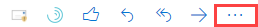
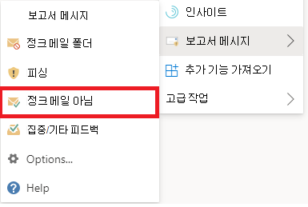

# Outlook에서 가양성 및 가음성 보고

[!INCLUDE [Microsoft 365 Defender rebranding](../includes/microsoft-defender-for-office.md)]

**적용 대상**
- [Exchange Online Protection](exchange-online-protection-overview.md)
- [Office 365용 Microsoft Defender 플랜 1 및 플랜 2](defender-for-office-365.md)
- [Microsoft 365 Defender](../defender/microsoft-365-defender.md)

> [!NOTE]
> 사서함이 있는 Microsoft 365 조직의 관리자는 Exchange Online 포털의 제출 페이지를 사용하는 Microsoft 365 Defender 좋습니다.  자세한 내용은 제출 포털을 사용하여 의심되는 스팸, 피싱, URL 및 파일을 [Microsoft에 제출을 참조하세요.](admin-submission.md)

하이브리드 최신 인증을 사용하는 Microsoft 365 Exchange Online 사서함이 있는 Microsoft 365 조직에서는 가음성(차단되거나 정크 폴더로 전송된 양호한 전자 메일) 및 거짓 부정(받은 편지함으로 배달된 원치 않는 전자 메일 또는 피싱)을 EOP(Exchange Online Protection)에 제출할 수 있습니다.

## 시작하기 전에 알아야 할 사항은 무엇인가요?

- 최상의 사용자 제출 환경을 위해 보고서 메시지 추가 기능 또는 피싱 보고 추가 기능을 사용하세요.

  > [!IMPORTANT]
  > 정크 또는 피싱을 보고하기 위한 기본 제공 Outlook 제출 정책을 사용할 [수 없습니다.](./user-submission.md) 대신 보고서 메시지 추가 기능 또는 피싱 보고 추가 기능을 사용하는 것이 좋습니다.

- 보고서 메시지 추가 기능 및 피싱 보고 추가 Outlook 모든 플랫폼(웹용 Outlook, iOS, Android 및 데스크톱)에서 사용할 수 있습니다.

- 사서함이 있는 조직의 관리자인 Exchange Online 포털에서 제출 포털을 Microsoft 365 Defender. 자세한 내용은 관리 제출을 사용하여 의심되는 스팸, 피싱, URL 및 파일을 Microsoft에 제출을 [참조하세요.](admin-submission.md)

- 메시지를 Microsoft로 직접 보내거나 지정한 사서함 또는 둘 다로 보내도록 구성할 수 있습니다. 자세한 내용은 사용자 제출 [정책 을 참조하세요.](user-submission.md)

- 보고서 메시지 또는 피싱 보고 추가 기능을 보고하고 사용하도록 설정하는 방법에 대한 자세한 내용은 [Enable the Report Message or the Report Phishing add-ins을 참조하십시오.](enable-the-report-message-add-in.md)

- Microsoft에 메시지를 보고하는 데 대한 자세한 내용은 Microsoft에 메시지 및 [파일 보고를 참조하세요.](report-junk-email-messages-to-microsoft.md)

## 보고서 메시지 기능 사용

### 정크 및 피싱 메시지 보고

받은 편지함 또는 정크 메일을 제외한 다른 전자 메일 폴더에 있는 메시지의 경우 다음 방법을 사용하여 스팸 및 피싱 메시지를 보고합니다.

1. 선택한 **메시지의** 오른쪽 위에 있는 추가 작업 줄임표를  선택하고 드롭다운 메뉴에서 메시지 보고를 선택한 다음 정크 또는 피싱 을 **선택합니다.** 

   

   

2. 선택한 메시지는 분석을 위해 Microsoft로 전송됩니다.
   - 스팸으로 보고된 경우 정크 메일 폴더로 이동되었습니다.
   - 피싱으로 보고된 경우 삭제됩니다.

### 정크 메일이 아닌 메시지 보고

1. 선택한 **메시지의** 오른쪽 위 모서리에 있는 추가 작업 줄임표를 선택하고 드롭다운 메뉴에서 메시지 보고를 선택한 다음 정크 메일 아님 **을 선택합니다.** 

   

   

2. 선택한 메시지가 분석을 위해 Microsoft로 전송되어 받은 편지함 또는 기타 지정된 폴더로 이동됩니다.

## 보고된 메시지 보기 및 검토

사용자가 Microsoft에 보고하는 메시지를 검토할 수 있는 옵션은 다음과 같습니다.

- 사이트 **포털의** 제출 Microsoft 365 Defender 사용하세요. 자세한 내용은 [Microsoft에 대한 사용자 제출 보기를 참조하세요.](admin-submission.md#view-user-submissions-to-microsoft)
- 메일 흐름 규칙(전송 규칙)을 만들어 보고된 메시지의 복사본을 전송합니다. 자세한 내용은 메일 흐름 규칙을 사용하여 Microsoft에 보고하는 사용자 [확인을 참조하세요.](/exchange/security-and-compliance/mail-flow-rules/use-rules-to-see-what-users-are-reporting-to-microsoft)
