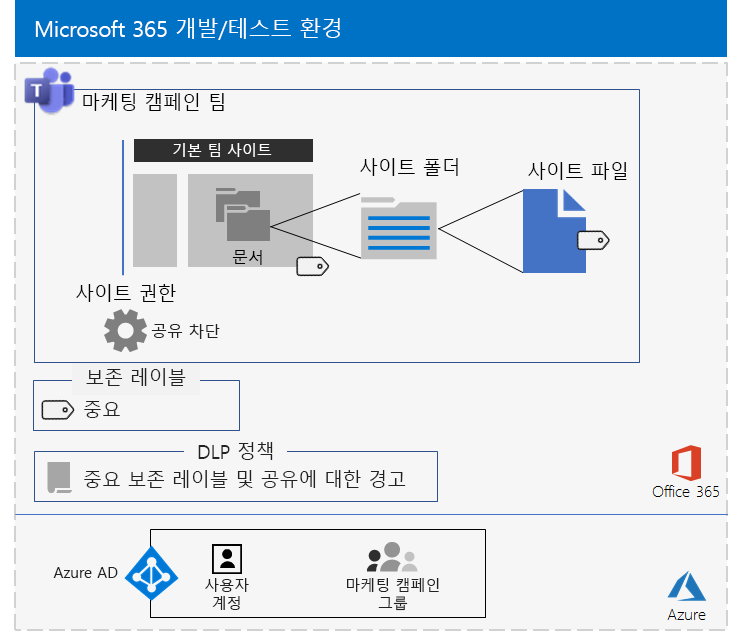
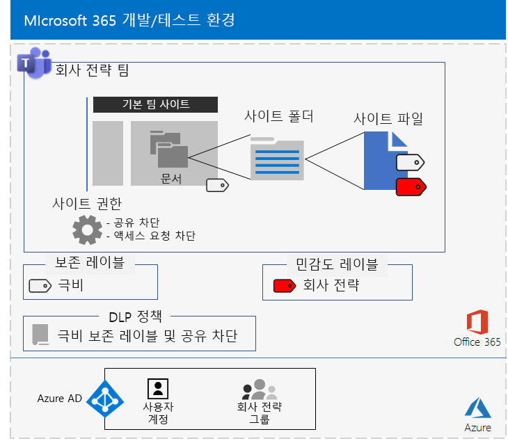

# <a name="secure-teams-for-files-in-a-devtest-environment"></a><span data-ttu-id="e1904-103">개발/테스트 환경에서의 파일을 위한 Teams 보안</span><span class="sxs-lookup"><span data-stu-id="e1904-103">Secure Teams for files in a dev/test environment</span></span>

<span data-ttu-id="e1904-104">이 문서에서는 [Microsoft Teams에서의 파일 보안](secure-files-in-teams.md) 솔루션에 대한 중요하고 극비인 팀을 포함하는 개발/테스트 환경을 만드는 방법을 단계별로 설명합니다.</span><span class="sxs-lookup"><span data-stu-id="e1904-104">This article provides step-by-step instructions to create a dev/test environment that includes the sensitive and highly confidential teams for the [Secure files in Microsoft Teams](secure-files-in-teams.md) solution.</span></span>


<span data-ttu-id="e1904-106">이 개발/테스트 환경을 사용하여 생산에 이러한 유형의 팀을 배포하기 전에 특정 요구 사항에 맞게 설정을 시험해보고 세부 조정하도록 합니다.</span><span class="sxs-lookup"><span data-stu-id="e1904-106">Use this dev/test environment to experiment and fine-tune settings for your specific needs before deploying these types of teams in production.</span></span>

## <a name="phase-1-build-out-your-microsoft-365-enterprise-test-environment"></a><span data-ttu-id="e1904-107">1단계: Microsoft 365 Enterprise 테스트 환경 구축</span><span class="sxs-lookup"><span data-stu-id="e1904-107">Phase 1: Build out your Microsoft 365 Enterprise test environment</span></span>

<span data-ttu-id="e1904-108">최소 요구 사항을 사용하여 중요하고 극비의 팀을 간단한 방식으로 테스트하려는 경우에는 [간단한 기반 구성](https://docs.microsoft.com/microsoft-365/enterprise/lightweight-base-configuration-microsoft-365-enterprise)의 지침을 따릅니다.</span><span class="sxs-lookup"><span data-stu-id="e1904-108">If you just want to test sensitive and highly confidential teams in a lightweight way with the minimum requirements, follow the instructions in [Lightweight base configuration](https://docs.microsoft.com/microsoft-365/enterprise/lightweight-base-configuration-microsoft-365-enterprise).</span></span>

<span data-ttu-id="e1904-109">시뮬레이션 된 엔터프라이즈에서 중요하고 기밀의 팀을 테스트하려면 [암호 해시 동기화](https://docs.microsoft.com/microsoft-365/enterprise/password-hash-sync-m365-ent-test-environment)의 지침을 따릅니다.</span><span class="sxs-lookup"><span data-stu-id="e1904-109">If you want to test sensitive and highly confidential teams in a simulated enterprise, follow the instructions in [Password hash synchronization](https://docs.microsoft.com/microsoft-365/enterprise/password-hash-sync-m365-ent-test-environment).</span></span>

>[!Note]
><span data-ttu-id="e1904-110">중요한 극비의 팀을 테스트하는 데는 Active Directory 도메인 서비스(AD DS) 포리스트를 위한 디렉터리 동기화와 인터넷에 연결된 시뮬레이션 된 인트라넷을 포함하는 시뮬레이션 된 엔터프라이즈 테스트 환경이 필요하지 않습니다.</span><span class="sxs-lookup"><span data-stu-id="e1904-110">Testing sensitive and highly confidential teams does not require the simulated enterprise test environment, which includes a simulated intranet connected to the Internet and directory synchronization for an Active Directory Domain Services (AD DS) forest.</span></span> <span data-ttu-id="e1904-111">이는 사용자가 중요한 극비의 팀을 테스트하고 일반적인 조직을 나타내는 환경에서 실험할 수 있도록 여기에 옵션으로 제공됩니다.</span><span class="sxs-lookup"><span data-stu-id="e1904-111">It is provided here as an option so that you can test sensitive and highly confidential teams and experiment with it in an environment that represents a typical organization.</span></span>
>

## <a name="phase-2-create-and-configure-your-azure-active-directory-ad-groups-and-users"></a><span data-ttu-id="e1904-112">2단계: Azure AD(Active Directory) 그룹 및 사용자 만들기 및 구성</span><span class="sxs-lookup"><span data-stu-id="e1904-112">Phase 2: Create and configure your Azure Active Directory (AD) groups and users</span></span>

<span data-ttu-id="e1904-113">이 단계에서는 가상의 조직에 대한 Azure AD 그룹 및 사용자를 만들고 구성합니다.</span><span class="sxs-lookup"><span data-stu-id="e1904-113">In this phase, you create and configure the Azure AD groups and users for your fictional organization.</span></span>

<span data-ttu-id="e1904-114">먼저 Azure Portal을 사용하여 일반적인 조직의 두 개의 집합을 만듭니다.</span><span class="sxs-lookup"><span data-stu-id="e1904-114">First, create two groups for a typical organization with the Azure portal.</span></span>

1. <span data-ttu-id="e1904-115">브라우저에 별도의 탭을 만든 다음 [https://portal.azure.com](https://portal.azure.com)에서 Azure Portal로 이동합니다.</span><span class="sxs-lookup"><span data-stu-id="e1904-115">Create a separate tab in your browser, and then go to the Azure portal at [https://portal.azure.com](https://portal.azure.com).</span></span> <span data-ttu-id="e1904-116">필요한 경우 Office 365 E5 평가판 혹은 유료 구독의 전역 관리자 계정의 자격 증명으로 로그인합니다.</span><span class="sxs-lookup"><span data-stu-id="e1904-116">If needed, sign in with the credentials of the global administrator account for your Microsoft 365 E5 trial or paid subscription.</span></span>

2. <span data-ttu-id="e1904-117">Azure Portal에서 **Azure Active Directory > 그룹**을 차례로 클릭합니다.</span><span class="sxs-lookup"><span data-stu-id="e1904-117">In the Azure portal, click **Azure Active Directory > Groups**.</span></span>

3. <span data-ttu-id="e1904-118">**그룹 - 모든 그룹** 블레이드에서 **+ 새 그룹**을 클릭합니다.</span><span class="sxs-lookup"><span data-stu-id="e1904-118">On the **Groups - All groups** blade, click **+ New group**.</span></span>

4. <span data-ttu-id="e1904-119">**그룹** 블레이드에서:</span><span class="sxs-lookup"><span data-stu-id="e1904-119">On the **Group** blade:</span></span>

   - <span data-ttu-id="e1904-120">**그룹 유형**에서 **보안**을 선택합니다.</span><span class="sxs-lookup"><span data-stu-id="e1904-120">Select **Security** in **Group type**.</span></span>

   - <span data-ttu-id="e1904-121">**이름**에 **C-Suite**를 입력합니다.</span><span class="sxs-lookup"><span data-stu-id="e1904-121">Type **C-Suite** in **Name**.</span></span>

   - <span data-ttu-id="e1904-122">**멤버 유형**에서 **할당됨**을 선택합니다.</span><span class="sxs-lookup"><span data-stu-id="e1904-122">Select **Assigned** in **Membership type**.</span></span>

5. <span data-ttu-id="e1904-123">**만들기**를 클릭한 다음 **그룹** 블레이드를 닫습니다.</span><span class="sxs-lookup"><span data-stu-id="e1904-123">Click **Create**, and then close the **Group** blade.</span></span>

6. <span data-ttu-id="e1904-124">**마케팅 직원**이라는 새로운 그룹에 대해 3-5 단계를 반복합니다.</span><span class="sxs-lookup"><span data-stu-id="e1904-124">Repeat steps 3-5 for a new group named **Marketing staff**.</span></span>

<span data-ttu-id="e1904-125">그런 다음 그룹 구성원에게 Microsoft 365 및 EMS 구독에 대한 라이선스를 자동으로 할당하도록 자동 라이선스를 구성합니다.</span><span class="sxs-lookup"><span data-stu-id="e1904-125">Next, you configure automatic licensing so that members of your groups are automatically assigned licenses for your Microsoft 365 and EMS subscriptions.</span></span>

1. <span data-ttu-id="e1904-126">Azure Portal에서 **Azure Active Directory > 라이선스 > 모든 제품**을 차례로 클릭합니다.</span><span class="sxs-lookup"><span data-stu-id="e1904-126">In the Azure portal, click **Azure Active Directory > Licenses > All products**.</span></span>

2. <span data-ttu-id="e1904-127">목록에서 **Microsoft 365 Enterprise E5**를 선택한 다음 **할당**을 클릭합니다.</span><span class="sxs-lookup"><span data-stu-id="e1904-127">In the list, select **Microsoft 365 Enterprise E5**, and then click **Assign**.</span></span>

3. <span data-ttu-id="e1904-128">**라이선스 할당** 블레이드에서 **사용자 및 그룹**을 클릭합니다.</span><span class="sxs-lookup"><span data-stu-id="e1904-128">In the **Assign license** blade, click **Users and groups**.</span></span>

4. <span data-ttu-id="e1904-129">그룹 목록에서 다음을 선택합니다.</span><span class="sxs-lookup"><span data-stu-id="e1904-129">In the list of groups, select the following:</span></span>

   - <span data-ttu-id="e1904-130">C-Suite</span><span class="sxs-lookup"><span data-stu-id="e1904-130">C-Suite</span></span>

   - <span data-ttu-id="e1904-131">마케팅 직원</span><span class="sxs-lookup"><span data-stu-id="e1904-131">Marketing staff</span></span>

5. <span data-ttu-id="e1904-132">**선택**을 클릭하고 **할당**을 클릭합니다.</span><span class="sxs-lookup"><span data-stu-id="e1904-132">Click **Select**, and then click **Assign**.</span></span>

6. <span data-ttu-id="e1904-133">브라우저에서 Azure Portal 탭을 닫습니다.</span><span class="sxs-lookup"><span data-stu-id="e1904-133">Close the Azure portal tab in your browser.</span></span>

<span data-ttu-id="e1904-134">그런 다음, [Azure Active Directory PowerShell for Graph 모듈에 연결](https://docs.microsoft.com/office365/enterprise/powershell/connect-to-office-365-powershell#connect-with-the-azure-active-directory-powershell-for-graph-module)합니다.</span><span class="sxs-lookup"><span data-stu-id="e1904-134">Next, you [Connect with the Azure Active Directory PowerShell for Graph module ](https://docs.microsoft.com/office365/enterprise/powershell/connect-to-office-365-powershell#connect-with-the-azure-active-directory-powershell-for-graph-module).</span></span>

<span data-ttu-id="e1904-135">조직 이름, 사용자 위치 및 공통 암호를 입력한 다음 PowerShell 명령 프롬프트 또는 ISE(Integrated Script Environment)에서 다음 명령을 실행하여 사용자 계정을 만들고 해당 그룹에 추가합니다.</span><span class="sxs-lookup"><span data-stu-id="e1904-135">Fill in your organization name, your location, and a common password, and then run these commands from the PowerShell command prompt or Integrated Script Environment (ISE) to create user accounts and add them to their groups:</span></span>

```powershell
$orgName="<organization name, such as contoso for the contoso.onmicrosoft.com trial subscription domain name>"
$location="<the ISO ALPHA2 country code, such as US for the United States>"
$commonPassword="<common password for all the new accounts>"

$PasswordProfile=New-Object -TypeName Microsoft.Open.AzureAD.Model.PasswordProfile
$PasswordProfile.Password=$commonPassword

$groupName="C-Suite"
$userNames=@("CEO","CFO","CIO")
$groupID=(Get-AzureADGroup | Where { $_.DisplayName -eq $groupName }).ObjectID
ForEach ($element in $userNames){
New-AzureADUser -DisplayName $element -PasswordProfile $PasswordProfile -UserPrincipalName ($element + "@" + $orgName + ".onmicrosoft.com") -AccountEnabled $true -MailNickName $element -UsageLocation $location
Add-AzureADGroupMember -RefObjectId (Get-AzureADUser | Where { $_.DisplayName -eq $element }).ObjectID -ObjectId $groupID
}
$groupName="Marketing staff"
$userNames=@("Marketing1", "Marketing2")
$groupID=(Get-AzureADGroup | Where { $_.DisplayName -eq $groupName }).ObjectID
ForEach ($element in $userNames){
New-AzureADUser -DisplayName $element -PasswordProfile $PasswordProfile -UserPrincipalName ($element + "@" + $orgName + ".onmicrosoft.com") -AccountEnabled $true -MailNickName $element -UsageLocation $location
Add-AzureADGroupMember -RefObjectId (Get-AzureADUser | Where { $_.DisplayName -eq $element }).ObjectID -ObjectId $groupID
}
```

> [!NOTE]
> <span data-ttu-id="e1904-136">여기서 공통 암호를 사용하는 것은 자동화 및 개발/테스트 환경에 대한 구성 용이성을 위한 것입니다.</span><span class="sxs-lookup"><span data-stu-id="e1904-136">The use of a common password here is for automation and ease of configuration for a dev/test environment.</span></span> <span data-ttu-id="e1904-137">물론 프로덕션 구독에서는 공통 암호를 사용하지 않는 것이 좋습니다.</span><span class="sxs-lookup"><span data-stu-id="e1904-137">Obviously, this is highly discouraged for production subscriptions.</span></span>

<span data-ttu-id="e1904-138">이러한 단계에 따라 그룹 기반 라이선스가 제대로 작동하는지 확인합니다.</span><span class="sxs-lookup"><span data-stu-id="e1904-138">Use these steps to verify that group-based licensing is working correctly.</span></span>

1. <span data-ttu-id="e1904-139">브라우저의 **Microsoft Office 홈** 탭에서 **관리** 타일을 클릭합니다.</span><span class="sxs-lookup"><span data-stu-id="e1904-139">From the **Microsoft Office Home** tab of your browser, click the **Admin** tile.</span></span>

2. <span data-ttu-id="e1904-140">브라우저의 새 **Microsoft 365 관리 센터** 탭에서 **사용자**를 클릭합니다.</span><span class="sxs-lookup"><span data-stu-id="e1904-140">From the new **Microsoft 365 admin center** tab of your browser, click **Users**.</span></span>

3. <span data-ttu-id="e1904-141">사용자 목록에서 **CEO**를 클릭합니다.</span><span class="sxs-lookup"><span data-stu-id="e1904-141">In the list of users, click **CEO**.</span></span>

4. <span data-ttu-id="e1904-142">**CEO** 사용자 계정의 속성을 나열하는 창에서(**제품 라이선스**에서) **Microsoft 365 Enterprise E5** 라이선스가 할당되었는지 확인합니다.</span><span class="sxs-lookup"><span data-stu-id="e1904-142">In the pane that lists the properties of the **CEO** user account, verify that it has been assigned the **Microsoft 365 Enterprise E5** license (in **Product licenses**).</span></span>

## <a name="phase-3-create-retention-labels"></a><span data-ttu-id="e1904-143">3단계: 보존 레이블 만들기</span><span class="sxs-lookup"><span data-stu-id="e1904-143">Phase 3: Create retention labels</span></span>

<span data-ttu-id="e1904-144">이 단계에서는 기본 SharePoint 사이트에 있는 문서 폴더의 다양한 보안 수준에 대한 보존 레이블을 만듭니다.</span><span class="sxs-lookup"><span data-stu-id="e1904-144">In this phase, you create the retention labels for the different levels of security for underlying SharePoint site documents folders.</span></span>

1. <span data-ttu-id="e1904-145">전역 관리자 계정을 사용하여 [Microsoft 365 규정 준수 포털](https://compliance.microsoft.com)에 로그인합니다.</span><span class="sxs-lookup"><span data-stu-id="e1904-145">Sign in to the [Microsoft 365 compliance portal](https://compliance.microsoft.com) with your global admin account.</span></span>

2. <span data-ttu-id="e1904-146">브라우저의 **홈 - Microsoft 365 규정 준수** 탭에서 **분류 > 레이블**을 차례로 클릭합니다.</span><span class="sxs-lookup"><span data-stu-id="e1904-146">From the **Home - Microsoft 365 compliance** tab of your browser, click **Classifications > Labels**.</span></span>

3. <span data-ttu-id="e1904-147">**보존 레이블 > 레이블 만들기**를 클릭합니다.</span><span class="sxs-lookup"><span data-stu-id="e1904-147">Click **Retention labels > Create a label**.</span></span>

4. <span data-ttu-id="e1904-148">**레이블 이름 지정** 창에서 **레이블 이름 지정**에 **중요한**을 입력하고 **다음**을 클릭합니다.</span><span class="sxs-lookup"><span data-stu-id="e1904-148">On the **Name your label** pane, type **Sensitive** in **Name your label**, and then click **Next**.</span></span>

5. <span data-ttu-id="e1904-149">**파일 플랜 설명자** 창에서 **다음**을 클릭합니다.</span><span class="sxs-lookup"><span data-stu-id="e1904-149">On the **File plan descriptors** pane, click **Next**.</span></span>

6. <span data-ttu-id="e1904-150">필요에 따라 **레이블 설정** 창에서 **보존**을 **켜기**로 설정하고 **다음**을 클릭합니다.</span><span class="sxs-lookup"><span data-stu-id="e1904-150">On the **Label settings** pane, if needed, set **Retention** to **On**, and then click **Next**.</span></span>

7. <span data-ttu-id="e1904-151">**설정 검토** 창에서 **레이블 만들기**를 클릭합니다.</span><span class="sxs-lookup"><span data-stu-id="e1904-151">On the **Review your settings** pane, click **Create the label**.</span></span>

8. <span data-ttu-id="e1904-152">**극비**라고 명칭되는 추가 보존 레이블에 대해 3-7단계를 반복합니다.</span><span class="sxs-lookup"><span data-stu-id="e1904-152">Repeat steps 3-7 for an additional retention label named **Highly Confidential**.</span></span>

9. <span data-ttu-id="e1904-153">\*\*홈 > 레이블 \*\* 창에서 **레이블 게시**를 클릭합니다.</span><span class="sxs-lookup"><span data-stu-id="e1904-153">From the **Home > Labels** pane, click **Publish labels**.</span></span>

10. <span data-ttu-id="e1904-154">**게시할 레이블 선택** 창에서 **게시할 레이블 선택**을 클릭합니다.</span><span class="sxs-lookup"><span data-stu-id="e1904-154">On the **Choose labels to publish** pane, click **Choose labels to publish**.</span></span>

11. <span data-ttu-id="e1904-155">**레이블 선택** 창에서 **추가**를 클릭하고 네 개의 레이블을 모두 선택합니다.</span><span class="sxs-lookup"><span data-stu-id="e1904-155">On the **Choose labels** pane, click **Add** and select all four labels.</span></span>

12. <span data-ttu-id="e1904-156">**완료**를 클릭합니다.</span><span class="sxs-lookup"><span data-stu-id="e1904-156">Click **Done**.</span></span>

13. <span data-ttu-id="e1904-157">**게시할 레이블 선택** 창에서 **다음**을 클릭합니다.</span><span class="sxs-lookup"><span data-stu-id="e1904-157">On the **Choose labels to publish** pane, click **Next**.</span></span>

14. <span data-ttu-id="e1904-158">**위치 선택** 창에서 **다음**을 클릭합니다.</span><span class="sxs-lookup"><span data-stu-id="e1904-158">On the **Choose locations** pane, click **Next**.</span></span>

15. <span data-ttu-id="e1904-159">**정책 이름 지정** 창에서 **이름**에 **예제 조직**을 입력하고 **다음**을 클릭합니다.</span><span class="sxs-lookup"><span data-stu-id="e1904-159">On the **Name your policy** pane, type **Example organization** in **Name**, and then click **Next**.</span></span>

16. <span data-ttu-id="e1904-160">**설정 검토** 창에서 **레이블 게시**, **닫기**를 차례로 클릭합니다.</span><span class="sxs-lookup"><span data-stu-id="e1904-160">On the **Review your settings** pane, click **Publish labels**, and then click **Close**.</span></span>

## <a name="phase-4-create-your-teams"></a><span data-ttu-id="e1904-161">4단계: 팀 만들기</span><span class="sxs-lookup"><span data-stu-id="e1904-161">Phase 4: Create your teams</span></span>

<span data-ttu-id="e1904-162">이 단계에서는 예제 조직에 대한 중요하고 극비의 팀을 만들고 구성합니다.</span><span class="sxs-lookup"><span data-stu-id="e1904-162">In this phase, you create and configure sensitive and highly confidential teams for your example organization.</span></span>

### <a name="sensitive-team-for-marketing-campaigns"></a><span data-ttu-id="e1904-163">마케팅 캠페인을 위한 중요한 팀</span><span class="sxs-lookup"><span data-stu-id="e1904-163">Sensitive team for marketing campaigns</span></span>

<span data-ttu-id="e1904-164">마케팅 그룹의 구성원이 지속적인 마케팅 캠페인을 공동으로 작업하기 위해 중요한 수준의 팀을 만들려면 다음을 수행합니다.</span><span class="sxs-lookup"><span data-stu-id="e1904-164">To create a sensitive-level team for members of the marketing group to collaborate on ongoing marketing campaigns:</span></span>

1. <span data-ttu-id="e1904-165">**마케팅 캠페인** 이름을 사용하여 [새로운 비공개 팀을 만듭니다](https://support.microsoft.com/office/174adf5f-846b-4780-b765-de1a0a737e2b).</span><span class="sxs-lookup"><span data-stu-id="e1904-165">[Create a new private team](https://support.microsoft.com/office/174adf5f-846b-4780-b765-de1a0a737e2b) with the name **Marketing Campaigns**.</span></span>
2. <span data-ttu-id="e1904-166">**마케팅 캠페인** 팀을 엽니다.</span><span class="sxs-lookup"><span data-stu-id="e1904-166">Open the **Marketing Campaigns** team.</span></span>
3. <span data-ttu-id="e1904-167">팀의 도구 막대에서 **파일**을 클릭합니다.</span><span class="sxs-lookup"><span data-stu-id="e1904-167">In the tool bar for the team, click **Files**.</span></span>
4. <span data-ttu-id="e1904-168">줄임표를 클릭한 다음 **SharePoint에서 열기**를 클릭합니다.</span><span class="sxs-lookup"><span data-stu-id="e1904-168">Click the ellipsis, and then click **Open in SharePoint**.</span></span>
5. <span data-ttu-id="e1904-169">기본 SharePoint 사이트의 도구 막대에서 설정 아이콘을 클릭한 다음 **사이트 사용 권한**을 클릭합니다.</span><span class="sxs-lookup"><span data-stu-id="e1904-169">In the tool bar of the underlying SharePoint site, click the settings icon, and then click **Site permissions**.</span></span>
6. <span data-ttu-id="e1904-170">**사이트 사용 권한** 창에 있는 **공유 설정**에서 **공유 설정 변경**을 클릭합니다.</span><span class="sxs-lookup"><span data-stu-id="e1904-170">In the **Site permissions** pane, under **Sharing Settings**, click **Change sharing settings**.</span></span>
7. <span data-ttu-id="e1904-171">**사용 권한 공유**에서 **사이트 소유자만 파일, 폴더 및 사이트를 공유할 수 있습니다**를 선택하고 **저장**을 클릭합니다.</span><span class="sxs-lookup"><span data-stu-id="e1904-171">Under **Sharing permissions**, choose **Only site owners can share files, folders, and the site**, and then click **Save**.</span></span>

<span data-ttu-id="e1904-172">그런 다음 기본 마케팅 캠페인 SharePoint 사이트의 문서 폴더를 중요 레이블로 구성합니다.</span><span class="sxs-lookup"><span data-stu-id="e1904-172">Next, configure the documents folder of the underlying Marketing Campaigns SharePoint site for the Sensitive label.</span></span>

1. <span data-ttu-id="e1904-173">브라우저의 **마케팅 캠페인 - 홈** 탭에서 **문서**를 클릭합니다.</span><span class="sxs-lookup"><span data-stu-id="e1904-173">In the **Marketing Campaigns-Home** tab of your browser, click **Documents**.</span></span>
2. <span data-ttu-id="e1904-174">설정 아이콘을 클릭한 다음, **라이브러리 설정**을 클릭합니다.</span><span class="sxs-lookup"><span data-stu-id="e1904-174">Click the settings icon, and then click **Library settings**.</span></span>
3. <span data-ttu-id="e1904-175">**권한 및 관리** 아래에서 **이 라이브러리의 항목에 레이블 적용**을 클릭합니다.</span><span class="sxs-lookup"><span data-stu-id="e1904-175">Under **Permissions and Management**, click **Apply label to items in this library**.</span></span>
4. <span data-ttu-id="e1904-176">**설정 - 레이블 적용**에서 **중요**를 선택하고 **저장**을 클릭합니다.</span><span class="sxs-lookup"><span data-stu-id="e1904-176">In **Settings-Apply Label**, select **Sensitive**, and then click **Save**.</span></span>

<span data-ttu-id="e1904-177">그런 다음 사용자가 마케팅 캠페인 사이트를 포함하는 중요 레이블이 있는 기본 SharePoint 사이트에서 문서를 조직 외부와 공유할 때 사용자에게 통보를 하는 데이터 손실 방지(DLP) 정책을 구성합니다.</span><span class="sxs-lookup"><span data-stu-id="e1904-177">Next, configure a data loss prevention (DLP) policy that notifies users when they share a document on the underlying SharePoint site with the Sensitive label, which includes the Marketing Campaigns site, outside the organization.</span></span>

1. <span data-ttu-id="e1904-178">전역 관리자 계정을 사용하여 [Microsoft 365 규정 준수 포털](https://compliance.microsoft.com/)에 로그인합니다.</span><span class="sxs-lookup"><span data-stu-id="e1904-178">Sign in to the [Microsoft 365 compliance portal](https://compliance.microsoft.com/) with your global admin account.</span></span>

2. <span data-ttu-id="e1904-179">브라우저의 새 **Microsoft 365 규정 준수** 탭에서 **정책 > 데이터 손실 방지**를 차례로 클릭합니다.</span><span class="sxs-lookup"><span data-stu-id="e1904-179">On the new **Microsoft 365 compliance** tab in your browser, click **Policies > Data loss prevention**.</span></span>

3. <span data-ttu-id="e1904-180">**홈 > 데이터 손실 방지** 창에서 **정책 만들기**를 클릭합니다.</span><span class="sxs-lookup"><span data-stu-id="e1904-180">In the **Home > Data loss prevention** pane, click **Create a policy**.</span></span>

4. <span data-ttu-id="e1904-181">**서식 파일로 시작하거나 사용자 지정 정책 만들기** 창에서 **사용자 지정**, **다음**을 차례로 클릭합니다.</span><span class="sxs-lookup"><span data-stu-id="e1904-181">In the **Start with a template or create a custom policy** pane, click **Custom**, and then click **Next**.</span></span>

5. <span data-ttu-id="e1904-182">**정책 이름 지정** 창의 **이름**에서 **중요 레이블 SharePoint Online 사이트**를 입력하고 **다음**을 클릭합니다.</span><span class="sxs-lookup"><span data-stu-id="e1904-182">In the **Name your policy** pane, type **Sensitive label SharePoint sites** in **Name**, and then click **Next**.</span></span>

6. <span data-ttu-id="e1904-183">**위치 선택** 창에서 **특정 위치 선택 허용**을 선택하고 **다음**을 클릭합니다.</span><span class="sxs-lookup"><span data-stu-id="e1904-183">In the **Choose locations** pane, click **Let me choose specific locations**, and then click **Next**.</span></span>

7. <span data-ttu-id="e1904-184">위치 목록에서 **Exchange 전자 메일**, **OneDrive 계정** 및 **팀 채팅 및 채널 메시지** 를 사용하지 않도록 설정하고 **다음**을 클릭합니다.</span><span class="sxs-lookup"><span data-stu-id="e1904-184">In the list of locations, disable the **Exchange email**, **OneDrive accounts**, and **Teams chat and channel messages** locations, and then click **Next**.</span></span>

8. <span data-ttu-id="e1904-185">**보호할 콘텐츠 유형 사용자 지정** 창에서 **편집**을 클릭합니다.</span><span class="sxs-lookup"><span data-stu-id="e1904-185">In the **Customize the type of content you want to protect** pane, click **Edit**.</span></span>

9. <span data-ttu-id="e1904-186">**보호할 콘텐츠 유형 선택** 창의 드롭다운 상자에서 **추가**, **보존 레이블**을 차례로 클릭합니다.</span><span class="sxs-lookup"><span data-stu-id="e1904-186">In the **Choose the types of content to protect** pane, click **Add** in the drop-down box, and then click **Retention labels**.</span></span>

10. <span data-ttu-id="e1904-187">**보존 레이블** 창에서 **+추가**를 클릭하고, **중요** 레이블을 선택하고, **추가**를 클릭한 다음, **완료**를 클릭합니다.</span><span class="sxs-lookup"><span data-stu-id="e1904-187">In the **Retention labels** pane, click **Add**, select the **Sensitive** label, click **Add**, and then click **Done**.</span></span>

11. <span data-ttu-id="e1904-188">**보호할 콘텐츠 유형 선택** 창에서 **저장**을 클릭합니다.</span><span class="sxs-lookup"><span data-stu-id="e1904-188">In the **Choose the types of content to protect** pane, click **Save**.</span></span>

12. <span data-ttu-id="e1904-189">**보호할 콘텐츠 유형 사용자 지정** 창에서 **다음**을 클릭합니다.</span><span class="sxs-lookup"><span data-stu-id="e1904-189">In the **Customize the type of content you want to protect** pane, click **Next**.</span></span>

13. <span data-ttu-id="e1904-190">\*\*중요한 정보를 발견하면 \*\* 창에서 **팁 및 전자 메일 사용자 지정**을 클릭합니다.</span><span class="sxs-lookup"><span data-stu-id="e1904-190">In the **What do you want to do if we detect sensitive info?** pane, click **Customize the tip and email**.</span></span>

14. <span data-ttu-id="e1904-191">**Customize policy tips and email notifications(정책 팁 및 전자 메일 알림 사용자 지정)** 창에서 **Customize the policy tip text(정책 팁 텍스트 사용자 지정)** 를 클릭합니다.</span><span class="sxs-lookup"><span data-stu-id="e1904-191">In the **Customize policy tips and email notifications** pane, click **Customize the policy tip text**.</span></span>

15. <span data-ttu-id="e1904-192">텍스트 상자에 다음을 입력하거나 붙여넣습니다.</span><span class="sxs-lookup"><span data-stu-id="e1904-192">In the text box, type or paste in the following:</span></span>

    <span data-ttu-id="e1904-p104">조직 외부의 사용자와 공유하려면 파일을 다운로드한 다음 파일을 엽니다. 파일, 문서 보호, 암호 설정을 차례로 클릭한 다음 강력한 암호를 지정합니다. 암호를 별도의 전자 메일 또는 다른 통신 수단으로 보냅니다.</span><span class="sxs-lookup"><span data-stu-id="e1904-p104">To share with a user outside the organization, download the file and then open it. Click File, then Protect Document, and then Encrypt with Password, and then specify a strong password. Send the password in a separate email or other means of communication.</span></span>

16. <span data-ttu-id="e1904-196">**확인**을 클릭합니다.</span><span class="sxs-lookup"><span data-stu-id="e1904-196">Click **OK**.</span></span>

17. <span data-ttu-id="e1904-197">**중요한 정보를 발견 시 어떠한 작업을 수행하시겠습니까?** 창에서 **다음**을 클릭합니다.</span><span class="sxs-lookup"><span data-stu-id="e1904-197">In the **What do you want to do if we detect sensitive info?** pane, click **Next**.</span></span>

18. <span data-ttu-id="e1904-198">**정책을 켤까요 아니면 먼저 테스트를 수행할까요?** 창에서 **예, 지금 켜겠습니다.** 를 클릭하고 **다음**을 클릭합니다.</span><span class="sxs-lookup"><span data-stu-id="e1904-198">In the **Do you want to turn on the policy or test things out first?** pane, click **Yes, turn it on right away**, and then click **Next**.</span></span>

19. <span data-ttu-id="e1904-199">**설정 검토 창**에서 **만들기**, **닫기**를 차례로 클릭합니다.</span><span class="sxs-lookup"><span data-stu-id="e1904-199">In the **Review your settings** pane, click **Create**, and then click **Close**.</span></span>

<span data-ttu-id="e1904-200">다음은 마케팅 캠페인 팀에 대한 구성의 결과입니다.</span><span class="sxs-lookup"><span data-stu-id="e1904-200">Here is the resulting configuration for the Marketing Campaigns team.</span></span>



### <a name="company-strategy-team-site"></a><span data-ttu-id="e1904-202">회사 전략 팀 사이트</span><span class="sxs-lookup"><span data-stu-id="e1904-202">Company strategy team site</span></span>

<span data-ttu-id="e1904-203">수석 리더십 팀 구성원을 위해 회사 전략을 공동으로 작업하기 위한 극비의 팀을 만들려면 다음을 수행합니다.</span><span class="sxs-lookup"><span data-stu-id="e1904-203">To create a highly confidential-level team for members of the senior leadership team to collaborate on company strategy:</span></span>

1. <span data-ttu-id="e1904-204">**회사 전략**을 사용하여 [새로운 비공개 팀을 만듭니다](https://support.microsoft.com/office/174adf5f-846b-4780-b765-de1a0a737e2b).</span><span class="sxs-lookup"><span data-stu-id="e1904-204">[Create a new private team](https://support.microsoft.com/office/174adf5f-846b-4780-b765-de1a0a737e2b) with the name **Company Strategy**.</span></span>
2. <span data-ttu-id="e1904-205">**회사 전략** 팀을 엽니다.</span><span class="sxs-lookup"><span data-stu-id="e1904-205">Open the **Company Strategy** team.</span></span>
3. <span data-ttu-id="e1904-206">팀의 도구 막대에서 **파일**을 클릭합니다.</span><span class="sxs-lookup"><span data-stu-id="e1904-206">In the tool bar for the team, click **Files**.</span></span>
4. <span data-ttu-id="e1904-207">줄임표를 클릭한 다음 **SharePoint에서 열기**를 클릭합니다.</span><span class="sxs-lookup"><span data-stu-id="e1904-207">Click the ellipsis, and then click **Open in SharePoint**.</span></span>
5. <span data-ttu-id="e1904-208">기본 SharePoint 사이트의 도구 막대에서 설정 아이콘을 클릭한 다음 **사이트 사용 권한**을 클릭합니다.</span><span class="sxs-lookup"><span data-stu-id="e1904-208">In the tool bar of the underlying SharePoint site, click the settings icon, and then click **Site permissions**.</span></span>
6. <span data-ttu-id="e1904-209">**사이트 사용 권한** 창에 있는 **공유 설정**에서 **공유 설정 변경**을 클릭합니다.</span><span class="sxs-lookup"><span data-stu-id="e1904-209">In the **Site permissions** pane, under **Sharing Settings**, click **Change sharing settings**.</span></span>
7. <span data-ttu-id="e1904-210">**사용 권한 공유**에서 **사이트 소유자만 파일, 폴더 및 사이트를 공유할 수 있습니다**를 선택합니다.</span><span class="sxs-lookup"><span data-stu-id="e1904-210">Under **Sharing permissions**, choose **Only site owners can share files, folders, and the site**.</span></span>
8. <span data-ttu-id="e1904-211">**액세스 요청 허용**을 해제한 다음, **저장**을 클릭합니다.</span><span class="sxs-lookup"><span data-stu-id="e1904-211">Turn off **Allow access requests**, and then click **Save**.</span></span>

<span data-ttu-id="e1904-212">그런 다음 극비 레이블을 위해 기본 회사 전략 SharePoint 사이트의 문서 폴더를 구성합니다.</span><span class="sxs-lookup"><span data-stu-id="e1904-212">Next, configure the documents folder of the underlying Company Strategy SharePoint site for the Highly Confidential label.</span></span>

1. <span data-ttu-id="e1904-213">브라우저의 **회사 전략 - 홈** 탭에서 **문서**를 클릭합니다.</span><span class="sxs-lookup"><span data-stu-id="e1904-213">In the **Company Strategy-Home** tab of your browser, click **Documents**.</span></span>
2. <span data-ttu-id="e1904-214">설정 아이콘을 클릭한 다음, **라이브러리 설정**을 클릭합니다.</span><span class="sxs-lookup"><span data-stu-id="e1904-214">Click the settings icon, and then click **Library settings**.</span></span>
3. <span data-ttu-id="e1904-215">**권한 및 관리** 아래에서 **이 라이브러리의 항목에 레이블 적용**을 클릭합니다.</span><span class="sxs-lookup"><span data-stu-id="e1904-215">Under **Permissions and Management**, click **Apply label to items in this library**.</span></span>
4. <span data-ttu-id="e1904-216">**설정 - 레이블 적용**에서 **극비**를 선택하고 **저장**을 클릭합니다.</span><span class="sxs-lookup"><span data-stu-id="e1904-216">In **Settings-Apply Label**, select **Highly Confidential**, and then click **Save**.</span></span>

<span data-ttu-id="e1904-217">그런 다음 회사 전략 사이트를 포함하는 극비 레이블이 있는 기본 SharePoint 사이트에서 사용자가 조직의 외부와 문서를 공유할 때 사용자를 차단하는 DLP 정책을 구성합니다.</span><span class="sxs-lookup"><span data-stu-id="e1904-217">Next, configure a DLP policy that blocks users when they share a document on an underlying SharePoint site with the Highly Confidential label, which includes the Company Strategy site, outside the organization.</span></span>

1. <span data-ttu-id="e1904-218">전역 관리자로 [Microsoft 365 규정 준수 포털](https://compliance.microsoft.com/)에 로그인합니다.</span><span class="sxs-lookup"><span data-stu-id="e1904-218">Sign in to the [Microsoft 365 compliance portal](https://compliance.microsoft.com/) with your global admin.</span></span>

2. <span data-ttu-id="e1904-219">브라우저의 새 **Microsoft 365 규정 준수** 탭에서 **정책 > 데이터 손실 방지**를 차례로 클릭합니다.</span><span class="sxs-lookup"><span data-stu-id="e1904-219">On the new **Microsoft 365 compliance** tab in your browser, click **Policies > Data loss prevention**.</span></span>

3. <span data-ttu-id="e1904-220">**홈 > 데이터 손실 방지** 창에서 **정책 만들기**를 클릭합니다.</span><span class="sxs-lookup"><span data-stu-id="e1904-220">In the **Home > Data loss prevention** pane, click **Create a policy**.</span></span>

4. <span data-ttu-id="e1904-221">**서식 파일로 시작하거나 사용자 지정 정책 만들기** 창에서 **사용자 지정**, **다음**을 차례로 클릭합니다.</span><span class="sxs-lookup"><span data-stu-id="e1904-221">In the **Start with a template or create a custom policy** pane, click **Custom**, and then click **Next**.</span></span>

5. <span data-ttu-id="e1904-222">**정책 이름 지정** 창의 **이름**에서 **극비 레이블 SharePoint 사이트**를 입력하고 **다음**을 클릭합니다.</span><span class="sxs-lookup"><span data-stu-id="e1904-222">In the **Name your policy** pane, type **Highly Confidential label SharePoint sites** in **Name**, and then click **Next**.</span></span>

6. <span data-ttu-id="e1904-223">**위치 선택** 창에서 **특정 위치 선택 허용**을 선택하고 **다음**을 클릭합니다.</span><span class="sxs-lookup"><span data-stu-id="e1904-223">In the **Choose locations** pane, click **Let me choose specific locations**, and then click **Next**.</span></span>

7. <span data-ttu-id="e1904-224">위치 목록에서 **Exchange 전자 메일**, **OneDrive 계정** 및 **팀 채팅 및 채널 메시지** 를 사용하지 않도록 설정하고 **다음**을 클릭합니다.</span><span class="sxs-lookup"><span data-stu-id="e1904-224">In the list of locations, disable the **Exchange email**, **OneDrive accounts**, and **Teams chat and channel messages** locations, and then click **Next**.</span></span>

8. <span data-ttu-id="e1904-225">**보호할 콘텐츠 유형 사용자 지정** 창에서 **편집**을 클릭합니다.</span><span class="sxs-lookup"><span data-stu-id="e1904-225">In the **Customize the type of content you want to protect** pane, click **Edit**.</span></span>

9. <span data-ttu-id="e1904-226">**보호할 콘텐츠 유형 선택** 창의 드롭다운 상자에서 **추가**, **보존 레이블**을 차례로 클릭합니다.</span><span class="sxs-lookup"><span data-stu-id="e1904-226">In the **Choose the types of content to protect** pane, click **Add** in the drop-down box, and then click **Retention labels**.</span></span>

10. <span data-ttu-id="e1904-227">**레이블** 창에서 **추가**를 클릭하고, **극비** 레이블을 선택하고, **추가**를 클릭한 다음, **완료**를 클릭합니다.</span><span class="sxs-lookup"><span data-stu-id="e1904-227">In the **Retention labels** pane, click **Add**, select the **Highly Confidential** label, click **Add**, and then click **Done**.</span></span>

11. <span data-ttu-id="e1904-228">**보호할 콘텐츠 유형 선택** 창에서 **저장**을 클릭합니다.</span><span class="sxs-lookup"><span data-stu-id="e1904-228">In the **Choose the types of content to protect** pane, click **Save**.</span></span>

12. <span data-ttu-id="e1904-229">**보호할 콘텐츠 유형 사용자 지정** 창에서 **다음**을 클릭합니다.</span><span class="sxs-lookup"><span data-stu-id="e1904-229">In the **Customize the type of content you want to protect** pane, click **Next**.</span></span>

13. <span data-ttu-id="e1904-230">\*\*중요한 정보를 발견하면 \*\* 창에서 **팁 및 전자 메일 사용자 지정**을 클릭합니다.</span><span class="sxs-lookup"><span data-stu-id="e1904-230">In the **What do you want to do if we detect sensitive info?** pane, click **Customize the tip and email**.</span></span>

14. <span data-ttu-id="e1904-231">**Customize policy tips and email notifications(정책 팁 및 전자 메일 알림 사용자 지정)** 창에서 **Customize the policy tip text(정책 팁 텍스트 사용자 지정)** 를 클릭합니다.</span><span class="sxs-lookup"><span data-stu-id="e1904-231">In the **Customize policy tips and email notifications** pane, click **Customize the policy tip text**.</span></span>

15. <span data-ttu-id="e1904-232">텍스트 상자에 다음을 입력하거나 붙여넣습니다.</span><span class="sxs-lookup"><span data-stu-id="e1904-232">In the text box, type or paste in the following:</span></span>

    <span data-ttu-id="e1904-p105">조직 외부의 사용자와 공유하려면 파일을 다운로드한 다음 파일을 엽니다. 파일, 문서 보호, 암호 설정을 차례로 클릭한 다음 강력한 암호를 지정합니다. 암호를 별도의 전자 메일 또는 다른 통신 수단으로 보냅니다.</span><span class="sxs-lookup"><span data-stu-id="e1904-p105">To share with a user outside the organization, download the file and then open it. Click File, then Protect Document, and then Encrypt with Password, and then specify a strong password. Send the password in a separate email or other means of communication.</span></span>

16. <span data-ttu-id="e1904-236">**확인**을 클릭합니다.</span><span class="sxs-lookup"><span data-stu-id="e1904-236">Click **OK**.</span></span>

17. <span data-ttu-id="e1904-237">**정책을 켤까요 아니면 먼저 테스트를 수행할까요?** 창에서 **예, 지금 켜겠습니다.** 를 클릭하고 **다음**을 클릭합니다.</span><span class="sxs-lookup"><span data-stu-id="e1904-237">In the **Do you want to turn on the policy or test things out first?** pane, click **Yes, turn it on right away**, and then click **Next**.</span></span>

18. <span data-ttu-id="e1904-238">**정책을 켤까요 아니면 먼저 테스트를 수행할까요?** 창에서 **예, 지금 켜겠습니다.** 를 클릭하고 **다음**을 클릭합니다.</span><span class="sxs-lookup"><span data-stu-id="e1904-238">In the **Do you want to turn on the policy or test things out first?** pane, click **Yes, turn it on right away**, and then click **Next**.</span></span>

19. <span data-ttu-id="e1904-239">**설정 검토 창**에서 **만들기**, **닫기**를 차례로 클릭합니다.</span><span class="sxs-lookup"><span data-stu-id="e1904-239">In the **Review your settings** pane, click **Create**, and then click **Close**.</span></span>

<span data-ttu-id="e1904-240">[이 지침](https://docs.microsoft.com/microsoft-365/compliance/encryption-sensitivity-labels)을 사용하여 다음의 설정으로 중요한 레이블을 구성합니다.</span><span class="sxs-lookup"><span data-stu-id="e1904-240">Use [these instructions](https://docs.microsoft.com/microsoft-365/compliance/encryption-sensitivity-labels) to configure a sensitivity label with the following settings:</span></span>

- <span data-ttu-id="e1904-241">레이블의 이름은 회사 전략입니다</span><span class="sxs-lookup"><span data-stu-id="e1904-241">The name of the label is Company Strategy</span></span>
- <span data-ttu-id="e1904-242">암호화를 사용하도록 설정되어 있습니다.</span><span class="sxs-lookup"><span data-stu-id="e1904-242">Encryption is enabled</span></span>
- <span data-ttu-id="e1904-243">회사 전략 그룹은 공동 작성자 권한이 있습니다.</span><span class="sxs-lookup"><span data-stu-id="e1904-243">The Company Strategy group has Co-Author permissions</span></span>

<span data-ttu-id="e1904-244">만든 다음에 새 레이블을 게시합니다.</span><span class="sxs-lookup"><span data-stu-id="e1904-244">After creating, publish the new label.</span></span> <span data-ttu-id="e1904-245">회사 전략 그룹의 구성원으로 로그인하는 경우 Word, Excel 및 PowerPoint의 홈 도구 모음에 있는 중요 옵션에 새 레이블이 표시됩니다.</span><span class="sxs-lookup"><span data-stu-id="e1904-245">If you sign in as a member of the Company Strategy group, you will see the new label in the Sensitivity option in the Home toolbar of Word, Excel, and PowerPoint.</span></span> <span data-ttu-id="e1904-246">중요 옵션에서 회사 전략 레이블을 선택하여 레이블을 파일에 할당합니다.</span><span class="sxs-lookup"><span data-stu-id="e1904-246">Select the Company Strategy label from the Sensitivity option to assign the label to a file.</span></span>

<span data-ttu-id="e1904-247">다음은 회사 전략 팀에 대한 구성의 결과입니다.</span><span class="sxs-lookup"><span data-stu-id="e1904-247">Here is the resulting configuration for the Company Strategy team.</span></span>



<span data-ttu-id="e1904-249">기본 회사 전략 SharePoint 사이트의 문서 섹션에 있는 파일에는 극비 보존 레이블이 할당되고 구성된 DLP 정책이 적용됩니다.</span><span class="sxs-lookup"><span data-stu-id="e1904-249">Files in the documents section of the underlying Company Strategy SharePoint site are assigned the Highly confidential retention label and are subject to the configured DLP policy.</span></span> <span data-ttu-id="e1904-250">파일에는 또한 회사 전략 중요 레이블이 할당될 수도 있습니다.</span><span class="sxs-lookup"><span data-stu-id="e1904-250">Files can also have the Company Strategy sensitivity label assigned.</span></span>

## <a name="next-step"></a><span data-ttu-id="e1904-251">다음 단계</span><span class="sxs-lookup"><span data-stu-id="e1904-251">Next step</span></span>

<span data-ttu-id="e1904-252">생산 배포 준비가 되면 단계별 배포 문서로의 링크 및 세부 정보를 위해 [Microsoft Teams에서의 파일 보호](secure-files-in-teams.md)를 참조하세요.</span><span class="sxs-lookup"><span data-stu-id="e1904-252">When you are ready for production deployment, see [Secure files in Microsoft Teams](secure-files-in-teams.md) for detailed information and links to step-by-step deployment articles.</span></span>

## <a name="see-also"></a><span data-ttu-id="e1904-253">참고 항목</span><span class="sxs-lookup"><span data-stu-id="e1904-253">See Also</span></span>

[<span data-ttu-id="e1904-254">클라우드 도입 및 하이브리드 솔루션</span><span class="sxs-lookup"><span data-stu-id="e1904-254">Cloud adoption and hybrid solutions</span></span>](https://docs.microsoft.com/office365/enterprise/cloud-adoption-and-hybrid-solutions)
