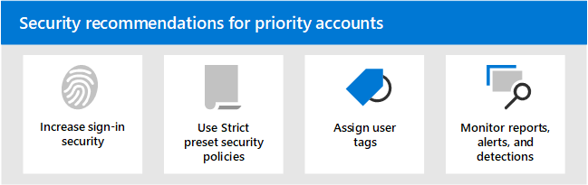

# 2016년 8월의 우선 순위 계정에 대한 보안 Microsoft 365

모든 사용자 계정이 동일한 회사 정보에 액세스할 수 있는 것은 없습니다. 일부 계정은 재무 데이터, 제품 개발 정보, 중요한 빌드 시스템에 대한 파트너 액세스 등의 중요한 정보에 액세스할 수 있습니다. 손상된 경우 고도로 기밀 정보에 액세스할 수 있는 계정은 심각한 위협을 안기게 됩니다. 이러한 유형의 계정 우선 순위 계정 _을 호출합니다._ 우선 순위 계정에는 CEOS, CISOS, CFOS, 인프라 관리자 계정, 시스템 계정 빌드 등이 포함됩니다(제한되지는는 않습니다).

공격자에 대해 일반 또는 알 수 없는 사용자에 대해 임의로 그망을 캐스팅하는 일반 피싱 공격은 비효율적입니다. 반면, 우선  순위 계정을 대상으로 하는  스피어 피싱 또는 래싱 공격은 공격자에게 매우 보상이 됩니다. 따라서 우선 순위 계정은 계정 손상을 방지하기 위해 일반 보호보다 더 강력해야 합니다.

Microsoft 365 및 Microsoft Defender for Office 365 계정에 추가 보안 계층을 제공하는 몇 가지 주요 기능이 포함되어 있습니다. 이 문서에서는 이러한 기능과 이러한 기능을 사용하는 방법에 대해 설명합니다.

 

****

|작업|모든 Office 365 Enterprise 계획|Microsoft 365 E3|Microsoft 365 E5|
|---|:---:|:---:|:---:|
|[우선 순위 계정에 대한 로그인 보안 강화](#increase-sign-in-security-for-priority-accounts)||||
|[우선 순위 계정에 대해 엄격한 미리 설정 보안 정책 사용](#use-strict-preset-security-policies-for-priority-accounts)||||
|[우선 순위 계정에 사용자 태그 적용](#apply-user-tags-to-priority-accounts)||||
|[경고, 보고서 및 검색에서 우선 순위 계정 모니터링](#monitor-priority-accounts-in-alerts-reports-and-detections)||||
|[사용자 교육](#train-users)||||
|

> [!NOTE]
> 권한 있는 계정(관리자 계정)의 보안에 대한 자세한 내용은 이 [항목을 참조하세요.](/azure/architecture/framework/security/critical-impact-accounts) 

## 우선 순위 계정에 대한 로그인 보안 강화

우선 순위 계정에는 증가된 로그인 보안이 요구됩니다. MFA(다단계 인증)를 요구하고 레거시 인증 프로토콜을 사용 안 하도록 설정하여 로그인 보안을 강화할 수 있습니다.

자세한 내용은 [1단계를 참조하세요. MFA를 사용하여](../../solutions/empower-people-to-work-remotely-secure-sign-in.md)원격 작업자에 대한 로그인 보안을 강화합니다. 이 문서는 원격 작업자에 대한 것이지만 우선 순위 사용자에게도 동일한 개념이 적용됩니다.

**참고:** 이전 문서에 설명된 모든 우선 순위 사용자에 대해 레거시 인증 프로토콜을 전역적으로 사용하지 않도록 설정하는 것이 좋습니다. 비즈니스 요구 사항으로 인해 이러한 작업을 수행하지 Exchange Online 레거시 인증 프로토콜의 범위를 제한하는 데 도움이 되는 다음 컨트롤을 제공합니다.

- 인증 [정책](/exchange/clients-and-mobile-in-exchange-online/disable-basic-authentication-in-exchange-online) 및  클라이언트 액세스 규칙을 Exchange Online POP3, IMAP4 및 인증된 SMTP와 같은 기본 인증 및 레거시 인증 프로토콜을 차단하거나 허용할 수 있습니다.

- 개별 사서함에서 POP3 및 IMAP4 액세스를 사용하지 않도록 설정할 수 있습니다. 조직 수준에서 인증된 SMTP를 사용하지 않도록 설정하고 여전히 필요한 특정 사서함에서 사용하도록 설정할 수 있습니다. 자세한 내용은 다음 문서를 참조하세요.
  - [사용자에 대해 POP3 또는 IMAP4 액세스 사용 또는 사용 안 하도록 설정](/exchange/clients-and-mobile-in-exchange-online/pop3-and-imap4/enable-or-disable-pop3-or-imap4-access)
  - [인증된 클라이언트 SMTP 전송 사용 또는 사용 안 하도록 설정(SMTP AUTH)](/exchange/clients-and-mobile-in-exchange-online/authenticated-client-smtp-submission)

또한 기본 인증은 EWS(Exchange Online 웹 서비스), Exchange, POP3, IMAP4 및 원격 PowerShell에 Exchange ActiveSync 사용되지 않습니다. 자세한 내용은 이 블로그 [게시물을 참조하세요.](https://developer.microsoft.com/office/blogs/deferred-end-of-support-date-for-basic-authentication-in-exchange-online/)

## 우선 순위 계정에 대해 엄격한 미리 설정 보안 정책 사용

우선 순위 사용자는 EOP(Exchange Online Protection) 및 Defender에서 사용할 수 있는 다양한 보호에 대해 더 엄격한 Office 365.

예를 들어 스팸으로 분류된 메시지를 정크 메일 폴더로 배달하는 대신 우선 순위 계정에 사용하려는 경우 동일한 메시지를 검지해야 합니다.

미리 설정한 보안 정책의 Strict 프로필을 사용하여 우선 순위 계정에 대해 이 엄격한 접근 방식을 구현할 수 있습니다.

미리 설정한 보안 정책은 EOP 및 보안용 Defender의 모든 보호에 대해 권장되는 Strict 정책 설정을 적용할 수 있는 편리하고 중앙 Office 365. 자세한 내용은 EOP에서 보안 정책 미리 설정 및 Microsoft [Defender for Office 365.](preset-security-policies.md)

Strict 정책 설정이 기본 및 표준 정책 설정과 어떻게 다른지 자세한 내용은 보안에 대한 EOP 및 Microsoft Defender에 대한 권장 [Office 365 참조하세요.](recommended-settings-for-eop-and-office365.md)

## 우선 순위 계정에 사용자 태그 적용

Office 365 계획 2용 Microsoft Defender의 사용자 태그(Microsoft 365 E5 또는 추가 기능 구독의 일부로)는 보고서 및 인시던트 조사에서 특정 사용자 또는 사용자 그룹을 빠르게 식별하고 분류하는 방법입니다.

우선 순위 **계정은** 우선 순위 계정과 관련된 인시던트 및 알림을 식별하는 데 사용할 수 있는 기본 제공 사용자 태그(시스템 태그라고도 하는) 유형입니다. 우선 순위 계정에 대한 **자세한 내용은** 우선 순위 계정 관리 [및 모니터링을 참조하세요.](../../admin/setup/priority-accounts.md)

사용자 지정 태그를 만들어 우선 순위 계정을 더 식별하고 분류할 수도 있습니다. 자세한 내용은 [사용자 태그를 참조하세요.](user-tags.md) 사용자 지정 **사용자** 태그와 동일한 인터페이스에서 우선 순위 계정(시스템 태그)을 관리할 수 있습니다.

## 경고, 보고서 및 검색에서 우선 순위 계정 모니터링

우선 순위 사용자를 보호하고 태그를 지정한 후 EOP 및 Defender에서 사용 가능한 보고서, 경고 및 조사를 사용하여 우선 순위 계정을 Office 365 인시던트 또는 검색을 빠르게 식별할 수 있습니다. 다음 표에서는 사용자 태그를 지원하는 기능에 대한 설명을 제공합니다.

 

****

|기능|설명|
|---|---|
|경고|영향을 받는 사용자의 사용자 태그는 알림 포털의 알림  페이지에서 표시되어 필터로 Microsoft 365 Defender 있습니다. 자세한 내용은 [경고 보기를 참조하세요.](../../compliance/alert-policies.md#viewing-alerts)|
|탐색기 
 실시간 탐지|탐색기(Office 365 계획 2용 Defender)  또는 실시간 검색(Office 365 계획 1용 Defender)에서는 전자 메일 그리드 보기 및 전자 메일 세부 정보 플라이아웃에 사용자 태그가 표시됩니다.  사용자 태그는 필터링 가능한 속성으로도 사용할 수 있습니다. 자세한 내용은 [탐색기에서 태그를 참조하세요.](threat-explorer.md#tags-in-threat-explorer)|
|캠페인 보기|사용자 태그는 Microsoft Defender for Office 365 필터링할 수 있는 속성 중 하나입니다. 자세한 내용은 캠페인 [보기를 참조하세요.](campaigns.md)|
|위협 방지 상태 보고서|위협 방지 상태 보고서의 거의 모든 보기 및 세부 정보 테이블에서 **우선** 순위 계정 을 사용하여 결과를 **필터링할 수 있습니다.** 자세한 내용은 위협 방지 상태 [보고서를 참조하세요.](view-email-security-reports.md#threat-protection-status-report)|
|우선 순위 계정 보고서에 대한 전자 메일 문제|**EAC(Exchange** 관리 센터)의 우선 순위 계정 보고서에 대한 전자 메일 문제에는 우선 순위 계정에 대한 미확인 및 지연된 메시지에 대한 **정보가 포함되어 있습니다.** 자세한 내용은 우선 순위 계정 [보고서에 대한 전자 메일 문제를 참조하세요.](/exchange/monitoring/mail-flow-reports/mfr-email-issues-for-priority-accounts-report)|
|

## 사용자 교육

사용자를 우선 순위 계정으로 교육하면 이러한 사용자와 보안 운영 팀을 훨씬 절약하고 좌절할 수 있습니다. 잘 아는 사용자는 첨부 파일을 열거나 의심스러운 전자 메일 메시지의 링크를 클릭할 가능성이 낮아 의심스러운 웹 사이트를 방지할 가능성이 더 습니다.

하버드 Kennedy [학교](https://www.belfercenter.org/CyberPlaybook) 사이버 보안 캠페인 지침은 피싱 공격을 식별하기 위한 교육을 포함하여 조직 내에서 강력한 보안 인식 문화를 설정하기 위한 훌륭한 지침을 제공합니다.

Microsoft 365 조직의 사용자에게 알리는 데 도움이 되는 다음 리소스를 제공합니다.

 

****

|개념|리소스|설명|
|---|---|---|
|Microsoft 365|[사용자 지정 가능한 학습 경로](/office365/customlearning/)|이러한 리소스는 조직의 사용자를 위한 교육을 구성하는 데 도움이 될 수 있습니다.|
|Microsoft 365 보안|[Learning 모듈: 기본 제공 지능형 보안 기능으로 조직을 Microsoft 365](/learn/modules/security-with-microsoft-365)|이 모듈에서는 보안 기능이 함께 Microsoft 365 방법을 설명하고 이러한 보안 기능의 이점을 설명할 수 있습니다.|
|다단계 인증|[2단계 인증: 추가 확인 페이지란?](/azure/active-directory/user-help/multi-factor-authentication-end-user-first-time)|이 문서는 최종 사용자가 다단계 인증이 무엇일지와 조직에서 사용되는 이유를 이해하는 데 도움이 됩니다.|
|공격 시뮬레이션 교육|[공격의 신나는 교육 사용 시작](attack-simulation-training-get-started.md)|Office 365 계획 2용 Microsoft Defender의 공격 시뮬레이션 교육을 통해 관리자는 특정 사용자 그룹에 대해 시뮬레이션된 피싱 공격을 구성, 실행 및 추적할 수 있습니다.|

또한 사용자가 해커와 맬웨어로부터 계정 및 장치 보호에 설명된 작업을 [수행할 것을 권장합니다.](https://support.microsoft.com/office/066d6216-a56b-4f90-9af3-b3a1e9a327d6) 이러한 작업은 다음과 같습니다.

- 강력한 암호 사용
- 장치 보호
- 관리되지 않는 Windows 10 및 Mac PC에서 보안 기능 사용

## 참고 항목

[Microsoft Defender에서 Microsoft Defender의 우선 순위 계정 보호 Office 365](https://techcommunity.microsoft.com/t5/microsoft-defender-for-office/announcing-priority-account-protection-in-microsoft-defender-for/ba-p/1696385)
