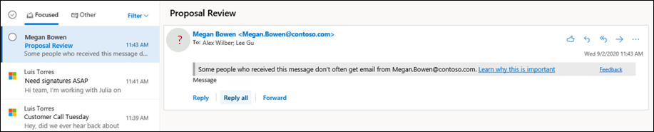

# 2016년 8월의 피싱 Microsoft 365

[!INCLUDE [Microsoft 365 Defender rebranding](../includes/microsoft-defender-for-office.md)]

**적용 대상**
- [Exchange Online Protection](exchange-online-protection-overview.md)
- [Office 365용 Microsoft Defender 플랜 1 및 플랜 2](defender-for-office-365.md)
- [Microsoft 365 Defender](../defender/microsoft-365-defender.md)

피싱 방지 보호 설정을 구성하는 정책은 Microsoft 365 사서함이 있는 Exchange Online 조직 Exchange Online Protection, Exchange Online 사서함이 없는 독립 실행형 EOP(독립 실행형 Exchange Online) 조직 및 Office 365 조직에서 사용할 수 있습니다.

조직에 대한 Microsoft Defender의 Office 365 예는 다음과 같습니다.

- Microsoft 365 Enterprise E5, Microsoft 365 Education A5 등
- [Microsoft 365 Enterprise](https://www.microsoft.com/microsoft-365/enterprise/home)
- [Microsoft 365 Business](https://www.microsoft.com/microsoft-365/business)
- [Microsoft Defender for Office 365 추가 기능으로 사용](https://products.office.com/exchange/advance-threat-protection)

다음 표에는 EOP의 피싱 방지 정책과 Defender for Office 365 피싱 방지 정책 간의 높은 수준의 차이점이 설명되어 있습니다.

 

****

|기능|EOP의 피싱 방지 정책|Defender for Office 365|
|---|:---:|:---:|
|자동으로 만들어진 기본 정책|||
|사용자 지정 정책 생성|||
|일반적인 정책 설정\*|||
|스푸핑 설정|||
|첫 번째 보안 팁|||
|가장 설정|||
|고급 피싱 임곗값|||
|

\* 기본 정책에서 정책 이름 및 설명은 읽기 전용(설명은 비어 있습니다)으로, 정책을 적용하는 사람을 지정할 수 없습니다(기본 정책은 모든 받는 사람에게 적용).

피싱 방지 정책을 구성하기 위해 다음 문서를 참조합니다.

- [EOP에서 스팸 방지 정책 구성](configure-anti-phishing-policies-eop.md)
- [Microsoft Defender에서 피싱 방지 정책 Office 365](configure-mdo-anti-phishing-policies.md)

이 문서의 나머지부분에서는 EOP 및 피싱 방지 정책에서 사용할 수 있는 설정에 대해 Office 365.

## 일반적인 정책 설정

다음 정책 설정은 EOP의 피싱 방지 정책 및 EOP용 Defender에서 사용할 수 Office 365.

- **이름:** 기본 피싱 방지 정책의 이름을 변경할 수 없습니다. 사용자 지정 피싱 방지 정책을 만든 후 사용자 지정 포털에서 정책 이름을 Microsoft 365 Defender 없습니다.

- **설명** 기본 피싱 방지 정책에는 설명을 추가할 수 없지만 만드는 사용자 지정 정책에 대한 설명을 추가하고 변경할 수 있습니다.

- **사용자, 그룹 및 도메인:** 피싱 방지 정책이 적용되는 내부 받는 사람을 식별합니다. 이 값은 사용자 지정 정책에 필요하며 기본 정책에서는 사용할 수 없습니다(기본 정책은 모든 받는 사람에게 적용).

  조건이나 예외는 한 번만 사용할 수 있지만, 조건이나 예외에 대한 값을 여러 개 지정할 수 있습니다. 동일한 조건의 여러 값이나 예외는 OR 논리를 사용합니다(예: _\<recipient1\>_ 혹은 _\<recipient2\>_). 다양한 조건이나 예외는 AND 논리를 사용합니다(예: _\<recipient1\>_ 및 _\<member of group 1\>_).

  - **사용자:** 조직에 있는 하나 이상의 사서함, 메일 사용자 또는 메일 연락처입니다.
  - **그룹:** 조직에 있는 하나 이상의 그룹입니다.
  - **도메인:** 도메인에 구성된 하나 이상의 허용 [도메인이](/exchange/mail-flow-best-practices/manage-accepted-domains/manage-accepted-domains) Microsoft 365.

  - **이러한 사용자, 그룹 및 도메인** 제외: 정책에 대한 예외. 설정 및 동작은 조건과 정확히 같습니다.
    - **사용자**
    - **그룹**
    - **도메인**

  > [!NOTE]
  > 사용자 지정 피싱  방지 정책에 정책이 적용되는 메시지 받는 사람을 식별하려면 사용자,  그룹 및 도메인 설정에서 하나 이상의 선택이 <u>필요합니다.</u> Defender for Office 365 피싱 방지 정책에는 이  문서의 나중에 설명된 바와 같이 가장 보호를 <u></u> 받을 개별 보낸 사람 전자 메일 주소 또는 보낸 사람 도메인을 지정할 수 있는 가장 설정도 있습니다.

## 스푸핑 설정

스푸핑은 전자 메일 메시지의 보낸 사람 주소(전자 메일 클라이언트에 표시된 보낸 사람 주소)가 전자 메일 원본의 도메인과 일치하지 않는 경우입니다. 스푸핑에 대한 자세한 내용은 에서 스푸핑 방지 [보호를 Microsoft 365.](anti-spoofing-protection.md)

다음 스푸핑 설정은 EOP의 피싱 방지 정책 및 피싱 방지 정책에서 사용할 수 Office 365.

- **스푸핑 인텔리전스 사용:** 스푸핑 인텔리전스를 설정하거나 해제합니다. 켜져 있는 그대로 두는 것이 좋습니다.

  스푸핑 인텔리전스를  사용하도록 설정하면 스푸핑 인텔리전스 인사이트는 스푸핑 인텔리전스에서 자동으로 검색 및 허용되거나 차단된 스푸핑된 보낸 사람입니다. 스푸핑 인텔리전스 판정을 수동으로 다시 조정하여 검색된 스푸핑된 보낸 사람이 인사이트 내에서 이를 허용하거나 차단할 수 있습니다. 하지만 스푸핑된 보낸 사람이 스푸핑 인텔리전스 인사이트에서 사라지고 테넌트 허용/차단 목록의 스푸핑 탭에만 표시됩니다.  테넌트 허용/차단 목록에서 스푸핑된 보낸 사람에 대한 허용 또는 차단 항목을 수동으로 만들 수도 있습니다. 자세한 내용은 다음 문서를 참조하세요.

  - [EOP의 스푸핑 인텔리전스 정보](learn-about-spoof-intelligence.md)
  - [EOP에서 테넌트 허용/차단 목록 관리](tenant-allow-block-list.md)

  > [!NOTE]
  >
  > - 스푸핑 방지 보호는 기본적으로 기본 피싱 방지 정책과 새로 만드는 사용자 지정 피싱 방지 정책에서 사용하도록 설정됩니다.
  > - MX 레코드가 스푸핑 방지를 설정하지 않는 경우 스푸핑 방지 보호 기능을 사용하지 않도록 설정할 Microsoft 365. 대신 커넥터에 대해 향상된 필터링을 사용하도록 설정할 수 있습니다. 자세한 내용은 [에서 커넥터에](/Exchange/mail-flow-best-practices/use-connectors-to-configure-mail-flow/enhanced-filtering-for-connectors)대한 향상된 필터링을 Exchange Online.
  > - 스푸핑 방지 보호 기능을 사용하지 않도록  설정하면 복합 인증 검사에서 암시적 스푸핑 보호 기능만 [사용할 수](email-validation-and-authentication.md#composite-authentication) 있습니다. 보낸 사람이 정책이  quarantine 또는 reject로 설정된 위치를 [명시적 DMARC](use-dmarc-to-validate-email.md) 검사에 실패하면 메시지는 여전히 검리되거나 거부됩니다.

- **무단 보낸** 사람 알림: 이러한 알림은 스푸핑 인텔리전스가 켜져 있는 경우만 사용할 수 있습니다. 다음 섹션의 정보를 참조하세요.
- **작업:** 차단된 스푸핑된 보낸 사람(스푸핑 인텔리전스에 의해 자동으로 차단되거나 테넌트 허용/차단 목록에서 수동으로 차단)의 메시지에 대해 메시지에 대해 수행할 작업을 지정할 수도 있습니다.
  - **받는 사람의** 정크 메일 폴더로 메시지 이동 : 이 값은 기본값입니다. 메시지가 사서함으로 배달된 후 정크 메일 폴더로 이동됩니다. 이 Exchange Online 사서함에서 정크 메일 규칙이 사용하도록 설정된 경우 메시지가 정크 메일 폴더로 이동됩니다(기본적으로 사용하도록 설정). 자세한 내용은 [Configure junk email settings on Exchange Online mailboxes in Microsoft 365.](configure-junk-email-settings-on-exo-mailboxes.md)
  - **메시지 Quarantine the message**: Sends the message to quarantine instead of the intended recipients. 격리에 대한 자세한 내용은 다음 게시물을 참조하세요.
    - [Microsoft 365](quarantine-email-messages.md)
    - [2016년 8월에 관리자로 quarantined messages and files Microsoft 365](manage-quarantined-messages-and-files.md)
    - [2016년 8월에 사용자로 확인된 메시지 찾기 및 Microsoft 365](find-and-release-quarantined-messages-as-a-user.md)

    메시지의 **검역을** 선택하는 경우 스푸핑 인텔리전스 보호로 검역된 메시지에 적용되는 검역 정책을 선택할 수도 있습니다. Quarantine policies define what users are able to quarantined messages. 자세한 내용은 [격리 정책](quarantine-policies.md)을 참조하세요.

### 비인식 보낸 사람

이 확인되지 않은 보낸 사람 알림은 이전  섹션에 설명된 바와 같이 EOP의 피싱 방지 정책 및 Office 365 정책에서 사용할 수 있는 스푸핑 설정의 일부입니다. 다음 설정은 스푸핑 인텔리전스가 켜져 있는 경우만 사용할 수 있습니다.

- 스푸핑을 위해 인증되지 않은 보낸 사람에 대한 표시(?) : 이 알림은 메시지가 SPF 또는 DKIM 확인을 통과하지 못하고 메시지가  DMARC 또는 복합 인증을 통과하지 않는 경우 보낸 사람 상자에 보낸 사람 사진에 물음표가 추가됩니다.  이 설정을 해제하면 보낸 사람 사진에 물음표가 추가되지 않습니다.

- **"via"** 태그 표시: 이 알림은 보낸 사람 주소(전자 메일 클라이언트에 표시되는 메시지 보낸 사람)의 도메인이 DKIM 서명 또는 **MAIL FROM** 주소의 도메인과 다른 경우 보낸 사람 상자에 via 태그(chris@contoso.com <u>통해</u> fabrikam.com)를 추가합니다. 이러한 주소에 대한 자세한 내용은 전자 메일 메시지 표준 [개요를 참조하세요.](how-office-365-validates-the-from-address.md#an-overview-of-email-message-standards)

물음표 또는 태그를 통해 특정 보낸 사람이 보낸 메시지에 추가되지 않도록 설정하기 위해 다음 옵션을 사용할 수 있습니다.

- 스푸핑된 보낸 사람이 스푸핑 인텔리전스 정보에서 허용하거나 테넌트 허용/차단 목록에서 수동으로 [허용합니다.](tenant-allow-block-list.md)  스푸핑된 보낸 사람 ID를 사용하지 않도록 설정하면 스푸핑된 보낸 사람이 보낸 메시지에 via 태그가 나타나지 않도록 할 수 있습니다.
- [보낸 사람 도메인에](email-validation-and-authentication.md#configure-email-authentication-for-domains-you-own) 대한 전자 메일 인증을 구성합니다.
  - 보낸 사람 사진의 물음표에 대해 SPF 또는 DKIM이 가장 중요합니다.
  - via 태그의 경우 DKIM 서명의 도메인 또는 **MAIL FROM** 주소가 보낸 편지함 주소의 도메인과 일치하는지(또는 해당 도메인의 하위 도메인인 경우) 확인

자세한 내용은 [Outlook.com에서](https://support.microsoft.com/office/3d44102b-6ce3-4f7c-a359-b623bec82206) 의심스러운 메시지 식별 및 웹용 Outlook

## 첫 번째 보안 팁

첫 **번째 보안 팁** 표시 Office 365 조직에 대해 EOP 및 Defender에서 사용할 수 있으며 스푸핑 인텔리전스 또는 가장 보호 설정에 종속되지 않습니다. 이 보안 팁 다음 시나리오에서 받는 사람에게 표시됩니다.

- 보낸 사람으로부터 메시지를 처음 받을 때
- 보낸 사람으로부터 메시지를 받을 수 없는 경우가 자주 있습니다.

이 기능을 사용하면 잠재적인 가장 공격으로부터 보안을 강화할 수 있으므로 이 기능을 설정하는 것이 좋습니다.

첫 번째 보안 팁 **X-MS-Exchange-EnableFirstContactSafetyTip이라는** 헤더를 **메시지에 사용(이** 기능을 계속 사용할 수 있는 경우)을 추가하는 메일 흐름 규칙(전송 규칙)을 만들 필요가 없습니다.

> [!NOTE]
> 메시지에 받는 사람이 여러 명인 경우 팁이 표시되는지 여부와 다수 모델을 기반으로 하는 사람입니다. 대부분의 받는 사람이 보낸 사람으로부터 메시지를 받지 못하거나 자주 받지 않는 경우 영향을 받는 사람에게 이 메시지를 받은 일부 **사용자...** 팁이 표시됩니다. 이 동작이 한 받는 사람의 통신 습관을 다른 받는 사람에게 노출하는 것이 우려되는 경우 첫 번째 연락처 보안 팁 대신 메일 흐름 규칙을 계속 사용하도록 설정하면 안 됩니다.

## Microsoft Defender for Office 365

이 섹션에서는 Defender for Office 365.

> [!NOTE]
> Defender for Office 365 피싱 방지 정책은 모든  받는 사람에게 스푸핑 보호 및 사서함 인텔리전스를 제공합니다. 그러나 사용 가능한  다른 가장 보호  기능 및 고급 설정은 기본 정책에서 구성되거나 사용하도록 설정되지 않습니다. 모든 보호 기능을 사용하도록 설정하려면 기본 피싱 방지 정책을 수정하거나 추가 피싱 방지 정책을 만들 수 있습니다.

### Microsoft Defender for Office 365

가장은 메시지의 보낸 사람 또는 보낸 사람 전자 메일 도메인이 실제 보낸 사람 또는 도메인과 유사하게 보이는 위치입니다.

- 도메인 contoso.com의 가장 예는 ćóntoso.com입니다.
- 사용자 michelle@contoso.com의 가장 예는 michele@contoso.com입니다.

> [!NOTE]
> 가장 보호는 유사한 도메인을 검색합니다. 예를 들어 도메인이 contoso.com 경우 가장 시도로 서로 다른 최상위 도메인(.com, .biz 등)과 다소 유사한 도메인도 검사합니다. 예를 들어 contosososo.com contoabcdef.com 가장 시도로 볼 수 contoso.com.

가장된 도메인은 받는 사람을 속이려는 의도가 있다는 것을 제외하고 합법적(등록된 도메인, 구성한 전자 메일 인증 기록 등)으로 간주될 수 있습니다.

다음 가장 설정은 Defender에서 피싱 방지 정책에서만 사용할 수 Office 365.

- **사용자가 보호할** 수 있도록 설정 : 지정된 내부 또는 외부 전자 메일 주소가 메시지 보낸 사람으로 **가장되지 않도록 합니다.** 예를 들어 회사의 부사장에게 내부 회사 정보를 보내달라는 전자 메일 메시지를 받게 됩니다. 이 작업을 하나요? 많은 사람들이 생각하지 않고 회신을 보내고 있습니다.

  보호된 사용자를 사용하여 내부 및 외부 보낸 사람 전자 메일 주소를 추가하여 가장으로부터 보호할 수 있습니다. 사용자 가장으로부터 보호되는 보낸 사람 목록은 정책이 적용되는 받는  사람 목록(기본 정책의 모든 받는 사람, 일반 정책 설정 섹션의 **사용자,** 그룹 및 도메인  설정에 구성된 특정 받는 사람)과 다릅니다. 

  > [!NOTE]
  >
  > - 각 피싱 방지 정책에서 보호되는 사용자(보낸 사람 전자 메일 주소)를 최대 350명까지 지정할 수 있습니다. 동일한 보호된 사용자를 여러 정책에 지정할 수 없습니다. 따라서 받는 사람에게 적용되는 정책의 수에 관계없이 각 개별 받는 사람에 대해 보호되는 사용자(보낸 사람 전자 메일 주소)의 최대 수는 350개입니다. 정책 우선 순위 및 첫 번째 정책이 적용된 후 정책 처리가 중지되는 방법에 대한 자세한 내용은 전자 메일 보호의 순서 및 우선 [순위를 참조하세요.](how-policies-and-protections-are-combined.md)
  > - 보낸 사람 및 받는 사람이 이전에 전자 메일을 통해 통신한 경우 사용자 가장 보호가 작동하지 않습니다. 보낸 사람 및 받는 사람이 전자 메일을 통해 통신한 적이 없는 경우 가장 시도로 메시지가 식별됩니다.

  기본적으로 사용자가 보호할 가장 보호를 위해 보낸 사람 전자 메일 주소는 **구성되지 않습니다.** 따라서 기본적으로 기본 정책이나 사용자 지정 정책에서 보낸 사람 전자 메일 주소에 가장 보호가 적용되지 않습니다.

  사용자 목록에 내부 또는 외부  전자 메일 주소를 추가하여  보호할 경우 해당 보낸 사람이 보낸 메시지에 가장 보호 검사가 적용됩니다. 메시지가 정책이 적용되는 받는 사람(기본 정책의 모든  받는 사람)에게 메시지를 보낼 경우 가장이 확인됩니다.  **사용자 지정 정책의 사용자,** 그룹 및 도메인 받는 사람). 보낸 사람 전자 메일 주소에서 가장이 감지되면 사용자에 대한 가장 보호 작업이 메시지에 적용됩니다(메시지로 수행할 작업, 가장된 사용자 보안 팁 표시 여부 등).

- **도메인 보호** 사용 : 지정된 도메인이 메시지 보낸 사람 도메인에서 가장되지 **않도록 합니다.** 예를 들어 소유한 모든 도메인(허용[도메인)](/exchange/mail-flow-best-practices/manage-accepted-domains/manage-accepted-domains)또는 특정 사용자 지정 도메인(소유한 도메인 또는 파트너 도메인)입니다. 가장으로부터  보호되는 보낸 사람 도메인 목록은 정책이 적용되는 받는  사람 목록(기본 정책의 모든 받는 사람, 일반 정책 설정 섹션의 **사용자,** 그룹 및 도메인 설정에 구성된 특정 받는 사람) 목록과 다릅니다. 

  > [!NOTE]
  > 모든 피싱 방지 정책에서 정의할 수 있는 보호된 도메인의 최대 수는 50개입니다.

  기본적으로 보호할 도메인 사용의 가장 보호를 위해 보낸 **사람 도메인은 구성되지 않습니다.** 따라서 기본적으로 보낸 사람 도메인은 기본 정책이나 사용자 지정 정책에서 가장 보호가 적용되지 않습니다.

  도메인을 보호할 수  있도록 설정 목록에 도메인을  추가하면 해당 도메인의 보낸 사람이 보낸 메시지에 가장 보호 검사가 적용됩니다. 메시지가 정책이 적용되는 받는 사람(기본 정책의 모든  받는 사람)에게 메시지를 보낼 경우 가장이 확인됩니다.  **사용자 지정 정책의 사용자,** 그룹 및 도메인 받는 사람). 보낸 사람 도메인에서 가장이 감지되면 도메인에 대한 가장 보호 작업이 메시지에 적용됩니다(메시지로 수행할 작업, 가장된 사용자 보안 팁 표시 여부 등).

- **작업:** 정책의 보호된 사용자 및 보호된 도메인에 대해 가장 시도가 포함된 인바운드 메시지에 대해 수행할 작업을 선택하십시오. 보호된 사용자 가장과 보호된 도메인의 가장에 대해 서로 다른 작업을 지정할 수 있습니다.
  - **어떤 작업도 적용하지 않습니다.**
  - **메시지를 다른** 전자 메일 주소로 리디렉션: 지정된 받는 사람이 아닌 지정된 받는 사람에게 메시지를 보냅니다.
  - **받는 사람의** 정크 메일 폴더로 메시지 이동: 메시지가 사서함으로 배달된 후 정크 메일 폴더로 이동됩니다. 이 Exchange Online 사서함에서 정크 메일 규칙이 사용하도록 설정된 경우 메시지가 정크 메일 폴더로 이동됩니다(기본적으로 사용하도록 설정). 자세한 내용은 [Configure junk email settings on Exchange Online mailboxes in Microsoft 365.](configure-junk-email-settings-on-exo-mailboxes.md)
  - **메시지 Quarantine the message**: Sends the message to quarantine instead of the intended recipients. 격리에 대한 자세한 내용은 다음 게시물을 참조하세요.
    - [Microsoft 365](quarantine-email-messages.md)
    - [2016년 8월에 관리자로 quarantined messages and files Microsoft 365](manage-quarantined-messages-and-files.md)
    - [2016년 8월에 사용자로 확인된 메시지 찾기 및 Microsoft 365](find-and-release-quarantined-messages-as-a-user.md)

    메시지 **검역을** 선택하는 경우 사용자 가장 또는 도메인 가장 보호에 의해 검역된 메시지에 적용되는 검역 정책을 선택할 수도 있습니다. Quarantine policies define what users are able to quarantined messages. 자세한 내용은 [격리 정책](quarantine-policies.md)을 참조하세요.

  - **메시지를 배달하고 Bcc** 줄에 다른 주소를 추가합니다. 메시지를 의도된 받는 사람에게 배달하고 지정된 받는 사람에게 자동으로 배달합니다.
  - **배달되기** 전에 메시지 삭제: 모든 첨부 파일을 포함하여 전체 메시지를 자동으로 삭제합니다.

- **가장 보안 팁:** 가장 검사에 실패한 메시지를 표시하는 다음 가장 안전 팁을 설정하거나 해제합니다.
  - **가장된 사용자에 대한** 팁 표시: 시작 주소에는 사용자가 사용자를 보호할 **수 있도록 설정이 포함되어** 있습니다. 사용자가 보호할 수 **있도록 설정이** 켜져 있으며 구성된 경우만 사용할 수 있습니다.
  - **가장된 도메인에** 대한 팁 표시: 시작 주소에는 도메인을 보호할 수 있는 **도메인이 포함되어** 있습니다. 도메인을 **보호할** 수 있도록 설정이 켜져 있으며 구성된 경우만 사용할 수 있습니다.
  - 비정상적인 문자에 대한 팁 **표시:** 보낸 사람 주소에는 사용자가 보낸 사람 또는 도메인을 사용하여 보낸 사람 도메인을 보호할 수 있도록 설정의  비정상적인 문자 집합(예: 수학 기호 및 텍스트 또는 대문자 및 소문자 혼합)이 포함되어 있습니다.   사용자가 **보호할 수 있도록**   설정 또는 보호할 도메인 사용이 켜져 있으며 구성된 경우만 사용할 수 있습니다.

- **사서함 인텔리전스** 사용: 자주 연락하는 사용자 전자 메일 패턴을 결정하는 AI(인공 지능)를 활성화하거나 사용하지 않도록 합니다. 이 설정은 AI가 합법적인 보낸 사람 및 가장된 보낸 사람과 메시지를 구분하는 데 도움이 됩니다.

  예를 들어 Gabriela Laureano(glaureano@contoso.com)는 회사의 CEO이기 때문에 사용자가 정책 설정을 보호할  수 있도록 설정에서 보호된 보낸 사람으로 추가합니다. 그러나 정책이 적용되는 받는 사람 중 일부는 Gabriela Laureano(glaureano@fabrikam.com)라는 공급업체와 정기적으로 통신합니다. 이러한 받는 사람이 해당 받는 glaureano@fabrikam.com 통신 기록이 있기 때문에 사서함 인텔리전스에서는 해당 받는 glaureano@fabrikam.com 가장 시도로 glaureano@contoso.com 식별하지 않습니다.

  사서함 인텔리전스에 의해 학습된(및 이러한 연락처가 부족함) 자주 연락하여 사용자를 가장 공격으로부터 보호하려면 사서함 인텔리전스 사용을 켜고 나면 인텔리전스 가장 보호 사용을 으로 설정하면 **됩니다.** 

- **인텔리전스** 가장 보호 사용: 이 설정을 켜서 사서함 인텔리전스 결과에서 가장 감지를 위해 메시지에 대해 취할 작업을 지정합니다.
  - **아무 작업도 적용하지** 않습니다. 이 값은 사서함 인텔리전스를 켜고 인텔리전스 가장 보호 사용은 해제하는 경우와 결과가 **같습니다.** 
  - **메시지를 다른 전자 메일 주소로 리디렉션**
  - **받는 사람의 정크 메일 폴더로 메시지 이동**
  - **메시지 Quarantine the message:** If you select this action, you can also select the quarantine policy that applies to messages that are quarantined by mailbox intelligence protection. Quarantine policies define what users are able to quarantined messages. 자세한 내용은 [격리 정책](quarantine-policies.md)을 참조하세요.
  - **메시지를 배달하고 Bcc 줄에 다른 주소를 추가합니다.**
  - **배달되기 전에 메시지 삭제**

- **신뢰할 수 있는 보낸 사람 및 도메인** 추가: 가장 보호 설정에 대한 예외입니다. 지정된 보낸 사람 및 보낸 사람 도메인의 메시지는 정책에 의해 가장 기반 공격으로 분류되지 않습니다. 즉, 보호된 보낸 사람, 보호된 도메인 또는 사서함 인텔리전스 보호에 대한 작업은 이러한 신뢰할 수 있는 보낸 사람 또는 보낸 사람 도메인에 적용되지 않습니다. 이러한 목록의 최대 제한은 1024개 항목입니다.

### Microsoft Defender for Office 365

다음 고급 피싱 임계값은 피싱 방지 정책의 Defender에서만 사용할 수 Office 365. 이러한 임계값은 메시지에 기계 학습 모델을 적용하여 피싱 판정을 결정하는 민감도를 제어합니다.

- **1 - 표준:** 이 값은 기본값입니다. 메시지에 수행되는 작업의 심각도는 메시지의 피싱 신뢰도(낮음, 보통, 높음 또는 매우 높은 신뢰도)에 따라 달라 습니다. 예를 들어 신뢰도가 매우 높은 피싱으로 식별된 메시지에는 가장 심각한 작업이 적용되고 신뢰도가 낮은 피싱으로 식별된 메시지는 심각도가 낮은 작업이 적용되지 않습니다.
- **2 - 적극적**: 신뢰도가 높은 피싱으로 식별된 메시지는 매우 높은 신뢰도로 식별된 것으로 간주됩니다.
- **3 -** 보다 적극적인 : 보통 또는 높은 수준의 신뢰도로 피싱으로 식별된 메시지는 매우 높은 신뢰도로 식별된 것으로 간주됩니다.
- **4 -** 가장 적극적: 낮은 신뢰도, 보통 또는 높은 신뢰도로 피싱으로 식별된 메시지는 매우 높은 신뢰도로 식별된 것으로 처리됩니다.

이 설정을 늘리면 가음성(양호한 것으로 표시된 양호한 메시지)의 가능성이 증가합니다. 권장 설정에 대한 자세한 내용은 Microsoft Defender의 피싱 방지 정책에서 Office 365 [참조하세요.](recommended-settings-for-eop-and-office365.md#anti-phishing-policy-settings-in-microsoft-defender-for-office-365)
