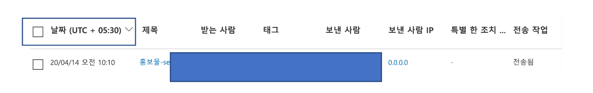
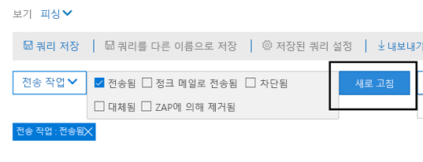
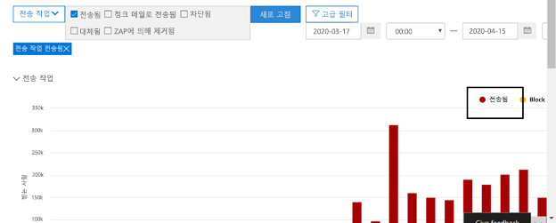
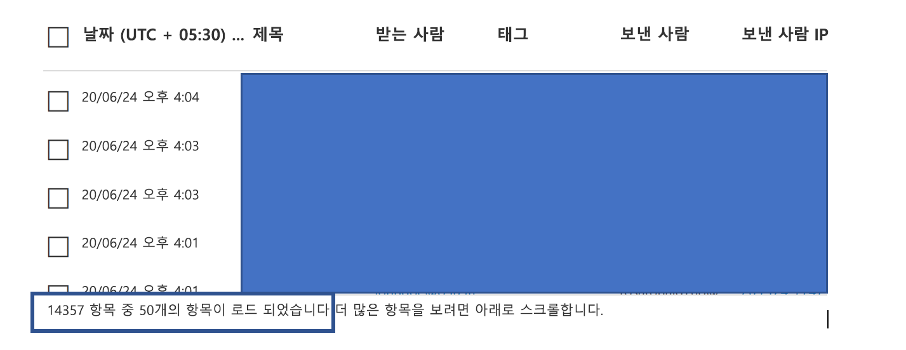

# 위협 탐색기 및 실시간 검색Threat Explorer and real-time detections

조직에 [office 365 Advanced Threat Protection](office-365-atp.md) (OFFICE 365 ATP)이 있고 [필요한 사용 권한이](#required-licenses-and-permissions)있는 경우에는 **Explorer** 또는 **실시간** 검색 (이전에는 [새로운 기능을 참조 하세요](#new-features-in-threat-explorer-and-real-time-detections) *.)을* 수행 해야 합니다.If your organization has [Office 365 Advanced Threat Protection](office-365-atp.md) (Office 365 ATP), and you have the [necessary permissions](#required-licenses-and-permissions), you have either **Explorer** or **real-time detections** (formerly *real-time reports* — [see what's new](#new-features-in-threat-explorer-and-real-time-detections)!). 보안 & 준수 센터에서 **위협 관리**로 이동한 다음 **Explorer** _또는_ **실시간**검색을 선택 합니다.In the Security & Compliance Center, go to **Threat management**, and then choose **Explorer** _or_ **Real-time detections**.

| ATP 계획 2를 사용 하는 경우 다음을 확인할 수 있습니다.With ATP Plan 2, you see: | ATP 계획 1을 사용 하는 경우 다음을 확인할 수 있습니다.With ATP Plan 1, you see: |
|---|---|
|||
|

Explorer (또는 실시간 검색)를 사용 하는 경우 보안 운영 팀이 효과적이 고 효율적으로 위협을 조사 하 고 대응 하는 데 사용할 수 있는 강력한 보고서가 있습니다.With Explorer (or real-time detections), you have a powerful report that enables your Security Operations team to investigate and respond to threats effectively and efficiently. 보고서는 다음 이미지와 유사 합니다.The report resembles the following image:

이 보고서를 사용 하 여 다음을 수행할 수 있습니다.With this report, you can:

- [Microsoft 365 보안 기능으로 검색 된 맬웨어를 참조 하세요.See malware detected by Microsoft 365 security features](#see-malware-detected-in-email-by-technology)
- [피싱 Url에 대 한 데이터를 확인 하 고 결과를 클릭 합니다.View data about phishing URLs and click verdict](#view-data-about-phishing-urls-and-click-verdict)
- [탐색기에서 보기 로부터 자동화 된 조사 및 응답 프로세스 시작](#start-automated-investigation-and-response) (ATP 요금제 2에만 해당)[Start an automated investigation and response process from a view in Explorer](#start-automated-investigation-and-response) (ATP Plan 2 only)
- ... [악성 전자 메일을 조사 하 고 더 많은 방법을 확인해](#more-ways-to-use-explorer-or-real-time-detections)보세요.... [Investigate malicious email, and more](#more-ways-to-use-explorer-or-real-time-detections)!

## 위협 탐색기 및 실시간 검색 기능이 향상 되었습니다.Experience Improvements to Threat Explorer and Real-Time Detections

검색 프로세스를 개선 하는 과정에서 위협 탐색기 및 실시간 검색에 대 한 몇 가지 업데이트를 수행 했습니다.As part of improving the hunting process, we have made a few updates to Threat Explorer and Real-Time Detections. 이러한 기능은 개선 된 경험을 보다 일관성 있게 만드는 데 중점을 둔 ' 경험 ' 향상 기능입니다.These are ‘experience’ improvements, with the focus on making the hunting experience more consistent. 이러한 변경 내용은 아래에 설명 되어 있습니다.These changes are outlined below: 

- [향상 된 표준 시간대Timezone improvements](#timezone-improvements)
- [새로 고침 프로세스의 업데이트Update in the Refresh process](#update-in-the-refresh-process)
- [필터에 추가할 차트 드릴 다운Chart drilldown to add to filters](#chart-drilldown-to-add-to-filters)
- [제품 정보 업데이트In product information updates](#in-product-information-updates)

### 향상 된 표준 시간대Timezone improvements 

또한 포털 내의 전자 메일 레코드에 대 한 표준 시간대와 내보낸 데이터에 대 한 정보를 표시 합니다.We will show the timezone for the email records within the Portal, as well as for Exported data. 표준 시간대는 전자 메일 표, 세부 정보 플라이 아웃, 전자 메일 일정 및 유사한 전자 메일 같은 경험을 통해 표시 되므로 결과 집합에 대 한 표준 시간대가 사용자에 게 분명 하 게 제공 됩니다.The timezone will be visible across experiences like Email Grid, Details Flyout, Email Timeline, and Similar Emails, so that the timezone for the result set is clear to the user. 

### 새로 고침 프로세스의 업데이트Update in the Refresh process 

자동 새로 고침을 사용한 혼동에 대 한 의견을 들었습니다 (예: 날짜를 변경 하는 즉시, 페이지를 새로 고치는 작업) 및 수동 새로 고침 (기타 필터에 대 한 경우).We have heard feedback around confusion with automatic refresh (e.g. for date, as soon as you change the date, the page would refresh) and manual refresh (for other filters). 마찬가지로, 필터를 제거 하면 자동 새로 고침이 실행 되므로 쿼리를 수정 하는 동안 다른 필터를 변경 하면 검색 환경이 일치 하지 않을 수 있습니다.Similarly, removing filters leads to automatic refresh, this causes situations where changing the different filters while modifying the query can cause inconsistent search experiences. 이를 해결 하기 위해 수동 필터링 메커니즘으로 이동 하 고 있습니다.To solve this, we are moving to a manual filtering mechanism.
경험 측면에서 볼 때 사용자는 필터 집합 및 날짜에서 서로 다른 필터 범위를 적용 하 고 제거할 수 있으며, 새로 고침 단추를 눌러 쿼리 정의 작업을 완료 한 후에 결과를 필터링 할 수도 있습니다.From an experience standpoint, the user can apply and remove the different range of filters (from the filter set, and date), and press the refresh button to filter the results once they are done with defining the query. 화면에서 명확 하 게 전화를 걸기 위해 새로 고침 단추도 업데이트 되었습니다.The refresh button has also been updated to call it out clearly on the screen. 또한이 변경 사항에 대 한 도구 설명 및 제품 설명서도 업데이트 되었습니다.We have also updated tooltips and in-product documentation around this change. 

### 필터에 추가할 차트 드릴 다운Chart drilldown to add to filters

이제 차트 범례 값을 클릭 하 여 해당 값을 필터로 추가할 수 있습니다.You will now be able to click on the chart legend values to add that value as a filter. 위에서 설명한 변경 내용의 일부로 결과를 필터링 하려면 새로 고침 단추를 클릭 해야 합니다.Note that you will still have to click on the refresh button to filter the results as part of the change described above.

### 제품 정보 업데이트In product information updates 

제품 내에 추가 정보도 표시 해야 합니다.You should also see additional details within the product. 예를 들어 표 내에 있는 총 검색 결과 수 (아래 참조)와 레이블 주위의 향상 된 기능, 필터, 검색 환경 및 결과 집합에 대 한 자세한 정보를 제공 하기 위해 오류 메시지와 도구 설명이 표시 됩니다.For example, the total number of search results within grid (see below), as well as improvements around labels, error messages and tooltips, to give more information around filters, search experience, and result set. 

## 실시간 검색의 새로운 기능New features in real-time detections

## 위협 탐색기 및 실시간 검색의 새로운 기능New features in Threat Explorer and real-time detections

위협 탐색기 및 실시간 검색에 다음과 같은 세 가지 새로운 기능이 추가 되었습니다.Three new features added into Threat Explorer and real-time detections:

- [전자 메일 머리글 미리 보기 및 전자 메일 본문 다운로드Preview email header and download email body](#preview-email-header-and-download-email-body)
- [전자 메일 시간 표시 막대Email timeline](#email-timeline)
- [URL 내보내기 데이터 클릭Export URL click data](#export-url-click-data)

이러한 새로운 기능은 아래에 설명 되어 있습니다.These new features are outlined below.

### 전자 메일 머리글 미리 보기 및 전자 메일 본문 다운로드Preview email header and download email body

전자 메일 머리글을 미리 보고 전자 메일 본문을 다운로드 하는 기능은 위협 탐색기에서 사용할 수 있는 새로운 기능입니다.The ability to preview an email header and download the email body are new features available in Threat Explorer. 관리자가 다운로드 한 헤더/전자 메일 메시지를 분석 하 여 위협을 분석할 수 있습니다.Admins will be able to analyze downloaded headers/email messages for threats. 전자 메일 메시지를 다운로드 하면 정보의 노출을 초래할 수 있으므로이 프로세스는 RBAC (역할 기반 액세스 제어)를 통해 제어 됩니다.Because downloading email messages can risk the exposure of information, this process is controlled by roles-based access control (RBAC). 모든 전자 메일 메시지 보기에서 메일을 다운로드 하 고 머리글을 미리 볼 수 있도록 하려면 새 역할인 *미리 보기*를 다른 역할 그룹 (예: 보안 작업 또는 보안 관리자)에 추가 해야 합니다.A new role, *Preview*, must be added to another role group (such as Security Operations or Security Administrator) to grant the ability to download mails and preview headers in all-email messages view.

그러나 Explorer (및 실시간 검색)도 새로운 새 필드를 추가 하 여 전자 메일 메시지가 있는 위치를 보다 완전 하 게 파악할 수 있습니다.But Explorer (and real-time detections) also adds fresh new fields designed to give you a more complete picture of where your email messages land. 이러한 변경 목표의 일환으로는 보안 Ops 사용자에 게 더 쉽게 사냥을 제공할 수 있지만 문제 전자 메일 메시지의 위치를 한눈에 파악 하는 것은 아닙니다.Part of the goal of this change is to make hunting easier for Security Ops people, but the net result is knowing the location of problem email messages at a glance.

어떤 작업을 수행 하나요?How is this done? 배달 상태는 이제 다음과 같은 두 개의 열로 나뉩니다.Delivery Status is now broken out into two columns:

- **배달 작업** -이 전자 메일의 상태는 무엇입니까?**Delivery Action** - What is the status of this email?
- **배달 위치** -이 전자 메일의 경로가 어떻게 설정 되었습니까?**Delivery Location** - Where was this email routed as a result?

배달 작업은 기존 정책 또는 검색으로 인해 전자 메일에 대해 수행 되는 작업입니다.Delivery Action is the action taken on an email due to existing policies or detections. 다음은 전자 메일에 사용할 수 있는 작업입니다.Here are the possible actions an email can take:

|배달Delivered  |JunkedJunked  |수준Blocked  |바뀌면Replaced  |
|---------|---------|---------|---------|
|전자 메일이 사용자의 받은 편지함 또는 폴더에 배달 되었으며 사용자가 직접 액세스할 수 있습니다.Email was delivered to Inbox or folder of a user and the user can directly access it.    | 사용자의 정크 폴더 또는 삭제 된 폴더에 전자 메일이 전송 되 고 해당 폴더의 전자 메일에 대 한 액세스 권한이 사용자에 게 있습니다.Email was sent to either user’s Junk folder or Deleted folder, and the user has access to emails in those folders.       | 격리 되거나, 실패 했거나, 삭제 된 전자 메일입니다.Any emails that are quarantined, that  failed, or were dropped. 사용자가이를 완전히 액세스할 수 없습니다.This is completely inaccessible by the user!     | 첨부 파일이 악성 인 .txt 파일로 악의적 첨부 파일이 교체 되는 모든 전자 메일Any email where malicious attachments are replaced by .txt files that state the attachment was malicious.     |
    

| 배달Delivered | JunkedJunked | 수준Blocked | 바뀌면Replaced |
|---|---|---|---|
|전자 메일이 사용자의 받은 편지함 또는 다른 폴더로 배달 되었으며 사용자가 직접 액세스할 수 있습니다.Email was delivered to the user's inbox or another folder, and the user can directly access it.| 사용자의 정크 폴더 또는 삭제 된 폴더로 전자 메일이 전송 되 고 해당 폴더의 전자 메일 메시지에 대 한 액세스 권한이 사용자에 게 있습니다.Email was sent to either user's Junk folder or Deleted folder, and the user has access to email messages in those folders.| 격리 되거나, 실패 했거나, 삭제 되었으며 사용자가 액세스할 수 없는 전자 메일 메시지가 표시 됩니다.Any email messages that are quarantined, that failed, or were dropped, and are not accessible by the user.| 첨부 파일이 악성 인 .txt 파일로 악의적 첨부 파일을 바꾼 전자 메일 메시지Any email messages where malicious attachments were replaced by .txt files that state the attachments were malicious.|
|

다음은 사용자가 볼 수 있는 것과 그렇지 않은 항목입니다.And here is what the user can see, and what they can't:

| 최종 사용자가 액세스할 수 있음Accessible to end users | 최종 사용자가 액세스할 수 없음Inaccessible to end users |
|---|---|
|배달Delivered|수준Blocked|
|JunkedJunked|바뀌면Replaced|

배달 위치는 배달 후 실행 되는 정책 및 검색의 결과를 표시 합니다.Delivery location shows the results of policies and detections that run post-delivery. 배달 작업에 연결 됩니다.It's linked to a Delivery Action. 이 필드는 문제 메일을 찾은 경우 수행 되는 작업에 대 한 통찰력을 제공 하기 위해 추가 되었습니다.This field was added to give insight into the action taken when a problem mail is found. 배달 위치의 가능한 값은 다음과 같습니다.Here are the possible values of delivery location:

- **받은 편지함 또는 폴더**: 전자 메일이 받은 편지함 또는 폴더 (전자 메일 규칙에 따라)에 있습니다.**Inbox or folder**: The email is in inbox or a folder (according to your email rules).
- **온-프레미스 또는 external**: 사서함이 클라우드에는 없지만 온-프레미스에 있는 경우**On-prem or external**: The mailbox doesn't exist on cloud but is on-premises.
- **정크 폴더**: 전자 메일이 사용자의 정크 메일 폴더에 있습니다.**Junk folder**: The email is in the Junk folder of a user.
- **지운 편지함 폴더**: 사용자의 지운 편지함 폴더에 있는 전자 메일입니다.**Deleted items folder**: The email in the Deleted items folder of a user.
- **격리**: 사용자의 사서함에 없는 전자 메일 격리**Quarantine**: The email in quarantine, and is not in a user's mailbox.
- **실패**: 전자 메일이 사서함에 연결 하지 못했습니다.**Failed**: The email failed to reach the mailbox.
- **삭제**됨: 메일 흐름의 어딘가에 메일이 손실 됩니다.**Dropped**: The email gets lost somewhere in the mail flow.

### 전자 메일 시간 표시 막대Email timeline

**전자 메일 시간 표시 막대** 는 관리자에 게 더 적합 한 사냥 환경을 구현 하기 위한 또 다른 새로운 탐색기 기능입니다.The **Email Timeline** is another new Explorer feature aimed at making the hunting experience better for admins. 다른 위치를 확인 하는 데 소요 되는 시간이 감소 하 여 이벤트를 이해 하기 위해 임의 시간에 대해 자세히 설명 합니다.It cuts down on randomization because there is less time spent checking different locations to try to understand the event. 전자 메일에서 여러 이벤트가 발생 하거나 같은 시간에 발생할 경우 해당 이벤트가 시간 표시 막대 보기에 표시 됩니다.When multiple events happen at, or close to, the same time on an email, those events will show up in a timeline view. 실제로 메일에 대해 배달이 발생 하는 일부 이벤트는 ' 특수 동작 ' 열에 캡처됩니다.In fact, some events that happen post-delivery to your mail will be captured in the 'Special action' column. 해당 메일의 시간 표시줄에 있는 정보를 메일 발송에 대해 수행 된 특수 작업과 함께 사용 하면 관리자가 정책이 작동 하는 방식, 메일을 최종적으로 라우팅된 위치, 그리고 경우에 따라 최종 평가가 수행 된 방식을 파악할 수 있습니다.Combining the information from the timeline of that mail with the special action taken on the mail post-delivery will give admins insight into how their policies work, where the mail was finally routed, and, in some cases, what the final assessment was.

악성 전자 메일 메시지를 조사 하는 방법에 대 한 자세한 내용은 [Office 365에서 제공 된 악성 전자 메일 조사 및 재구성](investigate-malicious-email-that-was-delivered.md)을 참조 하십시오.For more discussion about investigating malicious email messages, see [Investigate and remediate malicious email that was delivered in Office 365](investigate-malicious-email-that-was-delivered.md).

### URL 내보내기 데이터 클릭Export URL click data

또한 이제는 URL 클릭에 대 한 보고서를 Microsoft Excel로 내보내 해당 네트워크 메시지 ID를 확인 하 고, 결과 클릭 하 여 URL이 더 쉽게 전송 되는 위치를 이해 하는 작업을 수행할 수 있습니다.Also, you will now be able to export reports for URL clicks to Microsoft Excel in order to view both their Network Message ID, and their Click Verdict, making the task of understanding where your URL click traffic originated easier. 작동 방식은 다음과 같습니다.Here's how it works. Office 365 빠른 실행의 위협 관리에서이 체인을 통해를 클릭 합니다.Starting in Threat Management on the Office 365 quick-launch, click through this chain:

**탐색기** \> **피싱 보기** \> **클릭** \> 상위 **url 또는 위쪽 Url 클릭** \> **임의의 레코드를 클릭 하 여 URL 플라이 아웃을 엽니다** .**Explorer** \> **View Phish** \> **Clicks** \> **Top URLs or URL Top Clicks** \> **Click on any record to open URL flyout**

목록에서 URL을 클릭 하면 플라이 아웃 패널에 새 내보내기 단추가 표시 됩니다.When you click on a URL in the list, you'll see a new Export button on the fly-out panel. 이 단추를 사용 하 여 데이터를 보다 쉽게 보고 하도록 Excel 스프레드시트로 이동 합니다.Use this button to move data to an Excel spreadsheet for easier reporting.

실시간 검색 보고서의 동일한 위치를 다음과 같이 가져올 수 있습니다.You can get to the same location in the real-time detections report as follows:

**탐색기** \> **실시간 검색** \> **피싱 보기** \> **Url** \> **상위 url 또는 위쪽 클릭** \> **임의의 레코드를 클릭 하 여 URL 플라이 아웃** \> 을 엽니다. **클릭 탭으로 이동 합니다.****Explorer** \> **Real-time Detections** \> **View Phish** \> **URLs** \> **Top URLs or Top Clicks** \> **Click on any record to open URL flyout** \> **Navigate to the Clicks Tab.**

> [!TIP]
> Network Message ID는 네트워크 메시지 ID를 통해 탐색기나 연결 된 타사 도구를 검색할 때 클릭을 특정 메일에 다시 매핑합니다.Network Message ID maps the click back to specific mails when you search through Explorer or associated 3rd party tools via Network Message ID. 네트워크 메시지 ID를 통해 검색 하면 관리자가 클릭 결과와 연결 된 특정 전자 메일을 제공 합니다.Searching through the Network Message ID will give admins the specific email associated with a click result. 내보낼 때 네트워크 메시지 ID의 일치 확인을 통해 더 빠르고 강력한 분석이 가능 합니다.On export having, the correlating identification of Network Message ID makes for quicker and more powerful analysis.

## 기술 별로 전자 메일에서 발견 된 맬웨어를 참조 하세요.See malware detected in email by technology

Microsoft 365 기술을 통해 전자 메일로 검색 된 맬웨어를 확인 하려는 경우를 가정해 보겠습니다.Suppose you want to see malware detected in email, by Microsoft 365 technology. 이 작업을 수행 하려면 [전자 메일 > 맬웨어](threat-explorer-views.md#email--malware) 보기 Explorer (또는 실시간 검색)를 사용 합니다.To do this, use the [Email > Malware](threat-explorer-views.md#email--malware) view of Explorer (or real-time detections).

1. 보안 & 준수 센터 ()에서 [https://protection.office.com](https://protection.office.com) **Threat management**  >  **Explorer** (또는 **실시간**검색)를 선택 합니다.In the Security & Compliance Center ([https://protection.office.com](https://protection.office.com)), choose **Threat management** > **Explorer** (or **Real-time detections**). (이 예제에서는 탐색기를 사용 합니다.)(This example uses Explorer.)

2. **보기** 메뉴에서 **전자 메일**  >  **맬웨어**를 선택 합니다.In the **View** menu, choose **Email** > **Malware**.

   

3. **보낸 사람**을 클릭 한 다음 **기본**  >  **검색 기술을**선택 합니다.Click **Sender**, and then choose **Basic** > **Detection technology**.

   이제 검색 기술을 보고서에 대 한 필터로 사용할 수 있습니다.Your detection technologies are now available as filters for the report.

   

4. 옵션을 선택한 다음 **새로 고침** 단추를 클릭 하 여 해당 필터를 적용 합니다.Select an option, and then click the **Refresh** button to apply that filter.

   

선택한 기술 옵션을 사용 하 여 전자 메일로 검색 된 결과 맬웨어가 표시 되도록 보고서가 새로 고쳐집니다.The report refreshes to show the results malware detected in email, using the technology option you selected. 여기서는 추가 분석을 수행할 수 있습니다.From here, you can conduct further analysis.

## 피싱 Url에 대 한 데이터를 확인 하 고 결과를 클릭 합니다.View data about phishing URLs and click verdict

허용, 차단 및 재정의 된 Url 목록을 비롯 하 여 전자 메일의 Url을 통한 피싱 시도를 확인 하려는 경우를 가정해 봅니다.Suppose that you want to see phishing attempts through URLs in email, including a list of URLs that were allowed, blocked, and overridden. 클릭 한 Url을 식별 하려면 [ATP 안전한 링크](atp-safe-links.md) 를 구성 해야 합니다.Identifying URLs that were clicked requires [ATP Safe links](atp-safe-links.md) to be configured. 클릭 verdicts 보호 및 로깅에 대 한 [Atp Safe links 정책이](set-up-atp-safe-links-policies.md) 설정 되었는지 확인 합니다. Atp safe 링크를 클릭 합니다.Make sure that you have set up [ATP Safe Links policies](set-up-atp-safe-links-policies.md) for time-of-click protection and logging of click verdicts by ATP Safe Links.

메시지에서 피싱 Url을 검토 하 고 피싱 메시지의 Url을 클릭 하려면 [전자 메일 > 피싱](threat-explorer-views.md#email--phish) Explorer 보기 (실시간 검색)를 사용 합니다.To review phish URLs in messages and clicks on URLs in phish messages, use the [Email > Phish](threat-explorer-views.md#email--phish) view of Explorer (or real-time detections).

1. 보안 & 준수 센터 ()에서 [https://protection.office.com](https://protection.office.com) **Threat management**  >  **Explorer** (또는 **실시간**검색)를 선택 합니다.In the Security & Compliance Center ([https://protection.office.com](https://protection.office.com)), choose **Threat management** > **Explorer** (or **Real-time detections**). (이 예제에서는 탐색기를 사용 합니다.)(This example uses Explorer.)

2. **보기** 메뉴에서 **전자 메일**  >  **피싱**을 선택 합니다.In the **View** menu, choose **Email** > **Phish**.

   

3. **보낸 사람**을 클릭 한 다음 **url**을 선택  >  합니다**결과를 클릭**합니다.Click **Sender**, and then choose **URLs** > **Click verdict**.

4. **차단** 됨 및 **무시 된 블록과**같은 옵션을 하나 이상 선택 하 고 해당 필터를 적용 하는 옵션과 같은 줄에 있는 **새로 고침** 단추를 클릭 합니다.Select one or more options, such as **Blocked** and **Block overridden**, and then click the **Refresh** button that is on the same line as the options to apply that filter. (브라우저 창을 새로 고치지 않습니다.)(Don't refresh your browser window.)

   

    보고서를 새로 고치면 보고서 아래의 URL 탭에 서로 다른 두 개의 URL 테이블이 표시 됩니다.The report refreshes to show two different URL tables on the URL tab under the report:

   - **상위 url** 은 필터링 된 메시지에 포함 된 url 및 각 URL에 대 한 전자 메일 배달 작업 수입니다.**Top URLs** are the URLs contained in the messages you have filtered down to, and the email delivery action counts for each URL. 피싱 전자 메일 보기에서 일반적으로이 목록에는 합법적인 Url이 포함 됩니다.In the phish email view, this list typically will contain legitimate URLs. 공격자는 메시지에 효과적이 고 잘못 된 Url을 함께 사용 하 여 배달 하려고 할 수 있지만, 사용자가 클릭 하는 데 더 흥미로운 악성 링크를 만들 수 있습니다.Attackers include a mix of good and bad URLs in their messages to try to get them delivered, but they will make the malicious links more interesting for the user to click. Url의 테이블은 총 전자 메일 수로 정렬 되지만 보기를 단순하게 하기 위해이 열이 숨겨집니다.The table of URLs is sorted by total email count (but note that this column is hidden to simplify the view).

   - **위쪽** 클릭은 클릭 한 안전한 링크 래핑된 url이 총 클릭 횟수에 따라 정렬 되며 보기를 단순화 하기 위해이 열도 표시 되지 않습니다.**Top clicks** are the Safe Links wrapped URLs that were clicked, sorted by total click count (this column is also not shown to simplify the view). 총 개수 열에서 안전한 링크를 나타냅니다. 클릭 한 각 URL에 대해 결과 count를 클릭 합니다.Total counts by column indicate the Safe Links click verdict count for each clicked URL. 피싱 email (전자 메일 보기)에서 이러한 메시지는 일반적으로 의심 되거나 악성 Url 이지만 위협이 아닌 Url을 포함할 수 있지만 피싱 메시지가 있습니다.In the phish email view, these are more often suspicious or malicious URLs, but could include URLs that are not threats but are in phish messages. 래핑 해제 한 링크의 URL 클릭은 여기에 표시 되지 않습니다.URL clicks on unwrapped links will not show up here.

   두 개의 URL 테이블은 배달 작업 및 위치로 피싱 전자 메일 메시지의 상위 Url을 표시 하 고, 사용자가 사용자와 상호 작용 한 잘못 된 링크를 확인할 수 있도록 차단 된 (또는 경고에 따라 방문) URL 클릭을 보여 줍니다.The two URL tables show top URLs in phishing email messages by delivery action and location, and they show URL clicks that were blocked (or visited despite a warning) so that you can understand what potential bad links were received by users and interacted with by users. 여기서는 추가 분석을 수행할 수 있습니다.From here, you can conduct further analysis. 예를 들어 차트 아래에서 조직의 환경에서 차단 된 전자 메일 메시지의 최상위 Url을 볼 수 있습니다.For example, below the chart, you can see the top URLs in email messages that were blocked in your organization's environment.

   

   자세한 정보를 보려면 URL을 선택 합니다.Select a URL to view more detailed information.
   
   > [!NOTE]
   > URL 플라이 아웃 대화 상자에서 전자 메일 메시지에 대 한 필터링이 제거 되어 사용자 환경에 표시 되는 URL의 전체 보기를 보여 줍니다.In the URL flyout dialog, the filtering on email messages is removed to show you the full view of the URL's exposure in your environment. 이를 통해 탐색기의 전자 메일 메시지를 관심 있는 항목으로 필터링 하 고, 잠재적인 위협이 되는 특정 Url을 찾은 다음, url 필터 대화 상자를 통해 해당 환경의 URL 노출에 대 한 이해를 탐색기 보기 자체에 추가 하지 않아도 됩니다.This lets you filter down email messages in Explorer to ones you are concerned about, find specific URLs that are potential threats, then expand your understanding of the URL exposure in your environment (via the URL details dialog) without having to add URL filters to the Explorer view itself.

## 사용자가 보고 한 전자 메일 메시지 검토Review email messages reported by users

조직의 사용자가 [outlook 및 웹용 outlook에 대 한 보고서 메시지 추가 기능](enable-the-report-message-add-in.md)을 사용 하 여 정크 메일 또는 피싱이 아닌 메시지를 보고 한다고 가정 합니다.Suppose that you want to see email messages that users in your organization have reported as Junk, Not Junk, or Phishing by using the [Report Message add-in for Outlook and Outlook on the web](enable-the-report-message-add-in.md). 이 작업을 수행 하려면 [전자 메일 > 전송](threat-explorer-views.md#email--submissions) Explorer (또는 실시간 검색)를 사용 합니다.To do this, use the [Email > Submissions](threat-explorer-views.md#email--submissions) view of Explorer (or real-time detections).

1. 보안 & 준수 센터 ()에서 [https://protection.office.com](https://protection.office.com) **Threat management**  >  **Explorer** (또는 **실시간**검색)를 선택 합니다.In the Security & Compliance Center ([https://protection.office.com](https://protection.office.com)), choose **Threat management** > **Explorer** (or **Real-time detections**). (이 예제에서는 탐색기를 사용 합니다.)(This example uses Explorer.)

2. **보기** 메뉴에서 **전자 메일**  >  **제출을**선택 합니다.In the **View** menu, choose **Email** > **Submissions**.

   

3. **보낸 사람**을 클릭 한 다음 **기본**  >  **보고서 유형을**선택 합니다.Click **Sender**, and then choose **Basic** > **Report type**.

4. **피싱**등의 옵션을 선택 하 고 **새로 고침** 단추를 클릭 합니다.Select an option, such as **Phish**, and then click the **Refresh** button.

   

보고서가 새로 고쳐지고 조직의 사용자가 피싱 시도로 보고 한 전자 메일 메시지에 대 한 데이터가 표시 됩니다.The report refreshes to show data about email messages that people in your organization have reported as a phishing attempt. 이 정보를 사용 하 여 추가 분석을 수행 하 고, 필요한 경우 [ATP 피싱 방지 정책을](configure-atp-anti-phishing-policies.md)조정할 수 있습니다.You can use this information to conduct further analysis, and if necessary, adjust your [ATP anti-phishing policies](configure-atp-anti-phishing-policies.md).

## 자동 조사 및 응답 시작Start automated investigation and response

> [!NOTE]
> 자동화 된 조사 및 응답 기능은 **office 365 ATP 계획 2** 및 **Office 365 E5**에서 사용할 수 있습니다.Automated investigation and response capabilities are available in **Office 365 ATP Plan 2** and **Office 365 E5**.

(새로운 방법!) [자동화 된 조사 및 응답](automated-investigation-response-office.md) 을 통해 보안 운영 팀이 고 사이버 공격을 조사 및 완화할 때 필요한 시간과 노력을 많이 절감할 수 있습니다.(NEW!) [Automated investigation and response](automated-investigation-response-office.md) can save your security operations team much time and effort in investigating and mitigating cyberattacks. 보안 playbook 트리거될 수 있는 알림을 구성 하는 것 외에도 탐색기의 보기에서 자동화 된 조사 및 응답 프로세스를 시작할 수 있습니다.In addition to configuring alerts that can trigger a security playbook, you can start an automated investigation and response process from a view in Explorer.

이에 대 한 자세한 내용은 [예제: 보안 관리자가 탐색기에서 조사를 트리거하는 예](automated-investigation-response-office.md#example-a-security-administrator-triggers-an-investigation-from-threat-explorer)를 참조 하십시오.For details on this, see [Example: A security administrator triggers an investigation from Explorer](automated-investigation-response-office.md#example-a-security-administrator-triggers-an-investigation-from-threat-explorer).

## Explorer (또는 실시간 검색)를 사용 하는 여러 방법More ways to use Explorer (or real-time detections)

이 문서에서 설명 하는 시나리오 외에도 Explorer (또는 실시간 검색)에서 사용할 수 있는 보고 옵션이 더 많이 있습니다.In addition to the scenarios outlined in this article, you have many more reporting options available with Explorer (or real-time detections).

- [배달된 악성 전자 메일 찾기 및 조사Find and investigate malicious email that was delivered](investigate-malicious-email-that-was-delivered.md)
- [SharePoint Online, OneDrive 및 Microsoft 팀에서 검색 된 악의적인 파일 보기View malicious files detected in SharePoint Online, OneDrive, and Microsoft Teams](malicious-files-detected-in-spo-odb-or-teams.md)
- [위협 탐색기 및 실시간 검색의 보기에 대 한 개요 보기Get an overview of the views in Threat Explorer (and real-time detections)](threat-explorer-views.md)
- [Microsoft Threat Protection의 자동화된 조사 및 대응Automated investigation and response in Microsoft Threat Protection](https://docs.microsoft.com/microsoft-365/security/mtp/mtp-autoir)

## 필수 라이선스 및 사용 권한Required licenses and permissions

Explorer 또는 실시간 검색을 하려면 [Office 365 ATP](office-365-atp.md) 가 있어야 합니다.You must have [Office 365 ATP](office-365-atp.md) to get Explorer or real-time detections.

- Explorer는 Office 365 ATP 계획 2에 포함 되어 있습니다.Explorer is included in Office 365 ATP Plan 2.
- 실시간 검색 보고서는 Office 365 ATP 계획 1에 포함 되어 있습니다.The real-time detections report is included in Office 365 ATP Plan 1.
- Office 365 ATP로 보호 해야 하는 모든 사용자에 대해 라이선스를 할당 하도록 계획 합니다.Plan to assign licenses for all users who should be protected by Office 365 ATP. (탐색기 또는 실시간 검색은 사용이 허가 된 사용자에 대 한 검색 데이터를 표시 합니다.)(Explorer or real-time detections shows detection data for licensed users.)

탐색기 또는 실시간 검색을 보고 사용 하려면 보안 관리자 또는 보안 판독기에 부여 된 것과 같은 적절 한 사용 권한이 있어야 합니다.To view and use Explorer or real-time detections, you must have appropriate permissions, such as those granted to a security administrator or security reader.

- 보안 &amp; 및 준수 센터에는 다음 역할 중 하나가 할당 되어 있어야 합니다.For the Security &amp; Compliance Center, you must have one of the following roles assigned:

  - 조직 관리Organization Management
  - 보안 관리자 (Azure Active Directory 관리 센터에서 할당할 수 [https://aad.portal.azure.com](https://aad.portal.azure.com) 있음)Security Administrator (this can be assigned in the Azure Active Directory admin center ([https://aad.portal.azure.com](https://aad.portal.azure.com)))
  - 보안 읽기 권한자Security Reader

- Exchange Online의 경우 Exchange 관리 센터 ( [https://outlook.office365.com/ecp](https://outlook.office365.com/ecp) ) 또는 PowerShell cmdlet ( [Exchange Online PowerShell](https://docs.microsoft.com/powershell/exchange/exchange-online-powershell)참조)에서 다음 역할 중 하나를 할당 받아야 합니다.For Exchange Online, you must have one of the following roles assigned in either the Exchange admin center ([https://outlook.office365.com/ecp](https://outlook.office365.com/ecp)) or with PowerShell cmdlets (See [Exchange Online PowerShell](https://docs.microsoft.com/powershell/exchange/exchange-online-powershell)):

  - 조직 관리Organization Management
  - 보기 전용 조직 관리View-only Organization Management
  - 보기 권한만 있는 받는 사람 역할View-Only Recipients role
  - 준수 관리Compliance Management

역할 및 사용 권한에 대 한 자세한 내용은 다음 리소스를 참조 하십시오.To learn more about roles and permissions, see the following resources:

- [보안 및 준수 센터의 사용 권한 &amp;Permissions in the Security &amp; Compliance Center](permissions-in-the-security-and-compliance-center.md)
- [Exchange Online의 기능 사용 권한Feature permissions in Exchange Online](https://docs.microsoft.com/exchange/permissions-exo/feature-permissions)

## 위협 탐색기와 실시간 감지 간의 약간의 차이점Some differences between Threat Explorer and real-time detections

- **실시간** 검색 보고서는 OFFICE 365 atp 계획 1에서 사용할 수 있지만, **Threat Explorer** 는 office 365 atp 계획 2에서 사용할 수 있습니다.The **real-time detections** report is available in Office 365 ATP Plan 1, whereas **Threat Explorer** is available in Office 365 ATP Plan 2.
- **실시간** 검색 보고서를 사용 하면 실시간으로 검색을 볼 수 있습니다.The **real-time detections** report allows you to view detections in real-time. **위협 탐색기** 도이를 수행 하지만 지정 된 공격에 대 한 추가 세부 정보를 볼 수도 있습니다.**Threat Explorer** does this as well, but also allows you to view additional details for a given attack.
- **모든 전자 메일** 보기는 **위협 탐색기** 에서 사용할 수 있으며 **실시간** 검색 보고서에는 없습니다.An **All email** view is available in **Threat Explorer** (and is not in the **real-time detections** report).
- **위협 탐색기**에는 추가 필터링 기능 및 사용 가능한 작업이 포함 되어 있습니다.More filtering capabilities and available actions are included in **Threat Explorer**.

자세한 내용은 [Office 365 Atp 서비스 설명: atp (Advanced Threat Protection) 계획에서의 기능 사용 가능 여부](https://docs.microsoft.com/office365/servicedescriptions/office-365-advanced-threat-protection-service-description#feature-availability-across-advanced-threat-protection-atp-plans)를 참조 하세요.For more details, see [Office 365 ATP Service Description: Feature availability across Advanced Threat Protection (ATP) plans](https://docs.microsoft.com/office365/servicedescriptions/office-365-advanced-threat-protection-service-description#feature-availability-across-advanced-threat-protection-atp-plans).

