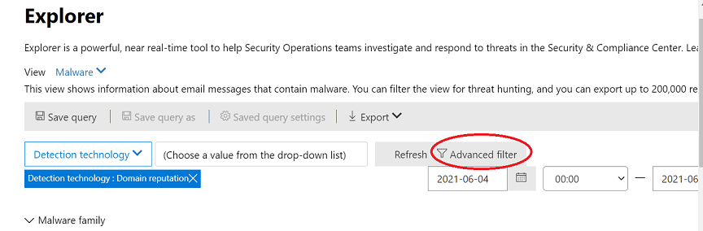
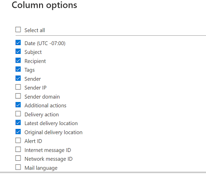

# Microsoft Defender for Microsoft Defender의 위협 탐색기에서 위협 Office 365

이 문서의 내용

- [위협 탐색기 Walk-through](#threat-explorer-walk-through)
- [전자 메일 조사](#email-investigation)
- [전자 메일 수정](#email-remediation)
- [위협 헌팅 환경 개선](#improvements-to-threat-hunting-experience)

> [!NOTE]
> 이 문서는 위협 탐색기(탐색기) **,** 전자 메일 보안 및 **탐색기** 및 실시간 검색 기본(예: 도구 간 차이점 및 작동에 필요한 사용 권한)에 대한 **3개** 문서 시리즈의 일부입니다.  이 시리즈의 다른 두 문서는 [위협](email-security-in-microsoft-defender.md) 탐색기를 사용하는 전자 메일 보안 및 위협 탐색기 및 실시간 검색 [기본입니다.](real-time-detections.md)

**적용 대상**
- [Office 365용 Microsoft Defender 플랜 1 및 플랜 2](defender-for-office-365.md)
- [Microsoft 365 Defender](../defender/microsoft-365-defender.md)

조직에 microsoft [Defender for Office 365](defender-for-office-365.md)권한이 있는 경우 탐색기 또는  실시간  검색을 사용하여 위협을 감지하고 치료할 수 있습니다.

in the Microsoft 365 Defender portal ( <https://security.microsoft.com> ) go to Email & **collaboration**, and then choose **Explorer** or **Real-time detections**. 페이지로 직접 이동하기 위해 또는 <https://security.microsoft.com/threatexplorer><https://security.microsoft.com/realtimereports>

다음 도구를 사용하여 다음을 수행할 수 있습니다.

- 보안 기능에서 검색된 맬웨어 Microsoft 365 참조
- 피싱 URL 보기 및 판정 데이터 클릭
- 탐색기 보기에서 자동화된 조사 및 응답 프로세스 시작
- 악성 전자 메일 조사 등

자세한 내용은 [위협 탐색기를 사용하여 전자 메일 보안을 참조하세요.](email-security-in-microsoft-defender.md)

## 위협 탐색기 Walk-through

Microsoft Defender for Office 365 요금제에는 플랜 1과 계획 2의 두 가지 구독 계획이 있습니다. 수동으로 운영하는 위협 헌팅 도구는 각 계획에 있으며 이름과 기능이 다릅니다.

Defender for Office 365 Plan 1은 계획 2의 위협 탐색기(탐색기라고도 하는 탐색기) 헌팅 도구의 하위 집합인 실시간 검색을 사용합니다.   이 문서 시리즈에서는 대부분의 예제가 전체 위협 탐색기를 사용하여 작성되었습니다. 관리자는 실시간 검색의 모든 단계를 테스트하여 적용 위치를 표시해야 합니다.

탐색기 **로** 이동한 후 기본적으로 맬웨어  페이지에 도착하지만  보기 드롭다운을 사용하여 옵션에 익숙해지게 됩니다. 피싱을 헌팅하거나 위협 캠페인을 찾은 경우 해당 보기를 선택하세요.

> [!div class="mx-imgBorder"]
> 

보안 작업(초당 Ops) 사용자가 범위가 사용자 제출과 같은 좁은 보기인지 아니면 모든 전자 메일과 같은 더 넓은 보기인지에  따라 보낸 사람 단추를 사용하여 더 많은 필터링을 할 수 있습니다.  필터링 작업을 완료하려면 새로 고침을 선택해야 합니다.

> [!div class="mx-imgBorder"]
> 

탐색기 또는 실시간 검색에서 포커스를 구체화하는 경우 계층에서 생각할 수 있습니다. 첫 번째는 **보기입니다.** 두 번째는 필터링된 *포커스로 생각할 수 있습니다.* 예를 들어 다음과 같은 결정을 기록하여 위협을 찾는 데 수행한 단계를 다시 검색할 수 있습니다. 탐색기에서 문제를 찾으기 위해 받는 사람 필터 포커스가 있는 맬웨어 보기를 **선택했습니다.** 이렇게 하면 단계를 더 쉽게 방해할 수 있습니다.

> [!TIP]
> Sec Ops에서 **Tags를** 사용하여 높은 가치의 대상을 고려하는 계정을 표시하는 경우 태그 필터 포커스가 있는 피싱 보기(사용되는 경우 날짜 범위 *포함)와* 같은 선택을 할 수 있습니다. 이렇게 하면 특정 피싱 공격이 해당 업계에서 많이 발생하고 있는 날짜와 같이 특정 기간 동안 높은 가치의 사용자 대상을 대상으로 하는 피싱 시도가 표시됩니다.

날짜 범위 컨트롤을 사용하여 날짜 범위에 구체화할 수 있습니다. 검색 기술 필터 **포커스가** 있는 맬웨어 보기의 **탐색기를** 볼 수 있습니다. 그러나 Sec  Ops 팀이 깊이를 파고들 수 있는 고급 필터 단추입니다.

> [!div class="mx-imgBorder"]
> 

고급 **필터를 클릭하면** Sec Ops 헌터가 쿼리를 직접 작성하여 보는 데 필요한 정보를 포함하거나 제외할 수 있는 패널이 표시됩니다. 탐색기 페이지의 차트와 테이블에 결과가 모두 반영됩니다.

> [!div class="mx-imgBorder"]
> 

열 옵션 **단추를 사용하여** 가장 유용한 표 정보의 종류를 얻을 수 있습니다.

> [!div class="mx-imgBorder"]
> 

> [!div class="mx-imgBorder"]
> 

동일한 MIEN에서 디스플레이 옵션을 테스트해야 합니다. 여러 대상이 동일한 데이터의 여러 프레젠테이션에 잘 반응합니다. 일부 뷰어의  경우 전자 메일 원본 맵은 위협이 바로 옆에 있는 캠페인  표시 옵션보다 광범위하거나 불연결하다는 메시지를 표시할 수 있습니다. Sec Ops는 이러한 디스플레이를 사용하여 보안 및 보호의 필요성을 가장 잘 설명하거나 나중에 비교하여 작업의 효과를 보여줄 수 있습니다.

> [!div class="mx-imgBorder"]
> 

> [!div class="mx-imgBorder"]
> 

### 전자 메일 조사

의심스러운 전자 메일이 표시되고 이름을 클릭하여 오른쪽의 플라이아웃을 확장합니다. 여기에서 Sec Ops에서 전자 메일 엔터티 페이지를 볼 수 있도록 하는 [배너를](mdo-email-entity-page.md) 사용할 수 있습니다.

전자 메일 엔터티 페이지는 **세부** **정보,** 첨부 파일, 장치 아래에서 찾을 수 있는 콘텐츠를 끌어오지만 **보다** 체계적인 데이터를 포함합니다. 여기에는 DMARC 결과, 복사 옵션을 사용하여 전자 메일 헤더의 일반 텍스트 표시, 안전하게 검색된 첨부 파일에 대한 결과 정보, 이러한 검색을 삭제한 파일(연락한 IP 주소, 페이지 또는 파일의 스크린샷 포함)이 포함됩니다. URL 및 해당 판정도 유사한 세부 정보 보고와 함께 나열됩니다.

이 단계에 도달하면 전자 메일 엔터티 페이지가 최종 단계인 수정에 *중요합니다.*

> [!div class="mx-imgBorder"]
> 

> [!TIP]
> 검색된 첨부 파일 결과, 포함된 URL에  대한 결과 및 안전한 전자 메일 미리 보기의 결과를 포함하여 다양한 전자 메일 엔터티 페이지(분석 탭에서 아래 참조)에 대한 자세한 내용을 보려면 여기를 [클릭하세요.](mdo-email-entity-page.md)

> [!div class="mx-imgBorder"]
> 

### 전자 메일 수정

초당 Ops 사용자가 전자 메일이 위협인지 확인하면 다음 탐색기 또는 실시간 검색 단계에서 위협을 처리하고 이를 수정합니다. 위협 탐색기로 돌아가 문제 전자 메일의 확인란을 선택하고 작업 단추를 사용하여 이 작업을 **수행할 수** 있습니다.

> [!div class="mx-imgBorder"]
> 

여기에서 분석가가 메일을 스팸, 피싱 또는 맬웨어로 보고하거나, 받는 사람에게 연락하거나, 계획 2가 있는 경우 자동화된 조사 및 대응(또는 AIR) 플레이북 트리거를 포함할 수 있는 추가 조사를 수행할 수 있습니다. 또는 메일을 정리된 것으로 보고할 수도 있습니다.

> [!div class="mx-imgBorder"]
> 

## 위협 헌팅 환경 개선

### 경고 ID

경고에서 위협 탐색기를 탐색할 때  보기는 경고 **ID로 필터링됩니다.** 이는 실시간 검색에도 적용됩니다. 특정 경고와 관련된 메시지 및 전자 메일 합계(개수)가 표시됩니다. 메시지가 경고의 일부이면 해당 메시지에서 관련 경고로 이동할 수 있습니다.

마지막으로 경고 ID가 URL에 포함됩니다. 예를 들면 다음과 같습니다. `https://https://security.microsoft.com/viewalerts`

> [!div class="mx-imgBorder"]
> 

> [!div class="mx-imgBorder"]
> 

### 평가판 테넌트에 대한 탐색기(및 실시간 검색) 데이터 보존 및 검색 제한 확장

이러한 변경의 일환으로 분석가가 위협 탐색기에서 30일(7일에서 증가)에 걸쳐 전자 메일 데이터를 검색하고 필터링하고, Office P1 및 P2 평가판 테넌트에 대한 Defender에 대한 실시간 검색을 할 수 있습니다. 이는 보존 기본값이 이미 30일인 P1 및 P2 E5 고객의 프로덕션 테넌트에는 영향을 주지 않습니다.

### 업데이트된 내보내기 제한

위협 탐색기에서 내보낼 수 있는 전자 메일 레코드 수는 이제 200,000개(9990개)입니다. 내보낼 수 있는 열 집합은 변경되지 않습니다.

### 위협 탐색기에서 태그

> [!NOTE]
> 사용자 태그 기능은 미리 보기에 있으며 모든 사용자가 사용할 수 없습니다. 또한 미리 보기는 변경될 수 있습니다. 릴리스 일정에 대한 자세한 내용은 Microsoft 365 로드맵을 참조하십시오.

사용자 태그는 Microsoft Defender에서 특정 사용자 그룹을 식별하여 Office 365. 라이선스 및 구성을 비롯한 태그에 대한 자세한 내용은 사용자 태그 [를 참조하세요.](user-tags.md)

위협 탐색기에서 다음 환경의 사용자 태그에 대한 정보를 볼 수 있습니다.

#### 전자 메일 그리드 보기

분석가가 전자 메일 그리드의 **태그** 열을 보면 보낸 사람 또는 받는 사람 사서함에 적용된 모든 태그가 표시됩니다. 기본적으로 우선 순위 계정과 같은 *시스템 태그가* 먼저 표시됩니다.

> [!div class="mx-imgBorder"]
> 

#### 필터링

태그를 필터로 사용할 수 있습니다. 우선 순위 계정에서만 헌팅하거나 이러한 방식으로 특정 사용자 태그 시나리오를 사용 합니다. 특정 태그가 있는 결과를 제외할 수도 있습니다. 태그를 다른 필터 및 날짜 범위와 결합하여 조사 범위를 좁힐 수 있습니다.

> [!div class="mx-imgBorder"]
> 

#### 전자 메일 세부 정보 플라이아웃

보낸 사람 및 받는 사람에 대한 개별 태그를 확인하려면 전자 메일을 선택하여 메시지 세부 정보 플라이아웃을 하세요. 요약 **탭에는** 보낸 사람 및 받는 사람 태그가 별도로 표시됩니다. 보낸 사람 및 받는 사람에 대한 개별 태그에 대한 정보를 CSV 데이터로 내보낼 수 있습니다.

> [!div class="mx-imgBorder"]
> 

태그 정보는 URL 클릭 플라이아웃에도 표시됩니다. Url 또는 URL 클릭 탭에서 피싱 또는 모든 **>** **보기로** 이동하세요. 해당 클릭과 연결된 태그를 포함하여 해당 URL의 클릭에 대한 추가 세부 정보를 보려면 개별 URL 플라이아웃을 선택합니다.

### 업데이트된 시간 표시 막대 보기

> [!div class="mx-imgBorder"]
> 
>
[이 비디오](https://www.youtube.com/watch?v=UoVzN0lYbfY&list=PL3ZTgFEc7LystRja2GnDeUFqk44k7-KXf&index=4)를 시청하여 자세히 확인하세요.

## 확장된 기능

### 상위 대상 사용자

상위 맬웨어 패밀리는 맬웨어 섹션에서 대상이 가장 **많은** 사용자를 보여줍니다. 상위 대상 사용자도 피싱 및 모든 전자 메일 보기를 통해 확장됩니다. 분석가가 상위 5명을 대상으로 하는 사용자와 각 보기에서 각 사용자에 대한 시도 횟수를 볼 수 있습니다.

보안 작업 사용자가 각 전자 메일 보기에 대한 오프라인 분석을 위해 시도 횟수와 함께 대상 사용자 목록을 최대 3,000개까지 내보낼 수 있습니다. 또한 시도 횟수(예: 아래 이미지에서 13회 시도)를 선택하면 위협 탐색기에서 필터링된 보기가 열리기 때문에 전자 메일에서 더 많은 세부 정보 및 해당 사용자에 대한 위협을 볼 수 있습니다.

> [!div class="mx-imgBorder"]
> 

### Exchange 전송 규칙

보안 운영 팀은 전자 메일 그리드 보기에서 메시지에 적용되는 모든 Exchange 전송 규칙(또는 메일 흐름 규칙)을 볼 수 있습니다. 표에서 **열** 옵션을 선택한 다음 열 **옵션에서** Exchange 전송 규칙 추가를 선택합니다. 전송 Exchange 옵션도 전자 메일의 **세부** 정보 플라이아웃에 표시됩니다.

메시지에 적용된 전송 규칙의 이름과 GUID가 나타납니다. 분석가가 전송 규칙의 이름을 사용하여 메시지를 검색할 수 있습니다. 이는 포함 검색으로, 부분 검색도 할 수 있습니다.

> [!IMPORTANT]
> Exchange 규칙 검색 및 이름 사용 가능 여부는 사용자에게 할당된 특정 역할에 따라 달라집니다. 전송 규칙 이름을 보고 검색하려면 다음 역할 또는 사용 권한 중 하나를 설정해야 합니다. 그러나 아래의 역할이나 사용 권한이 없는 경우에도 분석가가 전자 메일 세부 정보에서 전송 규칙 레이블 및 GUID 정보를 볼 수 있습니다. 전자 메일 그리드, 전자 메일 플라이아웃, 필터 및 내보내기의 기타 레코드 보기 환경은 영향을 받지 않습니다.
>
> - Exchange Online Only - 데이터 손실 방지: 모두
> - Exchange Online Only - O365SupportViewConfig: All
> - Microsoft Azure Active Directory 또는 Exchange Online - 보안 관리자: 모두
> - Azure Active Directory 또는 Exchange Online - 보안 판독기: 모두
> - Exchange Online Only - 전송 규칙: 모두
> - Exchange Online Only - View-Only 구성: 모두
>
> 전자 메일 그리드, 세부 정보 플라이아웃 및 내보내는 CSV 내에서 ETRS에는 아래 표시된 이름/GUID가 표시됩니다.
>
> > [!div class="mx-imgBorder"]
> > 

### 인바운드 커넥터

커넥터는 조직 또는 조직에서 전자 메일이 전송되는 방법을 사용자 지정하는 Microsoft 365 Office 365 모음입니다. 보안 제한 또는 제어를 적용할 수 있습니다. 위협 탐색기에서 전자 메일과 관련된 커넥터를 보고 커넥터 이름을 사용하여 전자 메일을 검색할 수 있습니다.

커넥터 검색은 포함 쿼리로, 부분 키워드 검색이 작동할 수 있습니다.

> [!div class="mx-imgBorder"]
> 

## 필수 라이선스 및 사용 권한

탐색기 또는 실시간 Office 365 사용하려면 [Microsoft Defender가](defender-for-office-365.md) 있어야 합니다.

- Explorer는 Plan 2용 Defender에 Office 365 포함되어 있습니다.
- 실시간 검색 보고서는 Plan 1의 Defender에 Office 365 포함되어 있습니다.
- Defender에서 보호해야 하는 모든 사용자에 대해 라이선스를 할당할 Office 365. 탐색기 및 실시간 검색은 사용이 허가된 사용자에 대한 검색 데이터를 보여 주며,

탐색기 또는 실시간 검색을 보고 사용하려면 다음 권한이 있어야 합니다.

- Microsoft 365 Defender 포털의 경우:
  - 조직 관리
  - 보안 관리자(Azure Active Directory 관리 센터에서 할당할 수 있습니다. <https://aad.portal.azure.com> )
  - 보안 읽기 권한자
- 다음 Exchange Online:
  - 조직 관리
  - 보기 전용 조직 관리
  - 보기 전용 받는 사람
  - 준수 관리

역할 및 사용 권한에 대한 자세한 내용은 다음 리소스를 참조합니다.

- [Microsoft 365 Defender 포털 사용 권한](permissions-microsoft-365-security-center.md)
- [Exchange Online의 기능 사용 권한](/exchange/permissions-exo/feature-permissions)
- [Exchange Online PowerShell](/powershell/exchange/exchange-online-powershell)

## 추가 정보

- [배달된 악성 전자 메일 찾기 및 조사](investigate-malicious-email-that-was-delivered.md)
- [SharePoint Online, OneDrive 및 파일에서 검색된 악성 Microsoft Teams](mdo-for-spo-odb-and-teams.md)
- [위협 탐색기(및 실시간 검색)에서 보기에 대한 개요를 얻습니다.](threat-explorer-views.md)
- [위협 방지 상태 보고서](view-email-security-reports.md#threat-protection-status-report)
- [Microsoft Threat Protection의 자동화된 조사 및 대응](automated-investigation-response-office.md)
- [전자 메일 엔터티 페이지를 통해 전자 메일 조사](mdo-email-entity-page.md)
