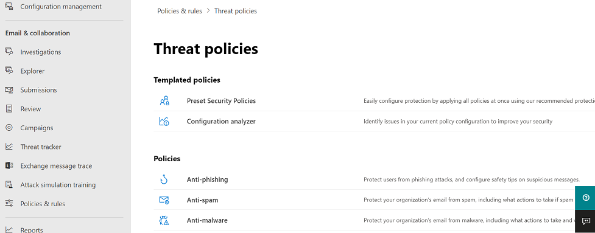

# 위협 추적기 - 신규 및 주목할 만한 요소

[!INCLUDE [Microsoft 365 Defender rebranding](../includes/microsoft-defender-for-office.md)]

**적용 대상**
- [Office 365용 Microsoft Defender 플랜 2](defender-for-office-365.md)
- [Microsoft 365 Defender](../defender/microsoft-365-defender.md)

[Office 365 위협](office-365-ti.md) 조사 및 대응 기능을 통해 조직의 보안 팀이 사이버 보안 위협을 검색하고 조치를 취할 수 있습니다. Office 365 위협 조사 및 응답 기능에는 주목할 만한 추적기 등의 위협 추적기 기능이 포함됩니다. 이 문서를 읽고 이러한 새로운 기능과 다음 단계를 간략하게 살펴 읽습니다.

> [!IMPORTANT]
> Office 365 위협 인텔리전스가 추가 위협 방지 기능과 Office 365 계획 2에 대한 Microsoft Defender입니다. 자세한 내용은 Microsoft [Defender for Office 365](https://products.office.com/exchange/advance-threat-protection) 및 Microsoft [Defender for Office 365 참조하세요.](/office365/servicedescriptions/office-365-advanced-threat-protection-service-description)

## 위협 트래커란?

위협 트래커는 회사에 영향을 줄 수 있는 다양한 사이버 보안 문제에 대한 인텔리전스를 제공하는 정보 위젯 및 보기입니다. 예를 들어 위협 트래커를 사용하여 추세 맬웨어 캠페인에 대한 정보를 볼 수 있습니다.

대부분의 트래커 페이지에는 주기적으로 업데이트되는 추세 번호, 가장 큰 문제 또는 증가한 문제를 이해하는 데 도움이  되는 위젯, 더 자세한 정보를 볼 수 있는 탐색기로 연결되는 작업 열의 빠른 링크가 포함되어 있습니다.

추적기 기능은 계획 [2용 Microsoft Defender에서](office-365-ti.md)얻을 수 있는 몇 가지 Office 365 있습니다. 위협 추적기에는 [주목할만한](#noteworthy-trackers)추적기, [인기](#trending-trackers)트래커, 추적된 [쿼리](#tracked-queries)및 저장된 [쿼리가 포함됩니다.](#saved-queries)

조직에 대한 위협 추적기 보기 및 사용을 위해 Microsoft 365 Defender 포털()으로 이동하여 전자 메일 <https://security.microsoft.com> & **위협** \> **추적기 를 선택하세요.**

> [!NOTE]
> 위협 추적기를 사용하려면 전역 관리자, 보안 관리자 또는 보안 읽기 권한자일 수 있습니다. 웹 [사이트 포털의 Microsoft 365 Defender 참조합니다.](permissions-microsoft-365-security-center.md)

### 주목할 만한 추적기

주목할 만한 추적기에서는 알아야 할 크고 작은 위협과 위험을 찾을 수 있습니다. 주목할 만한 트래커는 이러한 문제가 Microsoft 365 환경에 존재하는지 여부와 진행되는 문제에 대한 자세한 내용을 설명하는 문서(예: 문서)에 대한 링크, 그리고 이러한 문제가 조직의 조직 사용에 미치는 영향을 Office 365. 새로운 위협(예: Wannacry, 페티야)이든, 새로운 과제를 만들 수 있는 기존 위협(예: 다른 취임 주의 항목 - Nemucod)이든, 이를 통해 사용자와 보안 팀이 주기적으로 검토하고 검사해야 하는 중요한 새 항목을 찾을 수 있습니다.

일반적으로 새로운 위협을 식별하고 이 기능이 제공하는 추가 가시성이 필요할 수 있는 것으로 생각될 때 주목할 만한 트래커가 몇 주 동안 게시됩니다. 위협에 대한 가장 큰 위험이 지나면 해당 주목할 만한 항목이 제거됩니다. 이렇게 하면 다른 관련 새 항목과 함께 목록을 최신으로 최신으로 유지할 수 있습니다.

### 인기 트래커

인기 있는 추적기(이전의 캠페인)는 지난 주에 조직의 전자 메일에 수신된 새로운 위협을 강조합니다.

인기 트래커는 더 광범위한 회사 환경을 공격에 대비하기 위해 검토해야 하는 새로운 위협에 대한 아이디어를 제공합니다.

### 추적된 쿼리

추적된 쿼리는 저장된 쿼리를 활용하여 조직의 Microsoft 365 주기적으로 평가합니다. 이를 통해 이벤트 추세가 제공될 수 있습니다. 그 다음 몇 개월에 더 많은 이벤트가 제공될 것입니다. 추적된 쿼리는 자동으로 실행되며 쿼리를 다시 실행할 필요 없이 최신 정보를 제공합니다.

### 저장된 쿼리

저장된 쿼리는 추적기 섹션에도 있습니다. 저장된 쿼리를 사용하여 매번 검색을 다시 만들지 않고도 더 빠르고 반복적으로 돌아가고자 하는 일반적인 탐색기 검색을 저장할 수 있습니다.

항상 탐색기 페이지의 맨 위에 있는 저장 쿼리 단추를 사용하여  주목할만한 추적기 쿼리 또는 사용자 자신의 탐색기 쿼리를 저장할 수 있습니다. 저장한 모든 항목은 추적기 페이지의 **저장된** 쿼리 목록에 표시됩니다.

## 추적기 및 탐색기

전자 메일, 콘텐츠 또는 Office 활동(출시 예정)을 검토하는지 여부에 관계가 없습니다. 탐색기 및 추적기는 함께 작동하여 보안 위험과 위협을 조사하고 추적하는 데 도움을 줄 수 있습니다. 추적기에서 새로운, 주목할만한 자주 검색되는 문제를 강조 표시하여 사용자를 보호하는 정보를 제공합니다. 클라우드로 전환할 때 비즈니스를 보다 잘 보호할 수 있습니다.

또한 오른쪽 아래 모서리에 있는 피드백 단추를 클릭하여 항상 이 또는  기타 Microsoft 365 보안 기능에 대한 피드백을 제공할 수 있습니다.

## 트래커 및 Microsoft Defender for Office 365

취임 후의 주목할 만한 위협으로, 첨부 파일 에서 검색된 고급 [맬웨어 위협을 금고 있습니다.](safe-attachments.md) E5 고객으로 Office 365 Enterprise Microsoft [Defender를](defender-for-office-365.md)Office 365 경우 구독에 포함되어야 합니다. Defender for Office 365 서비스를 사용하여 전자 메일 흐름을 필터링하는 다른 보안 도구가 있는 경우에도 Office 365 제공합니다. 그러나 스팸 방지  및 금고 링크 기능은 기본 전자 메일 보안 솔루션을 통해 작업할 때 가장 Office 365.

오늘날의 위협을 없애는 세계에서 기존의 맬웨어 방지 검사만 실행하면 공격으로부터 충분히 보호되지 않습니다. 오늘날 좀 더 정교한 공격자는 일반적으로 사용할 수 있는 도구를 사용하여 기존의 서명 기반 맬웨어 방지 엔진에서 인식되지 않는 새로운, 난독 또는 지연된 공격을 만들 수 있습니다. 금고 첨부 파일 기능은 전자 메일 첨부 파일을 사용하여 가상 환경에서 이를 확인하여 안전한지 또는 악성인지를 확인할 수 있습니다. 이 데이타 프로세스는 가상 컴퓨터 환경에서 각 파일을 연 다음 파일을 연 후 어떤 일이 일어나는지 확인합니다. PDF 및 압축된 파일이든 Office 문서이든, 악성 코드는 파일에 숨겨져 있으며, 사용자가 컴퓨터에서 파일을 열 때만 활성화할 수 있습니다. 전자 메일 흐름에서 파일을 검색하고 분석하여 Office 365 기능의 Defender는 동작, 파일 신뢰도 및 다양한추론 규칙을 기반으로 이러한 위협을 검색합니다.

새로운 주목할 만한 위협 필터는 첨부 파일에서 최근에 금고 강조 표시됩니다. 이러한 검색은 전자 메일 흐름 또는 다른 고객의 전자 메일에서 이전에 Microsoft 365 새로운 악성 파일인 항목을 나타내고 있습니다. Noteworthy Threat Tracker의 항목에 주의를 기울여 대상을 지정한 대상을 확인한 다음 고급 분석 탭에 표시되는 검색 세부 정보를 검토합니다(탐색기에서 전자 메일의 제목을 클릭하여 찾음). 참고 금고 첨부 파일 기능에서 검색된 전자 메일에서만 이 탭을 찾을 수 있습니다. 이 주목할 만한 추적기는 해당 필터를 포함하지만 탐색기에서 다른 검색에 해당 필터를 사용할 수도 있습니다.

## 다음 단계

- 조직에 이러한 Office 365 위협 조사 및 대응 기능이 없는 경우 위협 조사 및 대응 Office 365 어떻게 [하나요?를 참조하세요.](office-365-ti.md)

- 보안 팀에 올바른 역할 및 사용 권한이 할당되어 있는지 확인합니다. 전역 관리자 또는 보안 관리자 또는 검색 및 제거 역할이 Microsoft 365 Defender 합니다. 웹 [사이트 포털의 Microsoft 365 Defender 참조합니다.](permissions-microsoft-365-security-center.md)

- 새 추적기에서 새 트래커가 사용자 환경에 Microsoft 365 감시합니다. 사용 가능한 경우 여기에서 추적기 를 찾을 [수 있습니다.](https://https://security.microsoft.com/) 전자 메일 & **위협** \> **추적기 로 이동하세요.**

- 아직 수행하지 않은 경우 조직에서 사용할 수 있도록 [Microsoft Defender를](defender-for-office-365.md) Office 365 링크  및 첨부 금고 금고 [합니다.](safe-attachments.md)
