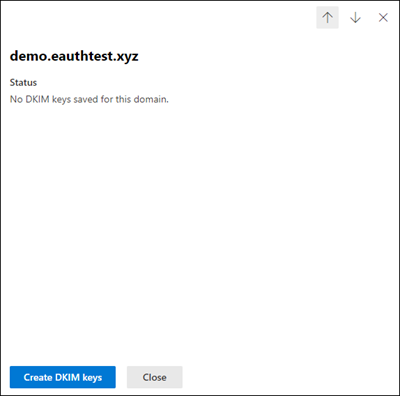

# <a name="use-dkim-to-validate-outbound-email-sent-from-your-custom-domain"></a>DKIM을 사용하여 사용자 지정 도메인에서 전송한 아웃바운드 전자 메일의 유효성 검사

[!INCLUDE [Microsoft 365 Defender rebranding](../includes/microsoft-defender-for-office.md)]

**적용 대상**
- [Exchange Online Protection](exchange-online-protection-overview.md)
- [Office 365용 Microsoft Defender 플랜 1 및 플랜 2](defender-for-office-365.md)
- [Microsoft 365 Defender](../defender/microsoft-365-defender.md)

 이 문서에서는 대상 전자 메일 시스템이 사용자 지정 도메인에서 아웃바운드된 메시지를 신뢰하도록 Microsoft 365에서 DKIM(DomainKeys Identified Mail)을 사용하는 단계를 나열합니다.

이 문서의 내용

- [악의적인 스푸핑을 방지하기 위해 DKIM이 SPF 단독보다 더욱 효율적인 방식인 이유](#how-dkim-works-better-than-spf-alone-to-prevent-malicious-spoofing)
- [Microsoft 365 Defender 포털에서 DKIM을 생성, 활성화 및 비활성화하는 단계](#steps-to-create-enable-and-disable-dkim-from-microsoft-365-defender-portal)
- [수동으로 1024 비트 키를 2048 비트 DKIM 암호화 키로 업그레이드하는 단계](#steps-to-manually-upgrade-your-1024-bit-keys-to-2048-bit-dkim-encryption-keys)
- [DKIM을 수동으로 설정하는 단계](#steps-to-manually-set-up-dkim)
- [두 개 이상의 사용자 지정 도메인에 대해 DKIM을 구성하는 단계](#to-configure-dkim-for-more-than-one-custom-domain)
- [사용자 지정 도메인에 대해 DKIM 서명 정책을 사용 하지 않도록 설정](#disabling-the-dkim-signing-policy-for-a-custom-domain)
- [DKIM 및 Microsoft 365의 기본 동작](#default-behavior-for-dkim-and-microsoft-365)
- [타사 서비스에서 사용자 지정 도메인을 대신하여 이메일을 보내거나 스푸핑할 수 있도록 DKIM을 설정](#set-up-dkim-so-that-a-third-party-service-can-send-or-spoof-email-on-behalf-of-your-custom-domain)
- [다음 단계: Microsoft 365에 대한 DKIM을 설정한 후](#next-steps-after-you-set-up-dkim-for-microsoft-365)

> [!NOTE]
> Microsoft 365는 초기 'onmicrosoft.com' 도메인에 대해 DKIM을 자동으로 설정합니다. 즉, 초기 도메인 이름(예: litware.onmicrosoft.com)의 DKIM을 설정하기 위한 작업을 수행하지 않아도 됩니다. 도메인에 대한 자세한 내용은 [도메인 FAQ](../../admin/setup/domains-faq.yml#why-do-i-have-an--onmicrosoft-com--domain)를 참조하세요.

DKIM은 공격이 도메인에서 발송된 것 같은 메시지를 보내지 못하도록 도와주는 SPF, DKIM 및 DMARC(인증 방법) 중 하나입니다.

DKIM을 사용하면 보내는 전자 메일 메시지의 머리글에 디지털 서명을 첨부할 수 있습니다. DKIM을 구성할 때 암호화 인증을 사용하여 전자 메일 메시지에 해당 이름을 연결하거나 서명할 수 있는 권한을 도메인에 부여합니다. 도메인에서 전자 메일을 받는 전자 메일 시스템은 이 디지털 서명을 사용하여 받는 전자 메일이 합법적인지 여부를 확인할 수 있습니다.

기본적으로 비공개 키는 도메인의 발송된 전자 메일에 있는 머리글을 암호화합니다. 공개 키는 도메인의 DNS 레코드에 게시됩니다. 받는 서버에서 해당 키를 사용하여 서명을 디코딩할 수 있습니다. DKIM 확인을 통해 수신 서버는 수신 서버가 메일의 수신 여부를 확인할 수 있으며, 메일은 사용자의 도메인을 *스푸핑* 하는 사람이 아닙니다.

> [!TIP]
>사용자 지정 도메인의 DKIM에 대해 아무런 조치도 하지 않을지 선택할 수 있습니다. 사용자 지정 도메인에 DKIM을 설정하지 않으면 Microsoft 365는 개인 및 공개 키 쌍을 만들고 DKIM 서명을 사용하도록 설정 한 다음 사용자 지정 도메인에 대한 Microsoft 365 기본 정책을 구성합니다.

 Microsoft-365의 기본 제공 DKIM 구성은 대부분의 고객에게 충분하지만 다음과 같은 경우에는 사용자 지정 도메인에 대해 DKIM을 수동으로 구성해야 합니다.

- Microsoft 365에 두 개 이상의 사용자 지정 도메인이 있는 경우
- DMARC 또한 설정하려는 경우(**권장됨**)
- 개인 키를 제어하려는 경우
- CNAME 레코드를 사용자 지정하려는 경우
- 타사 대량 메일 프로그램을 사용하는 경우와 같이 타사 도메인에서 시작되는 전자 메일에 대해 DKIM 키를 설정하려는 경우

## <a name="how-dkim-works-better-than-spf-alone-to-prevent-malicious-spoofing"></a>악의적인 스푸핑을 방지하기 위해 DKIM이 SPF 단독보다 더욱 효율적인 방식인 이유
<a name="HowDKIMWorks"> </a>

SPF는 메시지 봉투에 정보를 추가하지만 DKIM은 메시지 머리글 내에서 서명을 *암호화* 합니다. 메시지를 전달할 때 메시지의 봉투 일부가 전달 서버에서 제거될 수 있습니다. 디지털 서명은 전자 메일 머리글의 일부이기 때문에 전자 메일 메시지와 함께 유지되므로 DKIM은 다음 예제와 같이 메시지가 전달된 경우에도 작동합니다.


이 예제에서 도메인에 대한 SPF TXT 레코드만 게시한 경우 받는 사람의 메일 서버에서 전자 메일을 스팸으로 표시하고 가양성 결과를 생성할 수 있습니다. **이 시나리오에 DKIM을 추가하면 *가양성* 스팸 보고를 줄일 수가 있습니다.** DKIM은 IP 주소뿐만 아니라 인증을 위해 공개 키 암호화를 사용하기 때문에 DKIM은 SPF보다 훨씬 강력한 인증 형식으로 간주됩니다. 배포시 SPF 및 DKIM과 DMARC를 모두 사용하는 것이 좋습니다.

> [!TIP]
> DKIM은 개인 키를 사용하여 암호화 된 서명을 메시지 머리글에 삽입합니다. 서명 도메인 또는 아웃 바운드 도메인이 머리글의 **d =** 필드 값으로 삽입됩니다. 확인 도메인 또는 수신자 도메인은 **d =** 필드를 사용하여 DNS에서 공개 키를 조회하고 메시지를 인증합니다. 메시지를 확인하면 DKIM 검사가 통과됩니다.

## <a name="steps-to-create-enable-and-disable-dkim-from-microsoft-365-defender-portal"></a>Microsoft 365 Defender 포털에서 DKIM을 생성, 활성화 및 비활성화하는 단계

테넌트에서 허용된 모든 도메인은 DKIM 페이지의 Microsoft 365 Defender 포털에 표시됩니다. 표시되지 않으면 [도메인 페이지](/microsoft-365/admin/setup/add-domain#add-a-domain)에서 허용된 도메인을 추가합니다.
도메인이 추가되면 아래와 같은 단계에 따라 DKIM을 구성합니다.

1단계: DKIM 페이지에서 DKIM을 구성하려는 도메인을 클릭합니다(https://security.microsoft.com/dkimv2 또는 https://protection.office.com/dkimv2).


2단계: DKIM 키 만들기를 클릭합니다.



3단계: 팝업 창에 표시된 CNAMES를 복사합니다.


4단계: 복사한 CNAME 레코드를 DNS 서비스 공급자에 게시합니다.

DNS 공급자의 웹 사이트에서 사용하도록 설정할 DKIM에 대한 CNAME 레코드를 추가합니다. 필드가 각각 다음 값으로 설정되어 있는지 확인합니다.

```text
Record Type: CNAME (Alias)
> Host: Paste the values you copy from DKIM page.
Points to address: Copy the value from DKIM page.
TTL: 3600 (or your provider default)
```

5단계: DKIM을 사용하도록 설정하려면 DKIM 페이지로 돌아갑니다.


CNAME 레코드가 존재하지 않는 경우 다음 때문일 수 있습니다.

1. 문제가 지속되면 몇 초에서 몇 시간이 걸릴 수 있는 DNS 서버와의 동기화 단계를 다시 반복합니다.
2. 추가 공간 또는 탭 등과 같은 복사 붙여넣기 오류를 확인합니다.

DKIM을 사용하지 않도록 설정하려면 사용 안 함 모드로 다시 전환합니다.

## <a name="steps-to-manually-upgrade-your-1024-bit-keys-to-2048-bit-dkim-encryption-keys"></a>수동으로 1024 비트 키를 2048 비트 DKIM 암호화 키로 업그레이드하는 단계
<a name="1024to2048DKIM"> </a>

> [!NOTE]
> Microsoft 365는 *onmicrosoft.com* 도메인에 대해 DKIM을 자동으로 설정합니다. 초기 도메인 이름(예: litware.*onmicrosoft.com*)에 DKIM을 사용하는 데 필요한 단계는 없습니다. 도메인에 대한 자세한 내용은 [도메인 FAQ](../../admin/setup/domains-faq.yml#why-do-i-have-an--onmicrosoft-com--domain)를 참조하세요.

1024 및 2048 비트가 모두 DKIM 키에 대한 지원 을 받게되므로 다음의 지침은 [Exchange Online PowerShell](/powershell/exchange/connect-to-exchange-online-powershell)에서 1024 비트 키를 2048로 업그레이드하는 방법을 설명할 것입니다. 다음은 두 가지 사용 사례에 대한 단계입니다. 구성에 가장 적합한 한 사례를 선택하세요.

- **이미 DKIM을 구성** 한 경우 다음을 실행하여 비트 수를 회전합니다.

  ```powershell
  Rotate-DkimSigningConfig -KeySize 2048 -Identity {Guid of the existing Signing Config}
  ```

  **또는**

- **DKIM을 새로 구현** 한 경우, 다음 명령을 실행합니다.

  ```powershell
  New-DkimSigningConfig -DomainName <Domain for which config is to be created> -KeySize 2048 -Enabled $true
  ```

다음 명령을 실행하여 Exchange Online PowerShell에 계속 연결하고 구성을 *확인* 합니다.

```powershell
Get-DkimSigningConfig -Identity <Domain for which the configuration was set> | Format-List
```

> [!TIP]
> 이 새 2048 비트 키는 RotateOnDate에 적용되며그 사이에 1024 비트 키로 전자 메일을 보냅니다. 4 일 후 2048 비트 키 (즉, 두 번째 선택기에 회전이 적용되는 경우)를 사용하여 다시 테스트를 수행할 수 있습니다.

두 번째 선택기로 회전하려면 4일 후 2048비트가 사용 중인지 확인한 후 위에 나열된 적절한 cmdlet을 사용하여 두 번째 선택기 키를 수동으로 회전합니다.

구문 및 매개 변수에 대한 자세한 정보는 다음 문서를 참조하세요.[Rotate-DkimSigningConfig](/powershell/module/exchange/rotate-dkimsigningconfig), [New-DkimSigningConfig](/powershell/module/exchange/new-dkimsigningconfig) 및 [Get-DkimSigningConfig](/powershell/module/exchange/get-dkimsigningconfig)

## <a name="steps-to-manually-set-up-dkim"></a>DKIM을 수동으로 설정하는 단계
<a name="SetUpDKIMO365"> </a>

DKIM을 구성하려면 다음 단계를 수행합니다.

- [DNS에서 사용자 지정 도메인에 대해 두 개의 CNAME 레코드 게시](use-dkim-to-validate-outbound-email.md#Publish2CNAME)
- [사용자 지정 도메인에 DKIM 서명 사용](use-dkim-to-validate-outbound-email.md#EnableDKIMinO365)

### <a name="publish-two-cname-records-for-your-custom-domain-in-dns"></a>DNS에서 사용자 지정 도메인에 대해 두 개의 CNAME 레코드 게시
<a name="Publish2CNAME"> </a>

DNS에 DKIM 서명을 추가하려는 각 도메인에 대해 두 개의 CNAME 레코드를 게시해야 합니다.

> [!NOTE]
> 전체 문서를 읽지 않은 경우 시간을 절약해 주는 이 PowerShell 연결 정보를 놓쳤을 수 있습니다. [Exchange Online PowerShell에 연결](/powershell/exchange/connect-to-exchange-online-powershell).

Exchange Online PowerShell에서 다음 명령을 실행하여 선택 레코드를 만들 수 있습니다.

```powershell
New-DkimSigningConfig -DomainName <domain> -Enabled $false
Get-DkimSigningConfig -Identity <domain> | Format-List Selector1CNAME, Selector2CNAME
```

Microsoft 365의 초기 도메인 외에 사용자 지정 도메인을 프로비저닝한 경우에는 추가 도메인마다 두 개의 CNAME 레코드를 게시해야 합니다. 따라서 두 개의 도메인이 있는 경우 두 개의 CNAME 레코드를 모두 게시해야 합니다.

CNAME 레코드에는 다음 형식을 사용합니다.

> [!IMPORTANT]
> 사용자가 GCC High 고객인 경우 _domainGuid_ 를 다르게 계산합니다! _domainGuid_ 를 계산하기 위해 _initialDomain_ 에 대한 MX 레코드를 조회하는 대신 사용자 정의된 도메인에서 직접 계산합니다. 예를 들어, 사용자 지정 도메인이 "contoso.com"인 경우 domainGuid는 "contoso-com"이되고 마침표는 대시로 바뀝니다. 따라서 initialDomain이 가리키는 MX 레코드와 상관없이 항상 위의 방법을 사용하여 CNAME 레코드에서 사용할 domainGuid를 계산합니다.

```console
Host name:            selector1._domainkey
Points to address or value:    selector1-<domainGUID>._domainkey.<initialDomain>
TTL:                3600

Host name:            selector2._domainkey
Points to address or value:    selector2-<domainGUID>._domainkey.<initialDomain>
TTL:                3600
```

여기서,

- Microsoft 365의 경우 셀렉터는 항상 "selector1" 또는 "selector2"입니다.
- _domainGUID_ 는 mail.protection.outlook.com 이전에 표시되는 사용자 정의 도메인에 대한 사용자 정의된 MX 레코드의 _domainGUID_ 와 동일합니다. 예를 들어 도메인 contoso.com에 대한 다음 MX 레코드에서 _domainGUID_ 는 contoso-com입니다.

  > contoso.com.  3600  IN  MX   5 contoso-com.mail.protection.outlook.com

- _initialdomain_ 은 Microsoft 365에 등록할 때 사용한 도메인입니다. 초기 도메인은 항상 onmicrosoft.com으로 끝납니다. 초기 도메인을 확인하는 방법에 대한 자세한 내용은 [도메인 FAQ](../../admin/setup/domains-faq.yml#why-do-i-have-an--onmicrosoft-com--domain)를 참조하세요.

예를 들어 cohovineyardandwinery.onmicrosoft.com이라는 초기 도메인과 cohovineyard.com 및 cohowinery.com이라는 두 개의 사용자 지정 도메인이 있는 경우 추가 도메인마다 총 두 개의 CNAME 레코드를 설정해야 합니다 (총 네 개의 CNAME 레코드).

```console
Host name:            selector1._domainkey
Points to address or value:    selector1-cohovineyard-com._domainkey.cohovineyardandwinery.onmicrosoft.com
TTL:                3600

Host name:            selector2._domainkey
Points to address or value:    selector2-cohovineyard-com._domainkey.cohovineyardandwinery.onmicrosoft.com
TTL:                3600

Host name:            selector1._domainkey
Points to address or value:    selector1-cohowinery-com._domainkey.cohovineyardandwinery.onmicrosoft.com
TTL:                3600

Host name:            selector2._domainkey
Points to address or value:    selector2-cohowinery-com._domainkey.cohovineyardandwinery.onmicrosoft.com
TTL:                3600
```

> [!NOTE]
> 두 번째 레코드를 만드는 것도 중요하지만, 생성 시 선택 도구 중 하나만 사용할 수 있습니다. 본질적으로, 두 번째 선택기는 아직 생성되지 않은 주소를 가리킬 수 있습니다. 키 회전이 원활하게 진행되므로 두 번째 CNAME 레코드를 만드는 것을 당사는 계속 권장했습니다.

### <a name="steps-to-enable-dkim-signing-for-your-custom-domain"></a>사용자 지정 도메인에 대해 DKIM 서명을 사용하도록 설정하는 단계
<a name="EnableDKIMinO365"> </a>

CNAME 레코드를 DNS에 게시하면 Microsoft 365를 통해 DKIM 서명을 사용할 수 있습니다. Microsoft 365 관리 센터 또는 PowerShell을 사용하여 이 작업을 수행할 수 있습니다.

#### <a name="to-enable-dkim-signing-for-your-custom-domain-in-the-microsoft-365-defender-portal"></a>Microsoft 365 Defender 포털에서 사용자 지정 도메인에 DKIM 서명을 사용하도록 설정하려면

1. [직장 또는 학교 계정을 사용](https://support.microsoft.com/office/e9eb7d51-5430-4929-91ab-6157c5a050b4)하여 Microsoft 365 Defender 포털을 엽니다.

2. **규칙** 섹션에서 **전자 메일 및 공동 작업** \> **정책 및 규칙** \> **위협 정책** \> **DKIM** 으로 이동합니다. 또는 <https://security.microsoft.com/dkimv2> 페이지를 통해 DKIM 페이지로 직접 이동할 수 있습니다.

3. **DKIM** 페이지에서 이름을 클릭하여 도메인을 선택합니다.

4. 표시되는 세부 정보 플라이아웃에서 **DKIM 서명으로 이 도메인의 메시지 서명** 설정을 **사용**()으로 변경합니다.

   완료되면 **DKIM 키 순환** 을 클릭합니다.

5. 각 사용자 지정 도메인마다 이 단계를 반복합니다.

6. DKIM을 처음 구성할 때 '이 도메인에 대해 저장된 DKIM 키 없음' 오류가 나타나면 다음 단계에서 설명한 대로 Windows PowerShell을 사용하여 DKIM 서명을 활성화해야 합니다.

#### <a name="to-enable-dkim-signing-for-your-custom-domain-by-using-powershell"></a>PowerShell을 사용하여 사용자 지정 도메인에 DKIM 서명 사용

> [!IMPORTANT]
> :::image type="content" source="../../media/dkim.png" alt-text="'이 도메인에 대해 저장된 DKIM 키가 없습니다.' 오류가 발생합니다.":::
> 처음으로 DKIM을 구성하는 경우 '이 도메인에 대해 지정된 DKIM 키가 없습니다.' 오류가 표시되면 아래 2단계(예: `Set-DkimSigningConfig -Identity contoso.com -Enabled $true`)의 명령을 완료하여 키를 확인합니다.

1. [Exchange Online PowerShell에 연결합니다](/powershell/exchange/connect-to-exchange-online-powershell).

2. 다음 구문을 사용합니다.

   ```powershell
   Set-DkimSigningConfig -Identity <Domain> -Enabled $true
   ```

   \<Domain\>은 DKIM 서명을 사용하려는 사용자 지정 도메인의 이름입니다.

   이 예에서는 contoso.com 도메인에 DKIM 서명을 사용하도록 설정합니다.

   ```powershell
   Set-DkimSigningConfig -Identity contoso.com -Enabled $true
   ```

#### <a name="to-confirm-dkim-signing-is-configured-properly-for-microsoft-365"></a>Microsoft 365에 DKIM 서명이 올바르게 구성되어 있는지 확인하려면

다음 단계를 수행하여 DKIM을 올바르게 구성했는지 확인하기 전에 몇 분 정도 기다립니다. 이를 통해 도메인에 대한 DKIM 정보가 네트워크 전체에 전파될 수 있습니다.

- Microsoft 365 DKIM 사용 가능한 도메인 내의 계정에서 outlook.com 또는 Hotmail.com과 같은 다른 전자 메일 계정으로 메시지를 보냅니다.
- 테스트 목적으로 aol.com 계정을 사용하지 마세요. SPF 검사가 통과되면 AOL에서 DKIM 검사를 건너뛸 수 있습니다. 이렇게 하면 테스트가 무효화 됩니다.
- 메시지를 열고 머리글을 확인합니다. 메시지 머리글 보기에 대한 지침은 메시징 클라이언트에 따라 다릅니다. Outlook에서 메시지 머리글을 보는 방법은 [Outlook에서 인터넷 메시지 머리글 보기](https://support.microsoft.com/office/cd039382-dc6e-4264-ac74-c048563d212c)를 참조하세요.

  DKIM 서명 메시지에는 CNAME 항목을 게시할 때 정의한 호스트 이름과 도메인이 포함됩니다. 메시지는 다음 예제와 같이 표시됩니다.

  ```console
    From: Example User <example@contoso.com>
    DKIM-Signature: v=1; a=rsa-sha256; q=dns/txt; c=relaxed/relaxed;
        s=selector1; d=contoso.com; t=1429912795;
        h=From:To:Message-ID:Subject:MIME-Version:Content-Type;
        bh=<body hash>;
        b=<signed field>;
  ```

- Authentication-Results 헤더를 찾습니다. 각 수신 서비스는 수신 메일을 스탬프 처리하기 위해 약간씩 다른 형식을 사용하지만 결과에는 **DKIM=pass** 또는 **DKIM=OK** 가 포함되어야 합니다.

## <a name="to-configure-dkim-for-more-than-one-custom-domain"></a>Microsoft 365에서 두 개 이상의 사용자 지정 도메인에 대해 DKIM을 구성
<a name="DKIMMultiDomain"> </a>

나중에 다른 사용자 지정 도메인을 추가하기로 결정하고 새 도메인에 대해 DKIM을 활성화하려는 경우 각 도메인에 대해 이 문서의 단계를 완료해야 합니다. 특히 [DKIM을 수동으로 설정하기 위해 수행해야 하는 작업](use-dkim-to-validate-outbound-email.md#SetUpDKIMO365)의 모든 단계를 완료합니다.

## <a name="disabling-the-dkim-signing-policy-for-a-custom-domain"></a>사용자 지정 도메인에 대해 DKIM 서명 정책을 사용 하지 않도록 설정
<a name="DisableDKIMSigningPolicy"> </a>

서명 정책을 비활성화해도 DKIM이 완전히 비활성화되지는 않습니다. 다시 사용하지 않도록 설정하고 일정 시간이 지나면 기본 정책이 계속 사용되는 상태로 설정된 경우, Microsoft 365가 도메인에 대해 기본 정책을 자동으로 적용합니다. DKIM을 완전히 사용하지 않도록 설정하려면 사용자 지정 도메인과 기본 도메인 모두에서 DKIM을 사용하지 않도록 설정해야 합니다. 자세한 내용은 [DKIM 및 Microsoft 365의 기본 동작](use-dkim-to-validate-outbound-email.md#DefaultDKIMbehavior)을 참조합니다.

### <a name="to-disable-the-dkim-signing-policy-by-using-windows-powershell"></a>Windows PowerShell을 사용하여 DKIM 서명 정책을 비활성화하려면

1. [Exchange Online PowerShell에 연결합니다](/powershell/exchange/connect-to-exchange-online-powershell).

2. DKIM 서명을 비활성화하려는 각 도메인에 대해 다음 명령 중 하나를 실행합니다.

   ```powershell
   $p = Get-DkimSigningConfig -Identity <Domain>
   $p[0] | Set-DkimSigningConfig -Enabled $false
   ```

   예:

   ```powershell
   $p = Get-DkimSigningConfig -Identity contoso.com
   $p[0] | Set-DkimSigningConfig -Enabled $false
   ```

   또는

   ```powershell
   Set-DkimSigningConfig -Identity $p[<number>].Identity -Enabled $false
   ```

   여기에서 _number_ 는 정책의 인덱스입니다. 예를 들면 다음과 같습니다.

   ```powershell
   Set-DkimSigningConfig -Identity $p[0].Identity -Enabled $false
   ```

## <a name="default-behavior-for-dkim-and-microsoft-365"></a>DKIM 및 Microsoft 365의 기본 동작
<a name="DefaultDKIMbehavior"> </a>

DKIM을 사용하지 않도록 설정하면 Microsoft 365는 MOERA(Microsoft 온라인 전자 메일 라우팅 주소)/초기 도메인에 대해 1024 비트 DKIM 공개 키와 데이터 센터에 내부적으로 저장되는 관련 개인 키를 자동으로 만듭니다. 기본적으로 Microsoft 365는 정책이 없는 도메인에 대해 기본 서명 구성을 사용합니다. 즉, DKIM을 직접 설정하지 않으면 Microsoft 365는 도메인에 DKIM을 사용하기 위해 만든 기본 정책과 키를 사용합니다.

또한 사용자 지정 도메인에서 DKIM 서명을 사용하도록 설정 한 후 다시 사용하지 않도록 설정할 경우 일정 시간이 지나면 Microsoft 365가 사용자 지정 도메인에 대해 MOERA/초기 도메인 정책을 자동으로 적용합니다.

다음 예제에서는 fabrikam.com용 DKIM이 도메인 관리자가 아닌 Microsoft 365에서 활성화되었다고 가정합니다. 이는 필수적인 CNAME이 DNS에 존재하지 않음을 의미합니다. 이 도메인의 전자 메일에 대한 DKIM 서명은 다음과 같습니다.

```console
From: Second Example <second.example@fabrikam.com>
DKIM-Signature: v=1; a=rsa-sha256; q=dns/txt; c=relaxed/relaxed;
    s=selector1-fabrikam-com; d=contoso.onmicrosoft.com; t=1429912795;
    h=From:To:Message-ID:Subject:MIME-Version:Content-Type;
    bh=<body hash>;
    b=<signed field>;
```

이 예제에서 도메인 관리자가 fabrikam.com에 대한 DKIM 서명을 활성화한 경우 호스트 이름과 도메인에는 CNAME이 가리키는 값이 포함됩니다. 결국 Microsoft 365에서 보낸 모든 단일 메시지는 DKIM 서명됩니다. DKIM을 직접 활성화하는 경우 도메인은 보낸 사람:주소의 도메인 (이 경우 fabrikam.com)과 동일합니다. 직접 활성화하지 않는 경우 맞추는 대신 사용자 조직의 초기 도메인을 사용합니다. 초기 도메인을 확인하는 방법에 대한 자세한 내용은 [도메인 FAQ](../../admin/setup/domains-faq.yml#why-do-i-have-an--onmicrosoft-com--domain)를 참조하세요.

## <a name="set-up-dkim-so-that-a-third-party-service-can-send-or-spoof-email-on-behalf-of-your-custom-domain"></a>타사 서비스에서 사용자 지정 도메인을 대신하여 이메일을 보내거나 스푸핑할 수 있도록 DKIM을 설정
<a name="SetUp3rdPartyspoof"> </a>

일부 대량 전자 메일 서비스 공급자 또는 소프트웨어를 서비스로 제공하는 공급자는 서비스에서 보낸 전자 메일에 대해 DKIM 키를 설정할 수 있습니다. 필수 DNS 레코드를 설정하기 위해서는 본인과 타사 간의 조정이 필요합니다. 일부 타사 서버에는 다양한 선택기를 포함한 고유 CNAME 레코드가 있을 수 있습니다. 두 조직이 정확히 동일한 방식으로 이 작업을 수행할 수 없습니다. 그 대신 프로세스는 전적으로 조직에 따라 다릅니다.

contoso.com 및 bulkemailprovider.com에 대해 올바르게 구성된 DKIM을 보여주는 메시지의 예는 다음과 같습니다.

```console
Return-Path: <communication@bulkemailprovider.com>
 From: <sender@contoso.com>
 DKIM-Signature: s=s1024; d=contoso.com
 Subject: Here is a message from Bulk Email Provider's infrastructure, but with a DKIM signature authorized by contoso.com
```

이 예제에서는 이 결과를 얻기 위해 다음과 같이 합니다.

1. 대량 전자 메일 공급자가 Contoso에 공개 DKIM 키를 제공합니다.

2. Contoso는 DKIM 키를 해당 DNS 레코드에 게시합니다.

3. 전자 메일을 보낼 때 대량 전자 메일 공급자는 해당하는 개인 키로 키에 서명합니다. 이렇게하면 대량 전자 메일 공급자가 메시지 머리글에 DKIM 서명을 첨부합니다.

4. 수신 이메일 시스템은 메시지의 From:(5322.From) 주소에서 도메인에 대해 DKIM-Signature d=\<domain\> 값을 인증하여 DKIM 검사를 수행합니다. 이 예제에서 값은 다음과 일치합니다.

   > sender@**contoso.com**

   > d=**contoso.com**

## <a name="identify-domains-that-do-not-send-email"></a>전자 메일을 보내지 않는 도메인을 식별합니다.

조직은 도메인이 해당 도메인에 대해 DKIM 레코드에 `v=DKIM1; p=`을(를) 지정하여 전자 메일을 보내지 않는지 명시적으로 명시해야 합니다. 이것은 전자 메일 서버를 수신할 때 도메인에 대한 유효한 공용 키가 없으며 해당 도메인에서 왔다고 주장하는 전자 메일은 거부되어야 한다는 것을 알려줍니다. 와일드카드 DKIM을 사용하여 각 도메인 및 하위 도메인에 대해 이 작업을 수행해야 합니다.

예를 들어, DKIM 레코드는 다음과 같습니다.

```console
*._domainkey.SubDomainThatShouldntSendMail.contoso.com. TXT "v=DKIM1; p="
```

## <a name="next-steps-after-you-set-up-dkim-for-microsoft-365"></a>다음 단계: Microsoft 365에 대한 DKIM을 설정한 후
<a name="DKIMNextSteps"> </a>

**DKIM은 스푸핑을 방지하도록 설계되었지만 SPF 및 DMARC에서 더 잘 작동합니다.**

DKIM을 설정한 후에 SPF를 아직 설정하지 않은 경우 설정을 수행해야합니다. SPF를 빠르게 도입하여 신속하게 구성하려면 [**스푸핑 방지를 위해 Microsoft 365에서 SPF 설정**](set-up-spf-in-office-365-to-help-prevent-spoofing.md)을 참조하세요. Microsoft 365에서 SPF를 사용하는 방법이나 문제 해결 또는 비표준 배포(예: 하이브리드 배포)에 대한 자세한 내용은 [Microsoft 365에서 SPF(Sender Policy Framework)를 사용하여 스푸핑을 차단하는 방법](how-office-365-uses-spf-to-prevent-spoofing.md)을 참조하세요. 

다음으로 [**DMARC를 사용하여 전자 메일 유효성 검사**](use-dmarc-to-validate-email.md)를 참조하세요. [스팸 방지 메시지 헤더](anti-spam-message-headers.md)에는 Microsoft 365에서 DKIM 검사에 사용하는 구문 및 헤더 필드가 포함됩니다.

**이 테스트는** DKIM 서명 구성이 올바르게 구성되었고 적절한 DNS 항목이 게시되었는지 유효성을 검사합니다.

<div class="nextstepaction">
<p><a href="https://aka.ms/diagdkim" data-linktype="external">테스트 실행: DKIM</a></p>
</div>

## <a name="more-information"></a>추가 정보

PowerShell을 통한 키 회전: [Rotate-DkimSigningConfig](/powershell/module/exchange/rotate-dkimsigningconfig)

[DMARC를 사용하여 전자 메일의 유효성 검사](https://docs.microsoft.com/microsoft-365/security/office-365-security/use-dmarc-to-validate-email?view=o365-worldwide)
