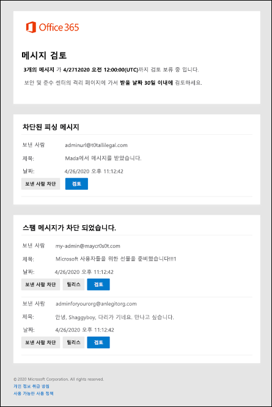

# 검란 알림을 사용하여 검란된 메시지 릴리스 및 보고

[!INCLUDE [Microsoft 365 Defender rebranding](../includes/microsoft-defender-for-office.md)]

**적용 대상**
- [Exchange Online Protection](exchange-online-protection-overview.md)
- [Office 365용 Microsoft Defender 플랜 1 및 플랜 2](defender-for-office-365.md)
- [Microsoft 365 Defender](../defender/microsoft-365-defender.md)

Exchange Online 사서함이 있는 Microsoft 365 조직 또는 Exchange Online 사서함이 없는 독립 실행형 EOP(Exchange online Protection) 조직에서 격리는 위험할 가능성이 있거나 원치 않는 메시지를 보유합니다. 자세한 내용은 [EOP에서 Quarantined messages를 참조하세요.](quarantine-email-messages.md)

_Quarantine policies_ define what users are allowed to do to quarantined messages based on why the message quarantined why the message was quarantined (for supported features). 자세한 내용은 [격리 정책](quarantine-policies.md)을 참조하세요. 또한 검사 경찰은 영향을 받는 받는 사람(공유 사서함 포함)이  자신의 검사된 메시지에 대한 주기적인 검지 알림을 받을지 여부를 제어합니다. 스팸 방지 정책 판정 뿐만 아니라 지원되는 모든 보호 기능에 대한 최종 사용자 스팸 알림을 대체하는 알림입니다.

관리자는 또한 정책에서 전역 설정을 사용하여 보낸 사람 표시 이름, 다른 언어로 된 고지지 텍스트 및 알림에 사용되는 회사 로고를 사용자 지정할 수 있습니다. 자세한 내용은 웹 사이트 포털에서 전역 Microsoft 365 Defender [설정을 참조하세요.](quarantine-policies.md#configure-global-quarantine-notification-settings-in-the-microsoft-365-defender-portal)

공유 사서함의 경우 공유 사서함에 대한 FullAccess 권한이 부여된 사용자에 한해 알림이 지원됩니다. 자세한 내용은 EAC를 사용하여 공유 사서함 위임 [편집을 참조하세요.](/Exchange/collaboration-exo/shared-mailboxes#use-the-eac-to-edit-shared-mailbox-delegation)

> [!NOTE]
> 기본적으로 높은 신뢰도 피싱, 맬웨어, 메일 흐름 규칙(전송 규칙) 또는 금고 Defender에서 첨부 파일 정책으로 Office 365 메시지는 관리자만 사용할 수 있습니다. 자세한 내용은 [EOP에서 관리자로 격리된 메시지 관리하기](manage-quarantined-messages-and-files.md)를 참조하세요.
>
> 그룹에 대해 알림이 지원되지 않습니다.

검지 알림을 받으면 다음 정보를 항상 각 메시지에 대해 사용할 수 있습니다.

- **보낸 사람:** 고지된 메시지의 보낸 사람 이름 및 전자 메일 주소입니다.
- **제목:** 고지된 메시지의 제목 줄 텍스트입니다.
- **날짜:** 메시지가 중단된 날짜 및 시간(UTC)입니다.

메시지의 검지 이유 및 연결된 검사 정책에 의해 할당된 사용 권한에 따라 사용할 수 있는 작업이 달라지기 때문에 이 작업을 수행할 수 있습니다. 자세한 내용은 [Quarantine policy permission details을 참조하십시오.](quarantine-policies.md#quarantine-policy-permission-details)

기본적으로 스팸, 높은 지수 스팸 또는 대량으로 검사된 메시지에 대한 다음 작업을 검지 알림에서 사용할 수 있습니다.

- **보낸 사람 차단:** 이 링크를 클릭하여 사서함의 수신 차단된 보낸 사람 목록에 보낸 사람이 _추가됩니다._ 자세한 내용은 [메일 보낸 사람 차단](https://support.microsoft.com/office/b29fd867-cac9-40d8-aed1-659e06a706e4)을 참조하세요.
- **릴리스:** 메시지 포털에서 **Quarantine으로** 이동하지 않고 여기에서 메시지를 Microsoft 365 Defender 있습니다.
- **검토:** 이 링크를 클릭하여  Microsoft 365 Defender 포털에서 메시지를 보거나, 릴리스하고, 삭제하거나, 보고할 수 있는 Microsoft 365 Defender 포털에서 이 링크를 클릭합니다. 자세한 내용은 EOP에서 사용자로 고지된 메시지 찾기 및 [릴리스를 참조하세요.](find-and-release-quarantined-messages-as-a-user.md)

> [!NOTE]
> 수신이 차단된 보낸 사람이 여전히 메일을 보낼 수 있습니다. 이 보낸 사람이 사서함으로 보내는 모든 메시지는 즉시 정크 메일 폴더로 이동됩니다. 이 보낸 사람이 보낸 향후 메시지는 정크 메일 폴더 또는 검사로 이동합니다. 도착 시 이러한 메시지를 삭제하려면 메일 흐름 규칙(전송 규칙)을 사용하여 도착 시 메시지를 삭제합니다. 
