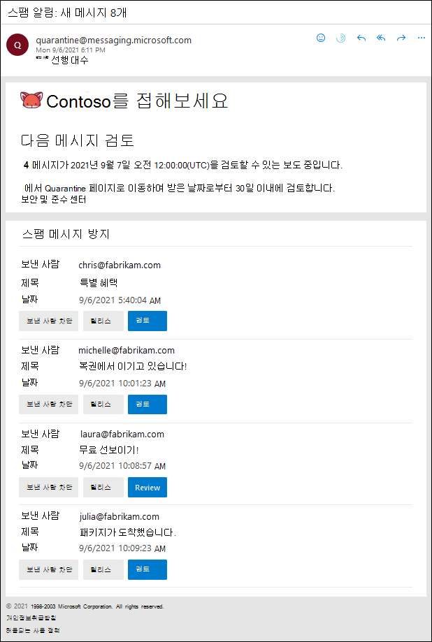

# 사용자 스팸 알림을 사용하여 메시지 릴리스 및 보고

[!INCLUDE [Microsoft 365 Defender rebranding](../includes/microsoft-defender-for-office.md)]

**적용 대상**
- [Exchange Online Protection](exchange-online-protection-overview.md)
- [Office 365용 Microsoft Defender 플랜 1 및 플랜 2](defender-for-office-365.md)
- [Microsoft 365 Defender](../defender/microsoft-365-defender.md)

Exchange Online 사서함이 있는 Microsoft 365 조직 또는 Exchange Online 사서함이 없는 독립 실행형 EOP(Exchange online Protection) 조직에서 격리는 위험할 가능성이 있거나 원치 않는 메시지를 보유합니다. 자세한 내용은 [EOP에서 Quarantined messages를 참조하세요.](quarantine-email-messages.md)

기본적으로 최종 사용자 스팸 알림은 스팸 방지 정책에서 사용하지 않도록 설정됩니다. 관리자가 최종 사용자 스팸 알림을 사용할 수 있도록 설정하면 받는 사람(공유 사서함 포함)은 스팸, 대량 전자 메일 또는 피싱(2020년 4월부터)으로 검색된 메시지에 대한 주기적인 알림을 받게 됩니다.

공유 사서함의 경우 최종 사용자 스팸 알림은 공유 사서함에 대한 FullAccess 권한이 부여된 사용자에 한해 지원됩니다. 자세한 내용은 EAC를 사용하여 공유 사서함 위임 [편집을 참조하세요.](/Exchange/collaboration-exo/shared-mailboxes#use-the-eac-to-edit-shared-mailbox-delegation)

> [!NOTE]
> 높은 신뢰도 피싱, 맬웨어 또는 메일 흐름 규칙(전송 규칙)에 의해서만 차단된 메시지는 관리자만 사용할 수 있습니다. 자세한 내용은 [EOP에서 관리자로 격리된 메시지 관리하기](manage-quarantined-messages-and-files.md)를 참조하세요.
>
> 최종 사용자 스팸 알림은 그룹에 대해 지원되지 않습니다.

최종 사용자 스팸 알림에는 각 고지된 메시지에 대한 다음 정보가 포함되어 있습니다.

- **보낸 사람:** 고지된 메시지의 보낸 사람 이름 및 전자 메일 주소입니다.
- **제목:** 고지된 메시지의 제목 줄 텍스트입니다.
- **날짜:** 메시지가 중단된 날짜 및 시간(UTC)입니다.
- **보낸 사람 차단:** 이 링크를 클릭하여 사서함의 수신 차단된 보낸 사람 목록에 보낸 사람이 추가됩니다. 자세한 내용은 [메일 보낸 사람 차단](https://support.microsoft.com/office/b29fd867-cac9-40d8-aed1-659e06a706e4)을 참조하세요.
- **릴리스:** 스팸(피싱이 아닌) 메시지의 경우 메시지 포털을  검색하지 않고 여기에서 메시지를 해제할 Microsoft 365 Defender 있습니다.
- **검토:** 이 링크를 클릭하여  Microsoft 365 Defender 포털에서 메시지를 보거나, 릴리스하고, 삭제하거나, 보고할 수 있는 Microsoft 365 Defender 포털에서 이 링크를 클릭합니다. 자세한 내용은 EOP에서 사용자로 고지된 메시지 찾기 및 [릴리스를 참조하세요.](find-and-release-quarantined-messages-as-a-user.md)

> [!NOTE]
> 수신이 차단된 보낸 사람이 여전히 메일을 보낼 수 있습니다. 이 보낸 사람이 사서함으로 보내는 모든 메시지는 즉시 정크 메일 폴더로 이동됩니다. 이 보낸 사람이 보낸 향후 메시지는 정크 메일 폴더 또는 최종 사용자 검지로 이동합니다. 도착 시 이러한 메시지를 두지 않고 삭제하려면 메일 흐름 규칙(전송 규칙)을 사용하여 도착 시 메시지를 삭제합니다. 
