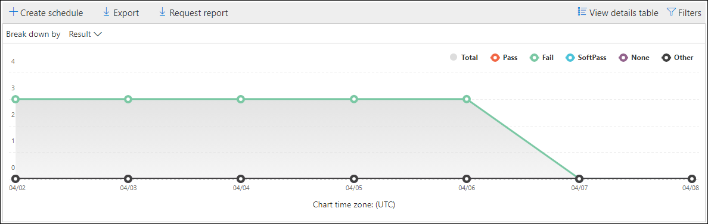
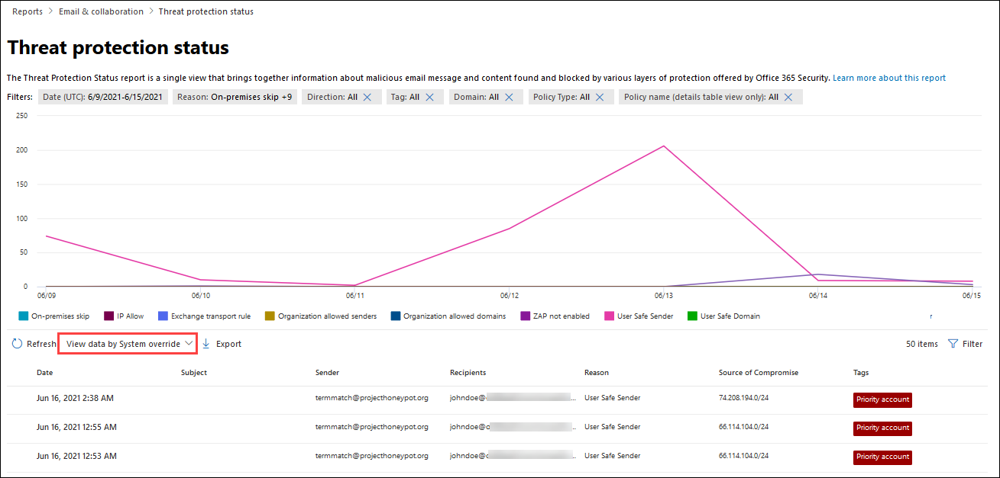

# 보안 및 준수 센터의 전자 메일 보안 보고서 보기

[!INCLUDE [Microsoft 365 Defender rebranding](../includes/microsoft-defender-for-office.md)]

**적용 대상**
- [Exchange Online Protection](exchange-online-protection-overview.md)
- [Office 365용 Microsoft Defender 플랜 1 및 플랜 2](defender-for-office-365.md)
- [Microsoft 365 Defender](../defender/microsoft-365-defender.md)

Security & Compliance Center에서는 다양한 보고서를 사용하여 조직의 스팸 [방지,](https://protection.office.com) 맬웨어 방지 및 암호화 기능과 같은 전자 메일 보안 기능이 Microsoft 365 보호하는 방법을 볼 수 있습니다. 필요한 사용 권한이 있는 경우 보고서 대시보드로 & 보안 및 준수 센터에서 이러한 보고서를 볼 **수** \> **있습니다.** 보고서 대시보드로 직접 이동하기 위해 를 를 <https://protection.office.com/insightdashboard> 습니다.

## 손상된 사용자 보고서

> [!NOTE]
> 이 보고서는 사서함이 있는 Microsoft 365 조직에서 Exchange Online 있습니다. 독립 실행형 EOP(독립 실행형 Exchange Online Protection 조직에서는 사용할 수 없습니다.

손상된 **사용자 보고서에는** 지난 7일 이내에  의심 또는 제한으로  표시된 사용자 계정 수가 표시됩니다. 이러한 상태 중 하나에 있는 계정이 문제가 발생하거나 손상될 수도 있습니다. 자주 사용하는 경우 보고서를 사용하여 의심스러우거나 제한된 계정에서 스파이크 및 추세를 파악할 수 있습니다. 손상된 사용자에 대한 자세한 내용은 손상된 전자 메일 계정에 응답을 [참조하세요.](responding-to-a-compromised-email-account.md)

집계 보기는 지난 90일간의 데이터를 표시하고 세부 정보 보기에는 지난 30일간의 데이터가 표시됩니다.

보고서를 표시하려면 보안 및 준수 & 를 열고 [보고서 대시보드로](https://protection.office.com)이동한 후 손상된  \>  **사용자를 선택합니다.** 보고서로 직접 이동하기 위해 를 를 <https://protection.office.com/reportv2?id=CompromisedUsers> 습니다.

필터를 클릭하고 다음 값 중 하나  이상을 선택하여 차트와 세부 정보 테이블을 모두 필터링할 수 있습니다.

- **시작 날짜** 및 **종료 날짜**

- **의심스러운**: 사용자 계정이 의심스러운 전자 메일을 보냈고 전자 메일을 보내지 못하도록 제한될 위험이 있습니다.

- **제한:** 사용자 계정은 의심스러운 패턴으로 인해 전자 메일을 보내지 못하도록 제한되어 있습니다.

세부 정보 표 **보기를 클릭하면** 다음 세부 정보를 볼 수 있습니다.

- **만들기 시간**
- **사용자 ID**
- **작업**

보고서 보기로 돌아가려면 보고서 **보기 를 클릭합니다.**

## 암호화 보고서

암호화 **보고서는** EOP에서 사용할 수 있습니다(사서함이 없는 Exchange Online 독립 실행형 EOP Exchange Online). 조직의 보안 팀은 이 보고서의 정보를 사용하여 패턴을 식별하고 중요한 전자 메일 메시지에 대한 정책을 사전 예방적으로 적용하거나 조정할 수 있습니다. 예:

- 사용자가 암호화한 전자 메일 메시지가 많은 경우 암호화 정책을 추가하여 특정 사용 사례에 대한 암호화를 자동화할 수 있습니다. 자세한 내용은 [Define mail flow rules to encrypt email messages in Microsoft 365.](../../compliance/define-mail-flow-rules-to-encrypt-email.md)

- 여러 암호화 템플릿을 사용할 수 있지만 아무도 사용하지 않을 경우 사용자에게 기능 교육이 필요한지 여부를 탐색할 수 있습니다.

집계 보기를 사용하면 지난 90일 동안 필터링할 수 있는 반면, 세부 정보 보기에서는 10일 동안 필터링을 허용합니다.

보고서를 표시하려면 보안 및 준수 & 를  열고 [보고서 대시보드로](https://protection.office.com)이동한 다음 암호화 \>  **보고서를 선택합니다.** 보고서로 직접 이동하기 위해 를 를 <https://protection.office.com/reportv2?id=EncryptionReport> 습니다.

암호화에 대한 자세한 내용은 에서 전자 메일 [암호화를 Microsoft 365.](../../compliance/email-encryption.md)

### 암호화 보고서에 대한 보고서 보기

차트에 다음 필터를 사용할 수 있습니다.

- **다음을 통해 데이터 보기: 메시지** 암호화 보고서 및 세분화 **방법: 암호화** 방법: 다음과 같은 암호화 방법을 사용할 수 있습니다.

  - **사용자에 의해 암호화**
  - **정책에 따라 암호화**

  필터를 **클릭하면** 다음 필터를 사용하여 차트를 수정할 수 있습니다.

  - **시작 날짜** 및 **종료 날짜**
  - 암호화 방법.
  - 암호화 서식 파일.

- **다음을 통해 데이터 보기: 메시지** 암호화 보고서 및 다음으로 세분화: **암호화** 템플릿: 다음과 같은 암호화 방법을 사용할 수 있습니다.

  - **전달하지 않습니다.**
  - **암호화만**
  - **OME 이전**
  - **사용자 지정**

  필터를 **클릭하면** 다음 필터를 사용하여 차트를 수정할 수 있습니다.

  - **시작 날짜** 및 **종료 날짜**
  - 암호화 방법
  - 암호화 템플릿

- **다음을 통해 데이터 보기: 상위 5개** 받는 사람 도메인: 이 보기에는 상위 5개 받는 사람 도메인에 대해 보낸 메시지 수가 있는 파이 차트가 표시됩니다.

  필터를 **클릭하면** 시작 날짜와 종료 **날짜를 선택할 수 있습니다.** 

### 암호화 보고서에 대한 세부 정보 테이블 보기

세부 정보 **표 보기를** 클릭하면 표시되는 정보가 보고 있는 차트에 따라 다를 수 있습니다.

- **세분화 방법: 암호화** 방법 또는 다음으로 세분화: **암호화** 템플릿: 다음 정보가 표시됩니다.

  - **날짜**
  - **보낸 사람 주소**
  - **암호화 템플릿**
  - **암호화 방법**
  - **받는 사람 주소**
  - **제목**

- **다음을 통해 데이터 보기: 상위 5개 받는 사람 도메인**:

  - **날짜**
  - **받는 사람 도메인**
  - **메시지 수**

세부 정보 테이블 보기에서 **필터를** 클릭하면 다음 필터를 사용하여 결과를 수정할 수 있습니다.

- **시작 날짜** 및 **종료 날짜**
- 암호화 방법
- 암호화 템플릿

보고서 보기로 돌아가려면 보고서 **보기 를 클릭합니다.**

## 메일 흐름 상태 보고서

메일 **흐름 상태 보고서에는** 맬웨어, 스팸, 피싱 및 Edge 차단 메시지에 대한 정보가 포함되어 있습니다. 자세한 내용은 메일 흐름 상태 [보고서를 참조합니다.](view-mail-flow-reports.md#mailflow-status-report)

## 전자 메일 보고서의 맬웨어 검색

전자 **메일 보고서의** 맬웨어 검색은 들어오는 전자 메일 메시지와 보낸 전자 메일 메시지의 맬웨어 검색에 대한 정보를 Exchange Online Protection EOP에서 검색됩니다. EOP의 맬웨어 보호에 대한 자세한 내용은 [EOP의 맬웨어 방지 보호를 참조하세요.](anti-malware-protection.md)

 집계 보기 필터는 90일 동안 허용되는 반면 세부 정보 테이블 필터는 10일 동안만 허용됩니다.

보고서를 확인하려면 보안 및 준수 & 를 열고 보고서 대시보드로 이동한 다음 전자 [메일에서](https://protection.office.com)  \>  **맬웨어 검색을 선택합니다.** 보고서로 직접 이동하기 위해 를 를 <https://protection.office.com/reportv2?id=MalwareDetections> 습니다.

필터를 클릭하고 다음을 선택하여 차트와 세부 정보 테이블을 **필터링할** 수 있습니다.

- **시작 날짜** 및 **종료 날짜**
- **인바운드**
- **아웃바운드**

세부 정보 표 **보기를 클릭하면** 다음 세부 정보를 볼 수 있습니다.

- **날짜**
- **보낸 사람 주소**
- **받는 사람 주소**
- **메시지 ID:** 메시지 헤더의 **Message-ID** 헤더 필드에서 사용할 수 있으며 고유해야 합니다. 값을 예로 들 수 `<08f1e0f6806a47b4ac103961109ae6ef@server.domain>` 있습니다(괄호 참고).
- **제목**
- **파일 이름**
- **맬웨어 이름**

보고서 보기로 돌아가려면 보고서 **보기 를 클릭합니다.**

## 메일 대기 시간 보고서

메일 **대기 시간 보고서에는** 조직 내에서 경험하는 메일 배달 및 확인 대기 시간에 대한 정보가 포함되어 있습니다. 자세한 내용은 메일 대기 [시간 보고서를 참조하세요.](view-reports-for-mdo.md#mail-latency-report)

## 보낸 전자 메일 보고서 및 받은 전자 메일 보고서

보내고 **받은** 전자 메일 보고서에는 맬웨어, 스팸, 메일 흐름 규칙(전송 규칙) 및 전자 메일이 서비스에 들어오면 고급 맬웨어 검색에 대한 정보가 포함되어 있습니다. 자세한 내용은 보내고 받은 전자 [메일 보고서를 참조하세요.](view-mail-flow-reports.md#sent-and-received-email-report)

## 스팸 검색 보고서

스팸 **검색 보고서에는** EOP에서 차단된 스팸 전자 메일 메시지가 표시됩니다. 메시지는 받는 사람당 계산이 아니라 개별적으로 계산됩니다. 예를 들어 조직의 받는 사람 100명에게 동일한 스팸 메시지를 보낸 경우 하나의 메시지로 계산됩니다.

집계 보기에서는 90일 필터링이 허용되는 반면 세부 정보 표에서는 10일 필터링을 허용합니다.

보고서를 표시하려면 보안 및 준수 & 를 열고 [보고서 대시보드로](https://protection.office.com)이동하여 스팸  \>  **검색을 선택합니다.** 보고서로 직접 이동하기 위해 를 를 <https://protection.office.com/reportv2?id=SpamDetections> 습니다.

스팸 방지 보호에 대한 자세한 내용은 EOP의 스팸 방지 [보호를 참조하세요.](anti-spam-protection.md)

### 스팸 검색 보고서에 대한 보고서 보기

보고서 보기에서는 다음 차트를 사용할 수 있습니다.

- **다음 작업으로 세분화:** 다음 이벤트 유형이 표시됩니다.

  - **스팸 콘텐츠 필터링**
  - **스팸 IP 차단**
  - **스팸 봉투 블록**
  - **스팸 DBEB 필터:** DBEB(디렉터리 기반 Edge 차단)

  차트에서 하루(데이터 데이터 포인트)를 마우스로 마우스로 표시하면 해당 일자에 차단된 항목 수와 해당 항목이 분류되는 방법을 볼 수 있습니다.

  

- **세분화하여: 방향:** 다음 방향이 표시됩니다.

  - **인바운드**
  - **아웃바운드**

  

보고서 보기에서 **필터를** 클릭하면 다음 필터를 사용하여 결과를 수정할 수 있습니다.

- **시작 날짜** 및 **종료 날짜**
- 방향 값
- 이벤트 유형 값

### 스팸 검색 보고서에 대한 세부 정보 테이블 보기

보고서 보기에서 **세부** 정보 표 보기를 클릭하면 다음 정보가 표시됩니다.

- **날짜**
- **보낸 사람 주소**
- **받는 사람 주소**
- **이벤트 유형**
- **작업**
- **제목**

세부 정보 표에서 **필터를** 클릭하면 다음 필터를 사용하여 결과를 수정할 수 있습니다.

- **시작 날짜** 및 **종료 날짜**
- 방향 값
- 이벤트 유형 값

보고서 보기로 돌아가려면 보고서 **보기 를 클릭합니다.**

## 스푸핑 검색 보고서

> [!NOTE]
> 이 문서에 설명된 향상된 스푸핑 검색 보고서는 미리 보기에 있으며 변경될 수 있으며 일부 조직에서는 사용할 수 없습니다. 이전 버전의 보고서에는 **양호한** 메일과 스팸으로 **검색된 메일만 표시되었습니다.**

**스푸핑 검색 보고서에는** 스푸핑으로 인해 차단되거나 허용된 메시지에 대한 정보가 표시됩니다. 스푸핑에 대한 자세한 내용은 [EOP의 스푸핑 방지 보호를 참조하세요.](anti-spoofing-protection.md)

보고서의 집계 보기는 45일 동안 필터링할 수 있는 반면 세부 정보 보기는 \* 10일의 필터링만 허용합니다.

\* 결국 최대 90일의 필터링을 사용할 수 있습니다.

보고서를 표시하려면 보안 및 준수 & 를  열고 [보고서 대시보드로](https://protection.office.com)이동하여 스푸핑 검색을 \>  **선택합니다.** 보고서로 직접 이동하기 위해 를 를 <https://protection.office.com/reportv2?id=SpoofMailReport> 습니다.

차트에서 하루(데이터 데이터 포인트)에 마우스를 대면 검색된 스푸핑된 메시지 수와 그 이유를 볼 수 있습니다.

필터를 클릭하고 다음 값 중 하나  이상을 선택하여 차트와 세부 정보 테이블을 모두 필터링할 수 있습니다.

- **시작 날짜** 및 **종료 날짜**

- **결과**
  - **통과**
  - **실패**
  - **SoftPass**
  - **없음**
  - **기타**

- **스푸핑 유형:** **내부 및** **외부**

세부 정보 표 **보기를 클릭하면** 다음 세부 정보를 볼 수 있습니다.

- **날짜**
- **스푸핑된 사용자**
- **인프라 보내기**
- **스푸핑 유형**
- **결과**
- **결과 코드**
- **SPF**
- **DKIM**
- **DMARC**
- **메시지 수**

보고서 보기로 돌아가려면 보고서 **보기 를 클릭합니다.**

복합 인증 결과 코드에 대한 자세한 내용은 에서 스팸 방지 메시지 [헤더를 Microsoft 365.](anti-spam-message-headers.md)

## 위협 방지 상태 보고서

**위협 방지 상태 보고서는** EOP 및 Microsoft Defender for Office 365. 그러나 보고서에는 다른 데이터가 포함되어 있습니다. 예를 들어 EOP 고객은 전자 메일에서 검색된 맬웨어에 대한 정보를 볼 수 있지만, 에 대해 안전한 첨부 파일에서 검색된 악성 파일에 대한 정보는 [볼 SharePoint,](mdo-for-spo-odb-and-teams.md)OneDrive Microsoft Teams.

이 보고서는 맬웨어 방지 엔진에 의해 차단된 파일 또는 웹 사이트 주소(URL) 및 안전한 링크, 안전한 첨부 파일 및 피싱 방지와 같은 Office 365 기능에 대한 Defender와 같은 악성 콘텐츠가 있는 전자 메일 메시지 수를 제공합니다.   이 정보를 사용하여 추세를 식별하거나 조직 정책에 조정이 필요한지 여부를 확인할 수 있습니다.

**참고:** 받는 사람 5명에게 메시지가 전송된 경우 하나의 메시지가 아니라 5개의 다른 메시지로 계산됩니다.

보고서를 확인하려면 보안 및 준수 & 를 열고 보고서 [대시보드로](https://protection.office.com)이동하여 위협 방지  \>  **상태를 선택합니다.** 보고서로 직접 이동하기 위해 다음 URL 중 하나를 열 수 있습니다.

- Microsoft Defender for Office 365:<https://protection.office.com/reportv2?id=TPSAggregateReportATP>
- EOP: <https://protection.office.com/reportv2?id=TPSAggregateReport>

기본적으로 차트에는 지난 7일간의 데이터가 표시됩니다. 필터를 **클릭하면** 90일 날짜 범위를 선택할 수 있습니다(평가판 구독은 30일로 제한될 수 있습니다). 세부 정보 테이블 보기를 사용하면 30일 동안 필터링할 수 있습니다.

### 위협 방지 상태 보고서에 대한 보고서 보기

다음 보기를 사용할 수 있습니다.

- **다음을 통해 데이터 보기: 개요:** 다음 검색 정보가 표시됩니다.

  - **전자 메일 맬웨어**
  - **전자 메일 피싱**
  - **콘텐츠 맬웨어**

  

- **데이터 보기: \> 콘텐츠 맬웨어**1:조직에 대한 Microsoft Defender에 대한 Office 365 표시됩니다.

  - **맬웨어** 방지 엔진 : Sharepoint, OneDrive 및 에서 Microsoft Teams 기본 제공 바이러스 검색에 의해 검색된 악성 [Microsoft 365.](virus-detection-in-spo.md)
  - **파일 검색:** 파일, 파일 및 에 대한 안전한 첨부 파일에서 SharePoint, OneDrive [Microsoft Teams.](mdo-for-spo-odb-and-teams.md)

  

- **다음을 통해 데이터 보기: 메시지 오버라이드:** 다음과 같은 은(는) 이유에 대한 정보가 표시됩니다.

  - **사내 건너뛰기**
  - **IP 허용**
  - **메일 흐름 규칙**
  - **보낸 사람 허용**
  - **도메인 허용**
  - **ZAP를 사용할 수 없습니다.**
  - **정크 메일 폴더를 사용할 수 없습니다.**
  - **사용자 안전한 보낸 사람**
  - **사용자 안전 도메인**

  

- **다음으로 분석: 검색 기술 및** 다음을 통해 데이터 **보기: 전자 메일 \> 피싱:** 다음 정보가 표시됩니다.

  - **ATP 생성 URL**신뢰도 1:다른 Office 365 고객에 대한 악의적인 URL 신뢰도 Microsoft 365.
  - **고급 피싱 필터:** 기계 학습을 기반으로 하는 피싱 신호입니다.
  - **스푸핑 방지 - DMARC 실패**: 메시지에 대한 DMARC 인증 실패.
  - **스푸핑** 방지 - 도메인 내 : 보낸 사람이 받는 사람 도메인을 스푸핑하려고 합니다.
  - **스푸핑** 방지 - 외부 도메인 : 보낸 사람이 다른 도메인을 스푸핑하려고 합니다.
  - **브랜드 가장:** 보낸 사람 기반의 잘 알려진 브랜드 가장.
  - **도메인 가장**1:고객이 소유하거나 정의하는 도메인을 가장합니다.
  - **EOP URL 신뢰도:** 악의적인 URL 신뢰도.
  - **일반 피싱 필터:** 분석가 규칙에 기반한 피싱 신호입니다.
  - **기타**
  - **피싱 ZAP**2:피싱 메시지의 제로 아워 자동 제거
  - **URL 확인**1
  - **사용자 가장**1:관리자가 정의하거나 사서함 인텔리전스를 통해 학습한 사용자의 가장입니다.

  

- **다음을 통해 분석: 검색 기술** 및 **데이터 보기: 전자 메일 맬웨어: \>** 다음 정보가 표시됩니다.

  - **ATP 생성 파일**신뢰도 1:모든 악성 파일 신뢰도에서 Office 365.
  - **맬웨어 방지 엔진**1: 맬웨어방지 엔진에서 검색.
  - **맬웨어** 방지 정책 파일 형식 블록: 메시지에 식별된 악성 파일의 유형으로 인해 필터링된 전자 메일 메시지입니다.
  - **파일 검색**1:안전한 첨부 파일의 검색.
  - **악의적인 파일 신뢰도**
  - **맬웨어 ZAP**2
  - **기타**

  

- **정책 유형 및** 데이터 보기: 전자 메일 **\> 피싱** 또는 데이터 보기: 전자 메일 맬웨어: 다음 정보가 표시됩니다. **\>**

  - **맬웨어 방지**
  - **안전한 첨부 파일**1
  - **피싱 방지**
  - **스팸 방지**
  - **메일 흐름 규칙(전송** 규칙으로도 알려지기)
  - **기타**

  

- **다음으로 세분화: 배달 상태 및** 다음을 통해 데이터 보기: 전자 메일 **\> 피싱** 또는 데이터 **보기: 전자 메일 \>** 맬웨어: 다음 정보가 표시됩니다.

  - **배달 실패**
  - **삭제**
  - **전달**
  - **호스트된 사서함: 사용자 지정 폴더**
  - **호스트된 사서함: 삭제된 항목**
  - **호스트된 사서함: 받은 편지함**
  - **호스트된 사서함: 정크 메일함**
  - **On-premises server: Delivered**
  - **격리**

  

1 Defender for Office 365 전용

2 ZAP(제로 아워 자동 제거)는 독립 실행형 EOP에서 사용할 수 없습니다(사서함에서만 Exchange Online).

필터를 **클릭하면** 사용 가능한 필터는 보고 있는 차트에 따라 다를 수 있습니다.

- 데이터 **보기: 콘텐츠 \>** 맬웨어의 경우  시작 날짜 및 종료 날짜 및 검색 값으로 보고서를 수정할 **수** 있습니다.

- 다음으로 **데이터 보기: 메시지** 다시 설정의 경우 다음 필터를 사용하여 보고서를 수정할 수 있습니다.

  - **시작 날짜** 및 **종료 날짜**
  - **이유 오버라이드**
  - **태그:** 지정된 사용자 태그가 적용된 사용자 또는 그룹(우선 순위 계정 포함)을 사용하여 결과를 필터링합니다. 사용자 태그에 대한 자세한 내용은 사용자 태그 [를 참조하세요.](user-tags.md)
  - **도메인**

- 다른 모든 보기의 경우 다음 필터를 사용하여 보고서를 수정할 수 있습니다.

  - **시작 날짜** 및 **종료 날짜**
  - **감지**
  - **보호:** **ATP** 또는 **EOP**
  - **태그:** 지정된 사용자 태그가 적용된 사용자 또는 그룹(우선 순위 계정 포함)을 사용하여 결과를 필터링합니다. 사용자 태그에 대한 자세한 내용은 사용자 태그 [를 참조하세요.](user-tags.md)
  - **도메인**

### 위협 방지 상태 보고서에 대한 세부 정보 테이블 보기

세부 정보 **표 보기를** 클릭하면 표시되는 정보가 보고 있는 차트에 따라 다를 수 있습니다.

- **다음을 통해 데이터 보기: 개요:** 세부 **정보** 표 보기 단추를 사용할 수 없습니다.

- **데이터 보기: \> 콘텐츠 맬웨어**:

  - **날짜**
  - **위치**
  - **지시**
  - **맬웨어 이름**

  이 보기에서 **필터를** 클릭하면 시작 날짜  및 종료 날짜 및 검색 값으로 보고서를 수정할 **수** 있습니다.

- **데이터 보기: 메시지 오버라이드**:

  - **날짜**
  - **제목**
  - **보낸 사람**
  - **받는 사람**
  - **검색한 경우**
  - **이유 오버라이드**
  - **손상의 원본**
  - **태그**

  이 보기에서 **필터를** 클릭하면 다음 필터를 사용하여 보고서를 수정할 수 있습니다.

  - **시작 날짜** 및 **종료 날짜**
  - **이유 오버라이드**
  - **태그:** 지정된 사용자 태그가 적용된 사용자 또는 그룹(우선 순위 계정 포함)을 사용하여 결과를 필터링합니다. 사용자 태그에 대한 자세한 내용은 사용자 태그 [를 참조하세요.](user-tags.md)
  - **도메인**
  - **받는** 사람(필터링할 수 있는 속성은 세부 정보 테이블 보기에서만 사용할 수 있습니다.)

- 다른 모든 차트:

  - **날짜**
  - **제목**
  - **보낸 사람**
  - **받는 사람**
  - **검색한 경우**
  - **배달 상태**
  - **손상의 원본**
  - **태그**

  필터를 **클릭하면** 다음 필터를 사용하여 보고서를 수정할 수 있습니다.

  - **시작 날짜** 및 **종료 날짜**
  - **감지**
  - **보호:** Office 365 **또는 EOP에** 대한 **Defender**
  - **태그:** 지정된 사용자 태그가 적용된 사용자 또는 그룹(우선 순위 계정 포함)을 사용하여 결과를 필터링합니다. 사용자 태그에 대한 자세한 내용은 사용자 태그 [를 참조하세요.](user-tags.md)
  - **도메인**
  - **받는** 사람(필터링할 수 있는 속성은 세부 정보 테이블 보기에서만 사용할 수 있습니다.)

## 상위 맬웨어 보고서

Top **malware report** shows the various kinds of malware that was detected by [anti-malware protection in EOP.](anti-malware-protection.md)

보고서를 표시하려면 보안 및 준수 & 를 열고 보고서 [대시보드로](https://protection.office.com)이동하여 상위 맬웨어를  \>  **선택합니다.** 보고서로 직접 이동하기 위해 를 를 <https://protection.office.com/reportv2?id=TopMalware> 습니다.

파이 차트에서 에지 위에 마우스를 대면 맬웨어의 종류 이름과 해당 맬웨어가 있는 것으로 감지된 메시지 수를 볼 수 있습니다.

세부 정보 표 **보기를 클릭하면** 다음 세부 정보를 볼 수 있습니다.

- **상위 맬웨어**
- **개수**

보고서 **보기** 또는 세부 정보 테이블 보기에서 필터를 클릭하면 시작  날짜 및 종료 날짜가 인 날짜 범위를 지정할 **수 있습니다.**

## URL 위협 방지 보고서

**URL 위협 방지 보고서는** Microsoft Defender for Office 365. 자세한 내용은 [URL 위협 방지 보고서를 참조하세요.](view-reports-for-mdo.md#url-threat-protection-report)

## 사용자가 보고한 메시지 보고서

사용자가 **보고한** 메시지 보고서에는 보고서 메시지 추가 기능 또는 피싱 보고 추가 기능을 사용하여 사용자가  정크 메일, 피싱 시도 또는 양호한 메일로 보고한 전자 메일 메시지에 대한 정보가 [표시됩니다.](enable-the-report-phish-add-in.md)

조직에 대해 구성된 스팸 정책 예외 또는 메일 흐름 규칙과 같은 배달 이유를 포함하여 각 메시지에 대한 세부 정보를 사용할 수 있습니다. 세부 정보를 확인하려면 사용자 보고서 목록에서 항목을 선택한 다음 요약  및 세부 정보 탭에서 정보를 **볼** 수 있습니다.

이 보고서를 보기 위해 보안 & [준수](https://protection.office.com)센터에서 다음 중 하나를 합니다.

- 위협 **관리** \> **대시보드** \> **사용자가 보고한 메시지로 이동하세요.**

- 위협 **관리** \> **검토** \> **사용자가 보고한 메시지 검토로 이동하십시오.**

> [!IMPORTANT]
> 사용자 보고 메시지 보고서가 제대로 작동하려면  사용자 환경에 대해 감사 로깅을 Office 365 합니다. 이 작업은 일반적으로 감사 로그 역할이 할당된 사용자가 Exchange Online. 자세한 내용은 감사 로그 Microsoft 365 설정 또는 해제를 [참조하세요.](../../compliance/turn-audit-log-search-on-or-off.md)

## 이러한 보고서를 보는 데 필요한 사용 권한은 무엇입니까?

이 문서에 설명된 보고서를 보고 사용하려면 Security & Compliance Center에서 다음 역할 그룹 중 하나에 & 합니다.

- **조직 관리**
- **보안 관리자**
- **보안 읽기**
- **전역 읽기 권한자**

자세한 내용은 [보안 및 준수 센터의 사용 권한](permissions-in-the-security-and-compliance-center.md)을 참조하세요.

**참고:** Microsoft 365 관리 센터에서 해당 Azure Active Directory 역할에 사용자를 추가하면 사용자에게 보안 & 준수 센터에서  필요한 사용 권한과 Microsoft 365. 자세한 내용은 [관리자 역할 정보](../../admin/add-users/about-admin-roles.md)를 참조하세요.

## 보고서에 데이터가 표시되지 않는 경우 어떻게 하나요?

보고서에 데이터가 없는 경우 정책이 올바르게 설정되어 있는지 다시 확인합니다. 자세한 내용은 [위협으로부터 보호를 참조합니다.](protect-against-threats.md)

## 관련 항목

[EOP의 스팸 방지 및 맬웨어 방지 보호 기능](anti-spam-and-anti-malware-protection.md)

[보안 및 준수 센터의 스마트 보고서 및 인사이트](reports-and-insights-in-security-and-compliance.md)

[보안 및 준수 센터에서 & 흐름 보고서 보기](view-mail-flow-reports.md)

[Defender for Office 365](view-reports-for-mdo.md)
