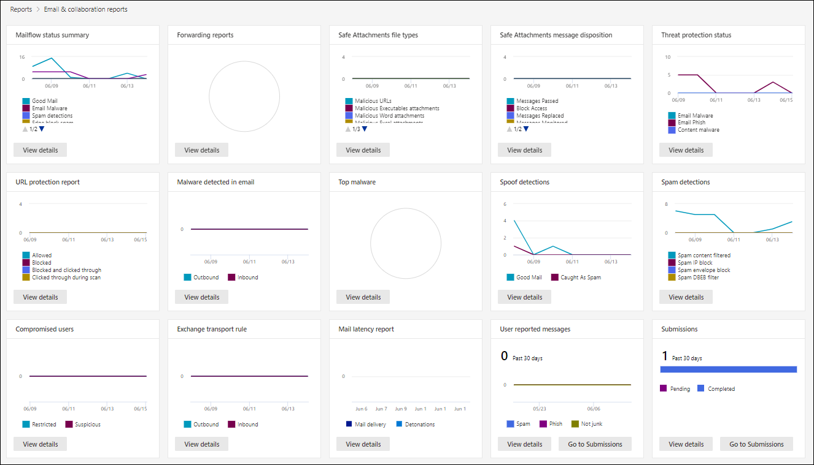

# Defender 포털에서 Microsoft 365 보안 보고서 보기View email security reports in the Microsoft 365 Defender portal

[!INCLUDE [Microsoft 365 Defender rebranding](../includes/microsoft-defender-for-office.md)]

**적용 대상****Applies to**
- [Exchange Online ProtectionExchange Online Protection](exchange-online-protection-overview.md)
- [Office 365용 Microsoft Defender 플랜 1 및 플랜 2Microsoft Defender for Office 365 plan 1 and plan 2](defender-for-office-365.md)
- [Microsoft 365 DefenderMicrosoft 365 Defender](../defender/microsoft-365-defender.md)

Microsoft 365 Defender 포털에서 다양한 보고서를 사용하여 스팸 [방지,](https://security.microsoft.com) 맬웨어 방지 및 암호화 기능과 같은 전자 메일 보안 기능이 Microsoft 365 보호하는 방법을 볼 수 있습니다.A variety of reports are available in the [Microsoft 365 Defender portal](https://security.microsoft.com) to help you see how email security features, such as anti-spam, anti-malware, and encryption features in Microsoft 365 are protecting your organization. 필요한 권한이 있는 경우 보고서 전자 메일 Microsoft 365 공동 작업 전자 메일  공동 작업 전자 메일 & 공동 작업 보고서로 이동하여 & \>  \> **수 있습니다.**If you have the [necessary permissions](#what-permissions-are-needed-to-view-these-reports), you can view these reports in the Microsoft 365 Defender portal by going to **Reports** \> **Email & collaboration** \> **Email & collaboration reports**. 보고서 대시보드로 직접 이동하기 위해 를 를 <https://security.microsoft.com/emailandcollabreport> 습니다.To go directly to the Reports dashboard, open <https://security.microsoft.com/emailandcollabreport>.

## 손상된 사용자 보고서Compromised users report

> [!NOTE]
> 이 보고서는 사서함이 있는 Microsoft 365 조직에서 Exchange Online 있습니다.This report is available in Microsoft 365 organizations with Exchange Online mailboxes. 독립 실행형 EOP(독립 실행형 Exchange Online Protection 조직에서는 사용할 수 없습니다.It's not available in standalone Exchange Online Protection (EOP) organizations.

손상된 **사용자 보고서에는** 지난 7일 이내에  의심 또는 제한으로  표시된 사용자 계정 수가 표시됩니다.The **Compromised users** report shows shows the number of user accounts that were marked as **Suspicious** or **Restricted** within the last 7 days. 이러한 상태 중 하나에 있는 계정이 문제가 발생하거나 손상될 수도 있습니다.Accounts in either of these states are problematic or even compromised. 자주 사용하는 경우 보고서를 사용하여 의심스러우거나 제한된 계정에서 스파이크 및 추세를 파악할 수 있습니다.With frequent use, you can use the report to spot spikes, and even trends, in suspicious or restricted accounts. 손상된 사용자에 대한 자세한 내용은 손상된 전자 메일 계정에 응답을 [참조하세요.](responding-to-a-compromised-email-account.md)For more information about compromised users, see [Responding to a compromised email account](responding-to-a-compromised-email-account.md).

집계 보기는 지난 90일간의 데이터를 표시하고 세부 정보 보기에는 지난 30일간의 데이터가 표시됩니다.The aggregate view shows data for the last 90 days and the detail view shows data for the last 30 days.

보고서를 보려면 Microsoft 365 [Defender](https://security.microsoft.com)포털을 열고 보고서  전자 메일 & 공동 작업 전자 메일 & 공동 작업 보고서로 이동한 다음 손상된 사용자 아래에서 \>  \> **세부 정보** **보기를 클릭합니다.** To view the report, open the [Microsoft 365 Defender portal](https://security.microsoft.com), go to **Reports** \> **Email & collaboration** \> **Email & collaboration reports** and click **View details** under **Compromised users**. 보고서로 직접 이동하기 위해 를 를 <https://security.microsoft.com/reports/CompromisedUsers> 습니다.To go directly to the report, open <https://security.microsoft.com/reports/CompromisedUsers>.

필터를 클릭하고 다음 값 중 하나  이상을 선택하여 차트와 세부 정보 테이블을 모두 필터링할 수 있습니다.You can filter both the chart and the details table by clicking **Filters** and selecting one or more of the following values:

- **시작 날짜** 및 **종료 날짜****Start date** and **End date**

- **의심스러운**: 사용자 계정이 의심스러운 전자 메일을 보냈고 전자 메일을 보내지 못하도록 제한될 위험이 있습니다.**Suspicious**: The user account has sent suspicious email and is at risk of being restricted from sending email.

- **제한:** 사용자 계정은 의심스러운 패턴으로 인해 전자 메일을 보내지 못하도록 제한되어 있습니다.**Restricted**: The user account has been restricted from sending email due to highly suspicious patterns.

세부 정보 표 **보기를 클릭하면** 다음 세부 정보를 볼 수 있습니다.If you click **View details table**, you can see the following details:

- **만들기 시간****Creation time**
- **사용자 ID****User ID**
- **작업****Action**

보고서 보기로 돌아가려면 보고서 **보기 를 클릭합니다.**To go back to the report view, click **View report**.

## 암호화 보고서Encryption report

암호화 **보고서는** EOP에서 사용할 수 있습니다(사서함이 없는 Exchange Online 독립 실행형 EOP Exchange Online).The **Encryption report** is available in EOP (subscriptions with mailboxes in Exchange Online or standalone EOP without Exchange Online mailboxes). 조직의 보안 팀은 이 보고서의 정보를 사용하여 패턴을 식별하고 중요한 전자 메일 메시지에 대한 정책을 사전 예방적으로 적용하거나 조정할 수 있습니다.Your organization's security team can use information in this report to identify patterns and proactively apply or adjust policies for sensitive email messages. 예시:For example:

- 사용자가 암호화한 전자 메일 메시지가 많은 경우 암호화 정책을 추가하여 특정 사용 사례에 대한 암호화를 자동화할 수 있습니다.If you see a high number of email messages encrypted by users, you might want to add an encryption policy to automate encryption for certain use cases. 자세한 내용은 [Define mail flow rules to encrypt email messages in Microsoft 365.](../../compliance/define-mail-flow-rules-to-encrypt-email.md)For more information, see [Define mail flow rules to encrypt email messages in Microsoft 365](../../compliance/define-mail-flow-rules-to-encrypt-email.md).

- 여러 암호화 템플릿을 사용할 수 있지만 아무도 사용하지 않을 경우 사용자에게 기능 교육이 필요한지 여부를 탐색할 수 있습니다.If you have a number of encryption templates available but no one is using them, you might explore whether users need feature training.

집계 보기를 사용하면 지난 90일 동안 필터링할 수 있는 반면, 세부 정보 보기에서는 10일 동안 필터링을 허용합니다.The aggregate view allows filtering for the last 90 days, while the detail view allows filtering for 10 days.

보고서를 보려면 Microsoft 365 [Defender](https://security.microsoft.com)포털을 열고 보고서  전자 메일 & 공동 작업 전자 메일 & 공동 작업 보고서로 이동한 다음 암호화 보고서에서 세부 \>  \> **정보 보기를** **클릭합니다.** To view the report, open the [Microsoft 365 Defender portal](https://security.microsoft.com), go to **Reports** \> **Email & collaboration** \> **Email & collaboration reports** and click **View details** under **Encryption report**. 보고서로 직접 이동하기 위해 를 를 <https://protection.office.com/reportv2?id=EncryptionReport> 습니다.To go directly to the report, open <https://protection.office.com/reportv2?id=EncryptionReport>.

암호화에 대한 자세한 내용은 에서 전자 메일 [암호화를 Microsoft 365.](../../compliance/email-encryption.md)To learn more about encryption, see [Email encryption in Microsoft 365](../../compliance/email-encryption.md).

### 암호화 보고서에 대한 보고서 보기Report view for the Encryption report

차트에 다음 필터를 사용할 수 있습니다.You can use the following filters on the chart:

- **다음을 통해 데이터 보기: 메시지** 암호화 보고서 및 세분화 **방법: 암호화** 방법: 다음과 같은 암호화 방법을 사용할 수 있습니다.**View data by: Message Encryption Report** and **Break down by: Encryption method**: The following encryption methods are available:

  - **사용자에 의해 암호화****Encryption by user**
  - **정책에 따라 암호화****Encryption by policy**

  필터를 **클릭하면** 다음 필터를 사용하여 차트를 수정할 수 있습니다.If you click **Filters**, you can modify the chart with the following filters:

  - **시작 날짜** 및 **종료 날짜****Start date** and **End date**
  - 암호화 방법.Encryption method.
  - 암호화 서식 파일.Encryption template.

- **다음을 통해 데이터 보기: 메시지** 암호화 보고서 및 다음으로 세분화: **암호화** 템플릿: 다음과 같은 암호화 방법을 사용할 수 있습니다.**View data by: Message Encryption Report** and **Break down by: Encryption template**: The following encryption methods are available:

  - **전달하지 않습니다.****Do not forward**
  - **암호화만****Encrypt only**
  - **OME 이전****OME previous**
  - **사용자 지정****Custom**

  필터를 **클릭하면** 다음 필터를 사용하여 차트를 수정할 수 있습니다.If you click **Filters**, you can modify the chart with the following filters:

  - **시작 날짜** 및 **종료 날짜****Start date** and **End date**
  - 암호화 방법Encryption method
  - 암호화 템플릿Encryption template

- **다음을 통해 데이터 보기: 상위 5개** 받는 사람 도메인: 이 보기에는 상위 5개 받는 사람 도메인에 대해 보낸 메시지 수가 있는 파이 차트가 표시됩니다.**View data by: Top 5 recipient domains**: This view shows a pie chart with sent message counts for the top 5 recipient domains.

  필터를 **클릭하면** 시작 날짜와 종료 **날짜를 선택할 수 있습니다.** If you click **Filters**, you can select a **Start date** and **End date**.

### 암호화 보고서에 대한 세부 정보 테이블 보기Details table view for the Encryption report

세부 정보 **표 보기를** 클릭하면 표시되는 정보가 보고 있는 차트에 따라 다를 수 있습니다.If you click **View details table**, the information that's shown depends on the chart you were looking at:

- **세분화 방법: 암호화** 방법 또는 다음으로 세분화: **암호화** 템플릿: 다음 정보가 표시됩니다.**Break down by: Encryption method** or **Break down by: Encryption template**: The following information is shown:

  - **날짜****Date**
  - **보낸 사람 주소****Sender address**
  - **암호화 템플릿****Encryption template**
  - **암호화 방법****Encryption method**
  - **받는 사람 주소****Recipient address**
  - **제목****Subject**

- **다음을 통해 데이터 보기: 상위 5개 받는 사람 도메인**:**View data by: Top 5 recipient domains**:

  - **날짜****Date**
  - **받는 사람 도메인****Recipient domain**
  - **메시지 수****Message count**

세부 정보 테이블 보기에서 **필터를** 클릭하면 다음 필터를 사용하여 결과를 수정할 수 있습니다.If you click **Filters** in a details table view, you can modify the results with the following filters:

- **시작 날짜** 및 **종료 날짜****Start date** and **End date**
- 암호화 방법Encryption method
- 암호화 템플릿Encryption template

보고서 보기로 돌아가려면 보고서 **보기 를 클릭합니다.**To go back to the report view, click **View report**.

## 메일 흐름 상태 보고서Mailflow status report

메일 **흐름 상태 보고서에는** 맬웨어, 스팸, 피싱 및 Edge 차단 메시지에 대한 정보가 포함되어 있습니다.The **Mailflow status report** contains information about malware, spam, phishing and edge blocked messages. 자세한 내용은 메일 흐름 상태 [보고서를 참조합니다.](view-mail-flow-reports.md#mailflow-status-report)For more details, see [Mailflow status report](view-mail-flow-reports.md#mailflow-status-report).

## 전자 메일 보고서의 맬웨어 검색Malware detections in email report

전자 **메일 보고서의** 맬웨어 검색은 들어오는 전자 메일 메시지와 보낸 전자 메일 메시지의 맬웨어 검색에 대한 정보를 Exchange Online Protection EOP에서 검색됩니다.The **Malware detections in email** report shows information about malware detections in incoming and outgoing email messages (malware detected by Exchange Online Protection or EOP). EOP의 맬웨어 보호에 대한 자세한 내용은 [EOP의 맬웨어 방지 보호를 참조하세요.](anti-malware-protection.md)For more information about malware protection in EOP, see [Anti-malware protection in EOP](anti-malware-protection.md).

 집계 보기 필터는 90일 동안 허용되는 반면 세부 정보 테이블 필터는 10일 동안만 허용됩니다.The aggregate view filter allows for 90 days, while the details table filter only allows for 10 days.

보고서를 보려면 [Microsoft 365 Defender](https://security.microsoft.com)포털을 열고 보고서  전자 메일 & 공동 작업 전자 메일 & 공동 작업 보고서로 이동한 다음 전자 메일에서 검색된 맬웨어 아래에서 세부 정보 보기를 \>  \>  **클릭합니다.** To view the report, open the [Microsoft 365 Defender portal](https://security.microsoft.com), go to **Reports** \> **Email & collaboration** \> **Email & collaboration reports** and click **View details** under **Malware detected in email**. 보고서로 직접 이동하기 위해 를 를 <https://security.microsoft.com/reports/MalwareDetections> 습니다.To go directly to the report, open <https://security.microsoft.com/reports/MalwareDetections>.

필터를 클릭하고 다음을 선택하여 차트와 세부 정보 테이블을 **필터링할** 수 있습니다.You can filter both the chart and the details table by clicking **Filters** and selecting:

- **시작 날짜** 및 **종료 날짜****Start date** and **End date**
- **인바운드****Inbound**
- **아웃바운드****Outbound**

세부 정보 표 **보기를 클릭하면** 다음 세부 정보를 볼 수 있습니다.If you click **View details table**, you can see the following details:

- **날짜****Date**
- **보낸 사람 주소****Sender address**
- **받는 사람 주소****Recipient address**
- **메시지 ID:** 메시지 헤더의 **Message-ID** 헤더 필드에서 사용할 수 있으며 고유해야 합니다.**Message ID**: Available in the **Message-ID** header field in the message header and should be unique. 값을 예로 들 수 `<08f1e0f6806a47b4ac103961109ae6ef@server.domain>` 있습니다(괄호 참고).An example value is `<08f1e0f6806a47b4ac103961109ae6ef@server.domain>` (note the angle brackets).
- **제목****Subject**
- **파일 이름****Filename**
- **맬웨어 이름****Malware name**

보고서 보기로 돌아가려면 보고서 **보기 를 클릭합니다.**To go back to the report view, click **View report**.

## 메일 대기 시간 보고서Mail latency report

메일 **대기 시간 보고서에는** 조직 내에서 경험하는 메일 배달 및 확인 대기 시간에 대한 정보가 포함되어 있습니다.The **Mail latency report** contains information on the mail delivery and detonation latency experienced within your organization. 자세한 내용은 메일 대기 [시간 보고서를 참조하세요.](view-reports-for-mdo.md#mail-latency-report)For more information, see [Mail latency report](view-reports-for-mdo.md#mail-latency-report).

## 보낸 전자 메일 보고서 및 받은 전자 메일 보고서Sent and received email report

보내고 **받은** 전자 메일 보고서에는 맬웨어, 스팸, 메일 흐름 규칙(전송 규칙) 및 전자 메일이 서비스에 들어오면 고급 맬웨어 검색에 대한 정보가 포함되어 있습니다.The **Sent and received email** report contains information about malware, spam, mail flow rules (also known as transport rules), and advanced malware detections after email enters the service. 자세한 내용은 보내고 받은 전자 [메일 보고서를 참조하세요.](view-mail-flow-reports.md#sent-and-received-email-report)For more information, see [Sent and received email report](view-mail-flow-reports.md#sent-and-received-email-report).

## 스팸 검색 보고서Spam detections report

스팸 **검색 보고서에는** EOP에서 차단된 스팸 전자 메일 메시지가 표시됩니다.The **Spam detections** report shows spam email messages that were blocked by EOP. 메시지는 받는 사람당 계산이 아니라 개별적으로 계산됩니다.Messages are counted individually, not per recipient. 예를 들어 조직의 받는 사람 100명에게 동일한 스팸 메시지를 보낸 경우 하나의 메시지로 계산됩니다.For example, if the same spam message was sent to 100 recipients in your organization, it counts as one message.

집계 보기에서는 90일 필터링이 허용되는 반면 세부 정보 표에서는 10일 필터링을 허용합니다.The aggregate view allows for 90 days filtering, while the details table allows for 10 days filtering.

보고서를 보려면 [Microsoft 365 Defender](https://security.microsoft.com)포털을 열고 보고서  전자 메일 & 공동 작업 전자 메일 & 공동 작업 보고서로 이동한 다음 스팸 검색에서 세부 \>  \> **정보 보기를** **클릭합니다.** To view the report, open the [Microsoft 365 Defender portal](https://security.microsoft.com), go to **Reports** \> **Email & collaboration** \> **Email & collaboration reports** and click click **View details** under **Spam detections**. 보고서로 직접 이동하기 위해 를 를 <https://security.microsoft.com/reports/SpamDetections> 습니다.To go directly to the report, open <https://security.microsoft.com/reports/SpamDetections>.

스팸 방지 보호에 대한 자세한 내용은 EOP의 스팸 방지 [보호를 참조하세요.](anti-spam-protection.md)For more information about anti-spam protection, see [Anti-spam protection in EOP](anti-spam-protection.md).

### 스팸 검색 보고서에 대한 보고서 보기Report view for the Spam detections report

보고서 보기에서는 다음 차트를 사용할 수 있습니다.The following charts are available in the report view:

- **다음 작업으로 세분화:** 다음 이벤트 유형이 표시됩니다.**Break down by: Action**: The following event types are shown:

  - **스팸 콘텐츠 필터링****Spam content filtered**
  - **스팸 IP 차단****Spam IP block**
  - **스팸 봉투 블록****Spam envelope block**
  - **스팸 DBEB 필터:** DBEB(디렉터리 기반 Edge 차단)**Spam DBEB filter**: Directory based edge blocking (DBEB)

  차트에서 하루(데이터 데이터 포인트)를 마우스로 마우스로 표시하면 해당 일자에 차단된 항목 수와 해당 항목이 분류되는 방법을 볼 수 있습니다.When you hover over a day (data point) in the chart, you can see how many items were blocked that day, as well as how those items are categorized.

  

- **세분화하여: 방향:** 다음 방향이 표시됩니다.**Break down by: Direction**: The following directions are shown:

  - **인바운드****Inbound**
  - **아웃바운드****Outbound**

  

보고서 보기에서 **필터를** 클릭하면 다음 필터를 사용하여 결과를 수정할 수 있습니다.If you click **Filters** in a report view, you can modify the results with the following filters:

- **시작 날짜** 및 **종료 날짜****Start date** and **End date**
- 방향 값Direction values
- 이벤트 유형 값Event type values

### 스팸 검색 보고서에 대한 세부 정보 테이블 보기Details table view for the Spam detections report

보고서 보기에서 **세부** 정보 표 보기를 클릭하면 다음 정보가 표시됩니다.If you click **View details table** in any report view, the following information is shown:

- **날짜****Date**
- **보낸 사람 주소****Sender address**
- **받는 사람 주소****Recipient address**
- **이벤트 유형****Event type**
- **작업****Action**
- **제목****Subject**

세부 정보 표에서 **필터를** 클릭하면 다음 필터를 사용하여 결과를 수정할 수 있습니다.If you click **Filters** in a details table, you can modify the results with the following filters:

- **시작 날짜** 및 **종료 날짜****Start date** and **End date**
- 방향 값Direction values
- 이벤트 유형 값Event type values

보고서 보기로 돌아가려면 보고서 **보기 를 클릭합니다.**To go back to the report view, click **View report**.

## 스푸핑 검색 보고서Spoof detections report

> [!NOTE]
> 이 문서에 설명된 향상된 스푸핑 검색 보고서는 미리 보기에 있으며 변경될 수 있으며 일부 조직에서는 사용할 수 없습니다.The improved Spoof detections report as described in this article is in Preview, is subject to change, and is not available in all organizations. 이전 버전의 보고서에는 **양호한** 메일과 스팸으로 **검색된 메일만 표시되었습니다.**The older version of the report showed only **Good mail** and **Caught as spam**.

**스푸핑 검색 보고서에는** 스푸핑으로 인해 차단되거나 허용된 메시지에 대한 정보가 표시됩니다.The **Spoof detections** report shows information about messages that were blocked or allowed due to spoofing. 스푸핑에 대한 자세한 내용은 [EOP의 스푸핑 방지 보호를 참조하세요.](anti-spoofing-protection.md)For more information about spoofing, see [Anti-spoofing protection in EOP](anti-spoofing-protection.md).

보고서의 집계 보기는 45일 동안 필터링할 수 있는 반면 세부 정보 보기는 \* 10일의 필터링만 허용합니다.The aggregate view of the report allows for 45 days of filtering\*, while the detail view only allows for ten days of filtering.

\* 결국 최대 90일의 필터링을 사용할 수 있습니다.\* Eventually, you'll be able to use up to 90 days of filtering.

보고서를 보려면 [Microsoft 365 Defender](https://security.microsoft.com)포털을 열고 보고서  전자 메일 & 공동 작업 전자 메일 & 공동 작업 보고서로 이동한 다음 스푸핑 검색에서 세부 \>  \> **정보 보기를** **클릭합니다.** To view the report, open the [Microsoft 365 Defender portal](https://security.microsoft.com), go to **Reports** \> **Email & collaboration** \> **Email & collaboration reports** and click **View details** under **Spoof detections**. 보고서로 직접 이동하기 위해 를 를 <https://security.microsoft.com/reports/SpoofMailReport> 습니다.To go directly to the report, open <https://security.microsoft.com/reports/SpoofMailReport>.

차트에서 하루(데이터 데이터 포인트)에 마우스를 대면 검색된 스푸핑된 메시지 수와 그 이유를 볼 수 있습니다.When you hover over a day (data point) in the chart, you can see how many spoofed messages were detected and why.

필터를 클릭하고 다음 값 중 하나  이상을 선택하여 차트와 세부 정보 테이블을 모두 필터링할 수 있습니다.You can filter both the chart and the details table by clicking **Filters** and selecting one or more of the following values:

- **시작 날짜** 및 **종료 날짜****Start date** and **End date**

- **결과****Result**
  - **통과****Pass**
  - **실패****Fail**
  - **SoftPass****SoftPass**
  - **없음****None**
  - **기타****Other**

- **스푸핑 유형:** **내부 및** **외부****Spoof type**: **Internal** and **External**

세부 정보 표 **보기를 클릭하면** 다음 세부 정보를 볼 수 있습니다.If you click **View details table**, you can see the following details:

- **날짜****Date**
- **스푸핑된 사용자****Spoofed user**
- **인프라 보내기****Sending infrastructure**
- **스푸핑 유형****Spoof type**
- **결과****Result**
- **결과 코드****Result code**
- **SPF****SPF**
- **DKIM****DKIM**
- **DMARC****DMARC**
- **메시지 수****Message count**

보고서 보기로 돌아가려면 보고서 **보기 를 클릭합니다.**To go back to the report view, click **View report**.

복합 인증 결과 코드에 대한 자세한 내용은 에서 스팸 방지 메시지 [헤더를 Microsoft 365.](anti-spam-message-headers.md)For more information about composite authentication result codes, see [Anti-spam message headers in Microsoft 365](anti-spam-message-headers.md).

## 위협 방지 상태 보고서Threat protection status report

**위협 방지 상태 보고서는** EOP 및 Microsoft Defender for Office 365. 그러나 보고서에는 다른 데이터가 포함되어 있습니다.The **Threat protection status** report is available in both EOP and Microsoft Defender for Office 365; however, the reports contain different data. 예를 들어 EOP 고객은 전자 메일에서 검색된 맬웨어에 대한 정보를 볼 수 있지만, 에 대해 안전한 첨부 파일에서 검색된 악성 파일에 대한 정보는 [볼 SharePoint,](mdo-for-spo-odb-and-teams.md)OneDrive Microsoft Teams.For example, EOP customers can view information about malware detected in email, but not information about malicious files detected by [Safe Attachments for SharePoint, OneDrive, and Microsoft Teams](mdo-for-spo-odb-and-teams.md).

이 보고서는 맬웨어 방지 엔진에 의해 차단된 파일 또는 웹 사이트 주소(URL) 및 안전한 링크, 안전한 첨부 파일 및 피싱 방지와 같은 Office 365 기능에 대한 Defender와 같은 악성 콘텐츠가 있는 전자 메일 메시지 수를 제공합니다.  The report provides the count of email messages with malicious content, such as files or website addresses (URLs) that were blocked by the anti-malware engine, [zero-hour auto purge (ZAP)](zero-hour-auto-purge.md), and Defender for Office 365 features like [Safe Links](safe-links.md), [Safe Attachments](safe-attachments.md), and [Anti-phishing](set-up-anti-phishing-policies.md). 이 정보를 사용하여 추세를 식별하거나 조직 정책에 조정이 필요한지 여부를 확인할 수 있습니다.You can use this information to identify trends or determine whether organization policies need adjustment.

**참고:** 받는 사람 5명에게 메시지가 전송된 경우 하나의 메시지가 아니라 5개의 다른 메시지로 계산됩니다.**Note**: It's important to understand that if a message is sent to five recipients we count it as five different messages and not one message.

보고서를 보려면 [Microsoft 365 Defender](https://security.microsoft.com)포털을 열고 보고서  전자 메일 & 공동 작업 전자 메일 & 공동 작업 보고서로 이동한 다음 위협 방지 상태 아래에서 세부 \>  \> **정보 보기를** **클릭합니다.** To view the report, open the [Microsoft 365 Defender portal](https://security.microsoft.com), go to **Reports** \> **Email & collaboration** \> **Email & collaboration reports** and click **View details** under **Threat protection status**. 보고서로 직접 이동하기 위해 다음 URL 중 하나를 열 수 있습니다.To go directly to the report, open one of the following URLs:

- Microsoft Defender for Office 365:<https://protection.office.com/reportv2?id=TPSAggregateReportATP>Microsoft Defender for Office 365: <https://protection.office.com/reportv2?id=TPSAggregateReportATP>
- EOP: <https://protection.office.com/reportv2?id=TPSAggregateReport>EOP: <https://protection.office.com/reportv2?id=TPSAggregateReport>

기본적으로 차트에는 지난 7일간의 데이터가 표시됩니다.By default, the chart shows data for the past 7 days. 필터를 **클릭하면** 90일 날짜 범위를 선택할 수 있습니다(평가판 구독은 30일로 제한될 수 있습니다).If you click **Filters**, you can select a 90 day date range (trial subscriptions might be limited to 30 days). 세부 정보 테이블 보기를 사용하면 30일 동안 필터링할 수 있습니다.The details table view allows filtering for 30 days.

### 위협 방지 상태 보고서에 대한 보고서 보기Report view for the Threat protection status report

다음 보기를 사용할 수 있습니다.The following views are available:

- **다음을 통해 데이터 보기: 개요:** 다음 검색 정보가 표시됩니다.**View data by: Overview**: The following detection information is shown:

  - **전자 메일 맬웨어****Email malware**
  - **전자 메일 피싱****Email phish**
  - **콘텐츠 맬웨어****Content malware**

  

- **데이터 보기: \> 콘텐츠 맬웨어**1:조직에 대한 Microsoft Defender에 대한 Office 365 표시됩니다.**View data by: Content \> Malware**1: The following information is shown for Microsoft Defender for Office 365 organizations:

  - **맬웨어** 방지 엔진 : Sharepoint, OneDrive 및 에서 Microsoft Teams 기본 제공 바이러스 검색에 의해 검색된 악성 [Microsoft 365.](virus-detection-in-spo.md)**Anti-malware engine**: Malicious files detected in Sharepoint, OneDrive, and Microsoft Teams by the [built-in virus detection in Microsoft 365](virus-detection-in-spo.md).
  - **파일 검색:** 파일, 파일 및 에 대한 안전한 첨부 파일에서 SharePoint, OneDrive [Microsoft Teams.](mdo-for-spo-odb-and-teams.md)**File detonation**: Malicious files detected by [Safe Attachments for SharePoint, OneDrive, and Microsoft Teams](mdo-for-spo-odb-and-teams.md).

  

- **다음을 통해 데이터 보기: 메시지 오버라이드:** 다음과 같은 은(는) 이유에 대한 정보가 표시됩니다.**View data by: Message Override**: The following override reason information is shown:

  - **사내 건너뛰기****On-premises skip**
  - **IP 허용****IP Allow**
  - **메일 흐름 규칙****Mail flow rule**
  - **보낸 사람 허용****Sender allow**
  - **도메인 허용****Domain allow**
  - **ZAP를 사용할 수 없습니다.****ZAP not enabled**
  - **정크 메일 폴더를 사용할 수 없습니다.****Junk Mail folder not enabled**
  - **사용자 안전한 보낸 사람****User Safe Sender**
  - **사용자 안전 도메인****User Safe Domain**

  

- **다음으로 분석: 검색 기술 및** 다음을 통해 데이터 **보기: 전자 메일 \> 피싱:** 다음 정보가 표시됩니다.**Break down by: Detection technology** and **View data by: Email \> Phish**: The following information is shown:

  - **ATP 생성 URL**신뢰도 1:다른 Office 365 고객에 대한 악의적인 URL 신뢰도 Microsoft 365.**ATP-generated URL reputation**1: Malicious URL reputation generated from Defender for Office 365 detonations in other Microsoft 365 customers.
  - **고급 피싱 필터:** 기계 학습을 기반으로 하는 피싱 신호입니다.**Advanced phish filter**: Phishing signals based on machine learning.
  - **스푸핑 방지 - DMARC 실패**: 메시지에 대한 DMARC 인증 실패.**Anti-spoof - DMARC failure**: DMARC authentication failure on messages.
  - **스푸핑** 방지 - 도메인 내 : 보낸 사람이 받는 사람 도메인을 스푸핑하려고 합니다.**Anti-spoof - intra-org**: Sender is trying to spoof the recipient domain.
  - **스푸핑** 방지 - 외부 도메인 : 보낸 사람이 다른 도메인을 스푸핑하려고 합니다.**Anti-spoof - external domain**: Sender is trying to spoof some other domain.
  - **브랜드 가장:** 보낸 사람 기반의 잘 알려진 브랜드 가장.**Brand impersonation**: Impersonation of well-known brands based on senders.
  - **도메인 가장**1:고객이 소유하거나 정의하는 도메인을 가장합니다.**Domain impersonation**1: Impersonation of domains that the customer owns or defines.
  - **EOP URL 신뢰도:** 악의적인 URL 신뢰도.**EOP URL reputation**: Malicious URL reputation.
  - **일반 피싱 필터:** 분석가 규칙에 기반한 피싱 신호입니다.**General phish filter**: Phishing signals based on analyst rules.
  - **기타****Others**
  - **피싱 ZAP**2:피싱 메시지의 제로 아워 자동 제거**Phish ZAP**2: Zero hour auto purge of phishing messages.
  - **URL 확인**1**URL detonation**1
  - **사용자 가장**1:관리자가 정의하거나 사서함 인텔리전스를 통해 학습한 사용자의 가장입니다.**User impersonation**1: Impersonation of users defined by admin or learned through mailbox intelligence.

  

- **다음을 통해 분석: 검색 기술** 및 **데이터 보기: 전자 메일 맬웨어: \>** 다음 정보가 표시됩니다.**Break down by: Detection technology** and **View data by: Email \> Malware**: The following information is shown:

  - **ATP 생성 파일**신뢰도 1:모든 악성 파일 신뢰도에서 Office 365.**ATP-generated file reputation**1: All malicious file reputation generated by Defender for Office 365 detonations.
  - **맬웨어 방지 엔진**1: 맬웨어방지 엔진에서 검색.**Anti-malware engine**1: Detection from anti-malware engines.
  - **맬웨어** 방지 정책 파일 형식 블록: 메시지에 식별된 악성 파일의 유형으로 인해 필터링된 전자 메일 메시지입니다.**Anti-malware policy file type block**: These are email messages filtered out due to the type of malicious file identified in the message.
  - **파일 검색**1:안전한 첨부 파일의 검색.**File detonation**1: Detection by Safe Attachments.
  - **악의적인 파일 신뢰도****Malicious file reputation**
  - **맬웨어 ZAP**2**Malware ZAP**2
  - **기타****Others**

  

- **정책 유형 및** 데이터 보기: 전자 메일 **\> 피싱** 또는 데이터 보기: 전자 메일 맬웨어: 다음 정보가 표시됩니다. **\>****Break down by: Policy type** and **View data by: Email \> Phish** or **View data by: Email \> Malware**: The following information is shown:

  - **맬웨어 방지****Anti-malware**
  - **안전한 첨부 파일**1**Safe Attachments**1
  - **피싱 방지****Anti-phish**
  - **스팸 방지****Anti-spam**
  - **메일 흐름 규칙(전송** 규칙으로도 알려지기)**Mail flow rule** (also known as a transport rule)
  - **기타****Others**

  

- **다음으로 세분화: 배달 상태 및** 다음을 통해 데이터 보기: 전자 메일 **\> 피싱** 또는 데이터 **보기: 전자 메일 \>** 맬웨어: 다음 정보가 표시됩니다.**Break down by: Delivery status** and **View data by: Email \> Phish** or **View data by: Email \> Malware**: The following information is shown:

  - **배달 실패****Delivery failed**
  - **삭제****Dropped**
  - **전달****Forwarded**
  - **호스트된 사서함: 사용자 지정 폴더****Hosted mailbox: Custom folder**
  - **호스트된 사서함: 삭제된 항목****Hosted mailbox: Deleted items**
  - **호스트된 사서함: 받은 편지함****Hosted mailbox: Inbox**
  - **호스트된 사서함: 정크 메일함****Hosted mailbox: Junk**
  - **On-premises server: Delivered****On-premises server: Delivered**
  - **격리****Quarantine**

  

1 Defender for Office 365 전용1 Defender for Office 365 only

2 ZAP(제로 아워 자동 제거)는 독립 실행형 EOP에서 사용할 수 없습니다(사서함에서만 Exchange Online).2 Zero-hour auto purge (ZAP) isn't available in standalone EOP (it only works in Exchange Online mailboxes).

필터를 **클릭하면** 사용 가능한 필터는 보고 있는 차트에 따라 다를 수 있습니다.If you click **Filters**, the filters available depends on the chart you were looking at:

- 데이터 **보기: 콘텐츠 \>** 맬웨어의 경우  시작 날짜 및 종료 날짜 및 검색 값으로 보고서를 수정할 **수** 있습니다.For **View data by: Content \> Malware**, you can modify the report by **Start date** and **End date**, and the **Detection** value.

- 다음으로 **데이터 보기: 메시지** 다시 설정의 경우 다음 필터를 사용하여 보고서를 수정할 수 있습니다.For **View data by: Message Override**, you can modify the report with the following filters:

  - **시작 날짜** 및 **종료 날짜****Start date** and **End date**
  - **이유 오버라이드****Override Reason**
  - **태그:** 지정된 사용자 태그가 적용된 사용자 또는 그룹(우선 순위 계정 포함)을 사용하여 결과를 필터링합니다.**Tag**: Filter the results by users or groups that have had the specified user tag applied (including priority accounts). 사용자 태그에 대한 자세한 내용은 사용자 태그 [를 참조하세요.](user-tags.md)For more information about user tags, see [User tags](user-tags.md).
  - **도메인****Domain**

- 다른 모든 보기의 경우 다음 필터를 사용하여 보고서를 수정할 수 있습니다.For all other views, you can modify the report with the following filters:

  - **시작 날짜** 및 **종료 날짜****Start date** and **End date**
  - **감지****Detection**
  - **보호:** **ATP** 또는 **EOP****Protected by**: **ATP** or **EOP**
  - **태그:** 지정된 사용자 태그가 적용된 사용자 또는 그룹(우선 순위 계정 포함)을 사용하여 결과를 필터링합니다.**Tag**: Filter the results by users or groups that have had the specified user tag applied (including priority accounts). 사용자 태그에 대한 자세한 내용은 사용자 태그 [를 참조하세요.](user-tags.md)For more information about user tags, see [User tags](user-tags.md).
  - **도메인****Domain**

### 위협 방지 상태 보고서에 대한 세부 정보 테이블 보기Details table view for the Threat protection status report

세부 정보 **표 보기를** 클릭하면 표시되는 정보가 보고 있는 차트에 따라 다를 수 있습니다.If you click **View details table**, the information that's shown depends on the chart you were looking at:

- **다음을 통해 데이터 보기: 개요:** 세부 **정보** 표 보기 단추를 사용할 수 없습니다.**View data by: Overview**: No **View details table** button is available.

- **데이터 보기: \> 콘텐츠 맬웨어**:**View data by: Content \> Malware**:

  - **날짜****Date**
  - **위치****Location**
  - **지시****Directed by**
  - **맬웨어 이름****Malware name**

  이 보기에서 **필터를** 클릭하면 시작 날짜  및 종료 날짜 및 검색 값으로 보고서를 수정할 **수** 있습니다.If you click **Filters** in this view, you can modify the report by **Start date** and **End date**, and the **Detection** value.

- **데이터 보기: 메시지 오버라이드**:**View data by: Message Override**:

  - **날짜****Date**
  - **제목****Subject**
  - **보낸 사람****Sender**
  - **받는 사람****Recipients**
  - **검색한 경우****Detected by**
  - **이유 오버라이드****Override Reason**
  - **손상의 원본****Source of Compromise**
  - **태그****Tags**

  이 보기에서 **필터를** 클릭하면 다음 필터를 사용하여 보고서를 수정할 수 있습니다.If you click **Filters** in this view, you can modify the report with the following filters:

  - **시작 날짜** 및 **종료 날짜****Start date** and **End date**
  - **이유 오버라이드****Override Reason**
  - **태그:** 지정된 사용자 태그가 적용된 사용자 또는 그룹(우선 순위 계정 포함)을 사용하여 결과를 필터링합니다.**Tag**: Filter the results by users or groups that have had the specified user tag applied (including priority accounts). 사용자 태그에 대한 자세한 내용은 사용자 태그 [를 참조하세요.](user-tags.md)For more information about user tags, see [User tags](user-tags.md).
  - **도메인****Domain**
  - **받는** 사람(필터링할 수 있는 속성은 세부 정보 테이블 보기에서만 사용할 수 있습니다.)**Recipients** (Note that this filterable property is only available in the details table view)

- 다른 모든 차트:All other charts:

  - **날짜****Date**
  - **제목****Subject**
  - **보낸 사람****Sender**
  - **받는 사람****Recipients**
  - **검색한 경우****Detected by**
  - **배달 상태****Delivery Status**
  - **손상의 원본****Source of Compromise**
  - **태그****Tags**

  필터를 **클릭하면** 다음 필터를 사용하여 보고서를 수정할 수 있습니다.If you click **Filters**, you can modify the report with the following filters:

  - **시작 날짜** 및 **종료 날짜****Start date** and **End date**
  - **감지****Detection**
  - **보호:** Office 365 **또는 EOP에** 대한 **Defender****Protected by**: **Defender for Office 365** or **EOP**
  - **태그:** 지정된 사용자 태그가 적용된 사용자 또는 그룹(우선 순위 계정 포함)을 사용하여 결과를 필터링합니다.**Tag**: Filter the results by users or groups that have had the specified user tag applied (including priority accounts). 사용자 태그에 대한 자세한 내용은 사용자 태그 [를 참조하세요.](user-tags.md)For more information about user tags, see [User tags](user-tags.md).
  - **도메인****Domain**
  - **받는** 사람(필터링할 수 있는 속성은 세부 정보 테이블 보기에서만 사용할 수 있습니다.)**Recipients** (Note that this filterable property is only available in the details table view)

## 상위 맬웨어 보고서Top malware report

Top **malware report** shows the various kinds of malware that was detected by [anti-malware protection in EOP.](anti-malware-protection.md)The **Top malware** report shows the various kinds of malware that was detected by [anti-malware protection in EOP](anti-malware-protection.md).

보고서를 보려면 Microsoft 365 [Defender](https://security.microsoft.com)포털을 열고 보고서  전자 메일 & 공동 작업 전자 메일 & 공동 작업 보고서로 이동한 다음 상위 맬웨어 아래의 세부 정보 보기를 \>  \>  **클릭합니다.** To view the report, open the [Microsoft 365 Defender portal](https://security.microsoft.com), go to **Reports** \> **Email & collaboration** \> **Email & collaboration reports** and click **View details** under **Top malware**. 보고서로 직접 이동하기 위해 를 를 <https://security.microsoft.com/reports/TopMalware> 습니다.To go directly to the report, open <https://security.microsoft.com/reports/TopMalware>.

파이 차트에서 에지 위에 마우스를 대면 맬웨어의 종류 이름과 해당 맬웨어가 있는 것으로 감지된 메시지 수를 볼 수 있습니다.When you hover over a wedge in the pie chart, you can see the name of a kind of malware and how many messages were detected as having that malware.

세부 정보 표 **보기를 클릭하면** 다음 세부 정보를 볼 수 있습니다.If you click **View details table**, you can see the following details:

- **상위 맬웨어****Top malware**
- **개수****Count**

보고서 **보기** 또는 세부 정보 테이블 보기에서 필터를 클릭하면 시작  날짜 및 종료 날짜가 인 날짜 범위를 지정할 **수 있습니다.**If you click **Filters** in the report view or details table view, you can specify a date range with **Start date** and **End date**.

## URL 위협 방지 보고서URL threat protection report

**URL 위협 방지 보고서는** Microsoft Defender for Office 365.The **URL threat protection report** is available in Microsoft Defender for Office 365. 자세한 내용은 [URL 위협 방지 보고서를 참조하세요.](view-reports-for-mdo.md#url-threat-protection-report)For more information, see [URL threat protection report](view-reports-for-mdo.md#url-threat-protection-report).

## 사용자가 보고한 메시지 보고서User reported messages report

사용자가 **보고한** 메시지 보고서에는 보고서 메시지 추가 기능 또는 피싱 보고 추가 기능을 사용하여 사용자가  정크 메일, 피싱 시도 또는 양호한 메일로 보고한 전자 메일 메시지에 대한 정보가 [표시됩니다.](enable-the-report-phish-add-in.md)The **User reported messages** report shows information about email messages that users have reported as junk, phishing attempts, or good mail by using the [Report Message add-in](enable-the-report-message-add-in.md) or [The Report Phishing add-in](enable-the-report-phish-add-in.md).

조직에 대해 구성된 스팸 정책 예외 또는 메일 흐름 규칙과 같은 배달 이유를 포함하여 각 메시지에 대한 세부 정보를 사용할 수 있습니다.Details are available for each message, including the delivery reason, such a spam policy exception or mail flow rule configured for your organization. 세부 정보를 확인하려면 사용자 보고서 목록에서 항목을 선택한 다음 요약  및 세부 정보 탭에서 정보를 **볼** 수 있습니다.To view details, select an item in the user-reports list, and then view the information on the **Summary** and **Details** tabs.

이 보고서를 표시하기 위해 Microsoft 365 [Defender](https://security.microsoft.com)포털에서  보고서 전자 메일 & 공동 작업 전자 메일 & 보고서 사용자가 메시지를 \>  \>  \> **보고했습니다.**To view this report, in the [Microsoft 365 Defender portal](https://security.microsoft.com), go to **Reports** \> **Email & collaboration** \>**Email & collaboration reports** \> **User reported messages**.

- 보고서 전자 **메일 및** 공동 & 전자 메일 & 보고서 사용자가 메시지를 \>  \>  \> **보고했습니다.**Go to **Reports** \> **Email & collaboration** \> **Email & collaboration reports** \> **User reported messages**.

> [!IMPORTANT]
> 사용자가 보고한 메시지 보고서가 제대로 작동하려면 사용자 환경의 감사 로깅을 Office 365 합니다. In order for the User reported messages report to work correctly, **audit logging must be turned on** for your Office 365 environment. 이 작업은 일반적으로 감사 로그 역할이 할당된 사용자가 Exchange Online.This is typically done by someone who has the Audit Logs role assigned in Exchange Online. 자세한 내용은 감사 로그 Microsoft 365 설정 또는 해제를 [참조하세요.](../../compliance/turn-audit-log-search-on-or-off.md)For more information, see [Turn Microsoft 365 audit log search on or off](../../compliance/turn-audit-log-search-on-or-off.md).

## 이러한 보고서를 보는 데 필요한 사용 권한은 무엇입니까?What permissions are needed to view these reports?

이 문서에 설명된 보고서를 보고 사용하려면 Microsoft 365 Defender 포털에서 다음 역할 그룹 중 하나에 Microsoft 365 합니다.In order to view and use the reports described in this article, you need to be a member of one of the following role groups in the Microsoft 365 Defender portal:

- **조직 관리****Organization Management**
- **보안 관리자****Security Administrator**
- **보안 읽기****Security Reader**
- **전역 읽기****Global Reader**

자세한 내용은 [Defender 포털의 Microsoft 365 참조하세요.](permissions-in-the-security-and-compliance-center.md)For more information, see [Permissions in the Microsoft 365 Defender portal](permissions-in-the-security-and-compliance-center.md).

**참고:** Microsoft 365 관리 센터에서 해당 Azure Active Directory 역할에 사용자를 추가하면 Microsoft 365 Defender 포털에서 필요한 사용 권한과 Microsoft 365. **Note**: Adding users to the corresponding Azure Active Directory role in the Microsoft 365 admin center gives users the required permissions in the Microsoft 365 Defender portal _and_ permissions for other features in Microsoft 365. 자세한 내용은 [관리자 역할 정보](../../admin/add-users/about-admin-roles.md)를 참조하세요.For more information, see [About admin roles](../../admin/add-users/about-admin-roles.md).

## 보고서에 데이터가 표시되지 않는 경우 어떻게 하나요?What if the reports aren't showing data?

보고서에 데이터가 없는 경우 정책이 올바르게 설정되어 있는지 다시 확인합니다.If you are not seeing data in your reports, double-check that your policies are set up correctly. 자세한 내용은 [위협으로부터 보호를 참조합니다.](protect-against-threats.md)To learn more, see [Protect against threats](protect-against-threats.md).

## 관련 항목Related topics

[EOP의 스팸 방지 및 맬웨어 방지 보호 기능Anti-spam and anti-malware protection in EOP](anti-spam-and-anti-malware-protection.md)

[Microsoft 365 Defender 포털의 스마트 보고서 및 인사이트Smart reports and insights in the Microsoft 365 Defender portal](reports-and-insights-in-security-and-compliance.md)

[Defender 포털에서 Microsoft 365 흐름 보고서 보기View mail flow reports in the Microsoft 365 Defender portal](view-mail-flow-reports.md)

[Defender for Office 365View reports for Defender for Office 365](view-reports-for-mdo.md)
