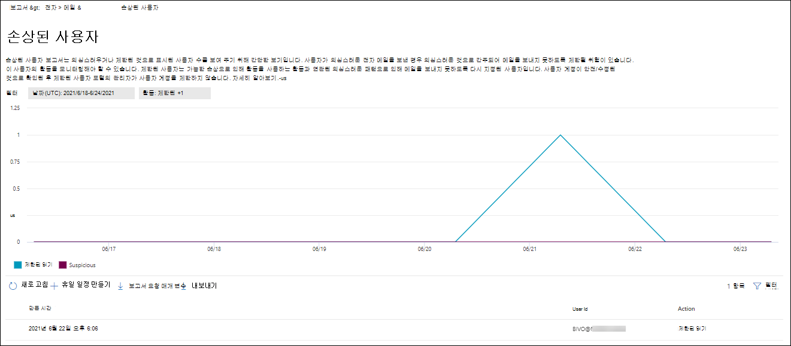
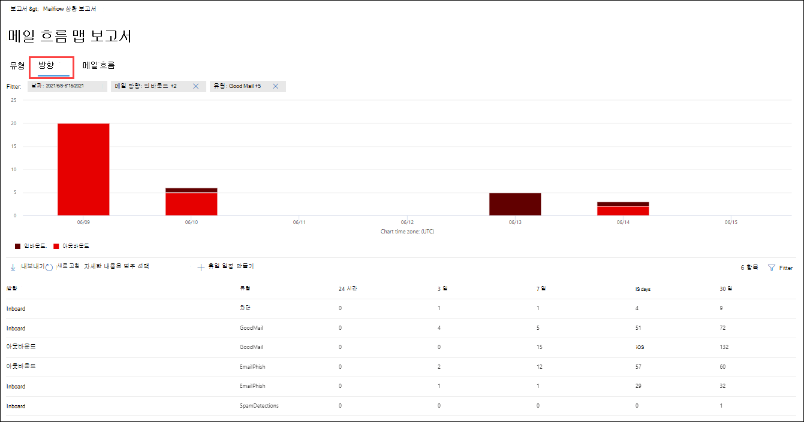
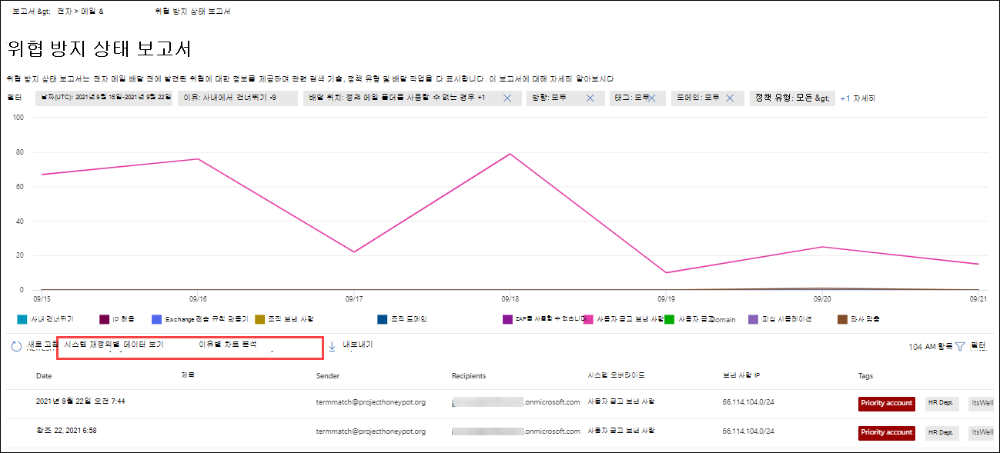
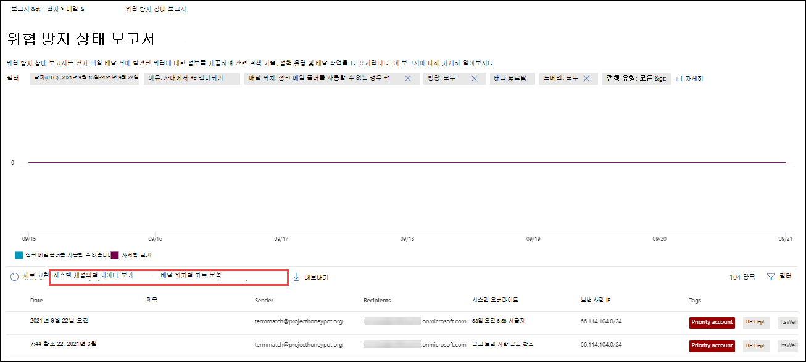

# 전자 메일 포털에서 전자 메일 Microsoft 365 Defender 보기

[!INCLUDE [Microsoft 365 Defender rebranding](../includes/microsoft-defender-for-office.md)]

**적용 대상**
- [Exchange Online Protection](exchange-online-protection-overview.md)
- [Office 365용 Microsoft Defender 플랜 1 및 플랜 2](defender-for-office-365.md)
- [Microsoft 365 Defender](../defender/microsoft-365-defender.md)

의 Microsoft 365 Defender 포털에서 다양한 보고서를 사용하여 스팸 방지, 맬웨어 방지 및 암호화 기능과 같은 전자 메일 보안 기능이 Microsoft 365 보호하는 방법을 볼 <https://security.microsoft.com> 수 있습니다. 필요한 권한이 [있는](#what-permissions-are-needed-to-view-these-reports)경우 사이트 포털에서 이러한 보고서를 보고 Microsoft 365 Defender 있습니다. 자세한 내용은 [View Defender for Office 365 참조하세요.](view-reports-for-mdo.md#view-and-download-reports)

> [!NOTE]
>
> Email & **공동** 작업 보고서 페이지의 일부 보고서에는 Microsoft Defender가 Office 365. 이러한 보고서에 대한 자세한 내용은 view [Defender for Office 365 reports in the Microsoft 365 Defender 참조하세요.](view-reports-for-mdo.md)
>
> 메일 흐름과 관련된 보고서는 이제 EAC(Exchange 관리 센터)에 있습니다. 이러한 보고서에 대한 자세한 내용은 새 Exchange 관리 센터의 [메일 흐름 보고서를 참조하세요.](/exchange/monitoring/mail-flow-reports/mail-flow-reports)

## 손상된 사용자 보고서

> [!NOTE]
> 이 보고서는 사서함이 있는 Microsoft 365 조직에서 Exchange Online 있습니다. 독립 실행형 EOP(독립 실행형 Exchange Online Protection 조직에서는 사용할 수 없습니다.

손상된 **사용자 보고서에는** 지난 7일 이내에  의심 또는 제한으로  표시된 사용자 계정 수가 표시됩니다. 이러한 상태 중 하나에 있는 계정이 문제가 발생하거나 손상될 수도 있습니다. 자주 사용하는 경우 보고서를 사용하여 의심스러우거나 제한된 계정에서 스파이크 및 추세를 파악할 수 있습니다. 손상된 사용자에 대한 자세한 내용은 손상된 전자 메일 계정에 응답을 [참조하세요.](responding-to-a-compromised-email-account.md)

집계 보기는 지난 90일간의 데이터를 표시하고 세부 정보 보기에는 지난 30일간의 데이터가 표시됩니다.

Microsoft 365 Defender 포털에서 보고서를 보시고 보고서 전자  메일 & 공동 작업 전자 메일 & \>  \> **보고서로 이동하세요.** 전자 메일 & **공동** 작업 보고서 페이지에서 손상된 사용자를 **찾은** 다음 세부 정보 **보기를 클릭합니다.** 보고서로 직접 이동하기 위해 를 를 <https://security.microsoft.com/reports/CompromisedUsers> 습니다.

손상된 **사용자 페이지의** 차트에는 지정된 날짜 범위에 대한 다음 정보가 표시됩니다.

- **제한:** 사용자 계정은 의심스러운 패턴으로 인해 전자 메일을 보내지 못하도록 제한되어 있습니다.
- **의심스러운**: 사용자 계정이 의심스러운 전자 메일을 보냈고 전자 메일을 보내지 못하도록 제한될 위험이 있습니다.

그래프 아래의 세부 정보 표에는 다음 정보가 표시됩니다.

- **만들기 시간**
- **사용자 ID**
- **작업**

필터를 클릭하고 플라이아웃에 나타나는 다음  값 중 하나 이상을 선택하여 차트와 세부 정보 테이블을 필터링할 수 있습니다.

- **날짜(UTC)**: **시작 날짜 및** 종료 **날짜입니다.**
- **활동:** **제한 또는** **의심스러운 활동**

필터 구성을 마치면 **적용,** 취소 또는 필터 **지우기 를 클릭합니다.**

## Exchange 전송 규칙 보고서

Exchange **전송** 규칙 보고서는 조직에서 들어오고 오는 메시지에 대한 메일 흐름 규칙(전송 규칙)의 영향을 보여줍니다.

Microsoft 365 Defender 포털에서 보고서를 보시고 보고서 전자  메일 & 공동 작업 전자 메일 & \>  \> **보고서로 이동하세요.** 전자 메일 **& 공동** 작업 보고서 페이지에서 Exchange 전송 규칙을 찾은 다음 세부 정보 **보기를** **클릭합니다.** 보고서로 직접 이동하기 위해 를 를 <https://security.microsoft.com/reports/ETRRuleReport> 습니다.

전송 **Exchange** 보고서 페이지에서 사용 가능한 차트 및 데이터는 다음 섹션에 설명되어 있습니다.

### 방향별 차트 분석

방향별 **차트 분석 을 선택하면** 다음 차트를 사용할 수 있습니다.

- **전송 규칙 Exchange** 데이터 보기: 메일  흐름 규칙의 영향을 받은 인바운드 및 아웃바운드 메시지 수입니다. 
- **DLP 전송 규칙 Exchange** 데이터 보기: DLP(데이터  손실 방지) 메일 흐름 규칙의 영향을 받은 인바운드 및 아웃바운드 메시지 수입니다. 

그래프 아래의 세부 정보 표에는 다음 정보가 나와 있습니다.

- **날짜**
- **DLP 정책(DLP** 정책으로 데이터 **Exchange 전송 규칙만** 해당)
- **전송 규칙**
- **제목**
- **보낸 사람 주소**
- **받는 사람 주소**
- **심각도**
- **방향**

필터를 클릭하고 플라이아웃에 나타나는 다음  값 중 하나 이상을 선택하여 차트와 세부 정보 테이블을 필터링할 수 있습니다.

- **날짜(UTC)** **시작 날짜 및** 종료 **날짜**
- **방향:** **아웃바운드** 및 **인바운드**
- **심각도:** **높은 심각도,** **보통 심각도** 및 **낮은 심각도**

필터 구성을 마치면 **적용,** 취소 또는 필터 **지우기 를 클릭합니다.**

### 심각도별 차트 분석

심각도별 차트 분석 **을** 선택하면 다음 차트를 사용할 수 있습니다.

- **전송 규칙 Exchange** 보기: 높은 심각도, 중간 심각도 및 낮은 심각도 메시지  **수입니다.** 심각도 수준을 규칙의 작업으로 설정할 수 있습니다(**심각도** 수준 또는 _SetAuditSeverity로_ 이 규칙 감사). 자세한 내용은 에서 [메일 흐름 규칙 작업을 Exchange Online.](/Exchange/security-and-compliance/mail-flow-rules/mail-flow-rule-actions)

- **DLP** 전송 규칙 Exchange 데이터 보기: DLP 메일 흐름 규칙의 영향을  받은 높은 심각도, 보통 심각도 및 낮은 심각도 메시지의 수입니다.

그래프 아래의 세부 정보 표에는 다음 정보가 나와 있습니다.

- **날짜**
- **DLP 정책(DLP** 정책으로 데이터 **Exchange 전송 규칙만** 해당)
- **전송 규칙**
- **제목**
- **보낸 사람 주소**
- **받는 사람 주소**
- **심각도**
- **방향**

필터를 클릭하고 플라이아웃에 나타나는 다음  값 중 하나 이상을 선택하여 차트와 세부 정보 테이블을 필터링할 수 있습니다.

- **날짜(UTC)** **시작 날짜 및** 종료 **날짜**
- **방향:** **아웃바운드** 및 **인바운드**
- **심각도:** **높은 심각도,** **보통 심각도** 및 **낮은 심각도**

필터 구성을 마치면 **적용,** 취소 또는 필터 **지우기 를 클릭합니다.**

## 전달 보고서

> [!NOTE]
> 이제 **EAC에서** 전달 보고서를 사용할 수 있습니다. 자세한 내용은 새 EAC의 자동 전달된 메시지 [보고서를 참조하세요.](/exchange/monitoring/mail-flow-reports/mfr-auto-forwarded-messages-report)

## 메일 흐름 상태 보고서

**메일 흐름** 상태 보고서는 수신 및 보낸 전자 메일, 스팸 검색, 맬웨어, "양호"로 식별된 전자 메일 및 에지에서 허용되거나 차단된 전자 메일에 대한 정보를 표시하는 스마트 보고서입니다. 이 보고서는 에지 보호 정보를 포함하는 유일한 보고서로, EOP(에지 보호)의 평가를 위해 서비스에 허용되기 전에 차단되는 전자 메일의 Exchange Online Protection 표시됩니다. 받는 사람 5명에게 메시지가 전송된 경우 하나의 메시지가 아니라 5개의 다른 메시지로 계산됩니다.

Microsoft 365 Defender 포털에서 보고서를 보시고 보고서 전자  메일 & 공동 작업 전자 메일 & \>  \> **보고서로 이동하세요.** 전자 메일 & **공동** 작업 보고서 페이지에서 메일 흐름 상태 요약을 **찾은** 다음 세부 정보 **보기를 클릭합니다.** 보고서로 직접 이동하기 위해 를 를 <https://security.microsoft.com/reports/mailflowStatusReport> 습니다.

### 메일 흐름 상태 보고서의 형식 보기

메일 흐름 **상태 보고서** 페이지에서  유형 탭이 기본적으로 선택되어 있습니다. 이 차트에는 지정된 날짜 범위에 대한 다음 정보가 표시됩니다.

- **좋은 메일**
- **합계**
- **맬웨어**
- **피싱 전자 메일**
- **스팸**
- **에지 보호**
- **규칙 메시지**

그래프 아래의 세부 정보 표에는 다음 정보가 표시됩니다.

- **방향**
- **유형**
- **24시간**
- **3일**
- **7일**
- **15일**
- **30일**

필터를 클릭하고 플라이아웃에 나타나는 다음  값 중 하나 이상을 선택하여 차트와 세부 정보 테이블을 필터링할 수 있습니다.

- **날짜(UTC)**: **시작 날짜 및** 종료 **날짜**
- **메일 방향**:
  - **인바운드**
  - **아웃바운드**
  - **Intra-org:** 동일한 테넌트 내에서 보낸 메시지입니다. 예를 들어 chris@contoso.com 메시지를 michelle@contso.com.
- **유형:**
  - **좋은 메일**
  - **맬웨어**
  - **스팸**
  - **에지 보호**
  - **규칙 메시지**
  - **피싱 전자 메일**
- **도메인**: **모두**

필터 구성을 마치면 **적용,** 취소 또는 필터 **지우기 를 클릭합니다.**

자세한 내용을 **보려면 범주** 선택을 클릭하면 다음 값에서 선택할 수 있습니다.

- **피싱 전자 메일:** 이 선택을 통해 위협 방지 상태 [보고서로 전송됩니다.](view-email-security-reports.md#threat-protection-status-report)
- **전자 메일의** 맬웨어: 이 선택을 통해 위협 방지 상태 [보고서로 전송됩니다.](view-email-security-reports.md#threat-protection-status-report)
- **스팸 검색:** 이 선택을 통해 스팸 검색 [보고서로 전송됩니다.](view-email-security-reports.md#spam-detections-report)
- **Edge 차단 스팸:** 이 선택을 통해 스팸 검색 [보고서로 전송됩니다.](view-email-security-reports.md#spam-detections-report)

#### 형식 보기에서 내보내기

세부 정보 보기의 경우 하루 동안만 데이터를 내보낼 수 있습니다. 따라서 7일 동안 데이터를 내보내는 경우 7개 내보내기 작업을 수행해야 합니다.

내보낼 각 .csv 행은 150,000개로 제한됩니다. 해당 일의 데이터에 150,000개 이상의 행이 포함되어 있는 경우 여러 개의 .csv 파일이 만들어집니다.

### 메일 흐름 상태 보고서의 방향 보기

방향 탭을 **클릭하면** 차트에 지정된 날짜 범위에 대한 다음 정보가 표시됩니다.

- **인바운드**
- **아웃바운드**
- **Intra-org**

그래프 아래의 세부 정보 표에는 형식 보기의 동일한 **정보가 포함되어** 있습니다.

필터를 클릭하여 차트와 세부 정보 테이블을 모두 필터링할 **수 있습니다.** 형식 보기의 **동일한 필터를** 사용할 수 있습니다.

사용 가능한 선택 **항목** 및 동작에 대한 자세한 내용은 종류 보기와 **같습니다.**

#### 방향 보기에서 내보내기

세부 정보 보기의 경우 하루 동안만 데이터를 내보낼 수 있습니다. 따라서 7일 동안 데이터를 내보내는 경우 7개 내보내기 작업을 수행해야 합니다.

내보낼 각 .csv 행은 150,000개로 제한됩니다. 해당 일의 데이터에 150,000개 이상의 행이 포함되어 있는 경우 여러 개의 .csv 파일이 만들어집니다.

### 메일 흐름 상태 보고서의 유입경로 보기

**Funnel** 보기는 Microsoft의 전자 메일 위협 방지 기능이 조직에서 받는 전자 메일과 보내기 전자 메일을 필터링하는 방법을 보여줍니다. 전체 전자 메일 수와 에지 보호, 맬웨어 방지, 피싱 방지, 스팸 방지 및 스푸핑 방지를 포함하여 구성된 위협 방지 기능이 이 수에 미치는 영향을 자세히 제공합니다.

집계 보기 및 세부 정보 테이블 보기에서는 90일 동안 필터링할 수 있습니다.

**넣기** 탭을 클릭하면 지정된 날짜 범위에 대해 다음 범주로 구성되는 메시지가 차트에 표시됩니다.

- **총 전자 메일:** 이 값은 항상 먼저 표시됩니다. 나머지 값은 메시지 수를 통해 내선으로 표시됩니다.
- **Edge 보호 후 전자 메일**
- **전송 후 전자 메일 규칙(메일** 흐름 규칙)
- **맬웨어 방지, 파일 신뢰도, 파일 형식 차단 후 전자 메일**
  - **파일 신뢰도:** 다른 Microsoft 고객이 첨부한 파일을 식별하여 필터링된 메시지입니다.
  - **파일 형식 블록:** 메시지에 식별된 악성 파일의 유형으로 인해 필터링된 메시지입니다.
- **피싱 방지, URL 신뢰도, 브랜드 가장, 스푸핑 방지 후 전자 메일**
  - **URL 신뢰도:** 다른 Microsoft 고객이 URL을 식별하여 필터링된 메시지입니다.
  - **브랜드 가장:** 보낸 사람으로 가장하는 잘 알려진 브랜드에서 보낸 메시지로 인해 필터링된 메시지입니다.
  - **스푸핑** 방지: 받는 사람이 속한 도메인 또는 메시지 보낸 사람이 소유하지 않은 도메인을 스푸핑하려고 시도하여 필터링된 메시지입니다.
- **스팸 방지, 대량 메일 필터링 후 전자 메일**
  - **대량 메일 필터링:** 스팸 방지 정책의 BCL(대량 불만 수준) 임계값을 기준으로 필터링된 메시지입니다.
- **사용자 및 도메인 가장 후 전자 메일**
  - **사용자** 가장: 사용자에 대한 Defender에서 피싱 방지 정책의 가장 보호 설정에 정의된 사용자(메시지 보낸 사람)를 가장하려는 시도로 인해 필터링된 Office 365.
  - **도메인 가장:** 도메인에 대한 Defender에서 피싱 방지 정책의 가장 보호 설정에 정의된 도메인을 가장하려고 시도하여 필터링된 Office 365.
- **파일 및 URL 확인 후 전자 메일**
  - **파일 검색:** 첨부 파일 금고 필터링된 메시지입니다.
  - **URL 검색:** 링크 정책에 의해 금고 메시지입니다.
- **배달 후 보호 후 무해한 것으로 감지된 전자 메일(URL 클릭 시간 보호)**

범주는 **EOP** 또는 **Defender에서** 코딩한 색으로 Office 365. 차트의 범주를 필터링하려면 차트 범례(제거하려면 클릭 한 번Office 365 두 번째 클릭하여 다시 표시)에서 **EOP** 또는 **Defender를** 클릭합니다.

차트 아래의 세부 정보 표에는 차트와 동일한 정보가 포함되어 있지만 더 짧은 설명은 다릅니다.

- **총 전자 메일**
- **에지 보호**
- **규칙 메시지**
- **맬웨어 방지, 파일 신뢰도, 파일 형식, 파일 블록**
- **피싱 방지, URL 신뢰도, 브랜드 가장, 스푸핑 방지**
- **스팸 방지, 대량 메일 필터링**
- **사용자 및 도메인 가장**
- **ATP(파일** 및 URL Office 365
- **사후 배달 보호 및 ZAP(ATP)**: Office 365

세부 정보 표에서 행을 선택하면 플라이아웃에 전자 메일 수에 대한 추가 분석이 표시됩니다.

필터를 클릭하고 플라이아웃에 나타나는 다음  값 중 하나 이상을 선택하여 차트와 세부 정보 테이블을 필터링할 수 있습니다.

- **날짜(UTC)**: **시작 날짜 및** 종료 **날짜**
- **메일 방향**:
  - **인바운드**
  - **아웃바운드**
  - **Intra-org:** 동일한 테넌트 내에서 보낸 메시지입니다. 예를 들어 chris@contoso.com 메시지를 michelle@contso.com.

필터 구성을 마치면 **적용,** 취소 또는 필터 **지우기 를 클릭합니다.**

#### 펀들 보기에서 내보내기

옵션에서 **내보내기** 를 **클릭한** 후 다음 값 중 하나를 선택할 수 있습니다.

- **요약(최근 90일 동안의 데이터 사용)**
- **세부 정보(지난 30일 동안의 데이터 사용)**

**날짜에서** 범위를 선택한 다음 적용을 **클릭합니다.** 현재 필터에 대한 데이터는 파일로 .csv 내보낼 수 있습니다.

내보낼 각 .csv 행은 150,000개로 제한됩니다. 데이터에 150,000개 이상의 행이 포함되어 있는 경우 여러 개의 .csv 파일이 만들어집니다.

### 메일 흐름 상태 보고서의 기술 보기

기술 **보기는** **Funnel** 보기와 유사하여 구성된 위협 방지 기능에 대해 보다 세부적인 세부 정보를 제공합니다. 차트에서 다양한 위협 방지 단계에서 메시지를 분류하는 방법을 볼 수 있습니다.

집계 보기 및 세부 정보 표에서는 90일 동안 필터링할 수 있습니다.

기술 보기 **탭을** 클릭하면 지정된 날짜 범위에 대해 다음 범주로 구성되는 메시지가 차트에 표시됩니다.

- **총 전자 메일**
- **Edge 허용** 및 **Edge 필터링**
- **전송 규칙 허용** 및 **전송 규칙 필터링(메일** 흐름 규칙)
- **맬웨어가** 아닌 **경우, 금고** 검색 \* 및 맬웨어 방지 엔진 **검색**
- **피싱이 아닌** 경우,  **DMARC 실패,** 가장 \* 검색, **스푸핑 검색** 및 **피싱 감지**
- **URL 검색 및 URL** 검색을 통해 검색 **안 하세요.**\*
- **스팸 및**  **스팸 아미기**
- **악성이 아닌 전자** **메일, 금고 링크** 검색 및 \* **ZAP**

\*Defender for Office 365

차트의 범주 위에 마우스를 대면 해당 범주의 메시지 수를 볼 수 있습니다.

차트 아래의 세부 정보 표에는 다음 정보가 포함되어 있습니다.

- **날짜(UTC)**
- **총 전자 메일**
- **Edge 필터링**
- **규칙 메시지:** 메일 흐름 규칙(전송 규칙)으로 인해 필터링된 메시지입니다.
- **맬웨어 방지 엔진, 금고 첨부 파일** \* :
- **DMARC, 가장,** \* **스푸핑,** **피싱 필터링 :**
  - **DMARC: DMARC** 인증 검사에 실패한 메시지로 인해 필터링된 메시지입니다.
- **URL 검색**\*
- **스팸 방지 필터링**
- **ZAP 제거됨**
- **링크로 금고 검색**\*

\*Defender for Office 365

세부 정보 표에서 행을 선택하면 플라이아웃에 전자 메일 수에 대한 추가 분석이 표시됩니다.

필터를 클릭하고 플라이아웃에 나타나는 다음  값 중 하나 이상을 선택하여 차트와 세부 정보 테이블을 필터링할 수 있습니다.

- **날짜(UTC)**: **시작 날짜 및** 종료 **날짜**
- **메일 방향**:
  - **인바운드**
  - **아웃바운드**
  - **Intra-org:** 동일한 테넌트 내에서 보낸 메시지입니다. 예를 들어 chris@contoso.com 메시지를 michelle@contso.com.

필터 구성을 마치면 **적용,** 취소 또는 필터 **지우기 를 클릭합니다.**

#### 기술 보기에서 내보내기

내보내기 **를 클릭할** 때 **옵션에서** 다음 값 중 하나를 선택할 수 있습니다.

- **요약(최근 90일 동안의 데이터 사용)**
- **세부 정보(지난 30일 동안의 데이터 사용)**

**날짜에서** 범위를 선택한 다음 적용을 **클릭합니다.** 현재 필터에 대한 데이터는 파일로 .csv 내보낼 수 있습니다.

내보낼 각 .csv 행은 150,000개로 제한됩니다. 데이터에 150,000개 이상의 행이 포함되어 있는 경우 여러 개의 .csv 파일이 만들어집니다.

## 맬웨어 검색 보고서

맬웨어 검색 보고서 **보고서는** 들어오는 전자 메일 메시지와 보내기 전자 메일 메시지의 맬웨어 검색에 대한 정보를 Exchange Online Protection EOP에서 검색됩니다. EOP의 맬웨어 보호에 대한 자세한 내용은 [EOP의 맬웨어 방지 보호를 참조하세요.](anti-malware-protection.md)

집계 보기 필터는 90일 동안 허용되는 반면 세부 정보 테이블 필터는 10일 동안만 허용됩니다.

Microsoft 365 Defender 포털에서 보고서를 보시고 보고서 전자  메일 & 공동 작업 전자 메일 & \>  \> **보고서로 이동하세요.** 전자 메일 & 공동 작업 보고서 페이지에서 전자 **메일에서** 검색된 **맬웨어를** 찾은 다음 세부 정보 **보기를 클릭합니다.** 보고서로 직접 이동하기 위해 를 를 <https://security.microsoft.com/reports/MalwareDetections> 습니다.

맬웨어 검색 **보고서 페이지의** 차트에는 지정된 날짜 범위에 대한 다음 정보가 표시됩니다.

- **아웃바운드**
- **인바운드**

그래프 아래의 세부 정보 표에는 다음 정보가 표시됩니다.

- **날짜**
- **보낸 사람 주소**
- **받는 사람 주소**
- **메시지 ID:** 메시지 헤더의 **Message-ID** 헤더 필드에서 사용할 수 있으며 고유해야 합니다. 값을 예로 들 수 `<08f1e0f6806a47b4ac103961109ae6ef@server.domain>` 있습니다(괄호 참고).
- **제목**
- **파일 이름**
- **맬웨어 이름**

필터를 클릭하고 다음 값 중 하나를  선택하여 차트와 세부 정보 테이블을 모두 필터링할 수 있습니다.

- **날짜(UTC)** **시작 날짜 및** 종료 **날짜**
- **방향:** **인바운드 및** **아웃바운드**

필터 구성을 마치면 **적용,** 취소 또는 필터 **지우기 를 클릭합니다.**

## 메일 대기 시간 보고서

**Defender** for Office 365 메일 대기 시간 보고서에는 조직 내에서 경험하는 메일 배달 및 확인 대기 시간에 대한 정보가 포함되어 있습니다. 자세한 내용은 메일 대기 [시간 보고서를 참조하세요.](view-reports-for-mdo.md#mail-latency-report)

## 스팸 검색 보고서

> [!NOTE]
> 스팸 **검색 보고서는** 결국 사용되지 않습니다. 위협 방지 상태 보고서에서 동일한 [정보를 사용할 수 있습니다.](#threat-protection-status-report)

## 스푸핑 검색 보고서

> [!NOTE]
> 이 문서에 설명된 향상된 스푸핑 검색 보고서는 미리 보기에 있으며 변경될 수 있으며 일부 조직에서는 사용할 수 없습니다. 이전 버전의 보고서에는 양호한 **메일과** 스팸으로 **걸려 오기만 표시되었습니다.**

**스푸핑 검색 보고서에는** 스푸핑으로 인해 차단되거나 허용된 메시지에 대한 정보가 표시됩니다. 스푸핑에 대한 자세한 내용은 [EOP의 스푸핑 방지 보호를 참조하세요.](anti-spoofing-protection.md)

보고서의 집계 보기는 45일 동안 필터링할 수 있는 반면 세부 정보 보기는 \* 10일의 필터링만 허용합니다.

\* 결국 최대 90일의 필터링을 사용할 수 있습니다.

Microsoft 365 Defender 포털에서 보고서를 보시고 보고서 전자  메일 & 공동 작업 전자 메일 & \>  \> **보고서로 이동하세요.** 전자 메일 **& 공동 작업** 보고서  페이지에서 스푸핑 검색을 찾은 다음 세부 정보 **보기를 클릭합니다.** 보고서로 직접 이동하기 위해 를 를 <https://security.microsoft.com/reports/SpoofMailReportV2> 습니다.

차트에는 다음 정보가 표시됩니다.

- **통과**
- **실패**
- **SoftPass**
- **없음**
- **기타**

차트에서 하루(데이터 데이터 포인트)에 마우스를 대면 검색된 스푸핑된 메시지 수와 그 이유를 볼 수 있습니다.

**스푸핑 메일** 보고서 페이지에서 필터를 클릭하고 다음 값 중 하나  이상을 선택하여 차트와 세부 정보 테이블을 필터링할 수 있습니다.

- **날짜(UTC)** **시작 날짜 및** 종료 **날짜**
- **결과**:
  - **통과**
  - **실패**
  - **SoftPass**
  - **없음**
  - **기타**
- **스푸핑 유형:** **내부 및** **외부**

그래프 아래의 세부 정보 표에는 다음 정보가 표시됩니다.

- **날짜**
- **스푸핑된 사용자**
- **인프라 보내기**
- **스푸핑 유형**
- **결과**
- **결과 코드**
- **SPF**
- **DKIM**
- **DMARC**
- **메시지 수**

복합 인증 결과 코드에 대한 자세한 내용은 에서 스팸 방지 메시지 [헤더를 Microsoft 365.](anti-spam-message-headers.md)

## 제출 보고서

제출 **보고서에는** 관리자가 분석을 위해 Microsoft에 보고한 항목에 대한 정보가 표시됩니다. 자세한 내용은 관리 제출을 사용하여 의심되는 스팸, 피싱, URL 및 파일을 Microsoft에 제출을 [참조하세요.](admin-submission.md)

Microsoft 365 Defender 포털에서 보고서를 보시고 보고서 전자  메일 & 공동 작업 전자 메일 & \>  \> **보고서로 이동하세요.** 전자 메일 & **공동** 작업 보고서 페이지에서 제출을 **찾은** 다음 세부 정보 **보기를 클릭합니다.** 보고서로 직접 이동하기 위해 를 를 <https://security.microsoft.com/adminSubmissionReport> 습니다. Microsoft 365 Defender 포털에서 관리 [제출으로 이동하려면 제출로](admin-submission.md) **이동을 클릭합니다.** 관리자는 지난 30일 동안 보고서를 볼 수 있습니다. 

차트에는 다음 정보가 표시됩니다.

- **보류 중**
- **완료**

제출 **페이지에서** 필터를 클릭하고 다음 값 중 하나 이상을  선택하여 차트와 세부 정보 테이블을 필터링할 수 있습니다.

- **보고된 날짜:** **시작 시간** 및 **종료 시간**
- **제출 유형**:
  - **전자 메일**
  - **URL**
  - **파일**
- **제출 ID**
- **네트워크 메시지 ID**
- **보낸 사람**
- **이름**
- **제출한 인원**
- **제출 이유:**
  - **정크 아님**
  - **피싱**
  - **맬웨어**
  - **스팸**
- **상태 다시 검색:**
  - **보류 중**
  - **완료**

그래프 아래의 세부 정보 표에는 동일한 정보가  표시되어  있으며 전자 메일  및 공동 작업 제출의 분석 제출 탭에서와 동일한 **그룹 또는 & 옵션이** \> **있습니다.** 자세한 내용은 Microsoft에 대한 [관리자 제출 보기를 참조하세요.](admin-submission.md#view-admin-submissions-to-microsoft)

## 위협 방지 상태 보고서

**위협 방지 상태 보고서는** EOP 및 Defender에서 모두 사용할 수 Office 365. 그러나 보고서에는 다른 데이터가 포함되어 있습니다. 예를 들어 EOP 고객은 전자 메일에서 검색된 맬웨어에 대한 정보를 볼 수 있지만, 전자 메일, 금고 및 에 대한 첨부 파일에서 검색된 악성 파일에 대한 SharePoint [OneDrive](mdo-for-spo-odb-and-teams.md)Microsoft Teams.

이 보고서는 맬웨어 방지 엔진에 의해 차단된 파일 또는 웹 사이트 주소(URL) 및 피싱 방지 정책의 Office 365 [링크,](safe-links.md)금고 첨부 파일 및 가장 보호 기능과 같은 Office 365 금고 기능에 대한 Defender와 같은 악성 콘텐츠가 있는 전자 메일 메시지 수를 제공합니다.  이 정보를 사용하여 추세를 식별하거나 조직 정책에 조정이 필요한지 여부를 확인할 수 있습니다.

**참고:** 받는 사람 5명에게 메시지가 전송된 경우 하나의 메시지가 아니라 5개의 다른 메시지로 계산됩니다.

Microsoft 365 Defender 포털에서 보고서를 보시고 보고서 전자  메일 & 공동 작업 전자 메일 & \>  \> **보고서로 이동하세요.** 전자 메일 & 공동 작업 **보고서** 페이지에서 위협 방지 상태를 **찾은** 다음 세부 정보 **보기를 클릭합니다.** 보고서로 직접 이동하기 위해 다음 URL 중 하나를 열 수 있습니다.

- Defender for Office 365:<https://security.microsoft.com/reports/TPSAggregateReportATP>
- EOP: <https://security.microsoft.com/reports/TPSAggregateReport>

기본적으로 차트에는 지난 7일간의 데이터가 표시됩니다. 위협 방지  상태  보고서 페이지에서 필터링을 클릭하면 90일 날짜 범위를 선택할 수 있습니다(평가판 구독은 30일로 제한될 수 있습니다). 세부 정보 표에서는 30일 동안 필터링할 수 있습니다.

다음 섹션에서는 사용 가능한 보기에 대한 설명을 제공합니다.

### 개요로 데이터 보기

개요로 **데이터** 보기 보기에서 차트에 다음과 같은 검색 정보가 표시됩니다.

- **전자 메일 맬웨어**
- **전자 메일 피싱**
- **콘텐츠 맬웨어**

차트 아래에 세부 정보 표를 사용할 수 없습니다.

필터를 **클릭하면** 다음과 같은 필터를 사용할 수 있습니다.

- **날짜(UTC)** **시작 날짜 및** 종료 **날짜**
- **검색:** **전자 메일 맬웨어,** **전자 메일 피싱** 또는 **콘텐츠 맬웨어**
- **보호:** **MDO(Office 365용** Defender) 또는 **EOP**
- **태그:** 지정된 사용자 태그가 적용된 사용자 또는 그룹(우선 순위 계정 포함)을 사용하여 결과를 필터링합니다. 사용자 태그에 대한 자세한 내용은 사용자 태그 [를 참조하세요.](user-tags.md)
- **방향**
- **도메인**
- **정책 유형**

필터 구성을 마치면 **적용,** 취소 또는 필터 **지우기 를 클릭합니다.**

### 검색 기술별 전자 메일 피싱 및 차트 \> 분석으로 데이터 보기

전자 메일 **피싱으로 데이터 \> 보기** **및** 검색 기술별 차트 분석 보기에서 차트에 다음 정보가 표시됩니다.

- **URL 악의적인 신뢰도:** 다른 Office 365 고객에 대한 \* 악의적인 URL 신뢰도 Microsoft 365.
- **고급 필터:** 기계 학습을 기반으로 하는 피싱 신호입니다.
- **일반 필터:** 분석가 규칙에 기반한 피싱 신호입니다.
- **스푸핑된** 도메인: 보낸 사람이 받는 사람 도메인을 스푸핑하려고 합니다.
- **스푸핑 외부** 도메인: 보낸 사람이 다른 도메인을 스푸핑하려고 합니다.
- **스푸핑 DMARC:** 메시지에 대한 DMARC 인증 실패.
- **가장 브랜드:** 보낸 사람 기반의 잘 알려진 브랜드 가장.
- **혼합 분석 검색**
- **파일 신뢰도**
- **지문 일치**
- **URL 확인 신뢰도**\*
- **URL 확인**\*
- **가장 사용자**\*
- **가장 도메인:** 고객이 소유하거나 정의하는 도메인의 \* 가장입니다.
- **사서함 인텔리전스 가장:** 관리자가 정의하거나 사서함 인텔리전스를 통해 학습한 사용자의 \* 가장입니다.
- **파일 Detonation**\*
- **캠페인**\*

차트 아래의 세부 정보 표에서 다음 정보를 사용할 수 있습니다.

- **날짜**
- **제목**
- **보낸 사람**
- **받는 사람**
- **검색한 경우**
- **배달 상태**
- **손상의 원본**
- **태그**

필터를 **클릭하면** 다음과 같은 필터를 사용할 수 있습니다.

- **날짜(UTC)** **시작 날짜 및** 종료 **날짜**
- **탐지**
- **보호:** **MDO(Office 365용** Defender) 또는 **EOP**
- **방향**
- **태그:** 지정된 사용자 태그가 적용된 사용자 또는 그룹(우선 순위 계정 포함)을 사용하여 결과를 필터링합니다. 사용자 태그에 대한 자세한 내용은 사용자 태그 [를 참조하세요.](user-tags.md)
- **도메인**
- **정책 유형**
- **정책 이름(세부** 정보 표에만 해당)
- **받는 사람**

필터 구성을 마치면 **적용,** 취소 또는 필터 **지우기 를 클릭합니다.**

### 전자 메일 맬웨어 및 검색 기술별 \> 차트 분석으로 데이터 보기

전자 메일 **맬웨어로 \> 데이터** 보기 및 검색 기술별 **차트** 분석 보기에서 차트에 다음 정보가 표시됩니다.

- **파일 검색:** 첨부 금고 \* 검색.
- **파일 디버터 신뢰도:** 모든 악성 파일 신뢰도에서 Office 365 \* 생성합니다.
- **파일 신뢰도**
- **맬웨어 방지 엔진:** \* 맬웨어 방지 엔진에서 검색됩니다.
- **맬웨어** 방지 정책 파일 형식 블록: 메시지에 식별된 악성 파일의 유형으로 인해 필터링된 전자 메일 메시지입니다.
- **URL 악의적인 신뢰도**\*
- **URL 확인**\*
- **URL 확인 신뢰도**\*
- **캠페인**\*

차트 아래의 세부 정보 표에서 다음 정보를 사용할 수 있습니다.

- **날짜**
- **제목**
- **보낸 사람**
- **받는 사람**
- **검색한 경우**
- **배달 상태**
- **손상의 원본**
- **태그**

필터를 **클릭하면** 다음과 같은 필터를 사용할 수 있습니다.

- **날짜(UTC)** **시작 날짜 및** 종료 **날짜**
- **탐지**
- **보호:** **MDO(Office 365용** Defender) 또는 **EOP**
- **방향**
- **태그:** 지정된 사용자 태그가 적용된 사용자 또는 그룹(우선 순위 계정 포함)을 사용하여 결과를 필터링합니다. 사용자 태그에 대한 자세한 내용은 사용자 태그 [를 참조하세요.](user-tags.md)
- **도메인**
- **정책 유형**
- **정책 이름(세부** 정보 표에만 해당)
- **받는 사람**

필터 구성을 마치면 **적용,** 취소 또는 필터 **지우기 를 클릭합니다.**

### 정책 유형별 차트 분석 및 전자 메일 피싱 또는 전자 메일 맬웨어로 데이터 \> \> 보기

정책 **유형별** 차트 분석 및 전자 메일 피싱 또는 전자 메일 맬웨어 보기로 데이터 보기에서 차트에 표시되는 정보는 다음과 같습니다. **\>** **\>**

- **맬웨어 방지**
- **금고 첨부 파일**\*
- **피싱 방지**
- **스팸 방지**
- **메일 흐름 규칙(전송** 규칙으로도 알려지기)
- **기타**

차트 아래의 세부 정보 표에서 다음 정보를 사용할 수 있습니다.

- **날짜**
- **제목**
- **보낸 사람**
- **받는 사람**
- **검색한 경우**
- **배달 상태**
- **손상의 원본**
- **태그**

필터를 **클릭하면** 다음과 같은 필터를 사용할 수 있습니다.

- **날짜(UTC)** **시작 날짜 및** 종료 **날짜**
- **탐지**
- **보호:** **MDO(Office 365용** Defender) 또는 **EOP**
- **방향**
- **태그:** 지정된 사용자 태그가 적용된 사용자 또는 그룹(우선 순위 계정 포함)을 사용하여 결과를 필터링합니다. 사용자 태그에 대한 자세한 내용은 사용자 태그 [를 참조하세요.](user-tags.md)
- **도메인**
- **정책 유형**
- **정책 이름(세부** 정보 표에만 해당)
- **받는 사람**

필터 구성을 마치면 **적용,** 취소 또는 필터 **지우기 를 클릭합니다.**

### 배달 상태별 차트 분석 및 전자 메일 피싱 또는 전자 메일 맬웨어로 데이터 \> \> 보기

배달 **상태별** 차트 분석 및 전자 메일 피싱으로 데이터 **\> 보기** 또는 전자 메일 맬웨어 보기로 데이터 **\> 보기에서** 차트에 표시되는 정보는 다음과 같습니다.

- **호스트된 사서함: 받은 편지함**
- **호스트된 사서함: 정크 메일함**
- **호스트된 사서함: 사용자 지정 폴더**
- **호스트된 사서함: 삭제된 항목**
- **전달**
- **On-premises server: Delivered**
- **격리**
- **배달 실패**
- **삭제**

차트 아래의 세부 정보 표에서 다음 정보를 사용할 수 있습니다.

- **날짜**
- **제목**
- **보낸 사람**
- **받는 사람**
- **검색한 경우**
- **배달 상태**
- **손상의 원본**
- **태그**

필터를 **클릭하면** 다음과 같은 필터를 사용할 수 있습니다.

- **날짜(UTC)** **시작 날짜 및** 종료 **날짜**
- **탐지**
- **보호:** **MDO(Office 365용** Defender) 또는 **EOP**
- **방향**
- **태그:** 지정된 사용자 태그가 적용된 사용자 또는 그룹(우선 순위 계정 포함)을 사용하여 결과를 필터링합니다. 사용자 태그에 대한 자세한 내용은 사용자 태그 [를 참조하세요.](user-tags.md)
- **도메인**
- **정책 유형**
- **정책 이름(세부** 정보 표에만 해당)
- **받는 사람**

필터 구성을 마치면 **적용,** 취소 또는 필터 **지우기 를 클릭합니다.**

### 콘텐츠 맬웨어로 \> 데이터 보기

콘텐츠 **맬웨어로 \> 데이터** 보기 보기에서 조직의 Microsoft Defender에 대한 차트에 다음 Office 365 표시됩니다.

- **맬웨어** 방지 엔진 : 에서 기본 제공 바이러스 SharePoint, OneDrive 및 Microsoft Teams 검색된 악성 [Microsoft 365.](virus-detection-in-spo.md)
- **파일 검색:** 금고, 파일 및 금고 첨부 파일에서 검색된 악성 [SharePoint,](mdo-for-spo-odb-and-teams.md)OneDrive 및 Microsoft Teams.

차트 아래의 세부 정보 표에서 다음 정보를 사용할 수 있습니다.

- **날짜(UTC)** **시작 날짜 및** 종료 **날짜**
- **위치**
- **검색한 경우**
- **맬웨어 이름**

필터를 **클릭하면** 다음과 같은 필터를 사용할 수 있습니다.

- **날짜(UTC)** **시작 날짜 및** 종료 **날짜**
- **검색:** **맬웨어 방지 엔진** 또는 **파일 검색**

필터 구성을 마치면 **적용,** 취소 또는 필터 **지우기 를 클릭합니다.**

### 시스템 오버라이드 및 이유별 차트 분석별 데이터 보기

시스템  **오버라이드별** 데이터 보기 및 이유별 차트 분석 보기에서 차트에 다음과 같은 이유 정보가 표시됩니다.

- **사내 건너뛰기**
- **IP 허용**
- **Exchange 전송 규칙(메일** 흐름 규칙)
- **조직에서 허용된 보낸 사람**
- **조직 허용 도메인**
- **ZAP를 사용할 수 없습니다.**
- **사용자 금고 보낸 사람**
- **사용자 금고 도메인**
- **피싱** 시뮬레이션: 자세한 내용은 [SecOps](configure-advanced-delivery.md)사서함에 대한 사용자 및 필터되지 않은 메시지에 대한 타사 피싱 시뮬레이션 배달 구성을 참조하세요.
- **타사 필터**

차트 아래의 세부 정보 표에서 다음 정보를 사용할 수 있습니다.

- **날짜**
- **제목**
- **보낸 사람**
- **받는 사람**
- **시스템 오버라이드**
- **손상의 원본**
- **태그**

필터를 **클릭하면** 다음과 같은 필터를 사용할 수 있습니다.

- **날짜(UTC)** **시작 날짜 및** 종료 **날짜**
- **이유**
- **방향**:
  - **모두**
  - **인바운드**
  - **아웃바운드**
- **태그:** 지정된 사용자 태그가 적용된 사용자 또는 그룹(우선 순위 계정 포함)을 사용하여 결과를 필터링합니다. 사용자 태그에 대한 자세한 내용은 사용자 태그 [를 참조하세요.](user-tags.md)
- **도메인**
- **정책 유형**:
  - **모두**
  - **맬웨어 방지**
  - **금고 첨부 파일**\*
  - **피싱 방지**
  - **스팸 방지**
  - **메일 흐름 규칙(전송** 규칙)
  - **기타**
- **정책 이름(세부** 정보 표에만 해당)
- **받는 사람**

\*Defender for Office 365 전용

필터 구성을 마치면 **적용,** 취소 또는 필터 **지우기 를 클릭합니다.**

### 시스템 오버라이드 및 배달 위치별 차트 분석별 데이터 보기

시스템으로 데이터 보기 **및** 배달  위치 보기별 차트 분석 보기에서 차트에 다음의 은(는) 이유 정보가 표시됩니다.

- **정크 메일 폴더를 사용할 수 없습니다.**
- **SecOps 사서함:** 자세한 내용은 SecOps 사서함에 대한 사용자 및 필터되지 않은 메시지에 대한 타사 피싱 시뮬레이션 배달 [구성을 참조하세요.](configure-advanced-delivery.md)

차트 아래의 세부 정보 표에서 다음 정보를 사용할 수 있습니다.

- **날짜**
- **제목**
- **보낸 사람**
- **받는 사람**
- **시스템 오버라이드**
- **손상의 원본**
- **태그**

필터를 **클릭하면** 다음과 같은 필터를 사용할 수 있습니다.

- **날짜(UTC)** **시작 날짜 및** 종료 **날짜**
- **이유**
- **방향**:
  - **모두**
  - **인바운드**
  - **아웃바운드**
- **태그:** 지정된 사용자 태그가 적용된 사용자 또는 그룹(우선 순위 계정 포함)을 사용하여 결과를 필터링합니다. 사용자 태그에 대한 자세한 내용은 사용자 태그 [를 참조하세요.](user-tags.md)
- **도메인**
- **정책 유형**:
  - **모두**
  - **맬웨어 방지**
  - **금고 첨부 파일**\*
  - **피싱 방지**
  - **스팸 방지**
  - **메일 흐름 규칙(전송** 규칙)
  - **기타**
- **정책 이름(세부** 정보 표에만 해당)
- **받는 사람**

\*Defender for Office 365 전용

필터 구성을 마치면 **적용,** 취소 또는 필터 **지우기 를 클릭합니다.**

## 상위 맬웨어 보고서

Top **malware report** shows the various kinds of malware that was detected by [anti-malware protection in EOP.](anti-malware-protection.md)

Microsoft 365 Defender 포털에서 보고서를 보시고 보고서 전자  메일 & 공동 작업 전자 메일 & \>  \> **보고서로 이동하세요.** 전자 메일 & **공동** 작업 보고서 페이지에서 상위 맬웨어를 찾은 다음 세부 정보  **보기를 클릭합니다.** 보고서로 직접 이동하기 위해 를 를 <https://security.microsoft.com/reports/TopMalware> 습니다.

파이 차트에서 에지 위에 마우스를 대면 맬웨어의 종류 이름과 해당 맬웨어가 있는 것으로 감지된 메시지 수를 볼 수 있습니다.

상위 **맬웨어 보고서 페이지에는** 더 큰 버전의 파이 차트가 보고서 페이지에 표시됩니다. 차트 아래의 세부 정보 표에는 다음 정보가 표시됩니다.

- **상위 맬웨어**
- **개수**

필터를 **클릭하면** 시작 날짜 및 종료 날짜로 날짜 범위를 **지정할** **수 있습니다.**

## URL 위협 방지 보고서

**URL 위협 방지 보고서는** Microsoft Defender에서만 사용할 수 Office 365. 자세한 내용은 [URL 위협 방지 보고서를 참조하세요.](view-reports-for-mdo.md#url-threat-protection-report)

## 사용자가 보고한 메시지 보고서

> [!IMPORTANT]
> 사용자가 보고한  메시지 보고서가 제대로 작동하려면 사용자 환경의 감사 로깅을 설정해야 Microsoft 365 있습니다.  이 작업은 일반적으로 감사 로그 역할이 할당된 사용자가 Exchange Online. 자세한 내용은 감사 로그 Microsoft 365 설정 또는 해제를 [참조하세요.](../../compliance/turn-audit-log-search-on-or-off.md)

사용자 **보고** 메시지 보고서에는 보고서 메시지 추가 기능 또는 피싱 보고 추가 기능을 사용하여 사용자가  정크 메일, 피싱 시도 또는 양호한 메일로 보고한 전자 메일 메시지에 대한 정보가 [표시됩니다.](enable-the-report-phish-add-in.md)

Microsoft 365 Defender 포털에서 보고서를 보시고 보고서 전자  메일 & 공동 작업 전자 메일 & \>  \> **보고서로 이동하세요.** 전자 메일 & **공동** 작업 보고서 페이지에서 사용자가 보고한 메시지를 **찾은** 다음 세부 정보 **보기를 클릭합니다.** 보고서로 직접 이동하기 위해 를 를 <https://security.microsoft.com/reports/userSubmissionReport> 습니다. Microsoft 365 Defender 포털에서 관리 [제출으로 이동하려면 제출로](admin-submission.md) **이동을 클릭합니다.**

사용자가  보고한 메시지 페이지에서 필터를 클릭하고 플라이아웃에 나타나는  다음 값 중 하나 이상을 선택하여 차트와 세부 정보 테이블을 필터링할 수 있습니다.

- **보고된 날짜:** **시작 시간** 및 **종료 시간**
- **보고한**
- **전자 메일 제목**
- **보고된 메시지 ID**
- **네트워크 메시지 ID**
- **보낸 사람**
- **보고된 이유**
  - **정크 아님**
  - **피싱**
  - **스팸**
- **피싱 시뮬레이션:** **예** 또는 **아니요**

필터 구성을 마치면 **적용,** 취소 또는 필터 **지우기 를 클릭합니다.**

항목을 그룹화하려면 그룹을 **클릭하고** 드롭다운 목록에서 다음 값 중 하나를 선택합니다.

- **없음**
- **이유**
- **보낸 사람**
- **보고한**
- **결과 다시 검색**
- **피싱 시뮬레이션**

그래프 아래의 세부 정보 표에는 다음 정보가 표시됩니다.

- **전자 메일 제목**
- **보고한**
- **보고된 날짜**
- **보낸 사람**
- **보고된 이유**
- **결과 다시 검색**
- **태그**

분석을 위해 Microsoft에 메시지를 제출하려면 표에서 메시지 항목을 선택하고 분석을 위해 **Microsoft에** 제출을 클릭한 다음 드롭다운 목록에서 다음 값 중 하나를 선택합니다.

- **정리 보고**
- **피싱 보고**
- **맬웨어 보고**
- **스팸 보고**'
- **조사** 트리거(Office 365)

## 이러한 보고서를 보는 데 필요한 사용 권한은 무엇입니까?

이 문서에 설명된 보고서를 보고 사용하려면 Microsoft 365 Defender 포털에서 다음 역할 그룹 중 하나에 Microsoft 365 Defender 합니다.

- **조직 관리**
- **보안 관리자**
- **보안 읽기**
- **전역 읽기**

자세한 내용은 [Microsoft 365 Defender 포털 권한](permissions-microsoft-365-security-center.md)을 참조하세요.

**참고:** Azure Active Directory 역할에 사용자를 추가하면 Microsoft 365 관리 센터 포털에서 필요한 사용 권한과 Microsoft 365 Defender 포털의 다른  기능에 대한 사용 권한이 Microsoft 365. 자세한 내용은 [관리자 역할 정보](../../admin/add-users/about-admin-roles.md)를 참조하세요.

## 보고서에 데이터가 표시되지 않는 경우 어떻게 하나요?

보고서에 데이터가 없는 경우 정책이 올바르게 설정되어 있는지 다시 확인합니다. 자세한 내용은 [위협으로부터 보호를 참조합니다.](protect-against-threats.md)

## 관련 항목

[EOP의 스팸 방지 및 맬웨어 방지 보호 기능](anti-spam-and-anti-malware-protection.md)

[검색 포털의 스마트 보고서 및 Microsoft 365 Defender 정보](reports-and-insights-in-security-and-compliance.md)

[사이트 포털에서 메일 흐름 Microsoft 365 Defender 보기](view-mail-flow-reports.md)

[Defender for Office 365](view-reports-for-mdo.md)
