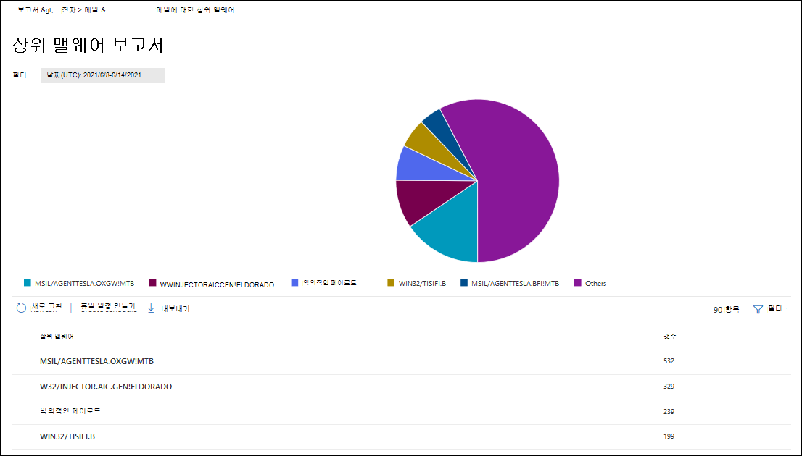

# 보안 및 준수 센터의 전자 메일 보안 보고서 보기

[!INCLUDE [Microsoft 365 Defender rebranding](../includes/microsoft-defender-for-office.md)]

[보안 & 준수 센터](https://protection.office.com) 에서 다양 한 보고서를 사용할 수 있으며, Microsoft 365의 스팸 방지, 맬웨어 방지 및 암호화 기능과 같은 전자 메일 보안 기능이 조직을 보호 하는 방법을 확인 하는 데 도움이 됩니다. [필요한 권한이](#what-permissions-are-needed-to-view-these-reports)있는 경우 **보고서** 대시보드로 이동 하 여 보안 & 준수 센터에서 이러한 보고서를 볼 수 있습니다 \> **Dashboard**. 보고서 대시보드로 직접 이동 하려면를 엽니다 <https://protection.office.com/insightdashboard> .

## 손상 된 사용자 보고서

> [!NOTE]
> 이 보고서는 Microsoft 365 조직에서 Exchange Online 사서함을 사용 하는 경우에 사용할 수 있습니다. 독립 실행형 EOP (Exchange Online Protection) 조직에서는이 기능을 사용할 수 없습니다.

**손상 된 사용자** 보고서에는 최근 7 일 이내에 **의심** 또는 **제한** 된 것으로 표시 된 사용자 계정 수가 표시 됩니다. 이러한 두 가지 상태의 계정은 문제가 있거나 심지어도 손상 됩니다. 자주 사용 하는 경우 보고서를 사용 하 여 의심 스러운 또는 제한 된 계정의 스파이크 및 추세를 볼 수 있습니다. 사용자 손상에 대 한 자세한 내용은 [손상 된 전자 메일 계정에 응답](responding-to-a-compromised-email-account.md)을 참조 하세요.

집계 보기는 최근 90 일 동안의 데이터를 표시 하 고, 자세히 보기에는 지난 30 일 동안의 데이터가 표시 됩니다.

보고서를 보려면 [보안 & 준수 센터](https://protection.office.com)를 열고 **보고서** \> **대시보드로** 이동한 다음 **손상 된 사용자**를 선택 합니다. 보고서로 직접 이동 하려면를 엽니다 <https://protection.office.com/reportv2?id=CompromisedUsers> .

**필터** 를 클릭 하 고 다음 값 중 하나 이상을 선택 하 여 차트 및 세부 정보 테이블을 모두 필터링 할 수 있습니다.

- **시작 날짜** 및 **끝 날짜**

- **의심 스러운**: 사용자 계정에서 의심 스러운 전자 메일을 보냈지만 전자 메일을 보낼 수 없게 되는 위험에 노출 됩니다.

- **제한**: 사용자 계정이 의심 스러운 높은 패턴으로 인해 전자 메일을 보내지 못하도록 제한 되었습니다.

**세부 정보 테이블 보기**를 클릭 하면 다음 세부 정보를 확인할 수 있습니다.

- **만든 시간**
- **사용자 ID**
- **작업**

보고서 보기로 돌아가려면 **보고서 보기**를 클릭 합니다.

## 암호화 보고서

**암호화 보고서** 는 EOP (exchange online의 사서함과 exchange online 사서함이 없는 독립 실행형 EOP 구독)에서 사용할 수 있습니다. 조직의 보안 팀은이 보고서의 정보를 사용 하 여 패턴을 식별 하 고 중요 한 전자 메일 메시지에 대 한 정책을 사전에 적용 하거나 조정할 수 있습니다. 예제:

- 사용자가 암호화 한 전자 메일 메시지가 많은 경우 특정 사용 사례에 대 한 암호화를 자동화 하는 암호화 정책을 추가 하는 것이 좋습니다. 자세한 내용은 [Microsoft 365에서 전자 메일 메시지를 암호화 하는 메일 흐름 규칙 정의](../../compliance/define-mail-flow-rules-to-encrypt-email.md)를 참조 하십시오.

- 사용할 수 있는 암호화 서식 파일의 수가 여러 개 있지만 아무도 사용 하지 않는 경우에는 사용자가 기능 교육을 필요로 하는지 여부를 탐색할 수 있습니다.

집계 보기는 최근 90 일에 대 한 필터링을 허용 하 고 세부 정보 보기는 10 일 동안 필터링을 허용 합니다.

보고서를 보려면 [보안 & 준수 센터](https://protection.office.com)를 열고 **보고서** \> **대시보드로** 이동한 다음 **암호화 보고서**를 선택 합니다. 보고서로 직접 이동 하려면를 엽니다 <https://protection.office.com/reportv2?id=EncryptionReport> .

암호화에 대 한 자세한 내용은 [Microsoft 365의 전자 메일 암호화](../../compliance/email-encryption.md)를 참조 하세요.

### 암호화 보고서에 대 한 보고서 보기

차트에서 다음 필터를 사용할 수 있습니다.

- **데이터 보기 기준: 메시지 암호화 보고서** 및 **아래로 나누기: 암호화 방법**: 다음과 같은 암호화 방법을 사용할 수 있습니다.

  - **사용자별 암호화**
  - **정책에의 한 암호화**

  **필터**를 클릭 하면 다음 필터를 사용 하 여 차트를 수정할 수 있습니다.

  - **시작 날짜** 및 **끝 날짜**
  - 암호화 방법
  - 암호화 서식 파일

- **데이터 보기 기준: 메시지 암호화 보고서** 및 **아래로 나누기: 암호화 서식 파일**: 다음과 같은 암호화 방법을 사용할 수 있습니다.

  - **전달 금지**
  - **암호화만**
  - **이전 OME**
  - **사용자 지정**

  **필터**를 클릭 하면 다음 필터를 사용 하 여 차트를 수정할 수 있습니다.

  - **시작 날짜** 및 **끝 날짜**
  - 암호화 방법
  - 암호화 서식 파일

- **데이터 보기 기준: 상위 5 개 받는 사람 도메인**:이 보기에는 상위 5 개 받는 사람 도메인에 대 한 보낸 메시지 수가 표시 되는 원형 차트가 나타납니다.

  **필터**를 클릭 하면 **시작 날짜** 와 **끝 날짜**를 선택할 수 있습니다.

### 암호화 보고서에 대 한 세부 정보 테이블 보기

**세부 정보 표 보기**를 클릭 하면 표시 되는 정보는 보고 있는 차트에 따라 달라 집니다.

- **아래로 나누기: 암호화 방법** 또는 **아래로 나누기: 암호화 서식 파일**: 다음 정보가 표시 됩니다.

  - **날짜**
  - **보낸 사람 주소**
  - **암호화 서식 파일**
  - **암호화 방법**
  - **받는 사람 주소**
  - **제목**

- **데이터 보기 기준: 상위 5 개 받는 사람 도메인**:

  - **날짜**
  - **받는 사람 도메인**
  - **메시지 수**
  
세부 정보 표 보기에서 **필터** 를 클릭 하면 다음 필터를 사용 하 여 결과를 수정할 수 있습니다.

- **시작 날짜** 및 **끝 날짜**
- 암호화 방법
- 암호화 서식 파일

보고서 보기로 돌아가려면 **보고서 보기**를 클릭 합니다.

## 메일 흐름 상태 보고서

**메일 흐름 status 보고서** 에는 맬웨어, 스팸, 피싱 및에 지 차단 된 메시지에 대 한 정보가 포함 되어 있습니다. 자세한 내용은 [메일 흐름 status report](view-mail-flow-reports.md#mailflow-status-report)를 참조 하십시오.

## 전자 메일 보고서에서 맬웨어 감지

**전자 메일 보고서에서** 검색 된 맬웨어는 들어오는 및 보내는 전자 메일 메시지의 맬웨어 감지에 대 한 정보를 표시 합니다 (Exchange Online PROTECTION 또는 EOP에서 감지한 맬웨어). EOP의 맬웨어 보호에 대 한 자세한 내용은 [EOP의 맬웨어 방지 보호](anti-malware-protection.md)를 참조 하세요.

 집계 보기 필터는 90 일을 허용 하 고 세부 정보 테이블 필터는 10 일 동안만 허용 합니다.

보고서를 보려면 [보안 & 준수 센터](https://protection.office.com)를 열고 **보고서** \> **대시보드로** 이동한 후 **전자 메일로 맬웨어 감지**를 선택 합니다. 보고서로 직접 이동 하려면를 엽니다 <https://protection.office.com/reportv2?id=MalwareDetections> .

**필터** 를 클릭 하 고 다음을 선택 하 여 차트 및 세부 정보 테이블을 모두 필터링 할 수 있습니다.

- **시작 날짜** 및 **끝 날짜**
- **인바운드**
- **아웃 바운드**

**세부 정보 테이블 보기**를 클릭 하면 다음 세부 정보를 확인할 수 있습니다.

- **날짜**
- **보낸 사람 주소**
- **받는 사람 주소**
- **메시지 id**: 메시지 헤더의 **메시지 id** 헤더 필드에서 사용할 수 있으며 고유 해야 합니다. 예를 들면 `<08f1e0f6806a47b4ac103961109ae6ef@server.domain>` 꺾쇠 괄호를 참고 하십시오.
- **제목**
- **파일 이름**
- **맬웨어 이름**

보고서 보기로 돌아가려면 **보고서 보기**를 클릭 합니다.

## 보내고 받은 전자 메일 보고서

**Sent and received 전자 메일** 보고서에는 맬웨어, 스팸, 메일 흐름 규칙 (전송 규칙이 라고도 함) 및 고급 맬웨어 검색 후 서비스가 서비스를 시작한 후에 대 한 정보가 포함 됩니다. 자세한 내용은 [Sent and received email report](view-mail-flow-reports.md#sent-and-received-email-report)를 참조 하세요.

## 스팸 검색 보고서

**스팸 감지** 보고서에는 EOP에 의해 차단 된 스팸 전자 메일 메시지가 표시 됩니다. 메시지는 받는 사람이 아닌 개별 단위로 계산 됩니다. 예를 들어 조직에서 100 받는 사람에 게 동일한 스팸 메시지를 전송 하면 하나의 메시지로 계산 됩니다.

집계 보기는 90 일 필터링을 허용 하지만 details 테이블은 10 일 필터링을 허용 합니다.

보고서를 보려면 [보안 & 준수 센터](https://protection.office.com)를 열고 **보고서** \> **대시보드로** 이동한 후 **스팸 감지**를 선택 합니다. 보고서로 직접 이동 하려면를 엽니다 <https://protection.office.com/reportv2?id=SpamDetections> .

스팸 방지 보호 기능에 대 한 자세한 내용은 [EOP의 스팸 방지 보호](anti-spam-protection.md)를 참조 하세요.

### 스팸 감지 보고서에 대 한 보고서 보기

보고서 보기에서는 다음과 같은 차트를 사용할 수 있습니다.

- **아래로 나누기: 작업**: 다음 이벤트 유형이 표시 됩니다.

  - **스팸 콘텐츠 필터링 됨**
  - **스팸 IP 차단**
  - **스팸 봉투 블록**
  - **스팸 DBEB 필터**: dbeb (디렉터리 기반 edge 차단)

  차트의 날짜 (데이터 요소)를 가리키면 해당 항목이 분류 되는 방식과 해당 일이 차단 된 항목의 수를 볼 수도 있습니다.

  

- **나누기: 방향**: 다음 지침을 표시 합니다.

  - **인바운드**
  - **아웃 바운드**

  

보고서 보기에서 **필터** 를 클릭 하면 다음 필터를 사용 하 여 결과를 수정할 수 있습니다.

- **시작 날짜** 및 **끝 날짜**
- 방향 값
- 이벤트 유형 값

### 스팸 감지 보고서에 대 한 세부 정보 테이블 보기

모든 보고서 보기에서 **세부 정보 테이블 보기** 를 클릭 하면 다음과 같은 정보가 표시 됩니다.

- **날짜**
- **보낸 사람 주소**
- **받는 사람 주소**
- **이벤트 유형**
- **작업**
- **제목**

세부 정보 테이블에서 **필터** 를 클릭 하면 다음 필터를 사용 하 여 결과를 수정할 수 있습니다.

- **시작 날짜** 및 **끝 날짜**
- 방향 값
- 이벤트 유형 값

보고서 보기로 돌아가려면 **보고서 보기**를 클릭 합니다.

## 스푸핑 감지 보고서

**스푸핑** 감지 보고서에는 얼마나 많은 스푸핑 메일 메시지가 검색 되었는지, 즉 합법적인 비즈니스 이유로 인해 스푸핑 메일을 "양호" 한 것으로 간주 되는 메시지 들이 표시 됩니다. 스푸핑에 대 한 자세한 내용은 [EOP에서 스푸핑 방지 보호](anti-spoofing-protection.md)를 참조 하세요.

보고서의 집계 보기에서 90 일의 필터링을 허용 하 고 세부 정보 보기에서는 필터링을 10 일 동안만 허용 합니다.

보고서를 보려면 [보안 & 준수 센터](https://protection.office.com)를 열고 **보고서** \> **대시보드로** 이동한 후 검색을 **스푸핑**합니다 .를 선택 합니다. 보고서로 직접 이동 하려면를 엽니다 <https://protection.office.com/reportv2?id=SpoofMailReport> .

차트에서 일 (데이터 요소)을 가리키면 위장 메일 메시지의 수를 확인할 수 있습니다.

**필터** 를 클릭 하 고 다음 값 중 하나 이상을 선택 하 여 차트 및 세부 정보 테이블을 모두 필터링 할 수 있습니다.

- **시작 날짜** 및 **끝 날짜**

- **좋은 메일**

- **스팸으로 감지**

**세부 정보 테이블 보기**를 클릭 하면 다음 세부 정보를 확인할 수 있습니다.

- **날짜**
- **스푸핑된 보낸 사람**
- **True 보낸 사람**
- **보낸 사람 IP**
- **작업**
- **메시지 수**

보고서 보기로 돌아가려면 **보고서 보기**를 클릭 합니다.

## 위협 방지 상태 보고서

**위협 방지 상태** 보고서는 EOP 및 OFFICE 365 ATP에서 모두 사용할 수 있습니다. 그러나 보고서에는 다양 한 데이터가 포함 됩니다. 예를 들어 EOP 고객은 전자 메일로 감지 되었지만 [SharePoint Online, OneDrive 또는 Microsoft 팀에서 검색 된 악성 파일](atp-for-spo-odb-and-teams.md)에 대 한 정보는 볼 수 없습니다.

이 보고서는 맬웨어 방지 엔진에 의해 차단 된 파일 또는 웹 사이트 주소 (Url)와 같은 악성 콘텐츠가 포함 된 전자 메일 메시지의 수를 제공 합니다 [(0 시간 자동 제거 (ZAP)](zero-hour-auto-purge.md)및 Atp [safe Links](atp-safe-links.md), [Atp 안전한 첨부 파일](atp-safe-attachments.md)및 [atp](set-up-anti-phishing-policies.md)기능). 이 정보를 사용 하 여 경향을 식별 하거나 조직 정책 조정이 필요한 지 여부를 결정할 수 있습니다. 메시지가 5 명의 받는 사람에 게 전송 되는 경우 메시지가 한 명의 메시지와 다르게 계산 된다는 것을 이해 하는 것이 중요 합니다.

보고서를 보려면 [보안 & 준수 센터](https://protection.office.com)를 열고 **보고서** \> **대시보드로** 이동한 다음 **위협 방지 상태**를 선택 합니다. 보고서로 직접 이동 하려면 다음 Url 중 하나를 엽니다.

- Office 365 ATP: <https://protection.office.com/reportv2?id=ATPV2AggregateReport> 입니다.
- EOP <https://protection.office.com/reportv2?id=ATPAggregateLightReport>

기본적으로이 차트에는 최근 7 일간의 데이터가 표시 됩니다. **필터**를 클릭 하면 90 일 날짜 범위 (평가판 구독을 30 일로 제한할 수 있음)를 선택할 수 있습니다. 세부 정보 테이블 보기에서는 30 일간 필터링을 사용할 수 있습니다.

### 위협 보호 상태 보고서에 대 한 보고서 보기

다음 보기를 사용할 수 있습니다.

- **데이터 보기 기준: 개요**: 다음 검색 정보가 표시 됩니다.

  - **전자 메일 맬웨어**
  - **전자 메일 피싱**
  - **콘텐츠 맬웨어**

  

- **데이터 보기 기준: 콘텐츠 \> 맬웨어**1: Office 365 ATP 조직에 대해 다음과 같은 정보가 표시 됩니다.

  - **맬웨어 방지 엔진**
  - **파일 샌드 박싱**

  

- **아래로 나누기: 기술** 및 **데이터 보기 기준: 전자 메일 \> 피싱**: 다음 정보가 표시 됩니다.

  - **ATP 생성 URL 신뢰도**1
  - **고급 피싱 필터**
  - **스푸핑 방지: DMARC 오류**
  - **스푸핑 방지: 조직 내**
  - **스푸핑 방지: 외부 도메인**
  - **브랜드 가장**
  - **도메인 가장**1
  - **EOP URL 신뢰도**
  - **일반 피싱 필터**
  - **상대**
  - **피싱 ZAP**2
  - **URL 샌드 박싱**1
  - **사용자 가장**1

  

- **아래로 나누기: 기술** 및 **데이터 보기 By: 전자 메일 \> 맬웨어**: 다음 정보가 표시 됩니다.

  - **ATP 생성 파일 신뢰도**1
  - **맬웨어 방지 엔진**1
  - **맬웨어 방지 정책 파일 형식 블록**
  - **파일 샌드 박싱**1
  - **악의적인 파일 신뢰도**
  - **맬웨어 ZAP**2
  - **상대**

  

- **아래로 나누기: 정책 유형** 및 **보기 데이터를 다음으로 표시: 전자 메일 \> 피싱** 또는 **데이터 보기: 전자 메일 \> 맬웨어**: 다음 정보가 표시 됩니다.

  - **맬웨어 방지**
  - **안전한 첨부 파일**1
  - **피싱**
  - **스팸 방지**
  - **메일 흐름 규칙** (전송 규칙이 라고도 함)
  - **상대**

  

- **아래로 나누기: 배달 상태** 및 **데이터 보기 기준: 전자 메일 \> 피싱** 또는 **데이터 보기: 전자 메일 \> 맬웨어**: 다음 정보가 표시 됩니다.

  - **배달 실패**
  - **끊김**
  - **받습니다**
  - **호스팅된 사서함: 사용자 지정 폴더**
  - **호스팅된 사서함: 삭제 된 항목**
  - **호스팅된 사서함: 받은 편지함**
  - **호스팅된 사서함: 정크**
  - **온-프레미스 서버: 배달 됨**
  - **격리**

  

1 OFFICE 365 ATP 전용

2 개 시간 자동 제거 (ZAP)는 독립 실행형 EOP에서 사용할 수 없습니다 (Exchange Online 사서함 에서만 작동 함).

**필터**를 클릭 하면 다음 필터를 사용 하 여 보고서를 수정할 수 있습니다.

- **시작 날짜** 및 **끝 날짜**
- 검색 값
- **보호** (OFFICE 365 ATP만 해당): **ATP** 또는 **EOP**. 이 필터링 가능 속성은 **데이터 보기: 콘텐츠 \> 맬웨어로부터**사용할 수 없습니다.

### 위협 보호 상태 보고서에 대 한 세부 정보 테이블 보기

**세부 정보 표 보기**를 클릭 하면 표시 되는 정보는 보고 있는 차트에 따라 달라 집니다.

- **데이터 보기 기준: 콘텐츠 \> 맬웨어**:

  - **날짜**
  - **위치**
  - **보낸 사람**
  - **맬웨어 이름**

- **데이터 보기 기준: 개요**: **뷰 정보 테이블** 단추를 사용할 수 없습니다.

- 기타 모든 차트:

  - **날짜**
  - **제목**
  - **보낸 사람**
  - **받는 사람**
  - **검색 기준**
  - **배달 상태**
  - **손상 원본**

**필터**를 클릭 하면 다음 필터를 사용 하 여 보고서를 수정할 수 있습니다.

- **시작 날짜** 및 **끝 날짜**
- 검색 값
- **보호** (OFFICE 365 ATP만 해당): **ATP** 또는 **EOP**. 이 필터링 가능 속성은 **데이터 보기: 콘텐츠 \> 맬웨어로부터**사용할 수 없습니다.

## 주요 맬웨어 보고서

**주요 맬웨어** 보고서에는 [EOP의 맬웨어 방지 보호](anti-malware-protection.md)기능에서 검색 된 다양 한 유형의 맬웨어가 나와 있습니다.

보고서를 보려면 [보안 & 준수 센터](https://protection.office.com)를 열고 **보고서** \> **대시보드로** 이동한 후에 **상위 맬웨어**를 선택 합니다. 보고서로 직접 이동 하려면를 엽니다 <https://protection.office.com/reportv2?id=TopMalware> .

원형 차트의 쐐기형 위에 마우스를 가져가면 맬웨어 종류와 해당 맬웨어가 있는 것으로 검색 된 메시지의 수를 볼 수 있습니다.

**세부 정보 테이블 보기**를 클릭 하면 다음 세부 정보를 확인할 수 있습니다.

- **주요 맬웨어**
- **개수**

보고서 보기 또는 세부 정보 테이블 보기에서 **필터** 를 클릭 하면 **시작 날짜** 및 **종료 날짜**와 함께 날짜 범위를 지정할 수 있습니다.

## URL 위협 방지 보고서

**URL 위협 방지 보고서** 는 OFFICE 365 ATP (Advanced threat protection)에서 사용할 수 있습니다. 자세한 내용은 [URL threat protection report](view-reports-for-atp.md#url-threat-protection-report)를 참조 하십시오.

## 사용자가 보고 한 메시지 보고서

**사용자가 보고 한 메시지** 보고서에는 사용자가 [보고서 메시지 추가 기능](https://docs.microsoft.com/microsoft-365/security/office-365-security/enable-the-report-message-add-in)을 사용 하 여 정크 메일, 피싱 시도 또는 좋은 메일로 보고 한 전자 메일 메시지에 대 한 정보가 표시 됩니다.

각 메시지에 대 한 자세한 내용은 스팸 정책 예외 또는 조직에 대해 구성 된 메일 흐름 규칙과 같은 배달 이유를 포함 합니다. 세부 정보를 보려면 사용자-보고서 목록에서 항목을 선택한 다음 **요약** 및 **세부 정보** 탭에서 해당 정보를 확인 합니다.

이 보고서를 보려면 [보안 & 준수 센터](https://protection.office.com)에서 다음 중 하나를 수행 합니다.

- **위협 관리** \> **대시보드** \> **사용자가 보고 한 메시지로**이동 합니다.

- **위협 관리** 로 이동 하 여 \> **Review** \> **사용자가 보고 한 메시지**를 검토 합니다.

> [!IMPORTANT]
> 사용자가 보고 한 메시지 보고서가 제대로 작동 하도록 하려면 Office 365 환경에 대해 **감사 로깅을 켜야 합니다** . 이 작업은 일반적으로 Exchange Online에서 감사 로그 역할이 할당 된 사용자가 수행 합니다. 자세한 내용은 [Turn Microsoft 365 감사 로그 검색 설정 또는 해제](https://docs.microsoft.com/microsoft-365/compliance/turn-audit-log-search-on-or-off)를 참조 하세요.

## 이러한 보고서를 표시 하는 데 필요한 사용 권한은 무엇입니까?

보고서를 보고 사용 하려면 보안 & 준수 센터 **및** Exchange Online에서 지정 된 역할 그룹의 구성원 이어야 합니다.

- 보안 & 준수 센터에서 다음 역할 그룹 중 하나의 구성원 이어야 합니다.

  -조직 관리-보안 관리자 ( [Azure Active Directory 관리 센터](https://aad.portal.azure.com) 에서이 작업을 수행할 수도 있음)-보안 독자

  자세한 내용은 [보안 및 준수 센터의 사용 권한](https://docs.microsoft.com/microsoft-365/security/office-365-security/permissions-in-the-security-and-compliance-center)을 참조하세요.

- Exchange Online에서 다음 역할 그룹 중 하나의 구성원 이어야 합니다.

  -조직 관리-보기 전용 조직 관리-보기 전용 받는 사람-준수 관리

자세한 내용은 exchange online의 [사용 권한](https://docs.microsoft.com/Exchange/permissions-exo/permissions-exo) 및 [exchange online에서 역할 그룹 관리](https://docs.microsoft.com/Exchange/permissions-exo/role-groups)를 참조 하세요.

## 보고서에 데이터가 표시 되지 않으면 어떻게 하나요?

보고서에 데이터가 표시 되지 않는 경우 정책이 올바르게 설정 되어 있는지 다시 확인 합니다. 자세한 내용은 [위협 으로부터 보호](protect-against-threats.md)를 참조 하세요.

## 관련 항목

[EOP의 스팸 방지 및 맬웨어 방지 보호 기능](anti-spam-and-anti-malware-protection.md)

[보안 및 준수 센터의 스마트 보고서 및 인사이트](reports-and-insights-in-security-and-compliance.md)

[보안 & 준수 센터에서 메일 흐름 보고서 보기](view-mail-flow-reports.md)

[Office 365 Advanced Threat Protection에 대 한 보고서 보기](view-reports-for-atp.md)
