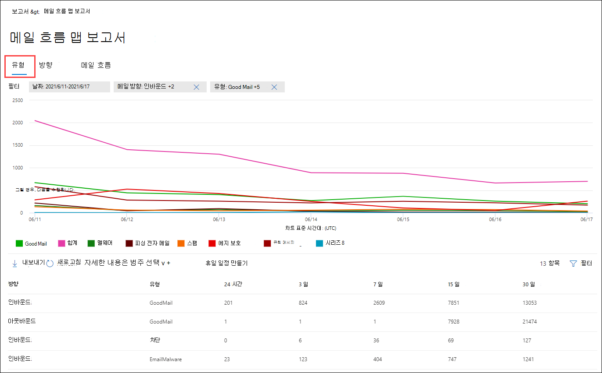
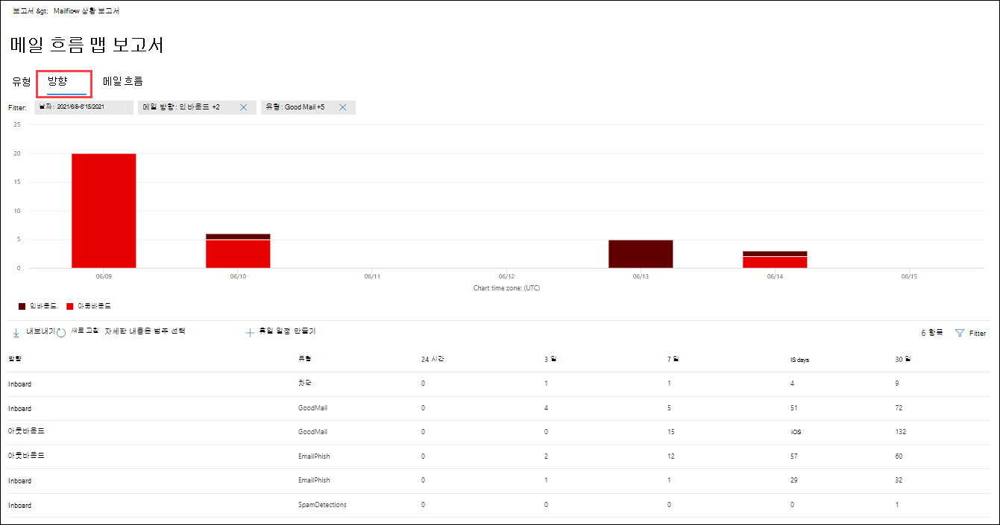

# 보안 및 준수 센터의 보고서 대시보드에서 & 흐름 보고서 보기

[!INCLUDE [Microsoft 365 Defender rebranding](../includes/microsoft-defender-for-office.md)]

**적용 대상**
- [Exchange Online Protection](exchange-online-protection-overview.md)
- [Office 365용 Microsoft Defender 플랜 1 및 플랜 2](defender-for-office-365.md)
- [Microsoft 365 Defender](../defender/microsoft-365-defender.md)

> [!NOTE]
> 이 문서의 대부분의 보고서는 Microsoft 365 Defender EAC(Exchange 관리 센터)에서 사용할 수 있습니다. 자세한 내용은 아래 항목을 참조하세요.
>
> - [새 관리 센터의 메일 흐름 Exchange 보고서](/exchange/monitoring/mail-flow-reports/mail-flow-reports)
> - [전자 메일 포털에서 전자 메일 Microsoft 365 Defender 보기](view-email-security-reports.md)

보안 및 준수 센터의 메일 흐름  대시보드에서 사용할 수 있는 메일 흐름 보고서 외에도 & 조직을 모니터링하는 데 도움이 되는 다양한 추가 메일 흐름 보고서를 보고서 대시보드에서 사용할 Microsoft 365 있습니다.

필요한 권한이 있는 경우 보고서 대시보드로 & 보안 및 준수 [센터에서](https://protection.office.com) 이러한 보고서를 볼 **수** \> **있습니다.** 보고서 대시보드로 직접 이동하기 위해 를 를 <https://protection.office.com/insightdashboard> 습니다.

## 커넥터 보고서

> [!NOTE]
> 이 보고서는 EAC의  인바운드 메시지 보고서 및 **아웃바운드** 메시지 보고서로 대체됩니다. 자세한 내용은 새 EAC의 인바운드 메시지 및 아웃바운드 메시지 [보고서를 참조하세요.](/exchange/monitoring/mail-flow-reports/mfr-inbound-messages-and-outbound-messages-reports)

## Exchange 전송 규칙 보고서

Exchange **전송** 규칙 보고서는 메일 흐름 규칙(전송 규칙)이 조직에서 들어오는 메시지와 보낼 메시지에 대한 영향을 보여 주며, 전송 규칙이 전송 규칙에 영향을 미치게 됩니다.

보고서를 표시하려면 보안 및 준수 [&](https://protection.office.com)를  열고 보고서 대시보드로 이동하여 전송 \>  **Exchange 선택합니다.** 보고서로 직접 이동하기 위해 를 를 <https://protection.office.com/reportv2?id=ETRRuleReport> 습니다.

### 전송 규칙 보고서의 Exchange 보기

보고서 보기에서는 다음 차트를 사용할 수 있습니다.

- **다음을 통해 데이터 보기: Exchange 규칙** \> **분석 결과: 방향:** 이 차트에는  전송  규칙의 영향을 받은 인바운드 및 아웃바운드 메시지 수가 표시됩니다.

- **다음을 통해 데이터 보기: Exchange 규칙** \> **분석 결과: 심각도:** 이 차트는  높은 심각도 및 보통 심각도 및 낮은 심각도 **메시지의 수를** 보여줍니다. 심각도 수준을 규칙의 작업으로 설정할 수 있습니다(**심각도** 수준 또는 _SetAuditSeverity로_ 이 규칙 감사). 자세한 내용은 에서 [메일 흐름 규칙 작업을 Exchange Online.](//Exchange/security-and-compliance/mail-flow-rules/mail-flow-rule-actions)

- **다음을 통해 데이터 보기: DLP Exchange 규칙** \> **분석 결과: 방향:** 이 차트에는  DLP(데이터 손실 방지) 전송 규칙의 영향을 받은 인바운드 및 아웃바운드 메시지 수가 표시됩니다.  다음 옵션 중 을 선택하여 차트를 구체화할 수 있습니다.

  - **데이터 표시: 모든 DLP 전송 규칙**
  - **데이터 표시: 손상된 사용자**
  - **데이터 표시: 미국 애국법이 검색된 콘텐츠의 양이 적습니다.**

- **다음을 통해 데이터 보기: DLP Exchange 규칙** \> **세분화: 방향:** 이 보기에는  높은 심각도 및 보통 심각도 및 DLP 전송 규칙의 영향을 받은 낮은 심각도 메시지 수가 표시됩니다.  다음 옵션 중 을 선택하여 차트를 구체화할 수 있습니다.

  - **데이터 표시: 모든 DLP 전송 규칙**
  - **데이터 표시: 손상된 사용자**
  - **데이터 표시: 미국 애국법이 검색된 콘텐츠의 양이 적습니다.**

보고서 보기에서 **필터를** 클릭하면 다음과 같은 필터를 사용하여 결과를 수정할 수 있습니다.

- **시작 날짜** 및 **종료 날짜**
- 방향 값
- 심각도 값

### 전송 규칙 보고서의 세부 Exchange 테이블 보기

세부 정보 **표 보기를** 클릭하면 표시되는 정보가 보고 있는 차트에 따라 다를 수 있습니다.

- **다음을 통해 데이터 보기: Exchange 규칙:**

  - **날짜**
  - **전송 규칙**
  - **제목**
  - **보낸 사람 주소**
  - **받는 사람 주소**
  - **심각도**
  - **방향**

- **다음을 통해 데이터 보기: DLP Exchange 규칙:**

  - **날짜**
  - **DLP 정책**
  - **전송 규칙**
  - **제목**
  - **보낸 사람 주소**
  - **받는 사람 주소**
  - **심각도**
  - **방향**

세부 정보 테이블 보기에서 **필터를** 클릭하면 다음 필터를 사용하여 결과를 수정할 수 있습니다.

- **시작 날짜** 및 **종료 날짜**
- 방향 값
- 심각도 값

보고서 보기로 돌아가려면 보고서 **보기 를 클릭합니다.**

## 전달 보고서

> [!NOTE]
> 이제 **EAC에서** 전달 보고서를 사용할 수 있습니다. 자세한 내용은 새 EAC의 자동 전달된 메시지 [보고서를 참조하세요.](/exchange/monitoring/mail-flow-reports/mfr-auto-forwarded-messages-report)

## 메일 흐름 상태 보고서

메일 **흐름 상태 보고서는** 전송 및 수신 전자 메일 보고서와 유사하며, 에지에서 허용되거나 차단되는 전자 메일에 대한 추가 정보가 있습니다. 이 보고서는 에지 보호 정보를 포함하는 유일한 보고서로, EOP(에지 보호)의 평가를 위해 서비스에 허용되기 전에 차단되는 전자 메일의 Exchange Online Protection 표시됩니다. 받는 사람 5명에게 메시지가 전송된 경우 하나의 메시지가 아니라 5개의 다른 메시지로 계산됩니다.
보고서를 확인하려면 보안 및 준수 & 를 열고 보고서 [대시보드로](https://protection.office.com)이동하여 메일 흐름 상태  \>  **보고서를 선택합니다.** 메일 흐름 상태 보고서로 직접 **이동하기 위해 를** 열고 을 을 를 열 수 <https://protection.office.com/mailflowStatusReport> 있습니다.

### 메일 흐름 상태 보고서의 형식 보기

보고서를 열면 유형 **탭이** 기본적으로 선택됩니다. 기본적으로 이 보기에는 차트와 다음 필터로 구성된 데이터 테이블이 포함되어 있습니다.

- **날짜:** 지난 7일
- **방향**:

  - **인바운드**
  - **아웃바운드**
  - **Intra-org**: 이 개수는 테넌트 내의 메시지에 대한 수입니다. 예: 보낸 사람 abc@domain.com 받는 사람 주소로 xyz@domain.com(인바운드 및 아웃바운드와 별도로 **계산)** 

- **유형:**

  - **좋은 메일**
  - **맬웨어**
  - **스팸**
  - **에지 보호**
  - **규칙 메시지**
  - **피싱 전자 메일**

차트는 종류 값으로 **구성됩니다.**

필터를 클릭하거나 차트  범례에서 값을 클릭하여 이러한 필터를 변경할 수 있습니다.

데이터 테이블에는 다음 정보가 포함되어 있습니다.

- **방향**
- **유형**
- **24시간**
- **3일**
- **7일**
- **15일**
- **30일**

자세한 내용을 **보려면 범주** 선택을 클릭하면 다음 값에서 선택할 수 있습니다.

- **피싱 전자 메일:** 이 선택을 통해 위협 방지 상태 [보고서로 전송됩니다.](view-email-security-reports.md#threat-protection-status-report)
- **전자 메일의** 맬웨어: 이 선택을 통해 위협 방지 상태 [보고서로 전송됩니다.](view-email-security-reports.md#threat-protection-status-report)
- **스팸 검색:** 이 선택을 통해 스팸 검색 [보고서로 전송됩니다.](view-email-security-reports.md#spam-detections-report)
- **Edge 차단 스팸:** 이 선택을 통해 스팸 검색 [보고서로 전송됩니다.](view-email-security-reports.md#spam-detections-report)

**내보내기**:

세부 정보 보기의 경우 하루 동안만 데이터를 내보낼 수 있습니다. 따라서 7일 동안 데이터를 내보내는 경우 7개 내보내기 작업을 수행해야 합니다.

내보낼 각 .csv 행은 150,000개로 제한됩니다. 해당 일의 데이터에 150,000개 이상의 행이 포함되어 있는 경우 여러 개의 .csv 파일이 만들어집니다.

### 메일 흐름 상태 보고서의 방향 보기

방향 탭을 **클릭하면** 유형 보기의 동일한 기본 **필터가** 사용됩니다.

차트는 방향 값으로 **구성됩니다.**

필터를 클릭하거나 차트  범례에서 값을 클릭하여 이러한 필터를 변경할 수 있습니다. 형식 보기의 **동일한 필터가** 사용됩니다.

데이터 테이블에는 형식 보기와 동일한 **정보가** 들어 있습니다.

사용 가능한 선택 **항목** 및 동작에 대한 자세한 내용은 종류 보기와 **같습니다.**

**내보내기**:

세부 정보 보기의 경우 하루 동안만 데이터를 내보낼 수 있습니다. 따라서 7일 동안 데이터를 내보내는 경우 7개 내보내기 작업을 수행해야 합니다.

내보낼 각 .csv 행은 150,000개로 제한됩니다. 해당 일의 데이터에 150,000개 이상의 행이 포함되어 있는 경우 여러 개의 .csv 파일이 만들어집니다.

### 메일 흐름 상태 보고서의 유입경로 보기

**Funnel** 보기는 Microsoft의 전자 메일 위협 방지 기능이 조직에서 받는 전자 메일과 보내기 전자 메일을 필터링하는 방법을 보여줍니다. 전체 전자 메일 수와 에지 보호, 맬웨어 방지, 피싱 방지, 스팸 방지 및 스푸핑 방지를 포함하여 구성된 위협 방지 기능이 이 수에 미치는 영향을 자세히 제공합니다.

**FUNNel** 탭을 클릭하면 기본적으로 이 보기에는 차트와 다음 필터로 구성된 데이터 테이블이 포함되어 있습니다.

- **날짜:** 지난 7일

- **방향**:

  - **인바운드**
  - **아웃바운드**
  - **Intra-org:** 이 개수는 테넌트 내에서 보낸 메시지에 대한 수입니다. 즉, 보낸 abc@domain.com 받는 사람 xyz@domain.com(인바운드 및 아웃바운드와는 별도로 계산)를 보냅니다.

집계 보기 및 데이터 테이블 보기는 90일 동안 필터링할 수 있습니다.

필터를 **클릭하면** 차트와 데이터 테이블을 모두 필터링할 수 있습니다.

이 차트에는 다음별로 구성한 전자 메일 수가 표시됩니다.

- **총 전자 메일**
- **Edge 보호 후 전자 메일**
- **맬웨어 방지, 파일 신뢰도, 파일 형식 차단 후 전자 메일**
- **피싱 방지, URL 신뢰도, 브랜드 가장, 스푸핑 방지 후 전자 메일**
- **스팸 방지, 대량 메일 필터링 후 전자 메일**
- **사용자 및 도메인** 가장 후 전자 메일 1
- **파일 후 전자 메일 및 URL 확인**1
- **배달 후 보호 후 무해한 것으로 감지된 전자 메일(URL 클릭 시간 보호)**

1 Defender for Office 365 전용

EOP 또는 Defender에서 필터링한 전자 메일을 개별적으로 Office 365 차트 범례의 값을 클릭합니다.

데이터 테이블에는 내선 날짜 순서로 표시되는 다음 정보가 포함되어 있습니다.

- **날짜**
- **총 전자 메일**
- **에지 보호**
- **맬웨어 방지, 파일 신뢰도, 파일 형식 블록**:
  - **파일 신뢰도:** 다른 Microsoft 고객이 첨부한 파일을 식별하여 필터링된 메시지입니다.
  - **파일 형식 블록:** 메시지에 식별된 악성 파일의 유형으로 인해 필터링된 메시지입니다.
- **피싱 방지, URL 신뢰도, 브랜드 가장, 스푸핑 방지**:
  - **URL 신뢰도:** 다른 Microsoft 고객이 URL을 식별하여 필터링된 메시지입니다.
  - **브랜드 가장:** 보낸 사람으로 가장하는 잘 알려진 브랜드에서 보낸 메시지로 인해 필터링된 메시지입니다.
  - **스푸핑** 방지: 받는 사람이 속한 도메인 또는 메시지 보낸 사람이 소유하지 않은 도메인을 스푸핑하려고 시도하여 필터링된 메시지입니다.
- **스팸 방지, 대량 메일 필터링**:
  - **대량 메일 필터링:** 받는 사람에게 대량 메일을 배달하려고 하여 필터링된 메시지입니다.
- **사용자 및 도메인 가장(사용자** 및 도메인 Office 365) :
  - **사용자 가장:** 피싱 방지 정책의 가장 보호 설정에 정의된 사용자(메시지 보낸 사람)를 가장하려는 시도로 인해 필터링된 메시지입니다.
  - **도메인 가장:** 피싱 방지 정책의 가장 보호 설정에 정의된 도메인을 가장하려고 시도하여 필터링된 메시지입니다.
- **파일 및 URL 확인(Office 365)**:
  - **파일 검색:** 첨부 파일 금고 필터링된 메시지입니다.
  - **URL 검색:** 링크 정책에 의해 금고 메시지입니다.
- **사후 배달 보호 및 ZAP(ATP) 또는 EOP(ZAP)**: ZAP는 제로 아워 자동 제거를 나타냅니다.

데이터 테이블에서 행을 선택하면 플라이아웃에 전자 메일 수의 추가 분석이 표시됩니다.

**내보내기**:

옵션에서 **내보내기** 를 **클릭한** 후 다음 값 중 하나를 선택할 수 있습니다.

- **요약(최근 90일 동안의 데이터 사용)**
- **세부 정보(지난 30일 동안의 데이터 사용)**

**날짜에서** 범위를 선택한 다음 적용을 **클릭합니다.** 현재 필터에 대한 데이터는 파일로 .csv 내보낼 수 있습니다.

내보낼 각 .csv 행은 150,000개로 제한됩니다. 데이터에 150,000개 이상의 행이 포함되어 있는 경우 여러 개의 .csv 파일이 만들어집니다.

 

### 메일 흐름 상태 보고서의 기술 보기

기술 **보기는** **Funnel** 보기와 유사하여 구성된 위협 방지 기능에 대해 보다 세부적인 세부 정보를 제공합니다. 차트에서 다양한 위협 방지 단계에서 메시지를 분류하는 방법을 볼 수 있습니다.

기술 보기  탭을 클릭하면 기본적으로 이 보기에는 차트와 다음 필터로 구성된 데이터 테이블이 포함되어 있습니다.

- **날짜:** 지난 7일

- **방향**:

  - **인바운드**
  - **아웃바운드**
  - **Intra-org**: 이 개수는 테넌트 내의 메시지에 대한 수입니다. 예: 보낸 사람 abc@domain.com 받는 사람 주소로 xyz@domain.com(인바운드 및 아웃바운드와 별도로 계산)

집계 보기 및 데이터 테이블 보기는 90일 동안 필터링할 수 있습니다.

필터를 **클릭하면** 차트와 데이터 테이블을 모두 필터링할 수 있습니다.

이 차트에는 다음 범주로 구성된 메시지가 표시됩니다.

- **총 전자 메일**
- **Edge 허용** 및 **Edge 필터링**
- **맬웨어가 아닌** 경우 금고 **검색,** 맬웨어 방지 엔진 검색 \* 및 규칙 **메시지** 
- **피싱이 아닌** 경우, **DMARC 실패,** 가장 **검색,** **스푸핑 검색** 및 **피싱 감지**
- **URL 검색 및 URL** 검색을 통해 검색 **안 하세요.**\*
- **스팸 및**  **스팸 아미기**
- **악성이 아닌 전자** **메일, 금고 링크** 검색 및 \* **ZAP**

\*Defender for Office 365

차트의 범주 위에 마우스를 대면 해당 범주의 메시지 수를 볼 수 있습니다.

데이터 테이블에는 내선 날짜 순서로 표시되는 다음 정보가 포함되어 있습니다.

- **날짜**
- **총 전자 메일**
- **Edge 필터링**
- **맬웨어 방지 엔진, 금고 필터링된 규칙:**
  - **필터링된 규칙:** 메일 흐름 규칙(전송 규칙)으로 인해 필터링된 메시지입니다.
- **DMARC, 가장, 스푸핑, 피싱 필터링:**
  - **DMARC: DMARC** 인증 검사에 실패한 메시지로 인해 필터링된 메시지입니다.
- **URL 검색**
- **스팸 방지 필터링**
- **ZAP 제거됨**
- **링크로 금고 검색**

데이터 테이블에서 행을 선택하면 플라이아웃에 전자 메일 수의 추가 분석이 표시됩니다.

**내보내기**:

내보내기 **를 클릭할** 때 **옵션에서** 다음 값 중 하나를 선택할 수 있습니다.

- **요약(최근 90일 동안의 데이터 사용)**
- **세부 정보(지난 30일 동안의 데이터 사용)**

**날짜에서** 범위를 선택한 다음 적용을 **클릭합니다.** 현재 필터에 대한 데이터는 파일로 .csv 내보낼 수 있습니다.

내보낼 각 .csv 행은 150,000개로 제한됩니다. 데이터에 150,000개 이상의 행이 포함되어 있는 경우 여러 개의 .csv 파일이 만들어집니다.

 

## 보낸 전자 메일 보고서 및 받은 전자 메일 보고서

> [!NOTE]
> 이 보고서는 메일 흐름 상태 [보고서로 대체됩니다.](#mailflow-status-report)

## 상위 보낸 사람 및 받는 사람 보고서

상위 **보낸 사람 및** 받는 사람 보고서는 전자 메일 보낸 사람 및 받는 사람을 표시하는 파이 차트입니다.

보고서를 확인하려면 보안 및 준수 & 를 열고 [보고서 대시보드로](https://protection.office.com)이동한 다음 상위 보낸 사람 및 받는  \>  **사람을 선택합니다.** 보고서로 직접 이동하기 위해 를 를 <https://protection.office.com/reportv2?id=TopSenderRecipientsATP> 습니다.

### 상위 보낸 사람 및 받는 사람 보고서에 대한 보고서 보기

보고서 보기에서는 다음 차트를 사용할 수 있습니다.

- **상위 메일 \> 보낸 사람에 대한 데이터 표시**
- **상위 메일 \> 받는 사람에 대한 데이터 표시**
- **상위 스팸 \> 받는 사람에 대한 데이터 표시**
- **데이터 표시 \> 상위 맬웨어** 받는 사람(EOP)
- **상위 맬웨어 받는 사람에 대한 데이터 \> 표시(Defender for Office 365)**

이러한 선택에 따라 파이 차트의 컴포지션이 변경됩니다.

파이 차트에서 에지 위에 마우스를 대면 보내거나 받은 메시지 수를 볼 수 있습니다.

보고서 보기에서 **필터를** 클릭하면 시작 날짜 및  종료 날짜로 날짜 범위를 **지정할 수 있습니다.**

### 상위 보낸 사람 및 받는 사람 보고서에 대한 세부 정보 테이블 보기

세부 정보 **표 보기를** 클릭하면 표시되는 정보가 보고 있는 차트에 따라 다를 수 있습니다.

- **상위 메일 \> 보낸 사람에 대한 데이터 표시**

  - **상위 메일 보낸 사람**
  - **개수**

- **상위 메일 \> 받는 사람에 대한 데이터 표시**

  - **상위 메일 받는 사람**
  - **개수**

- **상위 스팸 \> 받는 사람에 대한 데이터 표시**

  - **상위 스팸 받는 사람**
  - **개수**

- **데이터 표시 \> 상위 맬웨어** 받는 사람(EOP)

  - **상위 맬웨어 받는 사람**
  - **개수**

- **상위 맬웨어 받는 사람에 대한 데이터 \> 표시(Defender for Office 365)**

  - **상위 맬웨어 받는 사람(Defender for Office 365)**
  - **개수**

세부 정보 테이블 보기에서 **필터를** 클릭하면 시작 날짜  및 종료 날짜로 날짜 범위를 **지정할 수 있습니다.**

보고서 보기로 돌아가려면 보고서 **보기 를 클릭합니다.**

## 이러한 보고서를 보는 데 필요한 사용 권한은 무엇입니까?

이 문서에 설명된 보고서를 보고 사용하려면 Security & Compliance Center에서 다음 역할 그룹 중 하나에 & 합니다.

- **조직 관리**
- **보안 관리자**
- **보안 읽기 권한자**
- **전역 읽기 권한자**

자세한 내용은 [보안 및 준수 센터의 사용 권한](permissions-in-the-security-and-compliance-center.md)을 참조하세요.

> [!NOTE]
> Microsoft 365 관리 센터의 해당 Azure Active Directory 역할에 사용자를 추가하면 사용자에게 보안 및 준수 센터에서 필요한 권한 _및_ Microsoft 365의 다른 기능에 대한 권한이 부여됩니다. 자세한 내용은 [관리자 역할 정보](../../admin/add-users/about-admin-roles.md)를 참조하세요.

## 관련 항목

[보안 및 준수 센터의 스마트 보고서 및 인사이트](reports-and-insights-in-security-and-compliance.md)

[보안 및 준수 센터의 메일 흐름 파악](mail-flow-insights-v2.md)

[보안 및 준수 센터의 전자 메일 보안 보고서 보기](view-email-security-reports.md)

[Microsoft Defender for Office 365](view-reports-for-mdo.md)
