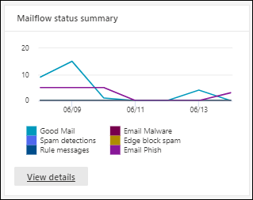

# 보안 규정 준수 센터의 보고서 대시보드에서 메일 & 보고서 보기View mail flow reports in the Reports dashboard in Security & Compliance Center

보안 & 준수 센터의 메일 흐름 대시보드에서 사용할 수 [있는 메일 흐름](mail-flow-insights-v2.md) 보고서 외에도 Microsoft 365 조직을 모니터링 하는 데 도움이 되는 보고서 대시보드에서 다양한 추가 메일 흐름 보고서를 사용할 수 있습니다.In addition to the mail flow reports that are available in the [Mail flow dashboard](mail-flow-insights-v2.md) in the Security & Compliance Center, a variety of additional mail flow reports are available in the Reports dashboard to help you monitor your Microsoft 365 organization.

필요한 권한이 있는 [경우 보고서 대시보드로](#what-permissions-are-needed-to-view-these-reports)이동하여 [보안 센터에서 & 이러한 보고서를](https://office.protection.com) 볼 **수** \> **있습니다.**If you have the [necessary permissions](#what-permissions-are-needed-to-view-these-reports), you can view these reports in the [Security & Compliance Center](https://office.protection.com) by going to **Reports** \> **Dashboard**. 보고서 대시보드로 직접 이동하려면 <https://office.protection.office.com/insightdashboard> .To go directly to the Reports dashboard, open <https://office.protection.office.com/insightdashboard>.

## 커넥터 보고서Connector report

커넥터 **보고서는** 조직에 대해 구성된 [인바운드 및 아웃바운드 커넥터에서의](https://docs.microsoft.com/Exchange/mail-flow-best-practices/use-connectors-to-configure-mail-flow/use-connectors-to-configure-mail-flow) 메일 흐름 활동을 보여줍니다.The **Connector report** shows mail flow activity on the [inbound and outbound connectors](https://docs.microsoft.com/Exchange/mail-flow-best-practices/use-connectors-to-configure-mail-flow/use-connectors-to-configure-mail-flow) that are configured for your organization.

보고서를 보려면 준수 센터에서 [보안 & 보고서](https://protection.office.com)대시보드로 **Reports** \> **이동하여 커넥터** **보고서를 선택합니다.**To view the report, open the [Security & Compliance Center](https://protection.office.com), go to **Reports** \> **Dashboard** and select **Connector report**. 보고서로 직접 이동하려면 <https://protection.office.com/reportv2?id=ConnectorReport> .To go directly to the report, open <https://protection.office.com/reportv2?id=ConnectorReport>.

### 커넥터 보고서의 보고서 보기Report view for the Connector report

보고서 보기에서는 다음 차트를 사용할 수 있습니다.The following charts are available in report view:

- **데이터 보기: 메일 흐름:** 이 차트에는 다음과 같이 구성된 인바운드 및 아웃바운드 메시지 수가 표시됩니다.**View data by: Mail flow**: This chart shows the number of inbound and outbound messages organized by:

  - **합계****Total**
  - **커넥터 없이 인터넷에서****From the internet without a connector**
  - **커넥터 없이 인터넷으로 연결****To the internet without a connector**
  - 구성한 특정 커넥터A specific connector that you've configured.

  차트의 데이터를 격리하려면 컨트롤에 대한 **데이터 표시 컨트롤을** 사용하여 이러한 옵션 중 하나 또는 모든 메일 **흐름을 선택할 수 있습니다.**To isolate the data in the chart, use the **Show data for** control to select one of these options or **All mail flow**.

  

- **데이터 보기:TLS 사용: 이**차트는 메일 흐름에 대한 TLS(전송 계층 보안) 버전 사용의 백분율을 보여 줍니다.**View data by: TLS usage**: This chart shows the percentage of Transport Layer Security (TLS) version usage for mail flow.

  차트의 데이터를 격리하려면 컨트롤의 **표시 데이터를 사용하여** 다음 옵션 중 하나를 선택합니다.To isolate the data in the chart, use the **Show data for** control to select one of the following options:

  - **모든 메일 흐름****All mail flow**
  - **커넥터 없이 인터넷에서****From the internet without a connector**
  - **커넥터 없이 인터넷으로 연결****To the internet without a connector**
  - 구성한 특정 커넥터A specific connector that you've configured.

  

보고서 보기에서 **필터를** 클릭한 경우 시작 날짜와 종료 날짜로 날짜 **범위를** 지정할 **수 있습니다.**If you click **Filters** in a report view, you can specify a date range with **Start date** and **End date**.

### 커넥터 보고서의 세부 정보 표 보기Details table view for the Connector report

보고서 보기에서 **세부 정보 표를** 클릭하면 다음 정보가 표시됩니다.If you click **View details table** in a report view, the following information is shown:

- **날짜****Date**
- **커넥터 방향 및 이름****Connector direction and name**
- **커넥터 유형****Connector type**
- **강요된 TLS?**: **True** 또는 False **값입니다.****Forced TLS?**: The value **True** or **False**.
- **TLS** 없음(비율)**No TLS** (percentage)
- **TLS** 1.0(백분율)**TLS 1.0** (percentage)
- **TLS** 1.1(백분율)**TLS 1.1** (percentage)
- **TLS** 1.2(백분율)**TLS 1.2** (percentage)
- **볼륨**: 메시지의 수**Volume**: The number of messages.

세부 정보 **보기에서 필터를** 클릭한 경우 시작 날짜와 종료 날짜로 날짜 **범위를** 지정할 **수 있습니다.**If you click **Filters** in a details table view, you can specify a date range with **Start date** and **End date**.

보고서 보기로 돌아가려면 보고서 **보기를 클릭합니다.**To go back to the report view, click **View report**.

## Exchange 전송 규칙 보고서Exchange transport rule report

**Exchange 전송 규칙 보고서는** 조직에서 들어오고 나가는 메시지에 대한 메일 흐름 규칙(전송 규칙이라고도 함)의 영향을 보여줍니다.The **Exchange transport rule report** shows the effect of mail flow rules (also known as transport rules) on incoming and outgoing messages in your organization.

보고서를 보려면 보안 서비스 관리 [& 만들고 보고서](https://protection.office.com)대시보드로 **이동한** \> **다음 Exchange 전송** **규칙을 선택합니다.**To view the report, open the [Security & Compliance Center](https://protection.office.com), go to **Reports** \> **Dashboard** and select **Exchange Transport rule**. 보고서로 직접 이동하려면 <https://protection.office.com/reportv2?id=ETRRuleReport> .To go directly to the report, open <https://protection.office.com/reportv2?id=ETRRuleReport>.

### Exchange 전송 규칙 보고서의 보고서 보기Report view for the Exchange transport rule report

보고서 보기에서는 다음 차트를 사용할 수 있습니다.The following charts are available in report view:

- **다음을 사용하자 데이터 보기: Exchange 전송 규칙** \> **분석: 이 차트에는**전송 규칙의 영향을 **받은** 인바운드 및 아웃바운드 메시지 수가 표시됩니다. **Outbound****View data by: Exchange transport rules** \> **Break down by: Direction**: This chart shows the number of **Inbound** and **Outbound** messages that were affected by transport rules.

- **다음을 사용하자 데이터 보기: Exchange 전송 규칙** \> **분석: 심각도: 이**차트는 높은 **심각도 및** **중간 심각도,** 낮은 심각도 메시지 **수를 표시합니다.****View data by: Exchange transport rules** \> **Break down by: Severity**: This chart shows the number of **High severity** and **Medium severity**, and **Low severity** messages. 심각도 수준을 규칙에서 작업으로**설정합니다(심각도 수준 또는** _SetAuditSeverity를 사용하여 이 규칙 감사)._You set the severity level as an action in the rule (**Audit this rule with severity level** or _SetAuditSeverity_). 자세한 내용은 [Exchange Online에서 메일 흐름 규칙 작업을 참조하세요.](https://docs.microsoft.com//Exchange/security-and-compliance/mail-flow-rules/mail-flow-rule-actions)For more information, see [Mail flow rule actions in Exchange Online](https://docs.microsoft.com//Exchange/security-and-compliance/mail-flow-rules/mail-flow-rule-actions).

- **DLP Exchange 전송 규칙별 데이터 보기** \> **분석: 이**차트에는 DLP(데이터 **Inbound** 손실 방지) 전송 규칙의 영향을 받은 인바운드 및 아웃바운드 메시지 수가 표시됩니다. **Outbound****View data by: DLP Exchange transport rules** \> **Break down by: Direction**: This chart shows the number of **Inbound** and **Outbound** messages that were affected by data loss prevention (DLP) transport rules. 다음 옵션 중에서 선택한 선택하더라도 차트를 더 세분화할 수 있습니다.You can further refine the chart by selecting on of the following options:

  - **데이터 표시: 모든 DLP 전송 규칙****Show data for: All DLP transport rules**
  - **데이터 표시: 보안 사용자 보안****Show data for: Compromised users**
  - **미국(국가)에 대한 데이터 미만을 보냅니다.****Show data for: Low volume of content detected U.S. Patriot Act**

- **DLP Exchange 전송 규칙별 데이터 보기** \> **분석: 이 보기에는**DLP 전송 **규칙의 영향을** 받은 심각도 및 **Low severity** **중간**심각도 및 낮은 심각도 메시지의 수가 표시됩니다.**View data by: DLP Exchange transport rules** \> **Break down by: Direction**: This view shows the number of **High severity** and **Medium severity**, and **Low severity** messages that were affected by DLP transport rules. 다음 옵션 중에서 선택한 선택하더라도 차트를 더 세분화할 수 있습니다.You can further refine the chart by selecting on of the following options:

  - **데이터 표시: 모든 DLP 전송 규칙****Show data for: All DLP transport rules**
  - **데이터 표시: 보안 사용자 보안****Show data for: Compromised users**
  - **미국(국가)에 대한 데이터 미만을 보냅니다.****Show data for: Low volume of content detected U.S. Patriot Act**

보고서 보기에서 **필터를** 클릭한 경우 다음 필터를 사용하여 결과를 수정할 수 있습니다.If you click **Filters** in a report view, you can modify the results with the following filters::

- **시작 날짜** **및 끝 날짜****Start date** and **End date**
- 방향 값Direction values
- 심각도 값Severity values

### Exchange 전송 규칙 보고서의 세부 정보 표 보기Details table view for the Exchange transport rule report

세부 정보 **표를 보기를**클릭하면 표시되는 정보는 검색 하고 있는 차트에 따라 달라지게 됩니다.If you click **View details table**, the information that's shown depends on the chart you were looking at:

- **다음을 사용한 데이터 보기: Exchange 전송 규칙:****View data by: Exchange Transport rules**:

  - **날짜****Date**
  - **전송 규칙****Transport rule**
  - **제목****Subject**
  - **보낸 사람 주소****Sender address**
  - **받는 사람 주소****Recipient address**
  - **심각도****Severity**
  - **방향****Direction**

- **DLP Exchange 전송 규칙: 사용자별 데이터 보기:****View data by: DLP Exchange transport rules**:

  - **날짜****Date**
  - **DLP 정책****DLP policy**
  - **전송 규칙****Transport rule**
  - **제목****Subject**
  - **보낸 사람 주소****Sender address**
  - **받는 사람 주소****Recipient address**
  - **심각도****Severity**
  - **방향****Direction**

세부 정보 표 **보기에서** 필터를 클릭한 경우 다음 필터를 사용하여 결과를 수정할 수 있습니다.If you click **Filters** in a details table view, you can modify the results with the following filters:

- **시작 날짜** **및 끝 날짜****Start date** and **End date**
- 방향 값Direction values
- 심각도 값Severity values

보고서 보기로 돌아가려면 보고서 **보기를 클릭합니다.**To go back to the report view, click **View report**.

## 전달 보고서Forwarding report

전달 **보고서에는 Exchange** Online 사서함에서 외부 도메인으로 자동으로 전달된 조직의 메시지가 표시됩니다.The **Forwarding report** shows your organization's automatically forwarded messages to external domains from Exchange Online mailboxes. 전달된 메시지는 보안 또는 규정 준수 위험을 일어받을 수 있기며 계정이 노출된 것을 나타냅니다.Forwarded messages can pose a security or compliance risk, and might indicate a compromised account.

보고서를 보려면 준수 센터에서 [보안 & 보고서](https://protection.office.com) **대시보드로** \> **이동한 후** 전달 **보고서를 선택합니다.**To view the report, open the [Security & Compliance Center](https://protection.office.com), go to **Reports** \> **Dashboard** and select **Forwarding report**. 보고서로 직접 이동하려면 <https://protection.office.com/reportv2?id=MailFlowForwarding> .To go directly to the report, open <https://protection.office.com/reportv2?id=MailFlowForwarding>.

### 전달 보고서의 보고서 보기Report view for the Forwarding report

보고서 보기에서는 다음 차트를 사용할 수 있습니다.The following charts are available in the report view:

- **데이터 표시: 전달 메서드:** 다음 메서드가 표시됩니다.**Show data for: Forwarding methods**: The following methods are shown:

  - **전송 규칙:** 메일 흐름 [규칙이라고도 알려진 전송 규칙.](https://docs.microsoft.com/Exchange/security-and-compliance/mail-flow-rules/mail-flow-rules)**Transport rule**: Also known as [mail flow rules](https://docs.microsoft.com/Exchange/security-and-compliance/mail-flow-rules/mail-flow-rules).
  - **사서함 규칙:** 받은 편지함 [규칙이라고도 함](https://support.microsoft.com/office/c24f5dea-9465-4df4-ad17-a50704d66c59)규칙.**Mailbox rule**: Also known as [Inbox rules](https://support.microsoft.com/office/c24f5dea-9465-4df4-ad17-a50704d66c59).

  

- **데이터 가져오기: 전달 도메인:** 이 보기에는 전달 대상에 해당하는 받는 사람 도메인이 표시됩니다.**Show data for: Forwarding domains**: This view shows the recipient domains that are the destinations for forwarding.

  

- **데이터 표시: 전달자:** 다음 전달자가 표시됩니다.**Show data for: Forwarders**: The following forwarders are shown:

  - **전송 규칙****Transport rule**
  - 전달 받은 편지함 규칙이 들어 있는 사서함입니다.The mailbox that contains the forwarding Inbox rule.

  

보고서 보기에서 **필터를** 클릭한 경우 시작 날짜와 종료 날짜로 날짜 **범위를** 지정할 **수 있습니다.**If you click **Filters** in a report view, you can specify a date range with **Start date** and **End date**.

### 전달 보고서의 세부 정보 표 보기Details table view for the Forwarding report

보고서 보기에서 **세부 정보 표를** 클릭하면 다음 정보가 표시됩니다.If you click **View details table** in a report view, the following information is shown:

- **전달자:** 전달 받은 **편지함** 규칙이 포함되어 있는 사서함 또는 가치 전송 규칙입니다.**Forwarders**: The value **Transport rule** or the mailbox that contains the forwarding Inbox rule.
- **전달 유형:** 값 사서함 **규칙 또는** **전송 규칙.****Forwarding type**: The value **Mailbox rule** or **Transport rule**.
- **받는 사람 이름****Recipient name**
- **받는 사람 도메인****Recipient domain**
- **세부**정보: 메일 흐름 규칙의 GUID 값 또는 받은 편지함 규칙의 RuleIdentity 값입니다.**Details**: This is the GUID value of the mail flow rule, or the RuleIdentity value of the Inbox rule.
- **개수****Count**
- **첫 번째 전달 날짜****First forward date**

세부 정보 **보기에서 필터를** 클릭한 경우 시작 날짜와 종료 날짜로 날짜 **범위를** 지정할 **수 있습니다.**If you click **Filters** in a details table view, you can specify a date range with **Start date** and **End date**.

보고서 보기로 돌아가려면 보고서 **보기를 클릭합니다.**To go back to the reports view, click **View report**.

## 메일 흐름 상태 보고서Mailflow status report

메일 **흐름 상태 보고서는 보낸 후** 받은 전자 메일 [보고서와](#sent-and-received-email-report)비슷하지만, Edge에서 허용하거나 차단하는 방법에 대한 추가 정보입니다.The **Mailflow status report** is similar to the [Sent and received email report](#sent-and-received-email-report), with additional information about email allowed or blocked on the edge. Edge 보호 정보를 포함하는 유일한 보고서이며 EOP(Exchange Online Protection)에서 평가를 위해 서비스로 허용되기 전에 차단되는 전자 메일의 양만 표시합니다.This is the only report that contains edge protection information, and shows just how much email is blocked before being allowed into the service for evaluation by Exchange Online Protection (EOP). 메시지를 받는 사람 5명에게 보낼 경우 메시지 하나가 5명인 다른 메시지로 계산된다는 점을 이해해야 합니다.It's important to understand that if a message is sent to five recipients we count it as five different messages and not one message.
보고서를 보려면 보안 센터에서 [& 만들고 보고서](https://protection.office.com) **대시보드로** \> **이동한 후 메일** 흐름 상태 **보고서를 선택합니다.**To view the report, open the [Security & Compliance Center](https://protection.office.com), go to **Reports** \> **Dashboard** and select **Mailflow status report**. 메일 흐름 상태 보고서로 **직접 이동하려면 을**엽니다. <https://protection.office.com/mailflowStatusReport>To go directly to the **Mail flow status report**, open <https://protection.office.com/mailflowStatusReport>.

### 메일 흐름 상태 보고서의 유형 보기Type view for the Mailflow status report

보고서를 열면 기본적으로 **Type(종류)** 탭이 선택되어 있습니다.When you open the report, the **Type** tab is selected by default. 기본적으로 이 보기에는 다음과 같은 필터로 구성된 차트와 데이터 테이블이 포함되어 있습니다.By default, this view contains a chart and a data table that's configured with the following filters:

- **날짜**: 지난 7일**Date**: The last 7 days.
- **Direction**:**Direction**:

  - **인바운드****Inbound**
  - **아웃바운드****Outbound**
  - **조직 내: 이**수는 테넌트 내의 메시지 수입니다.**Intra-org**: this count is for messages within a tenant i.e 보낸 abc@domain.com 사람 번호(인바운드 및 xyz@domain.com 아웃바운드에서 별도로 **계산)를 받는** 사람 **번호로 보내기**sender abc@domain.com sends to recipient xyz@domain.com  (counted separately from **Inbound** and **Outbound**)

- **Type**:**Type**:

  - **정상 메일****Good mail**
  - **맬웨어****Malware**
  - **스팸****Spam**
  - **Edge 보호****Edge protection**
  - **규칙 메시지****Rule messages**
  - **피싱 전자 메일****Phishing email**

차트가 Type 값을 사용하여 **구성됩니다.**The chart is organized by the **Type** values.

필터를 클릭하거나 차트 **범례에서** 값을 클릭하여 이러한 필터를 변경할 수 있습니다.You can change these filters by clicking **Filter** or by clicking a value in the chart legend.

데이터 테이블에는 다음과 같은 정보가 포함됩니다.The data table contains the following information:

- **방향****Direction**
- **Type****Type**
- **24시간****24 hours**
- **3일****3 days**
- **7일****7 days**
- **15일****15 days**
- **30일****30 days**

자세한 **정보를 보기 위해 범주를 선택할 경우**다음 값 중에서 선택할 수 있습니다.If you click **Choose a category for more details**, you can select from the following values:

- **피싱 전자 메일:** 이 기능을 선택하면 위협 방지 상태 [보고서로 이동됩니다.](view-email-security-reports.md#threat-protection-status-report)**Phishing email**: This selection takes you to the [Threat protection status report](view-email-security-reports.md#threat-protection-status-report).
- **전자 메일의 맬웨어:** 이 선택을 선택하면 위협 방지 상태 [보고서로 이동됩니다.](view-email-security-reports.md#threat-protection-status-report)**Malware in email**: This selection takes you to the [Threat protection status report](view-email-security-reports.md#threat-protection-status-report).
- **스팸 검색:** 이 선택 항목을 사용하면 스팸 검색 [보고서로 이동됩니다.](view-email-security-reports.md#spam-detections-report)**Spam detections**: This selection takes you to the [Spam Detections report](view-email-security-reports.md#spam-detections-report).
- **Edge 차단된 스팸:** 이 선택 항목을 선택하면 스팸 [검색 보고서로 이동합니다.](view-email-security-reports.md#spam-detections-report)**Edge blocked spam**: This selection takes you to the [Spam Detections report](view-email-security-reports.md#spam-detections-report).

**Export**:**Export**:

세부 정보 보기의 경우 한 날짜에 한 번만 데이터를 내보낼 수 있습니다.For the detail view, you can only export data for one day. 따라서 7일 동안 데이터를 내보내려면 7가지 다른 내보내기 작업을 수행해야 합니다.So, if you want to export data for 7 days, you need to do 7 different export actions.

내보낸 각 .csv 파일은 150,000개의 행으로 제한됩니다.Each exported .csv file is limited to 150,000 rows. 해당 날짜의 데이터에 15만 개보다 많은 행이 포함되어 있는 경우 여러 개의 .csv 파일이 생성됩니다.If the data for that day contains more than 150,000 rows, then multiple .csv files will be created.

### 메일 흐름 상태 보고서의 방향 보기Direction view for the Mailflow status report

방향 탭을 **클릭하면** 유형 보기의 동일한 기본 **필터가** 사용됩니다.If you click the **Direction** tab, the same default filters from the **Type** view are used.

차트가 Direction 값으로 **구성됩니다.**The chart is organized by **Direction** values.

필터를 클릭하거나 차트 **범례에서** 값을 클릭하여 이러한 필터를 변경할 수 있습니다.You can change these filters by clicking **Filter** or by clicking a value in the chart legend. 형식 보기의 동일한 **필터가** 사용됩니다.The same filters from the **Type** view are used.

데이터 테이블에는 형식 보기의 동일한 정보가 **포함됩니다.**The data table contains same information from the **Type** view.

이 **범주에서 사용 가능한 더 자세한 선택** 항목 및 동작에 대한 범주선택은 유형 보기와 **같습니다.**The **Choose a category for more details** available selections and behavior are the same as the **Type** view.

**Export**:**Export**:

세부 정보 보기의 경우 한 날짜에 한 번만 데이터를 내보낼 수 있습니다.For the detail view, you can only export data for one day. 따라서 7일 동안 데이터를 내보내려면 7가지 다른 내보내기 작업을 수행해야 합니다.So, if you want to export data for 7 days, you need to do 7 different export actions.

내보낸 각 .csv 파일은 150,000개의 행으로 제한됩니다.Each exported .csv file is limited to 150,000 rows. 해당 날짜의 데이터에 15만 개보다 많은 행이 포함되어 있는 경우 여러 개의 .csv 파일이 생성됩니다.If the data for that day contains more than 150,000 rows, then multiple .csv files will be created.

### 메일 흐름 상태 보고서의 Funnel 보기Funnel view for the Mailflow status report

금지 **보기에서는** Microsoft의 전자 메일 위협 방지 기능으로 조직 내 수신 및 보내는 전자 메일을 필터링하는 방법을 보여 줍니다.The **Funnel** view shows you how Microsoft's email threat protection features filter incoming and outgoing email in your organization. 이 표에서는 총 전자 메일 수와 Edge 보호, 맬웨어 방지, 피싱 방지, 스팸 방지 및 스푸핑 방지를 비롯한 구성된 위협 보호 기능이 이 개수에 미치는 영향에 대한 세부 정보를 제공합니다.It provides details on the total email count, and how the configured threat protection features, including edge protection, anti-malware, anti-phishing, anti-spam, and anti-spoofing affect this count.

기본적으로 이 **보기에 포함된 새로운** 탭과 다음과 같은 필터로 구성된 데이터 테이블이 이 보기에 포함됩니다.If you click the **Funnel** tab, by default, this view contains a chart and a data table that's configured with the following filters:

- **날짜**: 지난 7일**Date**: The last 7 days.

- **Direction**:**Direction**:

  - **인바운드****Inbound**
  - **아웃바운드****Outbound**
  - **조직 내: 테넌트**내에서 보낸 메시지에 대한 수입니다. 다시 보낸 사람 주소는 abc@domain.com 사람 주소(인바운드 및 xyz@domain.com 아웃바운드에서 별도로 계산됨)에게 보냅니다.**Intra-org**: This count is for messages sent within a tenant; i.e, sender abc@domain.com sends to recipient xyz@domain.com (counted separately from Inbound and Outbound).

집계 보기 및 데이터 테이블 보기에서는 90일 동안 필터링이 허용됩니다.The aggregate view and data table view allow for 90 days of filtering.

**Filter를 클릭하면**차트 및 데이터 테이블을 모두 필터링할 수 있습니다.If you click **Filter**, you can filter both the chart and the data table.

이 차트에는 다음과 같이 구성된 전자 메일 수가 표시됩니다.This chart shows the email count organized by:

- **총 전자 메일****Total email**
- **Edge 보호 후 전자 메일****Email after edge protection**
- **Email after anti-malware, file reputation, file type block****Email after anti-malware, file reputation, file type block**
- **피싱 방지, URL 신뢰도, 브랜드 가장, 스푸핑 방지 후의 전자 메일****Email after anti-phish, URL reputation, brand impersonation, anti-spoof**
- **스팸 방지 후의 전자 메일, 대량 메일 필터링****Email after anti-spam, bulk mail filtering**
- 사용자 및 도메인 가장 1 **이후의**전자 메일**Email after user and domain impersonation**1
- **파일 및 URL 디온 1 이후의**메일**Email after file and URL detonation**1
- **배달 후 보호 후 검색된 전자 메일(URL 클릭 시간 보호)****Email detected as benign after post-delivery protection (URL click time protection)**

1 Office 365 ATP만1 Office 365 ATP only

EOP 또는 ATP를 사용하여 별도로 필터링된 전자 메일을 표시하려면 차트 범례에서 값을 클릭합니다.To view the email filtered by EOP or ATP separately, click on the value in the chart legend.

데이터 테이블에는 내내의 날짜 순서대로 표시된 다음 정보가 포함됩니다.The data table contains the following information, shown in descending date order:

- **날짜****Date**
- **총 전자 메일****Total email**
- **Edge 보호****Edge protection**
- **맬웨어 방지, 파일 신뢰도, 파일 형식 차단****Anti-malware, file reputation, file type block**
- **피싱 방지, URL 신뢰도, 브랜드 가장, 스푸핑 방지****Anti-phish, URL reputation, Brand impersonation, anti-spoof**
- **스팸 방지, 대량 메일 필터링****Anti-spam, bulk mail filtering**
- **사용자 및 도메인 가장(ATP)****User and domain impersonation (ATP)**
- **파일 및 URL 디터와이션(ATP)****File and URL detonation (ATP)**
- **POST-Delivery Protection and ZAP(ATP) 또는 ZAP(ZAP)****Post-delivery protection and ZAP (ATP), or ZAP (EOP)**

데이터 테이블에서 행을 선택하면 전자 메일 수에 대한 추가 분석이 플라이아웃에 표시됩니다.If you select a row in the data table, a further breakdown of the email counts are shown in the flyout.

**Export**:**Export**:

옵션에서 **내보내기를** **클릭한 후에는**다음 값 중 하나를 선택할 수 있습니다.After you click **Export** under **Options**, you can select one of the following values:

- **요약(가장 최근 90일 동안의 데이터 사용)****Summary (with data for last 90 days at most)**
- **세부 정보(지난 30일 동안의 데이터 사용)****Details (with data for last 30 days at most)**

날짜 **아래에서**범위를 선택한 다음 적용을 **클릭합니다.**Under **Date**, choose a range, and then click **Apply**. 현재 필터의 데이터는 .csv 파일로 내보내집니다.Data for the current filters will be exported to a .csv file.

내보낸 각 .csv 파일은 150,000개의 행으로 제한됩니다.Each exported .csv file is limited to 150,000 rows. 데이터에 15만 개보다 많은 행이 포함되어 있는 경우 여러 .csv 파일이 생성됩니다.If the data contains more than 150,000 rows, then multiple .csv files will be created.

 

### 메일 흐름 상황 보고서기술 보기Tech view for the Mailflow status report

기술 **보기는** 새로운 **보기와 비슷하며, 구성된** 위협 방지 기능에 대한 더 세부 세부 정보를 제공합니다.The **Tech view** is similar to the **Funnel** view, providing more granular details for the configured threat protections features. 차트에서 다양한 위협 방지 단계에서 메시지가 분류되는 방식을 확인할 수 있습니다.From the chart, you can see how messages are categorized at the different stages of threat protection.

기본적으로 Tech **보기 탭을** 클릭하면 이 보기에는 다음과 같은 필터를 사용하여 구성된 차트 및 데이터 테이블이 포함됩니다.If you click the **Tech view** tab, by default, this view contains a chart and a data table that's configured with the following filters:

- **날짜**: 지난 7일**Date**: The last 7 days.

- **Direction**:**Direction**:

  - **인바운드****Inbound**
  - **아웃바운드****Outbound**
  - **조직 내: 이**수는 테넌트 내의 메시지 수입니다.**Intra-org**: this count is for messages within a tenant i.e 보낸 abc@domain.com 사람 이름(인바운드 및 xyz@domain.com 아웃바운드에서 별도로 계산)을 통해 받는 사람 데이터를 보냅니다.sender abc@domain.com sends to recipient xyz@domain.com (counted separately from Inbound and Outbound)

집계 보기 및 데이터 테이블 보기에서는 90일 동안 필터링이 허용됩니다.The aggregate view and data table view allow for 90 days of filtering.

**Filter를 클릭하면**차트 및 데이터 테이블을 모두 필터링할 수 있습니다.If you click **Filter**, you can filter both the chart and the data table.

이 차트에는 다음 범주로 구성된 메시지가 표시됩니다.This chart shows messages organized into the following categories:

- **총 전자 메일****Total email**
- **Edge 허용, 에지 필터링****Edge allow, edge filtered**
- **맬웨어가 아오오고 ATP(안전한 첨부 파일 검색), 맬웨어 방지 엔진 검색, 규칙 차단****Not malware, Safe attachments detection (ATP), Anti-malware engine detection, rule block**
- **피싱, DMARC 실패, 가장 감지, 스푸핑 탐지, 피싱 탐지****Not phish, DMARC failure, impersonation detection, spoof detection, phish detection**
- **URL 감각이 포함된 검색, URL 감지(ATP)****No detection with URL detonation, URL detonation detection (ATP)**
- **스팸이 아지 지 않습니다, 스팸****Not spam, spam**
- **악성이 아닌 이메일, ATP(안전한 링크 검색), ZAP****Non-malicious email, safe links detection (ATP), ZAP**

차트에서 범주 위에 위로 가리면 해당 범주의 메시지 수를 볼 수 있습니다.When you hover over a category in the chart, you can see the number of messages in that category.

데이터 테이블에는 내내의 날짜 순서대로 표시된 다음 정보가 포함됩니다.The data table contains the following information, shown in descending date order:

- **날짜****Date**
- **총 전자 메일****Total email**
- **Edge 필터링됨****Edge filtered**
- **맬웨어 방지 엔진, 안전한 첨부 파일, 규칙 필터링됨****Anti-malware engine, safe attachments, rule filtered**
- **DMARC, 가장, 스푸핑, 피싱 필터링****DMARC, impersonation, spoof, phish filtered**
- **URL 감지****URL detonation detection**
- **스팸 방지 필터링됨****Anti-spam filtered**
- **ZAP 제거됨****ZAP removed**
- **안전한 링크로 검색****Detection by safe links**

데이터 테이블에서 행을 선택하면 전자 메일 수에 대한 추가 분석이 플라이아웃에 표시됩니다.If you select a row in the data table, a further breakdown of the email counts are shown in the flyout.

**Export**:**Export**:

내보내기를 **클릭하고**옵션 **아래에서** 다음 값 중 하나를 선택할 수 있습니다.On clicking **Export**, under **Options** you can select one of the following values:

- **요약(가장 최근 90일 동안의 데이터 사용)****Summary (with data for last 90 days at most)**
- **세부 정보(지난 30일 동안의 데이터 사용)****Details (with data for last 30 days at most)**

날짜 **아래에서**범위를 선택한 다음 적용을 **클릭합니다.**Under **Date**, choose a range, and then click **Apply**. 현재 필터의 데이터는 .csv 파일로 내보내집니다.Data for the current filters will be exported to a .csv file.

내보낸 각 .csv 파일은 150,000개의 행으로 제한됩니다.Each exported .csv file is limited to 150,000 rows. 데이터에 15만 개보다 많은 행이 포함되어 있는 경우 여러 .csv 파일이 생성됩니다.If the data contains more than 150,000 rows, then multiple .csv files will be created.

 

## 보낸 메일 및 받은 전자 메일 보고서Sent and received email report

보낸 **및 받은 전자 메일 보고서는** 스팸 탐지, 맬웨어 및 "스팸"으로 확인된 전자 메일을 비롯한 수신 및 보내는 전자 메일에 대한 정보를 보여 주는 스마트 보고서입니다.The **Sent and received email** report is a smart report that shows information about incoming and outgoing email, including spam detections, malware, and email identified as "good." 이 보고서와 메일 흐름 상태 보고서의 차이점은 [Edge](#mailflow-status-report) 보호에서 차단된 메시지에 대한 데이터는 이 보고서에 포함되지 않습니다.The difference between this report and the [Mailflow status report](#mailflow-status-report) is: this report doesn't include data about messages blocked by edge protection.

보고서의 집계 보기 및 세부 정보 보기를 사용하면 필터링 기간을 90일 동안 사용할 수 있습니다.The aggregate view and the detail view of the report allow for 90 days of filtering.

보고서를 보려면 규정 준수 [센터에서 보안 & 보고서 대시보드로](https://protection.office.com) **Reports** \> **이동한 다음 보낸 전자** **메일과 받은 전자 메일을 선택합니다.**To view the report, open the [Security & Compliance Center](https://protection.office.com), go to **Reports** \> **Dashboard** and select **Sent and received email**. 보고서로 직접 이동하려면 <https://protection.office.com/reportv2?id=SentAndReceivedMailATP> .To go directly to the report, open <https://protection.office.com/reportv2?id=SentAndReceivedMailATP>.

### 보낸 및 받은 전자 메일 보고서의 보고서 보기Report view for the Sent and received email report

보고서 보기에서는 다음 차트를 사용할 수 있습니다.The following charts are available in the report view:

- **분석합니다. 유형: 차트에**사용 가능한 모든 범주가 표시됩니다.**Break down by: Type**: The chart shows all available categories:

  - **합계****Total**
  - **정상 메일****Good mail**
  - **맬웨어 방지(맬웨어 방지)(EOP)****Malware (anti-malware)** (EOP)
  - **스팸 감지****Spam detections**
  - **규칙 메시지****Rule messages**
  - **고급 맬웨어(Office** 365 ATP)**Advanced malware** (Office 365 ATP)

  차트에서 하루(데이터 요소)을 가리치면 해당 날짜에 대한 세부 정보를 볼 수 있습니다.When you hover over a day (data point) in the chart, you can see details for that day.

  

- **분석 단위: 차트에 합계,** **인바운드** **및 아웃바운드** **데이터가 표시됩니다.****Break down by: Direction**: The chart shows **Total**, **Inbound**, and **Outbound** data. 차트에서 하루(데이터 요소)을 가리치면 해당 날짜에 대한 세부 정보를 볼 수 있습니다.When you hover over a day (data point) in the chart, you can see details for that day.

  

- **아래쪽으로 드릴다운** \> **맬웨어(맬웨어 방지):** 이 옵션을 선택하면 전자 메일 [보고서에서 맬웨어 검색으로 이동됩니다.](view-email-security-reports.md#malware-detections-in-email-report)**Drill down by** \> **Malware (anti-malware)**: This selection takes you to the [Malware detections in email report](view-email-security-reports.md#malware-detections-in-email-report).

- **아래쪽으로 드릴다운** \> **스팸 검색:** 이 선택 항목을 클릭하면 스팸 검색 [보고서로 이동됩니다.](view-email-security-reports.md#spam-detections-report)**Drill down by** \> **Spam detections)**: This selection takes you to the [Spam Detections report](view-email-security-reports.md#spam-detections-report).

보고서 보기에서 **필터를** 클릭한 경우 다음 필터를 사용하여 결과를 수정할 수 있습니다.If you click **Filters** in a report view, you can modify the results with the following filters:

- **시작 날짜** **및 끝 날짜****Start date** and **End date**
- 방향 값Direction values
- Type 값Type values

보고서 보기로 돌아가려면 보고서 **보기를 클릭합니다.**To go back to the report view, click **View report**.

### 보낸 메일 및 받은 전자 메일 보고서의 세부 정보 표 보기Details table view for the Sent and received email report

항목 분석: **방향 보기에서 세부** 정보 **보기를** 아래쪽으로 **나누기를 선택하면** 다음 정보가 표시됩니다. 방향 보기를 선택하면 다음과 같은 정보가 표시됩니다.If you click **View details table** in the **Break down by: Direction** or **Break down by: Direction** view, the following information is shown:

- **날짜(UTC)****Date (UTC)**
- **Type****Type**
- **방향****Direction**
- **메시지 수****Message count**

세부 정보 표 **보기에서** 필터를 클릭한 경우 다음 필터를 사용하여 결과를 수정할 수 있습니다.If you click **Filters** in a details table view, you can modify the results with the following filters:

- **시작 날짜** **및 끝 날짜****Start date** and **End date**
- 방향 값Direction values
- Type 값Type values

보고서 보기로 돌아가려면 보고서 **보기를 클릭합니다.**To go back to the report view, click **View report**.

## 상위 보낸 사람 및 받는 사람 보고서Top senders and recipients report

보낸 **사람 과정에서 가장 많이 사용된** 보낸 사람 및 받는 사람" 보고서는 주요 전자 메일 보낸 사람 및 받는 사람을 나타내는 원형 차트입니다.The **Top senders and recipients** report is a pie chart showing your top email senders and recipients.

보고서를 보려면 보안 센터에서 [& 보고서 대시보드로](https://protection.office.com) **Reports** \> **이동한 후** 상단 **발신자와 받는 사람을 선택합니다.**To view the report, open the [Security & Compliance Center](https://protection.office.com), go to **Reports** \> **Dashboard** and select **Top senders and recipients**. 보고서로 직접 이동하려면 <https://protection.office.com/reportv2?id=TopSenderRecipientsATP> .To go directly to the report, open <https://protection.office.com/reportv2?id=TopSenderRecipientsATP>.

### 상위 보낸 사람 및 받는 사람 보고서에 대한 보고서 보기Report view for the Top senders and recipient report

보고서 보기에서는 다음 차트를 사용할 수 있습니다.The following charts are available in the report view:

- **주요 메일 \> 보낸 사람을 위한 데이터 표시****Show data for \> Top mail senders**
- **상위 메일 \> 수신자에 대한 데이터 표시****Show data for \> Top mail recipients**
- **스팸상을 \> 많이 받는 사람에 대한 데이터 표시****Show data for \> Top spam recipients**
- **다음에 대한 데이터 표시 \> 상위 맬웨어 받는** 사람(EOP)**Show data for \> Top malware recipients** (EOP)
- **다음에 대한 데이터 표시 \> ATP(상위 맬웨어 받는 사람)(Office** 365 ATP)**Show data for \> Top malware recipients (ATP)** (Office 365 ATP)

원형 차트의 구성은 이러한 선택에 따라 변경됩니다.The composition of the pie chart changes based on these selections.

원형 차트에서 WEDGE를 가리면 보내거나 받은 메시지 수를 볼 수 있습니다.When you hover over a wedge in the pie chart, you can see a count of messages sent or received.

보고서 보기에서 **필터를** 클릭한 경우 시작 날짜와 종료 날짜로 날짜 **범위를** 지정할 **수 있습니다.**If you click **Filters** in a report view, you can specify a date range with **Start date** and **End date**.

### 맨 위의 보낸 사람 및 받는 사람 보고서의 세부 정보 표 보기Details table view for the Top senders and recipient report

세부 정보 **표를 보기를**클릭하면 표시되는 정보는 검색 하고 있는 차트에 따라 달라지게 됩니다.If you click **View details table**, the information that's shown depends on the chart you were looking at:

- **주요 메일 \> 보낸 사람을 위한 데이터 표시****Show data for \> Top mail senders**

  - **주요 메일 보낸 사람****Top mail senders**
  - **개수****Count**

- **상위 메일 \> 수신자에 대한 데이터 표시****Show data for \> Top mail recipients**

  - **최상위 메일 받는 사람****Top mail recipients**
  - **개수****Count**

- **스팸상을 \> 많이 받는 사람에 대한 데이터 표시****Show data for \> Top spam recipients**

  - **상위 스팸 받는 사람****Top spam recipients**
  - **개수****Count**

- **다음에 대한 데이터 표시 \> 상위 맬웨어 받는** 사람(EOP)**Show data for \> Top malware recipients** (EOP)

  - **상위 맬웨어 받는 사람****Top malware recipients**
  - **개수****Count**

- **다음에 대한 데이터 표시 \> ATP(상위 맬웨어 받는 사람)(Office** 365 ATP)**Show data for \> Top malware recipients (ATP)** (Office 365 ATP)

  - **상위 맬웨어 받는 사람(ATP)****Top malware recipients (ATP)**
  - **개수****Count**

세부 정보 **보기에서 필터를** 클릭한 경우 시작 날짜와 종료 날짜로 날짜 **범위를** 지정할 **수 있습니다.**If you click **Filters** in a details table view, you can specify a date range with **Start date** and **End date**.

보고서 보기로 돌아가려면 보고서 **보기를 클릭합니다.**To go back to the report view, click **View report**.

## 이러한 보고서를 보는 데 필요한 권한은 무엇입니까?What permissions are needed to view these reports?

보고서를 보고 사용하려면 준수 센터 및 Exchange Online에서 보안 그룹의 & **합니다.**To view and use the reports, you need to be a member of the specified role group in the Security & Compliance Center **and** in Exchange Online.

- 새 & 센터에서 다음 역할 그룹 중 하나의 구성원이어야 합니다.In the Security & Compliance Center, you need to be a member of one of the following role groups:

  -Organization Management -Security Administrator (Azure Active Directory 관리 센터에서도 이 [작업을 수행할 수 있나요)](https://aad.portal.azure.com) - 보안 읽기 권한자-Organization Management -Security Administrator (you can also do this in the [Azure Active Directory admin center](https://aad.portal.azure.com) -Security Reader

  자세한 내용은 [보안 및 준수 센터의 사용 권한](https://docs.microsoft.com/microsoft-365/security/office-365-security/permissions-in-the-security-and-compliance-center)을 참조하세요.For more information, see [Permissions in the Security & Compliance Center](https://docs.microsoft.com/microsoft-365/security/office-365-security/permissions-in-the-security-and-compliance-center).

- Exchange Online에서는 다음 역할 그룹 중 하나의 구성원이어야 합니다.In Exchange Online, you need to be a member of one of the following role groups:

  -Organization Management -View-only Organization Management -View-Only Recipients -Compliance Management-Organization Management -View-only Organization Management -View-Only Recipients -Compliance Management

자세한 내용은 [Exchange Online의 사용 권한을 사용하고](https://docs.microsoft.com/Exchange/permissions-exo/permissions-exo) [Exchange Online의 역할 그룹 관리를 참조하세요.](https://docs.microsoft.com/Exchange/permissions-exo/role-groups)For more information, see [Permissions in Exchange Online](https://docs.microsoft.com/Exchange/permissions-exo/permissions-exo) and [Manage role groups in Exchange Online](https://docs.microsoft.com/Exchange/permissions-exo/role-groups).

## 관련 항목Related topics

[보안 및 준수 센터의 스마트 보고서 및 인사이트Smart reports and insights in the Security & Compliance Center](reports-and-insights-in-security-and-compliance.md)

[보안 및 준수 센터의 메일 흐름 파악Mail flow insights in the Security & Compliance Center](mail-flow-insights-v2.md)

[보안 및 준수 센터의 전자 메일 보안 보고서 보기View email security reports in the Security & Compliance Center](view-email-security-reports.md)

[Office 365 Advanced Threat Protection 보고서 보기View reports for Office 365 Advanced Threat Protection](view-reports-for-atp.md)
