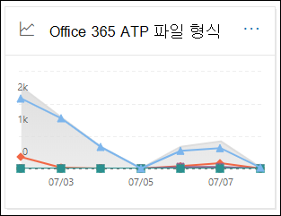

# Office 365 Advanced Threat Protection에 대 한 보고서 보기

[!INCLUDE [Microsoft 365 Defender rebranding](../includes/microsoft-defender-for-office.md)]

Office 365 ATP (Advanced Threat Protection) 조직 (예: Microsoft 365 E5 구독 또는 ATP 계획 1 또는 ATP 계획 2 추가 기능)에는 다양 한 보안 관련 보고서가 포함 되어 있습니다. [필요한 권한이](#what-permissions-are-needed-to-view-the-atp-reports)있는 경우 **보고서** 대시보드로 이동 하 여 보안 & 준수 센터에서 이러한 보고서를 볼 수 있습니다 \> **Dashboard**. 보고서 대시보드로 직접 이동 하려면를 엽니다 <https://protection.office.com/insightdashboard> .

## Advanced Threat Protection 유형 보고서

**Advanced Threat Protection 파일 형식 보고서** 보고서에는 [ATP 안전한 첨부](atp-safe-attachments.md)파일에 의해 악의적으로 검색 된 파일 유형이 표시 됩니다.

 보고서의 집계 보기에서 90 일의 필터링을 허용 하지만 자세히 보기에는 10 일의 필터링만 허용 됩니다.

보고서를 보려면 [보안 & 준수 센터](https://protection.office.com)를 열고 **보고서** \> **대시보드로** 이동한 후 **Office ATP 파일 형식을**선택 합니다. 보고서로 직접 이동 하려면를 엽니다 <https://protection.office.com/reportv2?id=ATPFileReport> .

> [!NOTE]
> [Advanced Threat Protection 메시지 처리 보고서](#advanced-threat-protection-message-disposition-report)에서도이 보고서의 정보를 확인할 수 있습니다.

### Advanced Threat Protection 파일 형식 보고서에 대 한 보고서 보기

다음 보기를 사용할 수 있습니다.

- **데이터 보기 기준: 파일**: 차트에 다음 정보가 포함 되어 있습니다.

  - **악의 있는 Excel 첨부 파일**
  - **악의 있는 Flash 첨부 파일**
  - **악성 PDF 첨부 파일**
  - **악성 PowerPoint 첨부 파일**
  - **악성 Url**
  - **악의 있는 Word 첨부 파일**
  - **악성 실행 첨부 파일**
  - **상대**

  특정 날짜 (데이터 요소)를 가리키면 [ATP 안전한 첨부 파일](atp-safe-attachments.md) 및 [EOP의 맬웨어 방지 보호](anti-malware-protection.md)에서 검색 된 악의적인 파일의 유형을 확인할 수 있습니다.

  

  **필터**를 클릭 하면 다음 필터를 사용 하 여 보고서를 수정할 수 있습니다.

  - **시작 날짜** 및 **끝 날짜**
  - 차트에 표시 되는 것과 동일한 파일 형식 값입니다.

- **데이터 보기 기준: 메시지**: 차트에 다음 정보가 포함 되어 있습니다.

  - **액세스 차단**
  - **대체 되는 메시지**
  - **모니터링 되는 메시지**
  - **동적 전자 메일 배달으로 대체**되었습니다. 자세한 내용은 [동적 배달 및 ATP 안전한 첨부 파일을 사용한 미리 보기](dynamic-delivery-and-previewing.md)를 참조 하세요.

  

  **필터**를 클릭 하면 다음 필터를 사용 하 여 보고서를 수정할 수 있습니다.

  - **시작 날짜** 및 **끝 날짜**
  - 차트에서 사용할 수 있는 메시지 처리 값과 전송 값이 추가 된 **메시지** 입니다.

### Advanced Threat Protection 파일 형식 보고서에 대 한 세부 정보 표 보기

**세부 정보 테이블 보기**를 클릭 하면 보고서에 지난 10 일 동안 조직 내에서 발생 하는 모든 클릭의 거의 실시간 보기가 제공 됩니다. 표시 되는 정보는 현재 보고 있는 차트에 따라 다릅니다.

- **데이터 보기 기준: 파일**:

  - **날짜**
  - **받는 사람 주소**
  - **보낸 사람 주소**
  - **메시지 id**: 메시지 헤더의 **메시지 id** 헤더 필드에서 사용할 수 있으며 고유 해야 합니다. 예를 들면 `<08f1e0f6806a47b4ac103961109ae6ef@server.domain>` 꺾쇠 괄호를 참고 하십시오.
  - **파일**

  **필터**를 클릭 하면 다음 필터를 사용 하 여 보고서를 수정할 수 있습니다.

  - **시작 날짜** 및 **끝 날짜**
  - 차트에 표시 되는 것과 동일한 파일 형식 값입니다.

- **데이터 보기 기준: 메시지**:

  - **날짜**
  - **받는 사람 주소**
  - **보낸 사람 주소**
  - **메시지 ID**
  - **파일**
  - **제목**

  **필터**를 클릭 하면 다음 필터를 사용 하 여 결과를 수정할 수 있습니다.

  - **시작 날짜** 및 **끝 날짜**
  - 차트에서 사용할 수 있는 메시지 처리 값과 전송 값이 추가 된 **메시지** 입니다.

보고서 보기로 돌아가려면 **보고서 보기**를 클릭 합니다.

## Advanced Threat Protection 메시지 폐기 보고서

**ATP 메시지 처리** 보고서에는 악성 콘텐츠가 있는 것으로 검색 된 전자 메일 메시지에 대해 수행 된 작업이 표시 됩니다.

보고서를 보려면 [보안 & 준수 센터](https://protection.office.com)를 열고 **보고서** \> **대시보드로** 이동한 후 **Office ATP 메시지 처리**를 선택 합니다. 보고서로 직접 이동 하려면를 엽니다 <https://protection.office.com/reportv2?id=ATPMessageReport> .

> [!NOTE]
> [Advanced Threat Protection 파일 형식 보고서](#advanced-threat-protection-file-types-report)에서도이 보고서의 정보를 확인할 수 있습니다.

### Advanced Threat Protection 메시지 처리 보고서에 대 한 보고서 보기

다음 보기를 사용할 수 있습니다.

- **데이터 보기 기준: 메시지**: 차트에 다음 정보가 포함 되어 있습니다.

  - **액세스 차단**
  - **대체 되는 메시지**
  - **모니터링 되는 메시지**
  - **동적 전자 메일 배달으로 대체**되었습니다. 자세한 내용은 [동적 배달 및 ATP 안전한 첨부 파일을 사용한 미리 보기](dynamic-delivery-and-previewing.md)를 참조 하세요.

  

  **필터**를 클릭 하면 다음 필터를 사용 하 여 보고서를 수정할 수 있습니다.

  - **시작 날짜** 및 **끝 날짜**
  - 차트에서 사용할 수 있는 메시지 처리 값과 전송 값이 추가 된 **메시지** 입니다.

- **데이터 보기 기준: 파일**: 차트에 다음 정보가 포함 되어 있습니다.

  - **악의 있는 Excel 첨부 파일**
  - **악의 있는 Flash 첨부 파일**
  - **악성 PDF 첨부 파일**
  - **악성 PowerPoint 첨부 파일**
  - **악성 Url**
  - **악의 있는 Word 첨부 파일**
  - **악성 실행 첨부 파일**
  - **상대**

  특정 날짜 (데이터 요소)를 가리키면 [ATP 안전한 첨부 파일](atp-safe-attachments.md) 및 [EOP의 맬웨어 방지 보호](anti-malware-protection.md)에서 검색 된 악의적인 파일의 유형을 확인할 수 있습니다.

  

  **필터**를 클릭 하면 다음 필터를 사용 하 여 보고서를 수정할 수 있습니다.

  - **시작 날짜** 및 **끝 날짜**
  - 차트에 표시 되는 것과 동일한 파일 형식 값입니다.

### Advanced Threat Protection 메시지 처리 보고서에 대 한 세부 정보 표 보기

**세부 정보 테이블 보기**를 클릭 하면 보고서에 지난 10 일 동안 조직 내에서 발생 하는 모든 클릭의 거의 실시간 보기가 제공 됩니다. 표시 되는 정보는 현재 보고 있는 차트에 따라 다릅니다.

- **데이터 보기 기준: 메시지**:

  - **날짜**
  - **받는 사람 주소**
  - **보낸 사람 주소**
  - **메시지 ID**
  - **파일**
  - **제목**

  **필터**를 클릭 하면 다음 필터를 사용 하 여 결과를 수정할 수 있습니다.

  - **시작 날짜** 및 **끝 날짜**
  - 차트에서 사용할 수 있는 메시지 처리 값과 전송 값이 추가 된 **메시지** 입니다.

- **데이터 보기 기준: 파일**:

  - **날짜**
  - **받는 사람 주소**
  - **보낸 사람 주소**
  - **메시지 ID**
  - **파일**

  **필터**를 클릭 하면 다음 필터를 사용 하 여 보고서를 수정할 수 있습니다.

  - **시작 날짜** 및 **끝 날짜**
  - 차트에 표시 되는 것과 동일한 파일 형식 값입니다.

보고서 보기로 돌아가려면 **보고서 보기**를 클릭 합니다.

## 위협 방지 상태 보고서

**위협 방지 상태** 보고서는 EOP ( [Exchange Online Protection](exchange-online-protection-overview.md) ) 및 Office 365 ATP에 의해 감지 되어 차단 된 악의적인 콘텐츠와 악성 전자 메일에 대 한 정보를 함께 가져오는 단일 보기입니다. 자세한 내용은 [Threat protection 상태 보고서](view-email-security-reports.md#threat-protection-status-report)를 참조 하세요.

## URL 위협 방지 보고서

**Url threat protection 보고서** 는 [ATP Safe 링크](atp-safe-links.md)의 일부로 url 클릭에 대해 검색 되는 위협 및 작업에 대 한 요약 및 추세 보기를 제공 합니다. 이 보고서는 적용 된 안전한 링크 정책이 사용자의 클릭으로 **추적 하지 않음** 옵션을 선택한 경우에는 사용자의 데이터를 클릭할 수 없습니다.

보고서를 보려면 [보안 & 준수 센터](https://protection.office.com)를 열고 **보고서** \> **대시보드로** 이동한 후 **URL 보호 보고서**를 선택 합니다. 보고서로 직접 이동 하려면를 엽니다 <https://protection.office.com/reportv2?id=URLProtectionActionReport> .

> [!NOTE]
> 이는 *보호 추세 보고서*로, 데이터가 더 큰 데이터 집합의 추세를 나타냅니다. 따라서 집계 보기의 데이터는 실시간으로 사용할 수 없지만 세부 정보 표 보기의 데이터는 두 보기 간에 약간의 차이가 있을 수 있습니다.

### URL 위협 방지 보고서에 대 한 보고서 보기

**URL threat protection** 보고서에는 최근 90 일 동안의 데이터를 표시 하는 4 시간 마다 한 번씩 새로 고쳐지는 두 가지 보기가 있습니다.

- **URL 보호 작업 클릭**: 조직의 사용자가 클릭 한 URL의 수를 표시 하 고 해당 결과를 선택 합니다.

  - **차단** (사용자가 URL로 이동할 수 없도록 차단 됨)
  - **차단 및 클릭**
  - **검색 중에 클릭**

  클릭은 사용자가 악성 웹 사이트에 대 한 차단 페이지를 클릭 했음을 나타냅니다 (관리자가 안전한 링크 정책에서 클릭을 사용 하지 않도록 설정할 수 있음).

  **필터**를 클릭 하면 다음 필터를 사용 하 여 보고서를 수정할 수 있습니다.

  - **시작 날짜** 및 **끝 날짜**
  - 사용 가능한 클릭 보호 작업과 **허용 되** 는 값 (사용자가 URL로 이동할 수 있음)을 함께 사용할 수 있습니다.

  

- **Url 클릭 응용 프로그램**: OFFICE 365 ATP 안전한 링크를 지 원하는 응용 프로그램에서 클릭 한 url의 수를 표시 합니다.

  - **전자 메일 클라이언트**
  - **PowerPoint**
  - **Word**
  - **Excel**
  - **OneNote**
  - **Visio**
  - **Teams**
  - **기타**

  **필터**를 클릭 하면 다음 필터를 사용 하 여 보고서를 수정할 수 있습니다.

  - **시작 날짜** 및 **끝 날짜**
  - 사용 가능한 응용 프로그램입니다.

### URL 위협 방지 보고서에 대 한 세부 정보 표 보기

**세부 정보 테이블 보기**를 클릭 하면 보고서에서 다음 세부 정보를 사용 하 여 지난 7 일간 조직 내에서 발생 하는 모든 클릭에 대 한 거의 실시간 보기를 제공 합니다.

- **클릭 시간**
- **사용자**
- **URL**
- **작업**
- **앱**

세부 정보 테이블 보기에서 **필터** 를 클릭 하면 보고서 보기에서와 같은 조건과 쉼표로 구분 된 **도메인** 또는 **받는 사람** 을 기준으로 필터링 할 수 있습니다.

보고서 보기로 돌아가려면 **보고서 보기**를 클릭 합니다.

## 볼 수 있는 추가 보고서

이 항목에서 설명 하는 ATP 보고서 외에도 다음 표에 설명 된 것 처럼 다른 몇 가지 보고서를 사용할 수 있습니다.

****

|보고서|항목|
|---|---|
|**탐색기** (atp 계획 2) 또는 **실시간** 검색 (atp 계획 1)|[위협 탐색기 (실시간 검출)](threat-explorer.md)|
|주요 보낸 사람 및 받는 사람 보고서, 스푸핑 메일 보고서, 스팸 감지 보고서 등의 **전자 메일 보안 보고서**|[보안 및 준수 센터의 전자 메일 보안 보고서 보기](view-email-security-reports.md)|
|전달 보고서, 메일 흐름 상태 보고서, 상위 보낸 사람 및 받는 사람 보고서 등의 **메일 흐름 보고서**|[보안 & 준수 센터에서 메일 흐름 보고서 보기](view-mail-flow-reports.md)|
|**ATP 안전한 링크에 대 한 URL 추적** 입니다 (PowerShell에만 해당). 이 cmdlet의 출력은 지난 7 일간의 ATP 안전 링크 작업의 결과를 보여 줍니다.|[Get-UrlTrace](https://docs.microsoft.com/powershell/module/exchange/get-urltrace)|
|**EOP 및 ATP에 대 한 메일 트래픽 결과** (PowerShell 전용) 이 cmdlet의 출력에는 도메인, 날짜, 이벤트 유형, 방향, 동작 및 메시지 수에 대 한 정보가 포함 되어 있습니다.|[MailTrafficATPReport](https://docs.microsoft.com/powershell/module/exchange/get-mailtrafficatpreport)|
|**EOP 및 ATP 검색에 대 한 메일 세부 정보 보고서** (PowerShell 전용). 이 cmdlet의 출력은 악성 파일 또는 Url, 피싱 시도, 가장 및 기타 잠재적 위협 (전자 메일 또는 파일)에 대 한 세부 정보를 포함 합니다.|[MailDetailATPReport](https://docs.microsoft.com/powershell/module/exchange/get-maildetailatpreport)|
|

## ATP 보고서를 표시 하는 데 필요한 사용 권한은 무엇입니까?

이 항목에서 설명 하는 보고서를 보고 사용 하려면 보안 및 ** &amp; 준수 센터와 Exchange 관리 센터 둘 다에 대해 적절 한 역할이 할당 되어 있어야 합니다**.

- 보안 & 준수 센터에는 다음 역할 중 하나가 할당 되어 있어야 합니다.

  - 조직 관리
  - 보안 관리자 (Azure Active Directory 관리 센터에서 할당할 수 [https://aad.portal.azure.com](https://aad.portal.azure.com) 있음)
  - 보안 운영자 (Azure Active Directory 관리 센터에서 할당할 수 [https://aad.portal.azure.com](https://aad.portal.azure.com) 있음)
  - 보안 읽기 권한자

- Exchange Online의 경우 Exchange 관리 센터 ( [https://outlook.office365.com/ecp](https://outlook.office365.com/ecp) ) 또는 PowerShell cmdlet ( [Exchange Online PowerShell](https://docs.microsoft.com/powershell/exchange/exchange-online-powershell)참조)에서 다음 역할 중 하나를 할당 받아야 합니다.

  - 조직 관리
  - 보기 전용 조직 관리
  - 보기 권한만 있는 받는 사람 역할
  - 준수 관리

자세한 내용은 다음 리소스를 참조하세요.

- [보안 및 준수 센터의 사용 권한](permissions-in-the-security-and-compliance-center.md)

- [Exchange Online의 기능 사용 권한](https://docs.microsoft.com/exchange/permissions-exo/feature-permissions)

## 보고서에 데이터가 표시 되지 않으면 어떻게 하나요?

ATP 보고서에 데이터가 표시 되지 않는 경우 정책이 올바르게 설정 되어 있는지 다시 확인 합니다. 조직에 atp 보호 기능을 적용 하려면 atp [안전한 링크 정책](set-up-atp-safe-links-policies.md) 및 [Atp 안전 첨부 파일 정책이](set-up-atp-safe-attachments-policies.md) 정의 되어 있어야 합니다. 또한 [Office 365에서 스팸 방지 및 맬웨어 방지 보호 기능을](anti-spam-and-anti-malware-protection.md)참조 하세요.

## 관련 항목

[보안 및 준수 센터의 스마트 보고서 및 인사이트](reports-and-insights-in-security-and-compliance.md)
  
[역할 권한 (Azure Active Directory](https://docs.microsoft.com/azure/active-directory/users-groups-roles/directory-assign-admin-roles#role-permissions)
