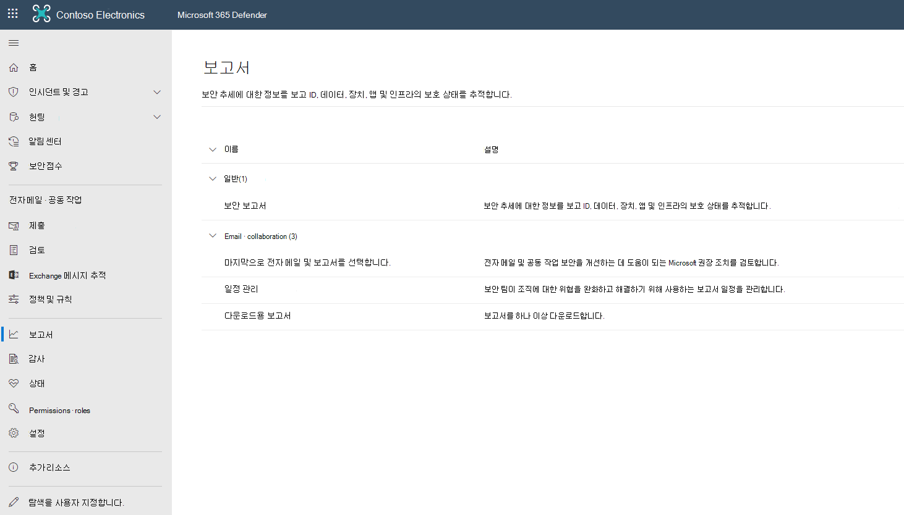
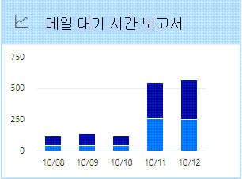
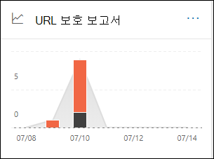
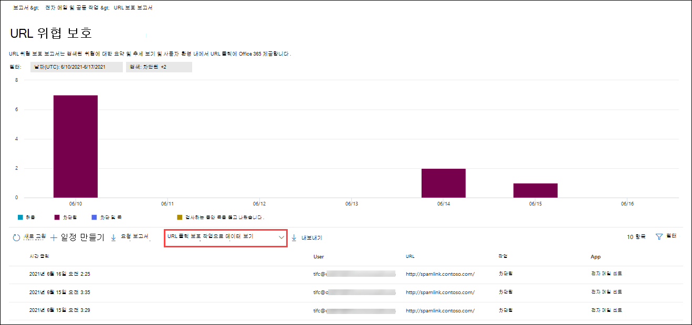
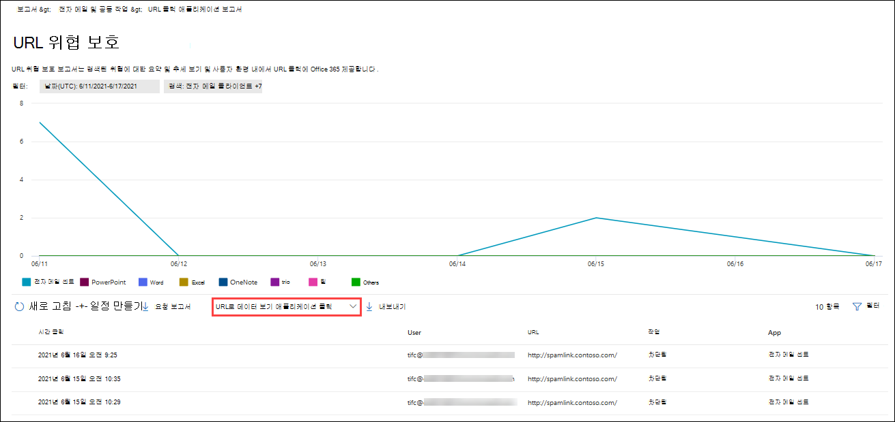

# 검색 포털에서 Office 365 대한 Microsoft 365 Defender 보기

[!INCLUDE [Microsoft 365 Defender rebranding](../includes/microsoft-defender-for-office.md)]

**적용 대상**
- [Office 365용 Microsoft Defender 플랜 1 및 플랜 2](defender-for-office-365.md)
- [Microsoft 365 Defender](../defender/microsoft-365-defender.md)

Office 365 조직용 Microsoft Defender(예: Microsoft 365 E5 구독 또는 Office 365 Plan 1용 Microsoft Defender 또는 Office 365 Plan 2 추가 기능용 Microsoft Defender)에는 다양한 보안 관련 보고서가 포함되어 있습니다. 필요한 권한이 [있는](#what-permissions-are-needed-to-view-the-defender-for-office-365-reports)경우 사이트 포털에서 이러한 보고서를 보고 Microsoft 365 Defender 있습니다.

## 보고서 보기 및 다운로드

### 보고서 보기

1. 보고서 전자 **메일 &** 전자 메일 & \>  \> **보고서로 이동하세요.** 전자 메일 및 공동 작업 **& 페이지로** 직접 이동하기 위해 를 를 를 열 수 <https://security.microsoft.com/emailandcollabreport> 있습니다.

1. 보하려는 보고서를 선택한 다음 세부 정보 보기 **를 선택합니다.**  

### 보고서 다운로드

1. Microsoft 365 Defender 포털에서 **보고서** 전자 메일 서비스 공동 &  >  **로 이동하세요.**

2. 다운로드할 **보고서를 선택합니다.**

> [!NOTE]
>
> 보안에 대해 Defender가 필요하지 Office 365 전자 메일 보안 보고서는 Microsoft 365 Defender 포털의 전자 메일 [보안 보고서 보기에 설명되어 있습니다.](view-email-security-reports.md)
>
> 메일 흐름과 관련된 보고서는 이제 EAC(Exchange 관리 센터)에 있습니다. 이러한 보고서에 대한 자세한 내용은 새 Exchange 관리 센터의 [메일 흐름 보고서를 참조하세요.](/exchange/monitoring/mail-flow-reports/mail-flow-reports)

## 금고 첨부 파일 형식 보고서

> [!NOTE]
> 이 보고서는 사용되지 않습니다. 위협 방지 상태 보고서에서 동일한 [정보를 사용할 수 있습니다.](#threat-protection-status-report)

## 금고 첨부 파일 메시지 처리 보고서

> [!NOTE]
> 이 보고서는 사용되지 않습니다. 위협 방지 상태 보고서에서 동일한 [정보를 사용할 수 있습니다.](#threat-protection-status-report)

## 메일 대기 시간 보고서

메일 **대기 시간 보고서에는** 조직 내에서 경험한 메일 배달 및 확인 대기 시간에 대한 집계 보기가 표시됩니다. 서비스의 메일 배달 시간은 다양한 요인의 영향을 받지만 절대 배달 시간(초)은 성공 또는 문제를 나타내는 좋은 지표가 아닙니다. 하루의 배달 시간이 느리면 다른 날의 평균 배달 시간으로 간주되거나 그 반대의 경우도 마찬가지입니다. 이는 다른 메시지의 관찰된 배달 시간에 대한 통계 데이터를 기반으로 메시지 배달을 한정합니다.

클라이언트 쪽 및 네트워크 대기 시간은 포함되지 않습니다.

보고서를 보시고 Microsoft 365 Defender [포털을](https://security.microsoft.com)열고 보고서  전자 메일 & 공동 작업 전자 메일 & \>  \> **보고서로 이동하세요.** 전자 메일 & **공동** 작업 보고서 페이지에서 메일 대기 시간 보고서를 **찾은** 다음 세부 정보 **보기를 클릭합니다.** 보고서로 직접 이동하기 위해 를 를 <https://security.microsoft.com/mailLatencyReport> 습니다.

메일 대기 **시간 보고서** 페이지에서는 메일 대기 시간 보고서 페이지에서 다음 **탭을 사용할 수** 있습니다.

- **50번째 백분위수:** 메시지 배달 시간의 중간입니다. 이 값은 평균 배달 시간으로 고려할 수 있습니다. 이 탭은 기본적으로 선택되어 있습니다.
- **90번째 백분위수:** 메시지 배달 대기 시간이 길어졌다는 것입니다. 메시지의 10%만 배달하는 데 이 값보다 오래 걸렸다.
- **99번째 백분위수:** 메시지 배달에 대한 가장 높은 대기 시간을 나타냅니다.

선택한 탭에 관계없이 차트에는 다음 범주로 구성된 메시지가 표시됩니다.

- **메일 배달 대기 시간**
- **Detonations**

차트의 범주 위에 마우스를 대면 각 범주의 대기 시간 분석이 표시됩니다.

필터를 **클릭하면** 다음 값으로 차트와 세부 정보 테이블을 필터링할 수 있습니다.

- **날짜(UTC)**: **시작 날짜 및** 종료 **날짜**
- **메시지 보기:** 다음 값 중 하나
  - **모든 메시지**
  - **첨부 파일 또는 URL이 포함된 메시지**
  - **확인된 메시지**

필터 구성을 마치면 **적용,** 취소 또는 필터 **지우기 를 클릭합니다.**

차트 아래의 세부 정보 표에서 다음 정보를 사용할 수 있습니다.

- **날짜(UTC)**
- **백분위수:** **50**, **90** 또는 **99**
- **메시지 수**
- **전체 대기 시간**

주 보고서 페이지에서  **[내보내기](view-email-security-reports.md#export-report)** 단추를 사용할 수 있습니다.

## 위협 방지 상태 보고서

**위협 방지** 상태 보고서는 EOP(Exchange Online Protection) 및 Microsoft Defender에서 검색하고  차단하는 악성 콘텐츠 및 악의적인 전자 메일에 대한 정보를 함께 Office 365. 자세한 내용은 위협 방지 상태 [보고서를 참조하세요.](view-email-security-reports.md#threat-protection-status-report)

## URL 보호 보고서

**URL 보호 보고서는** 검색된 위협에 대한 요약 및 추세 보기와 URL 클릭 시 링크의 [일부로 금고 제공합니다.](safe-links.md) 이 보고서에는 사용자 클릭 추적 안 하도록 옵션을 선택한 금고 링크 정책이 적용된 사용자의 클릭 데이터가 **없습니다.**

보고서를 보시고 Microsoft 365 Defender [포털을](https://security.microsoft.com)열고 보고서  전자 메일 & 공동 작업 전자 메일 & \>  \> **보고서로 이동하세요.** 전자 메일 & **공동 작업 보고서** 페이지에서 URL 보호 페이지를 **찾은** 다음 세부 정보 **보기를 클릭합니다.** 보고서로 직접 이동하기 위해 를 를 <https://security.microsoft.com/reports/URLProtectionActionReport> 습니다.

다음 섹션에서는 **URL** 보호 보고서 페이지에서 사용 가능한 보기에 대한 설명을 제공합니다.

> [!NOTE]
> 이는 데이터가 더 큰 *데이터* 집합의 추세를 나타내는 보호 추세 보고서입니다. 따라서 여기에서 차트의 데이터를 실시간으로 사용할 수 없지만 세부 정보 테이블의 데이터는 있으므로 두 데이터 간에 약간의 불일치가 표시될 수 있습니다. 차트는 4시간마다 한 번씩 새로 고쳐지며 지난 90일 동안의 데이터를 포함하게 됩니다.

### URL 클릭 보호 작업으로 데이터 보기

**URL로 데이터** 보기 보호 작업 보기에는 조직의 사용자가 클릭한 URL 클릭 수와 클릭 결과가 표시됩니다.

- **허용:** 사용자가 URL로 이동할 수 있습니다.
- **차단:** 사용자가 URL로 이동하지 않습니다.
- **차단 및 클릭:** 사용자가 URL로 계속 이동하도록 선택
- **검사 중 클릭:** 검사가 완료되기 전에 사용자가 링크를 클릭한 경우

클릭은 사용자가 악성 웹 사이트로 차단 페이지를 클릭했다는 것을 나타냅니다(관리자는 링크 정책에서 클릭을 금고 수 있습니다).

필터를 **클릭하면** 나타나는 플라이아웃에서 다음 값 중 하나 이상을 선택하여 보고서 및 세부 정보 테이블을 수정할 수 있습니다.

- **날짜(UTC)**: **시작 날짜 및** 종료 **날짜**
- **검색**:
  - **허용됨**
  - **차단됨**
  - **차단 및 클릭**
  - **검사 중 클릭한 기간**
- **도메인**: 보고서 결과에 나열된 URL 도메인입니다.
- **받는 사람**

필터 구성을 마치면 **적용,** 취소 또는 필터 **지우기 를 클릭합니다.**

차트 아래의 세부 정보 표에서는 지난 7일 동안 조직 내에서 발생된 모든 클릭 수에 대해 다음과 같은 거의 실시간 보기를 제공합니다.

- **클릭 시간**
- **사용자**
- **URL**
- **작업**
- **앱**

주 보고서 페이지에서 일정  **[일정 만들기](view-email-security-reports.md#schedule-report)**,  **[보고서 요청](view-email-security-reports.md#request-report)** 및  **[내보내기](view-email-security-reports.md#export-report)** 단추를 사용할 수 있습니다.

### 응용 프로그램으로 클릭한 URL로 데이터 보기

응용 **프로그램 보기에서 URL로 데이터** 보기를 클릭하면 링크가 지원되는 앱의 URL 클릭 금고 표시됩니다.

- **전자 메일 클라이언트**
- **PowerPoint**
- **Word**
- **Excel**
- **OneNote**
- **Visio**
- **Teams**
- **기타**

필터를 **클릭하면** 나타나는 플라이아웃에서 다음 값 중 하나 이상을 선택하여 보고서 및 세부 정보 테이블을 수정할 수 있습니다.

- **날짜(UTC)**: **시작 날짜 및** 종료 **날짜**
- **검색:** 차트에서 사용 가능한 앱입니다.
- **도메인**: 보고서 결과에 나열된 URL 도메인입니다.
- **받는 사람**

필터 구성을 마치면 **적용,** 취소 또는 필터 **지우기 를 클릭합니다.**

차트 아래의 세부 정보 표에서는 지난 7일 동안 조직 내에서 발생된 모든 클릭 수에 대해 다음과 같은 거의 실시간 보기를 제공합니다.

- **클릭 시간**
- **사용자**
- **URL**
- **작업**
- **앱**

주 보고서 페이지에서 일정  **[일정 만들기](view-email-security-reports.md#schedule-report)**,  **[보고서 요청](view-email-security-reports.md#request-report)** 및  **[내보내기](view-email-security-reports.md#export-report)** 단추를 사용할 수 있습니다.

## 볼 추가 보고서

이 문서에 설명된 보고서 외에도 다음 표에 설명된 몇 가지 다른 보고서를 사용할 수 있습니다.

 

****

|보고서|항목|
|---|---|
|**탐색기(Office 365** 계획 2용 Microsoft Defender) 또는 실시간 검색(Office 365 계획 1용 Microsoft Defender) |[위협 탐색기 (실시간 검출)](threat-explorer.md)|
|보안에 Defender가 필요하지 않은 전자 메일 보안 Office 365|[전자 메일 포털에서 전자 메일 Microsoft 365 Defender 보기](view-email-security-reports.md)|
|EAC(Exchange 관리 센터)의 메일 흐름 보고서|[새 관리 센터의 메일 흐름 Exchange 보고서](/exchange/monitoring/mail-flow-reports/mail-flow-reports)|
|

PowerShell 보고 cmdlet:

 

****

|보고서|항목|
|---|---|
|상위 보낸 사람 및 받는 사람|[Get-MailTrafficTopReport](/powershell/module/exchange/get-mailtraffictopreport) 
 [Get-MailTrafficSummaryReport](/powershell/module/exchange/get-mailtrafficsummaryreport)|
|상위 맬웨어|[Get-MailTrafficSummaryReport](/powershell/module/exchange/get-mailtrafficsummaryreport)|
|메일 트래픽|[Get-MailTrafficATPReport](/powershell/module/exchange/get-mailtrafficatpreport) 
 [Get-MailDetailATPReport](/powershell/module/exchange/get-maildetailatpreport)|
|안전한 링크|[Get-SafeLinksAggregateReport](/powershell/module/exchange/get-safelinksaggregatereport) 
 [Get-SafeLinksDetailReport](/powershell/module/exchange/get-safelinksdetailreport)|
|손상된 사용자|[Get-CompromisedUserAggregateReport](/powershell/module/exchange/get-compromiseduseraggregatereport) 
 [Get-CompromisedUserDetailReport](/powershell/module/exchange/get-compromiseduserdetailreport)|
|메일 흐름 상태|[Get-MailflowStatusReport](/powershell/module/exchange/get-mailflowstatusreport)|
|

## 보고서에 대한 Defender를 보는 데 Office 365 권한은 무엇입니까?

이 문서에 설명된 보고서를 보고 사용하려면 Microsoft 365 Defender 포털에서 다음 역할 그룹 중 하나에 Microsoft 365 Defender 합니다.

- **조직 관리**
- **보안 관리자**
- **보안 읽기 권한자**
- **전역 읽기 권한자**

자세한 내용은 [Microsoft 365 Defender 포털 권한](permissions-microsoft-365-security-center.md)을 참조하세요.

**참고:** Azure Active Directory 역할에 사용자를 추가하면 Microsoft 365 관리 센터 포털에서 필요한 사용 권한과 Microsoft 365 Defender 포털의 다른  기능에 대한 사용 권한이 Microsoft 365. 자세한 내용은 [관리자 역할 정보](../../admin/add-users/about-admin-roles.md)를 참조하세요.

## 보고서에 데이터가 표시되지 않는 경우 어떻게 하나요?

보고서에 대한 Defender에 Office 365 없는 경우 정책이 올바르게 설정되어 있는지 다시 한 번 확인합니다. 조직에서 보호 기능을 [금고](set-up-safe-links-policies.md) 수  있도록 금고 링크 정책 및 금고 첨부 파일 정책이 Office 365 있어야 합니다. 또한 스팸 [방지 및 맬웨어 방지 보호를 참조합니다.](anti-spam-and-anti-malware-protection.md)

## 관련 항목

[검색 포털의 스마트 보고서 및 Microsoft 365 Defender 정보](reports-and-insights-in-security-and-compliance.md)

[Azure AD 기본 제공 역할](/azure/active-directory/roles/permissions-reference)
