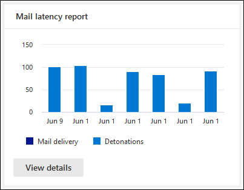

# 보안 및 준수 Office 365 보고서 대시보드에서 & Defender 보기View Defender for Office 365 reports in the Reports dashboard in the Security & Compliance Center

[!INCLUDE [Microsoft 365 Defender rebranding](../includes/microsoft-defender-for-office.md)]

**적용 대상****Applies to**
- [Office 365용 Microsoft Defender 플랜 1 및 플랜 2Microsoft Defender for Office 365 plan 1 and plan 2](defender-for-office-365.md)
- [Microsoft 365 DefenderMicrosoft 365 Defender](../defender/microsoft-365-defender.md)

Office 365 조직용 Microsoft Defender(예: Microsoft 365 E5 구독 또는 Office 365 Plan 1용 Microsoft Defender 또는 Office 365 Plan 2 추가 기능용 Microsoft Defender)에는 다양한 보안 관련 보고서가 포함되어 있습니다.Microsoft Defender for Office 365 organizations (for example, Microsoft 365 E5 subscriptions or Microsoft Defender for Office 365 Plan 1 or Microsoft Defender for Office 365 Plan 2 add-ons) contain a variety of security-related reports. 필요한 사용 권한이 있는 경우 보고서 대시보드로 & 보안 및 준수 센터에서 이러한 보고서를 볼 **수** \> **있습니다.**If you have the [necessary permissions](#what-permissions-are-needed-to-view-the-defender-for-office-365-reports), you can view these reports in the Security & Compliance Center by going to **Reports** \> **Dashboard**. 보고서 대시보드로 직접 이동하기 위해 를 를 <https://protection.office.com/insightdashboard> 습니다.To go directly to the Reports dashboard, open <https://protection.office.com/insightdashboard>.

## Office 365용 Defender 파일 형식 보고서Defender for Office 365 file types report

Defender **for Office 365 파일** 형식 보고서에는 안전한 첨부 파일에서 악성으로 감지된 파일 [형식이 표시됩니다.](safe-attachments.md)The **Defender for Office 365 file types report** report shows you the type of files detected as malicious by [Safe Attachments](safe-attachments.md).

 보고서의 집계 보기는 90일 동안 필터링할 수 있는 반면 세부 정보 보기는 10일 동안의 필터링만 허용합니다.The aggregate view of the report allows for 90 days of filtering, while the detail view only allows for 10 days of filtering.

보고서를 표시하려면 보안 및 준수 [&](https://protection.office.com)를 열고 보고서 대시보드로 이동한 후 파일 형식에 대해  \>  **Office 365 선택합니다.**To view the report, open the [Security & Compliance Center](https://protection.office.com), go to **Reports** \> **Dashboard** and select **Defender for Office 365 file types**. 보고서로 직접 이동하기 위해 를 를 <https://protection.office.com/reportv2?id=ATPFileReport> 습니다.To go directly to the report, open <https://protection.office.com/reportv2?id=ATPFileReport>.

> [!NOTE]
> 이 보고서의 정보는 메시지 처리용 [Defender에서](#defender-for-office-365-message-disposition-report)Office 365 있습니다.The information in this report is also available in the [Defender for Office 365 message disposition report](#defender-for-office-365-message-disposition-report).

### 파일 형식 보고서용 Defender Office 365 보기Report view for the Defender for Office 365 file types report

다음 보기를 사용할 수 있습니다.The following views are available:

- **다음을 통해 데이터 보기: 파일:** 차트에는 다음 정보가 포함되어 있습니다.**View data by: File**: The chart contains the following information:

  - **악의적인 Excel 첨부 파일****Malicious Excel attachments**
  - **악성 플래시 첨부 파일****Malicious Flash attachments**
  - **악성 PDF 첨부 파일****Malicious PDF attachments**
  - **악의적인 PowerPoint 첨부 파일****Malicious PowerPoint attachments**
  - **악의적인 URL****Malicious URLs**
  - **악성 Word 첨부 파일****Malicious Word attachments**
  - **악의적인 실행 첨부 파일****Malicious executable attachments**
  - **기타****Others**

  특정 일(데이터 지점)을 마우스로 마우스로 대면 [EOP의](anti-malware-protection.md)안전 첨부  파일 및 맬웨어 방지 보호에서 검색된 악성 파일 유형의 분석 정보를 볼 수 있습니다.When you hover over a particular day (data point), you can see the breakdown of types of malicious files that were detected by [Safe Attachments](safe-attachments.md) and [anti-malware protection in EOP](anti-malware-protection.md).

  

  필터를 **클릭하면** 다음 필터를 사용하여 보고서를 수정할 수 있습니다.If you click **Filters**, you can modify the report with the following filters:

  - **시작 날짜** 및 **종료 날짜****Start date** and **End date**
  - 차트에 표시되는 동일한 파일 형식 값입니다.The same file type values that are visible in the chart.

- **다음을 통해 데이터 보기: 메시지:** 차트에는 다음 정보가 포함되어 있습니다.**View data by: Message**: The chart contains the following information:

  - **액세스 차단****Block access**
  - **대체된 메시지****Messages replaced**
  - **모니터링된 메시지****Messages monitored**
  - **동적 전자 메일 배달로** 대체: 자세한 내용은 안전 첨부 파일 정책에서 [동적 배달을 참조하세요.](safe-attachments.md#dynamic-delivery-in-safe-attachments-policies)**Replaced by Dynamic Email Delivery**: For more information, see [Dynamic Delivery in Safe Attachments policies](safe-attachments.md#dynamic-delivery-in-safe-attachments-policies).

  

  필터를 **클릭하면** 다음 필터를 사용하여 보고서를 수정할 수 있습니다.If you click **Filters**, you can modify the report with the following filters:

  - **시작 날짜** 및 **종료 날짜****Start date** and **End date**
  - 차트에서 사용할 수 있는 동일한 메시지 처리 값과 추가 메시지 값이 **전달됩니다.**The same message disposition values that are available in the chart, and the additional **Messages passed** value.

### 파일 형식 보고서용 Defender에 대한 Office 365 테이블 보기Details table view for the Defender for Office 365 file types report

세부 정보 표 보기를 클릭하면 보고서에서 지난 10일 동안 조직 내에서 발생된 모든 클릭 수에 대한 거의 실시간 보기를 제공합니다.If you click **View details table**, the report provides a near-real-time view of all clicks that happen within the organization for the last 10 days. 표시되는 정보는 보고 있는 차트에 따라 다를 수 있습니다.The information that's shown depends on the chart you were looking at:

- **데이터 보기: 파일**:**View data by: File**:

  - **날짜****Date**
  - **받는 사람 주소****Recipient address**
  - **보낸 사람 주소****Sender address**
  - **메시지 ID:** 메시지 헤더의 **Message-ID** 헤더 필드에서 사용할 수 있으며 고유해야 합니다.**Message ID**: Available in the **Message-ID** header field in the message header and should be unique. 값을 예로 들 수 `<08f1e0f6806a47b4ac103961109ae6ef@server.domain>` 있습니다(괄호 참고).An example value is `<08f1e0f6806a47b4ac103961109ae6ef@server.domain>` (note the angle brackets).
  - **파일****File**

  필터를 **클릭하면** 다음 필터를 사용하여 보고서를 수정할 수 있습니다.If you click **Filters**, you can modify the report with the following filters:

  - **시작 날짜** 및 **종료 날짜****Start date** and **End date**
  - 차트에 표시되는 동일한 파일 형식 값입니다.The same file type values that are visible in the chart.

- **데이터 보기: 메시지:****View data by: Message**:

  - **날짜****Date**
  - **받는 사람 주소****Recipient address**
  - **보낸 사람 주소****Sender address**
  - **메시지 ID****Message ID**
  - **파일****File**
  - **제목****Subject**

  필터를 **클릭하면** 다음 필터를 사용하여 결과를 수정할 수 있습니다.If you click **Filters**, you can modify the results with the following filters:

  - **시작 날짜** 및 **종료 날짜****Start date** and **End date**
  - 차트에서 사용할 수 있는 동일한 메시지 처리 값과 추가 메시지 값이 **전달됩니다.**The same message disposition values that are available in the chart, and the additional **Messages passed** value.

보고서 보기로 돌아가려면 보고서 **보기 를 클릭합니다.**To get back to the reports view, click **View report**.

## Office 365용 Defender 메시지 처리 보고서Defender for Office 365 message disposition report

**ATP 메시지** 처리 보고서에는 악성 콘텐츠가 있는 것으로 감지된 전자 메일 메시지에 대해 수행된 작업이 표시됩니다.The **ATP Message Disposition** report shows you the actions that were taken for email messages that were detected as having malicious content.

보고서를 확인하려면 보안 및 준수 [&](https://protection.office.com)를 열고 보고서 대시보드로 이동하여 메시지 처리에 대한  \>  **Office 365 선택합니다.**To view the report, open the [Security & Compliance Center](https://protection.office.com), go to **Reports** \> **Dashboard** and select **Defender for Office 365 message disposition**. 보고서로 직접 이동하기 위해 를 를 <https://protection.office.com/reportv2?id=ATPMessageReport> 습니다.To go directly to the report, open <https://protection.office.com/reportv2?id=ATPMessageReport>.

> [!NOTE]
> 이 보고서의 정보는 파일 형식 보고서의 [Defender에서 Office 365 있습니다.](#defender-for-office-365-file-types-report)The information in this report is also available in the [Defender for Office 365 file types report](#defender-for-office-365-file-types-report).

### 메시지 처리 보고서에 대한 Defender Office 365 보기Report view for the Defender for Office 365 message disposition report

다음 보기를 사용할 수 있습니다.The following views are available:

- **다음을 통해 데이터 보기: 메시지:** 차트에는 다음 정보가 포함되어 있습니다.**View data by: Message**: The chart contains the following information:

  - **액세스 차단****Block access**
  - **대체된 메시지****Messages replaced**
  - **모니터링된 메시지****Messages monitored**
  - **동적 전자 메일 배달로** 대체: 자세한 내용은 안전 첨부 파일 정책에서 [동적 배달을 참조하세요.](safe-attachments.md#dynamic-delivery-in-safe-attachments-policies)**Replaced by Dynamic Email Delivery**: For more information, see [Dynamic Delivery in Safe Attachments policies](safe-attachments.md#dynamic-delivery-in-safe-attachments-policies).

  

  필터를 **클릭하면** 다음 필터를 사용하여 보고서를 수정할 수 있습니다.If you click **Filters**, you can modify the report with the following filters:

  - **시작 날짜** 및 **종료 날짜****Start date** and **End date**
  - 차트에서 사용할 수 있는 동일한 메시지 처리 값과 추가 메시지 값이 **전달됩니다.**The same message disposition values that are available in the chart, and the additional **Messages passed** value.

- **다음을 통해 데이터 보기: 파일:** 차트에는 다음 정보가 포함되어 있습니다.**View data by: File**: The chart contains the following information:

  - **악의적인 Excel 첨부 파일****Malicious Excel attachments**
  - **악성 플래시 첨부 파일****Malicious Flash attachments**
  - **악성 PDF 첨부 파일****Malicious PDF attachments**
  - **악의적인 PowerPoint 첨부 파일****Malicious PowerPoint attachments**
  - **악의적인 URL****Malicious URLs**
  - **악성 Word 첨부 파일****Malicious Word attachments**
  - **악의적인 실행 첨부 파일****Malicious executable attachments**
  - **기타****Others**

  특정 일(데이터 지점)을 마우스로 마우스로 대면 [EOP의](anti-malware-protection.md)안전 첨부  파일 및 맬웨어 방지 보호에서 검색된 악성 파일 유형의 분석 정보를 볼 수 있습니다.When you hover over a particular day (data point), you can see the breakdown of types of malicious files that were detected by [Safe Attachments](safe-attachments.md) and [anti-malware protection in EOP](anti-malware-protection.md).

  

  필터를 **클릭하면** 다음 필터를 사용하여 보고서를 수정할 수 있습니다.If you click **Filters**, you can modify the report with the following filters:

  - **시작 날짜** 및 **종료 날짜****Start date** and **End date**
  - 차트에 표시되는 동일한 파일 형식 값입니다.The same file type values that are visible in the chart.

### 메시지 처리 보고서에 대한 Defender에 대한 Office 365 테이블 보기Details table view for the Defender for Office 365 message disposition report

세부 정보 표 보기를 클릭하면 보고서에서 지난 10일 동안 조직 내에서 발생된 모든 클릭 수에 대한 거의 실시간 보기를 제공합니다.If you click **View details table**, the report provides a near-real-time view of all clicks that happen within the organization for the last 10 days. 표시되는 정보는 보고 있는 차트에 따라 다를 수 있습니다.The information that's shown depends on the chart you were looking at:

- **데이터 보기: 메시지:****View data by: Message**:

  - **날짜****Date**
  - **받는 사람 주소****Recipient address**
  - **보낸 사람 주소****Sender address**
  - **메시지 ID****Message ID**
  - **파일****File**
  - **제목****Subject**

  필터를 **클릭하면** 다음 필터를 사용하여 결과를 수정할 수 있습니다.If you click **Filters**, you can modify the results with the following filters:

  - **시작 날짜** 및 **종료 날짜****Start date** and **End date**
  - 차트에서 사용할 수 있는 동일한 메시지 처리 값과 추가 메시지 값이 **전달됩니다.**The same message disposition values that are available in the chart, and the additional **Messages passed** value.

- **데이터 보기: 파일**:**View data by: File**:

  - **날짜****Date**
  - **받는 사람 주소****Recipient address**
  - **보낸 사람 주소****Sender address**
  - **메시지 ID****Message ID**
  - **파일****File**

  필터를 **클릭하면** 다음 필터를 사용하여 보고서를 수정할 수 있습니다.If you click **Filters**, you can modify the report with the following filters:

  - **시작 날짜** 및 **종료 날짜****Start date** and **End date**
  - 차트에 표시되는 동일한 파일 형식 값입니다.The same file type values that are visible in the chart.

보고서 보기로 돌아가려면 보고서 **보기 를 클릭합니다.**To get back to the reports view, click **View report**.

## 메일 대기 시간 보고서Mail latency report

메일 **대기 시간 보고서에는** 조직 내에서 경험한 메일 배달 및 확인 대기 시간에 대한 집계 보기가 표시됩니다.The **Mail latency report** shows you an aggregate view of the mail delivery and detonation latency experienced within your organization. 서비스의 메일 배달 시간은 다양한 요인의 영향을 받지만 절대 배달 시간(초)은 성공 또는 문제를 나타내는 좋은 지표가 아닙니다.Mail delivery times in the service are affected by a number of factors, and the absolute delivery time in seconds is often not a good indicator of success or a problem. 하루의 배달 시간이 느리면 다른 날의 평균 배달 시간으로 간주되거나 그 반대의 경우도 마찬가지입니다.A slow delivery time on one day might be considered an average delivery time on another day, or vice-versa. 메일 **대기 시간 보고서는** 다른 메시지의 관찰된 배달 시간에 대한 통계 데이터를 기반으로 메시지 배달을 한정합니다.The **Mail latency report** tries to qualify message delivery based on statistical data about the observed delivery times of other messages:

- **50번째 백분위수:** 메시지 배달 시간의 중간입니다.**50th percentile**: This is the middle for message delivery times. 이 값은 평균 배달 시간으로 고려할 수 있습니다.You can consider this value as an average delivery time.
- **90번째 백분위수:** 메시지 배달 대기 시간이 길어졌다는 것입니다.**90th percentile**: This indicates a high latency for message delivery. 메시지의 10%만 배달하는 데 이 값보다 오래 걸렸다.Only 10% of messages took longer than this value to deliver.
- **99번째 백분위수:** 메시지 배달에 대한 가장 높은 대기 시간을 나타냅니다.**99th percentile**: This indicates the highest latency for message delivery.

클라이언트 쪽 및 네트워크 대기 시간은 포함되지 않습니다.Client side and network latency are not included.

보고서를 확인하려면 보안 및 준수 & 를 열고 보고서 [대시보드로](https://protection.office.com)이동하여 메일 대기  \>  시간 **보고서를 선택합니다.**To view the report, open the [Security & Compliance Center](https://protection.office.com), go to **Reports** \> **Dashboard** and select **Mail latency report**. 보고서로 직접 이동하기 위해 를 를 <https://protection.office.com/mailLatencyReport?viewid=P50> 습니다.To go directly to the report, open <https://protection.office.com/mailLatencyReport?viewid=P50>.

### 메일 대기 시간 보고서에 대 한 보고서 보기Report view for the Mail latency report

보고서를 열면 기본적으로 **50번째** 백분위수 탭이 선택됩니다.When you open the report, the **50th percentiles** tab is selected by default.

기본적으로 이 보기에는 다음 필터로 구성된 차트가 포함되어 있습니다.By default, this view contains a chart that's configured with the following filters:

- **날짜:** 지난 7일**Date**: The last 7 days
- **메시지 보기**:**Message View**:
  - 확인된 메시지Detonated messages

이 차트에는 다음 범주로 구성된 메시지가 표시됩니다.This chart shows messages organized into the following categories:

- **메일 배달 대기 시간****Mail delivery latency**
- **데스토니아 대기 시간****Detonation latency**

차트의 범주 위에 마우스를 대면 각 범주의 대기 시간 분석이 표시됩니다.When you hover over a category in the chart, you can see a breakdown of the latency in each category.

보고서 보기에서 **필터를** 클릭하면 다음 필터를 사용하여 결과를 수정할 수 있습니다.If you click **Filter** in the report view, you can modify the results with the following filters:

- 모든 메시지All messages
- 첨부 파일 또는 URL이 포함된 메시지Messages that contain attachments or URLs

**90번째** 백분위수 탭 또는 **99번째** 백분위수 탭을 클릭하면 **50번째** 백분위수 보기의 동일한 기본 필터가 사용됩니다.If you click the **90th percentiles** tab or the **99th percentiles** tab, the same default filters from the **50th percentiles** view are used.

### 메일 대기 시간 보고서에 대한 세부 정보 테이블 보기Details table view for the Mail latency report

세부 정보 테이블 보기에는 다음 정보가 표시됩니다.The following information is shown in the details table view:

- **날짜****Date**
- **백분위수****Percentiles**
- **메시지 수****Message count**
- **전체 대기 시간****Overall latency**

위의 예는 11월 14일 배달 및 확인된 모든 메시지의 평균 대기 시간이 **108.033초인 것으로 나타났습니다.**The above shows that on November 14 the average latency experienced for all messages delivered and detonated was **108.033** seconds.

세부 정보 표에는 각 탭에서 동일한 정보가 포함되어 있습니다.The details table contains the same information on each tab.

## 위협 방지 상태 보고서Threat protection status report

**위협 방지** 상태 보고서는 EOP(Exchange Online Protection) 및 Microsoft Defender에서 검색하고  차단하는 악성 콘텐츠 및 악의적인 전자 메일에 대한 정보를 함께 Office 365.The **Threat protection status** report is a single view that brings together information about malicious content and malicious email detected and blocked by [Exchange Online Protection](exchange-online-protection-overview.md) (EOP) and Microsoft Defender for Office 365. 자세한 내용은 위협 방지 상태 [보고서를 참조하세요.](view-email-security-reports.md#threat-protection-status-report)For more information, see [Threat protection status report](view-email-security-reports.md#threat-protection-status-report).

## URL 위협 방지 보고서URL threat protection report

**URL 위협 방지 보고서는** 검색된 위협에 대한 요약 및 추세 보기와 안전한 링크의 일부로 URL 클릭 시 [수행되는 작업을 제공합니다.](safe-links.md)The **URL threat protection report** provides summary and trend views for threats detected and actions taken on URL clicks as part of [Safe Links](safe-links.md). 이 보고서에는 적용된 안전 링크 정책에 사용자  클릭 추적 안 하도록 옵션을 선택한 사용자의 클릭 데이터가 없습니다.This report will not have click data from users where the Safe Links policy applied has the **Do not track user clicks** option selected.

보고서를 확인하려면 보안 및 준수 & 를  열고 보고서 [대시보드로](https://protection.office.com)이동하여 URL 보호 \>  **보고서를 선택합니다.**To view the report, open the [Security & Compliance Center](https://protection.office.com), go to **Reports** \> **Dashboard** and select **URL protection report**. 보고서로 직접 이동하기 위해 를 를 <https://protection.office.com/reportv2?id=URLProtectionActionReport> 습니다.To go directly to the report, open <https://protection.office.com/reportv2?id=URLProtectionActionReport>.

> [!NOTE]
> 이는 데이터가 더 큰 *데이터* 집합의 추세를 나타내는 보호 추세 보고서입니다.This is a *protection trend report*, meaning data represents trends in a larger dataset. 따라서 여기에서 집계 보기의 데이터를 실시간으로 사용할 수 없지만 세부 정보 테이블 보기의 데이터는 있으므로 두 보기 간에 약간의 불일치가 표시될 수 있습니다.As a result, the data in the aggregate view is not available in real time here, but the data in the details table view is, so you may see a slight discrepancy between the two views.

### URL 위협 방지 보고서에 대한 보고서 보기Report view for the URL threat protection report

**URL 위협 방지** 보고서에는 지난 90일 동안의 데이터를 표시하는 4시간마다 새로 고쳐진 두 개의 집계 보기가 있습니다.The **URL threat protection** report has two aggregated views that are refreshed once every four hours that shows data for the last 90 days:

- **URL 클릭 보호 작업:** 조직의 사용자가 클릭한 URL 클릭 수와 클릭 결과를 보여줍니다.**URL click protection action**: Shows the number of URL clicks by users in the organization and the results of the click:

  - **차단(사용자가** URL로 이동하지 차단)**Blocked** (the user was blocked from navigating to the URL)
  - **차단 및 클릭(사용자가** URL로 계속 이동하도록 선택)**Blocked and clicked through** (the user has chosen to continue navigating to the URL)
  - **검사 중 클릭(검사가** 완료되기 전에 사용자가 링크를 클릭한 경우)**Clicked through during scan** (the user has clicked on the link before the scan was complete)

  클릭은 사용자가 차단 페이지를 통해 악성 웹 사이트로 이동했다는 것을 나타냅니다(관리자는 안전한 링크 정책에서 클릭을 사용하지 않도록 설정할 수 있습니다).A click indicates that the user has clicked through the block page to the malicious website (admins can disable click through in Safe Links policies).

  필터를 **클릭하면** 다음 필터를 사용하여 보고서를 수정할 수 있습니다.If you click **Filters**, you can modify the report with the following filters:

  - **시작 날짜** 및 **종료 날짜****Start date** and **End date**
  - 사용 가능한 클릭 보호 작업과 허용되는 값(사용자가 URL로 이동할 수 있습니다.) The available click protection actions, plus the value **Allowed** (the user was allowed to navigate to the URL).

  

- **응용 프로그램으로 URL** 클릭: 안전한 링크를 지원하는 응용 프로그램의 URL 클릭 수를 보여줍니다.**URL click by application**: Shows the number of URL clicks by applications that support Safe Links:

  - **전자 메일 클라이언트****Email client**
  - **PowerPoint****PowerPoint**
  - **Word****Word**
  - **Excel****Excel**
  - **OneNote****OneNote**
  - **Visio****Visio**
  - **Teams****Teams**
  - **기타****Other**

  필터를 **클릭하면** 다음 필터를 사용하여 보고서를 수정할 수 있습니다.If you click **Filters**, you can modify the report with the following filters:

  - **시작 날짜** 및 **종료 날짜****Start date** and **End date**
  - 사용 가능한 응용 프로그램.The available applications.

### URL 위협 방지 보고서에 대한 세부 정보 테이블 보기Details table view for the URL threat protection report

세부 정보 표 보기를 클릭하면 보고서에서 다음 세부 정보가 있는 지난 7일 동안 조직 내에서 발생된 모든 클릭에 대한 거의 실시간 보기를 제공합니다.If you click **View details table**, the report provides a near-real-time view of all clicks that happen within the organization for the last 7 days with the following details:

- **클릭 시간****Click time**
- **사용자****User**
- **URL****URL**
- **작업****Action**
- **앱****App**

세부 정보 테이블 보기에서 **필터를** 클릭하면 보고서 보기와 동일한 조건에 따라 필터링할 수  있으며, 또한 도메인 또는 받는 사람을 각 MA로 구분하여 필터링할 수 있습니다. If you click **Filters** in the details table view, you can filter by the same criteria as in the report view, and also by **Domains** or **Recipients** separated by commas.

> [!NOTE]
> 도메인 **필터는** 보고서 결과에 나열된 URL 도메인을 참조합니다.The **Domains** filter refers to the URL domain listed in the report results. 

보고서 보기로 돌아가려면 보고서 **보기 를 클릭합니다.**To get back to the reports view, click **View report**.

## 볼 추가 보고서Additional reports to view

이 문서에 설명된 보고서 외에도 다음 표에 설명된 몇 가지 다른 보고서를 사용할 수 있습니다.In addition to the reports described in this article, several other reports are available, as described in the following table:

****

|보고서Report|항목Topic|
|---|---|
|**탐색기(Office 365** 계획 2용 Microsoft Defender) 또는 실시간 검색(Office 365 계획 1용 Microsoft Defender) **Explorer** (Microsoft Defender for Office 365 Plan 2) or **real-time detections** (Microsoft Defender for Office 365 Plan 1)|[위협 탐색기 (실시간 검출)Threat Explorer (and real-time detections)](threat-explorer.md)|
|**전자 메일 보안 보고서(** 예: 상위 보낸 사람 및 받는 사람 보고서, 스푸핑 메일 보고서 및 스팸 검색 보고서)**Email security reports**, such as the Top senders and recipients report, the Spoof mail report, and the Spam detections report.|[보안 및 준수 센터의 전자 메일 보안 보고서 보기View email security reports in the Security & Compliance Center](view-email-security-reports.md)|
|**메일 흐름 보고서(** 예: 전달 보고서, 메일 흐름 상황 보고서 및 최상위 보낸 사람 및 받는 사람 보고서)**Mail flow reports**, such as the Forwarding report, the Mailflow status report, and the Top senders and recipients report.|[보안 및 준수 센터에서 & 흐름 보고서 보기View mail flow reports in the Security & Compliance Center](view-mail-flow-reports.md)|
|**안전한 링크에 대한 URL** 추적(PowerShell만 해당).**URL trace for Safe Links** (PowerShell only). 이 cmdlet의 출력은 지난 7일 동안의 안전 링크 작업 결과를 보여줍니다.The output of this cmdlet shows you the results of Safe Links actions over the past seven days.|[Get-UrlTraceGet-UrlTrace](/powershell/module/exchange/get-urltrace)|
|**EOP 및 Microsoft Defender for Office 365** 메일 트래픽 결과(PowerShell에만 해당)**Mail traffic results for EOP and Microsoft Defender for Office 365** (PowerShell only). 이 cmdlet의 출력에는 Domain, Date, Event Type, Direction, Action 및 Message Count에 대한 정보가 포함되어 있습니다.The output of this cmdlet contains information about Domain, Date, Event Type, Direction, Action, and Message Count.|[Get-MailTrafficATPReportGet-MailTrafficATPReport](/powershell/module/exchange/get-mailtrafficatpreport)|
|**전자 메일 검색에 대한 EOP 및 Defender에 대한 Office 365 보고서입니다(PowerShell에만** 해당).**Mail detail reports for EOP and Defender for Office 365 detections** (PowerShell only). 이 cmdlet의 출력에는 악성 파일 또는 URL, 피싱 시도, 가장 및 전자 메일 또는 파일의 기타 잠재적 위협에 대한 세부 정보가 포함되어 있습니다.The output of this cmdlet contains details about malicious files or URLs, phishing attempts, impersonation, and other potential threats in email or files.|[Get-MailDetailATPReportGet-MailDetailATPReport](/powershell/module/exchange/get-maildetailatpreport)|
|

## 보고서에 대한 Defender를 보는 데 Office 365 권한은 무엇입니까?What permissions are needed to view the Defender for Office 365 reports?

이 문서에 설명된 보고서를 보고 사용하려면 Security & Compliance Center에서 다음 역할 그룹 중 하나에 & 합니다.In order to view and use the reports described in this article, you need to be a member of one of the following role groups in the Security & Compliance Center:

- **조직 관리****Organization Management**
- **보안 관리자****Security Administrator**
- **보안 읽기 권한자****Security Reader**
- **전역 읽기 권한자****Global Reader**

자세한 내용은 [보안 및 준수 센터의 사용 권한](permissions-in-the-security-and-compliance-center.md)을 참조하세요.For more information, see [Permissions in the Security & Compliance Center](permissions-in-the-security-and-compliance-center.md).

**참고:** Microsoft 365 관리 센터에서 해당 Azure Active Directory 역할에 사용자를 추가하면 사용자에게 보안 & 준수 센터에서  필요한 사용 권한과 Microsoft 365.**Note**: Adding users to the corresponding Azure Active Directory role in the Microsoft 365 admin center gives users the required permissions in the Security & Compliance Center _and_ permissions for other features in Microsoft 365. 자세한 내용은 [관리자 역할 정보](../../admin/add-users/about-admin-roles.md)를 참조하세요.For more information, see [About admin roles](../../admin/add-users/about-admin-roles.md).

## 보고서에 데이터가 표시되지 않는 경우 어떻게 하나요?What if the reports aren't showing data?

보고서에 대한 Defender에 Office 365 없는 경우 정책이 올바르게 설정되어 있는지 다시 한 번 확인합니다.If you are not seeing data in your Defender for Office 365 reports, double-check that your policies are set up correctly. 조직에서 보호 [기능을](set-up-safe-links-policies.md) 적용하려면 Defender가 안전한 링크 정책 및 안전한 첨부 Office 365 있어야 합니다. Your organization must have [Safe Links policies](set-up-safe-links-policies.md) and [Safe Attachments policies](set-up-safe-attachments-policies.md) defined in order for Defender for Office 365 protection to be in place. 또한 스팸 [방지 및 맬웨어 방지 보호를 참조합니다.](anti-spam-and-anti-malware-protection.md)Also see [Anti-spam and anti-malware protection](anti-spam-and-anti-malware-protection.md).

## 관련 항목Related topics

[보안 및 준수 센터의 스마트 보고서 및 인사이트Smart reports and insights in the Security & Compliance Center](reports-and-insights-in-security-and-compliance.md)

[역할 권한(Azure Active DirectoryRole permissions (Azure Active Directory](/azure/active-directory/users-groups-roles/directory-assign-admin-roles#role-permissions)
