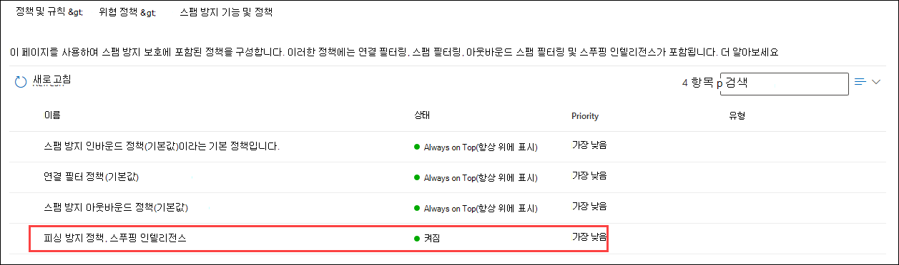
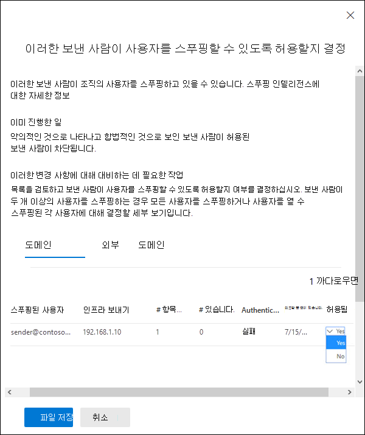
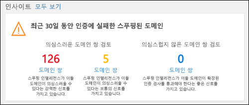
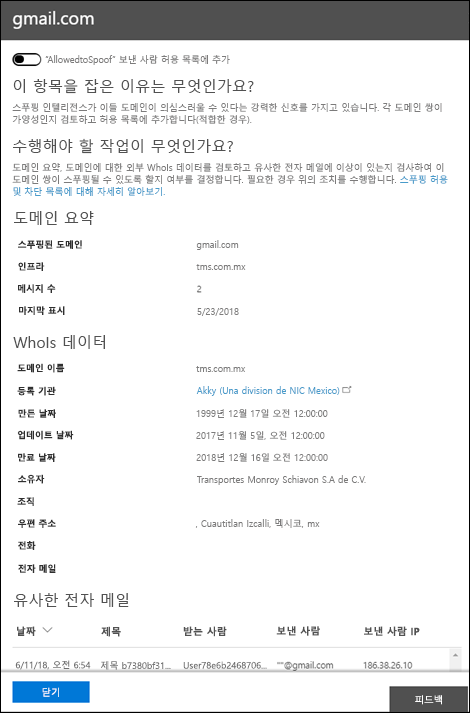

# <a name="manage-spoofed-senders-using-the-spoof-intelligence-policy-and-spoof-intelligence-insight-in-eop"></a>EOP에서 스푸핑 인텔리전스 정책 및 스푸핑 인텔리전스 인사이트를 사용하여 스푸핑된 보낸 사람 관리

[!INCLUDE [Microsoft 365 Defender rebranding](../includes/microsoft-defender-for-office.md)]

**적용 대상**
- [Office 365용 Microsoft Defender 플랜 1 및 플랜 2](defender-for-office-365.md)
- [Microsoft 365 Defender](../defender/microsoft-365-defender.md)

> [!IMPORTANT]
> 이 문서에서는 대체되는 이전 스푸핑된 보낸 사람 관리 환경(스팸 방지 정책 페이지의 스푸핑 **인텔리전스** 정책)에 **대해** 설명합니다. 새 환경(테넌트 허용/차단 목록의 스푸핑 탭)에 대한 자세한 내용은 [EOP의 스푸핑 인텔리전스 인사이트를 참조하세요.](learn-about-spoof-intelligence.md) 

Microsoft 365 사서함이 없는 Exchange Online 또는 EOP(독립 실행형 Exchange Online Protection) 조직에서 인바운드 전자 메일 메시지는 Exchange Online 2018년 10월부로 EOP의 스푸핑으로부터 자동으로 보호됩니다. EOP는 피싱에 **대한** 조직의 전반적인 방어의 일부로 스푸핑 인텔리전스를 사용 합니다. 자세한 내용은 EOP의 스푸핑 방지 보호 [기능을 참조하세요.](anti-spoofing-protection.md)

기본(유일한)  스푸핑 인텔리전스 정책은 합법적인 보낸 사람이 보낸 스푸핑된 전자 메일이 스팸 또는 피싱 공격으로부터 사용자를 보호하면서 EOP 스팸 필터에 걸려오지 않도록 하는 데 도움이 됩니다. 또한 스푸핑  인텔리전스 정보를 사용하여 외부 보낸 사람이 사용자에게 합법적으로 확인되지 않은 전자 메일(SPF, DKIM 또는 DMARC 검사를 통과하지 않은 도메인의 메시지)을 빠르게 보낼 수 있습니다.

Microsoft 365 Defender 포털 또는 Exchange Online 사서함이 있는 Microsoft 365 조직의 경우 PowerShell(Exchange Online PowerShell, Exchange Online 사서함이 없는 조직의 독립 실행형 EOP PowerShell)에서 스푸핑 인텔리전스를 관리할 Exchange Online 있습니다.

## <a name="what-do-you-need-to-know-before-you-begin"></a>시작하기 전에 알아야 할 내용은 무엇인가요?

- <https://security.microsoft.com>에서 Microsoft 365 Defender 포털을 엽니다.
  - **스팸 방지 정책** 페이지로 직접 이동하려면 <https://security.microsoft.com/antispam>을(를) 사용합니다.

- Exchange Online PowerShell에 연결하려면 [Exchange Online PowerShell에 연결](/powershell/exchange/connect-to-exchange-online-powershell)을 참조하세요. 독립 실행형 EOP PowerShell에 연결하려면 [Exchange Online Protection PowerShell에 연결](/powershell/exchange/connect-to-exchange-online-protection-powershell)을 참조하세요.

- 이 게시물의 절차를 수행하려면 먼저 **Exchange Online** 에서 사용 권한을 할당받아야 합니다.
  - 스푸핑 인텔리전스 정책을 수정하거나 스푸핑 인텔리전스를 사용하거나  사용하지 않도록 설정하려면 조직 관리 또는 보안 관리자 역할 그룹의 **구성원이** 되어야 합니다.
  - 스푸핑 인텔리전스 정책에 대한 읽기 전용 액세스 권한을  사용하려면 전역 읽기 사용자 또는 보안 읽기 권한이 있는 역할 그룹의 **구성원이** 해야 합니다.

  자세한 내용은 [Exchange Online의 사용 권한](/exchange/permissions-exo/permissions-exo)을 참조하세요.

  **참고**:

  - Microsoft 365 관리 센터의 해당 Azure Active Directory 역할에 사용자를 추가하면 사용자에게 필요한 권한 _및_ Microsoft 365의 다른 기능에 대한 권한이 부여됩니다. 자세한 내용은 [관리자 역할 정보](../../admin/add-users/about-admin-roles.md)를 참조하세요.
  - [Exchange Online](/Exchange/permissions-exo/permissions-exo#role-groups)의 **보기 전용 조직 관리** 역할 그룹도 기능에 대한 읽기 전용 권한을 부여합니다.

- 스푸핑 인텔리전스에 대한 옵션은 피싱 방지 정책의 스푸핑 설정에 [설명되어 있습니다.](set-up-anti-phishing-policies.md#spoof-settings)

- 피싱 방지 정책에서 스푸핑 인텔리전스 설정을 사용하도록 설정, 비활성화 및 구성할 수 있습니다. 구독에 기반한 지침은 다음 항목 중 하나를 참조하세요.

  - [EOP에서 피싱 방지 정책을 구성합니다.](configure-anti-phishing-policies-eop.md)
  - [Microsoft Defender에서](configure-mdo-anti-phishing-policies.md)피싱 방지 정책을 Office 365.

- 스푸핑 인텔리전스에 대한 권장 설정은 EOP 피싱 방지 정책 [설정을 참조하세요.](recommended-settings-for-eop-and-office365.md#eop-anti-phishing-policy-settings)

## <a name="manage-spoofed-senders"></a>스푸핑된 보낸 사람 관리

스푸핑된 보낸 사람은 다음 두 가지 방법으로 허용하고 차단할 수 있습니다.

- [스푸핑 인텔리전스 정책 사용](#manage-spoofed-senders-in-the-spoof-intelligence-policy)
- [스푸핑 인텔리전스 인사이트 사용](#manage-spoofed-senders-in-the-spoof-intelligence-insight)

### <a name="manage-spoofed-senders-in-the-spoof-intelligence-policy"></a>스푸핑 인텔리전스 정책에서 스푸핑된 보낸 사람 관리

> [!IMPORTANT]
> 이 문서에서는 대체되는 이전 스푸핑된 보낸 사람 관리 환경(스팸 방지 정책 페이지의 스푸핑 **인텔리전스** 정책)에 **대해** 설명합니다. 새 환경(테넌트 허용/차단 목록의 스푸핑 탭)에 대한 자세한 내용은 [EOP의 스푸핑 인텔리전스 인사이트를 참조하세요.](learn-about-spoof-intelligence.md) 

1. Microsoft 365 Defender 포털의 **정책** 섹션에서 **전자 메일 및 공동 작업**\>**정책 및 규칙**\>**위협 정책**\>**스팸 방지** 로 이동합니다.

2. 스팸 **방지 정책 페이지에서** 이름을  클릭하여 스푸핑 인텔리전스 정책을 선택합니다.

   

3. 나타나는 **스푸핑** 인텔리전스 정책 플라이아웃에서 다음 중 하나를 선택합니다.
   - **이미 검토한 보낸 사람 표시**
   - **새 보낸 사람 검토**

4. 보낸 **사람이** 나타나는 사용자 플라이아웃을 스푸핑할 수 있도록 허용할지 결정에서 다음 탭 중 하나를 선택합니다.
   - **도메인:** 보낸 사람이 내부 도메인의 사용자를 스푸핑합니다.
   - **외부 도메인:** 보낸 사람이 외부 도메인의 사용자를 스푸핑합니다.

5. 확장  스푸핑 허용 **여부 열에서** 다음 중 하나를 선택합니다.
   - **예:** 스푸핑된 보낸 사람 허용.
   - **아니요:** 메시지를 스푸핑으로 표시 이 작업은 기본 피싱 방지 정책 또는 사용자 지정 피싱 방지 정책에 의해 제어됩니다. 자세한 내용은 [피싱 방지 정책의 스푸핑 설정](set-up-anti-phishing-policies.md#spoof-settings)을 참조하세요.

   

   다음 목록에는 열과 값이 설명됩니다.

   - **스푸핑된 사용자:** 스푸핑되는 사용자 계정입니다. 전자 메일 클라이언트에 표시된 보낸 사람 주소(주소라고도 알려지음)의 메시지 보낸 `5322.From` 사람입니다. SPF에서 이 주소의 유효성을 확인하지 않습니다.
     - 도메인 **탭에서** 값에 단일 전자 메일 주소가 포함되어 있습니다. 또는 원본 전자 메일 서버가 여러 사용자 계정을 스푸핑하는 경우 이 값에는 두 개 **이상이 포함되어 있습니다.**
     - 외부 **도메인 탭의** 값에는 스푸핑된 사용자의 도메인이 포함되어 있습니다.

   - **보내는 인프라:** 원본 전자 메일 서버의 IP 주소에 대한 역방향 DNS 검색(PTR 레코드)에 있는 도메인입니다. 원본 IP 주소에 PTR 레코드가 없는 경우 보내는 인프라는 \<source IP\> /24(예: 192.168.100.100/24)로 식별됩니다.

     메시지 원본 및 메시지 보낸 사람에 대한 자세한 내용은 전자 메일 메시지 표준 [개요를 참조하세요.](how-office-365-validates-the-from-address.md#an-overview-of-email-message-standards)

   - **메시지** 수: 지난 30일 이내에 지정된 스푸핑된 보낸 사람 또는 보낸 사람이 포함된 조직으로 보내는 인프라에서 보내는 메시지 수입니다.

   - **# of user complaints:** 지난 30일 이내에 이 보낸 사람에 대해 사용자가 제출한 불만 사항 불만은 일반적으로 Microsoft에 대한 정크 제출 형식입니다.

   - **인증 결과:** 다음 값 중 하나
      - **통과:** 보낸 사람이 SPF 또는 DKIM(보낸 사람 전자 메일 인증 검사)을 통과했습니다.
      - **실패:** 보낸 사람이 EOP 보낸 사람 인증 검사를 실패했습니다.
      - **알** 수 없음: 이러한 검사의 결과를 알 수 없습니다.

   - **마지막 확인** 날짜: 스푸핑된 사용자가 포함된 보내는 인프라에서 메시지를 받은 마지막 날짜입니다.

   - **스푸핑이 허용되는 경우:** 여기에 있는 값은 다음과 같습니다.
     - **예:** 스푸핑된 사용자와 보내는 인프라의 조합에서 보낸 메시지는 허용될 수 있으며 스푸핑된 전자 메일로 처리되지 않습니다.
     - **No:** 스푸핑된 사용자와 보내는 인프라의 조합에서 보낸 메시지가 스푸핑된 것으로 표시됩니다. 이 작업은 기본 피싱 방지 정책 또는 사용자 지정 피싱 방지 정책(기본값은 정크 메일 폴더로 메시지 이동)에 의해 **제어됩니다.** 자세한 내용은 다음 섹션을 참조하세요.

     - **일부 사용자(** **도메인** 탭에만 해당): 보내는 인프라가 여러 사용자를 스푸핑하고, 일부 스푸핑된 사용자가 허용되는 경우 및 다른 사용자는 스푸핑되지 않습니다. 자세한 **탭을 사용하여** 특정 주소를 볼 수 있습니다.

6. 작업을 마친 후 **저장** 을 클릭합니다.

#### <a name="use-powershell-to-manage-spoofed-senders"></a>PowerShell을 사용하여 스푸핑된 보낸 사람 관리

> [!IMPORTANT]
> 이 문서에서는 대체되는 이전 스푸핑된 보낸 사람 관리 환경(스팸 방지 정책 페이지의 스푸핑 **인텔리전스** 정책)에 **대해** 설명합니다. 새 환경(테넌트 허용/차단 목록의 스푸핑 탭)에 대한 자세한 내용은 [EOP의 스푸핑 인텔리전스 인사이트를 참조하세요.](learn-about-spoof-intelligence.md) 

허용 및 차단된 보낸 사람이 스푸핑 인텔리전스에서 볼 수 있도록 다음 구문을 사용 합니다.

```powershell
Get-PhishFilterPolicy [-AllowedToSpoof <Yes | No | Partial>] [-ConfidenceLevel <Low | High>] [-DecisionBy <Admin | SpoofProtection>] [-Detailed] [-SpoofType <Internal | External>]
```

이 예에서는 도메인의 사용자를 스푸핑할 수 있는 모든 보낸 사람에 대한 자세한 정보를 반환합니다.

```powershell
Get-PhishFilterPolicy -AllowedToSpoof Yes -Detailed -SpoofType Internal
```

구문과 매개 변수에 대한 자세한 내용은 [Get-PhishFilterPolicy를 참조하십시오.](/powershell/module/exchange/get-phishfilterpolicy)

스푸핑 인텔리전스에서 허용 및 차단된 보낸 사람 구성을 구성하기 위해 다음 단계를 수행합니다.

1. 다음 명령을 실행하여 **Get-PhishFilterPolicy** cmdlet의 출력을 CSV 파일에 기록하여 검색된 스푸핑된 보낸 사람의 현재 목록을 캡처합니다.

   ```powershell
   Get-PhishFilterPolicy -Detailed | Export-CSV "C:\My Documents\Spoofed Senders.csv"
   ```

2. CSV 파일을 편집하여 다음 값을 추가하거나 수정합니다.
   - **보낸 사람(원본** 서버의 PTR 레코드 또는 IP/24 주소의 도메인)
   - **SpoofedUser**: 다음 값 중 하나
     - 내부 사용자의 전자 메일 주소입니다.
     - 외부 사용자의 전자 메일 도메인입니다.
     - 스푸핑된 전자 메일 주소에 관계없이 지정된 보낸 사람이 보낸 모든 스푸핑 메시지를 차단하거나 허용할지 나타내는 빈 값입니다.
   - **AllowedToSpoof(예** 또는 아니요)
   - **SpoofType(내부** 또는 외부)

   다음 명령을 실행하여 파일을 저장하고 파일을 읽은 다음 이름을 지정한 변수로 `$UpdateSpoofedSenders` 저장합니다.

   ```powershell
   $UpdateSpoofedSenders = Get-Content -Raw "C:\My Documents\Spoofed Senders.csv"
   ```

3. 변수를 사용하여 다음 명령을 실행하여 스푸핑 인텔리전스 `$UpdateSpoofedSenders` 정책을 구성합니다.

   ```powershell
   Set-PhishFilterPolicy -Identity Default -SpoofAllowBlockList $UpdateSpoofedSenders
   ```

구문과 매개 변수에 대한 자세한 내용은 [Set-PhishFilterPolicy를 참조하십시오.](/powershell/module/exchange/set-phishfilterpolicy)

### <a name="manage-spoofed-senders-in-the-spoof-intelligence-insight"></a>스푸핑 인텔리전스 인사이트에서 스푸핑된 보낸 사람 관리

> [!IMPORTANT]
> 이 문서에서는 대체되는 이전 스푸핑된 보낸 사람 관리 환경(스팸 방지 정책 페이지의 스푸핑 **인텔리전스** 정책)에 **대해** 설명합니다. 새 환경(테넌트 허용/차단 목록의 스푸핑 탭)에 대한 자세한 내용은 [EOP의 스푸핑 인텔리전스 인사이트를 참조하세요.](learn-about-spoof-intelligence.md) 

1. 보안 및 & 센터에서 위협 관리 **대시보드로** \> **이동하세요.**

2. Insights **행에서** 다음 항목 중 하나를 찾아야 합니다.

   - **지난 7일** 동안의 스푸핑된 도메인 가능성 : 이 인사이트는 스푸핑 인텔리전스가 활성화되어 있는 것으로 나타냅니다(기본적으로 사용 가능).
   - **스푸핑** 보호 사용 : 이 인사이트는 스푸핑 인텔리전스가 사용되지 않도록 설정되어 있으며, 정보를 클릭하면 스푸핑 인텔리전스를 사용하도록 설정할 수 있습니다.

3. 대시보드의 인사이트에는 다음 정보가 표시됩니다.

   

   이 인사이트에는 두 가지 모드가 있습니다.

   - **인사이트** 모드: 스푸핑 인텔리전스를 사용하도록 설정하면 지난 7일 동안의 스푸핑 인텔리전스 기능에 영향을 미치게 된 메시지 수가 표시됩니다.
   - **모드인 경우:** 스푸핑 인텔리전스를 사용하지 않도록 설정하면  지난 7일 동안의 스푸핑 인텔리전스 기능에 의해 영향을 났을 메시지 수가 인사이트에 표시됩니다.

   어느 경우든 인사이트에 표시되는 스푸핑된 도메인은 의심스러운  도메인과 의심하지 않는 도메인의 두 가지 범주로 **구분됩니다.**

   - **의심스러운 도메인**:
     - **높은** 신뢰도 스푸핑: 이전 전송 패턴 및 도메인의 신뢰도 점수에 따라 도메인이 스푸핑하고 이러한 도메인의 메시지가 악의적일 가능성이 높습니다.
     - **보통** 신뢰도 스푸핑: 이전 전송 패턴과 도메인의 신뢰도 점수를 기반으로 도메인이 스푸핑하고 이러한 도메인에서 보낸 메시지가 합법적이라고 신뢰합니다. 가음성은 높은 신뢰도 스푸핑보다 이 범주에서 더 높습니다.
   - **의심스러운** 도메인이 아닌 도메인: 도메인이 명시적 전자 메일 인증 검사 [SPF,](how-office-365-uses-spf-to-prevent-spoofing.md) [DKIM](use-dkim-to-validate-outbound-email.md)및 [DMARC를](use-dmarc-to-validate-email.md)확인하지 못했습니다. 그러나 도메인이 암시적 전자 메일 인증[확인(복합 인증)을 통과했습니다.](email-validation-and-authentication.md#composite-authentication) 따라서 메시지에 대한 스푸핑 방지 작업이 수행하지 않습니다.

#### <a name="view-detailed-information-about-suspicious-and-nonsuspicious-domains"></a>의심스러우며 의심스러운 도메인에 대한 자세한 정보 보기

1. 스푸핑 인텔리전스  인사이트에서 의심스러운  도메인 또는 의심스러운 도메인을 클릭하여 스푸핑 인텔리전스 인사이트 **페이지로** 이동합니다. **스푸핑 인텔리전스 인사이트 페이지에는** 다음 정보가 포함되어 있습니다.

   - **스푸핑된 도메인**: 전자 메일 클라이언트의 시작 상자에  표시되는 스푸핑된 사용자의 도메인입니다. 이 주소를 `5322.From` 주소라고도 합니다.
   - **인프라:** 보내는 _인프라라고도 합니다._ 원본 전자 메일 서버의 IP 주소에 대한 역방향 DNS 검색(PTR 레코드)에 있는 도메인입니다. 원본 IP 주소에 PTR 레코드가 없는 경우 보내는 인프라는 \<source IP\> /24(예: 192.168.100.100/24)로 식별됩니다.
   - **메시지 수:** 지난 7일 이내에 지정된 스푸핑된 도메인을 포함하는 조직으로 보내는 인프라에서 조직으로 보내는 메시지 수입니다.
   - **마지막으로 확인한** 날짜: 스푸핑된 도메인이 포함된 보내는 인프라에서 메시지를 받은 마지막 날짜입니다.
   - **스푸핑 유형**: 이 값은 **External입니다.**
   - **스푸핑이 허용되는 경우:** 여기에 있는 값은 다음과 같습니다.
     - **예:** 스푸핑된 사용자의 도메인과 보내는 인프라의 조합에서 보낸 메시지는 허용될 수 있으며 스푸핑된 전자 메일로 처리되지 않습니다.
     - **No:** 스푸핑된 사용자의 도메인과 보내는 인프라의 조합에서 보낸 메시지가 스푸핑된 것으로 표시됩니다. 이 작업은 기본 피싱 방지 정책 또는 사용자 지정 피싱 방지 정책(기본값은 정크 메일 폴더로 메시지 이동)에 의해 **제어됩니다.**

2. 플라이아웃에서 도메인/보내는 인프라 쌍에 대한 세부 정보를 확인하려면 목록에서 항목을 선택합니다. 이 정보에는 다음이 포함됩니다.
   - 이 경우 이유가 있습니다.
   - 해야 할 일.
   - 도메인 요약입니다.
   - 보낸 사람에 대한 데이터입니다.
   - 동일한 보낸 사람으로부터 테넌트에 비슷한 메시지가 표시됩니다.

   여기에서 허용된 보낸 사람 스푸핑 허용 목록에서 도메인/보내는 인프라 쌍을 추가하거나 제거하도록 선택할 수도 있습니다.  그에 따라 토글을 설정하기만 합니다.

   

## <a name="how-do-you-know-these-procedures-worked"></a>이 절차가 제대로 수행되었는지 어떻게 확인하나요?

스푸핑이 허용 및 스푸핑이 허용되지 않는 보낸 사람에 대해 스푸핑 인텔리전스를 구성해야 하는지 확인을 위해 다음 단계를 수행합니다.

- **전자 메일 & 공동 작업** \> **정책 & 규칙** \> **위협 정책** \> **정책** 섹션의  스푸핑 인텔리전스 정책에서 스팸 방지 이미 검토한 보낸 사람 표시를 선택하고 사용자의 도메인 또는 외부 도메인 탭을 선택하고 보낸 사람에 대해 스푸핑 허용 여부 값을 \>  \>  \> 선택합니다.   

- PowerShell에서 다음 명령을 실행하여 스푸핑이 허용 및 허용되지 않은 보낸 사람 보기

  ```powershell
  Get-PhishFilterPolicy -AllowedToSpoof Yes -SpoofType Internal
  Get-PhishFilterPolicy -AllowedToSpoof No -SpoofType Internal
  Get-PhishFilterPolicy -AllowedToSpoof Yes -SpoofType External
  Get-PhishFilterPolicy -AllowedToSpoof No -SpoofType External
  ```

- PowerShell에서 다음 명령을 실행하여 스푸핑된 모든 보낸 사람 목록을 CSV 파일로 내보낼 수 있습니다.

   ```powershell
   Get-PhishFilterPolicy -Detailed | Export-CSV "C:\My Documents\Spoofed Senders.csv"
   ```
