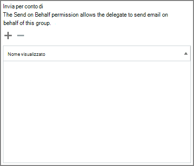

# 구성원이 그룹으로 보내거나 그룹을 대신하여 보내기 허용

다른 사람 Microsoft 365 또는 대신 보내기 권한이  부여된  Microsoft 365 그룹의 구성원은 그룹으로 또는 그룹을 대신하여 전자 메일을 보낼 수 있습니다. 그룹의 게스트에게 이러한 사용 권한을 부여할 수 없습니다.

이 문서에서는 전역 또는 Exchange 관리자가 이러한 사용 권한을 설정하는 방법에 대해 설명하고 있습니다.
  
예를 들어 Megan Bowen이 **Training** Microsoft 365 그룹의 일부이고  그룹에 대한 다른 사람으로 보내기 권한이 있는 경우 그룹으로 전자  메일을 보내는 경우 교육 그룹이 전자 메일을 보낸 것 같습니다. 
  
대신 **보내기 권한을** 사용하면 사용자가 그룹 대신 전자 메일을 보낼 Microsoft 365 있습니다. 예를 들어 Alex Wilber가 **Marketing** Microsoft 365 그룹의 일부인 경우  대신 보내기 권한이 있으며 그룹으로 전자 메일을 보내는 경우 전자 메일은 **Alex Wilber가 Marketing을** 대신하여 보낸 것 같습니다.

> [!IMPORTANT]
> 특정 **사용자에 대해 다른 사람으로** 보내기 또는 대신 보내기 를 구성할 수 있지만 둘 다 구성할 수 없습니다.  둘 다 구성하는 경우 기본적으로 다른 사람으로 **보내기 으로 설정됩니다.**

> [!TIP]
> [그룹에서](https://support.microsoft.com/office/0f4964af-aec6-484b-a65c-0434df8cdb6b) 전자 메일을 보내기 Microsoft 365 그룹에서 전자 메일을 보내거나 대신하여 웹에서 Outlook Outlook 전자 메일을 보내는 방법을 알아보는 방법을 참조하세요.
    
## 구성원이 전자 메일을 그룹으로 보낼 수 있도록 허용

이 섹션에서는 사용자가 EAC(Exchange 관리 센터)에서 그룹으로 전자 메일을 보낼 수 있도록 허용하는 Exchange Online. 
  
1. Exchange <a href="https://go.microsoft.com/fwlink/p/?linkid=2059104" target="_blank">관리 센터에서</a>받는 사람 **그룹으로** \> **이동하세요.**
    
2. 그룹 **편집**  을(를) 사용하여 사용자가 다른 사람으로 보낼 수 있도록 합니다. 
    
3. 그룹 **위임 을 선택합니다.**
    
4. 다른 **사람으로 보내기 섹션에서** 그룹으로 보낼 사용자를 추가하려면 **+** 기호를 선택합니다. 
    
    
  
5. 목록에서 사용자를 검색하거나 선택합니다. 확인 **및** **저장을 선택합니다.**
    
    
  
## 구성원이 그룹을 대신하여 전자 메일을 보낼 수 있도록 허용

이 섹션에서는 사용자가 EAC(Exchange 관리 센터)의 그룹을 대신하여 전자 메일을 보낼 수 있도록 허용하는 Exchange Online.
  
1. Exchange <a href="https://go.microsoft.com/fwlink/p/?linkid=2059104" target="_blank">관리 센터에서</a>받는 사람 **그룹으로** \> **이동하세요.**
    
2. 그룹 **편집**  을(를) 사용하여 사용자가 다른 사람으로 보낼 수 있도록 합니다. 
    
3. 그룹 **위임 을 선택합니다.**
    
4. 대신 보내기 섹션에서 그룹으로 보낼 사용자를 추가하려면 **+** 기호를 선택합니다. 
    
    
  
5. 목록에서 사용자를 검색하거나 선택합니다. 확인 **및** **저장을 선택합니다.**
    
    

## 관련 문서

[공동 작업 거버넌스 계획 단계별](collaboration-governance-overview.md#collaboration-governance-planning-step-by-step)

[공동 작업 거버넌스 계획 만들기](collaboration-governance-first.md)

[그룹에 대해 Microsoft 365 자세히 알아보시고](https://support.microsoft.com/office/b565caa1-5c40-40ef-9915-60fdb2d97fa2)

[Add-RecipientPermission](/powershell/module/exchange/add-recipientpermission)

[Set-UnifiedGroup](/powershell/module/exchange/set-unifiedgroup)