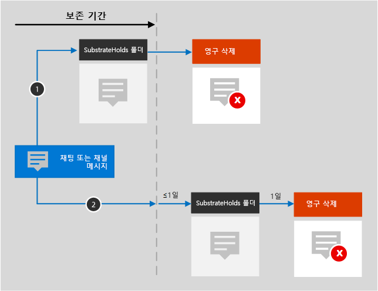

# Microsoft 365 아이콘 및 템플릿

파트너와 고객이 새 솔루션을 디자인하고 설계하는 데 도움이 중요합니다. 이 가이드에 포함된 아키텍처 다이어그램은 디자인 결정과 환경의 구성 요소 간 관계를 전달하는 데 도움이 될 수 있습니다. 당사는 Visio 템플릿과 함께 기호 및 아이콘 집합을 사용하여 제품으로 만드는 아키텍처 다이어그램을 만들고 다음 솔루션에 대한 사용자 지정 아키텍처 다이어그램을 작성하는 데 도움이 되는 이러한 도구를 제공합니다.

다음 페이지에서 다운로드 가능한 파일에서 실행되는 아이콘, 기호 및 템플릿을 볼 수 있습니다.

- [생산성 일러스트레이션](productivity-illustrations.md)
- [Microsoft 클라우드 아키텍처 모델](cloud-architecture-models.md)

## 사용 약관 및 다운로드

Microsoft는 아키텍처 다이어그램, 교육 자료 또는 설명서에서 이러한 아이콘을 사용할 수 있습니다. Microsoft에서 명시적 권한을 부여하지 않으면 허용된 사용에 한해 아이콘을 복사, 배포 및 표시할 수 있습니다. Microsoft reserves all other rights.

 > [!div class="button"]
 > [SVG 및 PNG 아이콘 다운로드](https://go.microsoft.com/fwlink/?linkid=869455)

 > [!div class="button"]
 > [Visio 템플릿 및 스텐실 다운로드](https://go.microsoft.com/fwlink/?linkid=2056186)

## 예제 아키텍처 다이어그램

이러한 아이콘 및 템플릿을 사용하여 다음 예제와 같은 다이어그램을 만들 수 있습니다.

1. 다음에 대한 검색 아키텍처 다이어그램의 SharePoint.

    

2. Teams 주기 아키텍처 다이어그램:

    
