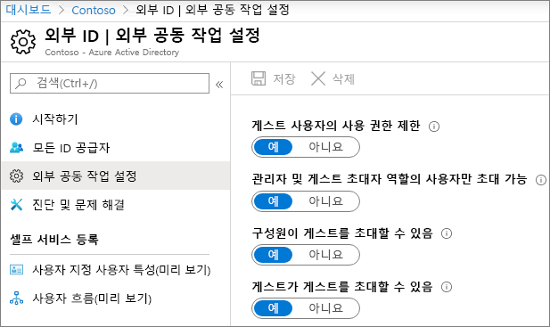
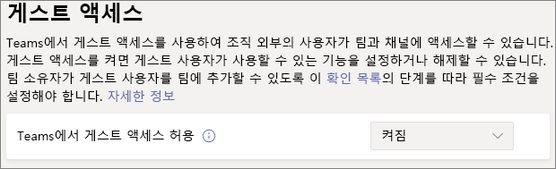
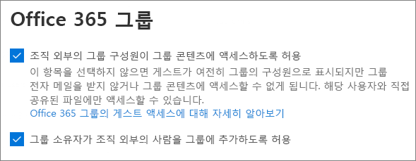
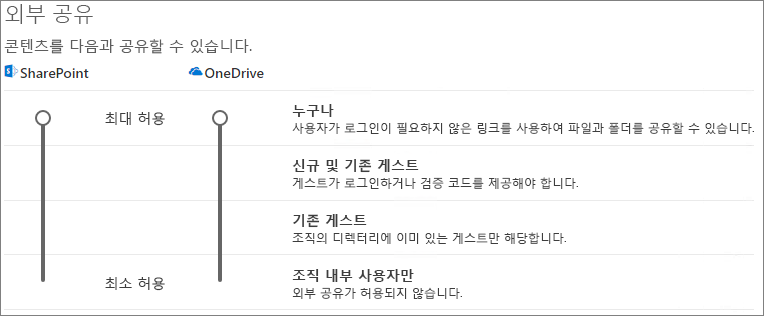
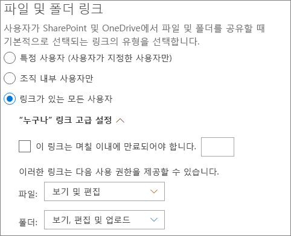
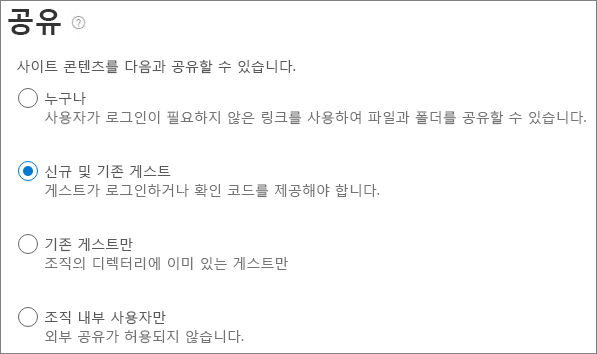

# 게스트와 팀으로 공동 작업하기

문서, 작업 및 대화에서 게스트와 공동 작업해야 하는 경우 Microsoft Teams를 사용하는 것이 좋습니다. Teams는 Office 및 SharePoint에서 사용할 수 있는 모든 공동 작업 기능과 지속적인 채팅을 통해 통합된 사용자 환경에서 사용자 지정 가능하고 배율 가능한 공동 작업 도구 집합을 제공합니다.

이 문서에서는 게스트와 공동 작업할 팀을 설정하는 데 필요한 Microsoft 365 구성 단계에 대해 설명합니다. 게스트 액세스를 구성한 후 [Teams에서 팀에 게스트를 추가](https://support.microsoft.com/office/fccb4fa6-f864-4508-bdde-256e7384a14f)하는 단계에 따라 팀에 게스트를 초대할 수 있습니다.

## 동영상 데모

이 비디오에서는 이 문서에서 설명한 구성 단계를 보여줍니다. 

> [!VIDEO https://www.microsoft.com/videoplayer/embed/RE44NTr?autoplay=false]

## Azure 외부 공동 작업 설정

Microsoft 365의 공유는 [Azure Active Directory의 B2B 외부 공동 작업 설정](/azure/active-directory/external-identities/delegate-invitations)에 따라 가자 높은 수준에서 관리됩니다. Azure AD에서 게스트 공유가 비활성화되거나 제한된 경우 이 설정은 Microsoft 365에서 구성하는 모든 공유 설정을 재정의합니다.

게스트와의 공유가 차단되지 않도록 B2B 외부 공동 작업 설정을 확인합니다.

외부 공동 작업 설정을 지정하려면

1. [https://aad.portal.azure.com](https://aad.portal.azure.com)에서 Azure Active Directory에 로그인합니다.
2. 왼쪽 탐색 창에서 **Azure Active Directory** 를 클릭합니다.
3. **외부 ID** 를 클릭합니다.
4. **시작** 화면의 왼쪽 탐색 창에서 **외부 동 작업 설정** 을 클릭합니다.
5. **구성원 사용자과 특정 관리자 역할에 할당된 사용자가 구성원 권한을 가진 게스트를 비롯한 게스트 사용자를 초대할 수 있도록 허용** 또는 **조직의 모든 사용자가 게스트와 비 관리자를 비롯한 게스트 사용자를 초대할 수 있도록 허용** 을 선택했는지 확인합니다.
6. 변경한 내용이 있으면 **저장** 을 클릭합니다.

**공동 작업 제한** 섹션의 설정을 확인합니다. 공동 작업하려는 게스트의 도메인이 차단되지 않았는지 합니다.

여러 조직의 게스트와 함께 작업하는 경우 디렉터리 데이터에 액세스하는 기능을 제한해야 할 수 있습니다. 이 작업을 수행하면 게스트가 디렉터리에 다른 게스트가 누구인지 볼 수 없습니다. 이 작업을 수행하려면, **게스트 사용자 액세스 제한** 아래에서 **디렉터리 개체 설정의 속성 및 멤버십에 대한 게스트 사용자의 액세스가 제한됨** 또는 **게스트 사용자 액세스가 해당 디렉터리 개체의 속성 및 멤버십으로 제한됨** 을 선택합니다.

## Teams 게스트 액세스 설정

Teams에는 게스트 액세스에 대한 마스터 켜기/끄기 스위치와 게스트가 팀에서 할 수 있는 작업을 제어할 수 있는 다양한 설정이 있습니다. 마스터 스위치인 **Teams에서 게스트 액세스 허용** 은 게스트 액세스가 Teams에서 작동하기 위해 반드시 **켜짐** 상태가 되어야 합니다.

Teams에서 게스트 액세스가 활성화되어 있는지 확인하고 비즈니스 요구 사항에 따라 게스트 설정을 조정하세요. 이러한 설정은 모든 팀에 영향을 미칩니다.

Teams 게스트 액세스를 설정하려면 다음을 수행합니다.

1. [https://admin.microsoft.com](https://admin.microsoft.com)에서 Microsoft 365 관리 센터에 로그인합니다.
2. 왼쪽 탐색 창에서 **모두 표시** 를 클릭합니다.
3. **관리 센터** 에서 **Teams** 를 클릭합니다.
4. Teams 관리 센터의 왼쪽 탐색 창에서 **사용자** > <a href="https://go.microsoft.com/fwlink/p/?linkid=2173122" target="_blank">**게스트 액세스**</a>를 선택합니다.
5. Teams의 **게스트 액세스 허용** 이 **사용** 으로 설정되어 있는지 확인합니다.
6. 추가 게스트 설정을 원하는대로 변경 한 다음 **저장** 을 클릭하세요.

Teams 게스트 액세스가 설정되어 있는 경우, 민감도 레이블을 사용하여 선택적으로 개별 팀 및 관련 SharePoint 사이트에 대한 게스트 액세스를 제어할 수 있습니다. 자세한 내용은 [민감도 레이블을 사용하여 Microsoft Teams, Microsoft 365 그룹 및 SharePoint 사이트에서 콘텐츠 보호](../compliance/sensitivity-labels-teams-groups-sites.md)를 참조하세요.

> [!NOTE]
> Teams 게스트 설정을 켠 후 활성화되려면 최대 24시간이 걸릴 수 있습니다.

## Microsoft 365 그룹 게스트 설정

Teams는 팀 멤버십에 Microsoft 365 그룹을 사용합니다. Teams에서 게스트 액세스가 작동하려면 Microsoft 365 그룹 게스트 설정이 켜져 있어야 합니다.

Microsoft 365 Groups 게스트 설정을 설정하려면

1. Microsoft 365 관리 센터의 왼쪽 탐색 창에서 **설정** 을 확장합니다.
2. **조직 설정** 을 클릭합니다.
3. 목록에서 **Microsoft 365 그룹** 을 클릭합니다.
4. **그룹 소유자가 조직 외부의 사용자를 Microsoft 365 그룹에 게스트로 추가하도록 허용** 및 **게스트 그룹 구성원이 그룹 콘텐츠에 액세스하도록 허용** 확인란이 모두 선택되어 있는지 확인합니다.
5. 변경한 내용이 있으면 **변경 내용 저장** 을 클릭합니다.

## SharePoint 조직 수준 공유 설정

파일, 폴더, 목록 등의 Teams 콘텐츠는 모두 SharePoint에 저장됩니다. 게스트가 Teams에서 이러한 항목에 액세스할 수 있도록 허용하려면 SharePoint 조직 수준 공유 설정에서 게스트와 공유를 허용해야 합니다.

조직 수준 설정에 따라 팀과 연결된 사이트를 포함하여 개별 사이트에 사용할 수 있는 설정이 결정됩니다. 사이트 설정은 조직 수준 설정보다 더 제한될 수 없습니다.

사용자와 파일 및 폴더 공유를 허용하려는 경우,**모든 사용자** 를 선택합니다. 모든 게스트가 인증해야 하는지 확인하려는 경우 **새 게스트 및 기존 게스트** 를 선택합니다. 조직의 모든 사이트에서 필요한 가장 적합한 설정을 선택하세요.

SharePoint 조직 수준 공유 설정을 설정하려면

1. <a href="https://go.microsoft.com/fwlink/p/?linkid=2024339" target="_blank">Microsoft 365 관리 센터</a>의 왼쪽 탐색 창에 있는 **관리 센터** 에서 **SharePoint** 를 클릭합니다.
2. SharePoint 관리 센터의 왼쪽 탐색 창에서 **정책** 을 확장한 다음, **공유** 를 클릭합니다.
3. SharePoint에 대한 외부 공유가 **모든 사용자** 또는 **새 게스트 및 기존 게스트** 로 설정되어 있는지 확인합니다.
4. 변경한 내용이 있으면 **저장** 을 클릭합니다.

## SharePoint 조직 수준 기본 링크 설정

기본 파일 및 폴더 링크 설정에 따라 사용자가 파일 또는 폴더를 공유할 때 기본적으로 사용자에게 표시되는 링크 옵션이 결정됩니다. 원하는 경우 공유하기 전에 링크 유형을 다른 옵션 중 하나로 변경할 수 있습니다.

이 설정은 조직의 모든 팀과 SharePoint 사이트에 영향을 미친다는 점에 유의하세요.

사용자가 파일 및 폴더를 공유할 때 기본적으로 선택되는 다음 링크 유형 중 하나를 선택하세요.

- **링크가 있는 모든 사용자** - 파일 및 폴더의 무단 공유가 많은 경우 이 옵션을 선택합니다. 링크를 *모든 사용자* 에게 공유하고 싶지만 예기치 못한 무단 공유가 우려되는 경우, 다른 옵션 중 하나를 기본값으로 고려하세요. 이 링크 유형은 **모든 사용자** 와 공유할 수 있도록 사용 설정한 경우에만 사용할 수 있습니다.
- **조직 내 사용자만** - 대부분의 파일 및 폴더 공유가 조직 내부 사용자와 공유될 것으로 예상되는 경우 이 옵션을 선택합니다.
- **특정 사용자** - 게스트와 많은 파일 및 폴더 공유를 할 것으로 예상되는 경우 이 옵션을 고려하세요. 이러한 유형의 링크는 게스트와 함께 작동하며 인증을 요구합니다.
 

SharePoint 조직 수준 기본 링크 설정을 설정하려면

1. SharePoint 관리 센터의 공유 페이지로 이동합니다.
2. **파일 및 폴더 링크** 에서 사용하려는 기본 공유 링크를 선택합니다.
3. 변경한 내용이 있으면 **저장** 을 클릭합니다.

## 팀 만들기

다음 단계는 게스트와 공동 작업할 팀을 만드는 것입니다.

팀을 만들기 위해
1. Teams의 **Teams** 탭에서 왼쪽 창 맨 아래에 있는 **팀 참가 또는 만들기** 를 클릭합니다.
2. **팀 만들기** 를 클릭하세요.
3. **처음부터 팀 만들기** 를 클릭합니다.
4. **비공개** 또는 **공개** 를 선택하세요.
5. 팀의 이름과 설명을 입력한 다음 **만들기** 를 클릭합니다.
6. **건너뛰기** 를 클릭합니다.

나중에 사용자를 초대합니다. 다음으로, 팀과 연결된 SharePoint 사이트에 대한 사이트 수준 공유 설정을 확인합니다.

## SharePoint 사이트 수준 공유 설정

사이트 수준 공유 설정을 확인하여 이 팀에 대해 원하는 액세스 유형을 허용하는지 확인합니다. 예를 들어. 조직 수준 설정을 **모든 사용자** 로 설정했지만 모든 게스트가 이 팀에 대해 인증하도록 하려면 사이트 수준 공유 설정이 **새 게스트 및 기존 게스트** 로 설정되어 있는지 확인합니다.

사이트 수준 공유 설정을 설정하려면
1. SharePoint 관리 센터의 왼쪽 탐색 창에서 **사이트** 를 확장하고 **활성 사이트** 를 클릭합니다.
2. 방금 생성한 팀의 사이트를 선택합니다.
3. **공유** 를 클릭하고...선택합니다.
4. 공유가 **모든 사용자** 또는 **새 게스트 및 기존 게스트** 로 설정되었는지 확인합니다.
5. 변경한 내용이 있으면 **저장** 을 클릭합니다.

## 사용자 초대하기

이제 게스트 공유 설정이 구성되어 내부 사용자와 게스트를 팀에 추가할 수 있습니다. 

내부 사용자를 팀에 초대
1. 팀에서 **추가 옵션** (**\*\*\***)을 클릭한 다음, **구성원 추가** 를 클릭합니다.
2. 초대하려는 사람의 이름을 입력합니다.
3. **추가** 를 클릭한 다음 **닫기** 를 클릭합니다.

팀에 게스트를 초대
1. 팀에서 **추가 옵션** (**\*\*\***)을 클릭한 다음, **구성원 추가** 를 클릭합니다.
2. 초대하려는 게스트의 전자 메일 주소를 입력합니다.
3. **게스트 정보 편집** 을 클릭합니다.
4. 게스트의 전체 이름을 입력하고 확인 표시를 클릭합니다.
5. **추가** 를 클릭한 다음 **닫기** 를 클릭합니다.

> [!NOTE]
> 회사 또는 학교 계정이 있는 게스트는 UPN(사용자 계정 이름)(예: adele@contoso.com)을 사용해야만 초대를 받을 수 있습니다. EAS ID 또는 기타 전자 메일 형식을 사용하여 게스트를 초대하는 것은 지원되지 않습니다.

## 참고 항목

[인증되지 않은 사용자와 파일 및 폴더를 공유하는 모범 사례](best-practices-anonymous-sharing.md)

[게스트와 공유할 때 파일에 실수로 발생하는 노출을 제한](share-limit-accidental-exposure.md)

[보안 게스트 공유 환경 만들기](create-secure-guest-sharing-environment.md)

[관리 대상 게스트와 B2B 엑스트라넷 작성](b2b-extranet.md)

[Azure AD B2B와 SharePoint 및 OneDrive의 통합(미리 보기)](/sharepoint/sharepoint-azureb2b-integration-preview)

[SharePoint 또는 OneDrive에서 공유하면 공유 옵션이 회색으로 표시됩니다.](/sharepoint/troubleshoot/administration/sharing-options-grayed-out-when-sharing-from-sharepoint-online-or-onedrive)
