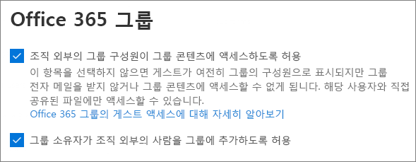

# 게스트와 현장에서 공동 작업하기

문서, 데이터 및 목록에서 게스트와 공동 작업을 해야 하는 경우 SharePoint 사이트를 사용할 수 있습니다. 최신 SharePoint 사이트는 Microsoft 365 그룹에 연결되고 사이트 구성원을 관리하고 공유 사서함 및 일정과 같은 추가 공동 작업 도구를 제공할 수 있습니다.

이 문서에서는 게스트와 공동 작업을 위해 SharePoint 사이트를 설정하는 데 필요한 Microsoft 365 구성 단계를 진행합니다.

## 비디오 데모

이 비디오에서는 이 문서에 설명된 구성 단계를 보여줍니다. 

> [!VIDEO https://www.microsoft.com/videoplayer/embed/RE44Llg?autoplay=false]

## Azure 외부 공동 작업 설정

Microsoft 365에서 공유는 [Azure Active Directory의 B2B](https://docs.microsoft.com/azure/active-directory/external-identities/delegate-invitations)외부 공동 작업 설정에 의해 가장 높은 수준에서 관리됩니다. Azure AD에서 게스트 공유를 사용하지 않도록 설정하거나 제한하는 경우 이 설정은 Microsoft 365에서 구성한 모든 공유 설정을 다시 적용합니다.

B2B 외부 공동 작업 설정을 확인하여 게스트와의 공유가 차단되지 않는지 확인합니다.

외부 공동 작업 설정을 설정하려면

1. Azure Active Directory에 [https://aad.portal.azure.com](https://aad.portal.azure.com) 로그인합니다.
2. 왼쪽 탐색 창에서 **Azure Active Directory를 클릭합니다.**
3. 외부 **ID를 클릭합니다.**
4. 시작 **화면의 왼쪽** 탐색 창에서 외부 공동 작업 설정을 **클릭합니다.**
5. 게스트 초대자 역할의 관리자와 **사용자가** 초대할 수 있으며 구성원이 초대할 수 **있는** 사용자가 모두 예로 설정되어 있도록 **합니다.**
6. 변경한 내용이 있으면 **저장** 을 클릭합니다.

공동 작업 제한 섹션의 **설정을 확인합니다.** 공동 작업할 게스트의 도메인이 차단되지 않는지 확인

여러 조직의 게스트와 함께 작업하는 경우 디렉터리 데이터에 액세스하는 기능을 제한할 수 있습니다. 이렇게 하면 다른 사용자가 디렉터리에서 게스트인 것을 볼 수 없습니다. 이를 위해 게스트 사용자 액세스 제한에  따라 선택 게스트 사용자는 디렉터리 개체 설정의 속성 및 멤버 자격에 대한 액세스가 제한되거나 게스트 사용자 액세스는 자신의 디렉터리 개체의 속성 및 멤버 자격으로 제한됩니다. 

## Microsoft 365 그룹 게스트 설정

최신 SharePoint 사이트는 Microsoft 365 그룹을 사용하여 사이트 액세스를 제어합니다. SharePoint 사이트의 게스트 액세스가 작동하려면 Microsoft 365 그룹 게스트 설정을 켜야 합니다.

Microsoft 365 그룹 게스트 설정을 설정하려면

1. Microsoft 365 관리 센터의 왼쪽 탐색 창에서 설정을 **확장합니다.**
2. Org **설정을 클릭합니다.**
3. 목록에서 Microsoft **365** 그룹을 클릭합니다.
4. 그룹 소유자가 조직 외부의 구성원을 **게스트로 추가하고** 게스트  그룹 구성원이 그룹 콘텐츠 확인란에 액세스하도록 허용 확인란을 모두 선택해야 합니다.
5. 변경한 경우 변경 내용 **저장을 클릭합니다.**

## SharePoint 조직 수준 공유 설정

게스트가 SharePoint 사이트에 액세스할 수 있도록 SharePoint 조직 수준 공유 설정에서 게스트와의 공유를 허용해야 합니다.

조직 수준 설정에 따라 개별 사이트에 사용할 수 있는 설정이 결정됩니다. 사이트 설정은 조직 수준 설정보다 더 많이 사용할 수 없습니다.

허용되지 않은 파일 및 폴더 공유를 허용하려는 경우 모든 사람을 **선택하십시오.** 조직 외부의 모든 사용자가 인증을 하도록 하려는 경우 신규 및 기존 **게스트를 선택 합니다.** 조직의 모든 사이트에서 필요한 가장 적합한 설정을 선택하십시오.

SharePoint 조직 수준 공유 설정을 설정하려면

1. Microsoft 365 관리 센터의 왼쪽 탐색 창에 있는 관리 **센터에서** **SharePoint를 클릭합니다.**
2. SharePoint 관리 센터의 왼쪽 탐색 창에 있는 **정책 아래에서** 공유를 **클릭합니다.**
3. SharePoint의 외부 공유가 **모든** 사용자 또는 신규 및 기존 **게스트로 설정되어 있도록 합니다.**
4. 변경한 내용이 있으면 **저장** 을 클릭합니다.

## 사이트 만들기

다음 단계는 게스트와 공동 작업하는 데 사용할 사이트를 만드는 것입니다.

사이트를 만들 수 있습니다.
1. SharePoint 관리 센터의 **사이트** 에서 **활성 사이트** 를 클릭하십시오.
2. **만들기** 를 클릭합니다.
3. 팀 **사이트를 클릭합니다.**
4. 사이트 이름을 입력하고 그룹 소유자(사이트 소유자)의 이름을 입력합니다.
5. 고급 **설정에서** 이 사이트를 공용 사이트 또는 개인 사이트로 사용할지 선택합니다.
6. **다음** 을 클릭합니다.
7. **마침** 을 클릭합니다.

나중에 사용자를 초대합니다. 다음으로 이 사이트의 사이트 수준 공유 설정을 점검해야 합니다.

## SharePoint 사이트 수준 공유 설정

사이트 수준 공유 설정을 확인하여 이 사이트에 대해 원하는 액세스 유형을 허용하는지 확인합니다. 예를 들어 조직 수준 설정을 **모든** 사용자로 설정했지만 모든 게스트가 이 사이트에 대해 인증을 하게 하려는 경우 사이트 수준 공유 설정이 신규 및 기존 게스트로 설정되어 있는지 **확인합니다.**

사이트는 사용되지 않은 사용자(모든 사용자 설정)와 공유할 수 없지만 개별 파일 및 폴더는 공유할 수 있습니다.

민감도 레이블을 사용하여 SharePoint 사이트에 대한 외부 공유 설정을 [제어할 수도 있습니다.](https://docs.microsoft.com/microsoft-365/compliance/sensitivity-labels-teams-groups-sites)

사이트 수준 공유 설정을 설정하려면
1. SharePoint 관리 센터의 왼쪽 탐색 창에서 **사이트** 를 확장시키고 **Active 사이트** 를 클릭합니다.
2. 공유할 사이트를 선택합니다.
3. ...를 클릭하고 공유를 **클릭합니다.**
4. 공유가 모든 사용자  또는 신규 및 기존 **게스트로 설정되어 있도록 합니다.**
5. 변경한 내용이 있으면 **저장** 을 클릭합니다.

## 사용자 초대하기

이제 게스트 공유 설정이 구성되어 내부 사용자와 게스트를 사이트에 추가할 수 있습니다. 사이트 액세스는 연결된 Microsoft 365 그룹을 통해 제어하기 때문에 여기에 사용자를 추가할 것입니다.

내부 사용자를 그룹에 초대
1. 사용자를 추가할 사이트로 이동합니다.
2. 오른쪽 **위에서** 구성원 수를 나타 내는 구성원 링크를 클릭합니다.
3. **구성원 추가** 를 클릭합니다.
4. 사이트에 초대할 사용자의 이름 또는 전자 메일 주소를 입력한 다음 저장을 **클릭합니다.**

사이트에서 게스트를 추가할 수 없습니다. 웹용 Outlook을 사용하여 추가해야 합니다. 따라서 게스트를 그룹에 추가하고 그룹에 초대하기 위한 선행 요구 항목으로 URL 열에서 사이트의 **URL을**  클릭하여 사이트별 페이지로 이동합니다. 이 페이지에서 앱 시작 프로그램 **아이콘을 클릭하고** **Outlook을 선택합니다.** 아래에 설명된 절차에 따라 게스트를 그룹에 초대할 수 있는 화면입니다.

게스트를 그룹에 초대
1. **그룹에서** 게스트를 초대할 그룹을 클릭합니다.
2. 그룹 연락처 카드를 열고 오른쪽 위에 있는 구성원 링크를 클릭합니다(구성원 수를 나타는 링크). 
3. 구성원 **추가를 클릭합니다.**
4. 초대할 게스트의 전자 메일 주소를 입력하고 추가를 **클릭합니다.**
5. **닫기** 를 클릭합니다.
그룹의 소유자가 아니며 그 결과로 게스트를 그룹에 추가할 수 없는 경우 닫기만 클릭해야 합니다.  이러한 경우 그룹에 게스트를 추가하는 요청은 승인을 위해 그룹 소유자에게 전송됩니다.

## 기타 참고 항목

[인증되지 않은 사용자와 파일 및 폴더를 공유하는 모범 사례](best-practices-anonymous-sharing.md)

[게스트와 공유할 때 파일에 실수로 발생하는 노출을 제한](share-limit-accidental-exposure.md)

[보안 게스트 공유 환경 만들기](create-secure-guest-sharing-environment.md)

[관리 대상 게스트와 B2B 엑스트라넷 작성](b2b-extranet.md)

[Azure AD B2B와 SharePoint 및 OneDrive 통합](https://docs.microsoft.com/sharepoint/sharepoint-azureb2b-integration-preview)
