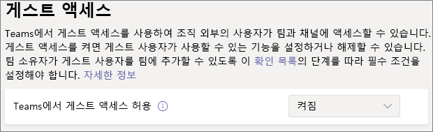

# 기본 보호 기능으로 팀 구성Configure teams with baseline protection

이 문서에서는 기본 수준의 보호 기능으로 팀을 배포하는 방법을 살펴봅니다.In this article, we look at how to deploy teams with a baseline level of protection. 이 수준을 통해 사용자는 다양한 공동 작업 옵션을 사용하면서 권한 관리를 강화하고 과잉 공유에 대한 기본 보호를 제공할 수 있습니다.This level allows users a wide range of options for collaboration while enhancing permissions management and providing basic protection against oversharing. 이 수준에 대한 권장 보호에는 ID 및 장치 액세스 정책과 맬웨어 방지가 포함됩니다.Recommended protections for this level include identity and device access policies and protection against malware. 또한 필요에 따라 조건부 액세스 정책 및 데이터 손실 방지를 적용할 수 있습니다.Additionally, you can apply conditional access policies and data loss protections as needed.

## 초기 보호Initial protections

첫 번째 단계로 기본 ID 및 장치 액세스 정책을 구성하는 것이 좋습니다.As a first step, we recommend that you configure basic identity and device-access policies. 자세한 내용은 [팀 채팅, 그룹, 파일에 대한 정책 권장 사항](../security/office-365-security/teams-access-policies.md)을 참조하세요.See [Policy recommendations for securing Teams chats, groups, and files](../security/office-365-security/teams-access-policies.md) for details.

또한 문서, 첨부 파일 및 링크의 맬웨어를 방지하기 위해 기본 Office 365용 Defender 기능을 설정하는 것이 좋습니다.We also recommend turning on basic Defender for Office 365 features to guard against malware in documents, attachments, and links. 다음 표의 각 옵션을 설정하는 것이 좋습니다.We recommend turning on each of the options in the following table.

|옵션Option|정보Information|
|:------|:-----------|
|SPO, OneDrive 및 Teams용 안전 첨부 파일Safe Attachments for SPO, OneDrive and Teams|[안전 첨부 파일Safe Attachments](../security/office-365-security/atp-safe-attachments.md) [Office 365용 Defender - SharePoint, OneDrive 및 Microsoft TeamsDefender for Office 365 - SharePoint, OneDrive, and Microsoft Teams](../security/office-365-security/atp-for-spo-odb-and-teams.md)|
|안전 문서Safe Documents|[Office 365용 Microsoft Defender의 안전 문서Safe Documents in Microsoft Defender for Office 365](../security/office-365-security/safe-docs.md)|
|Teams용 안전 링크Safe Links for Teams|[Teams의 Office 365 안전한 링크Office 365 Safe Links in Teams](../security/office-365-security/atp-safe-links.md#safe-links-settings-for-microsoft-teamssafe-links-settings-for-microsoft-teams) [안전 링크Safe Links](../security/office-365-security/atp-safe-links.md)|

## Teams 게스트 공유Teams guest sharing

각 계층에서 조직 외부의 사용자와 공유할 수 있는 옵션이 있습니다.In each of the tiers, we have the option of sharing with people outside your organization. 중요하고 매우 중요한 계층의 경우 중요도 종류 레이블을 사용하여 팀 수준에서 게스트 공유를 해제할 수 있습니다.For the sensitive and highly sensitive tiers, we will have the option to turn guest sharing off at the team level by using sensitivity labels. 그러나 팀에서 게스트 공유를 사용하려면 조직 수준의 게스트 공유 설정을 사용해야 합니다.But the organization-level guest sharing setting must be turned on for guest sharing to work at all in Teams.

Teams 게스트 액세스를 설정하려면 다음을 수행합니다.To set Teams guest access settings

1. [https://admin.microsoft.com](https://admin.microsoft.com)에서 Microsoft 365 관리 센터에 로그인합니다.Log in to the Microsoft 365 admin center at [https://admin.microsoft.com](https://admin.microsoft.com).
2. 왼쪽 탐색 창에서 **모두 표시** 를 클릭합니다.In the left navigation, click **Show all**.
3. **관리 센터** 에서 **Teams** 를 클릭합니다.Under **Admin centers**, click **Teams**.
4. Teams 관리 센터의 왼쪽 탐색 창에서 **조직 전체 설정** 을 확장한 다음 **게스트 액세스** 를 클릭합니다.In the Teams admin center, in the left navigation, expand **Org-wide settings** and click **Guest access**.
5. Teams의 **게스트 액세스 허용** 이 **사용** 으로 설정되어 있는지 확인합니다.Ensure that **Allow guest access in Teams** is set to **On**.
6. 추가 게스트 설정을 원하는대로 변경 한 다음 **저장** 을 클릭하세요.Make any desired changes to the additional guest settings, and then click **Save**.

> [!NOTE]
> Teams 게스트 설정을 켠 후 활성화되려면 최대 24시간이 걸릴 수 있습니다.It may take up to twenty-four hours for the Teams guest setting to become active after you turn it on.

Office 365 그룹 ​​및 SharePoint에서는 게스트 공유가 기본적으로 사용 설정되어 있지만 이전에 조직의 게스트 공유 설정을 변경한 경우 [팀의 게스트와 공동 작업](./collaborate-as-team.md)을 검토하여 게스트 공유를 Teams에서 사용할 수 있는지 확인하는 것이 좋습니다.Guest sharing is turned on by default for Office 365 groups and SharePoint, however if you have previously changed any of the guest sharing settings for your organization, we recommend that you review [Collaborate with guests in a team](./collaborate-as-team.md) to ensure that guest sharing will be available in Teams.

## 사이트 및 파일 공유Site and file sharing

실수로 조직 외부 사람과 파일 또는 폴더를 공유 할 위험을 줄이려면 SharePoint의 기본 공유 링크를 *조직 내 사용자 전용* 으로 변경하는 것이 좋습니다.To reduce the risk of accidentally sharing files or folders with people outside your organization, we recommend changing the default sharing link for SharePoint to *Only people in your organization*. (사용자가 외부에서 공유해야 하고 게스트 공유를 활성화한 경우 공유할 때 링크 유형을 계속 변경할 수 있습니다.)(If users need to share externally, and you have enabled guest sharing, they can still change the link type when they share.)

기본 공유 링크를 변경하려면To change the default sharing link
1. [SharePoint 관리 센터](https://admin.microsoft.com/sharepoint)를 엽니다.Open the [SharePoint admin center](https://admin.microsoft.com/sharepoint).
2. **정책** 에서 **공유** 를 클릭하세요.Under **Policies**, click **Sharing**.
3. **파일 및 폴더 링크** 에서 **조직 내 사용자만** 을 선택합니다.Under **File and folder links**, select **Only people in your organization**.
4. **저장** 을 클릭합니다.Click **Save**.

최상의 게스트 공유 환경을 위해서는 [Azure AD B2B와의 SharePoint 및 OneDrive 통합](/sharepoint/sharepoint-azureb2b-integration-preview)을 사용하는 것이 좋습니다.For the best guest sharing experience, we also recommend that you enable [SharePoint and OneDrive integration with Azure AD B2B](/sharepoint/sharepoint-azureb2b-integration-preview).

## 팀 만들기Create a team

기준 수준의 보호에 대한 추가 구성은 팀과 연결된 SharePoint 사이트에서 수행됩니다.Additional configuration for the baseline level of protection is done in the SharePoint site associated with a team. 다음 섹션으로 진행하기 전에 [공개 또는 개인 팀을 만드세요](https://support.office.com/article/174adf5f-846b-4780-b765-de1a0a737e2b).[Create a public or private team](https://support.office.com/article/174adf5f-846b-4780-b765-de1a0a737e2b) before proceeding to the next section.

## 사이트 공유 설정Site sharing settings

기본적으로 SharePoint 사이트의 구성원은 다른 사용자를 사이트에 초대할 수 있습니다.By default, members of a SharePoint site can invite others to the site. 사이트가 팀의 일부인 경우 팀 구성원이 사이트 구성원으로 포함됩니다.When a site is part of a team, team members are included as site members. 그러나 사이트에 직접 추가된 사람들은 나머지 팀에 액세스할 수 없습니다.However, people added directly to the site don't have access to the rest of the team. 따라서 팀을 통해서만 권한을 관리하는 것이 좋습니다.For this reason, we recommend managing permissions exclusively through the team.

권한 관리를 돕기 위해 소유자만 사이트를 공유할 수 있도록 연결된 사이트를 구성하는 것이 좋습니다.To help with permissions management, we recommend configuring the associated site to only allow owners to share the site by itself. 이는 권한 관리를 단순화하고 팀 소유자 모르게 사람들이 액세스하지 못하게합니다.This simplifies permissions management and helps prevent access by people without a team owner's knowledge. 기본 보호가 필요한 각 팀에 대해 이 작업을 수행하세요.Do this for each team that requires baseline protection.

사이트 공유 설정을 업데이트하려면To update the site sharing settings
1. 팀의 도구 막대에서 **파일** 을 클릭합니다.In the tool bar for the team, click **Files**.
2. **SharePoint에서 열기** 를 클릭하세요.Click **Open in SharePoint**.
3. SharePoint 사이트의 도구 모음에서 설정 아이콘을 클릭한 다음 **사이트 권한** 을 클릭하세요.In the tool bar of the SharePoint site, click the settings icon, and then click **Site permissions**.
4. **사이트 권한** 창의 **사이트 공유에** 서 **멤버 공유 방법 변경** 을 클릭하세요.In the **Site permissions** pane, under **Site sharing**, click **Change how members can share**.
5. **권한 공유** 에서 **사이트 소유자 및 회원을 선택하고 편집 권한이 있는 사용자는 파일 및 폴더를 공유할 수 있지만 사이트 소유자 만 사이트를 공유할 수 있습니다** 를 선택한 다음 **저장** 을 클릭합니다.Under **Sharing permissions**, choose **Site owners and members, and people with Edit permissions can share files and folders, but only site owners can share the site**, and then click **Save**.

## 추가 보호Additional protections

Microsoft 365에서는 콘텐츠를 보호하기 위한 추가 방법을 제공합니다.Microsoft 365 offers additional methods for securing your content. 다음 옵션이 조직의 보안을 개선하는 데 도움이 되는지 고려해 보세요.Consider if the following options would help improve security for your organization.

- 게스트들이 [사용 약관](/azure/active-directory/conditional-access/terms-of-use)에서 동의하도록 합니다.Have guests agree to a [terms of use](/azure/active-directory/conditional-access/terms-of-use).
- 게스트 사용자에 대한 [세션 시간 초과 정책](/azure/active-directory/conditional-access/howto-conditional-access-session-lifetime)을 구성합니다.Configure a [session timeout policy](/azure/active-directory/conditional-access/howto-conditional-access-session-lifetime) for guests.
- [중요한 정보 유형](../compliance/sensitive-information-type-learn-about.md)을 만들고 [데이터 손실 방지](../compliance/data-loss-prevention-policies.md)를 사용하여 중요한 정보에 액세스하는 방법에 대한 정책을 설정합니다.Create [sensitive information types](../compliance/sensitive-information-type-learn-about.md) and use [data loss protection](../compliance/data-loss-prevention-policies.md) to set policies around accessing sensitive information.

## 참고 항목See Also

[Teams에서의 모임 정책 관리Manage meeting policies in Teams](/microsoftteams/meeting-policies-in-teams)

[내부자 위험 관리 시작Get started with insider risk management](../compliance/insider-risk-management-configure.md)