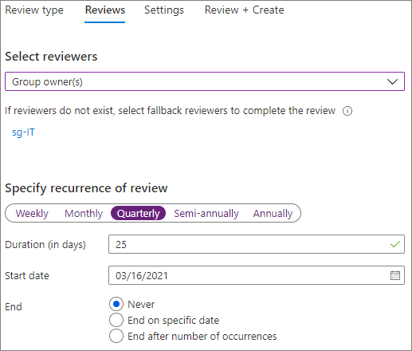
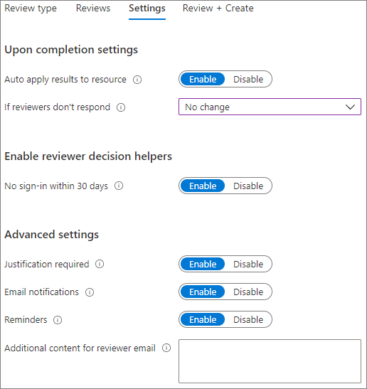

# 보안 게스트 공유 환경 만들기

이 문서에서는 Microsoft 365에서 보안 게스트 공유 환경을 만들기 위한 다양 한 옵션을 살펴보겠습니다. 다음은 사용할 수 있는 옵션에 대한 아이디어를 제공하는 예제입니다. 조직의 보안 및 규정 준수 요구 사항을 충족하기 위해 다음과 같이 다양한 조합의 절차를 사용할 수 있습니다.

이 문서에는 다음 내용이 포함됩니다.

- 게스트에 대한 다단계 인증 설정
- 게스트에 대한 사용 약관 설정
- 게스트가 계속해서 팀 및 사이트에 대해 권한이 필요한지 주기적으로 확인하기 위한 분기별 게스트 액세스 검토 설정
- 관리되지 않은 장치에 대해서는 게스트가 웹에만 액세스하도록 제한
- 게스트가 매일 인증할 수 있도록 세션 시간 제한 정책 구성
- 매우 중요한 프로젝트에 대한 중요한 정보 유형 만들기입니다.
- 중요한 정보 유형을 포함하는 문서에 대한 민감도 레이블을 자동으로 할당합니다.
- 민감도 레이블이 있는 파일에서 게스트 액세스를 자동으로 제거합니다.

이 문서에서 다루는 일부 옵션은 게스트가 Azure Active Directory의 계정이 있어야 액세스할 수 있습니다. 파일과 폴더를 공유할 때 게스트가 디렉터리에 포함되도록 하려면 [Azure AD B2B와 SharePoint 및 OneDrive의 통합(미리 보기)](/sharepoint/sharepoint-azureb2b-integration-preview)을 사용하세요.

이 문서에서는 게스트 공유 설정을 활성화하는 방법에 대해서는 다루지 않습니다. 다른 시나리오의 게스트 공유 활성화에 대해 자세히 알아보려면 [조직 외부 사용자와 공동 작업](collaborate-with-people-outside-your-organization.md)을 참조하세요.

## 게스트에 대한 다단계 인증 설정

다단계 인증은 계정이 손상될 가능성을 대폭 줄여 줍니다. 게스트는 관리 정책이나 모범 사례를 준수하지 않는 개인 이메일 계정을 사용할 가능성이 높기 때문에 게스트에 대해 다단계 인증을 요구하는 것은 특히 중요합니다. 게스트의 사용자 이름 및 비밀번호가 도난될 경우 2단계 인증을 요구하면 알 수 없는 당사자가 내 사이트 및 파일에 액세스할 가능성이 대폭 줄어듭니다.

이 예제에서는 Azure Active Directory에서 조건부 액세서 정책을 사용하여 게스트에 대한 다단계 인증을 설정합니다.

게스트에 대한 다단계 인증을 설정하려면

1. [Azure 조건부 액세스 정책](https://portal.azure.com/#blade/Microsoft_AAD_IAM/ConditionalAccessBlade)으로 이동합니다.
2. **조건부 액세스 | 정책** 블레이드에서 **새 정책** 을 클릭합니다.
3. **이름** 필드에 이름을 입력합니다.
4. **할당** 아래에서 **사용자 및 그룹** 을 클릭합니다.
5. **사용자 및 그룹** 블레이드에서 **사용자 및 그룹 선택** 을 선택하고 **모든 게스트 및 외부 사용자** 확인란을 선택합니다.
6. **할당** 에서 **클라우드 앱 또는 작업** 을 클릭합니다.
7. **클라우드 앱 또는 작업** 블레이드에 있는 **포함** 탭에서 **모든 클라우드 앱** 을 선택합니다.
8. **액세스 제어** 아래에서 **허용** 을 선택합니다.
9. **허용** 블레이드에서 **다단계 인증 필요** 확인란을 선택한 후, **선택** 을 클릭합니다.
10. **새로 만들기** 블레이드의 **정책 사용** 에서 **설정** 을 클릭한 후 **만들기** 를 클릭합니다.

이제 게스트는 공유 콘텐츠, 사이트 또는 팀에 액세스하기 전에 다단계 인증에 등록해야 합니다.

### 추가 정보

[Azure AD 다단계 인증 배포 계획](/azure/active-directory/authentication/howto-mfa-getstarted)

## 게스트에 대한 사용 약관 설정

일부의 경우에는 게스트는 조직의 비공개 계약 또는 다른 법적 계약에 서명을 하지 않은 경우가 있습니다. 게스트에게 공유된 파일에 액세스하기 전에 사용 약관이 동의하도록 요구할 수 있습니다. 처음 공유 파일 또는 사이트에 액세스하려고 시도할 때 사용 약관이 표시될 수 있습니다.

사용 약관을 만들려면 먼저 Word 또는 다른 작성 프로그램에서 문서를 만든 후에 .pdf 파일로 저장해야 합니다. 그러면 이 파일을 Azure AD에 업로드할 수 있습니다.

Azure AD 사용 약관을 만들려면

1. Azure에 전역 관리자, 보안 관리자 또는 조건부 액세스 관리자로 로그인합니다.
2. [사용 약관](https://aka.ms/catou)으로 이동합니다.
3. **새 사용 약관** 을 클릭합니다.

   

4. **이름** 을 입력하고 **이름을 표시** 합니다.
6. **사용 약관 문서** 의 경우 작성한 pdf 파일을 찾아 선택합니다.
7. 사용 약관 문서의 언어를 선택합니다.
8. **사용자가 사용 약관을 확장해야 함** 을 **켜기** 로 설정합니다.
9. **조건부 액세스** 의 **조건부 액세스 정책 템플릿으로 적용** 목록에서 **나중에 조건부 액세스 정책 만들기** 를 선택합니다.
10. **만들기** 를 클릭합니다.

사용 약관을 만들었으면 다음 단계는 게스트에게 사용 약관을 표시하는 조건부 액세스 정책을 만드는 것입니다.

조건부 액세스 정책을 만들려면

1. [Azure 조건부 액세스 정책](https://portal.azure.com/#blade/Microsoft_AAD_IAM/ConditionalAccessBlade)으로 이동합니다.
2. **조건부 액세스 | 정책** 블레이드에서 **새 정책** 을 클릭합니다.
3. **이름** 상자에 이름을 입력합니다.
4. **할당** 아래에서 **사용자 및 그룹** 을 클릭합니다.
5. **사용자 및 그룹** 블레이드에서 **사용자 및 그룹 선택** 을 선택하고 **모든 게스트 및 외부 사용자** 확인란을 선택합니다.
6. **할당** 에서 **클라우드 앱 또는 작업** 을 클릭합니다.
7. **포함** 탭에서 **앱 선택** 을 선택한 후 **선택** 을 클릭합니다.
8. **선택** 블레이드에서 **Microsoft Teams**, **Office 365 SharePoint Online**, 및 **Outlook Groups** 를 선택한 후 **선택** 을 클릭합니다.
9. **액세스 제어** 아래에서 **허용** 을 선택합니다.
10. **허용** 블레이드에서 **게스트 사용 약관** 을 선택한 후 **선택** 을 클릭합니다.
11. **새로 만들기** 블레이드의 **정책 사용** 에서 **설정** 을 클릭한 후 **만들기** 를 클릭합니다.

이제 게스트가 처음으로 콘텐츠나 조직의 팀 또는 사이트에 액세스하려고 하면 사용 약관을 수락해야 합니다.

> [!NOTE]
> 조건부 액세스를 사용 하려면 Azure AD Premium P1 라이선스가 필요합니다. 자세한 내용은 [조건부 액세스는 무엇인가요](/azure/active-directory/conditional-access/overview)를 참조하세요.

### 추가 정보

[Azure Active Directory 사용 약관](/azure/active-directory/conditional-access/terms-of-use)

## 게스트 액세스 검토 설정

Azure AD의 액세스 검토로 다양한 팀과 그룹에 대한 주기적 사용자 액세스 검토를 자동화할 수 있습니다. 특히 게스트에 대해 액세스 검토를 요청하여 게스트가 필요 이상으로 오랫동안 조직의 중요한 정보에 대한 액세스 권한을 유지하지 않도록 할 수 있습니다.

게스트 액세스 검토를 설정하는 방법

1. [ID 거버넌스 페이지](https://portal.azure.com/#blade/Microsoft_AAD_ERM/DashboardBlade)의 왼쪽 메뉴에서 **액세스 검토** 를 클릭합니다.
2. **새 액세스 검토** 를 클릭합니다.
3. **Teams + 그룹** 옵션을 선택합니다.
4. **게스트 사용자가 있는 모든 Microsoft 365 그룹** 옵션을 선택합니다. 제외하려는 그룹은 **제외할 그룹 선택** 을 클릭합니다.
5. **게스트 사용자만** 옵션을 선택하고 **다음: 검토** 를 클릭합니다.
6. **검토자 선택** 에서 **그룹 소유자** 를 선택합니다.
7. **Fallback 검토자 선택** 을 클릭하고 Fallback 컴토자를 선택한 다음, **선택** 을 클릭합니다.
8. **검토 되풀이 구체화** 에서 **분기별** 을 선택합니다.
9. 시작 날짜 및 기간을 선택합니다.
10. **종료 기간** 은 **없음** 을 선택하고 **다음: 설정** 을 선택합니다.

    

11. **설정** 탭에서 비즈니스 규칙과 규정 준수 설정을 검토합니다.

    

12. **다음: 검토 + 만들기** 를 클릭합니다.
13. **검토자 이름** 을 입력하고 설정을 검토합니다.
14. **만들기** 를 클릭합니다.

게스트가 팀이나 그룹에, 또는 개별 파일 및 폴더에 대한 액세스 권한을 받을 수 있음에 주의하는 것이 중요합니다. 파일 및 폴더에 대한 액세스 권한을 주면 게스트가 특정 그룹에 추가되지 않을 수 있습니다. 팀이나 그룹에 속하지 않은 게스트에 대한 액세스 검토를 수행하려는 경우 모든 게스트가 포함되도록 Azure AD에서 동적 그룹을 만든 후에 해당 그룹에 대한 액세스 검토를 만들면 됩니다. 사이트 소유자 또한 [사이트에 대한 게스트 만료](https://support.microsoft.com/office/25bee24f-42ad-4ee8-8402-4186eed74dea)를 관리할 수도 있습니다.

### 추가 정보

[Azure AD 액세스 검토를 사용하여 게스트 액세스 관리](/azure/active-directory/governance/manage-guest-access-with-access-reviews)

[Azure AD 액세스 검토에서 그룹 또는 애플리케이션에 대한 액세스 검토 만들기](/azure/active-directory/governance/create-access-review)

## 게스트가 웹에만 액세스할 수 있게 설정

게스트가 웹 브라우저만 사용하여 팀, 사이트 및 파일에 액세스하게 하면 공격 영역을 줄이고 관리가 용이해지게 할 수 있습니다.

Microsoft 365 그룹 및 Teams의 경우, Azure AD 조건부 액세스 정책을 사용하여 이 작업을 수행합니다. SharePoint의 경우, 이는 SharePoint 관리 센터에서 구성됩니다. (사용자는 또한 [민감도 레이블을 사용하여 게스트를 웹 전용 액세스로 제한](../compliance/sensitivity-labels-teams-groups-sites.md)할 수도 있습니다.)

그룹 및 Teams에 대해 게스트를 웹 전용 액세스로 제한하려면 다음을 수행합니다.

1. [Azure 조건부 액세스 정책](https://portal.azure.com/#blade/Microsoft_AAD_IAM/ConditionalAccessBlade)으로 이동합니다.
2. **조건부 액세스 - 정책** 블레이드에서 **새 정책** 을 클릭합니다.
3. **이름** 상자에 이름을 입력합니다.
4. **할당** 아래에서 **사용자 및 그룹** 을 클릭합니다.
5. **사용자 및 그룹** 블레이드에서 **사용자 및 그룹 선택** 을 선택하고 **모든 게스트 및 외부 사용자** 확인란을 선택합니다.
6. **할당** 에서 **클라우드 앱 또는 작업** 을 클릭합니다.
7. **포함** 탭에서 **앱 선택** 을 선택한 후 **선택** 을 클릭합니다.
8. **선택** 블레이드에서 **Microsoft Teams** 및 **Outlook Groups** 를 선택한 후 **선택** 을 클릭합니다.
9. **할당** 아래에서 **조건** 을 클릭합니다.
10. **조건** 블레이드에서 **클라이언트 앱** 을 클릭합니다.
11. **클라이언트 앱** 블레이드에서 **구성** 의 경우 **예** 를 클릭하고 **모바일 앱 및 데스크톱 클라이언트**, **Exchange ActiveSync 클라이언트** 그리고 **기타 클라이언트** 설정을 선택합니다. **브라우저** 확인란을 선택 취소합니다.

    

12. **완료** 를 클릭합니다.
13. **액세스 제어** 아래에서 **허용** 을 선택합니다.
14. **허용** 블레이드에서 **디바이스를 준수 상태로 표시해야 함** 및 **하이브리드 Azure AD 조인 디바이스 필요** 를 선택합니다.
15. **다중 컨트롤의 경우** 아래에서 **선택한 컨트롤 중 하나 필요** 를 선택한 후 **선택** 을 클릭합니다.
16. **새로 만들기** 블레이드의 **정책 사용** 에서 **설정** 을 클릭한 후 **만들기** 를 클릭합니다.

SharePoint에 대해 게스트를 웹 전용 액세스로 제한하려면 다음을 수행합니다.

1. [SharePoint 관리 센터](https://admin.microsoft.com/sharepoint)에서 **정책** 을 확장하고 **액세스 제어** 를 클릭합니다.
2. **비관리형 장치** 를 클릭합니다.
3. **제한된 웹 전용 액세스를 허용** 옵션을 선택한 다음 **저장** 을 클릭합니다.

SharePoint 관리 센터의 이 설정은 Azure AD에 지원 조건부 액세스 정책을 만듭니다.

## 게스트에 대한 세션 시간 제한 구성

게스트가 정기적으로 인증하도록 요구하면 게스트의 장치가 보안이 유지되지 않을 경우 조직의 콘텐츠에 알 수 없는 사용자가 액세스할 가능성이 줄어들 수 있습니다. Azure AD에서 게스트에 대해 세션 시간 제한 조건부 액세스 정책을 구성할 수 있습니다.

게스트 세션 시간 제한 정책을 구성하려면

1. [Azure 조건부 액세스 정책](https://portal.azure.com/#blade/Microsoft_AAD_IAM/ConditionalAccessBlade)으로 이동합니다.
2. **조건부 액세스 - 정책** 블레이드에서 **새 정책** 을 클릭합니다.
3. **이름** 상자에 *게스트 세션 시간 제한* 을 입력합니다.
4. **할당** 아래에서 **사용자 및 그룹** 을 클릭합니다.
5. **사용자 및 그룹** 블레이드에서 **사용자 및 그룹 선택** 을 선택하고 **모든 게스트 및 외부 사용자** 확인란을 선택합니다.
6. **할당** 에서 **클라우드 앱 또는 작업** 을 클릭합니다.
7. **포함** 탭에서 **앱 선택** 을 선택한 후 **선택** 을 클릭합니다.
8. **선택** 블레이드에서 **Microsoft Teams**, **Office 365 SharePoint Online**, 및 **Outlook Groups** 를 선택한 후 **선택** 을 클릭합니다.
9. **액세스 제어** 아래에서 **세션** 을 클릭합니다.
10. **세션** 블레이드에서 **로그인 빈도** 를 선택합니다.
11. 시간에서 **1** 과 **일** 을 선택한 후 **선택** 을 클릭합니다.
12. **새로 만들기** 블레이드의 **정책 사용** 에서 **설정** 을 클릭한 후 **만들기** 를 클릭합니다.

## 매우 중요한 프로젝트에 대한 중요한 정보 유형 만들기

중요한 정보 유형은 규정 준수 요구 사항을 적용하기 위해 정책 워크플로에 사용할 수 있는 미리 정의된 문자열입니다. Microsoft 365 규정 준수 센터는 운전면허증 번호, 신용카드 번호, 은행 계좌 번호 등을 포함한 100개 넘는 중요한 정보 유형을 제공합니다.

조직에 특정화된 콘텐츠를 관리하기 위해 사용자 지정 중요한 정보 유형을 만들 수도 있습니다. 이 예제에서는 매우 중요한 프로젝트에 대한 사용자 지정 중요한 정보 유형을 만들어봅니다. 그런 다음 이 중요한 정보 유형을 사용하여 민감도 레이블을 자동으로 적용할 수 있습니다.

사용자 지정 중요한 정보 유형을 만들려면

1. [Microsoft 365 규정 준수 센터](https://compliance.microsoft.com)의 왼쪽 탐색에서 **분류** 를 확장한 후 **중요한 정보 유형** 을 클릭합니다.
2. **만들기** 를 클릭합니다.
3. **이름** 과 **설명** 에 **프로젝트 Saturn** 을 입력한 후 **다음** 을 클릭합니다.
4. **요소 추가** 를 클릭합니다.
5. **다음이 포함된 콘텐츠 검색** 목록에서 **키워드** 를 선택한 후 키워드 상자에 *프로젝트 Saturn* 을 입력합니다.
6. **다음** 을 클릭한 후 **마침** 을 클릭합니다.
7. 중요한 정보 유형을 테스할지 묻는 메시지가 표시되면 **아니요** 를 클릭합니다.

### 추가 정보

[사용자 지정 중요한 정보 유형](/Office365/SecurityCompliance/custom-sensitive-info-types)

## 중요한 정보 유형을 기반으로 민감도 레이블을 할당할 자동 레이블 지정 정책 만들기

조직에서 민감도 레이블을 사용하는 경우, 정의된 중요한 정보 유형을 포함하는 파일에 자동으로 레이블을 적용할 수 있습니다. 

자동 레이블 지정 정책을 만들려면 다음을 수행하세요.

1. [Microsoft 365 규정 준수 관리 센터](https://compliance.microsoft.com)를 엽니다.
2. 왼쪽 탐색 창에서 **정보 보호** 를 클릭합니다.
3. **자동 레이블 지정** 탭에서 **자동 레이블 지정 정책 만들기** 을 클릭합니다.
4. **이 레이블을 적용하려는 정보 선택** 페이지에서 **사용자 지정** 을 선택하고 **다음** 을 클릭합니다.
5. 정책의 이름과 설명을 입력하고 **다음** 을 클릭합니다.
6. **레이블을 적용할 위치 선택** 페이지에서 **SharePoint 사이트** 를 켜고 **사이트 선택** 을 클릭합니다.
7. 자동 레이블 지정을 설정하려는 사이트의 URL을 추가하고 **완료** 를 클릭합니다.
8. **다음** 을 클릭합니다.
9. **일반 또는 고급 규칙 설정** 페이지에서 **일반 규칙** 을 선택하고 **다음** 을 클릭합니다.
10. **모든 위치에서 콘텐츠에 대한 규칙 정의** 페이지에서 **새 규칙** 을 클릭합니다.
11. **새 규칙** 페이지에서 규칙 이름을 지정하고 **조건 추가** 를 클릭한 다음, **콘텐츠에 중요한 정보 유형 포함** 을 클릭합니다.
12. **추가** 를 클릭하고 **중요한 정보 유형** 을 클릭하고, 사용하려는 중요한 정보 유형을 선택하고 **추가** 를 클릭한 다음, **저장** 을 클릭합니다.
13. **다음** 을 클릭합니다.
14. **레이블 선택** 을 클릭하고 사용하려는 레이블을 선택한 다음 **추가** 를 클릭합니다. 
15. **다음** 을 클릭합니다.
16. 정책을 시뮬레이션 모드로 두고 **다음** 을 클릭합니다.
17. **정책 만들기** 를 클릭한 후 **완료** 를 클릭합니다.

정책이 준비되었으면 사용자가 "프로젝트 Saturn"을 문서에 입력하는 경우, 자동 레이블 지정 정책이 파일을 스캔할 때 지정된 레이블을 자동으로 적용합니다.

### 추가 정보

[민감도 레이블을 콘텐츠에 자동으로 적용](../compliance/apply-sensitivity-label-automatically.md)

## 매우 중요한 파일에 대한 게스트 액세스 권한을 제거할 DLP 정책 만들기

[DLP(데이터 손실 방지)](../compliance/dlp-learn-about-dlp.md)를 사용하여 중요한 콘텐츠의 원치 않는 게스트와의 공유를 방지할 수 있습니다. 데이터 손실 방지는 파일의 민감도 레이블에 따라 조치를 취하고 게스트 액세스를 제거할 수 있습니다.

DLP 규칙을 만들려면 다음을 수행합니다.

1. Microsoft 365 준수 관리 센터에서 [데이터 손실 방지 페이지](https://compliance.microsoft.com/datalossprevention)로 이동합니다.
2. **정책 만들기** 를 클릭합니다.
3. **사용자 지정** 을 선택하고 **다음** 을 클릭합니다.
4. 정책 이름을 입력한 후 **다음** 을 클릭합니다.
5. **정책을 적용할 위치** 페이지에서 **SharePoint 사이트** 및 **OneDrive 계정** 을 제외한 모든 설정을 해제한 후 **다음** 을 클릭합니다.
6. **정책 설정 정의** 페이지에서 **다음** 을 클릭합니다.
7. **고급 DLP 규칙 사용자 지정** 페이지에서 **규칙 만들기** 를 클릭하고 규칙의 이름을 입력합니다.
8. **조건** 에서 **조건 추가** 를 클릭하고 **콘텐츠 포함** 을 선택합니다.
9. **추가** 를 클릭하고 **민감도 레이블** 을 선택하고, 사용하려는 레이블을 선택하고 **추가** 를 클릭합니다.

   

10. **작업** 에서 **작업 추가** 를 클릭하고 **액세스를 제한하거나 Microsoft 365 위치에서 콘텐츠를 암호화** 를 선택합니다.
11. **액세스를 제한하거나 Microsoft 365 위치에서 콘텐츠를 암호화** 확인란을 선택한 다음 **조직 외부 사용자만** 옵션을 선택합니다.

      

12. **저장** 을 클릭한 다음 **다음** 을 클릭합니다.
13. 테스트 옵션을 선택하고 **다음** 을 클릭합니다.
14. **제출** 을 클릭한 다음 **완료** 를 클릭합니다.

게스트가 전체적으로 사이트나 팀의 구성원인 경우에는 정책이 액세스를 제거하지 않음에 유의하도록 합니다. 게스트 구성원이 포함된 사이트 또는 팀의 매우 중요한 문서를 마련할 계획이면 [팀 내 비공개 채널](https://support.microsoft.com/office/de3e20b0-7494-439c-b7e5-75899ebe6a0e)을 사용하고 비공개 채널의 조직 구성원에게만 허용하는 방법을 고려하세요.

## 추가 옵션

Microsoft 365 및 Azure Active Directory에는 게스트 공유 환경을 보호하는 데 도움이 되는 몇 가지 추가 옵션이 있습니다.

- 사용자가 공유할 수 있는 사람을 제한하기 위해 허용 또는 거부된 공유 도메인 목록을 만들 수 있습니다. 자세한 내용은 [도메인별 SharePoint 및 OneDrive 콘텐츠 공유 제한](/sharepoint/restricted-domains-sharing) 및 [특정 조직의 B2B 사용자에게 초대 허용 또는 차단](/azure/active-directory/b2b/allow-deny-list)을 참조하십시오.
- 사용자가 연결할 수 있는 다른 Azure Active Directory 테넌트를 제한할 수 있습니다. 자세한 내용은 [테넌트 제한을 사용하여 SaaS 클라우드 응용 프로그램에 대한 액세스 관리](/azure/active-directory/manage-apps/tenant-restrictions)를 참조하세요.
- 파트너가 게스트 계정을 관리할 수 있는 관리형 환경을 만들 수 있습니다. 자세한 내용은 [관리 대상 게스트와 B2B 엑스트라넷 작성](/Office365/Enterprise/b2b-extranet)을 참조하십시오.

## 참고 항목

[게스트와 공유할 때 파일에 실수로 발생하는 노출을 제한](share-limit-accidental-exposure.md)

[인증되지 않은 사용자와 파일 및 폴더를 공유하는 모범 사례](best-practices-anonymous-sharing.md)

[관리 대상 게스트와 B2B 엑스트라넷 작성](b2b-extranet.md)