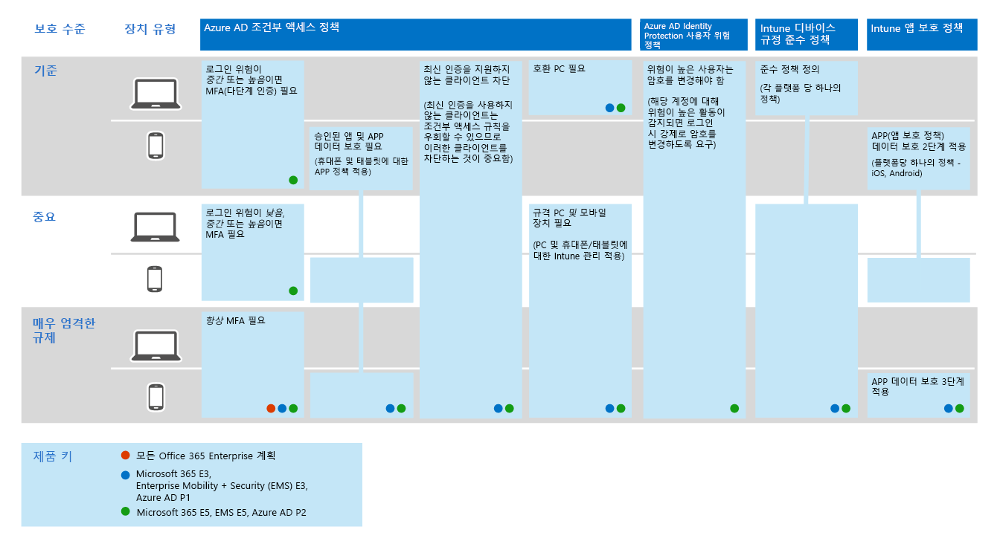

# Microsoft 365에서 위협 보호 기능 구성Configure threat protection capabilities across Microsoft 365

다음 단계에 따라 Microsoft 365에서 위협 보호를 구성 합니다.Follow these steps to configure threat protection across Microsoft 365.

## 1 단계: 다단계 인증 및 조건부 액세스 정책 설정Step 1: Set up multi-factor authentication and conditional access policies

MFA ( [multi-factor authentication](https://docs.microsoft.com/azure/active-directory/authentication/concept-mfa-howitworks) )를 사용 하려면 사용자가 전화 통화 또는 인증자 앱을 사용 하 여 id를 확인 해야 합니다.[Multi-factor authentication](https://docs.microsoft.com/azure/active-directory/authentication/concept-mfa-howitworks) (MFA) requires users to verify their identity with a phone call or authenticator app. [조건부 액세스 정책은](https://docs.microsoft.com/azure/active-directory/conditional-access/overview) 사용자가 Microsoft 365에서 앱 및 데이터에 액세스 하기 위해 충족 해야 하는 특정 요구 사항을 정의 합니다.[Conditional access policies](https://docs.microsoft.com/azure/active-directory/conditional-access/overview) define certain requirements that must be met in order for users to access apps and data in Microsoft 365. MFA와 조건부 액세스 정책은 함께 작동 하 여 조직을 보호 합니다.MFA and conditional access policies work together to protect your organization. 예를 들어 사용자가 MFA를 사용 하도록 설정 되지 않은 계정을 사용 하 여 모바일 장치에서 로그인을 시도 하는 경우 조건부 액세스 정책에 MFA를 적용 해야 하는 경우 해당 사용자의 로그인이 차단 됩니다.For example, if someone attempts to sign in from a mobile device using an account that  is not enabled for MFA, and a conditional access policy requires MFA to be in effect, that user will be prevented from signing in.  

Microsoft는 모든 SaaS 응용 프로그램 (특히 Microsoft 365)에 대 한 액세스를 보호 하기 위한 특정 조건부 액세스 및 관련 정책 집합을 테스트 하 고 권장 합니다.Microsoft has tested and recommends a specific set of conditional access and related policies for protecting access to all of your SaaS applications, especially Microsoft 365. 기준, 중요 및 높은 규제 된 보호에 대 한 정책은 권장 됩니다.Policies are recommended for baseline, sensitive, and highly regulated protection. 먼저 기준 보호에 대 한 정책을 구현 합니다.Begin by implementing the policies for baseline protection. 

 
 [더 큰 버전의 이미지를 참조 하세요](https://github.com/MicrosoftDocs/microsoft-365-docs/raw/public/microsoft-365/media/Identity_device_access_policies_byplan.png) .
[See a larger version of this image](https://github.com/MicrosoftDocs/microsoft-365-docs/raw/public/microsoft-365/media/Identity_device_access_policies_byplan.png)

### Microsoft 365에 대 한 기본 보호를 구현 하려면To implement baseline protection for Microsoft 365

 

1. [Azure Id 보호를 포함 한 필수 구성 요소를 구성](../enterprise/identity-access-prerequisites.md)합니다.[Configure prerequisites, including Azure Identity Protection](../enterprise/identity-access-prerequisites.md).
2. 기본 보호에 대 한 [일반 id 및 장치 액세스 정책을 구성](../enterprise/identity-access-policies.md) 합니다.[Configure common identity and device access policies](../enterprise/identity-access-policies.md) for baseline protection.
3. [게스트 사용자](../enterprise/identity-access-policies-guest-access.md), [Microsoft 팀](../enterprise/teams-access-policies.md), [Exchange Online](../enterprise/secure-email-recommended-policies.md)및 [SharePoint online 및 OneDrive](../enterprise/sharepoint-file-access-policies.md)에 대 한 정책을 구성 합니다.Configure policies for [guest users](../enterprise/identity-access-policies-guest-access.md), [Microsoft Teams](../enterprise/teams-access-policies.md), [Exchange Online](../enterprise/secure-email-recommended-policies.md), and [SharePoint Online and OneDrive](../enterprise/sharepoint-file-access-policies.md).

### Id 보호에 대 한 추가 정보More information about protecting identities

- [ID 및 장치 액세스 구성Identity and device access configurations](../enterprise/microsoft-365-policies-configurations.md)
- [Azure MFA에 대 한 보안 지침Security guidance for Azure MFA](https://docs.microsoft.com/azure/active-directory/authentication/multi-factor-authentication-security-best-practices)

## 2 단계: Azure Advanced Threat Protection 구성Step 2: Configure Azure Advanced Threat Protection

[AZURE ATP (Advanced Threat Protection](https://docs.microsoft.com/azure-advanced-threat-protection/what-is-atp) )는 온-프레미스 [Azure Active Directory](https://docs.microsoft.com/azure/active-directory/fundamentals/active-directory-whatis) 에서 작동 하는 클라우드 기반 보안 솔루션으로, 사용자가 조직에서 보낸 고급 위협, 손상 된 id 및 악의적인 참가자 작업을 식별, 감지 및 조사 합니다.[Azure Advanced Threat Protection](https://docs.microsoft.com/azure-advanced-threat-protection/what-is-atp) (Azure ATP) is a cloud-based security solution that works with your on-premises [Azure Active Directory](https://docs.microsoft.com/azure/active-directory/fundamentals/active-directory-whatis) signals to identify, detect, and investigate advanced threats, compromised identities, and malicious insider actions directed at your organization.

Azure ATP에서는 하이브리드 환경의 고급 공격을 검색 하는 데 사용할 수 있는 보안 작업 (SecOps) 분석가 및 보안 전문가가 다음을 수행 합니다.Azure ATP enables security operations (SecOps) analysts and security professionals struggling to detect advanced attacks in hybrid environments to:
- 학습 기반 분석을 사용 하 여 사용자, 엔터티 동작 및 활동을 모니터링 합니다.Monitor users, entity behavior, and activities with learning-based analytics.
- Active Directory에 저장된 사용자 ID와 자격 증명을 보호합니다.Protect user identities and credentials stored in Active Directory.
- 킬체인에서 수상한 사용자 활동과 고급 공격을 식별하고 조사합니다.Identify and investigate suspicious user activities and advanced attacks throughout the kill chain.
- 빠른 분류를 위해 간단한 시간 표시 막대에 명확한 인시던트 정보를 제공합니다.Provide clear incident information on a simple timeline for fast triage.

### Azure ATP를 설정 하려면To set up Azure ATP

 

1. [AZURE ATP를 설정](https://docs.microsoft.com/azure-advanced-threat-protection/install-atp-step1) 하 여 기본 환경을 보호 합니다.[Set up Azure ATP](https://docs.microsoft.com/azure-advanced-threat-protection/install-atp-step1) to protect your primary environments.
2. 모든 [도메인 컨트롤러](https://docs.microsoft.com/azure-advanced-threat-protection/atp-sensor-monitoring) 와 [포리스트](https://docs.microsoft.com/azure-advanced-threat-protection/atp-multi-forest)를 보호 합니다.Protect all your [domain controllers](https://docs.microsoft.com/azure-advanced-threat-protection/atp-sensor-monitoring) and [forests](https://docs.microsoft.com/azure-advanced-threat-protection/atp-multi-forest).
3. [AZURE ATP 알림을](https://docs.microsoft.com/azure-advanced-threat-protection/suspicious-activity-guide?tabs=external) 보안 작업 (secops) 워크플로에 통합 합니다.Integrate [Azure ATP alerts](https://docs.microsoft.com/azure-advanced-threat-protection/suspicious-activity-guide?tabs=external) into your security operations (SecOps) workflow.

### Azure ATP에 대 한 추가 정보More information about Azure ATP

- [Azure ATP란 무엇인가요?What is Azure ATP?](https://docs.microsoft.com/azure-advanced-threat-protection/what-is-atp)
- [비디오: Azure ATP 소개Video: Introduction to Azure ATP](https://www.youtube.com/watch?reload=9&v=EGY2m8yU_KE)
- [Azure ATP 배포Azure ATP deployment](https://docs.microsoft.com/azure-advanced-threat-protection/what-is-atp#whats-next)

## 3 단계: Microsoft Threat Protection 설정Step 3: Turn on Microsoft Threat Protection

[Microsoft Threat Protection](https://docs.microsoft.com/microsoft-365/security/mtp/microsoft-threat-protection) 은 신호 및 orchestrates 기능을 단일 솔루션에 결합 합니다.[Microsoft Threat Protection](https://docs.microsoft.com/microsoft-365/security/mtp/microsoft-threat-protection) combines signals and orchestrates capabilities into a single solution. 통합 Microsoft 위협 보호 솔루션을 사용 하는 경우 보안 전문가는 이러한 각 제품이 수신 하 고 위협의 모든 범위와 영향을 결정 하는 위협 신호를 함께 연결할 수 있습니다. 환경의 진입 방식, 영향을 받는 대상 및 현재 조직에 영향을 주는 방법With the integrated Microsoft Threat Protection solution, security professionals can stitch together the threat signals that each of these products receive and determine the full scope and impact of the threat; how it entered the environment, what it's affected, and how it's currently impacting the organization. Microsoft Threat Protection은 공격을 방지 하거나 중지 하는 자동 작업을 수행 하 고 영향을 받는 사서함, 끝점 및 사용자 id를 자체 치유 합니다.Microsoft Threat Protection takes automatic action to prevent or stop the attack and self-heal affected mailboxes, endpoints, and user identities.

Microsoft Threat Protection은 작업 (Azure ATP, Office 365 ATP, Microsoft Defender ATP 및 Microsoft Cloud App Security) 전반에 경고, 문제, 자동화 된 조사 및 대응 및 고급 검사를 통합 하 여 유리 환경의 단일 창에 제공 합니다.Microsoft Threat Protection unifies alerts, incidents, automated investigation and response, and advanced hunting across workloads (Azure ATP, Office 365 ATP, Microsoft Defender ATP, and Microsoft Cloud App Security) into a single pane of glass experience. Advanced threat protection 서비스를 하나 이상 구성한 후에는 Microsoft Threat Protection을 사용 하도록 설정 합니다.After you have configured one or more of your advanced threat protection services, turn on Microsoft Threat Protection. 새로운 기능은 Microsoft Threat Protection에 지속적으로 추가 됩니다. 미리 보기 기능을 받으려면 옵트인을 고려 하세요.New features are added continually to Microsoft Threat Protection; consider opting in to receive preview features.

### Microsoft Threat Protection을 설정 하려면To set up Microsoft Threat Protection

 

1. [필수 구성 요소를 검토](https://docs.microsoft.com/microsoft-365/security/mtp/prerequisites)합니다.[Review the prerequisites](https://docs.microsoft.com/microsoft-365/security/mtp/prerequisites).
2. [Microsoft Threat Protection을 사용 하도록 설정](https://docs.microsoft.com/microsoft-365/security/mtp/mtp-enable)합니다.[Turn on Microsoft Threat Protection](https://docs.microsoft.com/microsoft-365/security/mtp/mtp-enable).
3. [미리 보기 기능에 옵트인](https://docs.microsoft.com/microsoft-365/security/mtp/preview)합니다.[Opt in for preview features](https://docs.microsoft.com/microsoft-365/security/mtp/preview).

### Microsoft Threat Protection에 대 한 추가 정보More information about Microsoft Threat Protection

- [Microsoft 위협 방지란 무엇인가요?What is Microsoft Threat Protection?](https://docs.microsoft.com/microsoft-365/security/mtp/microsoft-threat-protection)
- [Microsoft Threat Protection의 새로운 기능What's new in Microsoft Threat Protection](https://docs.microsoft.com/microsoft-365/security/mtp/whats-new)

## 4 단계: Office 365 Advanced Threat Protection 구성Step 4: Configure Office 365 Advanced Threat Protection

[Office 365 Advanced Threat Protection](https://docs.microsoft.com/microsoft-365/security/office-365-security/office-365-atp) (OFFICE 365 ATP)은 전자 메일 메시지 (첨부 파일 및 url), Office 문서 및 공동 작업 도구에서 악의적인 위협 으로부터 조직을 보호 합니다.[Office 365 Advanced Threat Protection](https://docs.microsoft.com/microsoft-365/security/office-365-security/office-365-atp) (Office 365 ATP) safeguards your organization against malicious threats in email messages (attachments and URLs), Office documents, and collaboration tools. 다음 표에는 Microsoft 365 E5에 포함 된 Office 365 ATP 기능과 기능이 나와 있습니다.The following table lists Office 365 ATP features and capabilities that are included in Microsoft 365 E5:

|구성, 보호 및 검색 기능Configuration, protection, and detection capabilities|자동화, 조사, 수정 및 교육 기능Automation, investigation, remediation, and education capabilities|
|---|---|
|[안전한 첨부 파일Safe Attachments](https://docs.microsoft.com/microsoft-365/security/office-365-security/atp-safe-attachments) [안전한 링크Safe Links](https://docs.microsoft.com/microsoft-365/security/office-365-security/atp-safe-links) [안전한 문서Safe Documents](https://docs.microsoft.com/microsoft-365/security/office-365-security/safe-docs) [SharePoint, OneDrive 및 Microsoft Teams에 대한 ATPATP for SharePoint, OneDrive, and Microsoft Teams](https://docs.microsoft.com/microsoft-365/security/office-365-security/atp-for-spo-odb-and-teams) [ATP 피싱 방지 보호 기능ATP anti-phishing protection](https://docs.microsoft.com/microsoft-365/security/office-365-security/set-up-anti-phishing-policies#exclusive-settings-in-atp-anti-phishing-policies)|[위협 트래커Threat Trackers](https://docs.microsoft.com/microsoft-365/security/office-365-security/threat-trackers) [위협 탐색기Threat Explorer](https://docs.microsoft.com/microsoft-365/security/office-365-security/threat-explorer) [자동화된 조사 및 응답Automated investigation and response](https://docs.microsoft.com/microsoft-365/security/office-365-security/office-365-air) [공격 시뮬레이터Attack Simulator](https://docs.microsoft.com/microsoft-365/security/office-365-security/attack-simulator)|
|

Office 365 ATP를 사용 하면 조직의 사용자가 전자 메일 콘텐츠 및 Office 문서에 대 한 위협 보호를 통해 통신을 보다 안전 하 게 진행 하 고 공동으로 작업할 수 있습니다.With Office 365 ATP, people across your organization can communicate and collaborate more securely, with threat protection for their email content and Office documents.

### Office 365 ATP를 설정 하려면To set up Office 365 ATP

 

1. [Office 365 ATP 정책을 설정 하 고 구성](https://docs.microsoft.com/microsoft-365/security/office-365-security/protect-against-threats)합니다.[Set up and configure your Office 365 ATP policies](https://docs.microsoft.com/microsoft-365/security/office-365-security/protect-against-threats).
2. [Office 365 ATP 보고서를 보고 사용](https://docs.microsoft.com/microsoft-365/security/office-365-security/view-reports-for-atp)합니다.[View and use your Office 365 ATP reports](https://docs.microsoft.com/microsoft-365/security/office-365-security/view-reports-for-atp).
3. [위협 조사 및 응답 기능을 사용](https://docs.microsoft.com/microsoft-365/security/office-365-security/office-365-ti)합니다.[Use threat investigation and response capabilities](https://docs.microsoft.com/microsoft-365/security/office-365-security/office-365-ti).

### Office 365 ATP에 대 한 추가 정보More information about Office 365 ATP

- [Office 365 ATP 개요Office 365 ATP overview](https://docs.microsoft.com/microsoft-365/security/office-365-security/office-365-atp)
- [Office 365 ATP의 새로운 기능What's new in Office 365 ATP](https://docs.microsoft.com/microsoft-365/security/office-365-security/whats-new-in-office-365-atp)

## 5 단계: Microsoft Defender Advanced Threat Protection 구성Step 5: Configure Microsoft Defender Advanced Threat Protection

Microsoft [Defender Advanced Threat Protection](https://docs.microsoft.com/windows/security/threat-protection) (MICROSOFT defender ATP)은 cyberthreats, Advanced 공격 및 데이터 위반 으로부터 조직 장치 (종점이 라고도 함)를 보호 합니다.[Microsoft Defender Advanced Threat Protection](https://docs.microsoft.com/windows/security/threat-protection) (Microsoft Defender ATP) protects your organizations devices (also referred to as endpoints) from cyberthreats, advanced attacks, and data breaches. 보안 팀은 해당 끝점의 보안을 관리 하는 것이 보다 효율적입니다.Security teams can be more efficient in managing the security of their endpoints. 강력한 도구는 조직이 [위협 및 취약성 관리](https://docs.microsoft.com/windows/security/threat-protection/microsoft-defender-atp/next-gen-threat-and-vuln-mgt)에 대 한 취약성 검색을 사용 하 여 패치가 적용 되지 않은 시스템을 유지 하도록 지원 합니다.Robust tools help organizations keep up with unpatched systems using  vulnerability detection with [Threat and Vulnerability management](https://docs.microsoft.com/windows/security/threat-protection/microsoft-defender-atp/next-gen-threat-and-vuln-mgt). [공격 표면 축소](https://docs.microsoft.com/windows/security/threat-protection/microsoft-defender-atp/overview-attack-surface-reduction), [차세대 보호](https://docs.microsoft.com/windows/security/threat-protection/windows-defender-antivirus/windows-defender-antivirus-in-windows-10), [끝점 검색 및 응답과](https://docs.microsoft.com/windows/security/threat-protection/microsoft-defender-atp/overview-endpoint-detection-response)같은 자동화 된 검색 및 재구성 기능 및 [자동화 된 조사 및 개선](https://docs.microsoft.com/windows/security/threat-protection/microsoft-defender-atp/automated-investigations) 도움말-장치를 맬웨어에 안전 하 게 유지 합니다.Automated detection and remediation capabilities, such as [attack surface reduction](https://docs.microsoft.com/windows/security/threat-protection/microsoft-defender-atp/overview-attack-surface-reduction), [next-generation protection](https://docs.microsoft.com/windows/security/threat-protection/windows-defender-antivirus/windows-defender-antivirus-in-windows-10), [endpoint detection and response](https://docs.microsoft.com/windows/security/threat-protection/microsoft-defender-atp/overview-endpoint-detection-response), and [automated investigation and remediation](https://docs.microsoft.com/windows/security/threat-protection/microsoft-defender-atp/automated-investigations) help keep your devices safe from malware. 이러한 기능을 통해 고객은 옵트인 알림을 받을 수 있으며, 필요에 따라 Microsoft 위협 전문가와 의견을 사용 하 여 관리 되는 사냥 서비스의 일부로도 도움이 됩니다.On top of these capabilities, customers can get proactive notifications and consult with Microsoft Threat Experts on demand, as part of the opt-in managed hunting service. 

### Microsoft Defender ATP 설정Set up Microsoft Defender ATP

 

1. [Microsoft DEFENDER ATP 배포를 준비](https://docs.microsoft.com/windows/security/threat-protection/microsoft-defender-atp/deployment-phases)합니다.[Prepare your Microsoft Defender ATP deployment](https://docs.microsoft.com/windows/security/threat-protection/microsoft-defender-atp/deployment-phases).
2. [Microsoft Defender ATP 배포 설정Set up your Microsoft Defender ATP deployment](https://docs.microsoft.com/windows/security/threat-protection/micros.oft-defender-atp/production-deployment)
3. [Microsoft DEFENDER ATP 서비스에 내장 되어](https://docs.microsoft.com/windows/security/threat-protection/microsoft-defender-atp/onboarding)있습니다.[Onboard to the Microsoft Defender ATP service](https://docs.microsoft.com/windows/security/threat-protection/microsoft-defender-atp/onboarding).
4. [최상위 보안 관리 작업을 완료](https://docs.microsoft.com/windows/security/threat-protection/microsoft-defender-atp/tvm-security-recommendation)합니다.[Complete your top security administrative tasks](https://docs.microsoft.com/windows/security/threat-protection/microsoft-defender-atp/tvm-security-recommendation).

### Microsoft Defender ATP에 대 한 추가 정보More information about Microsoft Defender ATP

- 자세한 내용은 [Microsoft DEFENDER ATP](https://docs.microsoft.com/windows/security/threat-protection)를 확인 하세요.[Learn more about Microsoft Defender ATP](https://docs.microsoft.com/windows/security/threat-protection).
- [Microsoft DEFENDER ATP 평가 랩을 사용해 보세요](https://docs.microsoft.com/windows/security/threat-protection/microsoft-defender-atp/evaluation-lab).[Try the Microsoft Defender ATP evaluation lab](https://docs.microsoft.com/windows/security/threat-protection/microsoft-defender-atp/evaluation-lab).

## 6 단계: Microsoft Cloud App Security 구성Step 6: Configure Microsoft Cloud App Security

[Microsoft Cloud App security](https://docs.microsoft.com/cloud-app-security) 는 로그 수집, API 커넥터 및 역방향 프록시를 지 원하는 클라우드 액세스 보안 브로커입니다.[Microsoft Cloud App Security](https://docs.microsoft.com/cloud-app-security) is a Cloud Access Security Broker that supports log collection, API connectors, and reverse proxy. Microsoft Cloud App Security는 모든 클라우드 서비스에서 cyberthreats를 식별 하 고 공격 하기 위한 다양 한 가시성, 데이터 이동에 대 한 제어 및 정교한 분석 기능을 제공 합니다.Microsoft Cloud App Security provides rich visibility, control over data travel, and sophisticated analytics to identify and combat cyberthreats across all your cloud services. Microsoft Cloud App Security를 사용 하는 경우 보안 작업을 통해 조직의 중요 한 정보를 보호 하 고, cyberthreats 및 무단 으로부터 보호 하 고, 조직의 데이터에 액세스 하는 앱을 검색 및 모니터링 하며, 조직의 클라우드 앱이 준수 요구 사항을 충족 하는지 확인할 수 있습니다.With Microsoft Cloud App Security, your security operations can protect your organization's sensitive information, protect against cyberthreats and anomalies, discover and monitor apps that access your organization's data, and help make sure your organization's cloud apps meet compliance requirements.

### Microsoft Cloud App Security 설정Set up Microsoft Cloud App Security

 

1. [포털 및 기타 기본 요구 사항을 설정](https://docs.microsoft.com/cloud-app-security/general-setup)합니다.[Set up the portal and other basic requirements](https://docs.microsoft.com/cloud-app-security/general-setup).
2. [클라우드 검색을 설정](https://docs.microsoft.com/cloud-app-security/set-up-cloud-discovery) 하 고 [앱을 연결](https://docs.microsoft.com/cloud-app-security/enable-instant-visibility-protection-and-governance-actions-for-your-apps)합니다.[Set up cloud discovery](https://docs.microsoft.com/cloud-app-security/set-up-cloud-discovery) and [connect apps](https://docs.microsoft.com/cloud-app-security/enable-instant-visibility-protection-and-governance-actions-for-your-apps).
3. [추천 앱에 대해 조건부 액세스 앱 컨트롤을 배포](https://docs.microsoft.com/cloud-app-security/proxy-deployment-aad)합니다.[Deploy conditional access app control for featured apps](https://docs.microsoft.com/cloud-app-security/proxy-deployment-aad).
4. [조사 도구와 대시보드를 사용](https://docs.microsoft.com/cloud-app-security/investigate)합니다.[Use the investigation tools and dashboards](https://docs.microsoft.com/cloud-app-security/investigate).

### Microsoft Cloud App Security에 대한 자세한 정보More information about Microsoft Cloud App Security

- [새로운 기능을 검토](https://docs.microsoft.com/cloud-app-security/release-notes)합니다.[Review new features and capabilities](https://docs.microsoft.com/cloud-app-security/release-notes).
- [Microsoft Cloud App Security에 대해 자세히 알아보세요](https://docs.microsoft.com/cloud-app-security/what-is-cloud-app-security).[Learn more about Microsoft Cloud App Security](https://docs.microsoft.com/cloud-app-security/what-is-cloud-app-security).

## 7 단계: 상태 모니터링 및 작업 수행Step 7: Monitor status and take actions

위협 방지 서비스와 기능을 설정 하 고 배포한 후에는 위협 검색을 모니터링 하 고 적절 한 조치를 취해야 합니다.After you have set up and deployed your threat protection services and capabilities, your next step is to monitor threat detections, and take appropriate actions. 가장 좋은 출발점은 Microsoft 365 보안 센터 () 이며 [https://security.microsoft.com](https://security.microsoft.com) ,이를 통해 마이크로소프트 id, 데이터, 장치, 앱 및 인프라에서 보안을 모니터링 하 고 관리할 수 있습니다.Your best starting point is the Microsoft 365 security center ([https://security.microsoft.com](https://security.microsoft.com)), where you can monitor and managing security across your Microsoft identities, data, devices, apps, and infrastructure. 

Microsoft 365 보안 센터는 특히 보안 관리자 및 보안 운영 팀을 위한 것입니다.The Microsoft 365 security center is specifically intended for security admins and security operations teams. Microsoft 365 보안 센터에서는 다음을 수행할 수 있습니다.In the Microsoft 365 security center, you can:
- [보안 점수](https://docs.microsoft.com/microsoft-365/security/mtp/microsoft-secure-score)를 사용 하 여 조직의 전반적인 보안 상태를 확인 합니다.View the overall security health of your organization with [Secure Score](https://docs.microsoft.com/microsoft-365/security/mtp/microsoft-secure-score).
- Id, 데이터, 장치, 앱 및 인프라의 상태에 대 한 [보고서를 모니터링 하 고 확인](https://docs.microsoft.com/microsoft-365/security/mtp/monitoring-and-reporting) 합니다.[Monitor and view reports](https://docs.microsoft.com/microsoft-365/security/mtp/monitoring-and-reporting) on the status of your identities, data, devices, apps, and infrastructure.
- [인시던트](https://docs.microsoft.com/microsoft-365/security/mtp/incident-queue)를 통해 경고에 점을 연결 합니다.Connect the dots on alerts through [incidents](https://docs.microsoft.com/microsoft-365/security/mtp/incident-queue).
- [자동화 된 조사 및 수정을](https://docs.microsoft.com/microsoft-365/security/mtp/mtp-autoir) 사용 하 여 위협의 문제를 해결 합니다.Use [automated investigation and remediation](https://docs.microsoft.com/microsoft-365/security/mtp/mtp-autoir) to address threats.
- 침입 시도 또는 전자 메일, 데이터, 장치 및 id에 영향을 주는 위반 활동 등 [의 위협을 사전에 사냥](https://docs.microsoft.com/microsoft-365/security/mtp/advanced-hunting-overview)합니다.[Proactively hunt for threats](https://docs.microsoft.com/microsoft-365/security/mtp/advanced-hunting-overview), such as intrusion attempts or breach activity affecting your email, data, devices, and identities.
- 위협 분석을 사용한 [최신 공격 캠페인](https://docs.microsoft.com/microsoft-365/security/mtp/latest-attack-campaigns) 및 기법을 이해 합니다.[Understand the latest attack campaigns](https://docs.microsoft.com/microsoft-365/security/mtp/latest-attack-campaigns) and techniques with threat analytics.
- ... 더 많은 내용을 확인해 보세요.... and more!

### Microsoft 365 보안 센터에 대 한 추가 정보More information about the Microsoft 365 security center

- [Microsoft 365 보안 센터를 시작](https://docs.microsoft.com/microsoft-365/security/mtp/overview-security-center)합니다.[Get started with the Microsoft 365 security center](https://docs.microsoft.com/microsoft-365/security/mtp/overview-security-center).
- [보고서를 모니터링 하 고 확인](https://docs.microsoft.com/microsoft-365/security/mtp/monitoring-and-reporting)합니다.[Monitor and view reports](https://docs.microsoft.com/microsoft-365/security/mtp/monitoring-and-reporting).
- [Microsoft 365에서 보안 포털을 참조](https://docs.microsoft.com/microsoft-365/security/mtp/portals)하세요.[See the security portals in Microsoft 365](https://docs.microsoft.com/microsoft-365/security/mtp/portals).

## 8 단계: 사용자 교육Step 8: Train users

교육 사용자는 사용자 및 보안 운영 팀에 게 많은 시간과 불만을 절감할 수 있습니다.Training users can save your users and security operations team much time and frustration. 숙련 된 사용자는 첨부 파일을 열거나 불확실 한 전자 메일 메시지의 링크를 클릭 하거나 의심 스러운 웹 사이트를 피하는 것이 더 쉽습니다.Savvy users are less likely to open attachments or click links in questionable email messages, and they are more likely to avoid suspicious websites. 

Harvard Kennedy School [Cybersecurity 캠페인 안내서](https://go.microsoft.com/fwlink/?linkid=2015598&amp;clcid=0x409) 에서는 피싱 공격을 식별 하기 위한 교육 사용자를 포함 하 여 조직 내에서 보안을 보다 강력 하 게 인식 하는 방법을 제공 합니다.The Harvard Kennedy School [Cybersecurity Campaign Handbook](https://go.microsoft.com/fwlink/?linkid=2015598&amp;clcid=0x409) provides excellent guidance on establishing a strong culture of security awareness within your organization, including training users to identify phishing attacks. 

Microsoft 365에서는 조직에서 사용자에 게 알릴 수 있도록 다음과 같은 리소스를 제공 합니다.Microsoft 365 provides the following resources to help inform users in your organization:

|개념Concept  |리소스Resources  |
|---------|---------|
|Microsoft 365Microsoft 365     |[사용자 지정 가능한 학습 경로Customizable learning pathways](https://docs.microsoft.com/office365/customlearning/) 
이러한 리소스를 통해 조직의 최종 사용자에 게 교육을 추가 하는 데 도움이 될 수 있습니다.These resources can help you put together training for end users in your organization        |
|Microsoft 365 보안Microsoft 365 security |[학습 모듈: 기본 제공 되는 Microsoft 365의 지능형 보안을 사용 하 여 조직 보호Learning module: Secure your organization with built-in, intelligent security from Microsoft 365](https://docs.microsoft.com/learn/modules/security-with-microsoft-365) 
이 모듈을 사용 하 여 Microsoft 365 보안 기능이 함께 작동 하는 방식에 대해 설명 하 고 이러한 보안 기능의 이점을 구체화할 수 있습니다.This module enables you to describe how Microsoft 365 security features work together and to articulate the benefits of these security features. |
|Multi-Factor AuthenticationMulti-factor authentication     | [2 단계 인증: 추가 확인 페이지 란?Two-step verification: What is the additional verification page?](https://docs.microsoft.com/azure/active-directory/user-help/multi-factor-authentication-end-user-first-time) 
이 문서에서는 최종 사용자가 다단계 인증을 이해 하 고 조직에서이를 사용 하는 이유를 파악 하는 데 도움이 됩니다.This article helps end users understand what multi-factor authentication is and why it's being used at your organization.    |

이 지침 외에도, 사용자가 [해커 및 맬웨어로부터 계정 및 장치를 보호](https://support.office.com/article/066d6216-a56b-4f90-9af3-b3a1e9a327d6.aspx)하는이 문서에서 설명 하는 작업을 수행 하는 것이 좋습니다.In addition to this guidance, Microsoft recommends that your users take the actions described in this article: [Protect your account and devices from hackers and malware](https://support.office.com/article/066d6216-a56b-4f90-9af3-b3a1e9a327d6.aspx). 이러한 작업은 다음과 같습니다.These actions include:
- 강력한 암호 사용Using strong passwords
- 장치 보호Protecting devices 
- Windows 10 및 Mac Pc에서 보안 기능 사용 (관리 되지 않는 장치)Enabling security features on Windows 10 and Mac PCs (for unmanaged devices)
    
또한 사용자는 다음 문서에서 권장 하는 작업을 수행 하 여 개인 전자 메일 계정을 보호 하는 것이 좋습니다.Microsoft also recommends that users protect their personal email accounts by taking the actions recommended in the following articles:
- [Outlook.com 전자 메일 계정 보호Help protect your Outlook.com email account](https://support.microsoft.com/en-us/office/help-protect-your-outlook-com-email-account-a4f20fc5-4307-4ece-8231-6d4d4bd8a9ba)
- [2 단계 인증을 사용 하 여 Gmail 계정 보호Protect your Gmail account with 2-step verification](https://go.microsoft.com/fwlink/?linkid=2015688&amp;clcid=0x409)
