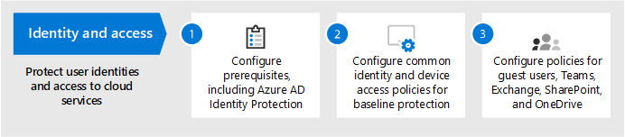
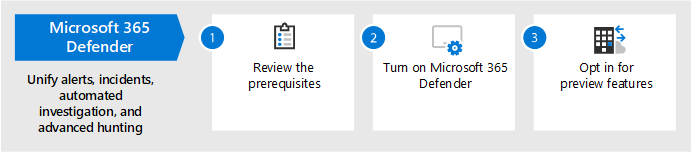

# 여러 사용자에 대해 위협 방지 Microsoft 365

다음 단계에 따라 여러 단계에 걸쳐 위협 방지를 Microsoft 365.

## 1단계: 다단계 인증 및 조건부 액세스 정책 설정

[MFA(다단계](/azure/active-directory/authentication/concept-mfa-howitworks) 인증)를 사용하려면 사용자가 전화 통화 또는 인증자 앱을 사용하여 ID를 확인해야 합니다. [조건부 액세스 정책은](/azure/active-directory/conditional-access/overview) 사용자가 해당 정책의 앱 및 데이터에 액세스하기 위해 충족해야 하는 특정 요구 사항을 Microsoft 365. MFA 및 조건부 액세스 정책은 함께 작동하여 조직을 보호합니다. 예를 들어 누군가 MFA를 사용할 수 없는 계정을 사용하여 모바일 장치에서 로그인을 시도하고 조건부 액세스 정책에 MFA가 적용되어야 하는 경우 해당 사용자는 로그인할 수 없습니다.  

Microsoft는 모든 SaaS 응용 프로그램, 특히 모든 SaaS 응용 프로그램에 대한 액세스를 보호하기 위한 특정 조건부 액세스 및 관련 정책 집합을 테스트하고 Microsoft 365. 정책은 기준, 중요 및 높은 규제 보호에 권장됩니다. 먼저 기준 보호에 대한 정책을 구현합니다.

 
 [이 이미지의 더 큰 버전 참조](https://github.com/MicrosoftDocs/microsoft-365-docs/raw/public/microsoft-365/media/microsoft-365-policies-configurations/identity-device-access-policies-byplan.png)

### 데이터 보호에 대한 기준 보호를 Microsoft 365

 

1. Azure AD ID 보호를 포함하여 [선행 구성](../security/office-365-security/identity-access-prerequisites.md)
2. [기준 보호를 위한](../security/office-365-security/identity-access-policies.md) 공통 ID 및 장치 액세스 정책을 구성합니다.
3. 게스트 [사용자,](../security/office-365-security/identity-access-policies-guest-access.md)Microsoft Teams , Exchange Online 및 SharePoint 온라인 및 OneDrive [구성합니다.](../security/office-365-security/sharepoint-file-access-policies.md)

### ID 보호에 대한 자세한 정보

- [ID 및 장치 액세스 구성](../security/office-365-security/microsoft-365-policies-configurations.md)
- [Azure MFA에 대한 보안 지침](/azure/active-directory/authentication/multi-factor-authentication-security-best-practices)

## 2단계: ID에 맞게 Microsoft Defender 구성

[Id에 대한 Microsoft Defender는](/defender-for-identity/what-is) 조직에 지시된 고급 위협, ID 손상 및 악의적인 내부자 작업을 식별, 감지 및 조사하기 위해 AD DS(Active Directory 도메인 서비스) 신호와 함께 작동하는 클라우드 기반 보안 솔루션입니다.

Microsoft Defender for Identity를 사용하면 하이브리드 환경에서 고급 공격을 감지하는 데 어려움을 겪는 보안 운영(SecOps) 분석가 및 보안 전문가가 사용할 수 있습니다.

- 학습 기반 분석을 사용하여 사용자, 엔터티 동작 및 활동을 모니터링합니다.
- Active Directory에 저장된 사용자 ID와 자격 증명을 보호합니다.
- 킬체인에서 수상한 사용자 활동과 고급 공격을 식별하고 조사합니다.
- 빠른 분류를 위해 간단한 시간 표시 막대에 명확한 인시던트 정보를 제공합니다.

### ID에 대해 Microsoft Defender를 설정

 

1. 기본 환경을 보호하기 [위해 ID에 대한 Microsoft Defender를](/azure-advanced-threat-protection/install-atp-step1) 설정하세요.
2. 모든 도메인 컨트롤러 [및](/azure-advanced-threat-protection/atp-sensor-monitoring) 포리스트를 [보호합니다.](/azure-advanced-threat-protection/atp-multi-forest)
3. [Microsoft Defender for Identity 경고를](/azure-advanced-threat-protection/suspicious-activity-guide?tabs=external) 보안 작업(SecOps) 워크플로에 통합합니다.

### Id용 Microsoft Defender에 대한 자세한 정보

- [Microsoft Defender for Identity란?](/azure-advanced-threat-protection/what-is-atp)
- [비디오: ID용 Microsoft Defender 소개](https://www.youtube.com/watch?reload=9&v=EGY2m8yU_KE)
- [Microsoft Defender for Identity 배포](/azure-advanced-threat-protection/what-is-atp#whats-next)

## 3단계: 설정 Microsoft 365 Defender

[Microsoft 365 Defender](../security/defender/microsoft-365-defender.md) 신호를 결합하고 기능을 단일 솔루션으로 오케스트레이션합니다. 통합된 Microsoft 365 Defender 솔루션을 사용하여 보안 전문가는 이러한 각 제품이 수신하는 위협 신호를 통합하고 위협의 전체 범위와 영향을 확인할 수 있습니다. 환경이 환경에 들어오고 있는 방법, 영향을 받는 방법 및 현재 조직에 미치는 영향 Microsoft 365 Defender 공격을 방지하거나 중지하고 영향을 받는 사서함, 끝점 및 사용자 ID를 자동으로 조치를 취합니다.

Microsoft 365 Defender 경고, 인시던트, 자동화된 조사 및 대응, 고급 헌팅(ID용 Microsoft Defender, Office 365용 Microsoft Defender, 끝점용 Microsoft Defender 및 Microsoft Cloud App Security)을 단일 유리 환경 창으로 통합합니다. 새로운 기능은 지속적으로 추가됩니다Microsoft 365 Defender. 미리 보기 기능을 받기 위해 옵트인(opt in)을 고려합니다.

### 다음을 설정 Microsoft 365 Defender

 

1. [선행 준비를 검토합니다.](../security/defender/prerequisites.md)
2. [를 Microsoft 365 Defender.](../security/defender/m365d-enable.md)
3. [미리 보기 기능을 옵트인(opt in)합니다.](../security/defender/preview.md)

### 자세한 내용은 Microsoft 365 Defender

- [Microsoft 365 Defender란 무엇인가요?](../security/defender/microsoft-365-defender.md)
- [Microsoft 365 Defender의 새로운 기능](../security/defender/whats-new.md)

## 4단계: 사용자에 대해 Microsoft Defender Office 365

[Microsoft Defender for Office 365](../security/office-365-security/defender-for-office-365.md) 전자 메일 메시지(첨부 파일 및 URL), 문서 및 공동 작업 도구에서 악의적인 위협을 Office 보호합니다. 다음 표에는 Microsoft Defender for Office 365 포함된 Microsoft 365 E5.

 

****

|구성, 보호 및 검색 기능|자동화, 조사, 수정 및 교육 기능|
|---|---|
|[안전한 첨부 파일](../security/office-365-security/safe-attachments.md) 
 [안전한 링크](../security/office-365-security/safe-links.md) 
 [안전한 문서](../security/office-365-security/safe-docs.md) 
 [SharePoint, OneDrive 및 Microsoft Teams용 안전한 첨부 파일](../security/office-365-security/mdo-for-spo-odb-and-teams.md) 
 [2016년 8월의 피싱 방지 Microsoft 365](../security/office-365-security/anti-phishing-protection.md)|[위협 트래커](../security/office-365-security/threat-trackers.md) 
 [위협 탐색기](../security/office-365-security/threat-explorer.md) 
 [자동화된 조사 및 응답](../security/office-365-security/office-365-air.md) 
 [공격 시뮬레이션 교육](../security/office-365-security/attack-simulation-training.md)|
|

Microsoft Defender for Office 365 통해 조직의 사용자들이 전자 메일 콘텐츠 및 문서의 위협 방지를 통해 보다 안전하게 통신하고 Office 수 있습니다.

### 사용자에 대해 Microsoft Defender를 Office 365

 

1. [정책 에 대한 Microsoft Defender를 Office 365 구성합니다.](../security/office-365-security/protect-against-threats.md)
2. [Microsoft Defender를 보고 보고서에 Office 365.](../security/office-365-security/view-reports-for-mdo.md)
3. [위협 조사 및 응답 기능을 사용 합니다.](../security/office-365-security/office-365-ti.md)

### Microsoft Defender for Office 365

- [Microsoft Defender for Office 365 개요](../security/office-365-security/defender-for-office-365.md)
- [Microsoft Defender for Office 365](../security/office-365-security/whats-new-in-defender-for-office-365.md)

## 5단계: 끝점용 Microsoft Defender 구성

[끝점용 Microsoft Defender는](/windows/security/threat-protection) 사이버 위협, 고급 공격 및 데이터 위반으로부터 조직 장치(끝점이라고도 지칭)를 보호합니다. 보안 팀은 끝점의 보안을 보다 효율적으로 관리할 수 있습니다. 강력한 도구는 조직이 위협 및 취약성 관리에서 취약점 감지를 사용하여 패치가 없는 시스템을 [유지하는 데 도움이 됩니다.](/windows/security/threat-protection/microsoft-defender-atp/next-gen-threat-and-vuln-mgt) 공격 표면 감소, 차세대 보호, 끝점 감지 및 대응, 자동화된 조사 및  수정과 같은 자동화된 감지 및 수정 기능은 장치를 맬웨어로부터 안전하게 유지하는 데 도움이 됩니다.  이러한 기능을 통해 고객은 옵트인 관리 헌팅 서비스의 일부로 사전 알림을 받고 Microsoft 위협 전문가 수 있습니다.

### 엔드포인트용 Microsoft Defender 설정

 

1. [끝점용 Microsoft Defender에 대한 환경을 준비합니다.](../security/defender-endpoint/deployment-phases.md)
2. [끝점용 Microsoft Defender를 배포합니다.](../security/defender-endpoint/production-deployment.md)
3. [끝점용 Microsoft Defender 서비스에 온보딩합니다.](../security/defender-endpoint/onboarding.md)
4. [최상위 보안 관리 작업을 완료합니다.](../security/defender-endpoint/tvm-security-recommendation.md)

### 끝점용 Microsoft Defender에 대한 자세한 정보

- [끝점용 Microsoft Defender에 대해 자세히 알아보시고 을(를) 자세히 알아보아야 합니다.](../security/defender-endpoint/microsoft-defender-endpoint.md)
- [Microsoft Defender for Endpoint 평가 랩을 시도해 보아야 합니다.](../security/defender-endpoint/evaluation-lab.md)

## 6단계: 구성 Microsoft Cloud App Security

[Microsoft Cloud App Security](/cloud-app-security) 로그 수집, API 커넥터 및 역방향 프록시를 지원하는 클라우드 액세스 보안 브로커입니다. Microsoft Cloud App Security 풍부한 가시성, 데이터 이동 제어 및 정교한 분석을 통해 모든 클라우드 서비스에서 사이버 위협을 식별하고 퇴치할 수 있습니다. Microsoft Cloud App Security 사용하여 보안 운영은 조직의 중요한 정보를 보호하고, 사이버 위협 및 이의로부터 보호하고, 조직의 데이터에 액세스하는 앱을 검색 및 모니터링하고, 조직의 클라우드 앱이 규정 준수 요구 사항을 충족하는지 확인합니다.

### 설정 Microsoft Cloud App Security

 

1. [포털 및 기타 기본 요구 사항을 설치합니다.](/cloud-app-security/general-setup)
2. [클라우드 검색을 설정하고](/cloud-app-security/set-up-cloud-discovery) [앱을 연결합니다.](/cloud-app-security/enable-instant-visibility-protection-and-governance-actions-for-your-apps)
3. 추천 앱에 대한 조건부 액세스 [앱 컨트롤을 배포합니다.](/cloud-app-security/proxy-deployment-aad)
4. [조사 도구 및 대시보드를 사용합니다.](/cloud-app-security/investigate)

### Microsoft Cloud App Security에 대한 자세한 정보

- [새 기능을 검토합니다.](/cloud-app-security/release-notes)
- [자세한 내용은 Microsoft Cloud App Security.](/cloud-app-security/what-is-cloud-app-security)

## 7단계: 상태 모니터링 및 작업 수행

위협 방지 서비스 및 기능을 설정하고 배포한 후 다음 단계는 위협 감지를 모니터링하고 적절한 조치를 취하는 것입니다. 가장 좋은 시작 지점은 Microsoft 365 보안 센터( )입니다. 여기서 Microsoft ID, 데이터, 장치, 앱 및 인프라에서 보안을 모니터링하고 관리할 [https://security.microsoft.com](https://security.microsoft.com) 수 있습니다.

보안 Microsoft 365 보안 센터는 보안 관리자 및 보안 운영 팀을 위한 것입니다. 보안 Microsoft 365 센터에서 다음을 할 수 있습니다.

- 보안 점수를 통해 조직의 전반적인 보안 [상태 보기](/microsoft-365/security/defender/microsoft-secure-score)
- [ID,](../security/defender-endpoint/threat-protection-reports.md) 데이터, 장치, 앱 및 인프라의 상태에 대한 보고서를 모니터링하고 볼 수 있습니다.
- 커넥트 를 통해 경고에 대한 점을 [표시합니다.](/microsoft-365/security/defender/incident-queue)
- 자동화된 [조사 및](../security/defender/m365d-autoir.md) 수정을 사용하여 위협을 해결합니다.
- [침입 시도](/microsoft-365/security/defender/advanced-hunting-overview)또는 전자 메일, 데이터, 장치 및 ID에 영향을 주는 위반 활동과 같은 위협을 사전 예방적으로 헌팅합니다.
- [위협 분석을 사용하여](/microsoft-365/security/defender/latest-attack-campaigns) 최신 공격 캠페인 및 기술을 이해합니다.
- ... 그리고 더 많은!

### 보안 센터에 대한 Microsoft 365 정보

- [보안 센터 에서 Microsoft 365 시작 합니다.](../security/defender/overview-security-center.md)
- [보고서를 모니터링하고 볼 수 있습니다.](../security/defender/overview-security-center.md)
- [에서 보안 포털을 Microsoft 365.](../security/defender/portals.md)

## 8단계: 사용자 교육

사용자를 교육하면 사용자 및 보안 운영 팀에 많은 시간과 좌절을 저장할 수 있습니다. 잘 아는 사용자는 첨부 파일을 열거나 의심스러운 전자 메일 메시지의 링크를 클릭할 가능성이 낮아 의심스러운 웹 사이트를 방지할 가능성이 더 습니다. 

하버드 Kennedy [학교](https://go.microsoft.com/fwlink/?linkid=2015598&amp;clcid=0x409) 사이버 보안 캠페인 핸드북은 피싱 공격을 식별하기 위한 교육을 포함하여 조직 내에서 강력한 보안 인식 문화를 설정하기 위한 훌륭한 지침을 제공합니다. 

Microsoft 365 조직의 사용자에게 알리는 데 도움이 되는 다음 리소스를 제공합니다.

 

****

|개념|리소스|
|---|---|
|Microsoft 365|[사용자 지정 가능한 학습 경로](/office365/customlearning/) 
 이러한 리소스는 조직의 최종 사용자를 위한 교육을 구성하는 데 도움이 될 수 있습니다.|
|Microsoft 365 보안|[Learning 모듈: 기본 제공 지능형 보안 기능으로 조직을 Microsoft 365](/learn/modules/security-with-microsoft-365) 
 이 모듈에서는 보안 기능이 함께 Microsoft 365 방법을 설명하고 이러한 보안 기능의 이점을 설명할 수 있습니다.|
|다단계 인증|[2단계 인증: 추가 확인 페이지란?](/azure/active-directory/user-help/multi-factor-authentication-end-user-first-time) 
 이 문서는 최종 사용자가 다단계 인증이 무엇일지와 조직에서 사용되는 이유를 이해하는 데 도움이 됩니다.|
|

이 지침 외에도 사용자는 이 문서에 설명된 작업을 수행하여 해커와 맬웨어로부터 계정 및 장치를 [보호하는 것이 좋습니다.](https://support.office.com/article/066d6216-a56b-4f90-9af3-b3a1e9a327d6.aspx) 이러한 작업은 다음과 같습니다.

- 강력한 암호 사용
- 장치 보호
- 관리되지 않는 Windows 10 및 Mac PC에서 보안 기능 사용

또한 다음 문서에서 권장하는 작업을 수행하여 사용자가 개인 전자 메일 계정을 보호하는 것이 좋습니다.

- [Outlook.com 전자 메일 계정 보호](https://support.microsoft.com/office/help-protect-your-outlook-com-email-account-a4f20fc5-4307-4ece-8231-6d4d4bd8a9ba)
- [2단계 인증을 사용하여 Gmail 계정 보호](https://go.microsoft.com/fwlink/?linkid=2015688&amp;clcid=0x409)
